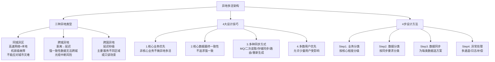
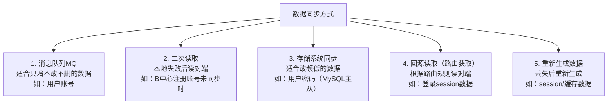
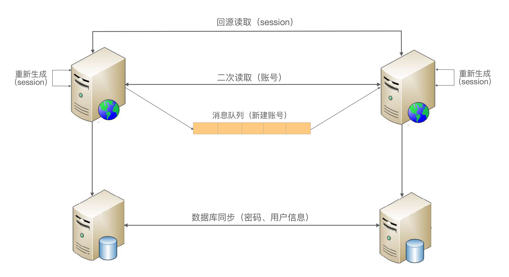
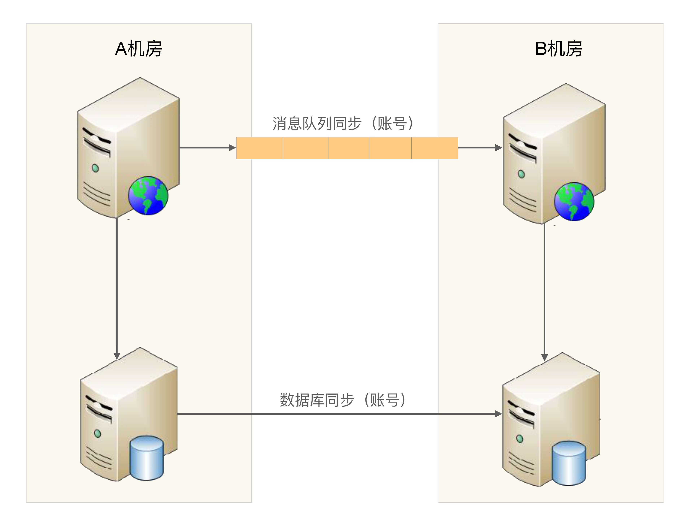
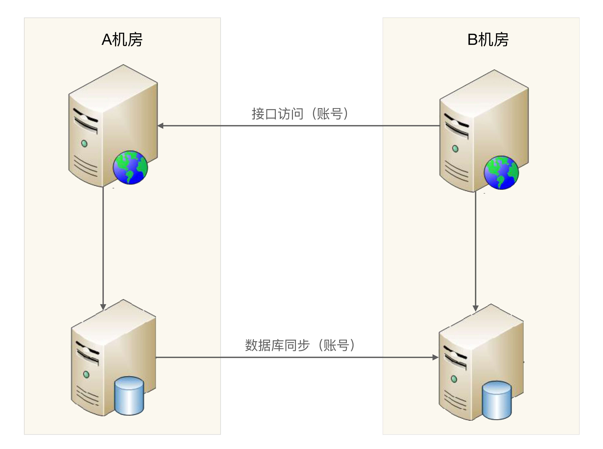
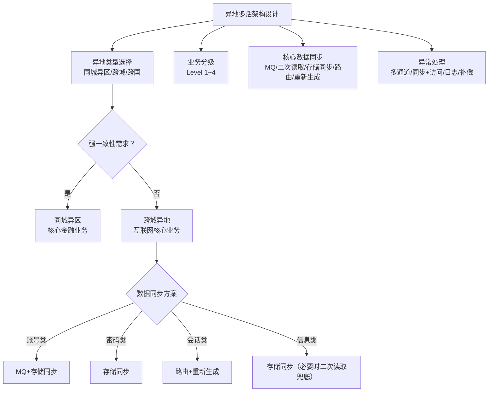

# 异地多活架构 | 同城异区·跨城异地·跨国异地·设计技巧·设计步骤

## 章节导言

上一章讨论的双机/集群/分区架构可以应对单机故障、机房级故障，但面对**城市级别灾难**（地震、水灾、火灾、停电）时，如果所有服务器都在同一城市，整个系统将全部瘫痪。即使有其他地区的备份，把备份系统全部恢复到能够正常提供业务，花费的时间也可能长达半小时甚至12小时——因为备份系统平时不对外提供服务，可能存在很多隐藏的问题没有发现。

异地多活是应对城市级别灾难的终极高可用方案——在多个城市部署独立的数据中心，每个中心都能独立承担核心业务。其关键在于"活"而非"备"——"备"需要大量人工干预才能变成"活"，而"活"意味着不同地点的系统都能直接提供业务服务。

异地多活不是简单的"多机房部署"，而是一套涉及业务裁剪、数据分类、同步策略、异常处理的系统工程。本章从三种异地类型出发，深入4大设计技巧和4步设计方法，最终落地到用户子系统和银行转账的完整实战案例。

**核心问题**：
1. 同城异区、跨城异地、跨国异地各自的网络特征与适用场景？
2. 为何跨城异地不能实现强一致性？光缆被挖断时系统如何应对？
3. 异地多活4大技巧：核心业务优先、最终一致性、多种同步方式、多数用户优先——如何落地？
4. 异地多活4步走：业务分类→数据分类→数据同步→异常处理——如何执行？
5. 用户子系统的账号、密码、Session如何设计差异化同步策略？
6. 为何银行转账做不到100%异地多活？

---

## 一、异地多活的三种类型

### 1.1 同城异区

**架构**：在同一城市不同区的多个机房，用专用高速网络连接。例如在北京海淀区部署一个机房，在通州区部署一个机房，两个机房用高速光纤连接。

**判断异地多活的两条标准**：
1. 正常情况下，用户无论访问哪一个地点的业务系统，都能够得到正确的业务服务
2. 某个地方业务异常的时候，用户访问其他地方正常的业务系统，能够得到正确的业务服务

**网络特征**：
- 两个机房之间网络质量几乎等同本地网络——传输延迟极小（1~2ms），带宽极大
- 应用部署在A机房，数据库在B机房，应用访问数据库的性能与在本机房几乎无差异
- 虽然是两个不同地理位置上的机房，但逻辑上可以将它们看作同一个机房——大大降低了设计和实现复杂度

**故障应对能力**：
- 能应对：机房级故障（停电、火灾、空调故障等）——这些故障发生概率远高于城市级灾难，且破坏力一样很大
- 不能应对：城市级灾难（美加大停电、新奥尔良水灾等）——整个城市基础设施瘫痪

**为何推荐**：结合复杂度、成本、故障概率综合考量，同城异区是**应对机房级故障的最优架构**。城市级灾难发生概率比较低，可能几年甚至十几年才发生一次，不能为了极低概率的灾难而大幅增加架构复杂度和成本。

### 1.2 跨城异地

**架构**：在不同城市部署机房，城市之间距离要足够远（如北京和广州，而非广州和深圳）。距离远是为了有效应对城市级灾难——两个城市离得太近无法应对如美加大停电这类问题。

**网络特征——距离是核心约束**：

光速真空传播约每秒30万千米，在光纤中约每秒20万千米，再加上传输中各种网络设备的处理，实际远达不到理论速度。

| 问题 | 说明 |
|------|------|
| **网络延迟** | 北京↔广州RTT约50ms，网络波动可达500ms甚至1s |
| **线路不可控** | 挖掘机挖断光纤、海底电缆被扯断、骨干网故障——第三方维护，无法预知和控制 |
| **丢包问题** | 频繁发生，延迟可能是几秒甚至几十秒 |

虽然同城异区理论上也会遇到上述问题，但由于同城距离短，中间经过的线路和设备较少，问题发生概率会低很多。而且同城距离短，搭建多条互联通道成本不会太高，而跨城距离太远，搭建或使用多通道的成本会高不少。

**强一致性的不可能性——互联网金融案例**：

假设做一个互联网金融业务，用户余额支持跨城异地多活，系统分别部署在广州和北京：
1. 用户A余额有10000元，北京和广州机房都是这个数据
2. 用户A向用户B转了5000元，操作在广州机房完成，完成后A在广州机房的余额是5000元
3. 由于广州和北京机房网络被挖掘机挖断，广州机房无法将余额变动通知北京机房，此时北京机房用户A的余额还是10000元
4. 用户A到北京机房又发起转账，看到余额还有10000元，向用户C转账10000元，完成后A的余额变为0
5. 用户A到广州机房一看，余额怎么还有5000元？于是赶紧又发起转账5000元给用户D

最终，本来余额10000元的用户A，却转了20000元出去。这种漏洞如果被黑客发现，后果不堪设想。正因为如此，支付宝等金融相关的系统，对余额这类数据，一般不会做跨城异地的多活架构，而只能采用同城异区这种架构。

**可做跨城异地多活的业务**：
- 用户登录——数据不一致时用户重新登录即可
- 新闻类网站——一天内新闻数据变化较少
- 微博类网站——丢失用户发布的微博或评论影响不大

### 1.3 跨国异地

**架构**：在不同国家部署机房。相比跨城异地，距离就更远了，数据同步的延时会更长，正常情况下可能就有几秒钟。

跨国异地的"多活"含义和跨城异地不同——几秒钟的延迟已无法满足"正常情况下用户无论访问哪个地点都能得到正确服务"的标准。例如用户A在上海机房发表微博，关注者B在美国纽约机房很可能无法看到刚发表的内容。

**两种应用场景**：

| 场景 | 说明 | 数据一致性要求 |
|------|------|--------------|
| **服务不同地区的用户** | 跨国企业为不同地区部署独立站点——如亚马逊早期的中国站服务中国用户、美国站服务美国用户，两国用户账号相互独立（亚马逊已于 2019 年关闭中国本土电商业务，此处为典型案例说明） | 数据不需要实时同步 |
| **只读场景** | 谷歌搜索——搜索结果基本相同，几秒延迟对搜索无影响 | 不需要写操作，数据单向同步即可 |

### 1.4 三种类型对比

| 维度 | 同城异区 | 跨城异地 | 跨国异地 |
|------|---------|---------|---------|
| **距离** | 同一城市 | 不同城市（要足够远） | 不同国家 |
| **网络延迟** | 1~2ms | 30~50ms（正常），500ms~1s（异常） | 100~200ms（正常），1s~3s（异常） |
| **强一致性** | 可行 | 不可行 | 不可行 |
| **应对故障** | 机房级 | 城市级 | 国家级 |
| **设计复杂度** | 低（当作本地机房） | **最高** | 低（只读/分地区服务） |
| **典型应用** | 金融核心交易 | 互联网核心业务 | 全球化服务/只读 |

**异地多活的代价**：
- 系统复杂度会发生质的变化
- 成本会上升——要多在一个或多个机房搭建独立的一套业务系统

不是每个业务都需要异地多活——新闻网站、企业内部IT系统、游戏、博客站点等，即使中断对用户影响不大，可以只做异地备份。而共享单车、滴滴出行、支付宝、微信这类业务中断后对用户影响很大，就需要做异地多活。

> **深度注记**：距离不是问题的全部，**光缆脆弱性**才是真正的风险。同城异区的光纤埋在同一城市的不同管道中，风险可控；跨城异地只有几根主干光缆，一旦中断影响巨大；跨国线路涉及多国运营商，恢复时间完全不可控。架构师在做跨城异地方案时，必须把"光缆中断"作为常态而非异常来设计。

---

## 二、跨城异地多活设计4大技巧

### 2.1 技巧一：保证核心业务的异地多活

**常见误区**：我要保证所有业务都能异地多活！

以用户子系统（注册/登录/用户信息）为例，如果3个业务同时做异地多活，会遇到难以解决的问题：

**注册问题**：A中心注册了用户，数据还未同步到B中心，此时A中心宕机。为了支持注册业务多活，可以让B中心让用户重新注册——但一个手机号只能注册一个账号，B中心无法判断手机号是否重复。如果允许注册，A中心恢复后数据冲突怎么解决？如果不允许，注册业务的多活又成了空谈。修改业务规则（允许一个手机号注册多个账号）是不可行的——核心业务规则的修改代价非常大。

**用户信息问题**：A、B两个中心在异常情况下都修改了用户信息，如何处理冲突？按时间合并——但多中心时间无法绝对一致，即使有时间同步，只要误差超过1秒数据就可能出现混乱。全局唯一递增ID？这个系统本身又要考虑异地多活，同样涉及数据一致性和冲突问题。

**登录没有问题**：每个中心都有所有用户的账号和密码信息，用户在哪个中心都可以登录。A中心宕机后，用户到B中心重新登录即可。如果密码还没同步到B中心，用户登录失败——这个问题涉及技巧二。

**关键决策**：优先实现核心业务的异地多活！对用户子系统来说，**登录才是最核心的业务**——日活1000万中，登录1000万、注册几万、修改信息不到1万。新用户注册不了的影响并不明显，因为还没有真正开始使用业务；但几百万用户登录不了，就相当于几百万用户无法使用业务。

**核心业务判断标准**：
- **访问量大的业务**：以用户管理系统为例，登录的访问量肯定是最大的
- **核心业务**：以QQ为例，QQ的主场景是聊天，QQ空间虽然也是重要业务，但和聊天相比重要性低一些
- **产生大量收入的业务**：QQ聊天很难为腾讯带来收益（没法插入广告），而QQ空间反而可能带来更多收益

### 2.2 技巧二：保证核心数据最终一致性

**常见误区**：我要所有数据都实时同步！

异地多活本质上是通过异地数据冗余来保证在极端异常情况下业务也能正常提供，因此数据同步是设计的核心。但异地多活理论上就不可能很快——这是物理定律决定的。

**无法彻底解决的矛盾**：业务上要求数据快速同步，物理上做不到数据快速同步。

**三种缓解方法**：

| 方法 | 说明 | 代价 |
|------|------|------|
| **减少机房距离** | 搭建高速网络，类似同城异区 | 跨城高速网络成本远超同城，只有巨头公司能承担 |
| **减少同步数据** | 只同步核心业务相关的数据 | 非核心数据丢失需用户重新操作（如重新登录） |
| **保证最终一致性** | 不保证实时一致，只保证最终一致 | 业务不依赖实时同步，允许5分钟甚至1小时后一致 |

**最终一致性的差异化处理**：

| 数据类型 | 可容忍延迟 | 处理方式 |
|---------|-----------|---------|
| 账号信息 | 较高（5分钟内） | B中心读取失败时根据路由规则去A中心请求（二次读取） |
| 用户信息 | 较低（5分钟后也可） | 正常同步即可，用户看到旧信息影响不大 |
| Session | 秒级 | 数据量大不需要同步，丢失后重新登录即可 |

**用户信息看到旧数据的处理**：用户在A中心修改了爱好为"旅游、美食、跑步"，同步到B中心前用户在B中心看到的是旧的"美食、游戏"——这个问题看起来无法解决，但结合技巧三和技巧四可以找到方案。

### 2.3 技巧三：采用多种手段同步数据

**常见误区**：只使用存储系统本身的同步功能！

存储系统自带同步在某些极端情况下无法满足业务需求：
- **MySQL 5.1**：复制是单线程的，网络抖动或大量数据同步时延迟可达十几分钟，且无法采取任何措施只能干等（MySQL 5.6 起已支持并行复制，但跨城场景下的延迟问题依然存在）
- **Redis 2.8之前**：从机宕机或断连后重连会触发全量主从复制——主机生成内存快照，从机无法提供对外服务，数据量大时恢复时间相当长

**五种数据同步手段**：

**方式1：消息队列**——账号数据只会创建，不会修改和删除（假设不提供删除功能），可以通过消息队列同步到其他业务中心。两个用户先后注册账号A和B，同步时即使先把B同步到异地机房再同步A，业务上也没有问题。

**方式2：二次读取**——某些情况下消息队列同步也延迟了，B中心本地拿不到账号数据时，根据路由规则再去A中心访问一次（第一次读取本地，本地失败后第二次读取对端），解决异常情况下同步延迟的问题。

**方式3：存储系统同步**——密码数据改频较低，用户不可能在1秒内连续改多次密码，所以通过数据库同步机制复制即可。

**方式4：回源读取**——Session数据量很大可以不同步，但当用户在A中心登录后访问B中心时，B中心拿到Session ID后根据路由判断属于A中心，直接去A中心请求Session数据。A中心宕机时则登录失败，让用户重新在B中心登录。

**方式5：重新生成数据**——对于回源读取场景，如果A中心宕机了，B中心请求Session数据失败，此时只能登录失败，让用户重新在B中心登录，生成新的Session数据。

**用户子系统综合同步方案**：

| 数据 | 同步方式 | 原因 |
|------|---------|------|
| 账号 | 消息队列 + MySQL主从双通道 | 只增不改不删，适合消息队列；双通道保障 |
| 密码 | MySQL主从同步 | 改频低，有时序要求（m→n不能先n后m），不能用消息队列 |
| Session | 不同步，回源读取 + 重新生成 | 数据量大，丢失可重新登录生成 |
| 用户信息 | MySQL主从同步 | 改频低 |

### 2.4 技巧四：只保证绝大部分用户的异地多活

**常见误区**：我要保证业务100%可用！

**残酷现实**：异地多活无法保证100%的业务可用性——光速和网络的传播速度、硬盘的读写速度、极端异常情况的不可控，都是无法100%解决的。

**银行转账案例**：小明在北京XX银行开了账号，如果小明要转账，一定要北京的银行业务中心才可用，否则就不允许小明自己转账。如果不这样——假设在北京和上海实现了实时转账的异地多活，某些异常情况下就可能出现小明只有1万元存款，在北京转给了张三1万元，然后又到上海转给了李四1万元，两次转账都成功了。这种漏洞被人利用后果不堪设想。

**变通方案**："转账申请"代替"实时转账"——小明在上海业务中心提交转账请求，但上海并不立即转账，而是记录请求后台异步发起真正的转账操作。如果北京业务中心不可用，转账请求等待重试；2个小时后北京恢复，此时去请求转账发现余额不够，转账请求失败。小明登录后看到转账申请失败，原因是"余额不足"。

**用户体验的损失**：本来一次操作的事情，需要分为两次——一次提交转账申请，另一次确认是否转账成功。

**补偿措施**：
- **挂公告**：说明现在有问题和基本原因，或发布"技术哥哥正在紧急处理"
- **事后补偿**：送代金券、小礼包等，减少用户抱怨
- **补充体验**：转账成功或失败后直接给用户发短信，免去用户反复登录确认

暴雪《炉石传说》2017年回档故障，给每个用户约200元人民币的补偿（1000金币+15卡牌包），结果玩家都求暴雪再来一次回档。

### 2.5 核心思想

> **采用多种手段，保证绝大部分用户的核心业务异地多活！**

四个关键词：**多种手段**（不只依赖存储同步）、**绝大部分用户**（忍0.01%损失）、**核心业务**（非所有业务）、**异地多活**（不是异地备份）。

> **深度注记**：4大技巧的本质是一套"妥协策略"——不追求全部业务多活（妥协业务范围），不追求强一致（妥协一致性），不追求单一同步方案（妥协一致性速度），不追求100%用户可用（妥协用户覆盖）。每一次妥协都是为了在有限资源下最大化核心业务的可用性。

---

## 三、异地多活设计4步走

### 3.1 第1步：业务分级

按照标准将业务分级，只为核心业务设计异地多活：

| 分级标准 | 说明 | 示例 |
|---------|------|------|
| 访问量大的业务 | 某个业务占总访问量的比例 | 登录>注册>用户信息 |
| 核心业务 | 业务主场景 | QQ聊天>QQ空间 |
| 产生大量收入的业务 | 直接带来收入的业务 | QQ空间（可插广告）可能>聊天（无法插广告） |

以用户管理系统为例，"登录"业务符合"访问量大的业务"和"核心业务"两条标准，因此将登录业务作为核心业务。

### 3.2 第2步：数据分类

挑选出核心业务后，对核心业务相关的数据进一步分析，识别数据特征：

| 分析维度 | 含义 | 影响 |
|---------|------|------|
| **数据量** | 总量+增删改量 | 量越大→同步延迟几率越高→方案需考虑 |
| **唯一性** | 多机房同类数据是否必须唯一 | 唯一→只能一个中心产生或设计分布式ID算法；不唯一→两个地方都可产生 |
| **实时性** | 修改后多久必须同步到异地 | 越高→同步方案越复杂 |
| **可丢失性** | 数据丢失后对业务的影响 | Session可丢失→不同步；用户ID不可丢失→必须同步 |
| **可恢复性** | 丢失后能否通过某种手段恢复 | 可恢复→降低复杂度。微博丢失可重发；密码丢失可找回；账号丢失不可恢复 |

**登录业务数据分析**：

| 数据 | 数据量 | 唯一性 | 实时性 | 可丢失性 | 可恢复性 |
|------|-------|--------|--------|---------|---------|
| 账号 | 大 | 必须 | 秒级 | 不可 | 不可 |
| 密码 | 中 | 必须 | 秒级 | 不可 | 可（找回密码） |
| Session | 大 | 无要求 | 秒级 | **可** | **可**（重新登录） |
| 用户信息 | 中 | 无要求 | 分钟级 | 不可 | 可（重新填写） |

### 3.3 第3步：数据同步

根据数据特征设计不同的同步方案：

| 同步方案 | 原理 | 适用数据 | 限制 |
|---------|------|---------|------|
| **存储系统同步** | MySQL主从/主主复制 | 改频低、有事务要求的数据 | 无法定制化；单通道瓶颈 |
| **消息队列同步** | Kafka/RocketMQ | 无事务性/无时序性要求的数据 | 有时序要求的数据不能用（密码m→n不能先n后m） |
| **重复生成** | 每个机房自行生成 | session/cookie/缓存 | 仅适用于可重复生成的数据 |

**登录业务同步方案**：

| 数据 | 同步方式 | 原因 |
|------|---------|------|
| 账号 | 消息队列 + MySQL同步 | 只增不改不删；双通道保障 |
| 密码 | MySQL同步 | 有时序要求（m→n），不能用消息队列 |
| Session | 不同步，回源读取 | 数据量大，可丢失可重新生成 |
| 用户信息 | MySQL同步 | 改频低 |

### 3.4 第4步：异常处理

假设异常必然发生，设计应对措施。异常处理的目的：
- 问题发生时，避免少量数据异常导致整体业务不可用
- 问题恢复后，将异常的数据进行修正
- 对用户进行安抚，弥补用户损失

**1. 多通道同步**：

针对用户账号数据，MQ同步通道可能中断或延迟严重，再增加MySQL同步作为备份——除非两个通道同时故障，否则能通过另一个通道继续同步。

设计关键点：
- 一般两通道即可，更多通道成本高收益低
- 两个通道必须走不同网络（一个内网一个公网），否则网络故障时两个通道同时故障
- 数据必须可重复覆盖——无论哪个通道先到哪个后到最终结果一样。新建账号数据符合，密码数据不符合（m→n不能先n后m）

**2. 同步和访问结合**：

B中心本地读取失败→根据路由规则访问A中心接口获取数据。

设计关键点：
- 接口访问和数据库同步走不同网络
- 数据有路由规则，能判断该访问哪个机房
- 优先读本地（大大降低跨机房访问数量），本地失败才跨机房访问——适合实时性要求非常高的数据

**3. 日志记录**：

关键操作前后记录日志，故障恢复后对比修复。

| 日志保存方式 | 应对故障级别 | 复杂度 |
|------------|------------|--------|
| 服务器保存日志 | 单台数据库故障 | 低 |
| 本地独立系统保存 | 服务器+数据库同时宕机（同机架/同电源） | 中 |
| 日志异地保存 | 机房宕机 | 高 |

**4. 用户补偿**：

系统保证99.99%的用户不受影响，人工补偿0.01%的损失——代金券、礼包、红包。有时为了赢得用户口碑，付出的成本可能比较大，但综合最终收益来看很值得。

> 暴雪《炉石传说》2017年回档故障补偿：1000游戏金币+15个卡牌包（经典x5、上古之神的低语x5、龙争虎斗加基森x5），约价值200元人民币。

---

## 四、银行转账案例：为何100%异地多活是不可能的

### 4.1 业务场景

用户A在北京机房，用户B在广州机房。A向B转账100元。

**强一致性要求**：A扣100元和B加100元必须在同一个事务中——要么同时成功，要么同时失败。这是资金安全的基本要求。

### 4.2 异地多活的困境

**方案1：强一致性（同步复制）**——A扣100元，同步通知广州机房加100元，广州确认后整个事务提交。问题：RTT ~50ms加上处理时间，单次转账至少100ms以上；异常时可能超过1s；光缆中断时广州无法参与事务——要么A无法转出（不可用），要么允许A单独扣款（不一致）。

**方案2：最终一致性（异步复制）**——A扣100元后立即返回，异步通知广州加100元。问题：如果通知失败，A扣了钱但B没收到——资金安全事件，金融领域绝对不允许。

**方案3：对账补偿**——A扣100元后记录日志，异步通知广州。如果通知失败，通过日志和对账机制发现并修复。问题：修复需要时间，修复前B的余额是错误的。

### 4.3 结论

银行转账这样的核心金融业务，在跨城异地场景下无法做到100%的异地多活。这不是技术能力的问题，而是**物理规律的约束**。

银行的实际做法：
- 核心账务系统部署在同一城市（同城异区），保证强一致性
- 非核心业务（查询、营销活动）可以跨城部署
- 跨城转账通过"异地代理"机制处理——A先扣款并记录，通过消息传递到B机房执行加款，整体是"最终一致性+对账补偿"

> **深度注记**：银行转账案例揭示了异地多活的一个根本矛盾——**业务要求强一致性，而物理规律不允许跨城强一致性**。架构师的工作不是消灭这个矛盾，而是在约束条件下找到最优解。

---

## 五、异地多活架构全景

---

## 总结

| 核心要点 | 关键结论 |
|---------|---------|
| 同城异区 | 高速光纤≈本地网络；应对机房级故障的最优方案；不能应对城市级灾难 |
| 跨城异地 | RTT 30~50ms正常，可飙至500ms~1s；强一致性数据不能跨城多活；可做最终一致性业务 |
| 跨国异地 | 延迟秒级；只适合分区域服务或只读场景 |
| 技巧一 | 只保证核心业务异地多活——登录是核心（日活1000万），注册不是（日活几万） |
| 技巧二 | 核心数据最终一致性——不追求所有数据实时同步，只同步核心数据 |
| 技巧三 | 5种同步方式：MQ、二次读取、存储同步、回源读取、重新生成——不同数据选不同方案 |
| 技巧四 | 保证多数用户，允许少量用户受影响——100%可用性不可能，忍0.01%损失 |
| 步骤一 | 业务分类：按访问量/核心程度/收入分级 |
| 步骤二 | 数据分类：按数据量/唯一性/实时性/可丢失性/可恢复性分析 |
| 步骤三 | 数据同步：账号→MQ+MySQL, 密码→MySQL, Session→路由+重新生成, 用户信息→存储同步（必要时二次读取兜底） |
| 步骤四 | 异常处理：多通道同步+同步访问结合+日志记录+用户补偿 |
| 银行转账 | 强一致性+跨城延迟=无法100%异地多活；解法：同城强一致+跨城最终一致+对账补偿 |
| 光缆风险 | 城市间主干光缆数量有限，被挖断是常态而非异常，必须作为设计约束 |

**思考题**：
1. 假如你来设计电商网站的高可用系统，按照CAP理论的要求，你会如何设计？
2. 如果我们做了数据分区备份，又通过自动化运维保证1分钟就能将全部系统正常启动，那是否意味着没有必要做异地多活了？
3. 业务分级讨论时，产品说A也很重要（影响用户使用），B也很重要（影响收入），C也很重要（导致投诉）——如何处理？
4. 如果底层存储采用OceanBase这种分布式强一致性数据存储系统，是否就可以做到和业务无关的异地多活？

**关联阅读**：
- [CAP理论与高可用存储](10-CAP理论与高可用存储.md)
- [接口级故障与安全](12-接口级故障与安全.md)
- [复杂度来源：高可用](05-复杂度来源.md)

---

> **延伸视角**
>
> 华仔从架构设计的角度系统梳理了异地多活的方案与技巧，许式伟从服务治理的视角补充了几个关键洞见：
>
> **1. 异地多活是稳定性治理的最高阶形态**。许式伟将可用性方案分为四个递进层次：单机房冗余→同城双活→异地多活→全球化部署。异地多活处于第三层，其复杂度远超前两层——不只是"多部署一套系统"，而是涉及数据一致性、流量调度、故障切换的系统性工程。很多团队跳过同城双活直接做异地多活，往往因为基础能力不足而失败。
>
> **2. 故障预案是异地多活的"最后一公里"**。架构设计再完善，如果没有可执行的故障预案，等于纸上谈兵。许式伟特别强调"预案必须定期演练"——未经演练的预案在真实故障中大概率会失败。Netflix的Chaos Monkey就是将"预案演练"自动化：随机杀掉生产环境节点，验证系统自愈能力。
>
> **3. 流量调度能力是异地多活的核心基础设施**。异地多活的故障切换本质上是流量调度——将用户请求从故障机房切换到健康机房。需要全局流量调度系统（基于DNS+GSLB），且切换速度需在分钟级甚至秒级。DNS缓存TTL是流量调度的关键参数——TTL太短增加DNS查询量，TTL太长故障时切换慢。HTTP DNS基于HTTP协议提供DNS解析，绕过传统DNS，结合客户端DNS缓存，可解决DNS生效不及时的问题。
>
> **4. 容量规划是异地多活运营的关键**。华仔聚焦设计阶段，许式伟补充了运营阶段：异地多活上线后，各机房的容量规划、弹性伸缩、过载保护都需要持续运营。特别是流量切换后的"渐进式恢复"——不是一刀切恢复，而是负载均衡逐步放开流量，观察数据库是否稳定。
>
> **融合洞见**：华仔的4大技巧和4步方法是异地多活的"设计蓝图"，许式伟的稳定性治理框架和故障预案是"落地保障"。两者结合才能实现真正的异地多活：设计阶段用华仔的方法论确保方案完备性，运营阶段用许式伟的治理框架确保方案可执行、可演练、可回滚。最终的"绝大部分用户的核心业务异地多活"，是在物理约束（光速/网络延迟）和业务约束（数据一致性）之间做出的**最优权衡**。

---

## 附录：异地多活架构的深度延伸

### A.1 异地多活与异地备份的本质区别

| 维度 | 异地备份 | 异地多活 |
|------|---------|---------|
| 正常状态下备用系统 | 不提供服务，只做备份 | 提供业务服务 |
| 故障切换时间 | 小时级（需启动系统、检查数据、切换流量） | 分钟级甚至秒级 |
| 系统验证 | 备份系统平时不对外服务，可能存在隐藏问题 | 多活系统持续运行，问题能被及时发现 |
| 成本 | 低（只部署基础环境） | 高（需部署完整业务系统） |
| 数据一致性 | 只需单向同步 | 需要双向或多向同步 |
| 适用场景 | 对可用性要求不高的业务 | 核心业务、对可用性要求极高的业务 |

异地备份的典型问题：平时不对外提供服务的备份系统，可能存在很多隐藏的问题没有发现——配置过期、数据格式不兼容、依赖服务缺失等。一旦需要切换到备份系统，这些问题才暴露出来，反而延长了恢复时间。

### A.2 数据同步方案对比

| 同步方式 | 延迟 | 可靠性 | 数据约束 | 适用场景 |
|---------|------|--------|---------|---------|
| 消息队列（MQ） | 秒级 | 高（MQ本身高可用） | 数据必须可重复覆盖 | 账号数据（只增不改不删） |
| 二次读取 | 实时 | 依赖源机房可用性 | 无特殊约束 | 偶尔需要最新数据的场景 |
| 存储系统同步 | 秒~分钟级 | 高（存储系统自带） | 受存储系统限制 | 改频低的数据（密码、用户信息） |
| 回源读取（路由获取） | 实时 | 依赖源机房可用性 | 数据有明确路由规则 | Session等按用户ID路由的数据 |
| 重新生成 | 无需同步 | 最高（不依赖同步） | 数据可重新生成 | Session、缓存、统计数据 |

### A.3 异常处理机制的层次化设计

异地多活的异常处理机制可以看作一个四层递进的防线：

**第一层：预防（多通道同步）**——通过多条同步通道降低单通道故障的影响。核心设计原则：不同通道走不同网络（内网/公网），避免单点网络故障导致所有通道同时不可用。

**第二层：检测（同步+访问结合）**——不只被动等待数据同步，在用户访问时也尝试获取最新数据。核心设计原则：优先读本地（减少跨机房访问），本地失败才跨机房读取。

**第三层：恢复（日志记录）**——关键操作前后记录日志，故障恢复后回放日志修复数据。日志保存级别需匹配故障级别：
- 服务器保存→应对单台数据库故障
- 本地独立系统保存→应对服务器+数据库同时宕机
- 日志异地保存→应对机房宕机

**第四层：兜底（用户补偿）**——当系统无法自动修复时，提供用户自助修复入口或人工补偿。这不是"甩锅"，而是最后一道防线——在极端情况下保证用户有可操作的路径。

### A.4 异地多活的成本分析

| 成本项 | 同城异区 | 跨城异地 | 跨国异地 |
|-------|---------|---------|---------|
| 机房建设 | 中（同城土地成本相近） | 高（需在多个城市建设） | 极高（跨国部署） |
| 网络互联 | 低（短距离高速光纤） | 高（长距离专线/公网） | 极高（跨国专线） |
| 系统部署 | 低（当作本地机房） | 高（需设计数据同步） | 高（需设计数据同步） |
| 运维团队 | 低（可共用运维） | 中（需多地运维） | 高（需多时区运维） |
| 带宽费用 | 低 | 高（跨城数据传输） | 极高（跨国数据传输） |

**成本与收益的权衡**：异地多活的成本高昂，但相比业务中断的损失可能是值得的。以电商为例：大促期间每分钟的交易额可能达到百万级，1小时的业务中断意味着6000万以上的交易损失。而异地多活的年化成本可能是千万级——从ROI来看是合理的。

### A.5 Netflix Chaos Monkey与故障演练

Netflix的Chaos Monkey是故障演练的典范——在生产环境中随机杀掉实例，验证系统的自愈能力。这种"故意制造故障"的做法看似疯狂，实则深刻：

- 如果系统无法承受随机实例故障，说明架构存在隐患
- 通过持续演练，团队对故障的处理越来越熟练
- 发现的问题可以提前修复，避免真实故障时措手不及

异地多活架构同样需要故障演练——定期模拟机房级故障，验证流量切换、数据同步、异常处理等机制是否按预期工作。未经演练的预案在真实故障中大概率会失败。

### A.6 DNS在异地多活中的关键角色

DNS是异地多活流量调度的入口。关键问题：

- **DNS缓存TTL**：TTL太短（如10秒）增加DNS查询量；TTL太长（如1小时）故障时切换慢
- **递归DNS不遵守TTL**：部分递归DNS服务器会忽略TTL，缓存更长时间
- **HTTP DNS**：基于HTTP协议提供DNS解析，绕过传统DNS体系，客户端可控缓存策略，解决DNS生效不及时的问题
- **GSLB（全局负载均衡）**：根据用户地理位置和机房健康状态，动态返回最优的机房IP

DNS层面的故障切换速度通常在分钟级（取决于TTL和递归DNS行为），而VIP层面的故障切换可以在秒级。两者配合使用：DNS做机房级流量调度，VIP做机房内负载均衡切换。

### A.7 用户子系统数据同步的完整方案详解

以一个用户管理系统为例，系统部署在北京和广州两个机房，核心业务是登录。以下是每类数据的完整同步方案设计：

**账号数据（用户ID、昵称、头像URL）**：

同步方案：MQ + MySQL主从双通道

详细流程：
1. 用户在北京机房注册新账号
2. 北京机房将账号数据写入本地MySQL
3. 北京机房同时通过MQ（走公网）将注册消息推送到广州机房
4. 广州机房消费MQ消息，将账号数据写入本地MySQL
5. MySQL主从同步（走内网）作为MQ的兜底通道
6. 如果MQ消费延迟或异常，广州机房还可以通过二次读取（根据路由规则直接访问北京机房接口）获取账号数据

为何账号数据适合MQ：账号只会创建，不会修改和删除（假设不提供删除功能）。两个用户先后注册账号A和B，即使同步时先把B同步到异地机房再同步A，业务上也没有问题——因为账号是独立的，没有时序依赖。

为何需要双通道：MQ通道可能延迟或故障，MySQL存储同步作为兜底保障。两条通道走不同网络（MQ走公网，MySQL走内网），避免单条网络故障时两条通道同时不可用。

为何双通道可行：账号数据是可重复覆盖的——无论MQ先到还是MySQL先到，最终结果是一样的（都是"账号存在"）。

**密码数据（密码hash）**：

同步方案：MySQL主从同步（单通道）

详细流程：
1. 用户在北京机房修改密码
2. 北京机房将密码hash写入本地MySQL
3. MySQL主从同步将密码变更复制到广州机房

为何密码不能用MQ：密码修改有时序要求——用户先改密码为m，然后改密码为n，必须先同步m再同步n。如果MQ同步时先同步n再同步m，用户密码就变成了m而不是n。而MySQL主从同步保证了事务的时序性——binlog按顺序写入，按顺序复制，不会出现顺序错乱。

为何密码只需单通道：密码修改频率极低（一般用户几个月甚至几年才改一次密码），MySQL主从同步的延迟通常在秒级，完全可以满足业务需求（5分钟内一致即可）。

**Session数据**：

同步方案：不同步，回源读取 + 重新生成

详细流程：
1. 用户在北京机房登录，北京机房生成Session数据
2. 用户访问广州机房时，广州机房根据用户ID路由判断Session属于北京机房
3. 广州机房直接去北京机房请求Session数据（回源读取）
4. 如果北京机房宕机，广州机房请求Session数据失败，登录失败
5. 用户在广州机房重新登录，广州机房生成新的Session数据（重新生成）

为何Session不做数据同步：Session数据量大（每秒可能有百万级Session），同步这些数据的网络开销巨大。而且Session数据是可丢失的——丢失后用户重新登录即可生成新的Session。

为何回源读取是首选：用户在某个机房登录后，大部分请求会路由到同一个机房（通过DNS或HTTP DNS做就近路由），因此回源读取的跨机房访问量不大。

为何重新生成是兜底：当源机房宕机时，回源读取失败。此时唯一的选项是让用户重新登录，在当前机房生成新的Session数据。这对用户的影响只是需要重新输入密码或点击一次登录按钮——相比同步所有Session数据的代价，这个影响完全可以接受。

**用户信息数据（昵称、兴趣、简介等）**：

同步方案：MySQL主从同步 + 二次读取兜底

详细流程：
1. 用户在北京机房修改用户信息
2. 北京机房将用户信息变更写入本地MySQL
3. MySQL主从同步将变更复制到广州机房（通常秒级延迟）
4. 正常情况下，用户在广州机房也能看到最新的用户信息
5. 如果MySQL同步延迟较大，广州机房的用户可能看到旧的用户信息
6. 对此影响不大的业务（用户看到旧信息影响不大），可以不做二次读取

为何用户信息只用MySQL同步：用户信息修改频率低（大多数用户很长时间不修改信息），容忍延迟较大（看到5分钟前的旧信息几乎无感知），MySQL主从同步完全可以满足。

为何不做二次读取兜底：对用户信息来说，看到旧数据的影响很小（只是兴趣/简介显示旧值），不值得为此增加二次读取的代码复杂度和跨机房访问量。但如果业务要求必须看到最新信息，也可以增加二次读取作为兜底。

### A.8 异地多活架构的演进路径

从一个单机房架构到完整的异地多活架构，通常需要经历以下演进步骤：

**阶段一：同城异区**（成本较低，复杂度可控）
- 在同城部署两个机房，高速光纤互联
- MySQL主从复制跨机房部署
- 应用服务无状态化，通过DNS就近路由
- 此阶段能应对机房级故障

**阶段二：跨城异地（核心业务）**（成本高，复杂度大幅上升）
- 在另一个城市部署机房
- 只为核心业务（如登录）做异地多活
- 核心数据采用差异化同步方案
- 建立异常处理机制（多通道同步、日志记录、用户补偿）
- 此阶段能应对城市级灾难（仅核心业务）

**阶段三：跨城异地（全业务）**（成本极高，需要完善的运营体系）
- 所有核心业务都做异地多活
- 完善的故障预案和定期演练
- 全局流量调度系统
- 完善的可观测性和报警体系
- 此阶段能应对城市级灾难（全部业务）

> **关键建议**：不要跳过阶段一直接做阶段二或三。同城异区是验证基础能力（数据同步、流量调度、故障预案）的最佳场景——复杂度可控，且能应对最高频的机房级故障。只有基础能力验证充分后，才应推进到跨城异地。

### A.9 光缆中断的应急响应流程

当跨城光缆中断时，异地多活系统需要按照以下流程进行应急响应：

**1. 故障检测（0~1分钟）**：
- 监控系统检测到跨机房同步延迟飙升
- 心跳检测发现跨机房网络不可达
- 报警系统触发跨机房网络故障告警

**2. 影响评估（1~3分钟）**：
- 确认哪些业务受到影响
- 评估数据不一致的范围和程度
- 确认各机房是否独立可用

**3. 业务保障（3~10分钟）**：
- 核心业务（登录）切换到单机房模式
- 非核心业务（注册、用户信息修改）可能暂时降级
- 启动异常处理机制（多通道同步切换、日志记录增强）

**4. 持续运营（10分钟~恢复）**：
- 各机房独立运行，保证核心业务可用
- 定期检查同步延迟是否恢复
- 记录所有操作日志，为恢复后的数据修复做准备

**5. 故障恢复（光缆修复后）**：
- 检查各机房数据差异
- 按照数据同步策略逐步恢复数据一致性
- 验证数据一致性后恢复双机房正常运行

**6. 复盘总结（恢复后1周内）**：
- 分析光缆中断的原因和持续时间
- 评估业务受影响的范围和程度
- 总结经验教训，更新故障预案

### A.10 异地多活与CAP理论的映射

异地多活的设计本质上是CAP理论在地理级别故障场景下的工程落地：

| 异地多活设计技巧 | CAP理论对应 |
|----------------|------------|
| 只保证核心业务 | CAP粒度是数据不是系统——按数据特征分别选择策略 |
| 核心数据最终一致性 | BASE理论——承认"完美CP不存在"，选择最终一致性 |
| 多种同步方式 | CAP忽略网络延迟——不同的数据用不同的方式应对延迟 |
| 只保证多数用户 | CAP放弃不等于什么都不做——在约束下找到最优解 |
| 同城异区 | CA可兼得——高速网络使同机房性能近似 |
| 跨城异地 | CP/AP选择——强一致数据选CA（同城），最终一致数据选AP（跨城） |
| 跨国异地 | AP的极端形式——只有只读/分地区服务场景适用 |

这种映射关系说明：异地多活的所有设计技巧，都可以在CAP/BASE理论中找到理论依据。理论指导实践，实践验证理论——这正是架构设计的科学性所在。

