# 接口级故障与安全 | 降级·熔断·限流·排队·纵深防御·认证授权·可观测性·根因分析

## 章节导言

异地多活应对的是**系统级故障**（机器宕机、机房故障、网络中断），这类故障影响大但发生概率较低。实际运行中更常见的是**接口级故障**——系统没宕机、网络没中断，但业务出问题了：响应缓慢、大量超时、大量异常。

接口级故障的典型表现：数据库慢查询将服务器资源耗尽→读写超时→业务读写数据库时无法连接或超时→用户看到访问很慢，一会儿异常一会儿正常。

接口级故障的根本原因是**系统压力过大、负载过高**，导致无法快速处理请求，引发雪崩效应。解决思路与异地多活一脉相承：**优先保证核心业务，优先保证绝大部分用户**。

同时，安全是高可用的另一面——攻击（DDoS、SQL注入、XSS）本身就是导致接口级故障的外部原因之一。纵深防御体系和认证授权机制，既是安全保障，也是可用性保障。

本章还涵盖可观测性（日志/指标/追踪）、故障域与预案、过载保护、根因分析等运营阶段的可用性保障体系——从"看见故障"到"应对故障"到"根治故障"的完整链路。

**核心问题**：
1. 降级、熔断、限流、排队四种手段各自的原理和适用场景？
2. 限流算法（时间窗/漏桶/令牌桶）如何选择？各自的技术本质是什么？
3. 安全纵深防御体系如何构建？XSS/SQL注入/CSRF/SSRF的核心防御？
4. OAuth 2.0四种授权流程的原理与Trade-off？JWT的撤销方案？
5. RBAC vs ABAC如何选择？零信任架构的核心原则？
6. 可观测性三大支柱和四个黄金指标如何指导监控设计？
7. 过载保护的多层策略？重试放大器如何导致雪崩？
8. 根因分析5-Whys方法与4大常见陷阱？

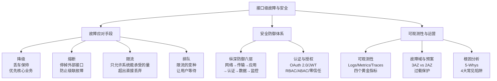

---

## 一、接口级故障的四种应对手段

接口级故障的两大原因：
1. **内部原因**：程序bug导致死循环、某个接口导致数据库慢查询、程序逻辑不完善导致耗尽内存
2. **外部原因**：黑客攻击、促销或抢购引入了几倍甚至几十倍的用户、第三方系统大量请求或响应缓慢

解决的核心思想：**优先保证核心业务**和**优先保证绝大部分用户**。

### 1.1 降级

**降级 = 丢车保帅，优先保证核心业务**

将某些业务或接口的功能降低，可以是只提供部分功能，也可以是完全停掉。

**降级示例**：
- 论坛降级为只能看帖子不能发帖子
- 也可以降级为只能看帖子和评论，不能发评论
- App日志上传接口完全停掉一段时间

降级的核心思想就是丢车保帅——论坛90%的流量是看帖子，优先保证看帖功能；App日志上传接口是辅助功能，故障时完全可以停掉。

**两种降级实现方式**：

| 方式 | 原理 | 优势 | 劣势 |
|------|------|------|------|
| **系统后门降级** | 预留降级URL，访问即执行降级指令（URL参数传入具体指令），也会在URL中加入密码等安全措施 | 实现成本低 | 安全隐患；服务器多时需逐台操作——故障处理争分夺秒时浪费时间 |
| **独立降级系统** | 将降级操作独立到单独系统，实现权限管理、批量操作 | 批量操作（一键降级所有服务器）；权限管理（操作审计）；可集成监控（降级状态实时展示） | 实现复杂度较高 |

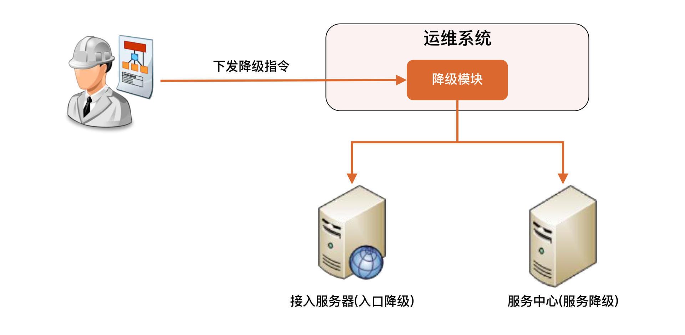

### 1.2 熔断

**熔断 = 按照规则停掉外部接口的访问，防止依赖的外部系统故障导致级联故障**

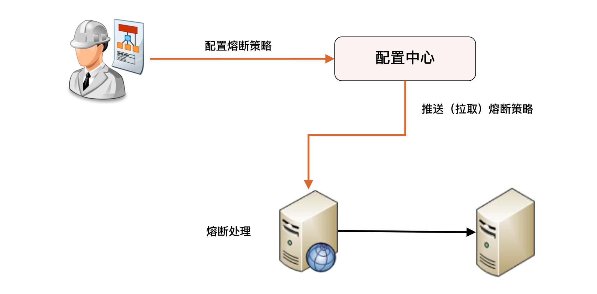

**降级 vs 熔断**——两个容易混淆的概念：

| 维度 | 降级 | 熔断 |
|------|------|------|
| 目的 | 应对**自身**系统故障 | 应对**依赖的外部系统**故障 |
| 主动方 | 管理员/系统主动关闭功能 | API调用层自动检测触发 |
| 触发条件 | 人工判断或预设规则 | 阈值自动触发（如30%请求超时） |

**级联故障场景**：A服务的X功能依赖B服务的某个接口。B接口响应慢→A的X功能被拖慢→A的线程都卡在X处理上→A的其他功能也被卡住或响应很慢→A整个服务被拖死。

**熔断机制**：A服务不再请求B服务的这个接口，A内部发现是请求B接口就立即返回错误→A的其他功能恢复正常。

**熔断两个关键实现点**：

1. **统一的API调用层**：由API调用层进行采样或统计。如果接口调用散落在代码各处，就没法统一处理
2. **阈值设计**：如"1分钟内30%请求响应超过1秒就熔断"——"1分钟""30%""1秒"都对最终熔断效果有影响。实践中先根据分析确定阈值，然后上线观察效果，再进行调优

### 1.3 限流

**限流 = 只允许系统能承受的访问量进来，超出直接丢弃**

虽然"丢弃"听起来不舒服，但保证一部分请求正常响应，总比全部请求都不能响应要好得多。限流一般都是系统内实现的。

#### 基于请求限流

| 方式 | 原理 | 适用场景 |
|------|------|---------|
| **限制总量** | 某指标的累积上限 | 直播间100万人上限、抢购1万人上限 |
| **限制时间量** | 一段时间内某指标上限 | 1分钟10000用户、每秒10万峰值 |

**难点**：阈值难以确定——32核和64核机器性能不是2倍关系（可能是1.5倍甚至1.1倍）；压测覆盖场景有限；需逐步调优。适合业务功能比较简单的系统——负载均衡系统、网关系统、抢购系统。

#### 基于资源限流

从系统内部找关键资源限制使用上限：连接数、文件句柄、线程数、请求队列、CPU占用率等。

- 例如：Netty服务器请求队列最大10000，队列满就拒绝；CPU占用率超过80%就拒绝新请求
- 优势：比基于请求更有效反映系统实际压力
- 难点：如何确定关键资源和阈值——需逐步调优

### 1.4 排队

**排队 = 限流的变种，让用户等待而非直接拒绝**

全世界最有名的排队当属12306。排队需要用独立系统（如Kafka）缓存大量请求：

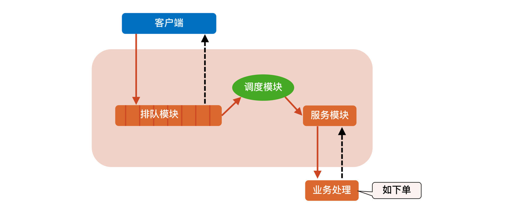

**排队系统三大模块**：
- **排队模块**：接收用户抢购请求，FIFO保存。每个商品一个队列，大小根据参与秒杀的商品数量定义
- **调度模块**：排队模块到服务模块的动态调度。检查服务模块空闲后从队列头上拉取请求，动态调节拉取速度
- **服务模块**：调用真正业务处理，返回结果，回写排队模块

> **深度注记**：排队虽然没有直接拒绝，但用户等了很长时间后体验不一定比限流好。排队适合秒杀等用户预期需要等待的场景。

### 1.5 四种手段对比

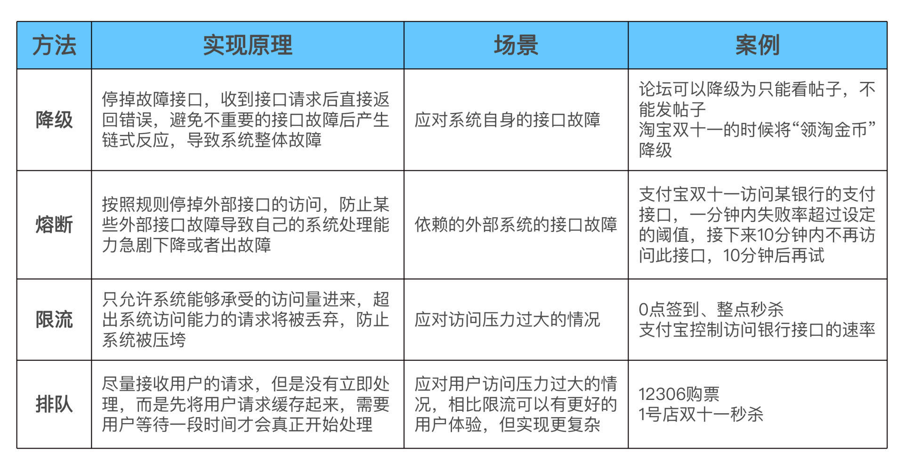

| 手段 | 应对场景 | 核心思想 | 实现方式 |
|------|---------|---------|---------|
| **降级** | 系统自身故障 | 丢车保帅 | 系统后门/独立降级系统 |
| **熔断** | 依赖的外部系统故障 | 快速失败，避免级联 | 统一API调用层+阈值 |
| **限流** | 系统过载 | 控制入口流量 | 基于请求/基于资源 |
| **排队** | 突发高并发 | 缓冲请求，匀速处理 | Kafka等消息队列 |

---

## 二、限流算法详解

### 2.1 时间窗算法

#### 固定时间窗

统计固定时间周期内的请求量或资源消耗量，超过限额就启动限流。

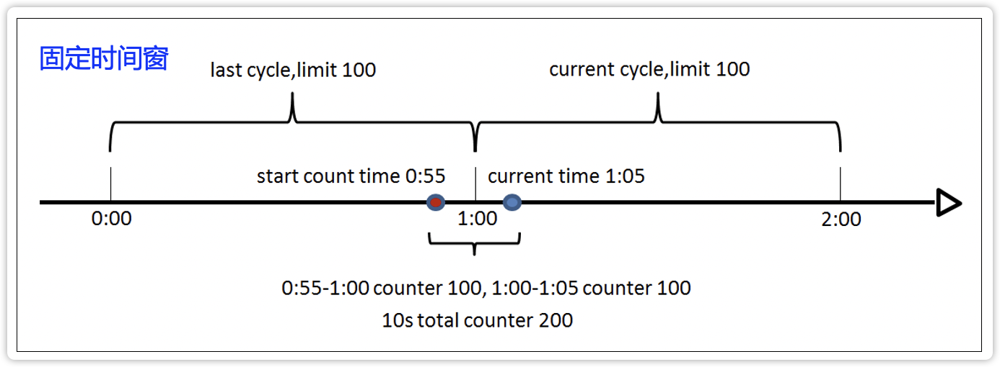

**优点**：实现简单。**缺点**：**临界点问题**——上图中红蓝两点间隔仅10秒，期间请求数已达200（超过1分钟100的限额），但因为分别属于两个统计窗口，单个窗口都未超限，不会启动限流，可能导致系统因压力过大而挂掉。

#### 滑动时间窗

两个统计周期部分重叠，避免短时间内两个统计点分属不同时间窗的情况。

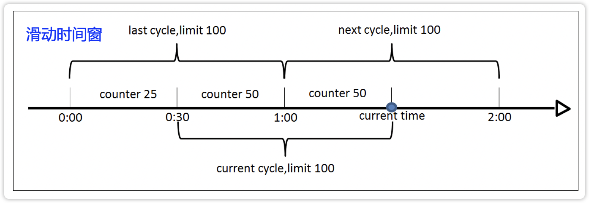

限流效果比固定时间窗更好，但实现稍微复杂一些。

### 2.2 桶算法

#### 漏桶算法

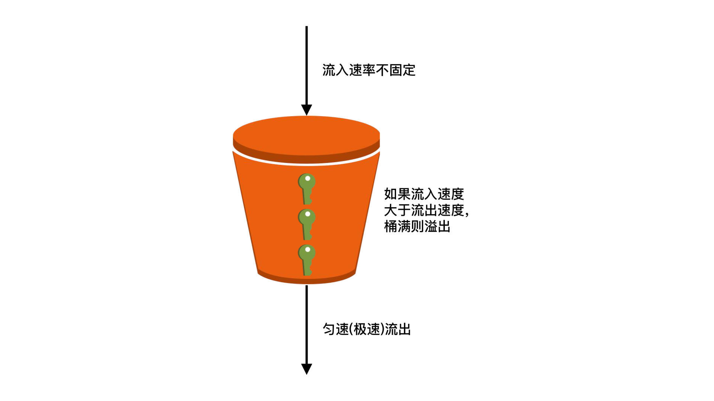

**三个关键实现点**：
1. **流入速率不固定**：可能瞬间流入非常多请求（0点签到、整点秒杀）
2. **匀速(极速)流出**：即使大量请求进入漏桶，流出速度是匀速的，最大值是系统极限处理速度。注意：如果漏桶没有堆积，流出速度等于流入速度，此时流出速度不是匀速的
3. **桶满则丢弃请求**：漏桶容量有限（如100万个请求），满了直接丢弃

**漏桶算法的技术本质是总量控制**，桶大小是设计关键：
- 突发大量流量时丢弃的请求较少——漏桶本身有缓存请求的作用
- 桶大小动态调整比较困难（如Java BlockingQueue）——需不断尝试才能找到最佳桶大小
- 无法精确控制流出速度，也就是业务的处理速度

**适用场景**：瞬时高并发流量（0点签到、整点秒杀）——即使处理慢一些，也要做到尽量不丢弃用户请求。

#### 令牌桶算法

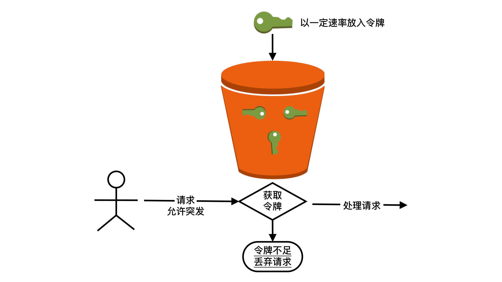

**三个关键设计点**：
1. 处理单元以可控速率往桶里放令牌
2. 桶里可以累积一定数量的令牌——突发流量来时，累积的令牌允许业务处理速度暂时超过令牌放入速度
3. 令牌不足时即使系统有能力处理也会丢弃请求

**令牌桶算法的技术本质是速率控制**，令牌产生的速率是设计关键：
- 可动态调整处理速率，实现灵活
- 突发大量流量时可能丢弃很多请求——令牌桶不能累积太多令牌
- 实现相对复杂

**适用场景**：
- 控制访问第三方服务的速度（如支付宝控制访问银行接口的速率）
- 控制自己的处理速度（压测TPS 100→令牌桶限制最大100）

#### 漏桶 vs 令牌桶

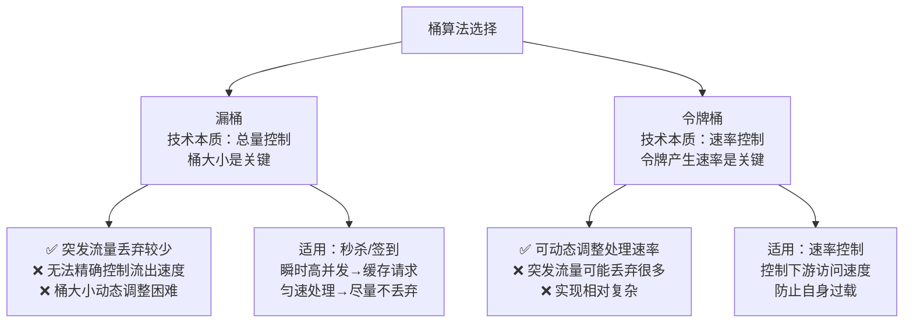

**关键区别**：令牌桶的"允许突发"只是"允许一定程度的突发"（100 TPS→120可以，100→1000不行）。秒杀高并发还是得用漏桶。

令牌桶原本是网络设备控制传输速度的，控制目的是保证一段时间内的**平均传输速率**。"允许突发"是指网络环境下可以允许某几秒超过平均速率——对应"网络抖动"场景。但短时间突发不会导致雪崩，网络设备也处理得过来。

对应到业务处理场景，要求即使有突发流量，系统或下游要**真的能处理得过来**——否则令牌桶允许突发流量进来，结果系统处理不了，还是会被压垮。因此令牌桶的桶大小不能像漏桶那样设计很大——漏桶桶容量可以100万，但每秒30 TPS的令牌桶桶容量可能只能40左右。

> 海外某银行给移动钱包提供的接口TPS上限30，压测到40就真的挂了。令牌桶的"允许突发"在实际设计中必须极其保守。

---

## 三、安全：纵深防御体系

### 3.1 安全的核心认知

> **安全不是状态，而是过程。** 不存在绝对安全的系统，只存在攻击成本高于攻击收益的平衡点。架构师的任务不是追求零漏洞，而是建立纵深防御体系，使攻击者面对的是多层防线而非单点突破。

### 3.2 攻击分类与防御

| 层次 | 典型攻击 | 根本防御手段 |
|------|----------|------------|
| **网络层** | SYN Flood、IP欺骗、DDoS | SYN Cookie、入口过滤、流量清洗+CDN |
| **传输层** | 会话劫持、MITM | TLS/HTTPS、证书锁定 |
| **应用层** | XSS、SQL注入、CSRF、SSRF | 输出编码、参数化查询、CSRF Token、URL白名单 |

**XSS（跨站脚本攻击）**——攻击者将恶意脚本注入网页，其他用户浏览时脚本在浏览器中执行，可窃取Cookie、劫持会话、篡改页面内容。

三种类型：反射型（嵌入URL参数，点击恶意链接触发）、存储型（存入数据库，所有访问用户受害，**危害最大**）、DOM型（前端JS直接读取URL/页面参数动态写入DOM触发）。

防御方案：
1. **输出编码（根本手段）**：根据输出上下文（HTML标签/属性/JS/URL内）对用户输入进行对应编码转义
2. **CSP（Content Security Policy）**：通过HTTP头`Content-Security-Policy`限制页面可加载的资源来源，禁止内联脚本执行。例如：`Content-Security-Policy: default-src 'self'; script-src 'self' https://trusted.cdn.com`
3. **HttpOnly Cookie**：设置`Set-Cookie: ...; HttpOnly`，禁止JS通过`document.cookie`访问会话Cookie，降低XSS窃取会话的风险
4. **输入验证（辅助手段）**：白名单校验，拒绝不符合格式的输入。输入验证是辅助手段，输出编码是根本

**SQL注入**——攻击者将恶意SQL片段注入用户输入，改变后端SQL语句的语义，实现未授权的数据读取、修改或删除。

```sql
-- 原始 SQL
SELECT * FROM users WHERE username = '$username' AND password = '$password'
-- 攻击：username = "admin'--"
SELECT * FROM users WHERE username = 'admin'--' AND password = 'anything'
-- 注释掉密码验证，直接以admin身份登录
```

防御方案：
1. **参数化查询（根本手段）**：使用占位符替代字符串拼接，数据库驱动自动处理转义
2. **ORM框架**：成熟ORM（Hibernate、SQLAlchemy）默认使用参数化查询
3. **最小权限**：数据库用户仅授予业务所需最小权限，禁止应用使用DBA账号
4. **输入验证（辅助）**：类型和格式校验，不可作为唯一防御手段

**CSRF（跨站请求伪造）**——攻击者诱导已登录用户访问恶意页面，利用浏览器自动携带Cookie的特性，以用户身份执行非预期操作。

防御方案：
1. **CSRF Token（核心）**：服务器为每个表单/请求生成随机Token，攻击者受同源策略限制无法获取Token
2. **SameSite Cookie**：`SameSite=Strict`或`SameSite=Lax`限制Cookie仅在同站请求中发送。Strict最安全但影响体验（从外部链接进入不携带Cookie），Lax是推荐默认值
3. **双重Cookie验证**：要求请求在Cookie和请求体中同时携带Token，验证一致
4. **验证Origin/Referer头**：检查请求来源是否为合法域名（但可能被部分场景省略）

**SSRF（服务端请求伪造）**——攻击者利用服务端发起请求的功能，使服务端向内网资源发起请求，绕过防火墙。

典型场景：应用提供URL预览功能，攻击者输入`http://169.254.169.254/latest/meta-data/`（云环境元数据接口）或`http://127.0.0.1:6379/`（内网Redis）。

防御方案：
1. **URL白名单**：仅允许请求预定义的域名/IP
2. **禁止内网地址**：过滤RFC 1918私有地址（10.0.0.0/8, 172.16.0.0/12, 192.168.0.0/16）、环回地址和链路本地地址
3. **网络隔离**：应用服务器与内网服务部署在不同网络区域，通过安全组/防火墙限制出站流量
4. **禁用重定向跟随**：防止外网URL重定向到内网地址

**MITM（中间人攻击）**——攻击者在通信双方之间插入自己，窃听、篡改通信内容。

防御方案：
1. **HTTPS（TLS）**：TLS的证书体系确保客户端连接的是真实服务器，加密确保中间人无法窃听或篡改
2. **证书锁定（Certificate Pinning）**：移动端应用内嵌服务器证书或公钥哈希，拒绝非预期证书
3. **HSTS**：通过`Strict-Transport-Security`响应头告知浏览器仅使用HTTPS连接，防止SSL剥离攻击

> **深度注记**：防御的根本手段优于辅助手段——参数化查询优于输入过滤，输出编码优于输入验证，TLS优于自定义加密。输入验证是"不允许坏数据进入"，输出编码是"确保坏数据不被解释执行"，二者互补而非替代。

### 3.3 纵深防御六层架构

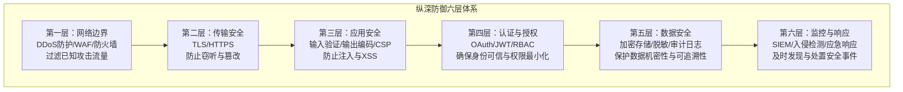

### 3.4 安全设计原则与Trade-off

| 原则 | 含义 | Trade-off |
|------|------|-----------|
| **最小权限** | 仅授予完成任务所需的最小权限 | 权限粒度越细→管理复杂度越高；关键资源用细粒度，普通资源用角色级粗粒度 |
| **纵深防御** | 多层弱防线替代单层强防线 | 多层→运维复杂度和性能开销（TLS加解密、WAF规则匹配） |
| **默认安全** | 系统默认配置应是安全的 | 可能限制功能或降低性能；新系统默认安全，遗留系统渐进加固 |
| **安全vs可用性** | 安全措施强度应与资产价值匹配 | 过度安全→用户绕过安全措施（弱密码/便利贴写密码）；安全不足→数据泄露 |
| **安全通过隐蔽（反模式）** | "接口地址不知道就是安全的" | 错误！信息总可能泄露（反编译、日志、内部人员）；正确做法是Kerckhoffs原则——假设攻击者了解全部实现细节 |

**OWASP Top 10（2021版）**——安全审计的事实标准：
1. A01-失效的访问控制
2. A02-加密机制失败
3. A03-注入
4. A04-不安全的设计
5. A05-安全配置错误
6. A06-易受攻击和过时的组件
7. A07-身份识别和认证失败
8. A08-软件和数据完整性失败
9. A09-安全日志和监控失败
10. A10-服务器端请求伪造（SSRF）

> **时效提示**：以上为 OWASP Top 10（2021 版）。OWASP 已于 2025 年 11 月发布新版 Top 10（2025）：A01 失效的访问控制、A02 安全配置错误（上移）、A03 软件供应链失效（由"易受攻击和过时的组件"扩展而来）、A04 加密机制失败、A05 注入、A06 不安全的设计、A07 身份识别和认证失败、A08 软件和数据完整性失败、A09 日志和告警失败、A10 异常条件处理失误（新增），SSRF 不再单列。实际使用时应以最新版为准（见 owasp.org/Top10/2025）。

---

## 四、认证与授权

### 4.1 认证 vs 授权

| 维度 | 认证（Authentication） | 授权（Authorization） |
|------|------------------------|----------------------|
| 核心问题 | 你是谁？ | 你能做什么？ |
| 输入 | 身份凭据（密码/Token/证书） | 身份标识 + 操作请求 |
| 输出 | 身份声明 | 允许/拒绝 |
| 失败后果 | 身份无法确认，拒绝进入 | 权限不足，拒绝操作 |
| 实现层次 | 通常集中式（IdP） | 通常分布式（各业务服务） |

**关键架构原则**：**认证集中化，授权分散化**——认证由IdP统一处理，授权分散到各业务服务。集中认证引入单点依赖——IdP不可用时所有服务无法认证。解决：JWT的无状态验证在IdP不可用时可继续工作；Refresh Token的更新走降级路径。

**认证因素分类**：
- **知识因素（Something You Know）**：密码、PIN码、安全问题
- **持有因素（Something You Have）**：手机（短信验证码）、硬件Token（U2F/FIDO2）、智能卡
- **固有因素（Something You Are）**：指纹、面部识别、虹膜识别
- **多因素认证（MFA）**：组合两种以上因素，大幅提高攻击成本。NIST SP 800-63B已建议淘汰短信验证码（SIM Swap攻击），推荐FIDO2/WebAuthn

### 4.2 OAuth 2.0：授权框架

OAuth 2.0核心目标：**让用户授权第三方应用访问其在另一服务上的资源，而无需向第三方透露密码。**

**四种授权流程**：

| 流程 | 安全性 | 适用场景 | 说明 |
|------|--------|---------|------|
| **授权码模式（Authorization Code）** | 最安全（推荐） | Web应用后端 | 授权码通过浏览器传递，Token通过后端到后端通信获取——浏览器不接触Token |
| **隐式模式（Implicit）** | 已弃用 | — | Token直接通过浏览器返回，安全风险高 |
| **密码模式（Resource Owner Password）** | 仅限高度可信客户端 | 第一方应用 | 用户直接将密码给第三方——仅限完全信任的场景 |
| **客户端凭据模式（Client Credentials）** | 服务间通信 | 微服务间调用 | 不涉及用户，客户端用自己的凭据获取Token |

**授权码模式完整流程**：
1. 客户端将用户重定向至授权服务器（携带client_id、redirect_uri、scope、state）
2. 用户在授权服务器认证并确认授权
3. 授权服务器重定向回客户端（携带授权码code和state）
4. 客户端用授权码向授权服务器换取Token（后端到后端通信，携带client_secret）
5. 授权服务器返回Access Token + Refresh Token
6. 客户端携带Token访问资源服务器

**state参数的必要性**：防止CSRF攻击——客户端生成随机state，授权服务器原样返回，客户端验证一致性后才使用授权码，防止攻击者伪造授权码注入。

**PKCE扩展**：移动端/SPA无法安全存储client_secret时使用。客户端生成code_verifier和其哈希code_challenge，授权码请求携带code_challenge，Token请求携带code_verifier，授权服务器验证对应关系，防止授权码被截获后滥用。

**OIDC（OpenID Connect）**：OAuth 2.0是授权框架而非认证协议。OIDC在OAuth 2.0之上增加身份层：新增id_token（JWT格式，包含用户身份信息sub、name、email等）和/userinfo端点。

> **常见反模式**：用OAuth Access Token当作身份凭证——Access Token是授权凭据，不包含身份断言。Access Token的格式是不透明的，其内容可能随时变化。正确做法：使用OIDC的ID Token作为身份凭证，Access Token仅用于授权。

### 4.3 JWT：双刃剑

JWT = Header.Payload.Signature，三部分用`.`分隔。Header和Payload仅Base64Url编码（**不是加密**）——任何持有JWT的人都能读取Payload内容。

**标准声明（Claims）**：

| 声明 | 全称 | 含义 |
|------|------|------|
| iss | Issuer | 签发者 |
| sub | Subject | 主题（用户标识） |
| aud | Audience | 接收方 |
| exp | Expiration Time | 过期时间 |
| nbf | Not Before | 生效时间 |
| iat | Issued At | 签发时间 |
| jti | JWT ID | 唯一标识（防重放） |

| 优势 | 劣势 |
|------|------|
| 无状态——无需查库验证，天然支持水平扩展 | **无法主动撤销**——签发后exp到期前始终有效 |
| 自包含——Payload携带用户标识和元数据 | Payload不加密——敏感信息不应放入JWT |

**三种撤销方案**：

| 方案 | 原理 | 代价 |
|------|------|------|
| **短有效期+Refresh Token** | Access Token 5-15分钟，Refresh Token较长可撤销 | 最实用，推荐。高频验证无状态，低频刷新有状态 |
| **Token黑名单** | Redis维护已撤销Token，每次验证检查 | 黑名单仅Token剩余有效期内需维护，过期自动清理 |
| **版本号机制** | 用户表维护Token版本号，撤销时递增 | 验证时需查库，牺牲无状态性 |

**JWT验证流程**：格式正确→解码Header提取算法→算法是否允许（防alg:none攻击）→验证签名→检查exp/nbf/iss/aud→验证通过。

> **常见反模式**：JWT中存储敏感信息（密码、身份证号、银行卡号）。JWT的Payload仅Base64Url编码，任何人都能解码查看。正确做法：JWT中仅存储最小必要的身份标识（sub）和元数据（exp、iss等），敏感信息通过API按需获取，且受授权控制。如需保密应使用JWE（JSON Web Encryption）。

### 4.4 RBAC vs ABAC

**RBAC（基于角色的访问控制）**：

用户→角色→权限，用户不直接关联权限，通过角色间接获得权限。

| 层级 | 名称 | 特性 |
|------|------|------|
| RBAC0 | 扁平RBAC | 用户-角色-权限的基本映射 |
| RBAC1 | 层次RBAC | 角色可继承（"超级管理员"继承"管理员"的所有权限） |
| RBAC2 | 约束RBAC | 角色互斥（"出纳"和"审核"不能同一人）、基数约束 |
| RBAC3 | 统一RBAC | RBAC1 + RBAC2的组合 |

**RBAC的局限**：
1. **角色爆炸**：权限组合复杂时角色数量急剧增长（如"部门A管理员+部门B审核员"需为每种组合创建角色）
2. **缺乏上下文感知**：无法表达"仅在工作时间可访问"或"仅能操作本部门资源"
3. **变更滞后**：组织架构变化时，角色-权限映射需同步调整，存在权限残留风险

**ABAC（基于属性的访问控制）**：

基于主体属性、资源属性、操作属性和环境属性的组合评估访问决策：
- 主体属性：部门、职级、认证级别
- 资源属性：类型、密级、归属部门
- 操作属性：动作类型
- 环境属性：时间、IP、设备

**ABAC的优势**：细粒度控制、动态适应（属性变化自动影响权限）、策略集中管理。
**ABAC的代价**：性能开销（每次评估多个属性和策略）、可理解性差（复杂策略难以审查）、调试困难（权限拒绝时难以追溯）。

| 维度 | RBAC | ABAC |
|------|------|------|
| 适用 | 企业应用（ERP/CRM） | 云平台IAM、多租户SaaS |
| 优势 | 简单直观 | 细粒度、动态适应 |
| 劣势 | 角色爆炸、缺乏上下文 | 性能开销、调试困难 |

**实践建议**：RBAC为基础（粗粒度），ABAC为补充（细粒度条件约束）。

**微服务中的权限实现**：
- **认证前置，授权下沉**：网关负责认证（验证JWT、提取身份），各业务服务负责授权
- **权限缓存**：权限决策结果可短时间缓存（如30秒），需平衡实时性
- **服务间信任**：使用Service Account + mTLS实现服务间认证

### 4.5 零信任架构

> **永不信任，始终验证**——无论请求来自内网还是外网。

传统安全模型基于网络边界——内网可信，外网不可信。零信任否定这一假设。

**零信任核心原则**：
1. **持续验证**：每次访问都需认证和授权，不依赖网络位置
2. **最小权限**：仅授予完成当前任务所需的最小权限
3. **假设违约**：假设系统已被入侵，设计微隔离和横向移动防御
4. **全链路加密**：所有通信使用mTLS，包括服务间内部通信

**Trade-off**：零信任显著增加了认证/授权的调用频率和复杂度，需要强大的身份基础设施和高性能策略引擎支撑。

---

## 五、可观测性：从看见故障到应对故障

### 5.1 可观测性三大支柱

| 支柱 | 数据特征 | 核心价值 | 典型工具 |
|------|---------|---------|---------|
| **Logs（日志）** | 高基数、高体积、非/半结构化 | 事后诊断、审计追踪 | ELK, Loki |
| **Metrics（指标）** | 低基数、低延迟、数值型时序 | 实时监控、趋势分析、报警 | Prometheus, InfluxDB |
| **Traces（链路追踪）** | 请求级关联、跨服务传播 | 分布式根因定位、性能剖析 | Jaeger, Zipkin |

三大支柱协同：异常检测→根因定位→影响评估。

### 5.2 四个黄金指标

Google SRE提出的四个黄金指标是监控设计的核心框架：

| 指标 | 含义 | 关键点 |
|------|------|--------|
| **延迟（Latency）** | 请求处理耗时 | 区分成功/失败请求的延迟；"慢"错误比"快"错误更糟——极少量慢错误可能导致吞吐大幅降低 |
| **流量（Traffic）** | 系统负载度量 | 不同系统指标不同——Web用HTTP QPS，流媒体用I/O速率，KV存储用TPS |
| **错误（Errors）** | 请求失败数量 | 包括显式失败(500)+隐式失败(200但报错)+策略性失败(超时即视为失败) |
| **饱和度（Saturation）** | 容量使用程度 | 最需预测的指标；很多系统在100%利用率前性能就严重下降；99%请求延迟增加是饱和度早期预警 |

> 长尾问题与直方图：平均值具有欺骗性。如果某服务每秒处理1000请求，平均延迟100ms，但1%的请求耗时5s——在依赖多个服务的场景下，某个后端的P99延迟很可能成为前端延迟的中位数。正确做法是将请求按延迟分组计数构建**直方图**，边界定义为指数型增长（倍数约为3）。

### 5.3 报警设计三原则

一个完善的监控系统不是"报警很多很完善"的系统，而是**信噪比高、有故障就报警、有报警就直指根因**的系统。

1. **信噪比高**——极低误报率，避免"狼来了效应"（报警过多→被忽略）
2. **有故障就报警**——完整覆盖率，避免"监控事故"（客户先于监控发现故障）
3. **有报警就直指根因**——高效排障，避免报警风暴（一个故障产生大量报警）

**报警设计决策清单**——添加新报警规则前必须回答：
- 该规则能否检测到目前检测不到的、紧急的、即将发生的用户可见故障？
- 收到报警后是否需要立即操作？该操作能否被安全自动化？
- 该报警是否确实显示用户正在受到影响？
- 每个紧急报警是否代表一个新问题？不应彼此重叠

**监控精度vs监控成本**：高精度数据采集成本高昂。通过**采样+汇总**可以降低成本——按秒记录CPU利用率，按5%粒度分组计数+1，每分钟汇总一次。这种方式可以观测短暂热点，又不需要高额存储成本。

**监控项的增与删**：添加监控项是最难的事情——它看起来像事务工作，实际上非常依赖架构能力。**少就是指数级的多！** 优秀的监控SRE不是不停地添加监控项，而是经常重构监控指标，用最少的监控项全面覆盖系统健康状况。

---

## 六、故障域与预案

### 6.1 故障域的层级结构

故障域（Fault Domain）是指一个故障可能影响的范围边界。**故障的影响范围不是均匀的，而是沿着物理和逻辑的边界传播。**

全局域→区域域→机房域→机架域→交换机域→服务器域→进程域

**设计目标**：让故障的影响被最小化地隔离在最小故障域内。

**各故障点的预案策略**：

| 故障点 | 故障特征 | 预案策略 | 关键技术 |
|--------|---------|---------|---------|
| 用户端网络 | 个体不可控 | 多链路域名+客户端链路选择 | HTTP DNS, 多域名 |
| DNS | 解析中断影响全部入口 | 多权威DNS+多递归DNS+HTTP DNS | DNS容灾, HTTP DNS |
| 机房 | 整机房服务中断 | 多机房容灾（推荐3AZ） | 3AZ架构, 跨机房流量调度 |
| 机架 | 整机架机器下线 | 服务+数据分散编排 | 反亲和调度 |
| 负载均衡 | 入口级故障 | VIP技术自动切换 | VIP虚IP |
| 业务服务 | 单实例故障 | 无状态设计+负载均衡自动重试 | 服务无状态化 |
| 缓存 | 部分实例故障影响命中率 | 一致性哈希+自动重建 | 分片算法, 延迟容忍 |
| 数据库 | 主节点故障 | 主从选举+过载保护 | Master选举, 限流降级 |

### 6.2 3AZ vs 2AZ架构

机房级容灾是最复杂也最关键的预案：

| 维度 | 2AZ | 3AZ（推荐） |
|------|-----|------------|
| 总成本 | 2x | 1.5x |
| 一个AZ故障后 | 一半节点下线→**数据库无法选主** | 多数节点存活→选举正常 |
| 流量承载 | 单AZ承载全部 | 两AZ共同承载，压力均匀 |

**3AZ的三大优势**：
1. **成本更低**：1.5x vs 2x
2. **数据库选举更安全**：一个AZ下线后多数节点仍存活，可以正常选主
3. **故障恢复更平滑**：两个存活AZ共同承载流量，压力分布均匀

### 6.3 数据库雪崩的恢复策略

数据库过载导致雪崩时的恢复策略——**先让数据库能正常服务，再逐步放开流量**：

1. 负载均衡丢弃足够多的请求
2. 数据库逐步恢复正常
3. 逐步减少丢弃量
4. 观察数据库负载是否稳定
5. 若不稳定，回到第1步

核心原则：不是一刀切恢复，而是渐进式释放。

### 6.4 无状态vs有状态

这是影响故障预案策略的核心架构决策：
- **无状态服务**：任何实例故障不影响用户，负载均衡自动重试即可
- **有状态服务**：故障恢复涉及数据一致性，是容灾最复杂的问题

业务架构应尽量做到"**业务服务无状态，状态集中到中间件**"——这是强大的基础架构带来的好处，让业务更轻松。

### 6.5 灰度发现的局限

灰度发布能发现大部分短期故障，但**无法发现具有长潜伏期的故障**。例如数据库规模达到临界点导致的操作异常——故障爆发时点与风险产生时点间隔太远，不容易定位，且对有状态服务而言可能是不可控制的灾难。消除此类风险只能依靠严谨的白盒代码审查和全面测试覆盖率。

---

## 七、过载保护与容量规划

### 7.1 过载的本质与传播

过载不是孤立事件——在依赖链上，一个服务的过载会向上下游传播：

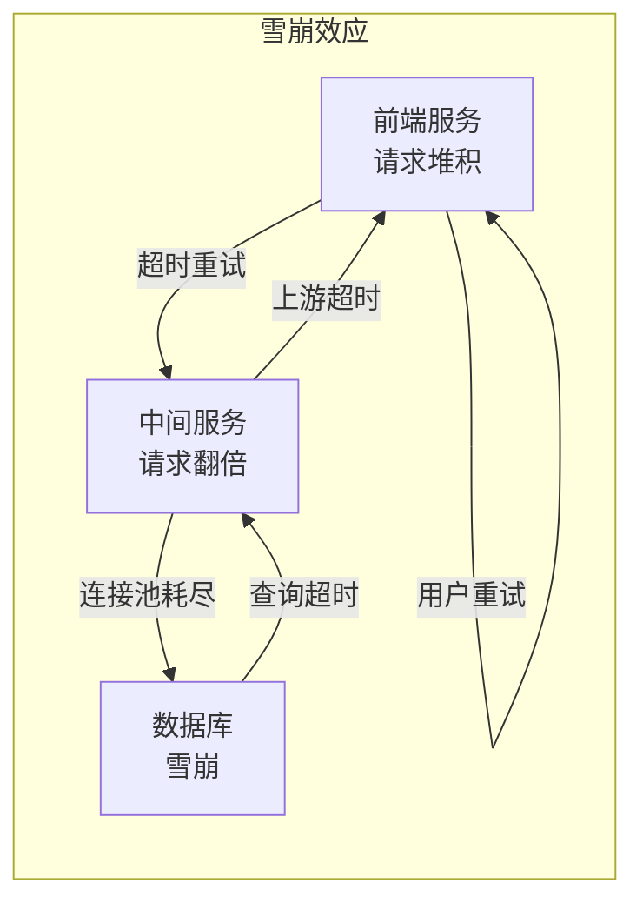

**雪崩效应的恶性循环**：过载→超时→重试→更过载。**客户端重试行为是加剧过载的关键放大器**。

### 7.2 过载保护策略体系

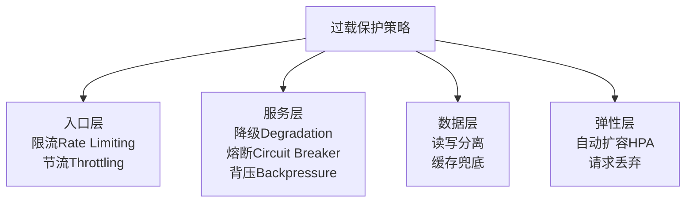

**核心原则**：**负载均衡主动丢弃 > 业务服务被动超时**——主动控制胜过被动崩溃。负载均衡器是调度而非瓶颈，其丢弃足够多的请求后，业务服务可以快速恢复正常。

### 7.3 重试放大器

**反模式：超时即重试**

客户端在请求超时后立即重试，看似合理，实际是加剧过载的元凶。过载场景下大量请求超时，重试使实际请求量翻倍甚至数倍，加速雪崩。

**正确做法**：
- **指数退避（Exponential Backoff）**：每次重试的等待时间按指数增长（1s→2s→4s→8s...）
- **直接快速失败**：过载时直接返回错误，不重试
- **重试上限**：设置最大重试次数，超过后放弃

### 7.4 容量规划

容量规划不是一次性活动，而是持续循环的过程：

1. **业务需求预测**：日活/交易量/增速
2. **容量模型建立**：QPS/存储/带宽/计算
3. **性能基线测试**：单实例容量上限
4. **冗余规划**：N+1/N+2/跨AZ
5. **资源分配**：实例数/存储量/带宽
6. **持续监控**：实际vs预期
7. **是否接近容量上限**→是→扩容或优化→回到步骤3

**关键原则**：
- **先优化后扩容**：优化提升性价比，扩容满足绝对量需求
- **自动扩容不能解决一切**：扩容需时间（分钟级），无法应对秒级突发；有上限；成本不可控
- **预留冗余+自动扩容+过载保护三管齐下**

**秒杀场景的过载保护**：
1. **前端**：按钮灰化+倒计时+请求合并
2. **网关**：令牌桶限流+请求排队
3. **服务层**：预扣库存+异步下单
4. **数据层**：缓存预热+读写分离
5. **降级**：关闭非核心功能（推荐/评论等）

> **深度注记**：过载保护的核心不是"技术方案"，而是"运营体系"。限流阈值需要压测确定，熔断阈值需要上线观察调优，降级预案需要定期演练——这些都是持续运营的工作，不是一次性的技术决策。

---

## 八、根因分析

### 8.1 消除故障 vs 消除根因

接警后的第一原则是**尽快消除故障**，而非找根因。但这不意味着根因分析不重要——**消除故障只是治标，消除根因才是治本。** 如果根因不消除，同样的故障会反复发生。

根因分析的目的是找到**最值得投入精力去修复的因素**——即消除它后，此类故障将不再发生。

### 8.2 5-Whys方法

5-Whys是最经典的根因分析工具，核心思想是连续追问"为什么"，直到找到可操作的根因：

1. 现象：线上服务503错误率飙升至30%
2. Why #1：为什么503增多？→数据库查询超时
3. Why #2：为什么数据库查询超时？→慢查询数量激增
4. Why #3：为什么慢查询激增？→新版本修改了索引策略
5. Why #4：为什么修改索引策略导致慢查询？→新索引在数据量级下退化为全表扫描
6. Why #5：为什么全表扫描未被灰度发现？→灰度环境数据量远小于生产环境
7. **根因**：灰度环境数据量未对齐生产环境
8. **修复**：建立生产级数据量的灰度验证环境

**关键**：不在于恰好问5个为什么，而在于**追问到可操作的层级**。如果根因落在"人为疏忽"上而不进入系统层面，说明追问还不够深。

### 8.3 鱼骨图分析

鱼骨图（因果图）适用于多因素叠加的故障分析，将因果关系可视化。从人员、流程、技术、环境四个维度分析故障原因。

### 8.4 故障排查的4大常见陷阱

| 陷阱 | 表现 | 正确做法 |
|------|------|---------|
| **确认偏误** | 只寻找支持自己假设的证据 | 主动寻找否定自己假设的证据 |
| **相关当因果** | 两个现象同时发生就认为有因果关系 | 证明因果链，而非仅证明相关性 |
| **过早收敛** | 找到一个"足够好"的原因就停止 | 继续追问，直到根因可操作 |
| **根因归人** | 把根因归结为"人为疏忽" | 追问系统层面为何未防止疏忽 |

> **反模式：故障复盘沦为追责会**。如果复盘会变成追责会，关键信息会被隐瞒（"这不是我做的"），系统性问题会被掩盖（"下次注意"而非"系统如何防止"）。Google的无指责复盘（Blameless Postmortem）是正确做法。故障复盘文档应包含：故障概述与时间线、根因分析、影响评估、做得好的方面、做得不好的方面、行动项（有负责人和截止日期）。

### 8.5 消除故障优先 vs 保留现场

接警后面临两个矛盾的诉求：尽快恢复服务 vs 为根因分析保留信息。

**策略**：优先消除故障，在消除故障的过程中尽量保留现场：
- 通过流量调度将请求从故障域切走，而非重启故障实例
- 保留故障实例的日志和核心转储
- 记录故障发生时的关键指标快照

**灰盒分析是最佳策略**：用黑盒方法（外部可观测数据）快速缩小范围，用白盒方法（内部代码和架构知识）精确定位。

---

## 九、接口级故障应对的统一视图

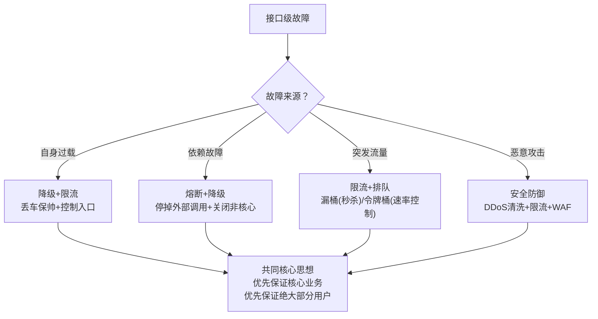

**完整故障应对链路**：

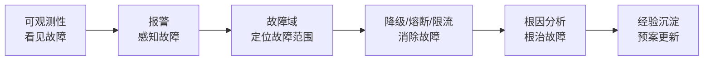

---

## 总结

| 核心要点 | 关键结论 |
|---------|---------|
| 降级 | 丢车保帅；系统后门（简单但效率低）vs独立降级系统（批量+权限管理） |
| 熔断 | 应对外部依赖故障；统一API调用层+阈值设计；防止级联故障 |
| 限流 | 基于请求（总量/时间量）vs基于资源（连接数/线程/CPU）；阈值需逐步调优 |
| 排队 | 限流变种；用Kafka缓存请求；适合秒杀等预期等待场景 |
| 固定/滑动时间窗 | 固定窗有临界点问题；滑动窗解决但实现略复杂 |
| 漏桶 | 总量控制；匀速流出；适合秒杀/签到等瞬时高并发 |
| 令牌桶 | 速率控制；允许一定突发；适合控制下游访问速率/防止自身过载 |
| XSS | 输出编码是根本防御；CSP+HttpOnly为辅助 |
| SQL注入 | 参数化查询是根本防御；ORM+最小权限为辅助 |
| CSRF | CSRF Token是核心防御；SameSite Cookie为推荐辅助 |
| SSRF | URL白名单+禁止内网地址；网络隔离 |
| 纵深防御 | 六层防线：网络边界→传输→应用→认证→数据→监控；根本防御优于辅助防御 |
| OAuth 2.0 | 授权框架（非认证协议）；授权码模式最安全；OIDC补充身份层 |
| JWT | 无状态双刃剑；短有效期+Refresh Token是最实用撤销方案；Payload不加密 |
| RBAC/ABAC | RBAC适合稳定权限模型；ABAC适合动态复杂策略；实践中混合使用 |
| 零信任 | 永不信任始终验证；持续验证+最小权限+假设违约+全链路加密 |
| 四个黄金指标 | 延迟/流量/错误/饱和度；饱和度是最需预测的指标 |
| 报警三原则 | 信噪比高/有故障就报警/有报警直指根因 |
| 3AZ架构 | 1.5x成本，比2AZ更可靠（数据库选举正常） |
| 过载保护 | 多层次：入口限流→服务降级/熔断→数据分离/缓存→弹性扩容；主动丢弃优于被动超时 |
| 重试放大器 | 过载时超时即重试会加速雪崩；必须用指数退避或快速失败 |
| 根因分析 | 5-Whys追问到系统层面可操作改进；4大陷阱：确认偏误/相关当因果/过早收敛/根因归人 |
| 故障复盘 | 必须无指责（Blameless Postmortem）；根因终点必须是可操作的系统改进 |

**思考题**：
1. 如果你来设计一个整点限量秒杀系统（登录+抢购+支付），你会如何设计接口级的故障应对手段？
2. 限流算法中，漏桶和令牌桶分别适合什么场景？秒杀系统应该用哪个？
3. 为何说"用OAuth Access Token当作身份凭证"是反模式？正确的做法是什么？
4. 过载时"超时即重试"为何会加速雪崩？正确的重试策略是什么？
5. 故障复盘为何必须无指责？根因分析的终点应该落在哪里？

**关联阅读**：
- [CAP理论与高可用存储](10-CAP理论与高可用存储.md)
- [异地多活架构](11-异地多活架构.md)
- [存储高性能](08-存储高性能.md)
- [计算高性能](09-计算高性能.md)

---

> **延伸视角**
>
> 华仔从架构模式角度梳理了接口级故障的四种应对手段（降级/熔断/限流/排队），侧重方案选型和实现细节。许式伟从服务治理和安全的宏观视角提供了更系统的框架：
>
> **1. 接口级故障应对是服务治理"稳定性治理"的核心能力**。许式伟将其纳入服务治理三大维度（稳定性/效率/成本）中的稳定性维度，并强调治理贯穿全生命周期——设计阶段的容错设计（熔断/限流/降级预案）和可观测设计（日志/指标/追踪埋点），开发阶段的防御式编程和混沌工程，运营阶段的实时监控和故障响应。
>
> **2. 工程师思维是故障治理成功的隐含前提**。华仔的四种手段都是技术方案，但许式伟强调"系统胜于规范"——降级不应靠值班手册，而应固化到降级系统；熔断不应靠人工判断，而应由API调用层自动触发；限流阈值不应靠经验直觉，而应基于压测数据。技术方案+工程师思维=可靠的治理体系。
>
> **3. 安全是可用性的另一面**。许式伟将安全归入服务治理的稳定性维度——DDoS攻击导致接口级故障，SQL注入导致数据泄露，CSRF导致越权操作。纵深防御体系既是安全保障也是可用性保障。安全的"纵深"和可用性的"冗余"是同一思想的不同体现——不依赖单点防线/单点设备，而是多层/多节点共同防御。
>
> **4. 可观测性是故障治理的起点**。华仔聚焦"如何应对故障"，许式伟补充了"如何发现故障"——Logs/Metrics/Traces三大支柱，四个黄金指标，报警三原则（信噪比高/有故障就报警/有报警直指根因）。没有可观测性，降级/熔断/限流都无从触发。
>
> **5. 根因分析是故障治理的闭环**。华仔的四种手段解决了"如何消除故障"，许式伟补充了"如何根治故障"——5-Whys追问到系统层面可操作改进，4大常见陷阱（确认偏误/相关当因果/过早收敛/根因归人），故障复盘必须无指责。消除故障是治标，消除根因是治本，两者不可偏废。
>
> **融合洞见**：接口级故障应对的完整链路是"看见→感知→定位→消除→根治"——可观测性（看见）→报警（感知）→故障域（定位）→降级/熔断/限流（消除）→根因分析（根治）。华仔的四种手段覆盖了"消除"环节，许式伟补充了全链路视角。架构师需要同时具备"应对手段"和"治理体系"两层能力——前者是术，后者是道。

---

## 附录：接口级故障与安全的深度延伸

### A.1 OWASP Top 10与安全基线的实践落地

OWASP Top 10不应仅作为知识参考，而应纳入代码审查清单和安全测试基线：

| OWASP风险 | 代码审查检查项 | 安全测试要求 |
|-----------|--------------|------------|
| A01-失效的访问控制 | 每个API端点是否有权限检查 | 测试横向越权（不同用户访问他人数据） |
| A02-加密机制失败 | 密码是否用bcrypt/argon2存储 | 检查是否有明文密码/弱加密 |
| A03-注入 | 是否使用参数化查询 | SQL注入/XSS/命令注入扫描 |
| A04-不安全的设计 | 是否有威胁建模文档 | 业务逻辑漏洞测试 |
| A05-安全配置错误 | 默认配置是否安全 | 检查未关闭的调试端口/默认密码 |
| A06-过时组件 | 依赖版本是否最新 | SCA工具扫描已知漏洞 |
| A07-认证失败 | 是否使用MFA | 暴力破解/会话劫持测试 |
| A08-完整性失败 | CI/CD是否有签名验证 | 构建产物完整性检查 |
| A09-日志监控失败 | 是否记录关键安全事件 | 检查日志是否包含敏感信息 |
| A10-SSRF | URL请求是否有白名单 | 测试内网地址访问 |

### A.2 OAuth 2.0授权码模式的时序图

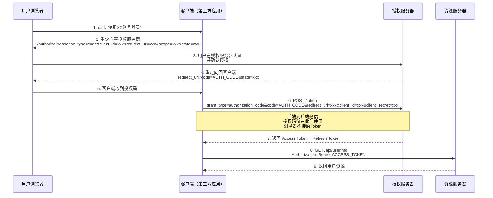

**授权码模式为何最安全**：Token只在后端到后端通信中出现（步骤6-7），浏览器全程不接触Token。即使授权码被截获，攻击者也无法换取Token——因为需要client_secret，而client_secret只在后端存储。

### A.3 JWT验证的完整流程图

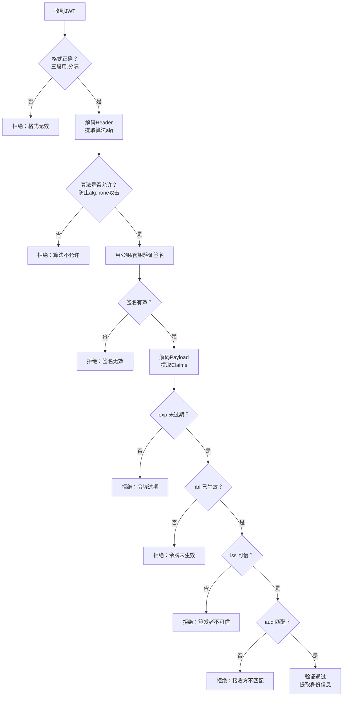

**alg:none攻击**：攻击者修改JWT Header中的alg字段为"none"，声称JWT不需要签名验证。服务器如果直接信任Header中声明的算法而不做白名单检查，就会接受伪造的JWT。防御：服务器必须限定允许的算法列表（如只允许HS256、RS256），拒绝alg:none。

### A.4 CSRF攻击的完整时序图

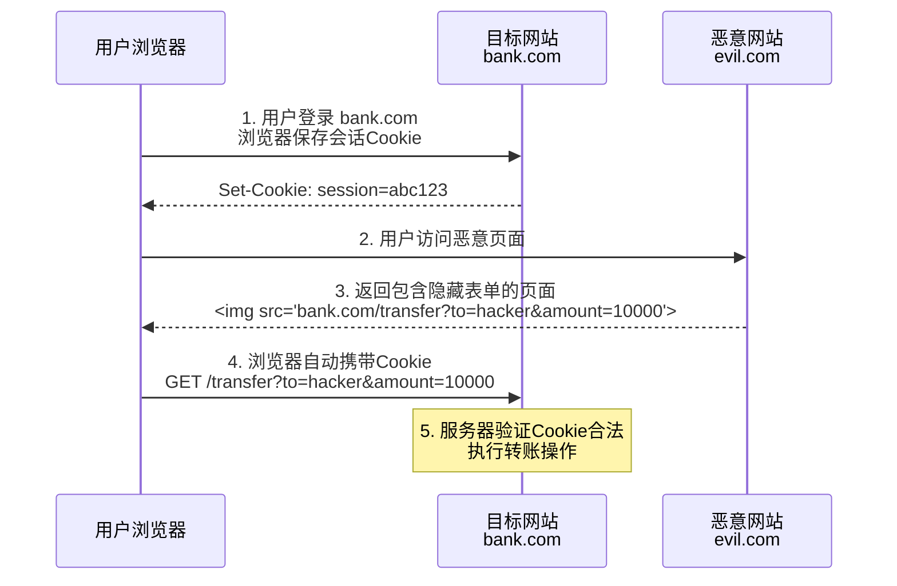

CSRF的核心机制：浏览器自动携带Cookie——攻击者不需要知道Cookie的具体值，只需要让浏览器自动携带即可。这就是为什么SameSite Cookie和CSRF Token是有效的防御手段——前者阻止浏览器自动携带Cookie到跨站请求，后者要求请求中包含攻击者无法获取的Token。

### A.5 多租户SaaS的权限设计

多租户系统中的权限设计需要同时解决**租户隔离**和**租户内权限**两个层面：

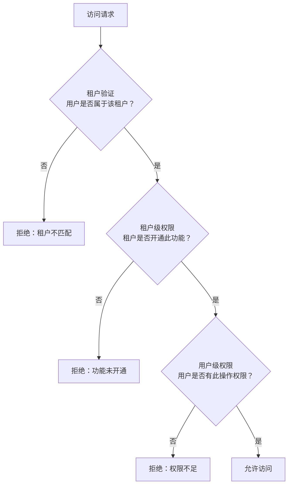

**三层权限检查**：租户验证→租户级权限→用户级权限。这种设计确保了：
- 不同租户的数据完全隔离（租户验证）
- 不同租户的功能可以定制化（租户级权限）
- 同一租户内不同用户有不同权限（用户级权限）

**数据隔离的三种实现方式**：
- **独立数据库**：每个租户一个数据库——隔离最好，成本最高
- **共享数据库独立Schema**：同一数据库不同Schema——中等隔离，中等成本
- **共享数据库共享Schema**：行级安全策略（Tenant ID过滤）——隔离最弱，成本最低

### A.6 故障域的层级化结构详解

故障域的层级结构从大到小依次为：

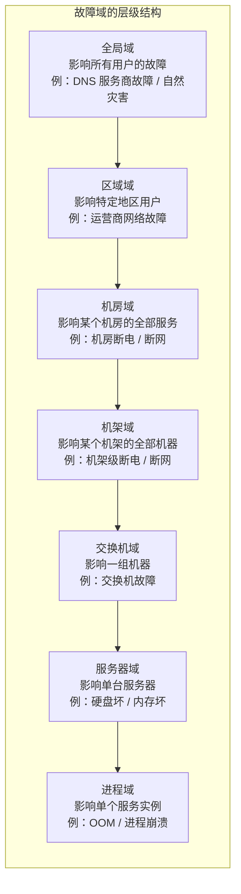

故障域越小，影响面越小，恢复越容易。设计目标是：**让故障的影响被最小化地隔离在最小故障域内**。

### A.7 过载保护中的容量规划关键指标

| 指标 | 含义 | 规划依据 |
|------|------|---------|
| **QPS上限** | 单实例最大处理能力 | 压测结果 |
| **资源利用率** | CPU/内存/IO/网络的使用率 | 告警阈值 |
| **饱和度** | 最受限资源的使用程度 | 黄金指标之一 |
| **冗余度** | 可承受的实例故障数 | N+1 / N+2 |
| **增长速率** | 业务量的增长趋势 | 历史数据拟合 |

### A.8 接口级故障应对的完整案例

**秒杀系统的接口级故障应对方案**：

| 层级 | 故障应对手段 | 具体实现 |
|------|------------|---------|
| **前端** | 降级+排队 | 按钮灰化+倒计时+请求合并（防止用户重复点击） |
| **网关** | 限流+排队 | 令牌桶限流（控制TPS上限）+请求排队（Kafka缓存） |
| **服务层** | 熔断+降级 | 熔断：支付接口超时触发熔断；降级：关闭推荐/评论 |
| **数据层** | 限流+缓存 | 预扣库存（Redis原子操作）+异步下单（MQ） |
| **全局** | 容量规划 | 压测确定TPS上限+预留2倍冗余+弹性扩容预案 |

**关键设计原则**：
- 预扣库存而非直接扣数据库——Redis原子操作（DECR）比数据库事务快100倍
- 异步下单而非同步下单——MQ解耦了"抢购成功"和"订单生成"两个步骤
- 前端防重复提交——按钮灰化+后端幂等性检查
- 支付接口独立熔断——支付是外部依赖，必须有独立的熔断机制

### A.9 安全防御的根本手段与辅助手段对比

| 攻击类型 | 根本防御（必须做到） | 辅助防御（推荐做到） | 错误防御（仅做此是不够的） |
|---------|-------------------|-------------------|----------------------|
| XSS | 输出编码 | CSP、HttpOnly | 仅做输入验证 |
| SQL注入 | 参数化查询 | ORM、最小权限 | 仅做输入过滤 |
| CSRF | CSRF Token | SameSite Cookie | 仅验证Origin/Referer |
| MITM | TLS/HTTPS | HSTS、证书锁定 | 自定义加密协议 |
| DDoS | 流量清洗+CDN | 限速、黑名单 | 仅做SYN Cookie |

> **核心原则**：根本防御是"不可绕过"的——参数化查询使SQL注入不可能发生；辅助防御是"增加攻击难度"的——SameSite Cookie让CSRF更难执行；错误防御是"可被绕过"的——输入过滤无法覆盖所有注入场景。

