# 可扩展架构思想与实践 | 拆分思想·分层·SOA·微服务·微内核·架构范式·架构老化

## 章节导言

软件系统与硬件和建筑的本质区别在于**可扩展性**——硬件出厂即定型，建筑完工即永恒，而软件在投入使用后需要源源不断地修改和扩展。CPU生产出来后装到PC上不会再返回工厂加工以增加新功能；金字塔矗立千年，其结构和建成时并无两样。相比之下，如果软件系统开发出来后再没有任何更新和调整，反而说明这套系统没有发展、没有生命力。真正有生命力的软件系统都在不断迭代和发展，如Windows从3.0到95到XP直到Windows 10，始终跟着技术的发展而演进。

软件系统的这种天生和内在的可扩展特性，既是魅力所在，又是难点所在。魅力在于我们可以通过修改和扩展，不断让系统具备更多功能和特性；难点在于如何以最小代价去扩展系统，因为很多情况下牵一发动全身，扩展时可能出现到处都要改、到处都要推倒重来的情况。改动的地方越多，投入越大，出错的可能性也越大。

因此，如何避免扩展时改动范围太大，是软件架构可扩展性设计的主要思考点。

可扩展性架构设计方法很多，但万变不离其宗，背后的基本思想都可以总结为一个字：**拆**。按照不同的思路拆分，会得到不同的架构——面向流程拆分得到分层架构，面向服务拆分得到SOA和微服务，面向功能拆分得到微内核架构。而架构范式则为"如何拆"提供了更高维的思维工具，架构老化与重构则回答了"拆完之后如何维护"的持久战问题。

**核心问题**：
1. 三种拆分思路（流程/服务/功能）如何决定系统的扩展方式？
2. 分层架构的核心设计要点与优缺点是什么？
3. SOA解决了什么问题？为何ESB成为瓶颈？
4. 微服务与SOA的本质区别是什么？微服务有哪些陷阱？
5. 微服务落地的关键考量——服务粒度、拆分方法、基础设施？
6. 微内核架构的核心机制与典型实现？
7. 架构范式如何指导架构设计？架构老化如何应对？
8. 全局性功能（Cross-cutting Concerns）如何设计才不侵蚀核心系统？

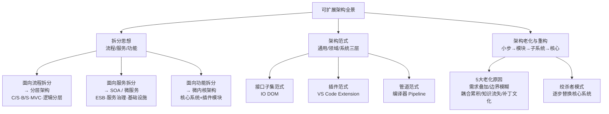
```mermaid
graph TD
    A["可扩展架构全景"] --> B["拆分思想<br/>流程/服务/功能"]
    A --> C["架构范式<br/>通用/领域/系统三层"]
    A --> D["架构老化与重构<br/>小步→模块→子系统→核心"]

    B --> B1["面向流程拆分<br/>→ 分层架构<br/>C/S·B/S·MVC·逻辑分层"]
    B --> B2["面向服务拆分<br/>→ SOA / 微服务<br/>ESB·服务治理·基础设施"]
    B --> B3["面向功能拆分<br/>→ 微内核架构<br/>核心系统+插件模块"]

    C --> C1["接口子集范式<br/>IO DOM"]
    C --> C2["插件范式<br/>VS Code Extension"]
    C --> C3["管道范式<br/>编译器 Pipeline"]

    D --> D1["5大老化原因<br/>需求叠加/边界模糊<br/>耦合累积/知识流失/补丁文化"]
    D --> D2["绞杀者模式<br/>逐步替换核心系统"]

```

---

## 一、可扩展的基本思想：拆

### 1.1 拆的本质

幸运的是，可扩展性架构的设计方法很多，但万变不离其宗，所有的可扩展性架构设计，背后的基本思想都可以总结为一个字：**拆**！

拆，就是将原本大一统的系统拆分成多个规模小的部分，扩展时只修改其中一部分即可，无须整个系统到处都改，通过这种方式来减少改动范围，降低改动风险。

说起来好像挺简单，毕竟"拆"我们见得太多了。一般情况下，我们要拆一个东西时，都是简单粗暴的——用推土机拆房子、用剪刀拆快递包装、用手撕开包装袋等，反正拆完了这些东西就扔了。但面对软件系统，拆就没那么简单了，因为我们并不是要摧毁一个软件系统，而是要通过拆让软件系统变得更加优美（具备更好的可扩展性）。形象地说，软件系统中的"拆"是建设性的，因此难度要高得多。

按照不同的思路来拆分软件系统，就会得到不同的架构。常见的拆分思路有如下三种：

- **面向流程拆分**：将整个业务流程拆分为几个阶段，每个阶段作为一部分。
- **面向服务拆分**：将系统提供的服务拆分，每个服务作为一部分。
- **面向功能拆分**：将系统提供的功能拆分，每个功能作为一部分。

### 1.2 三种拆分思路的案例

理解这三种思路的关键在于如何理解"流程""服务""功能"三者的联系和区别。从范围上来看，从大到小依次为：**流程 > 服务 > 功能**，单纯从概念解释可能难以理解，但看几个案例就很清楚了。

**案例一：TCP/IP协议栈**

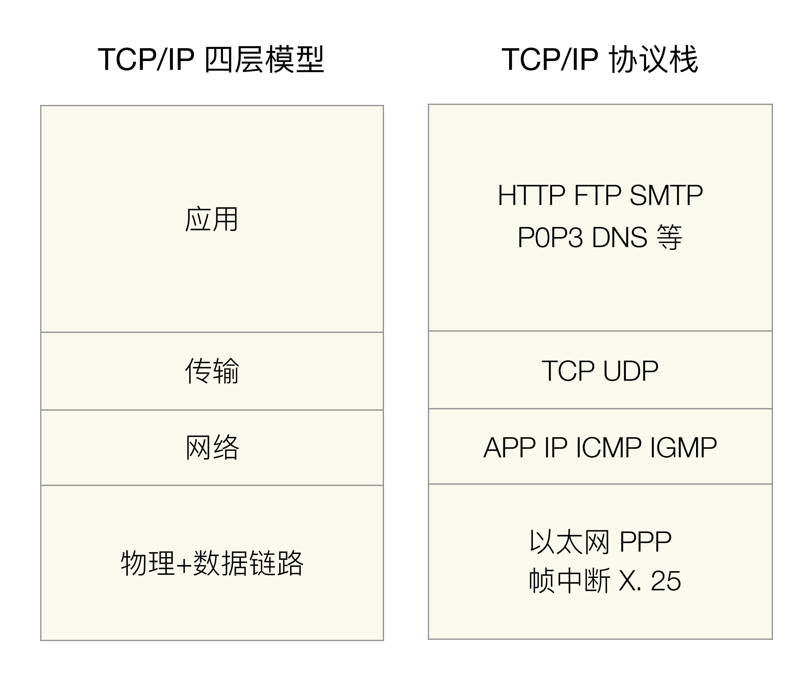

- **流程**：对应TCP/IP四层模型，因为TCP/IP网络通信流程是：应用层→传输层→网络层→物理+数据链路层，不管最上层的应用层是什么，这个流程都不会变。
- **服务**：对应应用层的HTTP、FTP、SMTP等服务，HTTP提供Web服务，FTP提供文件服务，SMTP提供邮件服务，以此类推。
- **功能**：每个服务都会提供相应的功能。例如，HTTP服务提供GET、POST功能，FTP提供上传下载功能，SMTP提供邮件发送和收取功能。

**案例二：学生信息管理系统**

1. **面向流程拆分**

展示层→业务层→数据层→存储层，各层含义如下：
- 展示层：负责用户页面设计，不同业务有不同的页面，如登录页面、注册页面、信息管理页面、安全设置页面等。
- 业务层：负责具体业务逻辑的处理，如登录、注册、信息管理、修改密码等业务。
- 数据层：负责完成数据访问，如增删改查数据库中的数据、记录事件到日志文件等。
- 存储层：负责数据的存储，如关系型数据库MySQL、缓存系统Memcache等。

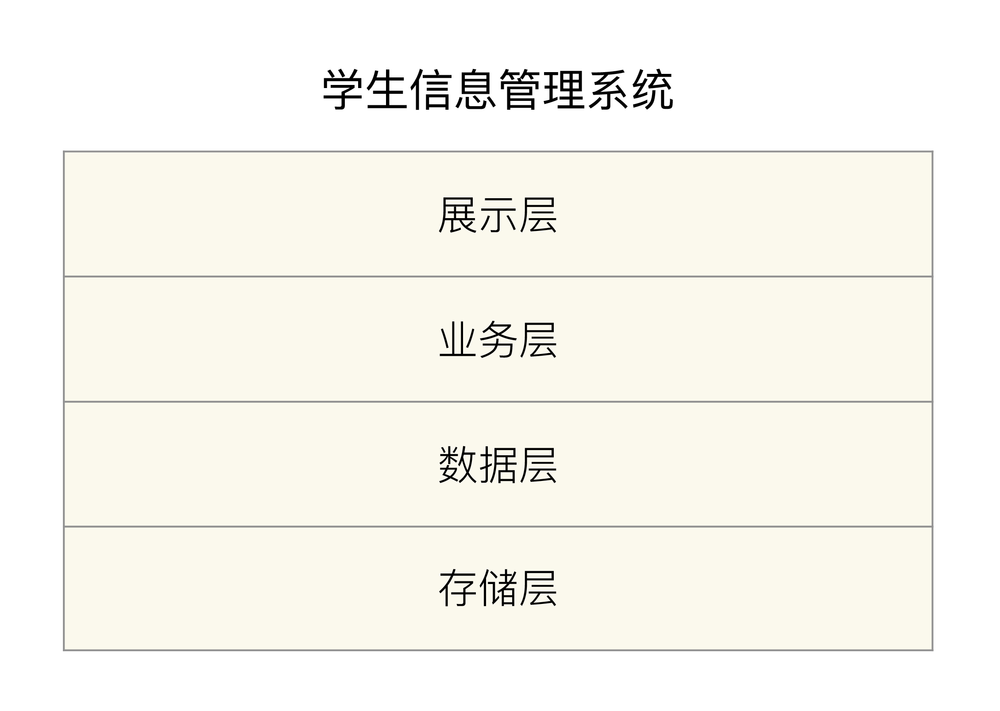

2. **面向服务拆分**

将系统拆分为注册服务、登录服务、信息管理服务、安全设置等服务：

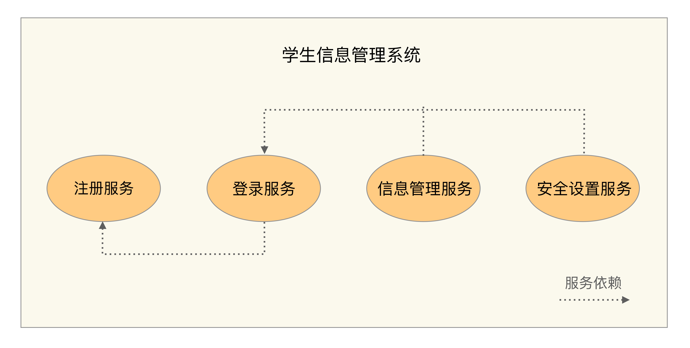

3. **面向功能拆分**

每个服务都可以拆分为更多细粒度的功能：
- 注册服务：手机号注册、身份证注册、学生邮箱注册
- 登录服务：手机号登录、身份证登录、邮箱登录
- 信息管理服务：基本信息管理、课程信息管理、成绩信息管理
- 安全设置服务：修改密码、安全手机、找回密码

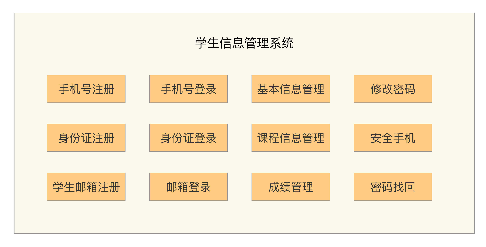

### 1.3 不同拆分决定不同扩展方式

通过学生信息管理系统的案例可以发现，不同的拆分方式，架构图差异很大。那我们何必费尽心机去选择呢，随便挑一个不就可以了？

当然不能随便挑，否则架构设计就没有意义了。原因在于：**不同的拆分方式，本质上决定了系统的扩展方式**。

有人可能会问：就算是不拆分系统，只要在设计和写代码时做好了，同样不会出现到处改的问题啊？例如增加"学号注册"，就算不拆分为服务，也可以控制修改的范围，那为何要大费周章去拆分呢？

在一个理想的环境——团队都是高手，每个程序员都很厉害，对业务都很熟悉，新来的同事很快就知晓所有的细节——那确实不拆分也没有问题。但现实却是：团队有菜鸟程序员，到底是改A处实现功能还是改B处实现功能，完全取决于他觉得哪里容易改；有的程序员比较粗心；有的程序员某天精神状态不太好；新来的同事不知道历史上某行代码为何那么"恶心"，而轻易地将其改漂亮了一些……所有的这些问题都可能出现，这时候你就会发现，**合理的拆分能够强制保证即使程序员出错，出错的范围也不会太广，影响也不会太大**。

| 拆分方式 | 扩展特点 | 示例 |
|---------|---------|------|
| **面向流程** | 扩展时大部分只修改某一层，少部分可能修改关联两层 | 存储层从MySQL扩展为同时支持MySQL和Oracle，只需扩展存储层和数据层 |
| **面向服务** | 扩展某服务或增加新服务，无须修改所有服务 | 增加"学号注册"功能，只需修改注册服务和登录服务 |
| **面向功能** | 扩展某功能或增加新功能，无须修改所有功能 | 增加"学号注册"功能，只需增加新功能模块并修改登录功能模块 |

### 1.4 拆分的组合使用

三种架构并非非此即彼，而是可以在系统架构设计中进行组合使用。以学生管理系统为例：

- 整体系统采用面向服务拆分中的"微服务"架构，拆分为"注册服务""登录服务""信息管理服务""安全服务"，每个服务是一个独立运行的子系统。
- 其中的"注册服务"子系统本身又是采用面向流程拆分的分层架构。
- "登录服务"子系统采用的是面向功能拆分的"微内核"架构。

不同的拆分方式对应的典型可扩展系统架构：

| 拆分方式 | 典型架构 |
|---------|---------|
| 面向流程拆分 | 分层架构 |
| 面向服务拆分 | SOA、微服务 |
| 面向功能拆分 | 微内核架构 |

---

## 二、分层架构

### 2.1 核心思想

分层架构是很常见的架构模式，也叫N层架构，通常情况下N至少是2层。常见的有3层架构（如MVC、MVP架构）、4层架构，5层架构的比较少见，一般是比较复杂的系统才会达到或超过5层，如操作系统内核架构。

按照分层架构进行设计时，根据不同的划分维度和对象，可以得到多种不同的分层架构。

**1. C/S架构、B/S架构**

划分的对象是整个业务系统，划分的维度是用户交互，即将和用户交互的部分独立为一层，支撑用户交互的后台作为另外一层。

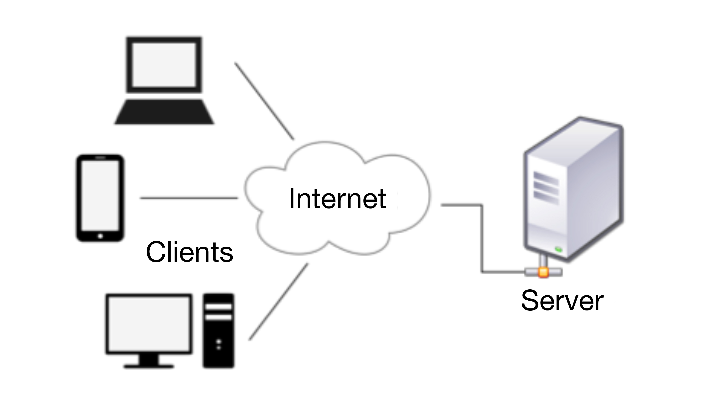

**2. MVC架构、MVP架构**

划分的对象是单个业务子系统，划分的维度是职责，将不同的职责划分到独立层，但各层的依赖关系比较灵活。例如，MVC架构中各层之间是两两交互的：

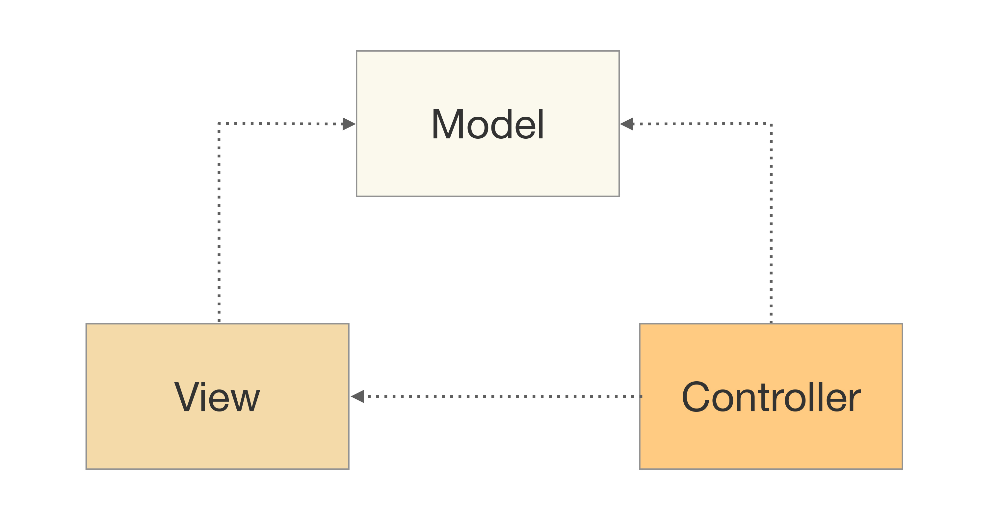

**3. 逻辑分层架构**

划分的对象可以是单个业务子系统，也可以是整个业务系统，划分的维度也是职责。虽然都是基于职责划分，但逻辑分层架构和MVC架构、MVP架构的不同点在于，逻辑分层架构中的层是**自顶向下依赖**的。典型的有操作系统内核架构、TCP/IP架构。例如，Android操作系统架构图：

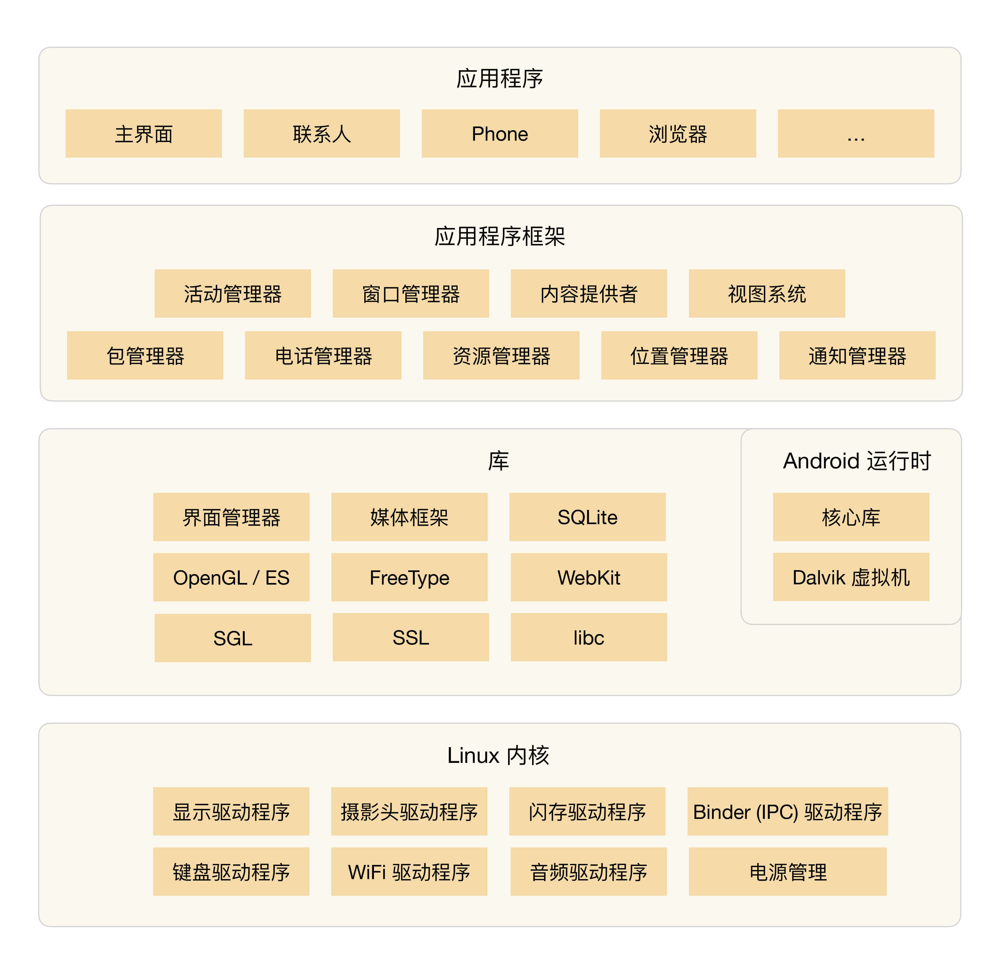

典型的J2EE系统架构也是逻辑分层架构：

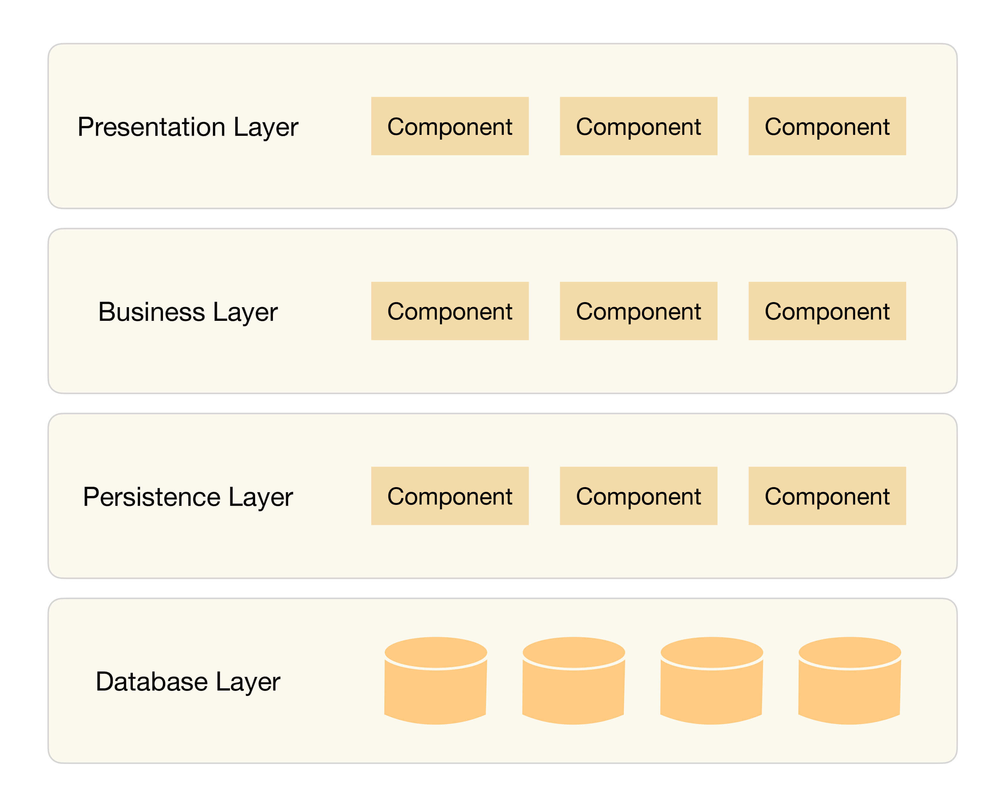

针对整个业务系统进行逻辑分层的架构图如下：

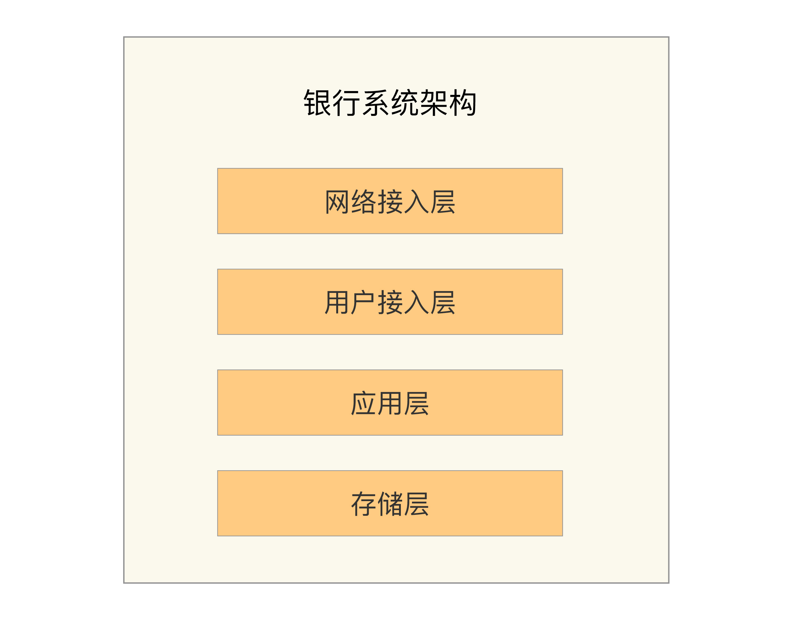

### 2.2 分层架构的核心设计原则

无论采取何种分层维度，分层架构设计最核心的一点就是**需要保证各层之间的差异足够清晰，边界足够明显，让人看到架构图后就能看懂整个架构**，这也是分层不能分太多层的原因。否则如果两个层的差异不明显，就会出现程序员小明认为某个功能应该放在A层，而程序员老王却认为同样的功能应该放在B层，这样会导致分层混乱。如果这样的架构进入实际开发落地，则A层和B层就会乱成一锅粥，也就失去了分层的意义。

分层架构之所以能够较好地支撑系统扩展，本质在于**隔离关注点**（separation of concerns），即每个层中的组件只会处理本层的逻辑。比如说，展示层只需要处理展示逻辑，业务层中只需要处理业务逻辑，这样我们在扩展某层时，其他层是不受影响的，通过这种方式可以支撑系统在某层上快速扩展。例如，Linux内核如果要增加一个新的文件系统，则只需要修改文件存储层即可，其他内核层无须变动。

当然，并不是简单地分层就一定能够实现隔离关注点从而支撑快速扩展。分层时要保证**层与层之间的依赖是稳定的**，才能真正支撑快速扩展。例如，Linux内核为了支撑不同的文件系统格式，抽象了VFS文件系统接口：

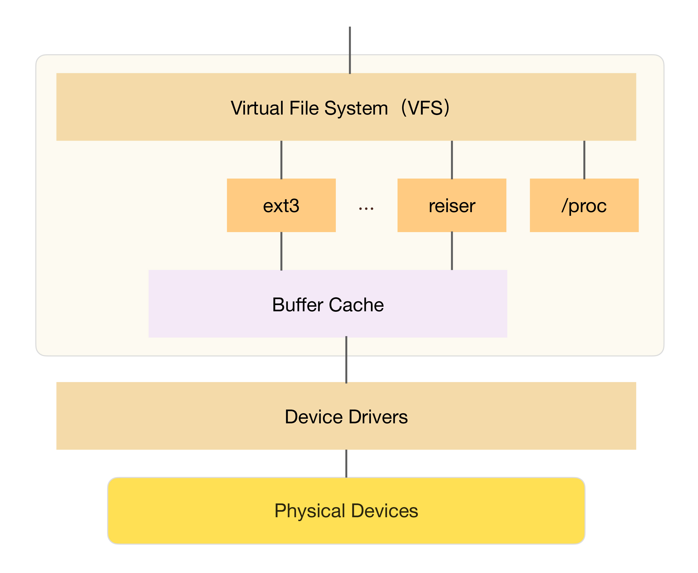

如果没有VFS，只是简单地将ext2、ext3、reiser等文件系统划为"文件系统层"，那么这个分层是达不到支撑可扩展的目的的。因为增加一个新的文件系统后，所有基于文件系统的功能都要适配新的文件系统接口；而有了VFS后，只需要VFS适配新的文件系统接口，其他基于文件系统的功能是依赖VFS的，不会受到影响。

对于操作系统这类复杂的系统，接口本身也可以成为独立的一层。例如，把VFS独立为一层是完全可以的。而对于一个简单的业务系统，接口可能就是Java语言上的几个interface定义，这种情况下如果独立为一层，看起来可能就比较重了。

### 2.3 分层架构的约束与代价

分层结构的另外一个特点就是**层层传递**，也就是说一旦分层确定，整个业务流程是按照层进行依次传递的，不能在层之间进行跳跃。最简单的C/S结构，用户必须先使用C层，然后C层再传递到S层，用户是不能直接访问S层的。传统的J2EE 4层架构，收到请求后必须按照下面的方式传递：

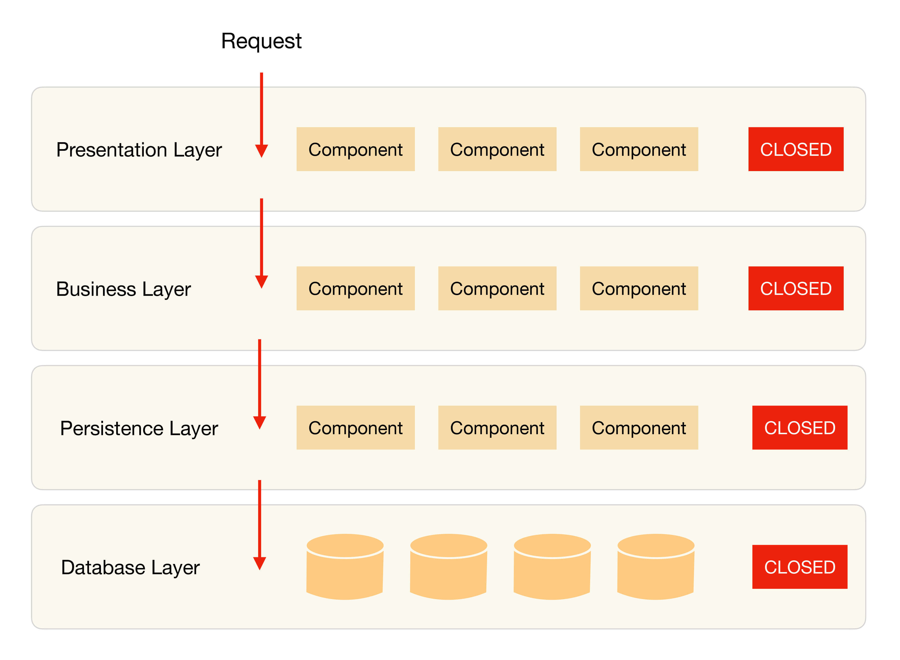

分层结构的这种约束，好处在于**强制将分层依赖限定为两两依赖**，降低了整体系统复杂度。例如，Business Layer被Presentation Layer依赖，自己只依赖Persistence Layer。但分层结构的代价就是**冗余**，也就是说，不管这个业务有多么简单，每层都必须要参与处理，甚至可能每层都写了一个简单的包装函数。

以用户管理系统最简单的功能"查看头像"为例。查看头像功能实现很简单，只是显示一张图片而已，但按照分层架构来实现，每层都要写一个简单的函数：

**Presentation Layer**：
```java
public class AvatarView {
   public void displayAvatar(int userId){
       String url = AvatarBizz.getAvatarUrl(userId);
       // 此处省略渲染代码
   }
}
```

**Business Layer**：
```java
public class AvatarBizz {
   public static String getAvatarUrl(int userId){
       return AvatarDao.getAvatarUrl(userId);
   }
}
```

**Persistence Layer**：
```java
public class AvatarDao {
   public static String getAvatarUrl(int userId) {
       // 从MySQL数据库中通过userId查询头像URL
       return "http://avatar.csdn.net/B/8/3/1_yah99_wolf.jpg";
   }
}
```

可以看出Business Layer的AvatarBizz类的getAvatarUrl方法和Persistence Layer的AvatarDao类的getAvatarUrl方法，名称和参数都一模一样。

既然如此，我们是否应该自由选择是否绕过分层的约束呢？例如直接让AvatarView类访问AvatarDao类？

**答案是不建议这样做**。分层架构的优势就体现在通过分层强制约束两两依赖，一旦自由选择绕过分层，时间一长，架构就会变得混乱。例如Presentation Layer直接访问Persistence Layer，Business Layer直接访问Database Layer，这样做就失去了分层架构的意义，也导致后续扩展时无法控制受影响范围，牵一发动全身，无法支持快速扩展。虽然分层架构的实现在某些场景下看起来有些啰嗦和冗余，但复杂度却很低。

### 2.4 分层架构的扩展方式与案例

| 扩展场景 | 修改范围 | 示例 |
|---------|---------|------|
| 存储层扩展 | 存储层+数据层 | MySQL扩展为同时支持MySQL和Oracle |
| 展示层扩展 | 仅展示层 | 增加新的页面交互方式 |
| 业务层扩展 | 业务层+可能涉及展示层 | 增加新的业务逻辑 |

**优势**：大部分扩展只涉及某一层或相邻两层，不会所有层同时修改。

**劣势**：层次过多会增加调用链路长度，影响性能；层次划分不合理会导致"穿透"——某层直接调用非相邻层。

### 2.5 分层架构的优缺点

| 维度 | 优势 | 劣势 |
|------|------|------|
| **可扩展性** | 大部分扩展只涉及某一层，其他层不受影响 | 层次划分不合理会导致"穿透" |
| **复杂度** | 两两依赖降低了整体复杂度 | 简单功能也存在冗余代码 |
| **性能** | — | 每次请求穿越所有层，有理论性能损失（实际可忽略） |
| **强制约束** | 即使程序员出错，影响范围可控 | 不允许跳层调用，灵活性低 |

> **深度注记**：分层带来的理论性能损失，如果放到20世纪80年代可能很明显；但到了现在，硬件和网络的性能有了质的飞跃，分层模式理论上的这点性能损失，在实际应用中绝大部分场景下都可以忽略不计。

### 2.6 分层架构的典型变体对比

| 变体 | 划分对象 | 划分维度 | 层间依赖 | 典型代表 |
|------|---------|---------|---------|---------|
| C/S、B/S | 整个业务系统 | 用户交互 | 两层交互 | 桌面应用、Web应用 |
| MVC、MVP | 单个业务子系统 | 职责 | 两两交互（灵活） | Spring MVC、Android MVP |
| 逻辑分层 | 子系统或整个系统 | 职责 | 自顶向下依赖 | Android架构、TCP/IP、J2EE |

---

## 三、SOA架构

### 3.1 从分层到SOA

分层架构解决了单系统内的可扩展问题，但当企业有多个系统时，出现了新挑战。SOA（Service Oriented Architecture，面向服务的架构）诞生于上世纪90年代，1996年Gartner的两位分析师Roy W. Schulte和Yefim V. Natis发表了第一个SOA的报告。2005年，Gartner预言：到了2008年，SOA将成为80%的开发项目的基础。历史证明这个预言并不十分靠谱，SOA虽然在很多企业成功推广，但没有达到占有绝对优势的地步。

SOA出现的背景是企业内部的IT系统**重复建设且效率低下**：

- 企业各部门有独立的IT系统（人力资源系统、财务系统、销售系统），这些系统可能都涉及人员管理，各IT系统都需要重复开发人员管理的功能。例如某个员工离职后，需要分别到上述三个系统中删除员工的权限。
- 各个独立的IT系统可能采购于不同的供应商，实现技术不同，企业自己也不太可能基于这些系统进行重构。
- 随着业务的发展，复杂度越来越高，更多的流程和业务需要多个IT系统合作完成。由于各个独立的IT系统没有标准的实现方式（人力资源系统用Java开发对外提供RPC，财务系统用C#开发对外提供SOAP），每次开发新的流程和业务，都需要协调大量的IT系统，同时定制开发，效率很低。

SOA更多是在传统企业（如制造业、金融业等）落地和推广，在互联网行业并没有大规模地实践和推广。互联网行业推行SOA最早的应该是亚马逊，得益于杰弗·贝索斯的远见卓识，亚马逊内部的系统都以服务的方式构造，间接地促使了后来的亚马逊云计算技术的出现。

### 3.2 SOA的三个关键组件

为了应对传统IT系统存在的问题，SOA提出了3个关键概念：

**1. 服务**

所有业务功能都是一项服务，服务就意味着要对外提供开放的能力，当其他系统需要使用这项功能时，无须定制化开发。服务可大可小，可简单也可复杂。例如，人力资源管理可以是一项服务，包括人员基本信息管理、请假管理、组织结构管理等功能；而人员基本信息管理也可以作为一项独立的服务。到底是划分为粗粒度的服务还是细粒度的服务，需要根据企业的实际情况进行判断。

**2. ESB（Enterprise Service Bus，企业服务总线）**

ESB参考了计算机总线的概念。计算机中的总线将各个不同的设备连接在一起，ESB将企业中各个不同的服务连接在一起。因为各个独立的服务是异构的，如果没有统一的标准，则各个异构系统对外提供的接口是各式各样的。SOA使用ESB来**屏蔽异构系统对外提供各种不同的接口方式**，以此来达到服务间高效的互联互通。

**3. 松耦合**

松耦合的目的是减少各个服务间的依赖和互相影响。因为采用SOA架构后，各个服务是相互独立运行的，甚至都不清楚某个服务到底有多少对其他服务的依赖。如果做不到松耦合，某个服务一升级，依赖它的其他服务全部故障，这样肯定是无法满足业务需求的。但实际上真正做到松耦合并没有那么容易，要做到完全后向兼容是一项复杂的任务。

典型的SOA架构样例如下：

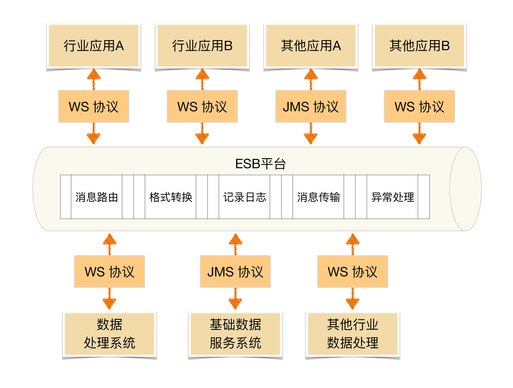

### 3.3 ESB——SOA的核心与瓶颈

ESB是SOA的核心组件，也是SOA最广为人诟病的部分。ESB需要实现与各种系统间的协议转换、数据转换、透明的动态路由等功能。

例如，ESB将JSON转换为Java：

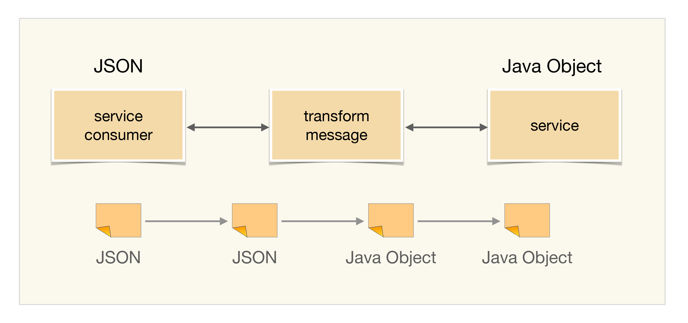

ESB将REST协议转换为RMI和AMQP两个不同的协议：

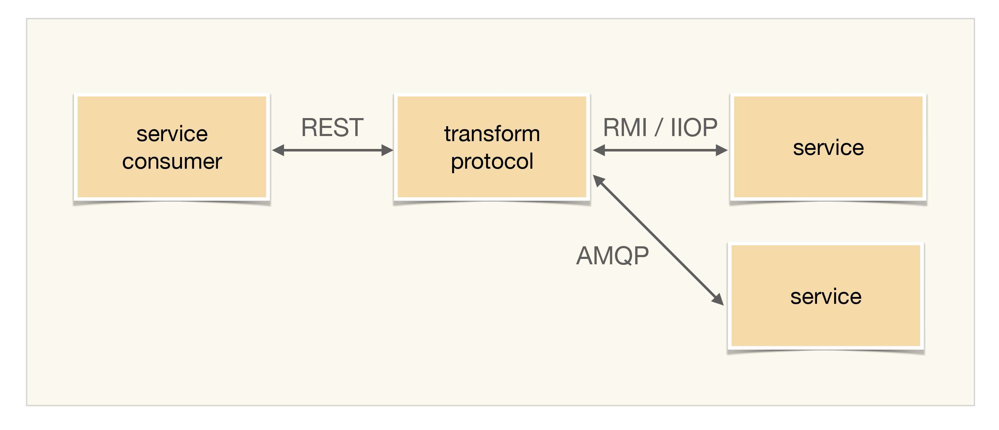

ESB虽然功能强大，但现实中的协议有很多种（JMS、WS、HTTP、RPC等），数据格式也有很多种（XML、JSON、二进制、HTML等）。ESB要完成这么多协议和数据格式的互相转换，工作量和复杂度都很大，而且这种转换是需要耗费大量计算性能的，当ESB承载的消息太多时，**ESB本身会成为整个系统的性能瓶颈**。

当然，SOA的ESB设计也是无奈之举。回想SOA的提出背景就可以发现，企业在应用SOA时，各种异构的IT系统都已经存在很多年了，完全重写或者按照统一标准进行改造的成本非常大，只能通过ESB方式去适配已经存在的各种异构系统。

SOA架构是比较高层级的架构设计理念，一般情况下我们可以说某个企业采用了SOA的架构来构建IT系统，但不会说某个独立的系统采用了SOA架构。例如，某企业采用SOA架构将系统分为"人力资源管理服务""考勤服务""财务服务"，但人力资源管理服务本身通常不会再按照SOA的架构拆分更多服务，也不会再使用独立的一套ESB。

> **深度注记**：为什么互联网企业很少采用SOA架构？因为互联网企业的系统基本都是基于Web的，对外接口基本都提供HTTP RESTful风格的接口，不存在大量异构系统需要整合的问题。ESB解决的"异构系统互通"问题在互联网行业并不突出，而ESB引入的复杂度和性能瓶颈反而不划算。

---

## 四、微服务架构

### 4.1 从SOA到微服务

微服务是近几年非常火热的架构设计理念。大部分人认为是Martin Fowler提出了微服务概念，但事实上微服务概念的历史要早得多。2005年Dr. Peter Rodgers在Web Services Edge大会上提出了"Micro-Web-Services"的概念；2011年一个软件架构工作组使用了"microservice"一词来描述一种架构模式；2014年James Lewis和Martin Fowler合写了关于微服务的学术性文章，详细阐述了微服务。

关于SOA和微服务的关系和区别，大概分为下面几个典型的观点：

**观点一：微服务是SOA的实现方式**

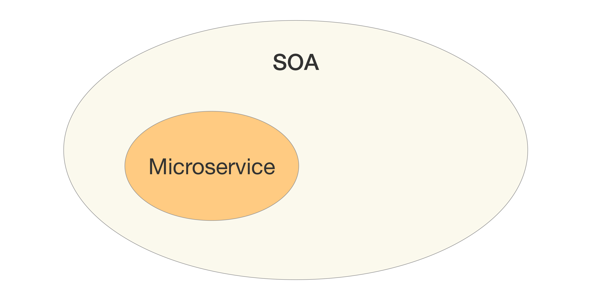

这种观点认为SOA是一种架构理念，而微服务是SOA理念的一种具体实现方法。

**观点二：微服务是去掉ESB后的SOA**

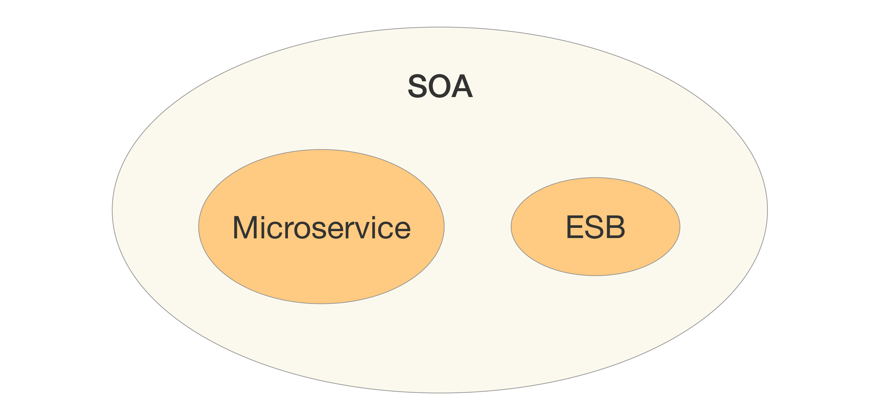

这种观点认为传统SOA架构最广为人诟病的就是庞大、复杂、低效的ESB，因此将ESB去掉改为轻量级的HTTP实现，就是微服务。

**观点三：微服务是一种和SOA相似但本质上不同的架构理念**


这种观点认为微服务和SOA只是有点类似，但本质上是不同的架构设计理念。相似点在于两者都关注"服务"，都是通过服务的拆分来解决可扩展性问题。本质上不同的地方在于几个核心理念的差异：是否有ESB、服务的粒度、架构设计的目标等。

综合对比SOA和微服务在具体做法上的差异，**第三种观点更符合实际情况**：

| 维度 | SOA | 微服务 |
|------|-----|--------|
| **服务粒度** | 粗（"员工管理系统"就是一个服务） | 细（拆分为员工信息、考勤、假期、福利等） |
| **服务通信** | ESB重量级实现 | 轻量级协议（RESTful/RPC），"Smart endpoints and dumb pipes" |
| **服务交付** | 无特殊要求，兼容已有系统 | 要求快速交付，需自动化测试、持续集成、自动化部署 |
| **应用场景** | 庞大、复杂、异构的企业级系统 | 快速、轻量级、基于Web的互联网系统 |

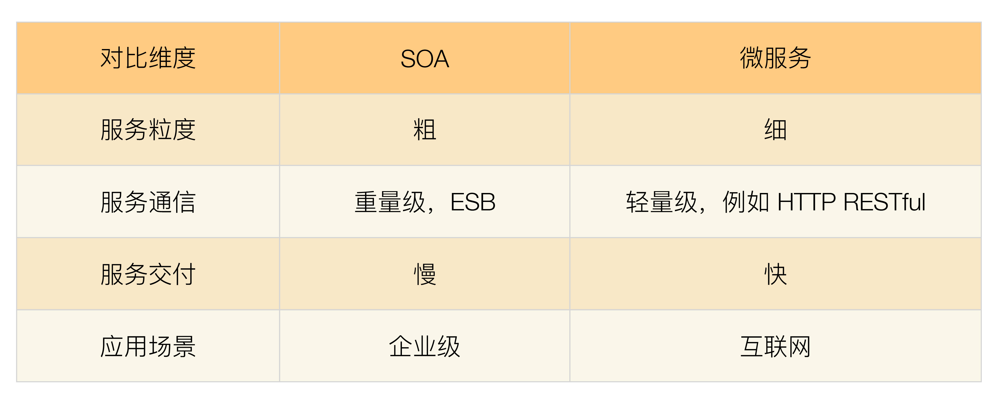

Martin Fowler在他的微服务文章中做了很好的提炼：

> In short, the microservice architectural style is an approach to developing a single application as a suite of small services, each running in its own process and communicating with lightweight mechanisms, often an HTTP resource API. These services are built around business capabilities and independently deployable by fully automated deployment machinery.

三个关键词分别是：**small**、**lightweight**、**automated**，基本上浓缩了微服务的精华，也是微服务与SOA的本质区别所在。

### 4.2 微服务的六大陷阱

通过前面的对比，似乎微服务大大优于SOA，这也导致了很多团队在实践时不加思考地采用微服务——既不考虑团队的规模，也不考虑业务的发展，也没有考虑基础技术的支撑。一旦真正实施后才发现掉到微服务的坑里面去了。

**陷阱1：服务划分过细，服务间关系复杂**

服务划分过细，单个服务的复杂度确实下降了，但整个系统的复杂度却上升了，因为微服务将系统内的复杂度转移为系统间的复杂度了。从理论的角度来计算，n个服务的复杂度是n×(n-1)/2，整体系统的复杂度是随着微服务数量的增加呈平方级（O(n²)）增长的。

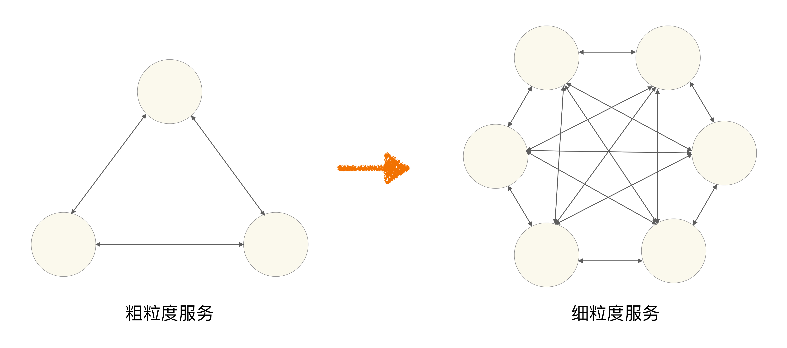

粗粒度划分服务时，系统被划分为3个服务，虽然单个服务较大，但服务间的关系很简单；细粒度划分服务时，虽然单个服务小了一些，但服务间的关系却复杂了很多。

**陷阱2：服务数量太多，团队效率急剧下降**

微服务的"微"字本身就是一个陷阱。很多团队看到"微"字后就想到必须将服务拆分得很细，有的团队人员规模是5~6个人，然而却拆分出30多个微服务，平均每个人要维护5个以上的微服务。这样做给工作效率带来了明显的影响，一个简单的需求开发就需要涉及多个微服务，光是微服务之间的接口就有6~7个，无论是设计、开发、测试、部署，都需要工程师不停地在不同的服务间切换。

**陷阱3：调用链太长，性能下降**

由于微服务之间都是通过HTTP或者RPC调用的，每次调用必须经过网络。一般线上的业务接口之间的调用，平均响应时间大约为50毫秒，如果用户的一次请求需要经过6次微服务调用，则性能消耗就是300毫秒，这在很多高性能业务场景下是难以满足需求的。

**陷阱4：调用链太长，问题定位困难**

系统拆分为微服务后，一次用户请求需要多个微服务协同处理，任意微服务的故障都将导致整个业务失败。然而由于微服务数量较多，且故障存在扩散现象，快速定位到底是哪个微服务故障是一件复杂的事情。

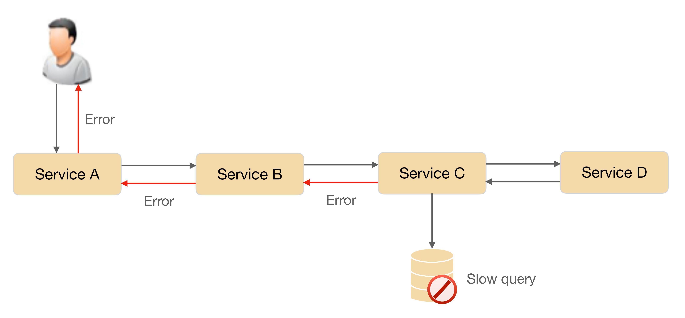

Service C的数据库出现慢查询，导致Service C给Service B的响应错误，Service B给Service A的响应错误，Service A给用户的响应错误。在实际定位时，可能要花几个小时才能定位到是Service C的数据库慢查询导致了错误。如果多个微服务同时发生不同类型的故障，则定位故障更加复杂。

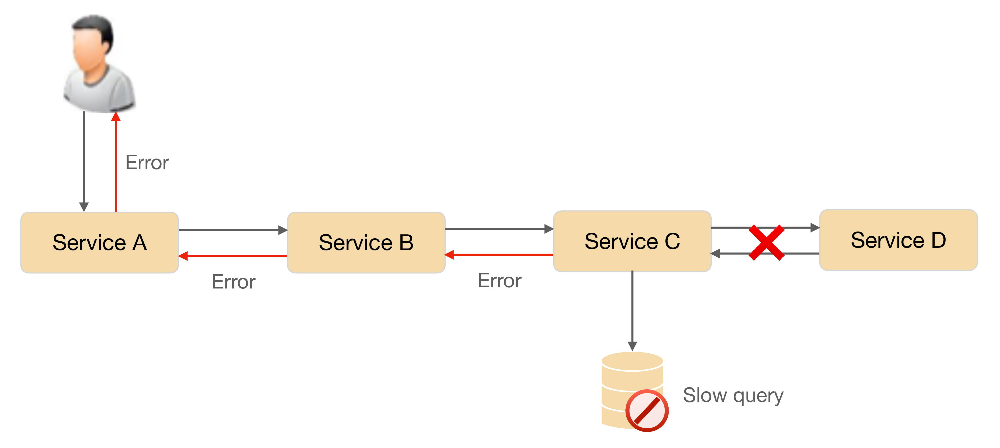

**陷阱5：没有自动化支撑，无法快速交付**

如果没有相应的自动化系统进行支撑，都是靠人工去操作，那么微服务不但达不到快速交付的目的，甚至还不如一个大而全的系统效率高。没有自动化测试支撑，每次测试时需要测试大量接口；没有自动化部署支撑，每次部署几十台机器，运维人员敲shell命令逐台部署；没有自动化监控，每次故障定位都需要人工查几十台机器几百个微服务的各种状态和日志文件。

**陷阱6：没有服务治理，管理混乱**

随着微服务种类和数量越来越多，如果没有服务治理系统进行支撑，微服务提倡的lightweight就会变成问题。服务路由：假设某个微服务有60个节点，部署在20台机器上，那么其他依赖的微服务如何知道这个部署情况？服务故障隔离：60个节点有5个节点发生故障了，依赖的微服务如何处理？服务注册和发现：新增或者减少的节点如何让依赖的服务知道？

如果以上场景都依赖人工去管理，整个系统将陷入一片混乱，最终的解决方案必须依赖自动化的服务管理系统，这时就会发现，微服务所推崇的"lightweight"，最终也发展成和ESB几乎一样的复杂程度。

### 4.3 微服务不是银弹

SOA和微服务是两种不同理念的架构模式，并不存在孰优孰劣，只是应用场景不同而已。SOA适合庞大、复杂、异构的企业级系统，微服务适合快速、轻量级、基于Web的互联网系统。如果将微服务的架构模式生搬硬套到企业级IT服务系统中，这些IT服务系统的改造成本可能远远超出实施SOA的成本。

**适合微服务的场景**：
- 业务复杂度高、团队规模大
- 需要独立部署和扩展不同模块
- 快速、轻量级、基于Web的系统
- 对技术栈多样性有需求

**不适合微服务的场景**：
- 业务简单、团队小
- 系统处于快速试错期
- 对分布式事务有强需求
- 庞大、复杂、异构的企业级系统

### 4.4 微服务 vs SOA 详细对比

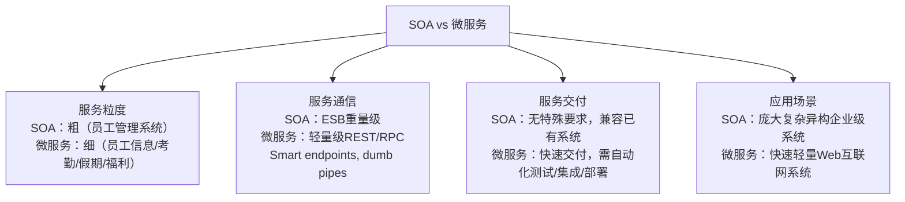
```mermaid
graph TD
    A["SOA vs 微服务"] --> B["服务粒度<br/>SOA：粗（员工管理系统）<br/>微服务：细（员工信息/考勤/假期/福利）"]
    A --> C["服务通信<br/>SOA：ESB重量级<br/>微服务：轻量级REST/RPC<br/>Smart endpoints, dumb pipes"]
    A --> D["服务交付<br/>SOA：无特殊要求，兼容已有系统<br/>微服务：快速交付，需自动化测试/集成/部署"]
    A --> E["应用场景<br/>SOA：庞大复杂异构企业级系统<br/>微服务：快速轻量Web互联网系统"]

```

Martin Fowler将微服务架构的服务通讯理念称为"Smart endpoints and dumb pipes"——之所以用"愚蠢"二字，其实就是与ESB对比的，因为ESB太强大了，既知道每个服务的协议类型，又知道每个服务的数据类型，还知道每个数据的格式；而微服务的"dumb pipes"仅仅做消息传递，对消息格式和内容一无所知。

---

## 五、微服务架构最佳实践——方法篇

### 5.1 服务粒度："三个火枪手"原则

针对微服务拆分过细导致的问题，建议基于团队规模进行拆分，分享"三个火枪手"原则——**一个微服务三个人负责开发**。

为什么是3个人？

**从系统规模来讲**，3个人负责开发一个系统，系统的复杂度刚好达到每个人都能全面理解整个系统，又能够进行分工的粒度。如果是2个人，系统复杂度不够，开发人员可能觉得无法体现自己的技术实力；如果是4个甚至更多人，系统复杂度又无法让开发人员对系统的细节都了解很深。

**从团队管理来说**，3个人可以形成一个稳定的备份，即使1个人休假或者调配到其他系统，剩余2个人还可以支撑。如果是2个人，抽调1个后剩余的1个人压力很大；如果是1个人，这就是单点了。

**从技术提升的角度**，3个人的技术小组既能够形成有效的讨论，又能够快速达成一致意见。如果是2个人，可能会出现互相坚持自己的意见；如果是4个人或更多，可能有的人并没有认真参与。

基于"三个火枪手"原则，根据团队规模来划分微服务数量。例如，团队最初有6个人，可以划分为2个微服务；团队扩展到12个人，可以将已有的2个微服务拆分为4个微服务。

> **深度注记**："三个火枪手"原则主要应用于微服务设计和开发阶段。如果微服务经过一段时间发展后已经比较稳定，处于维护期了，平均1个人维护1个微服务甚至几个微服务都可以。当然考虑到人员备份问题，每个微服务最好都安排2个人维护。

### 5.2 服务拆分方法

基于"三个火枪手"原则计算出合适的微服务数量后，具体怎么拆也是有技巧的：

**1. 基于业务逻辑拆分**

最常见的拆分方式，将系统中的业务模块按照职责范围识别出来，每个单独的业务模块拆分为一个独立的服务。

实践过程中最常见的问题就是团队成员对于"职责范围"的理解差异很大，经常出现争论。关键在于根据"三个火枪手"原则计算大概的服务数量范围，然后再确定合适的"职责范围"：
- 10人团队→约4个服务→"登录、注册、用户信息管理"都划到"用户服务"
- 100人团队→约40个服务→"用户登录"就是一个独立服务
- 1000人团队→约130个服务→"用户连接管理"可能就是一个独立服务

**2. 基于可扩展拆分**

将系统中的业务模块按照稳定性排序，将已经成熟和改动不大的服务拆分为**稳定服务**，将经常变化和迭代的服务拆分为**变动服务**。稳定的服务粒度可以粗一些，不稳定的服务粒度可以细一些。这样拆分主要是为了提升项目快速迭代的效率，避免在开发时影响了已有的成熟功能导致线上问题。

**3. 基于可靠性拆分**

将系统中的业务模块按照优先级排序，将可靠性要求高的核心服务和可靠性要求低的非核心服务拆分开来，然后重点保证核心服务的高可用。好处包括：
- 避免非核心服务故障影响核心服务（如日志上报导致核心服务故障）
- 核心服务高可用方案可以更简单
- 能够降低高可用成本

**4. 基于性能拆分**

将性能要求高或者性能压力大的模块拆分出来，避免性能压力大的服务影响其他服务。例如电商抢购，性能压力最大的是入口的排队功能，可以将排队功能独立为一个服务。

以上几种拆分方式不是多选一，而是可以根据实际情况自由排列组合。

### 5.3 服务发布方式

微服务架构下，服务数量多、部署频繁（70%的工作日都有部署操作），必须有合适的发布策略：

- **灰度发布**：先将新版本部署到少量节点，观察无问题后再全量发布
- **蓝绿部署**：同时维护两套环境，切换流量实现零停机发布
- **金丝雀发布**：将少量流量引入新版本，逐步增加比例

### 5.4 服务编排

当多个微服务需要协同完成一个业务流程时，有两种编排方式：

| 方式 | 核心思想 | 适用场景 |
|------|---------|---------|
| **Choreography（事件驱动）** | 各服务发布/订阅事件，松耦合 | 流程简单、步骤少 |
| **orchestration（中心编排）** | 一个编排服务统一调度流程 | 流程复杂、需要事务保障 |

### 5.5 技术架构选择

微服务的技术架构选择应遵循"优选成熟框架，避免盲目追逐新技术"的原则。使用统一的开发框架能够带来：
- 技术人员之间有共同的技术语言
- 不同团队之间人员可以快速流动
- 避免每类技术都需要投入大量人力去精通

---

## 六、微服务架构最佳实践——基础设施篇

大部分人在关注微服务的"small"和"lightweight"特性时，忽略了真正决定微服务成败的"automated"。如果"automated"相关的基础设施不健全，那微服务就是焦油坑。

微服务基础设施全景图：

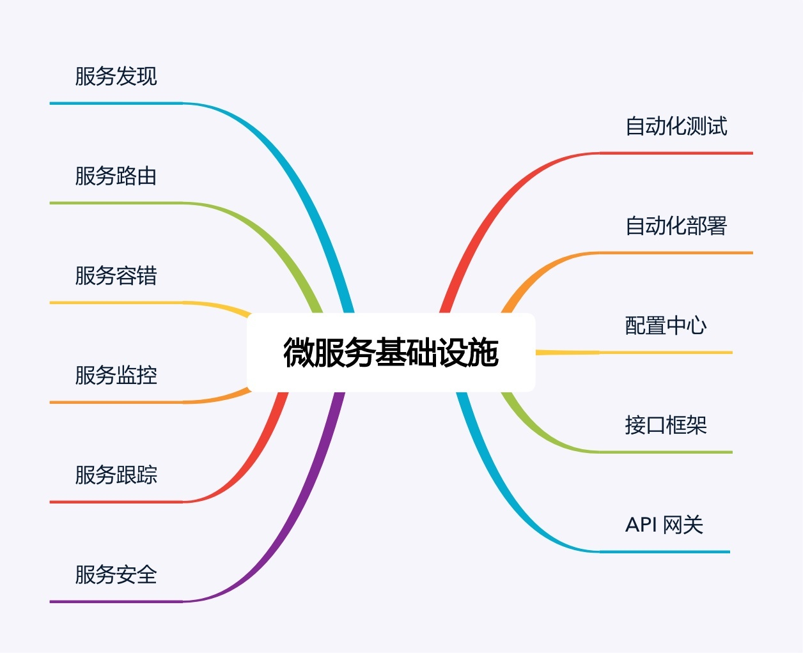

看到这张图，很多人都会倒吸一口凉气——说好的微服务的"轻量级"呢？确实如此，微服务并没有减少复杂度，而只是将复杂度从ESB转移到了基础设施。"服务发现""服务路由"等其实都是ESB的功能，只是在微服务中剥离出来成了独立的基础系统。

### 6.1 基础设施详解

**自动化测试**

微服务将原本大一统的系统拆分为多个独立运行的"微"服务，微服务之间的接口数量大大增加，并且微服务提倡快速交付，版本周期短，版本更新频繁。如果每次更新都靠人工回归整个系统，工作量大，效率低下，因此必须通过自动化测试系统来完成绝大部分测试回归的工作。自动化测试涵盖的范围包括代码级的单元测试、单个系统级的集成测试、系统间的接口测试，理想情况是每类测试都自动化。如果因团队规模和人力原因无法全面覆盖，至少要做到接口测试自动化。

**自动化部署**

微服务需要部署的节点增加了几倍甚至十几倍，微服务部署的频率也会大幅提升，综合计算下来微服务部署的次数是大一统系统部署次数的几十倍。这么大量的部署操作，如果继续采用人工手工处理，需要投入大量的人力且容易出错。自动化部署系统包括版本管理、资源管理、部署操作、回退操作等功能。

**配置中心**

微服务的节点数量非常多，通过人工登录每台机器手工修改，效率低、容易出错。配置中心包括配置版本管理、增删改查配置、节点管理、配置同步、配置推送等功能。

**接口框架**

微服务提倡轻量级的通信方式，一般采用HTTP/REST或者RPC方式统一接口协议。但光统一接口协议还不够，还需要统一接口传递的数据格式。接口框架不是一个可运行的系统，一般以库或者包的形式提供给所有微服务调用。

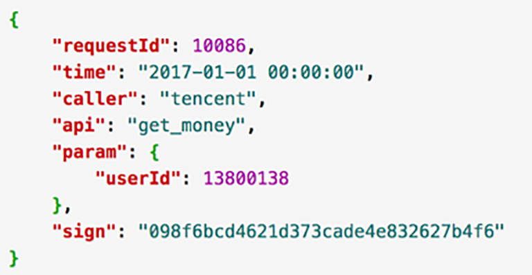

**API网关**

系统拆分为微服务后，内部微服务之间是互联互通的，但外部系统如果直接访问某个微服务，会非常"头大"——外部系统不需要也没办法理解这么多微服务的职责分工和边界。此外外部系统访问还涉及安全和权限的限制。API网关负责外部系统的访问操作，主要包括接入鉴权、权限控制、传输加密、请求路由、流量控制等功能。

**服务发现**

微服务种类和数量很多，如果通过手工配置的方式写入各个微服务节点，配置工作量很大且无法实时生效。服务发现主要有两种实现方式：

- **自理式**：每个微服务自己完成服务发现，服务启动后到服务注册表查询可用服务。

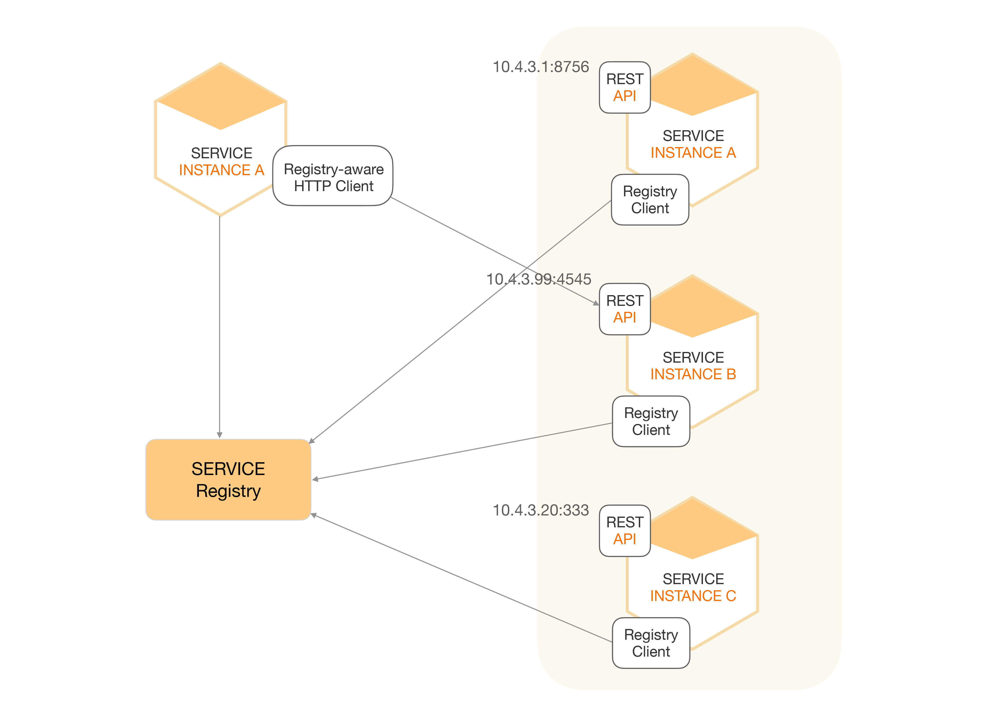

- **代理式**：微服务之间有负载均衡系统，由负载均衡系统完成服务发现。风险较大——一旦LOAD BALANCER系统故障会影响所有微服务之间的调用，性能压力也会随微服务数量和流量增加而成为瓶颈。

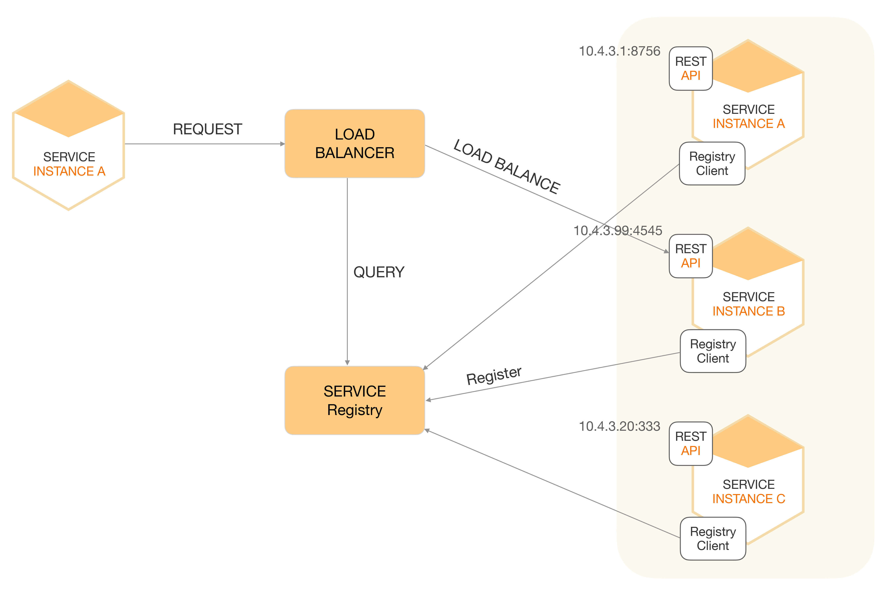

**服务路由**

服务路由和服务发现紧密相关，一般不会设计成独立运行的系统。常见路由算法有：随机路由、轮询路由、最小压力路由、最小连接数路由等。

**服务容错**

常见的服务容错包括请求重试、流控和服务隔离。通常情况下，服务容错会集成在服务发现和服务路由系统中。

**服务监控**

服务监控的主要作用有：实时搜集信息并进行分析，避免故障后再来分析；可以在实时分析的基础上进行预警，在问题萌芽阶段发觉并预警。通常建议做成独立的系统。

**服务跟踪（链路追踪）**

服务监控和服务跟踪的区别可以简单概括为宏观和微观的区别。例如，A服务通过HTTP协议请求B服务10次，服务监控会记录请求次数、响应时间平均值、错误码分布；而服务跟踪会记录其中某次请求的发起时间、响应时间、请求参数、返回的JSON对象等。目前绝大部分服务跟踪的实现技术都基于Google的Dapper论文。

**服务安全**

服务安全主要分为三部分：接入安全、数据安全、传输安全。通常可以集成到配置中心系统中进行实现。

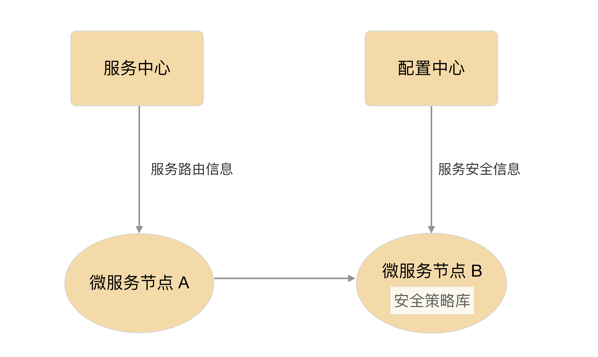

### 6.2 基础设施搭建优先级

虽然建设完善的微服务基础设施是一项庞大的工程，但也不用太过灰心。第一个原因是已经有开源的微服务基础设施全家桶（如Spring Cloud）；第二个原因是如果微服务数量不多的话，并不是每个基础设施都是必须的。建议按照下面优先级来搭建：

| 优先级 | 基础设施 | 目的 |
|-------|---------|------|
| **1（最基本）** | 服务发现、服务路由、服务容错 | 微服务运行的最低保障 |
| **2** | 接口框架、API网关 | 提升开发效率和外部对接效率 |
| **3** | 自动化部署、自动化测试、配置中心 | 提升测试和运维效率 |
| **4** | 服务监控、服务跟踪、服务安全 | 进一步提升运维效率 |

优先级3和4两类基础设施的重要性会随着微服务节点数量增加而越来越重要，但在微服务节点数量较少的时候，可以通过人工方式支撑。

---

## 七、微内核架构

### 7.1 核心思想

微内核架构（Microkernel Architecture），也被称为插件化架构（Plug-in Architecture），是一种面向功能进行拆分的可扩展性架构，通常用于实现基于产品的应用（存在多个版本、需要下载安装才能使用，与web-based相对应）。例如Eclipse这类IDE软件、UNIX这类操作系统、淘宝App这类客户端软件等，也有一些企业将自己的业务系统设计成微内核的架构，例如保险公司的保险核算逻辑系统，不同的保险品种可以将逻辑封装成插件。

微内核架构包含两类组件：**核心系统（core system）**和**插件模块（plug-in modules）**。核心系统负责和具体业务功能无关的通用功能，例如模块加载、模块间通信等；插件模块负责实现具体的业务逻辑。

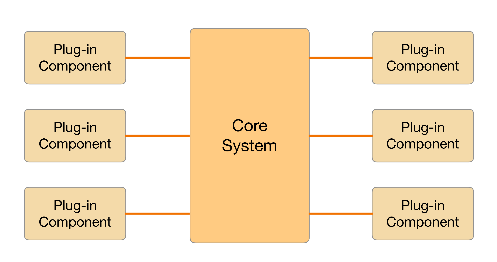

核心系统功能比较稳定，不会因为业务功能扩展而不断修改，插件模块可以根据业务功能的需要不断扩展。微内核的架构本质就是**将变化部分封装在插件里面，从而达到快速灵活扩展的目的，而又不影响整体系统的稳定**。

### 7.2 设计关键点

微内核的核心系统设计的关键技术有：插件管理、插件连接和插件通信。

**1. 插件管理**

核心系统需要知道当前有哪些插件可用，如何加载这些插件，什么时候加载插件。常见的实现方法是插件注册表机制——核心系统提供插件注册表（可以是配置文件、代码或数据库），含有每个插件模块的信息，包括名字、位置、加载时机（启动就加载还是按需加载）等。

**2. 插件连接**

插件连接指插件如何连接到核心系统。核心系统必须制定插件和核心系统的连接规范，然后插件按照规范实现，核心系统按照规范加载即可。常见的连接机制有OSGi（Eclipse使用）、消息模式、依赖注入（Spring使用），甚至使用分布式的协议如RPC或者HTTP Web的方式。

**3. 插件通信**

插件通信指插件间的通信。虽然设计时插件间是完全解耦的，但实际业务运行过程中，必然会出现某个业务流程需要多个插件协作，这就要求两个插件间进行通信。由于插件之间没有直接联系，通信必须通过核心系统，因此核心系统需要提供插件通信机制。这种情况和计算机类似——CPU、硬盘、内存、网卡是独立设计的配件，但计算机运行过程中它们肯定是有通信的，计算机通过主板上的总线提供了这些组件之间的通信功能。

### 7.3 OSGi架构简析

OSGi的全称是Open Services Gateway initiative，是Sun Microsystems、IBM、爱立信等公司于1999年3月成立的标准化组织制定的规范。OSGi具备动态化、热插拔、高可复用性、高效性、扩展方便等优点。Eclipse从3.0版本开始，抛弃了原来自己实现的插件化框架，改用了OSGi框架（Eclipse采用的OSGi框架称为Equinox，类似的实现还有Apache的Felix、Spring的Spring DM）。（注：OSGi 生态如今已式微，微内核的"核心系统+插件"思想更多以语言级插件机制或云原生方式实现，OSGi 仍可作为理解该模式的经典范本。）

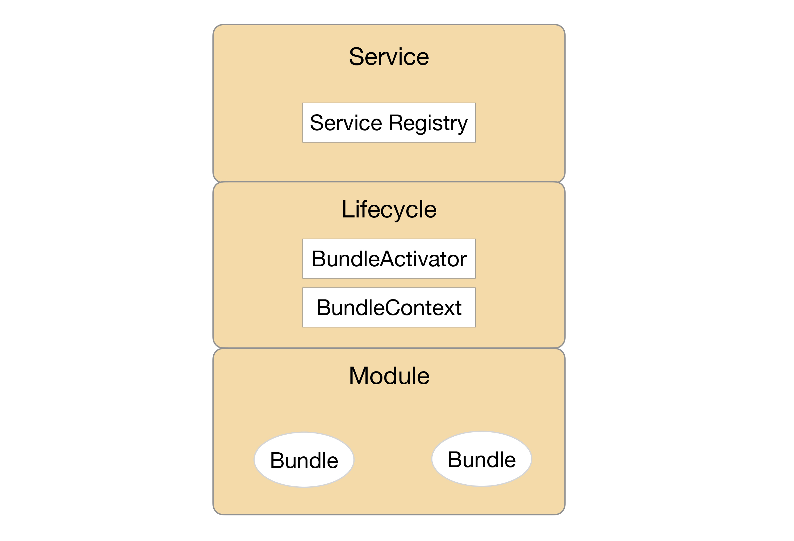

OSGi框架的逻辑架构分为三层：

**模块层（Module层）**——实现插件管理功能。OSGi中插件被称为Bundle，每个Bundle是一个Java的JAR文件，包含元数据文件MANIFEST.MF：

```
Bundle-ManifestVersion: 2
Bundle-Name: UserRegister
Bundle-SymbolicName: com.test.userregister
Bundle-Version: 1.0
Bundle-Activator: com.test.UserRegisterActivator
Import-Package: org.log4j;version="2.0"
Export-Package: com.test.userregister;version="1.0"
```

**生命周期层（Lifecycle层）**——实现插件连接功能，精确地定义了Bundle生命周期的操作（安装、更新、启动、停止、卸载）：

```java
public class UserRegisterActivator implements BundleActivator {
    public void start(BundleContext context) {
        UserRegister.instance = new UserRegister();
    }
    public void stop(BundleContext context) {
        UserRegister.instance = null;
    }
}
```

**服务层（Service层）**——实现插件通信功能。OSGi提供服务注册功能，各个插件将自己能提供的服务注册到OSGi核心的服务注册中心：

```java
// 注册服务
public class UserRegisterActivator implements BundleActivator {
    public void start(BundleContext context) {
        context.registerService(UserRegister.class.getName(),
            new UserRegisterImpl(), null);
    }
}

// 检索服务
public class Client implements BundleActivator {
    public void start(BundleContext context) {
        ServiceReference ref = context.getServiceReference(
            UserRegister.class.getName());
        ((UserRegister) context.getService(ref)).register();
    }
}
```

### 7.4 规则引擎：微内核的典型应用

规则引擎从结构上来看也属于微内核架构的一种具体实现，其中执行引擎可以看作是微内核，执行引擎解析配置好的业务流，执行其中的条件和规则，通过这种方式来支持业务的灵活多变。

规则引擎在计费、保险、促销等业务领域应用较多。例如电商促销，常见的促销规则有：满100送50、3件立减50、3件8折、第3件免费、跨店满200减100、新用户立减50……以上仅仅列出来常见的几种，实际上完整列下来可能有几十上百种，再加上排列组合，促销方案可能有几百上千种。这样的业务如果完全靠代码来实现，开发效率远远跟不上业务的变化速度。

规则引擎能灵活应对这种需求的原因：
1. **可扩展**：通过引入规则引擎，业务逻辑实现与业务系统分离，可以在不改动业务系统的情况下扩展新的业务功能。
2. **易理解**：规则通过自然语言描述，业务人员易于理解和操作，而不像代码那样只有程序员才能理解和开发。
3. **高效率**：规则引擎系统一般提供可视化的规则定制、审批、查询及管理，方便业务人员快速配置新的业务。

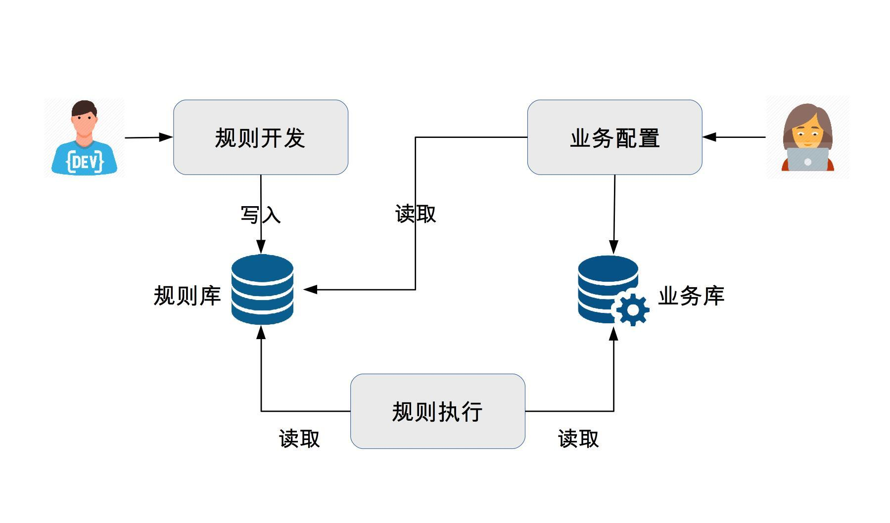

规则引擎的基本工作流程：
1. 开发人员将业务功能分解提炼为多个规则，将规则保存在规则库中
2. 业务人员根据业务需要，将规则排列组合配置成业务流程，保存在业务库中
3. 规则引擎执行业务流程实现业务功能

对照微内核架构的设计关键点：
- **插件管理**：规则就是微内核架构的插件，引擎就是微内核架构的内核。规则可以被引擎加载和执行。规则引擎架构中，规则一般保存在规则库中，通常使用数据库来存储。
- **插件连接**：规则引擎也规定了规则开发的语言，业务人员需要基于规则语言来编写规则文件，然后由规则引擎加载执行规则文件来完成业务功能。因此规则引擎的插件连接实现机制就是规则语言。
- **插件通信**：规则之间通过数据流和事件流通信，单个规则不需要依赖其他规则，规则只需要输出数据或者事件，由引擎将数据或者事件传递到下一个规则。

目前最常用的规则引擎是开源的JBoss Drools，采用Java语言编写，基于Rete算法。Drools的优点包括：非常活跃的社区支持、快速的执行速度、与Java Rule Engine API（JSR-94）兼容、提供了基于Web的BRMS——Guvnor（Guvnor 已被 KIE Workbench/Business Central 取代）。Guvnor提供了规则管理的知识库，通过它可以实现规则的版本控制以及规则的在线修改与编译。

虽然Drools号称简单易用，但实际上其规则语言和编程语言比较类似，普通业务人员面对这样的规则语言学习成本和理解成本还是比较高：

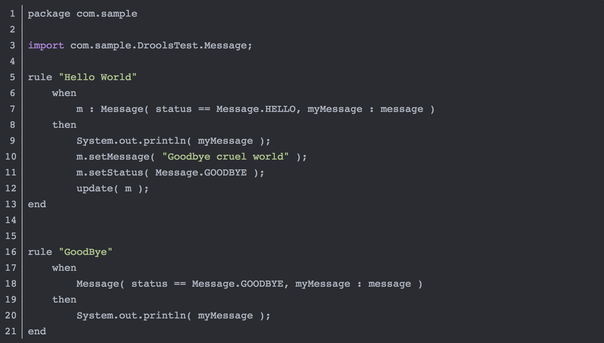

因此通常需要基于Drools进行封装，将规则配置做成可视化的操作：

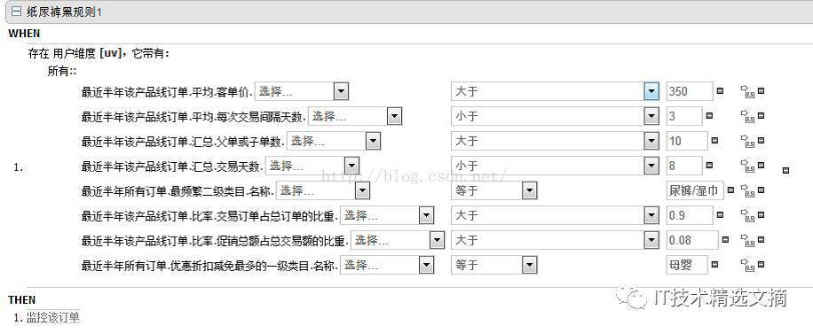

### 7.5 微内核 vs 微服务

| 维度 | 微内核 | 微服务 |
|------|--------|--------|
| 部署方式 | 单进程内 | 独立进程 |
| 通信方式 | 函数调用/事件 | 网络（REST/gRPC） |
| 扩展方式 | 增加插件模块 | 增加新服务 |
| 适用场景 | 规则引擎、IDE、编辑器、客户端软件 | 互联网业务系统 |
| 典型实现 | OSGi/Eclipse、VS Code Extension、规则引擎Drools | Spring Cloud、Dubbo |

> **深度注记**：规则引擎属于面向功能拆分的微内核架构。按照三种拆分思路的分析，规则引擎将每个规则作为一个独立的功能模块（插件），执行引擎作为核心系统负责加载和执行规则，新规则的添加不需要修改核心系统——这正是"面向功能拆分"的扩展方式。

---

## 八、架构范式：从实践到思维工具

### 8.1 什么是架构范式

架构范式是**针对特定问题域的架构思维框架**——不是代码、不是框架、不是可直接复用的库，而是"看问题的方式"。它定义了问题的本质特征、解决的核心思路、关键的设计决策点和常见的反模式。

架构范式与设计模式的关系：

| 维度 | 设计模式 | 架构范式 |
|-----|---------|---------|
| 粒度 | 类/对象级别 | 模块/子系统级别 |
| 关注点 | 代码结构 | 业务结构 |
| 抽象度 | 相对具体 | 相对抽象 |
| 影响范围 | 单个类/函数 | 整个系统 |
| 稳定性 | 语言相关，相对稳定 | 业务相关，持续演进 |

架构范式包含设计模式，但不等同于设计模式。一个架构范式中可能运用多种设计模式。例如IO DOM范式包含：接口子集模式（结构型）、渲染管道模式（行为型）、参数泛化模式（创建型）。

### 8.2 架构范式的三个层次

| 层次 | 粒度 | 示例 |
|------|------|------|
| **通用架构范式** | 跨领域通用 | 分层架构、MVC/MVVM、管道架构（Pipeline）、事件驱动架构、微服务架构 |
| **领域架构范式** | 特定业务领域 | 文本处理范式（编译器Pipeline、DOM操作、流式处理）、IO子系统范式（IO DOM + View DOM）、存储引擎范式（LSM Tree/B+Tree）、渲染引擎范式 |
| **系统架构范式** | 具体系统专属 | Office架构范式（Core DOM + IO DOM + View DOM）、浏览器架构范式（Blink/Gecko架构）、操作系统架构范式（内核/驱动/文件系统） |

### 8.3 核心架构范式详解

**范式一：接口子集范式**

适用场景：全局性功能需要访问核心数据的子集。核心思路：定义独立的接口族描述数据子集，全局性功能只依赖此接口。关键决策点：
- 子集的粒度：太粗则解耦不彻底，太细则接口膨胀
- 转换的时机：按需转换 vs 预先转换
- 子集的维护成本：核心数据模型变更时子集如何同步

**范式二：插件范式**

适用场景：系统需要在不修改核心代码的前提下扩展功能。核心思路：核心系统提供DOM API + 事件监听 + 插件加载机制。关键决策点：
- 事件的粒度：太细则事件风暴，太粗则插件无法介入
- DOM API的暴露范围：太少则插件能力不足，太多则核心系统负担增加
- 插件的生命周期管理：加载、卸载、依赖处理

**范式三：管道范式**

适用场景：数据需要经过多个阶段的加工处理。核心思路：将处理过程分解为多个独立的阶段，数据在阶段间流动。关键决策点：
- 阶段的粒度：太细则管道过长，太粗则灵活性不足
- 阶段间的数据格式：统一格式 vs 各阶段自定义
- 错误处理策略：短路 vs 容错

**选择原则**：选择最简单的范式解决问题。如果简单的回调就能解决，不要上插件机制。每个范式都有其适用边界，超出边界就是过度设计。

| 范式 | 适用边界 | 超出边界的表现 |
|-----|---------|-------------|
| 接口子集 | 多个模块需要访问同一数据子集 | 只有一个模块使用时，接口冗余 |
| 插件 | 有足够多的第三方扩展需求 | 只有一两个"插件"时，机制过重 |
| 管道 | 数据确实需要多阶段处理 | 只有单一处理阶段时，管道冗余 |

### 8.4 架构范式的演进循环

架构范式不是一成不变的，它在实践中不断演进：

1. **从实践中来**：最初是对具体问题解决方案的抽象
2. **在复用中验证**：跨多个项目验证其通用性
3. **在演进中完善**：随着新需求、新场景的出现而迭代
4. **在传承中升华**：被社区接纳为标准范式，形成共识

```
实践积累（解决具体问题）→ 抽象提炼（提取通用模式）→ 复用验证（跨项目验证）→ 迭代完善（适应新场景）→ 传承升华（形成社区共识）→ 回到实践积累
```

---

## 九、全局性功能设计

### 9.1 全局性功能的本质

全局性功能是横跨多个核心模块的功能需求（如日志、监控、IO、权限控制、事务管理），其本质特征是：

- **侵入性**：它需要与多个核心模块交互，天然具有侵入核心系统的倾向
- **正交性**：它本身是独立的业务领域，与核心系统的业务正交
- **可扩展性**：往往存在多种实现变体（如多种文件格式、多种日志后端）

**核心原则：全局性功能应该是独立的模块，不应该侵蚀核心系统。**

### 9.2 全局性功能的三层模型

以Office软件的IO子系统为例：

- **接口层（IO DOM）**：定义IO需要访问哪些数据，IoDocument接口族
- **转换层**：Core DOM→IO DOM的转换（Document.Io()方法），按需转换，只读子集
- **实现层**：各格式存盘/读盘模块（流式文档Word/RTF/HTML；分页文档PDF/PS；剪贴板）

### 9.3 AOP的误区

AOP（面向切面编程）试图通过"织入"来解决全局性功能的问题，但本质上是"隐式耦合"：
- 全局性功能的逻辑被隐藏在切面中，不可见不可控
- 切面与核心系统的耦合是隐式的，调试困难
- 切面的执行顺序是隐式的，行为不确定

**对比**：IO DOM方案是"显式解耦"——全局性功能的接口和数据流都是显式的，可控可调试。

### 9.4 核心权衡

**转换成本 vs 耦合成本**：IO DOM方案引入了Core DOM到IO DOM的转换成本。但这个转换是值得的——转换是短暂的，耦合是持久的。用短暂的转换成本换取持久的低耦合，是值得的。

| 方案 | 接口复杂度 | 核心系统侵入度 | 新增格式成本 |
|-----|----------|-------------|-----------|
| 方法散落各处 | 低 | 极高 | 高（改核心系统） |
| Visitor/SAX | 中 | 中 | 中（改Visitor） |
| IO DOM子集 | 较高 | 低 | 低（加新模块） |
| IO DOM + View DOM | 高 | 极低 | 极低（加新模块） |

---

## 十、架构老化与重构

### 10.1 架构老化的必然性

架构老化的根本原因不是技术选型错误，不是工程师能力不足，而是**需求的不确定性与架构的确定性之间的永恒矛盾**。五大原因：

1. **需求叠加**：每个新需求都是在既有架构上增加约束，约束累积导致架构僵化
2. **边界模糊**：模块边界随需求叠加而逐渐模糊，模块职责不再清晰
3. **耦合累积**：模块间耦合度随时间递增，核心系统伤害值不断增长
4. **知识流失**：核心人员离开，架构意图逐渐不为人知
5. **补丁文化**：捏着鼻子做需求，一个需求一个补丁，系统不堪重负

架构老化的量化指标：

| 指标 | 计算方式 | 健康阈值 | 老化预警 |
|-----|---------|---------|---------|
| 核心系统伤害值 | 修改行数的对数累加 | 低 | 持续增长 |
| 模块总耦合度 | 依赖数×不成熟度系数 | 低 | 依赖数量增加 |
| 新功能开发成本 | 人天/功能点 | 稳定或下降 | 持续上升 |
| 缺陷密度 | Bug数/千行代码 | 低 | 持续上升 |
| 测试覆盖率变化 | 新增代码覆盖率 | 不低于既有水平 | 持续下降 |

### 10.2 重构策略：从局部到全局

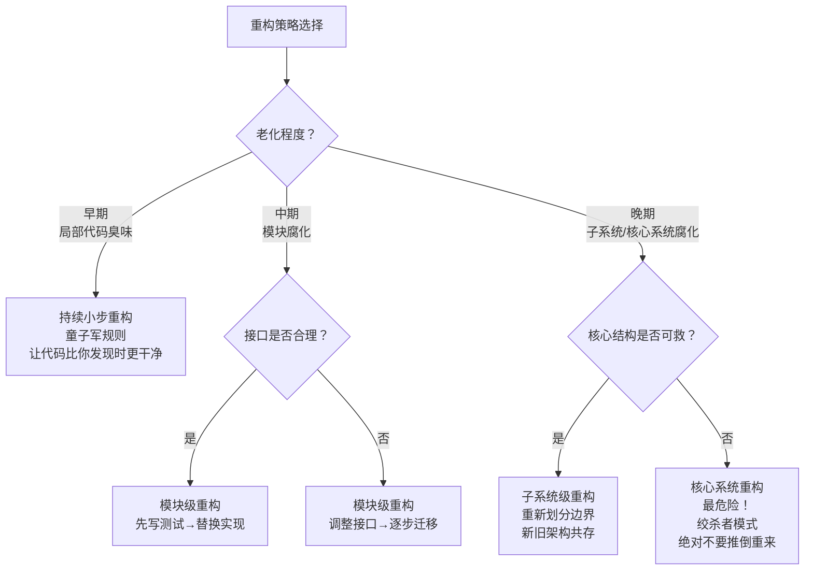
```mermaid
graph TD
    A["重构策略选择"] --> B{老化程度？}

    B -->|"早期<br/>局部代码臭味"| C["持续小步重构<br/>童子军规则<br/>让代码比你发现时更干净"]
    B -->|"中期<br/>模块腐化"| D{接口是否合理？}
    B -->|"晚期<br/>子系统/核心系统腐化"| E{核心结构是否可救？}

    D -->|是| F["模块级重构<br/>先写测试→替换实现"]
    D -->|否| G["模块级重构<br/>调整接口→逐步迁移"]

    E -->|是| H["子系统级重构<br/>重新划分边界<br/>新旧架构共存"]
    E -->|否| I["核心系统重构<br/>最危险！<br/>绞杀者模式<br/>绝对不要推倒重来"]

```

**策略一：持续小步重构（首选）**

核心思想：在正常功能开发过程中持续进行小规模重构，不让问题积累。实施要点：发现代码臭味立刻修复、每次提交都让代码比之前更好、依赖充分的自动化测试保障、遵循"童子军规则"——让代码比你发现时更干净。

**策略二：模块级重构**

核心思想：对特定模块进行独立的架构调整，不影响其他模块。实施要点：先写测试覆盖模块的所有行为；保持接口不变替换实现（实现级重构）；或调整接口逐步迁移调用方（接口级重构）；使用适配器模式在过渡期兼容旧接口。

**策略三：子系统级重构**

核心思想：对跨多个模块的子系统进行重新设计。实施要点：先明确新架构的目标形态；逐步迁移，新旧架构共存；每个迁移步骤都可独立验证；设定迁移的里程碑和截止日期。

**策略四：核心系统重构（最危险）**

核心思想：对核心系统进行重新设计，影响面最大。实施要点：这是最危险的重构，必须有充分的理由和充分的准备；先建立完整的回归测试体系；**采用绞杀者模式（Strangler Pattern）**，逐步替换核心系统；绝对不要"推倒重来"。

### 10.3 绞杀者模式

用新的微服务逐步替换单体应用中的模块：
1. 新功能用微服务实现
2. 在网关层将旧功能的流量逐步切到微服务
3. 旧功能逐步下线
4. 最终完成迁移

### 10.4 推倒重来 vs 重构

许式伟强调：**改代码的过程才是架构能力真正升华的过程。**推倒重来意味着放弃了从既有架构中学习的机会，也放弃了在约束中创新的能力。

何时考虑推倒重来（须同时满足全部条件）：
1. 既有架构的核心思想已经完全过时，无法通过增量调整挽救
2. 团队对既有系统的理解几乎为零，重构成本高于重写成本
3. 新架构已经在独立项目中验证过可行性
4. 有足够的资源和时间完成重写，且不会影响既有用户

推倒重来的典型陷阱：低估复杂度→功能缺失→双系统维护→进度压力→新系统也腐化→恶性循环。

Netscape Navigator 6.0的推倒重来是软件史上最著名的失败案例——从Communicator 4.x的代码库推倒重来，重写期间竞争对手持续迭代，新版本发布时已失去市场。

---

## 十一、可扩展架构的统一视图

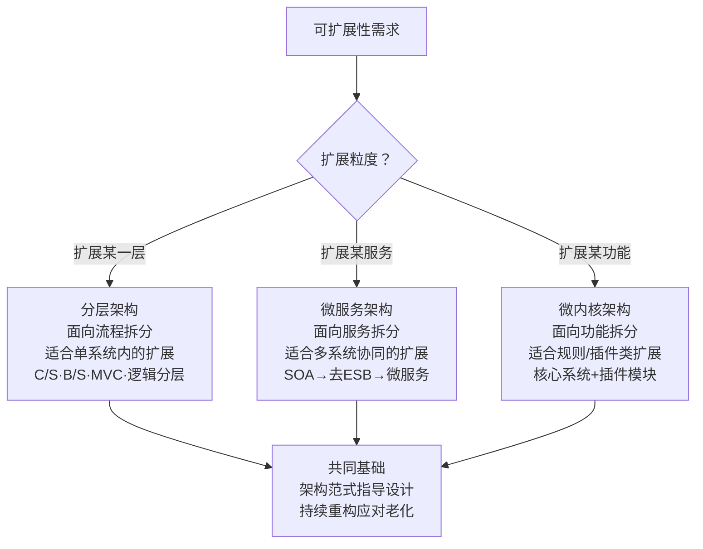
```mermaid
graph TD
    A["可扩展性需求"] --> B{扩展粒度？}

    B -->|"扩展某一层"| C["分层架构<br/>面向流程拆分<br/>适合单系统内的扩展<br/>C/S·B/S·MVC·逻辑分层"]
    B -->|"扩展某服务"| D["微服务架构<br/>面向服务拆分<br/>适合多系统协同的扩展<br/>SOA→去ESB→微服务"]
    B -->|"扩展某功能"| E["微内核架构<br/>面向功能拆分<br/>适合规则/插件类扩展<br/>核心系统+插件模块"]

    C --> F["共同基础<br/>架构范式指导设计<br/>持续重构应对老化"]
    D --> F
    E --> F

```

---

## 总结

| 核心要点 | 关键结论 |
|---------|---------|
| 拆分思想 | 流程>服务>功能；不同拆分决定不同扩展方式；可组合使用 |
| 分层架构 | 面向流程拆分；隔离关注点是本质；层层传递约束两两依赖；核心保证层间依赖稳定（如VFS） |
| SOA | 面向服务拆分；服务+ESB+松耦合三大组件；ESB是核心也是瓶颈；适合异构企业级系统整合 |
| 微服务 | 与SOA本质不同的架构理念；small+lightweight+automated三个关键词；六大陷阱需警惕 |
| 微服务最佳实践-方法篇 | "三个火枪手"原则；四种拆分方法（业务/可扩展/可靠性/性能）可组合使用 |
| 微服务最佳实践-基础设施篇 | 服务发现/配置中心/API网关/链路追踪/熔断降级等；搭建有优先级；Spring Cloud可参考 |
| 微内核 | 核心系统+插件模块；插件管理/连接/通信三大关键点；OSGi和规则引擎是典型实现 |
| 架构范式 | 思维工具而非代码；通用/领域/系统三层次；接口子集/插件/管道三大范式；选择最简单的 |
| 全局性功能设计 | 显式解耦优于隐式耦合（IO DOM vs AOP）；转换成本<耦合成本 |
| 架构老化 | 需求不确定性vs架构确定性的永恒矛盾；5大原因+5大量化指标 |
| 重构策略 | 小步→模块→子系统→核心；推倒重来是最后手段；绞杀者模式逐步替换；改代码过程即能力升华 |

**思考题**：
1. 规则引擎是常用的一种支持可扩展的方式，按照三种拆分思路的分析，它属于哪一类？
2. 为什么互联网企业很少采用SOA架构？
3. 你们的业务有采用微服务吗？谈谈实践中的经验和教训。
4. 由10位Java高级软件工程师组成的开发团队，采用自研方式完成所有微服务基础设施开发，你预测需要多长时间？

**关联阅读**：
- [架构设计原则](06-架构设计原则.md)
- [架构设计流程](07-架构设计流程.md)
- [互联网架构全景与重构](14-互联网架构全景与重构.md)
- [开源选型与架构演进](15-开源选型与架构演进.md)

---

> **延伸视角**（许式伟）
>
> 华仔从"拆"的思想出发，系统梳理了分层/SOA/微服务/微内核四种可扩展架构模式，侧重模式选型和工程落地。许式伟从"架构范式"和"概要设计"角度提供了更深层的思考框架：
>
> **1. "拆"的本质是"分解"心法的工程化**。华仔的三种拆分思路（流程/服务/功能），对应许式伟"抽象·分解·组合"中"分解"的不同维度：面向流程是时间维度的分解（先做什么后做什么），面向服务是空间维度的分解（谁负责什么），面向功能是逻辑维度的分解（能力边界在哪）。
>
> **2. 概要设计是"拆"的精确化**。许式伟强调概要设计回答三个核心问题：分（如何分解为模块）、合（模块间如何协作）、变（如何应对变化）。华仔讲了"怎么拆"，许式伟补充了"拆完怎么合"和"拆完怎么应对变化"——接口契约和行为约束是"合"的保障，开闭原则和变化点分析是"变"的机制。
>
> **3. 架构范式是"拆"的经验沉淀**。华仔的四种架构模式是通用架构范式，许式伟进一步提炼了领域级和系统级范式——编译器Pipeline、DOM操作、流式处理等。架构范式的价值在于：架构师不必每次从零开始，而是在前人智慧基础上做更优决策。
>
> **4. 架构老化是"拆"的边界漂移**。最初清晰的模块边界随需求叠加逐渐模糊——这正是"开闭原则"中"闭"被侵蚀的过程。重构的核心是"重新审视边界"（许式伟第60讲标题即"边界，不断重新审视边界"），本质上是将模糊的边界重新明确化。
>
> **5. 全局性功能设计是"拆"的边界保护**。IO DOM模式的核心洞察是"转换成本<耦合成本"——用短暂的转换换取持久的低耦合。AOP的"隐式织入"看似优雅，实则是隐藏的耦合，违反了显式接口的原则。
>
> **融合洞见**：可扩展架构设计的完整心法是"拆→合→变→修"——拆（分解模块）、合（定义接口）、变（预判变化点）、修（持续重构边界）。华仔聚焦"拆"和"变"，许式伟补充了"合"（接口契约）和"修"（边界审视）。两者结合，构成了可扩展架构设计的完整方法论。