# 互联网架构全景与重构 | 五层架构模板·技术演进·重构三式

## 章节导言

理解了可扩展架构的各种模式后，架构师需要站在更高的视角俯瞰整个互联网技术体系。抛开各公司差异很大的业务，站在技术角度看，互联网行业的技术架构**殊途同归**——最终都趋同于一个标准的技术结构。

互联网业务千差万别，但由于它们具有"规模决定一切"的相同点，其发展路径也基本上是一致的。互联网业务发展一般分为几个时期：初创期、发展期、竞争期、成熟期。不同时期的差别主要体现在两个方面：**复杂性**和**用户规模**。而这两个因素的本质都是"量变带来质变"。

这个标准技术结构可以划分为五个层次：**存储层、开发层与服务层、网络层、用户层与业务层、平台层**。理解这五层架构模板，架构师就能对一家公司的整体技术架构形成完整全貌认知。

同时，架构不是一劳永逸的。系统随业务发展不断演化，当架构不满足业务时需要重构。重构对架构师的综合能力要求极高——"给飞行中的波音747换引擎"，需要掌握**有的放矢、合纵连横、运筹帷幄**三式心法。

**核心问题**：
1. 互联网技术演进的四个阶段各有什么特征？驱动因素是什么？
2. 互联网五层架构模板各层的核心技术点和演进规律是什么？
3. 架构重构的三大挑战和三式心法分别是什么？
4. 如何做到"有的放矢"——从纷繁问题中识别核心复杂度？
5. 如何做到"合纵连横"——将技术语言转换为业务语言推动重构？
6. 如何做到"运筹帷幄"——分阶段有序推进重构？

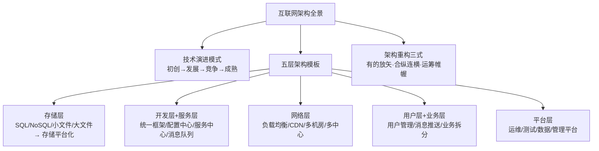
```mermaid
graph TD
    A["互联网架构全景"] --> B["技术演进模式<br/>初创→发展→竞争→成熟"]
    A --> C["五层架构模板"]
    A --> D["架构重构三式<br/>有的放矢·合纵连横·运筹帷幄"]

    C --> C1["存储层<br/>SQL/NoSQL/小文件/大文件<br/>→ 存储平台化"]
    C --> C2["开发层+服务层<br/>统一框架/配置中心/服务中心/消息队列"]
    C --> C3["网络层<br/>负载均衡/CDN/多机房/多中心"]
    C --> C4["用户层+业务层<br/>用户管理/消息推送/业务拆分"]
    C --> C5["平台层<br/>运维/测试/数据/管理平台"]

```

---

## 一、互联网技术演进模式

### 1.1 基线架构

互联网的标准技术架构如下图所示，这张图基本上涵盖了互联网技术公司的大部分技术点，不同的公司只是在具体的技术实现上稍有差异，但不会跳出这个框架的范畴。

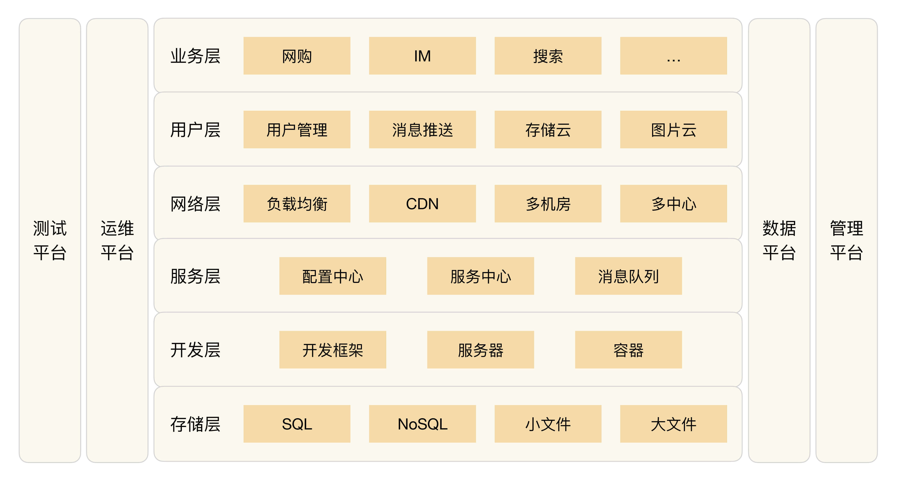

基线架构的核心组成：负载均衡 + N台服务器 + 数据库/文件系统/缓存。这是所有互联网系统的起点。

### 1.2 业务复杂性驱动的演进

互联网业务发展第一个主要方向就是"业务越来越复杂"，我们来看看不同时期业务的复杂性的表现。

**初创期**

互联网业务刚开始一般都是一个创新的业务点，这个业务点的重点不在于"完善"而在于"创新"，只有创新才能吸引用户；而且因为其"新"的特点，其实一开始是不可能很完善的。只有随着越来越多的用户的使用，通过快速迭代试错、用户的反馈等手段，不断地在实践中去完善，才能继续创新。

初创期的业务对技术就一个要求："快"，但这时又是创业团队最弱小的时期，可能就几个技术人员，所以十八般武艺都需要用上：能买就买，有开源的就用开源的。

以淘宝和QQ为例，第一版的淘宝和QQ与现在相比，几乎看不出是同一个业务：

**发展期**

当业务推出后经过市场验证如果是可行的，则吸引的用户越来越多，原来不完善的业务进入快速发展时期。如何做到"快"，一般会经历下面几个阶段：

- **堆功能期**：业务进入快速发展期的初期，此时团队规模也不大，业务需求又很紧，最快实现业务需求的方式是继续在原有系统里不断增加新功能，重构和架构优化受制于人力和业务压力而放在一边。
- **优化期**：系统越来越复杂，堆功能越来越吃力。分为两派——优化派（重构、分层、优化查询、换SSD、加缓存等，改动小见效快但治标不治本）和架构派（拆分系统，动作大耗时长但治本）。大部分情况下"优化派"会赢，因为保证当下竞争力是最主要的。
- **架构期**：优化也顶不住了（Oracle再强大也不可能一台顶住1亿交易量），只能进行架构调整。架构期可以用的手段归根结底就是一个字"拆"——拆功能、拆数据库、拆服务器。

**竞争期**

当业务形成一定规模后，竞争对手加入。新业务的创新给技术带来典型压力就是系统数量更多，同时原有系统也拆得更多。系统数量的量变带来了技术工作的质变：

- **重复造轮子**：各系统相似的工作越来越多（存储、缓存、数据库），新建一个系统这些工作又要做一遍。
- **系统交互一团乱麻**：系统间交互变成网状，4个系统的交互路径是6个，10个系统是45个。联调成了研发灾难、联测成了测试灾难、部署成了运维灾难。

针对这个时期的技术手段：

| 手段 | 目的 | 典型实现 |
|------|------|---------|
| **平台化** | 解决"重复造轮子" | 存储平台化（淘宝TFS、京东JFS）、数据库平台化（百度DBProxy、淘宝TDDL）、缓存平台化（Twitter Twemproxy、腾讯TTC） |
| **服务化** | 解决"系统交互" | 消息队列（淘宝Notify/MetaQ、Kafka）、服务框架（Facebook Thrift、淘宝HSF、当当Dubbox） |

**成熟期**

企业成为行业领头羊后，业务创新机会不大，转向"求精"——响应时间是否更快？用户体验是否更好？成本是否更低？此时技术上该拆的也拆了，该平台化的也平台化了，更多的是进行优化。但有时候为了某个优化，系统要做很大改变——例如将用户响应时间从200ms降低到50ms，可能需要从CDN、数据库、网络等多方面优化。

### 1.3 用户规模驱动的演进

用户量增大对技术的影响主要体现在两个方面：

**性能要求越来越高**

以MySQL为例，单台MySQL机器支撑的TPS和QPS最高也就是万级。当用户量增长后，必然要考虑使用多台MySQL，从集中式存储变为分布式存储。分布式将带来复杂度的大幅度上升——分库分表、读写分离、复制、同步等。

**可用性要求越来越高**

1万用户时宕机1小时影响不大；100万用户时宕机10分钟，投诉电话就被打爆了。1万用户宕机1小时损失几千元；100万用户宕机10分钟损失可能就是几十万元。

### 1.4 量变到质变

通过前面的分析，可以看到互联网业务驱动技术发展的两大主要因素是复杂性和用户规模，而这两个因素的本质其实都是"量变带来质变"。

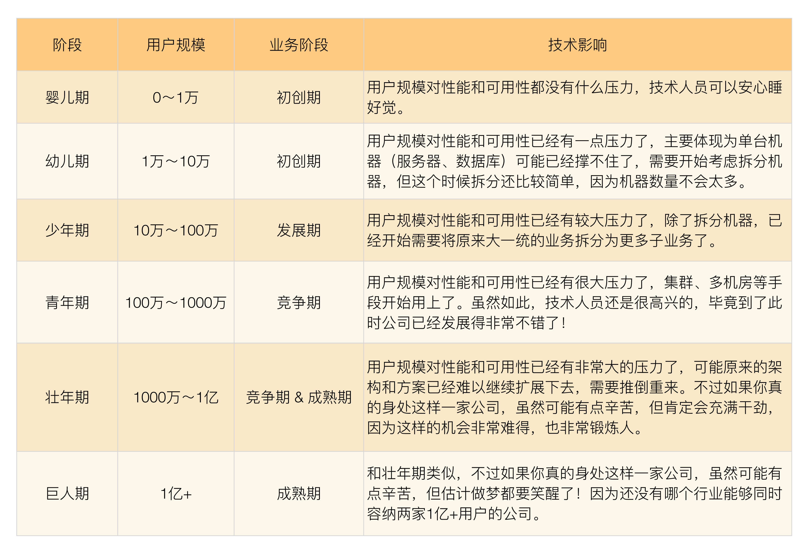

究竟用户规模发展到什么阶段才会由量变带来质变，虽然不同的业务有所差别，但基本上可以按照上面这个模型去衡量。应对业务质变带来的技术压力，不同时期有不同的处理方式，但核心目标都是为了满足业务"快"的要求。

**当发现业务快不起来的时候，其实就是技术的水平已经跟不上业务发展的需要了，技术变革和发展的时候就到了。**更好的做法是在问题还没有真正暴露出来就能够根据趋势预测下一个转折点，提前做好技术上的准备，这对技术人员的要求是非常高的。

**技术演进四阶段的总结**：

| 阶段 | 核心复杂度 | 技术手段 | 典型案例 |
|------|-----------|---------|---------|
| 初创期 | 快速上线 | 能买就买、有开源就用开源 | 淘宝买PHP系统来改、QQ简单实现 |
| 发展期 | 堆功能→优化→架构拆分 | 先堆功能再优化，最后架构拆分 | 淘宝Oracle替代MySQL、Java替代PHP |
| 竞争期 | 重复造轮子+系统交互混乱 | 平台化+服务化 | 淘宝TFS/HSF/Notify |
| 成熟期 | 极致性能和体验 | 针对性优化 | 响应时间从200ms降到50ms |

---

## 二、存储层

### 2.1 SQL

SQL即我们通常所说的关系数据。前几年NoSQL火了一阵子，很多人都理解为NoSQL是完全抛弃关系数据，全部采用非关系型数据。但经过几年的试验后，大家发现关系数据不可能完全被抛弃，NoSQL不是No SQL，而是Not Only SQL，即NoSQL是SQL的补充。

所以互联网行业也必须依赖关系数据，考虑到Oracle太贵还需要专人维护，一般情况下互联网行业都是用MySQL、PostgreSQL这类开源数据库。这类数据库的特点是开源免费，拿来就用；但缺点是性能相比商业数据库要差一些。随着互联网业务的发展，性能要求越来越高，必然要面对一个问题：将数据拆分到多个数据库实例才能满足业务的性能需求（其实Oracle也一样，只是时间早晚的问题）。

数据库拆分满足了性能的要求，但带来了复杂度的问题：数据如何拆分、数据如何组合？这个复杂度的问题解决起来并不容易，如果每个业务都去实现一遍，重复造轮子将导致投入浪费、效率降低，业务开发想快都快不起来。

**演进路径**：单机MySQL → 分库分表 → 数据库中间件 → SQL存储平台

| 阶段 | 触发条件 | 解决方案 | 典型实现 |
|------|---------|---------|---------|
| 单机 | 业务初期 | 够用即可 | MySQL单机 |
| 分库分表 | 单机性能不足 | 业务自行拆分 | 手动分库分表 |
| 中间件 | 重复造轮子 | 统一中间件 | 百度DBProxy、淘宝TDDL、360 Atlas、MySQL Router |
| 存储平台 | 服务器过多、资源浪费 | 平台化 | 淘宝UMP（Unified MySQL Platform） |

中间件阶段：互联网公司流行的做法是业务发展到一定阶段后，将分库分表功能独立成中间件。不过这部分的技术要求很高，将分库分表做到自动化和平台化不是一件容易的事情，所以一般是规模很大的公司才会自己做。中小公司建议使用开源方案，例如MySQL官方推荐的MySQL Router、360开源的数据库中间件Atlas。

存储平台阶段：假如公司业务继续发展、规模继续扩大，SQL服务器越来越多，如果每个业务都基于统一的数据库中间件独立部署自己的SQL集群，就会导致新的复杂度问题——数据库资源使用率不高比较浪费；各SQL集群分开维护，投入的维护成本越来越高。因此实力雄厚的大公司会在SQL集群上构建SQL存储平台，以对业务透明的形式提供资源分配、数据备份、迁移、容灾、读写分离、分库分表等一系列服务。

### 2.2 NoSQL

NoSQL在数据结构上与SQL不同（Memcache的key-value、Redis的复杂数据结构、MongoDB的文档结构），无一例外地将性能作为一大卖点，很好地弥补了关系数据库的不足，因此在互联网行业NoSQL的应用基本上是基础要求。

NoSQL方案一般本身就提供集群功能（Memcache的一致性Hash集群、Redis 3.0的集群），因此NoSQL在刚开始应用时很方便，不像SQL分库分表那么复杂。一般公司也不会在开始时就考虑将NoSQL包装成存储平台，但如果公司发展很快，Memcache节点有上千甚至几千时，NoSQL存储平台就很有意义了——集中管理大大提升运维效率；资源利用效率提升10%就能减少大量机器（2000台机器，利用率提升10%就可以减少200台，一年几十万元就节省出来了）。

**演进路径**：独立使用NoSQL → NoSQL集群 → NoSQL存储平台

存储平台核心能力：
- **资源动态按需分配**：同一台Memcache服务器可根据内存利用率分配给多个业务使用
- **资源自动化管理**：新业务只需申请多少缓存空间即可，无需关注具体是哪些服务器在为自己提供服务
- **故障自动化处理**：某台服务器挂掉后，有另外一台备份服务器能立刻接管缓存请求，不会导致丢失很多缓存数据

当然要发展到这个阶段，一般也是大公司才会这么做——如果只有几十台NoSQL服务器，做存储平台收益不大；但如果有几千台NoSQL服务器，NoSQL存储平台就能够产生很大的收益。

### 2.3 小文件存储

除了关系型的业务数据，互联网行业还有很多用于展示的数据：淘宝的商品图片、商品描述；Facebook的用户图片；新浪微博的一条微博内容等。这些数据具有三个典型特征：

- **数据小**：一般在1MB以下
- **数量巨大**：Facebook在2013年每天上传的照片就达到了3.5亿张
- **访问量巨大**：Facebook每天的访问量超过10亿

由于互联网行业基本上每个业务都会有大量的小数据，如果每个业务都自己去考虑如何设计海量存储和海量访问，效率自然会低，重复造轮子也会投入浪费，所以自然而然就要将小文件存储做成统一的和业务无关的平台。

和SQL和NoSQL不同的是，小文件存储不一定需要公司或者业务规模很大，基本上认为业务在起步阶段就可以考虑做小文件统一存储。得益于开源运动的发展和最近几年大数据的火爆，在开源方案的基础上封装一个小文件存储平台并不是太难的事情。HBase、Hadoop、FastDFS等都可以作为小文件存储的底层平台（Hypertable 等早期方案已停止维护），只需要将这些开源方案再包装一下基本上就可以用了。

典型的小文件存储有：淘宝的TFS、京东JFS、Facebook的Haystack。

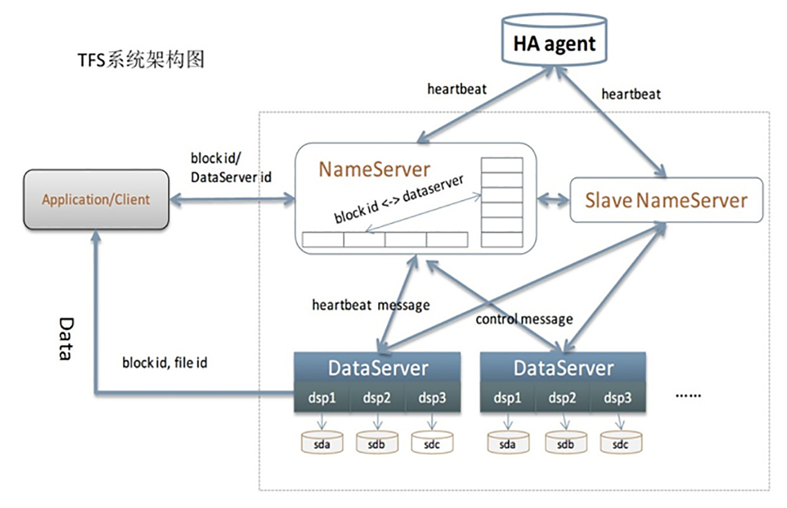

### 2.4 大文件存储

互联网行业的大文件主要分为两类：一类是业务上的大数据（如Youtube的视频、电影网站的电影），另一类是海量的日志数据（如各种访问日志、操作日志、用户轨迹日志等）。和小文件的特点正好相反，大文件的数量没有小文件那么多，但每个文件都很大，几百MB、几个GB都是常见的，几十GB、几TB也是有可能的，因此在存储上和小文件有较大差别，不能直接将小文件存储系统拿来存储大文件。

说到大文件，特别要提到Google和Yahoo。Google的3篇大数据论文（Bigtable/MapReduce/GFS）开启了一个大数据的时代，而Yahoo开源的Hadoop系列（HDFS、HBase等）基本上垄断了开源界的大数据处理。当然，江山代有才人出，Hadoop后又有更多优秀的开源方案被贡献出来。

对照Google的论文构建一套完整的大数据处理方案的难度和成本实在太高，而且开源方案现在也很成熟了，所以大数据存储和处理这块反而是最简单的——因为你没有太多选择，只能用这几个流行的开源方案，例如Hadoop、HBase、Storm、Hive等。实力雄厚一些的大公司会基于这些开源方案结合自己的业务特点封装成大数据平台，例如淘宝的云梯系统、腾讯的TDW系统。

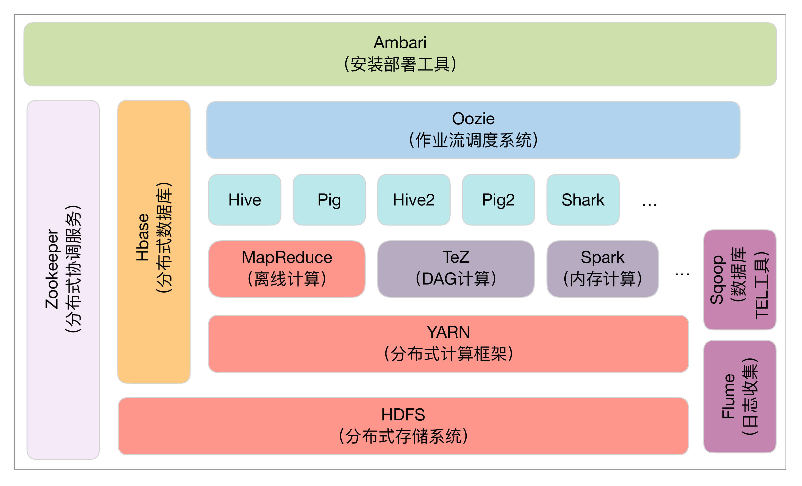

### 2.5 存储层的统一规律

**最终都走向平台化**——当规模达到一定阶段后，集中管理、统一运维、资源复用的收益远大于独立维护的成本。

> **深度注记**：为何没有出现存储平台的开源方案，但云计算却都提供了存储平台方案？因为存储平台与业务规模强相关——几十台服务器做平台收益不大，几千台才值得。开源项目面向通用场景，而存储平台面向大规模运营场景，这正是云计算的价值所在。

---

## 三、开发层与服务层

### 3.1 开发层

**开发框架**

在互联网业务发展中，复杂度越来越高，系统越来越多，不同的系统由不同的小组开发。如果每个小组用不同的开发框架和技术，会带来很多问题：

- 技术人员之间没有共同的技术语言，交流合作少
- 每类技术都需要投入大量的人力和资源并熟练精通
- 不同团队之间人员无法快速流动，人力资源不能高效利用

所以互联网公司都会指定一个大的技术方向，使用统一的开发框架（如Java的SSH/SpringMVC/Play，Ruby的Ruby on Rails，PHP的ThinkPHP，Python的Django等）。

**总原则：优选成熟的框架，避免盲目追逐新技术！**成熟框架资料文档齐备、受众更广招聘容易、更加稳定适合长期发展。

**Web服务器**

开发框架只负责完成业务功能的开发，真正运行起来给用户提供服务还需要服务器配合。互联网行业基本上都是"拿来主义"，挑选一个流行的开源服务器即可。大公司可能在开源服务器基础上做二次开发（如淘宝的Tengine），一般公司只需要优化参数调整配置即可。选择服务器主要和开发语言相关：Java用Tomcat/JBoss/Resin，PHP/Python用Nginx，最保险的是Apache。

**容器（Docker）**

容器技术自2013年Docker发布后兴起。传统虚拟化技术（虚拟机）解决了跨平台问题，但虚拟机太庞大、启动慢、运行时太占资源；Docker的容器技术虽然没有跨平台，但启动快、几乎不占资源。

千万不要以为Docker只是一个虚拟化或者容器技术，它将在很大程度上改变目前的技术形势：

- **运维方式革命性变化**：Docker启动快、几乎不占资源、随时启动和停止，基于Docker打造自动化运维、智能化运维将成为主流方式
- **设计模式本质变化**：启动一个新的容器实例代价如此低，将鼓励设计思路朝"微服务"的方向发展

例如，传统网站包括登录注册、页面访问、搜索等功能，没有容器的情况下都集成在一个系统里；有了容器后，一开始就可以按服务设计，避免后续重构。

### 3.2 服务层

互联网业务的不断发展带来了复杂度不断提升，业务系统越来越多，系统间相互依赖程度加深。服务层的主要目标是为了**降低系统间相互关联的复杂度**。

**配置中心**

当系统数量不多时，各系统自己管理自己的配置即可；但系统数量多了以后，分散配置会有问题：

- 某个功能上线时需要多个系统配合，分散配置时配置检查、沟通协调耗费较多时间
- 处理线上问题时需要多个系统配合查询，分散配置操作效率很低
- 各系统自己管理配置一般通过文本编辑修改，没有自动校验机制，容易配置错误

配置中心的好处：集中配置操作效率高、所有配置在一个地方检查方便协作、可以实现程序化的规则检查（如IP地址的数字0误敲为字母O，肉眼很难发现但程序检查很容易）、相当于备份了系统配置，搭建新环境时能快速恢复业务。

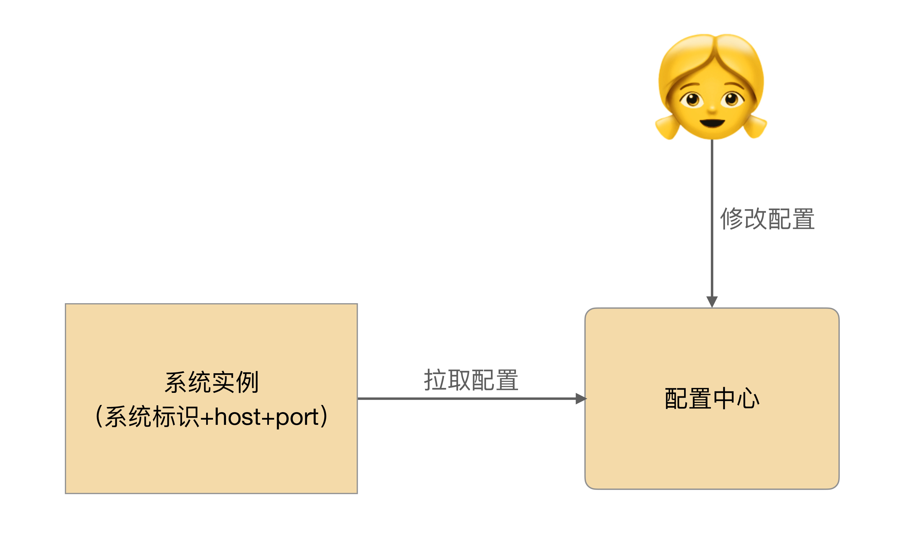

**服务中心**

当系统数量多了以后，系统间调用通过配置文件记录在各系统内部的方式存在问题：如果要让10个依赖系统都切换到新接口，这10个系统的几十上百台机器的配置都要修改然后重启；如果某系统5台机器出故障，其他系统通过域名访问可能还会访问到故障机器。

服务中心的实现有两种方式：

- **服务名字系统（Service Name System）**：将Service名称解析为"host + port + 接口名称"，和DNS类似，真正发起请求的还是请求方。

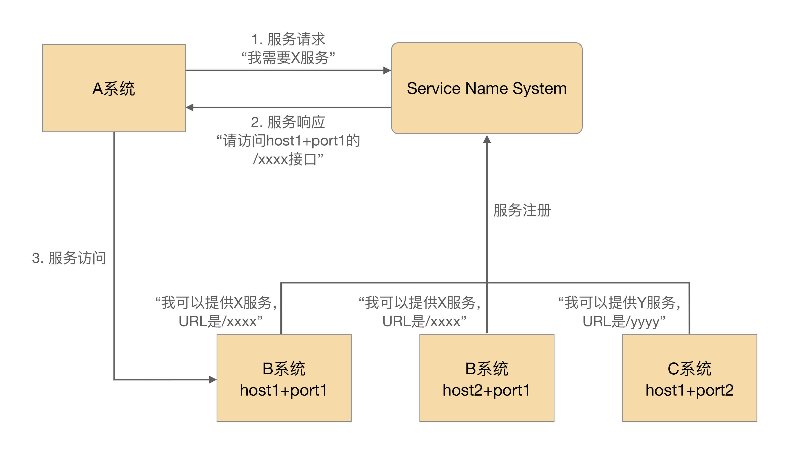

- **服务总线系统（Service Bus System）**：由总线系统完成调用，服务请求方都不需要直接和服务提供方交互，和计算机总线类似。

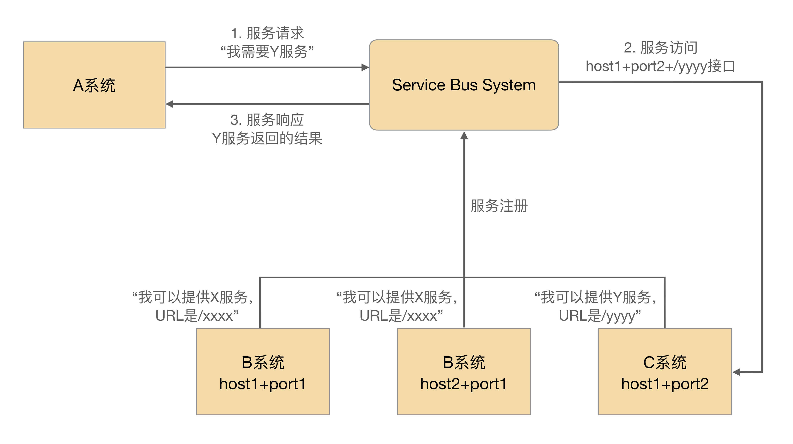

| 维度 | 服务名字系统 | 服务总线系统 |
|------|------------|------------|
| 调用方式 | 请求方直接调用服务提供方 | 总线代为调用 |
| 性能 | 更高（直连） | 较低（经总线转发） |
| 简单性 | 请求方更复杂 | 请求方更简单 |
| 类比 | DNS | 计算机总线 |

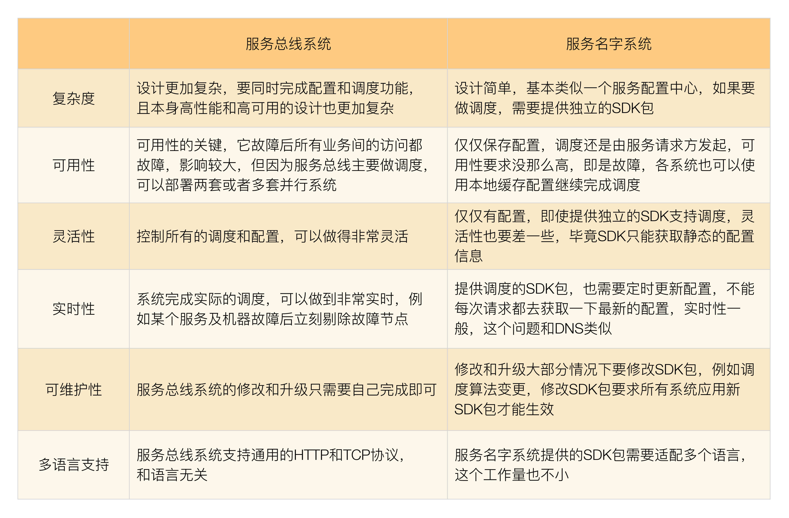

**消息队列**

互联网业务的一个特点是"快"，很多业务处理采用异步方式。例如大V发布微博后需要发消息给关注的用户，不可能等所有消息都发送完才告诉大V发布成功。

传统异步通知方式由消息生产者直接调用消息消费者提供的接口，但当业务变得庞大、子系统数量增多时，系统间交互非常复杂和难以管理，整个系统的结构就像一张蜘蛛网：

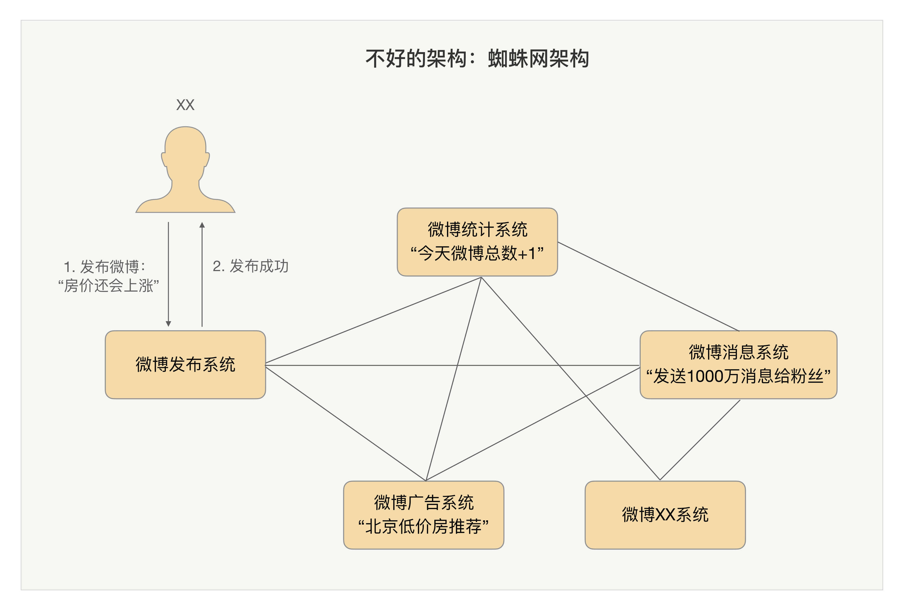

消息队列就是为了实现跨系统异步通知的中间件系统，既可以"一对一"通知，也可以"一对多"广播：

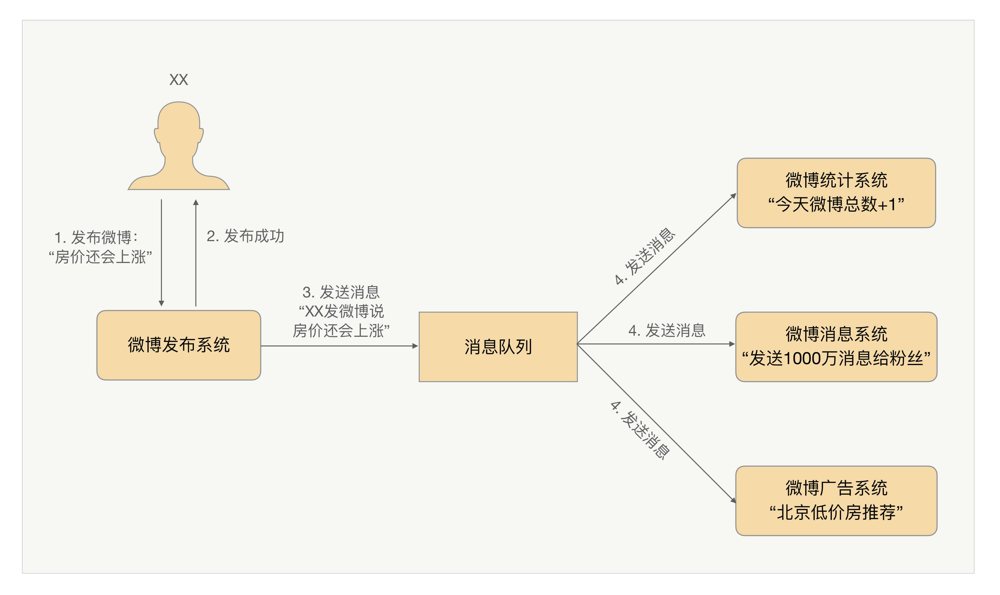

引入消息队列后的效果：
- 整体结构从网状结构变为线性结构，结构清晰
- 消息生产和消息消费解耦，实现简单
- 增加新的消息消费者，消息生产者完全不需要任何改动，扩展方便
- 消息队列系统可以做高可用、高性能，减轻各业务子系统工作量
- 业务子系统只需要聚焦业务即可

消息队列基本功能实现比较简单，但要做到高性能、高可用、消息时序性、消息事务性则比较难。业界已有成熟开源方案（RocketMQ、Kafka、ActiveMQ），如果要求不高拿来用即可；如果对可靠性、时序、事务性要求较高则要深入研究。

---

## 四、网络层

### 4.1 负载均衡

负载均衡就是将请求均衡地分配到多个系统上。一台32核64GB内存的机器，性能测试数据显示每秒处理Hello World的HTTP请求不超过2万，实际业务可能才几百QPS，而互联网业务并发超过1万比较常见，极端场景（双十一、过年发红包）每秒可达几十万请求。

**DNS负载均衡**

DNS是最简单最常见的负载均衡方式，一般用来实现地理级别的均衡（北方用户访问北京机房，南方用户访问广州机房）。

优点：通用（全球通用）、成本低（申请域名注册DNS即可）。缺点：DNS缓存时间长（删除机器后用户仍会访问）、不够灵活（无法感知后端服务器状态）。

**HTTP-DNS**

对于时延和故障敏感的业务，有实力的公司可能实现HTTP-DNS——使用HTTP协议实现私有DNS系统，主要应用在通过App提供服务的业务上。

| 维度 | DNS | HTTP-DNS |
|------|-----|---------|
| 灵活性 | 差（缓存时间长、策略简单） | 高（实时更新、灵活策略） |
| 可控性 | 依赖外部DNS服务商 | 自己开发，IP/策略更新无需依赖外部 |
| 及时性 | 受传统DNS缓存影响 | 不受缓存影响，非常快地更新数据 |
| 成本 | 低 | 高（需自行开发） |
| 侵入性 | 无 | 需App端改造 |

**Nginx、LVS、F5**

DNS用于地理级别，Nginx、LVS、F5用于同一地点内机器级别。

| 技术 | 层级 | 性能 | 成本 | 特点 |
|------|------|------|------|------|
| **Nginx** | 软件7层 | 万级（约5万/秒） | 低 | 支持HTTP、E-mail协议 |
| **LVS** | 内核4层 | 十万级（可达80万/秒） | 低 | 和协议无关，几乎所有应用都可以 |
| **F5** | 硬件4层 | 百万级（200万~800万/秒） | 极高（一台几十万） | 和协议无关 |

硬件虽然单台成本高，但按同等请求量级折算成本反而可能更低（1台F5 vs 20台Nginx）。目前很多云服务商已提供负载均衡产品（阿里云 CLB/ALB、UCloud ULB）。

### 4.2 CDN

CDN是为了解决用户网络访问时的"最后一公里"效应，本质上是一种"以空间换时间"的加速策略——将内容缓存在离用户最近的地方，用户访问的是缓存的内容而不是站点实时的内容。

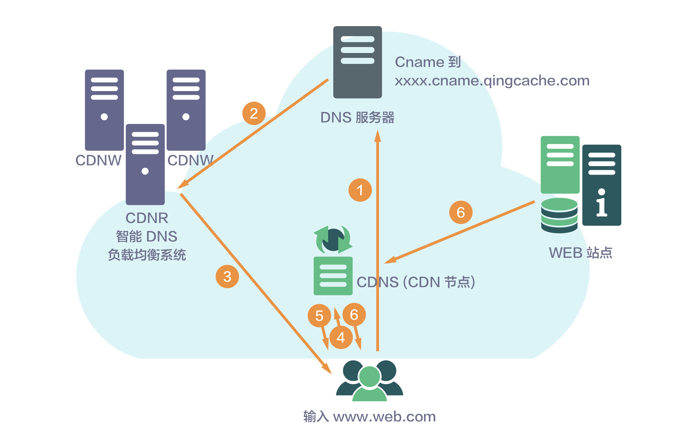

CDN经过多年发展已变成很庞大的体系：分布式存储、全局负载均衡、网络重定向、流量控制等都属于CDN的范畴，尤其在视频、直播领域没有CDN用户不可能实现流畅观看。CDN作为网络基础服务，独立搭建成本巨大，从CDN服务商购买即可（网宿、蓝汛、阿里云、腾讯云）。

### 4.3 多机房

从架构上来说，单机房就是一个全局的网络单点，在发生比较大的故障或者灾害时（停电、网络中断、地震、水灾），单机房难以保证业务高可用。多机房设计最核心的因素就是如何处理时延带来的影响：

| 架构 | 时延 | 业务影响 | 投入 | 风险 |
|------|------|---------|------|------|
| **同城多机房** | ≈同机房 | 几乎无 | 极大（需搭建私有高速网络） | 遇极端自然灾害仍有风险 |
| **跨城多机房** | 几十ms | 需业务妥协（最终一致性） | 中 | 微博可以10分钟后看到，支付宝转账不行 |
| **跨国多机房** | 更大 | 仅用于备份和服务本国用户 | 中 | 时延太大 |

### 4.4 多中心

多中心必须以多机房为前提，但从设计角度来看，多中心相比多机房是**本质上的飞跃**，难度也高出一个等级。

多机房的主要目标是灾备，允许一定时间的中断（如10分钟、1小时）；多中心要求每个中心都**同时对外提供服务**，且业务能够**自动在多中心之间切换**，故障后不需人工干预或很少人工干预就能自动恢复。

多中心设计的关键就在于"数据一致性"和"数据事务性"如何保证，这两个难点都和业务紧密相关，目前没有很成熟的且通用的解决方案。以淘宝为例，商品浏览、订单、支付的多中心方案都需要独立设计和实现——不同的业务需要不同的多中心方案，没有一招通吃的方案。

> **深度注记**：正因为多中心设计的复杂性，不一定所有业务都能实现多中心。国内银行、支付宝这类系统至今没有完全实现多中心，不然也不会出现挖掘机一铲子下去、支付宝中断约2小时的故障。

多机房与多中心的对比：

| 维度 | 多机房 | 多中心 |
|------|--------|--------|
| 主要目标 | 灾备 | 同时提供服务+故障自动切换 |
| 故障容忍度 | 允许10分钟~1小时中断 | 不允许中断，自动切换 |
| 数据一致性 | 可以妥协（最终一致性） | 需要保证 |
| 难度 | 中 | 极高 |
| 人工干预 | 需要人工切换 | 自动切换 |

---

## 五、用户层与业务层

### 5.1 用户层

**用户管理**

互联网业务的典型特征是通过互联网将众多分散的用户连接起来，因此用户管理是必不可少的一部分。稍微大一点的互联网业务涉及多个子系统，引出两个核心需求：

- **单点登录（SSO）**：又叫统一登录，技术实现手段有cookie、JSONP、token等，最成熟的开源方案是CAS。

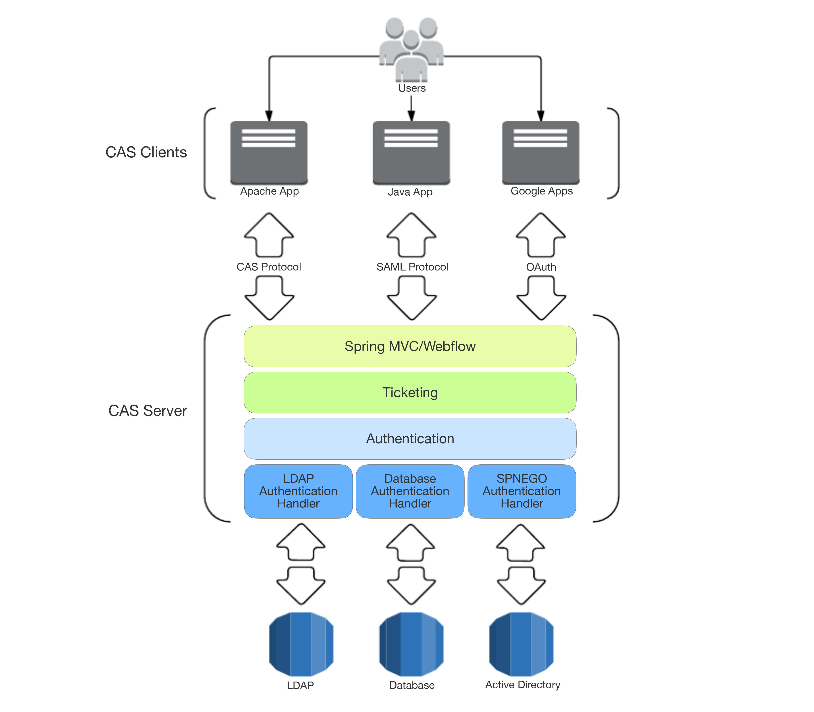

- **授权登录**：当业务做大成为平台后需要允许第三方应用接入，最流行的授权登录是OAuth 2.0协议，基本上已成为事实上的标准。

用户管理系统面临的主要问题是用户数巨大（一般至少千万级，QQ/微信/支付宝是亿级），但实现起来并不难——因为不同用户之间没有太强的业务关联，A用户登录和B用户登录基本没有关系，用一个简单的负载均衡架构就能轻松应对。

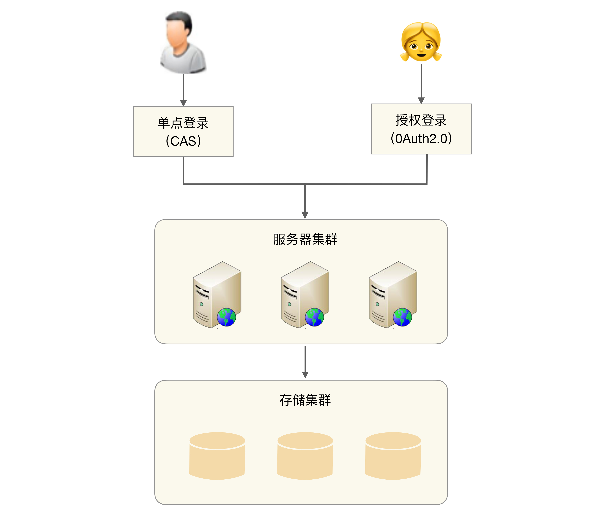

**消息推送**

消息推送根据不同途径分为短信、邮件、站内信、App推送。App推送是技术挑战最大的部分：

- **iOS**：比较规范和封闭，基本上只能使用苹果的APNS
- **Android**：国内 GCM/FCM（Google 推送通道已更名并退役）不可用，各手机厂商定制Android实现不同，五花八门。大厂自建推送（阿里云移动推送、腾讯信鸽、百度云推送），也有第三方商业推送（友盟、极光）

自建消息推送的技术挑战：
- **海量设备和用户管理**：设备数量众多，存储管理复杂；需要将用户和设备关联，提取用户特征分类打标签
- **连接保活**：应用不可能一直在前台运行，设备限制后台运行后连接通道可能被中断。连接保活是细节和黑科技最多的地方（应用互相拉起、找手机厂商开白名单等）
- **消息管理**：不是每个消息都需要发送给每个用户，推送逻辑要设计得非常灵活，可以采取规则引擎之类的微内核架构技术

**存储云、图片云**

用户会上传多种类型的文件数据（微信朋友圈图片、微博图片视频、淘宝商品图片等），这些文件具备典型特点：数据量大、文件体积小、访问有时效性。

存储云和图片云通常的实现都是"CDN + 小文件存储"。两者拆分为两个系统的原因是"图片"业务的复杂性——普通文件基本提供存储和访问就够了，而图片涉及裁剪、压缩、美化、审核、水印等处理。

### 5.2 业务层

互联网的业务千差万别，但各业务发展最终面临的问题都是类似的：**业务复杂度越来越高**。业务层面对的主要技术挑战是"复杂度"，应对方法是"拆"——化整为零、分而治之。

以一个简单的电商系统为例：

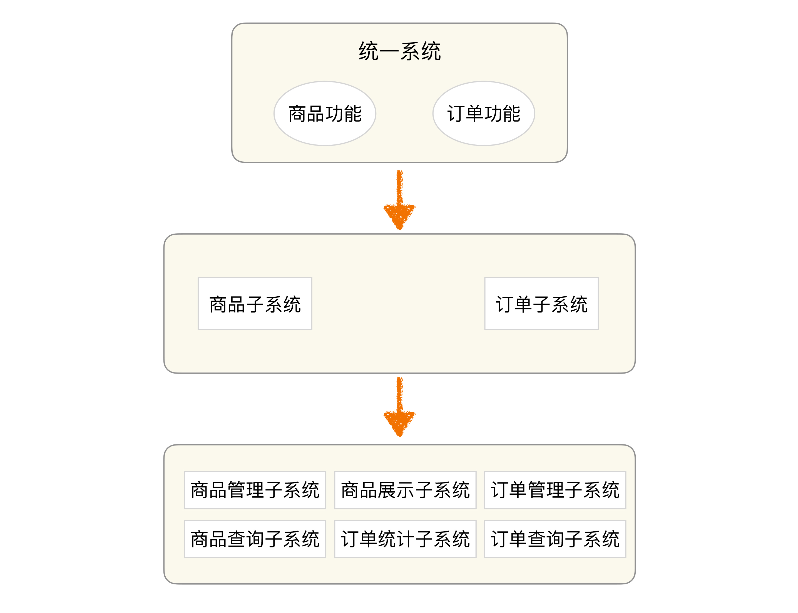

模拟电商系统经历了3个发展阶段：
1. 第一阶段：所有功能都在1个系统里面
2. 第二阶段：将商品和订单拆分到2个子系统里面
3. 第三阶段：商品子系统和订单子系统分别拆分成了更小的6个子系统

**拆的规律：合久必分、分久必合**

随着子系统数量越来越多（几百上千），没有人能说清楚业务的调用流程了，出了问题排查也特别复杂。此时应该怎么处理？答案是"合"——按照"高内聚、低耦合"的原则，将职责关联比较强的子系统合成一个**虚拟业务域**，然后通过网关对外统一呈现，类似于设计模式中的Facade模式。

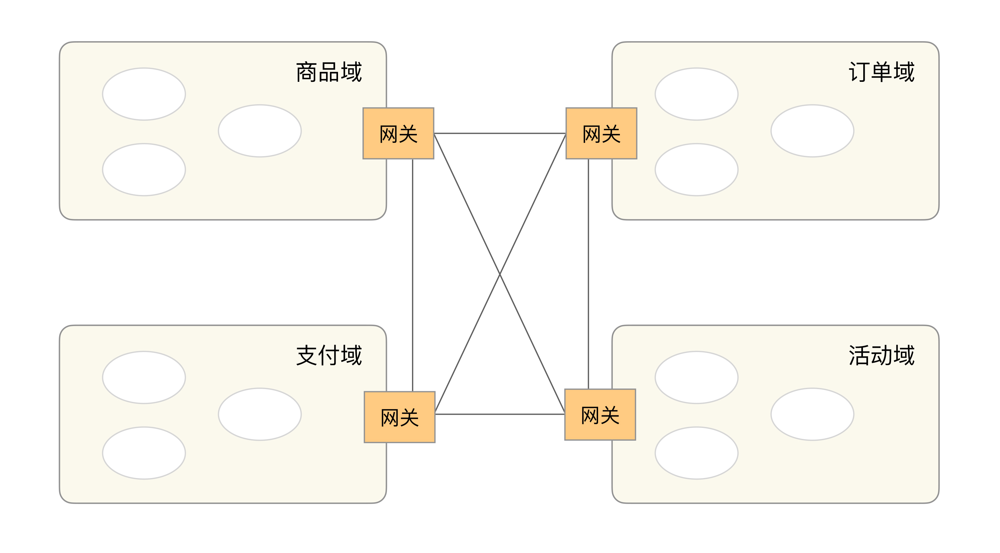

---

## 六、平台层

当业务规模越来越大、系统复杂度越来越高、子系统数量越来越多时，如果继续采取各自为政的方式实现支撑功能，重复工作非常多。因此自然而然将这些支撑功能做成平台，避免重复造轮子。

### 6.1 运维平台

运维平台核心职责分为四大块：配置、部署、监控、应急，每个职责对应系统生命周期的一个阶段：

运维平台的核心设计要素是"四化"：

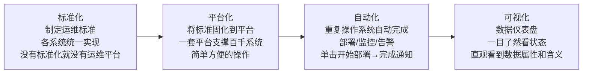
```mermaid
graph LR
    A["标准化<br/>制定运维标准<br/>各系统统一实现<br/>没有标准化就没有运维平台"] --> B["平台化<br/>将标准固化到平台<br/>一套平台支撑百千系统<br/>简单方便的操作"]
    B --> C["自动化<br/>重复操作系统自动完成<br/>部署/监控/告警<br/>单击开始部署→完成通知"]
    C --> D["可视化<br/>数据仪表盘<br/>一目了然看状态<br/>直观看到数据属性和含义"]

```

如果某个系统无法改造来满足运维标准，常见做法是不改造系统，由中间方来完成规范适配（如写定时程序访问RESTful接口获取性能数据，然后转换为日志上报到运维平台）。

### 6.2 测试平台

测试平台核心职责是测试（单元测试、集成测试、接口测试、性能测试等），核心目的是提升测试效率从而提升产品质量，设计关键是自动化。

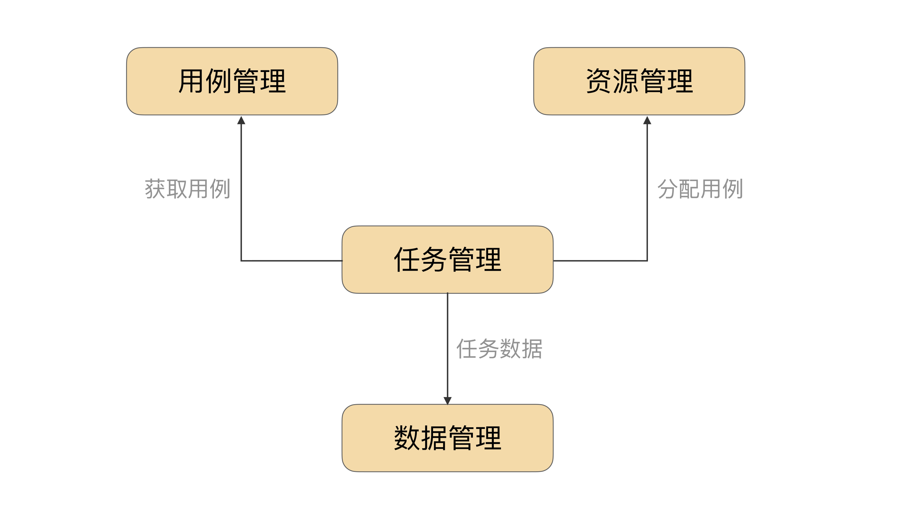

四大模块：
- **用例管理**：管理测试用例代码，维度包括业务、系统、测试类型
- **资源管理**：管理运行环境（硬件、软件、业务系统），使用虚拟技术提升资源利用率
- **任务管理**：将测试用例分配到具体资源上执行，跟踪执行情况，是测试平台设计的核心
- **数据管理**：记录执行数据，展现执行情况、与历史对比、数据挖掘

### 6.3 数据平台

数据平台核心职责包括三部分：数据管理、数据分析和数据应用。

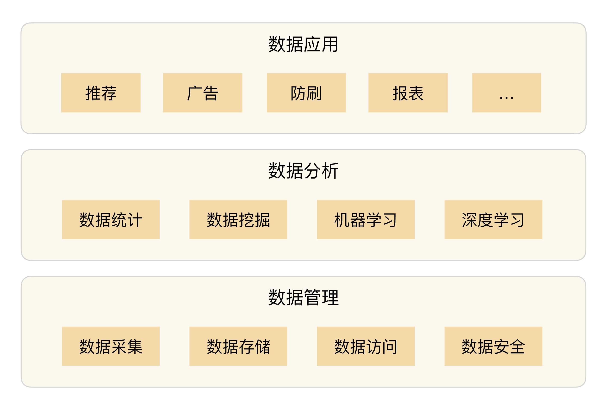

**数据管理**：数据采集（从业务系统搜集日志、用户行为、业务数据）、数据存储、数据访问（提供SQL/Hive/Key-Value等协议）、数据安全（多业务共享时保护敏感数据）。

**数据分析**：数据统计（PV、UV、交易额等总览数据）、数据挖掘（传统方式，如沃尔玛啤酒与尿布的关联关系）、机器学习和深度学习（需要独立设计）。

**数据应用**：在线应用（推荐、广告等）和离线应用（报表、欺诈检测、异常检测等）。数据应用发挥价值的前提是需要有"大数据"，如果没有达到一定规模做好数据统计就足够了，无须一开始就参考BAT来构建数据平台。

### 6.4 管理平台

管理平台的核心职责是**权限管理**。无论是业务系统（如淘宝网）、中间件系统（如消息队列Kafka），还是平台系统（如运维平台），都需要进行管理。如果每个系统都自己实现权限管理，效率太低、重复工作很多，因此需要统一的管理平台来管理所有系统的权限。

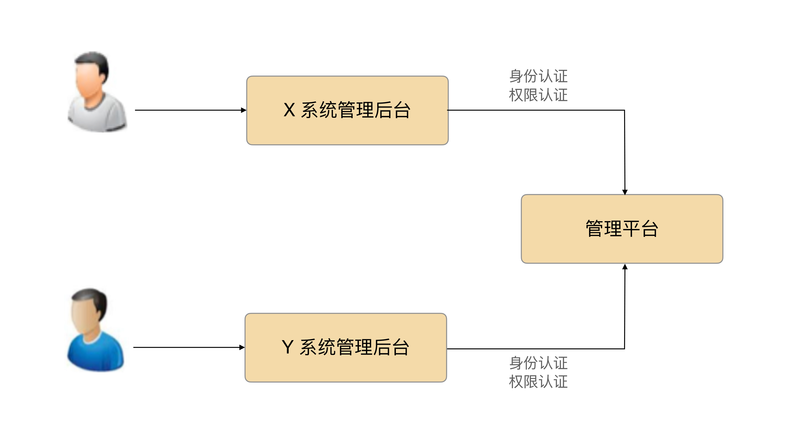

权限管理分为两部分：
- **身份认证**：确定当前操作人员身份，防止非法人员进入系统。为了避免每个系统都自己管理用户，通常使用企业账号做统一认证和登录。
- **权限控制**：根据操作人员身份确定操作权限，防止未经授权的操作（如不允许研发人员进入财务系统查看别人的工资）。

### 6.5 平台层的统一规律

| 平台 | 核心职责 | 关键设计要素 | 演进规律 |
|------|---------|------------|---------|
| **运维平台** | 配置/部署/监控/应急 | 四化：标准化→平台化→自动化→可视化 | 从手工运维→脚本运维→平台运维→智能运维 |
| **测试平台** | 用例/资源/任务/数据管理 | 核心是自动化——用例可重复执行 | 从手工测试→自动化测试→持续集成→质量内建 |
| **数据平台** | 数据管理/分析/应用 | 采集→存储→访问→安全；统计→挖掘→机器学习 | 从数据统计→数据仓库→大数据平台→AI平台 |
| **管理平台** | 权限管理（认证+授权） | 统一身份认证+权限控制 | 从各系统独立管理→统一管理→精细化管控 |

---

## 七、架构重构三式

架构重构对架构师的要求比全新架构设计更高，主要体现在：
- **业务已经上线，不能停下来**：重构既要保证业务继续发展，又要完成架构调整，好比"给飞行中的波音747换引擎"
- **关联方众多，牵一发动全身**：不同关联方的资源投入程度、业务发展速度、对架构痛点的敏感度差异很大
- **旧架构的约束**：新架构也受到旧架构的约束和影响——业务在旧架构上产生的数据是不能推倒重来的

### 7.1 第一式：有的放矢

**核心原则**：从一大堆纷繁复杂的问题中识别出真正要通过架构重构解决的问题，集中力量快速解决，**而不是想着通过架构重构来解决所有问题**。

架构师的首要任务是透过问题表象看到问题本质。尤其是刚接手新系统的架构师，一定要控制住"新官上任三把火"的冲动，避免摊大饼式或运动式的重构和优化。

**判断方法**：假设从0开始设计当前系统，新架构与老架构是否类似？差异不大→系统优化即可；差异很大→架构重构。

**三个重构案例**：

**案例1：M系统（后台管理）——解决不合理的耦合**

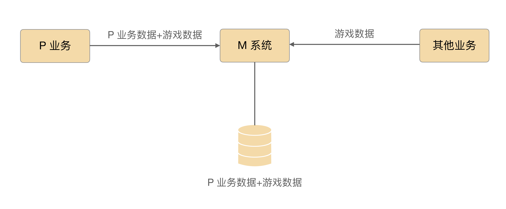

M系统耦合了P业务独有的数据和所有业务公用的数据，导致可扩展性比较差。重构目标：将游戏数据和业务数据拆分，解开两者的耦合。

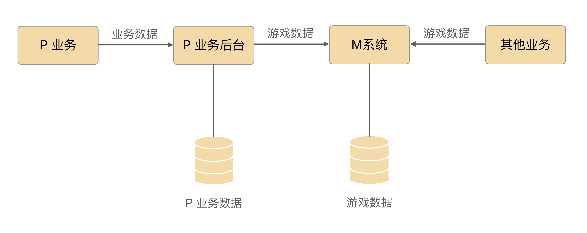

重构后效果：M系统和P业务后台系统每月上线版本数是重构前的**4倍**！

**案例2：S系统（游戏接入）——解决全局单点的可用性问题**

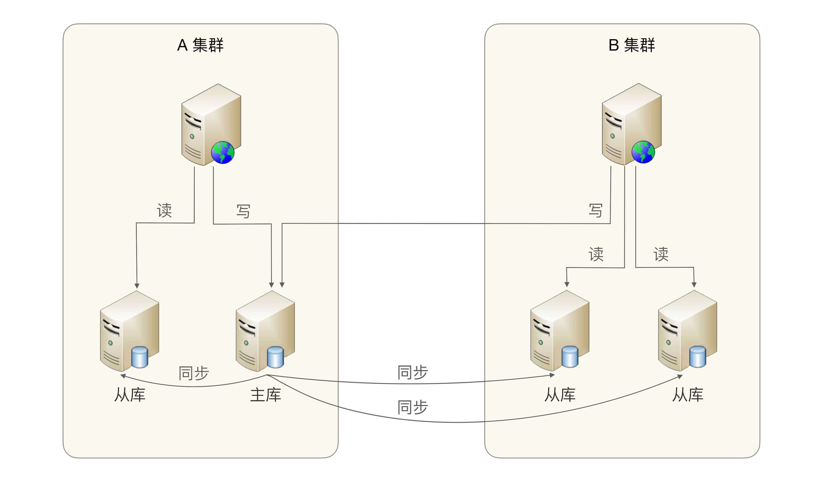

S系统一旦故障，大量游戏玩家就不能登录游戏，数据库主库是全局单点。重构目标：实现双中心，任意一个机房都能提供完整服务。

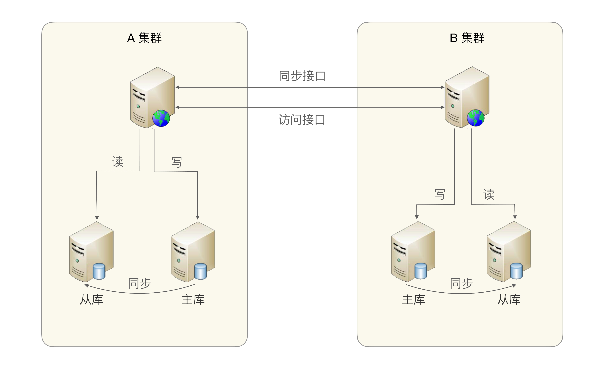

重构后效果：可用性从**3个9提升到4个9**，重构前最夸张一个月有4次较大线上故障，重构后虽经历机房交换机宕机、运营商线路故障、机柜断电等，对业务都没有大影响。

**案例3：X系统（创新业务）——解决大系统带来的开发效率问题**

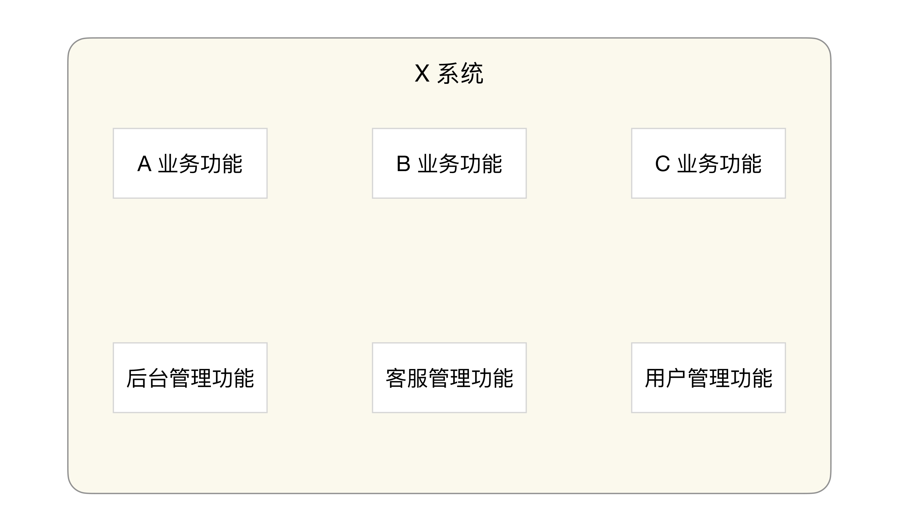

X系统在业务快速尝试期间怎么方便怎么操作，导致所有功能都"塞"到同一个系统中，改不动了。做一个新功能或新业务，需要花费大量时间讨论和梳理各种业务逻辑，一不小心就踩个大坑。X系统的问题看起来和M系统比较类似，都是可扩展性存在问题，但其实根本原因不一样：M系统是因为耦合了不同业务的数据导致可扩展性不足，而X系统是因为将业务相关的所有功能都放在同一个系统中导致可扩展性不足；同时所有功能都在一个系统中，也可能导致一个功能出问题整站不可用（如某个功能把数据库拖慢了，整站所有业务都跟着慢了）。

重构目标：将各功能拆分到不同子系统，降低单个系统的复杂度。

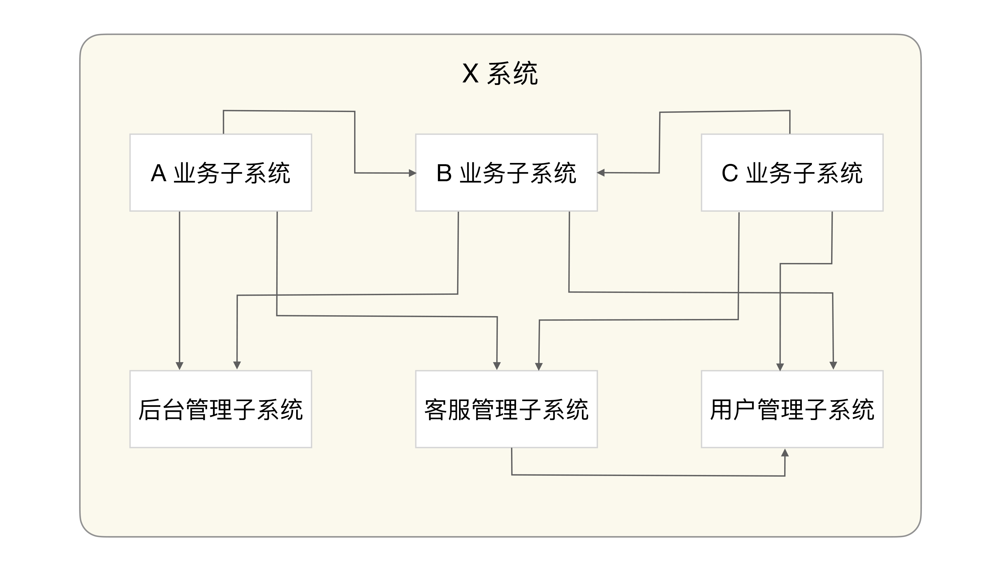

重构后效果：各系统之间通过接口交互，虽然看似增加了接口的工作量，但整体来说各系统的发展和开发速度比原来快了很多，也不会出现某个子系统有问题所有业务都有问题。

**M系统的启示**：当时接手后遇到的问题有很多（数据经常出错、单机宕机、性能差、界面丑、代码混乱、业务数据和游戏数据耦合），从这么多问题中识别出重构目标并不一目了然。架构师需要透过问题表象看到问题本质——核心问题是"业务数据和游戏数据耦合导致开发效率低"。非架构重构问题怎么办？重构完成后再启动优化项目，此时优化主要由团队内部完成，和其他团队没有太多关联，效率很高。

### 7.2 第二式：合纵连横

**合纵——与上下游沟通协调**

一般技术人员谈到架构重构时搬出一大堆技术术语（可扩展性、可用性、耦合……），但非技术人员很难理解。此外还经常遇到"凭感觉而不是凭数据说话"的问题。

**核心方法：将技术语言转换为通俗语言，以事实说话，以数据说话。**

| 错误说法 | 正确说法 |
|---------|---------|
| "可扩展性太差了" | "每次设计都要考虑是否对其他业务有影响，一个月才做了4个版本，最极端的版本讨论2周、开发2天" |
| "可用性才3个9" | "上个月4次线上故障，影响了XX用户，客服反馈XX条" |
| "A业务和B业务耦合" | "A改了B就出错，排查要两天" |

**连横——与其他系统团队沟通协调**

主要阻力来自"这对我有什么好处"和"这部分我现在不急"。

对于"这对我有什么好处"——有效策略是**换位思考、合作双赢、关注长期**。以M系统为例，C系统通过数据库直连与M系统共用数据库，重构方案要求C系统改为通过M系统接口写入。短期C系统改动大，但中长期C系统省很多事情——数据问题排查主要是M系统的事了，通过M系统接口获取数据无须关注业务逻辑。通过这种方式沟通，C系统很乐意一起做重构。

对于"这部分我们现在不急"——如果对方真的有更重要的业务，采取等待策略，但要**明确正式启动的时间**（如3个月后、6月份），千万不能说"以后""等不忙的时候"这种无法明确的时间点。方案上也可以灵活——先不做这个系统相关的重构，先把其他需要重构的做完。

### 7.3 第三式：运筹帷幄

架构师识别出系统关键的复杂度问题后，即使再厉害也不可能一己之力解决全部问题。同时在将问题识别出来后，很多人最容易犯的错误就是急于动手，其实还需要识别为了解决这个问题需要做哪些准备事项，或者还要先解决哪些问题。

**核心方法：分段实施**——将要解决的问题根据优先级、重要性、实施难度等划分为不同的阶段，每个阶段聚焦于一个整体目标，集中精力和资源解决一类问题。

这样做的好处是显而易见的：集中有限资源（人力和时间都是有限的），某个阶段集中解决某一类问题，效率更高——阶段目标明确，做决策和方案的时候无须太多选择，可以比较高效地做出决定。也可以让架构师和团队看到阶段性的成果，给整个团队信心，毕竟人是需要激励的动物，没有成果的坚持最终可能导致团队士气低落甚至有人离开。

**X系统重构的分阶段策略**：

第一阶段的目标是"业务解耦"——将原来一个系统承载所有功能改为拆分到多个子系统。X系统因为业务初期所有功能都集中在一起，导致各个功能之间耦合严重，一个功能出问题所有功能都受影响，修改一个功能也担心影响其他功能。

第二阶段的目标是"统一基础组件"——原有的各子系统各有各的基础组件实现方式，操作系统和编程语言也不统一。X系统将多个底层系统切换到公司统一的公共组件上来，这个过程比较复杂，涉及很多系统同时改造、逐步替换。

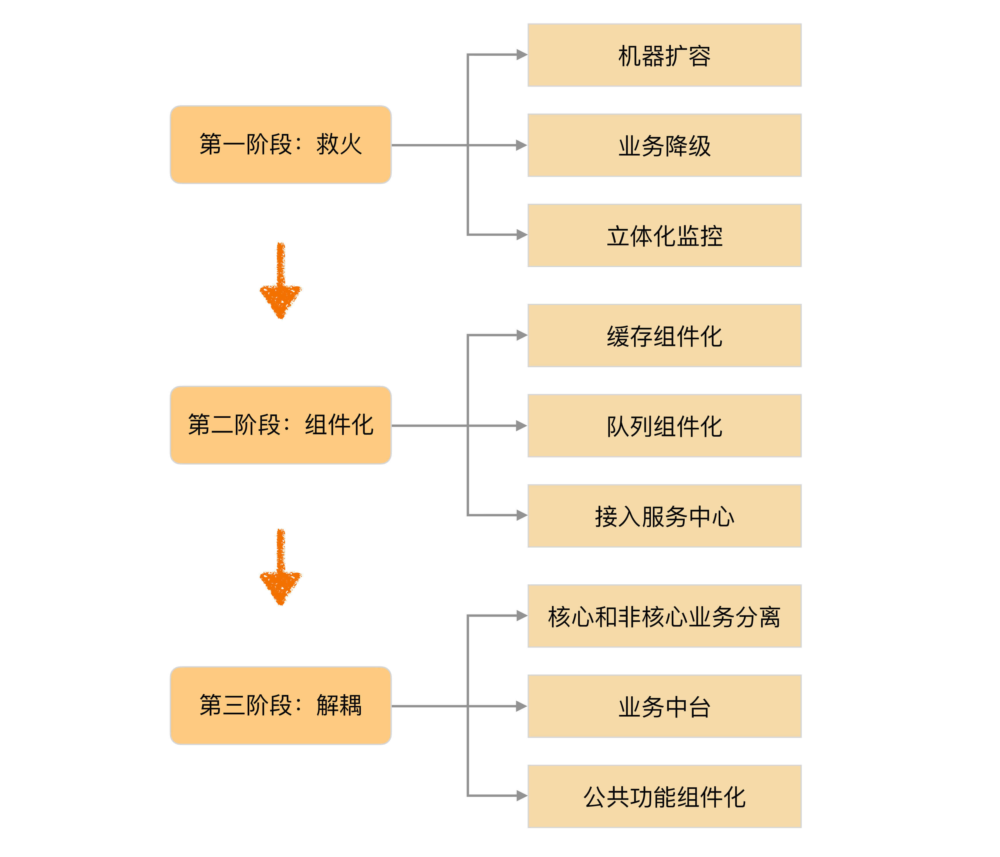

真正的架构重构在第三阶段，第一阶段和第二阶段都是为了第三阶段做准备。如果没有第一和第二阶段的铺垫，直接开始第三阶段，架构重构方案需要糅合第一阶段和第二阶段的一些事项，导致方案不聚焦且异常复杂。

为什么采用分段策略？集中有限资源，某个阶段集中解决某一类问题——效率高（阶段目标明确，做决策和方案时无须太多选择）；每个阶段都能看到明显成果，给团队信心。

**S系统重构**：策略是"先救火、后优化、再重构"——救火阶段做扩容和Nginx一键切换功能（故障时快速切换）；优化阶段解决明显的可用性问题（包括性能问题等）；重构阶段将原来的单点数据库改为多中心。

**分段策略四步法**：

| 策略 | 说明 | 原因 |
|------|------|------|
| **优先级排序** | 明显且紧急的事项优先落地（如扩容） | 不扩容系统隔三差五报警，耗费大量人力没法做其他事 |
| **问题分类** | 每个阶段集中解决一类问题 | X系统第二阶段将多个底层系统切换到统一公共组件 |
| **先易后难** | 先解决简单问题，积累信心 | (1) 先做最难的可能发现前置条件还没满足；(2) 难题耗时太长影响士气和评价；(3) 初期分析可能不全面 |
| **循序渐进** | 每个阶段1~3个月 | 超过3个月的再拆分为更多阶段；按固定节奏推进有利于项目推进 |

**为何"先易后难"而非"先难后易"？**

很多人直觉认为应该先攻克最难的问题——"擒贼先擒王"。但实际不可行：

1. 一开始就做最难的部分，会发现想要解决这个最难的问题要先解决其他容易的问题
2. 最难的问题解决起来耗时都比较长，占用资源比较多，如果一开始做最难的，可能做了一两个月还没有什么进展和成果，会影响相关人员对项目的评价和看法，也可能影响团队士气
3. 刚开始的分析并不一定全面，所以一开始对最难的或最关键的事项的判断可能会出错

采取"先易后难"的策略，能够很大程度上避免这些问题：
1. 随着项目推进，一些相对简单的问题逐渐解决后，会发现原来看起来很难的问题已经不那么难了，甚至有的问题可能都消失了
2. 先易后难能够比较快地看到成果，虽然成果可能不大，但至少能看到一些成效，对后续项目推进和提升团队士气有很大好处
3. 随着项目进行，原来遗漏或判断错误的点会逐渐显示出来，及时调整能有效保证重构效果

---

## 八、架构重构的统一视图

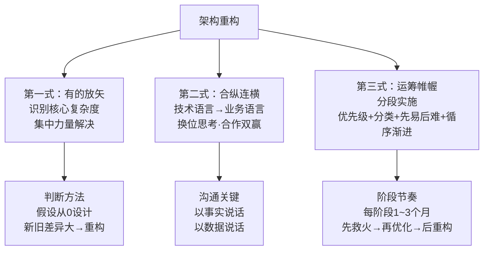
```mermaid
graph TD
    A["架构重构"] --> B["第一式：有的放矢<br/>识别核心复杂度<br/>集中力量解决"]
    A --> C["第二式：合纵连横<br/>技术语言→业务语言<br/>换位思考·合作双赢"]
    A --> D["第三式：运筹帷幄<br/>分段实施<br/>优先级+分类+先易后难+循序渐进"]

    B --> E["判断方法<br/>假设从0设计<br/>新旧差异大→重构"]
    C --> F["沟通关键<br/>以事实说话<br/>以数据说话"]
    D --> G["阶段节奏<br/>每阶段1~3个月<br/>先救火→再优化→后重构"]

```

---

## 总结

| 核心要点 | 关键结论 |
|---------|---------|
| 技术演进模式 | 初创→发展→竞争→成熟；驱动因素是复杂性和用户规模；量变带来质变 |
| 五层架构模板 | 存储层/开发层+服务层/网络层/用户层+业务层/平台层；各层最终都走向平台化 |
| 存储层 | SQL/NoSQL/小文件/大文件四类；演进规律：独立使用→集群→中间件→平台 |
| 开发层 | 统一框架（优选成熟）+Web服务器（拿来主义）+容器（改变运维和设计模式） |
| 服务层 | 配置中心/服务中心/消息队列；降低系统间关联复杂度 |
| 网络层 | DNS→F5/LVS/Nginx三层负载均衡；CDN加速；多机房/多中心容灾 |
| 用户层 | SSO+OAuth 2.0用户管理；APNS/自建消息推送；CDN+小文件存储云 |
| 业务层 | 合久必分→分久必合；拆为子系统→合成虚拟业务域→网关统一呈现 |
| 平台层 | 运维/测试/数据/管理四大平台；运维四化：标准化→平台化→自动化→可视化 |
| 重构第一式 | 有的放矢——识别核心复杂度，集中力量解决，不贪多；M/S/X三个案例 |
| 重构第二式 | 合纵连横——技术语言转换业务语言；换位思考、合作双赢、关注长期 |
| 重构第三式 | 运筹帷幄——分段实施；优先级排序+问题分类+先易后难+循序渐进 |

**思考题**：
1. 参考本文方法，分析你所在行业是否存在典型的技术演进模式？
2. 既然存储技术发展到最后都是存储平台，为何没有出现存储平台的开源方案，但云计算却都提供了存储平台方案？
3. 使用统一的开发框架和开发语言可以让团队开发效率更高，但这样做会带来什么问题？如何解决？
4. 为什么可以购买负载均衡和CDN服务，但却不能购买多机房和多中心服务？
5. 分析你目前开发的系统，你觉得需要架构重构吗？原因和理由是什么？
6. 如果一个架构重构项目最后规划要2年才完成，你会怎么处理？

**关联阅读**：
- [可扩展架构思想与实践](13-可扩展架构思想与实践.md)
- [架构设计流程](07-架构设计流程.md)
- [架构设计原则](06-架构设计原则.md)
- [开源选型与架构演进](15-开源选型与架构演进.md)

---

> **延伸视角**（许式伟）
>
> 华仔的五层架构模板提供了互联网技术架构的全景地图，三式心法提供了重构的实操方法论。从许式伟的视角来看：
>
> **1. 五层架构模板是"抽象·分解·组合"在组织层面的应用**。将技术体系分解为存储/开发/网络/用户/平台五层，每层独立演进，层间通过接口交互——这正是"分解"心法的规模化应用。而最终走向"平台化"，是"组合"的体现——将分散的能力重新组合为统一的服务。
>
> **2. 重构三式是工程师思维的集中体现**。许式伟强调"系统胜于规范"——有的放矢不是靠规范要求架构师聚焦核心问题，而是靠分析方法（"假设从0开始设计"）强制聚焦；运筹帷幄不是靠人工控制进度，而是靠分阶段策略（每阶段1-3个月）自动控制节奏。三式心法的本质是将重构经验**系统化**，而非依赖个人判断力。
>
> **3. 合纵连横揭示了架构师角色的本质**。许式伟在"架构师角色"讨论中强调，架构师不只是技术专家，更是"翻译者"和"协调者"——将技术语言翻译为业务语言，将不同团队的诉求协调为一致方案。华仔的"合纵连横"正是这一角色定位的工程化实践。
>
> **4. "量变到质变"是架构演进的底层规律**。许式伟的"架构质量评估"本质上是在量化"当前架构距离质变点还有多远"——核心系统伤害值、模块耦合度、新功能开发成本等指标，正是用来预测质变点的工具。华仔用业务阶段（初创→发展→竞争→成熟）描述了质变的外在表现，许式伟用量化指标描述了质变的内在度量。
>
> **融合洞见**：五层架构模板回答了"技术体系长什么样"，重构三式回答了"架构怎么演进"。但更重要的是理解**为何殊途同归**——互联网业务的共性（海量用户、快速迭代、高可用要求）驱动技术架构走向相同的最优解。架构师的价值不在于发明新架构，而在于**识别当前业务阶段的复杂度核心，选择最合适的架构模式，并在合适的时机推动演化**。