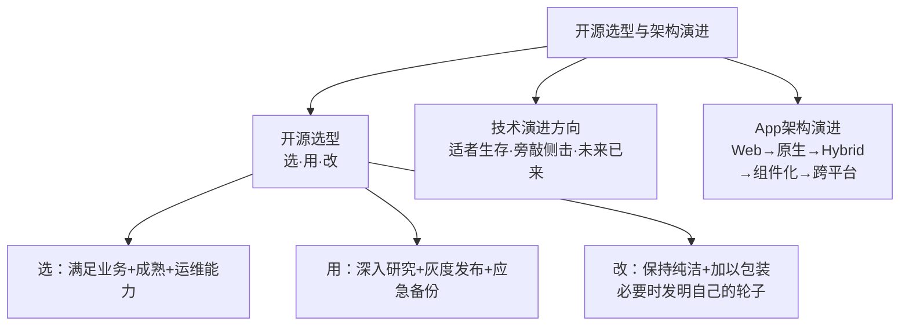
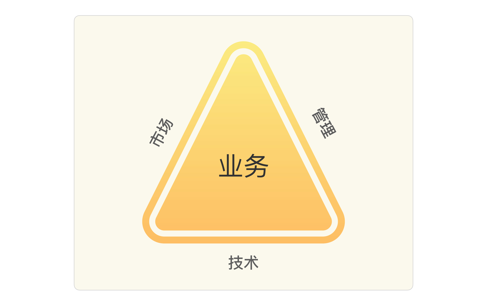
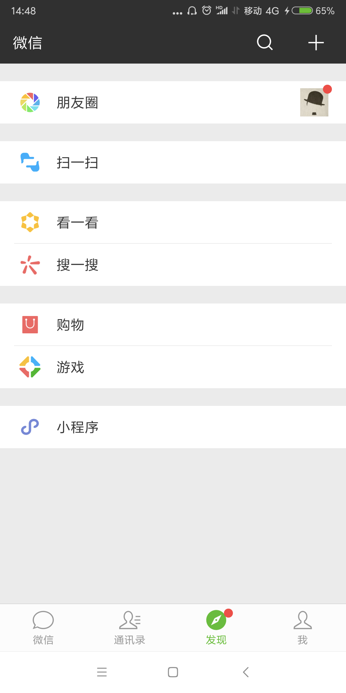
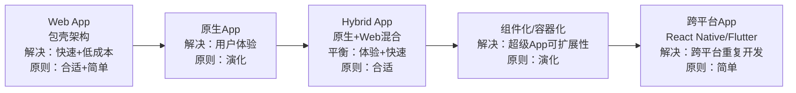
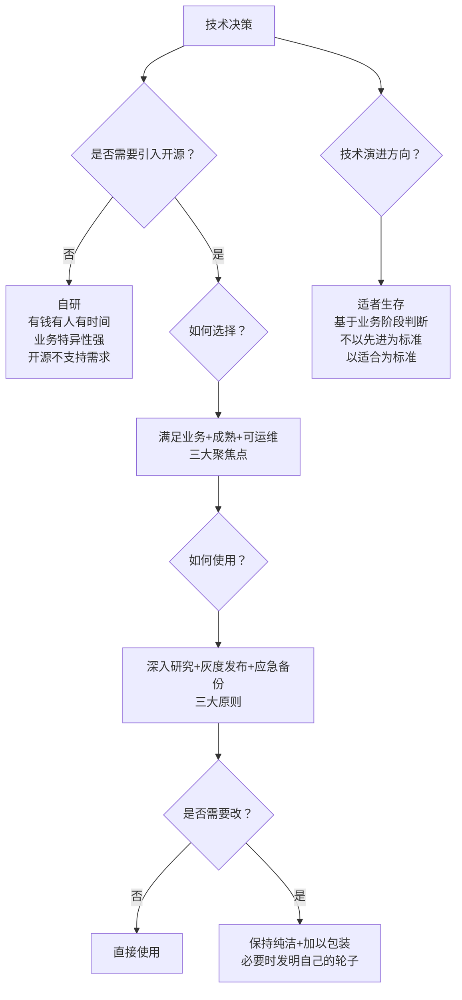

# 开源选型与架构演进 | 选·用·改·技术演进方向·App架构演进

## 章节导言

架构设计不是闭门造车，架构师需要站在巨人的肩膀上——开源项目就是这座"巨人"之肩。DRY原则（Don't Repeat Yourself）在架构层面体现为"不要重复造轮子"，引入开源项目可以节省大量人力和时间，大大加快业务发展速度。

然而现实往往没有那么美好，开源项目虽然节省了大量人力和时间，但带来的问题也不少——小的影响可能宕机半小时，大的问题可能丢失几十万条数据，甚至灾难性事故是全部数据都丢失。

除此以外，虽然DRY原则摆在那里，但开源项目反而是最不遵守DRY原则的——重复的轮子好多：你有MySQL我有PostgreSQL，你有MongoDB我有Cassandra，你有Memcached我有Redis，你有Gson我有Jackson，你有Angular我有React……相似轮子太多，如何选择就成了让人头疼的问题。

怎么办？完全不用开源项目几乎是不可能的，架构师需要更加聪明地选择和使用开源项目。形象点说：**不要重复发明轮子，但要找到合适的轮子**！但别忘了，如果你开的是保时捷，可别找个拖拉机的轮子。

同时，架构师还面临"甜蜜的烦恼"——面对层出不穷的新技术，应该采取什么策略？潮流派、保守派、跟风派各有问题，架构师需要基于业务发展阶段来判断技术演进方向。

此外，架构演进不仅发生在后端，App和前端同样遵循相同的架构设计理念——从Web App到原生App、从Hybrid到组件化容器化，每一步演进都是"识别复杂度→选择合适方案→推动演化"的实践。

**核心问题**：
1. 如何选择合适的开源项目？三大聚焦点是什么？
2. 如何安全地使用开源项目？三大原则是什么？
3. 如何基于开源项目做二次开发？"保持纯洁"的含义是什么？
4. 架构师如何判断技术演进的方向？三大原则是什么？
5. App架构的演进如何体现架构设计理念？

---

## 一、选：如何选择开源项目

软件开发领域有一个流行的原则：DRY，Don't Repeat Yourself，翻译过来更通俗易懂——**不要重复造轮子**。开源项目的主要目的是共享，其实就是为了让大家不要重复造轮子，尤其是在互联网这样一个快速发展的领域，速度就是生命，引入开源项目可以节省大量人力和时间，大大加快业务发展速度。

然而现实往往没有那么美好，开源项目虽然节省了大量人力和时间，但带来的问题也不少，相信绝大部分技术人员都踩过开源软件的坑，小的影响可能是宕机半小时，大的问题可能是丢失几十万条数据，甚至灾难性的事故是全部数据都丢失。

除此以外，虽然DRY原则摆在那里，但开源项目反而是最不遵守DRY原则的——重复的轮子好多：你有MySQL我有PostgreSQL，你有MongoDB我有Cassandra，你有Memcached我有Redis，你有Gson我有Jackson，你有Angular我有React……相似轮子太多，如何选择就成了让人头疼的问题。

### 1.1 聚焦是否满足业务

架构师在选择开源项目时，一个头疼的问题就是相似的开源项目较多，而且后面的总是宣称比前面的更加优秀。有的架构师在选择时无所适从，总是担心选择了A项目而错过了B项目。

**正确做法**：聚焦于是否满足业务，不需要过于关注开源项目是否优秀。

> 如果业务要求1000 TPS，那么20000 TPS和50000 TPS的项目是没有区别的。有的架构师可能担心TPS不断上涨怎么办？其实不用过于担心，架构是可以不断演进的，等到真的需要这么高的时候再来架构重构，这里的设计决策遵循架构设计原则中的"合适原则"和"演化原则"。

**Tokyo Tyrant的教训**

在开发一个社交类业务时，使用了TT（Tokyo Tyrant）开源项目，觉得既能够做缓存取代Memcached，又有持久化存储功能，还可以取代MySQL，觉得很强大，于是在业务里面大量使用了。但后来的使用过程让人很郁闷：

- 不能完全取代MySQL，因此有两份存储，设计时每次都要讨论和决策究竟什么数据放MySQL、什么数据放TT
- 功能上看起来很高大上，但相应的bug也不少，而且有的bug是致命的——例如所有数据不可读，后来是自己研究源码写了一个工具才恢复了部分数据
- 功能确实强大，但需要花费较长时间熟悉各种细节，不熟悉随便用很容易踩坑

后来反思和总结，其实当时的业务Memcached + MySQL完全能够满足，而且大家都熟悉，完全不需要引入TT。

### 1.2 聚焦是否成熟

很多新的开源项目往往都会声称自己比以前的项目更加优秀：性能更高、功能更强、引入更多新概念……看起来都很诱人，但实际上都有意无意地隐藏了一个负面的问题：**更加不成熟**！不管多优秀的程序员写出来的项目都会有bug，千万不要以为作者厉害就没有bug，Windows、Linux、MySQL的开发者都是顶级的开发者，系统一样有很多bug。

不成熟的开源项目应用到生产环境，风险极大：轻则宕机，重则宕机后重启都恢复不了，更严重的是数据丢失都找不回来。还是以TT为例：真的遇到异常断电后文件被损坏，重启也恢复不了的故障。还好当时每天做了备份，只能用1天前的数据进行恢复，当天的数据全部丢失了。后来花费了大量的时间和人力去看源码，自己写工具恢复了部分数据。

在选择开源项目时，**尽量选择成熟的开源项目**，降低风险。可以从这几个方面考察：

| 考察维度 | 成熟指标 | 风险指标 |
|---------|---------|---------|
| **版本号** | 1.X以上，越高越好 | 0.X版本（API可能剧烈变化，除非特殊情况否则不要选） |
| **使用的公司** | 大公司、数量多（一般开源项目会把采用的公司列在主页上） | 很少公司使用 |
| **社区活跃度** | 发帖多、回复快、问题处理及时 | 社区冷清、问题无人回复 |

### 1.3 聚焦运维能力

大部分架构师在选择开源项目时，基本上都聚焦于技术指标（性能、可用性、功能），而几乎不会去关注运维方面的能力。但如果要将项目应用到线上生产环境，**运维能力是必不可少的一环**，否则一旦出问题，运维、研发、测试都只能干瞪眼。

可以从这几个方面考察运维能力：

| 考察维度 | 关键问题 |
|---------|---------|
| **日志** | 是否齐全？有的开源项目日志只有寥寥启动停止几行，出了问题根本无法排查 |
| **维护工具** | 是否有命令行、管理控制台等，能够看到系统运行时的情况 |
| **故障恢复** | 是否有告警、切换等故障检测和恢复的能力 |

如果是开源库（如Netty这种网络库），本身不具备运维能力，那么就需要在使用库的时候将一些关键信息通过日志记录下来（如在Netty的Handler里面打印关键日志）。

---

## 二、用：如何使用开源项目

### 2.1 深入研究，仔细测试

很多人用开源项目，其实是完完全全的"拿来主义"——看了几个Demo，把程序跑起来就开始部署到线上应用了。这就好像看了一下开车指南，知道了方向盘是转向、油门是加速、刹车是减速，然后就开车上路了，其实是非常危险的。

**Elasticsearch的案例**

有团队使用了Elasticsearch，基本上是拿来就用，倒排索引是什么都不太清楚，配置都是用默认值，跑起来就上线了，结果就遇到节点ping时间太长、剔除异常节点太慢，导致整站访问挂掉。

**MySQL的案例**

很多团队最初使用MySQL时也没有怎么研究过，经常有业务部门抱怨MySQL太慢了。但经过定位，发现最关键的几个参数（innodb_buffer_pool_size、sync_binlog、innodb_log_file_size等）都没有配置或者配置错误，性能当然会慢。

可以从这几方面进行研究和测试：

| 研究步骤 | 内容 |
|---------|------|
| **通读设计文档** | 了解设计原理，不能只看API |
| **核对配置项** | 识别关键配置，理解默认值含义 |
| **性能测试** | 多种场景测试 |
| **压力测试** | 连续跑几天，观察CPU、内存、磁盘I/O等指标波动 |
| **故障测试** | kill、断电、拔网线、重启100次以上、切换等 |

### 2.2 小心应用，灰度发布

假如做了"深入研究、仔细测试"，发现没什么问题，是否就可以放心大胆地应用到线上了呢？别高兴太早——即使研究再深入、测试再仔细，还是要小心为妙，因为再怎么深入地研究、再怎么仔细地测试，都只能降低风险，但不可能完全覆盖所有线上场景。

**Tokyo Tyrant的教训**：在应用之前专门安排一个高手看源码、做测试，做了大约1个月，但最后上线还是遇到各种问题。线上生产环境的复杂度，真的不是测试能够覆盖的，必须小心谨慎。

所以，不管研究多深入、测试多仔细、自信心多爆棚，时刻对线上环境和风险要有敬畏之心。**实践方法：先在非核心的业务上用，然后有经验后慢慢扩展。**

### 2.3 做好应急，以防万一

即使前面的工作做得非常完善和充分，也不能认为万事大吉，尤其是刚开始使用一个开源项目，运气不好可能遇到一个之前全世界的使用者从来没遇到的bug，导致业务都无法恢复。尤其是存储方面，一旦出现问题无法恢复，可能就是致命的打击。

**MongoDB丢失数据的案例**

某个业务使用了MongoDB，结果宕机后部分数据丢失，无法恢复，也没有其他备份，人工恢复都没办法，只能接一个用户投诉处理一个，导致DBA和运维从此以后都反对使用MongoDB，即使是尝试性的。

虽然因为一次故障就完全反对尝试是有点反应过度了，但确实故障给我们提了个醒：**对于重要的业务或者数据，使用开源项目时，最好有另外一个比较成熟的方案做备份，尤其是数据存储。**例如，如果要用MongoDB或者Redis，可以用MySQL做备份存储。这样做虽然复杂度和成本高一些，但关键时刻能够救命！

---

## 三、改：如何基于开源项目做二次开发

### 3.1 保持纯洁，加以包装

当我们发现开源项目有的地方不满足需求时，自然会有一种去改改的冲动，但是怎么改是个大学问。一种方式是投入几个人从内到外全部改一遍，将其改造成完全符合业务需求。但这样做有几个比较严重的问题：

- **投入太大**：Redis这种级别的开源项目，真要自己改，至少要投入2个人，搞1个月以上
- **失去了跟随原项目演进的能力**：改的太多，即使原有开源项目继续演进，也无法合并了，因为差异太大

所以建议是**不要改动原系统，而是要开发辅助系统**：监控、报警、负载均衡、管理等。

**Redis集群的示例**：如果想增加集群功能，不要去改动Redis本身的实现，而是增加一个proxy层来实现。Twitter的Twemproxy就是这样做的，而Redis到了3.0后本身提供了集群功能，原有的方案简单切换到Redis 3.0即可。

如果实在想改到原有系统怎么办？建议直接给开源项目提需求或者bug，但弊端是响应比较缓慢，这要看业务紧急程度了——如果实在太急那就只能自己改了；如果不是太急，建议做好备份或者应急手段即可。

### 3.2 发明你要的轮子

这一点估计让人大跌眼镜——怎么讲了半天，最后又回到了"重复发明你要的轮子"呢？

其实选与不选开源项目，核心还是一个成本和收益的问题，并不是说选择开源项目就一定是最优的，最主要的问题是：**没有完全适合你的轮子**！

软件领域和硬件领域最大的不同就是软件领域没有绝对的工业标准，大家都很尽兴，想怎么玩就怎么玩。不像硬件领域，你造一个尺寸与众不同的轮子，其他车都用不上；软件领域可以造很多相似的轮子，基本上能到处用。

除此以外，开源项目为了能够大规模应用，考虑的是通用的处理方案，而不同的业务其实差异较大，通用方案并不一定完美适合具体的某个业务。

**Memcache/Redis→自研LevelDB的案例**

Memcached通过一致性Hash提供集群功能，但一些业务中缓存如果有一台宕机，整个业务可能就被拖慢了，这就要求提供缓存备份的功能。但Memcached没有，而Redis当时又没有集群功能，于是投入2~4个人花了大约2个月时间基于LevelDB的原理，自己做了一套缓存框架支持存储、备份、集群的功能，后来又在这个框架的基础上增加了跨机房同步的功能，很大程度上提升了业务的可用性水平。如果完全采用开源项目，等开源项目来实现，是不可能这么快速的，甚至开源项目完全就不支持这个需求。

所以，如果你有钱有人有时间，投入人力去重复发明完美符合自己业务特点的轮子也是很好的选择！毕竟，很多财大气粗的公司（BAT等）都是这样做的，否则我们也就没有那么多好用的开源项目了。

**发明自己轮子的三个条件**：

| 条件 | 说明 |
|------|------|
| **有钱有人有时间** | 投入人力做完美符合自己业务的轮子 |
| **开源项目不支持你的需求** | 通用方案不完全适合具体业务 |
| **需求紧急且开源响应慢** | 等不起，需要快速实现 |

> **深度注记**：BAT等大公司很多自研系统最终都开源了——LevelDB、RocketMQ、Dubbo等。自研→开源是技术实力的外溢，也是"重复发明轮子"的正向循环。

---

## 四、技术演进方向判断

架构师可能经常会面临各种技术诱惑和挑战：Docker虚拟化技术很流行要不要引进？竞争对手用了云计算是否也应该尽快上云？和业界顶尖公司技术差距很大要不要追上去？公司技术成熟程序员觉得学不到东西要不要引入Golang？

类似的问题还有很多，本质上都可以归纳为一个问题：**架构师应该如何判断技术演进的方向？**

### 4.1 三种典型派别

架构师经常面临各种技术诱惑和挑战，关于技术演进方向的判断，基本上分为几个典型派别：

**潮流派**

典型特征是对新技术特别热衷，紧跟技术潮流，当有新技术出现时迫切想将新技术应用到产品中。例如："NoSQL很火，咱们要大规模切换为NoSQL""大数据好牛，将MySQL切换为Hadoop吧"。

问题：新技术需要时间成熟，刚出来就用可能遇到各种"坑"；新技术需要学习成本，如果掌握后发现不适用则是人力浪费。

**保守派**

典型特征是对新技术抱有很强的戒备心，稳定压倒一切，"如果你手里有一把锤子，那么所有的问题都变成了钉子"。例如："MySQL咱们用了这么久了，业务用MySQL，数据分析也用MySQL，报表还用MySQL吧"。

问题：不能享受新技术带来的收益——新技术很多都是为了解决以前技术的固有缺陷，就像汽车取代马车不是量变而是质变，无视技术发展形象一点说就是有了拖拉机还偏偏要用牛车。

**跟风派**

跟风派不是指跟着技术潮流，而是指跟着竞争对手的步子走——竞争对手用了咱就用，没用咱就等等看。

问题：如果没有风可跟怎么办（你是领头羊呢）？竞争对手的信息并不容易获取且不全面，一不小心可能邯郸学步；即使有风可跟，适用于竞争对手的技术不一定适用于自己。

### 4.2 技术演进的动力

这三种派别之所以都有问题，关键原因在于都是站在技术本身的角度来考虑问题。要想看到"庐山真面目"，只有跳出技术的范畴，从一个更广更高的角度来考虑——这个角度就是**企业的业务发展**。

影响企业业务发展的主要有3个因素：市场、技术、管理，三者构成支撑业务发展的铁三角。

企业的业务可以分为两类：

- **产品类**：360杀毒软件、苹果iPhone、UC浏览器等。用户选择产品的根本驱动力是"功能"——功能更强大、性能更先进、体验更顺畅的产品自然被选择。对于产品类业务：**技术创新推动业务发展！**
  - 苹果开发智能手机，将诺基亚推下王座，成为全球手机行业新王者
  - UC浏览器独创云端架构解决上网慢问题，智能机时代又自主研发U3内核兼顾高速、安全、智能及可扩展性
- **服务类**：百度搜索、淘宝购物、微信IM等。用户选择服务的根本驱动力不是功能而是"规模"——你一个人换到其他类微信产品是没有意义的。对于服务类业务：**业务发展推动技术发展！**
  - 假如开发一个耗电量只有微信1/10、用户体验比微信好10倍的产品，现在的微信用户不会抛弃微信——因为微信不是一个互联网产品，而是一个互联网服务
  - 淘宝提供的"网络购物"是一种新的服务，随便一个软件公司半年就能模仿开发出类似的产品，但用户选择的是淘宝的整套网络购物服务且已具备规模

综合分析，除非是开创性的新技术能够推动或创造一种新的业务，其他情况下都是业务的发展推动了技术的发展。即使回到产品类业务，如果将观察时间拉长，技术创新开创一个新业务后，后续的业务发展也会反向推动技术发展——第一代iPhone缺少3G支持，第二代才开始支持3G并内置GPS。

### 4.3 判断技术演进方向的三大原则

**原则一：适者生存**

技术的选择不以"先进"为标准，而以"适合"为标准。判断是否适合的核心是**业务发展阶段**——不同的业务阶段，主要的复杂度不同，需要的技术也不同。

以淘宝为例：
- 2003年业务刚创立：主要复杂度是快速开发各种需求→买了一个PHP写的系统来改
- 2004年上线后用户请求数量大增：主要复杂度是保证系统性能→用Oracle取代MySQL
- 用户数量继续增加：还是性能和稳定性→Java替换PHP
- 2005年：单一Oracle库无法满足性能→分库分表、读写分离、缓存
- 2008年：商品1亿以上、PV2.5亿以上→系统内部耦合成为主要复杂度→系统解耦，拆分交易中心、类目管理、用户中心

以银行IT系统为例：
- 90年代：业务范围逐渐扩大，功能复杂度上升
- 2004年后：网上银行的稳定性、安全性、易用性是主要复杂度
- 2009年后：移动支付复杂度，尤其是"双11"海量支付请求下的高性能、稳定性、安全性

**原则二：旁敲侧击**

不要只看技术本身，而要看技术背后的业务驱动力。判断业务当前和接下来一段时间的主要复杂度是什么非常关键——判断不准确就会导致投入大量人力和时间做了对业务没有作用的事情，判断准确就能做到技术推动业务更加快速发展。

具体判断方法：架构师必须基于行业发展和企业自身情况做出准确判断。复杂度要么来源于功能不断叠加，要么来源于规模扩大（性能和可用性），不同的复杂度需要不同的技术方案。

**原则三：未来已来**

虽然当前的技术选择基于当前业务阶段，但架构师需要有前瞻性——在问题还没有真正暴露出来就能够根据趋势预测下一个转折点，提前做好技术上的准备。这对技术人员的要求非常高。

更好的做法是在问题还没有真正暴露出来就能够根据趋势预测下一个转折点，提前做好技术上的准备，这对技术人员的要求是非常高的。

> **深度注记**：架构师判断技术演进方向的本质是"识别当前业务阶段的复杂度核心"。复杂度要么来源于功能不断叠加，要么来源于规模扩大（性能和可用性）。不同的复杂度需要不同的技术方案——功能复杂度上升需要拆分系统，规模复杂度上升需要提升性能和可用性。

---

## 五、App架构演进

### 5.1 架构设计理念回顾

专栏讲述的架构设计理念可以提炼为几个关键点：
- **架构是系统的顶层结构**
- **架构设计的主要目的是为了解决软件系统复杂度带来的问题**
- **架构设计需要遵循三个主要原则：合适原则、简单原则、演化原则**
- **架构设计首先要掌握业界已经成熟的各种架构模式，然后再进行优化、调整、创新**

这些理念虽然来源于后端设计经验，但一旦形成完善的技术理论后，同样适用于App和前端。

### 5.2 Web App

最早的App有很多采用这种架构，大多数尝试性的业务一开始也是这样的架构。Web App架构又叫包壳架构，简单来说就是在Web的业务上包装一个App的壳，业务逻辑完全还是Web实现，App壳完成安装的功能，让用户看起来像是在使用App，实际上和用浏览器访问PC网站没有太大差别。

为何早期的App或尝试新业务采用这种架构比较多？简单来说就是当时业务面临的复杂度决定的。大约2010年前后，移动互联网虽然发展很迅速，但受限于用户设备、移动网络速度等约束，PC互联网还是主流。既然是尝试，那就要求快速和低成本，虽然当时Android和iOS已经都有了开发App的功能，但原生开发成本太高，因此Web App这种包壳架构被作为首选尝试架构。

**主要解决"快速开发"和"低成本"两个复杂度问题，架构设计遵循"合适原则"和"简单原则"。**

### 5.3 原生App

Web App虽然解决了"快速开发"和"低成本"两个复杂度问题，但随着业务发展，Web App的劣势逐渐成为主要复杂度问题：

- 移动设备的发展速度远远超过Web技术的发展速度，Web App的体验相比原生App差距越来越明显
- 移动互联网飞速发展，App承载的业务逻辑越来越复杂，进一步加剧体验问题
- 移动设备在用户体验方面有很多优化和改进，而Web App无法利用这些技术优势

因此，移动开发的复杂度从"快速开发"和"低成本"转向了"用户体验"，要保证用户体验，采用原生App的架构是最合适的。**架构设计遵循"演化原则"。**

原生App大约在2013年前后开始快速发展，当时的Android工程师和iOS工程师就像现在的人工智能工程师一样非常抢手。

### 5.4 Hybrid App

原生App很好地解决了用户体验问题，但移动互联网此时已成为明确的大趋势，竞争方式是看谁更快抓住用户需求和痛点。移动开发的复杂度又回到了"快速开发"，这时就发现了原生App开发的痛点：Android、iOS、Windows Phone的原生开发完全不能兼容，同样的功能需要三个平台重复开发，自然快不起来。

为了解决"快速开发"的复杂度问题，大家又想到了Web的方式，但Web的体验还是远远不如原生。解决办法是根据不同的业务要求选取不同的方案——对体验要求高的业务采用原生App实现，对体验要求不高的可以采用Web的方式实现，这就是Hybrid App架构的核心设计思想。**主要遵循架构设计的"合适原则"。**

### 5.5 组件化与容器化

Hybrid App能够较好的平衡"用户体验"和"快速开发"两个复杂度问题（注意是"平衡"不是"同时解决"），但对于一些超级App来说，随着业务规模越来越大、业务越来越复杂，虽然在用户看来可能是一个App，但事实上承载了几十上百个业务。

以手机淘宝为例，阿里确认"All in无线"战略后，手机淘宝定位为阿里集团移动端的"航空母舰"，上面承载了非常多的子业务：

再以微信为例，"发现"tab页就有7个子业务：

这么多业务集中在一个App上，每个业务又在不断扩展，整个App的可扩展性引入了新的复杂度问题。可扩展的基本思想就是"拆"，但这个思想应用到App和后端系统时，具体的做法就明显不同了。

**App与后端架构的本质区别**：App是面向用户的，后端系统是不面向用户的。App再怎么拆，对用户还是只能呈现同一个App，不可能将一个App拆分为几十个独立App；而后端系统采用微服务架构后可以拆分为几百上千个子服务都没有问题。同时，App的业务再怎么拆分，技术栈是一样的（不然没法集成在一个App里面）；而后端不同的微服务可以用不同的技术栈开发。

在这种业务背景下，组件化和容器化架构应运而生，其基本思想都是将超级App拆分为众多组件，这些组件遵循预先制定好的规范，独立开发、独立测试、独立上线。如果某个组件依赖其他组件，组件之间通过消息系统进行通信，通过这种方式来实现组件隔离，从而避免各个团队之间的互相依赖和影响，以提升团队开发效率和整个系统的可扩展性。

**组件化与容器化的区别**：

| 维度 | 组件化 | 容器化 |
|------|--------|--------|
| 发布方式 | 静态发布（所有组件各自独立开发测试，然后跟随App某个版本统一上线） | 动态发布（容器可以动态加载组件，组件准备好直接发布，无需等待某个版本） |
| 上线灵活性 | 受App版本约束 | 组件准备好即可发布 |
| 适用规模 | 大型App | 超级App |
| 复杂度 | 相对较低 | 较高 |

组件化和容器化架构的出现遵循架构设计的"演化原则"，只有当业务复杂度发展到一定规模后才适应。大厂应用这个架构的比较多（如手机淘宝的Atlas容器化框架、微信的组件化架构），中小公司的App业务没那么复杂，并不一定需要采用。

### 5.6 跨平台App

前面介绍的各种App架构，除了Web App外，其他都面临着同一个问题：跨平台需要重复开发。同一个功能和业务，Android开发一遍，iOS也要开发一遍，这里存在人力投入的问题，违背了架构设计中的"简单原则"。

跨平台方案近年来已逐步成熟：Google 的 Flutter 已被大量业务以生产环境使用；Meta 的 React Native 自 0.76 起默认启用新架构；Kotlin Multiplatform、Compose Multiplatform 等新方案也不断涌现。早期方案中，阿里的 Weex 已基本停止演进；Airbnb 曾于 2018 年宣布放弃 React Native 回归原生（当时 RN 尚不成熟）。当前跨平台方案可以支撑成熟业务，但在极致体验、包体积、原生能力覆盖等方面与原生开发仍需权衡。

### 5.7 App架构演进总览

| 阶段 | 核心复杂度 | 解决思路 | 遵循原则 |
|------|-----------|---------|---------|
| **Web App** | 快速开发+低成本 | 包壳架构，业务逻辑用Web实现 | 合适+简单 |
| **原生App** | 用户体验 | 原生开发，利用设备优化能力 | 演化 |
| **Hybrid App** | 用户体验+快速开发 | 体验要求高的用原生，低的用Web | 合适 |
| **组件化/容器化** | 超级App可扩展性 | 拆分为众多组件，独立开发测试上线 | 演化 |
| **跨平台App** | 跨平台重复开发 | React Native/Flutter/Weex | 简单 |

---

## 六、开源选型与架构演进的统一视图

---

## 总结

| 核心要点 | 关键结论 |
|---------|---------|
| 选：满足业务 | 不追求"最优秀"，聚焦"是否满足"；1000 TPS需求下2万和5万TPS没区别；Tokyo Tyrant的教训 |
| 选：成熟 | 避免追逐新技术；考察版本号/使用公司/社区活跃度；0.X版本风险极大 |
| 选：运维能力 | 不能只看技术指标；日志/维护工具/故障恢复是生产环境必需 |
| 用：深入研究 | 不能拿来就用；通读文档+核对配置+性能/压力/故障测试；ES和MySQL的案例 |
| 用：灰度发布 | 先非核心业务→积累经验→逐步扩展；时刻敬畏线上环境；TT上线1个月仍出问题 |
| 用：应急备份 | 重要数据必须有备份方案；MongoDB数据丢失案例；关键时刻能救命 |
| 改：保持纯洁 | 不改原系统，开发辅助系统；Redis集群→proxy层（Twemproxy）；保留跟随演进的能力 |
| 改：发明轮子 | 有钱有人有时间+业务特异+需求紧急时可自研；Memcache/Redis→自研LevelDB案例 |
| 技术演进方向 | 适者生存+旁敲侧击+未来已来；产品类：技术创新推动业务；服务类：业务发展推动技术 |
| 潮流派/保守派/跟风派 | 各有问题；核心是跳出技术看业务，基于业务发展阶段判断 |
| App架构演进 | Web→原生→Hybrid→组件化/容器化→跨平台；每步由复杂度驱动 |
| App与后端本质区别 | App面向用户，拆分后仍是一个App；后端可拆为独立服务；App拆分强调内部隔离 |
| 架构设计理念 | 合适/简单/演化三原则适用于所有架构决策，包括App和前端 |

**思考题**：
1. 目前的云计算厂商很多都提供了和开源项目类似的系统（如阿里云的云数据库HBase），你倾向于购买云厂商提供的系统，还是将开源系统部署在云服务器上？理由是什么？
2. 如果业界已经有了一个明显的参照对象（如电商企业可参考淘宝），架构师是否还需要按照步骤逐步演进，还是直接将架构一步到位设计好？
3. 你认为App架构接下来会如何演进？谈谈你的思考和分析。
4. 你在选择开源项目时，有没有踩过什么坑？分享一下你的经验教训。

**关联阅读**：
- [可扩展架构思想与实践](13-可扩展架构思想与实践.md)
- [互联网架构全景与重构](14-互联网架构全景与重构.md)
- [架构设计原则](06-架构设计原则.md)

---

> **延伸视角**（许式伟）
>
> 华仔从实用主义角度提供了开源选型和App架构演进的工程指南。从许式伟的视角来看：
>
> **1. 开源选型的本质是"站在巨人肩膀上"与"定制化需求"的权衡**。许式伟强调"业务系统要有业务自身的架构范式"——通用开源方案解决通用问题，但业务特异的需求往往没有现成轮子。架构师需要判断：当前需求是"通用问题"（用开源）还是"业务特有问题"（自研或二次开发）。
>
> **2. "保持纯洁"是开闭原则在开源领域的体现**。不改原系统、开发辅助系统——核心系统保持"闭"（不修改），辅助系统提供"开"（可扩展）。这正是OCP在工程实践中的落地：通过包装层而非修改源码来扩展能力，保留跟随原项目演进的可能性。
>
> **3. App架构演进是"识别复杂度→选择方案"的循环**。Web App解决"快速+低成本"，原生App解决"用户体验"，Hybrid平衡两者，组件化解决"可扩展性"——每一步都是对**当前最核心复杂度**的响应，而非对"完美架构"的追求。这与许式伟的"架构设计是为了解决复杂度"一脉相承。
>
> **4. 技术演进方向判断是"架构师业务理解力"的集中体现**。许式伟强调架构师必须具备业务理解能力——不是技术判断力，而是"识别当前业务阶段主要复杂度"的能力。华仔的"适者生存"原则（基于业务阶段判断技术选择）正是这一能力的工程化表述。潮流派、保守派、跟风派的共同问题在于：都站在技术角度看问题，而非站在业务角度看问题。
>
> **5. App与后端架构的本质区别揭示了"拆"的约束条件**。App面向用户，拆分后仍需呈现为同一个App——这是"用户可见性"约束。后端不面向用户，可以拆为独立服务——没有"用户可见性"约束。许式伟的"架构分解"理论中，分解的约束条件之一就是"外部可见性"——用户能感知的边界不能随意拆分。App的组件化/容器化正是在这一约束下的最优解：内部拆分（组件独立开发），外部统一（用户看到的是一个App）。
>
> **融合洞见**：开源选型、技术演进方向判断、App架构演进都遵循同一个决策框架——**识别当前复杂度→评估可选方案→按原则选择→推动演化**。开源选型是"选轮子"的决策，技术演进是"选方向"的决策，App演进是"选架构"的决策。架构师的核心能力不是掌握所有技术细节，而是**在不确定性中做出合理决策并推动落地**。