# 技术深度：数据与存储

> **适用范围**：后端工程师、架构师、DBA、SRE，以及需要做出数据库选型与幂等设计决策的技术管理者。适用于关系型/NoSQL/NewSQL 数据库选型、索引与事务优化、分布式数据架构设计，以及支付、消息队列、微服务链路等幂等性实现场景。
>
> **更新摘要（v2 · 2026-08 更新）**：
> - 结构化升级为 6 节骨架（导言 / 核心方法论 / 关键流程 / 工具与实战 / 常见误区 / 进阶延展）
> - 为全部 Mermaid 图补充 `--- title: ... ---` frontmatter，并在每张图后追加文字解读
> - 整合 MySQL 9.x、PostgreSQL 17/18、TiDB、pgvector 等 2025-2026 最新数据
> - 将原"综合参考资料"融入"进阶延展"，形成统一延伸阅读入口

---

## 1. 导言

### 1.1 Why：数据与存储为何是技术深度的核心

数据是软件系统的核心资产，而数据库与幂等性则是保障数据正确性的两大支柱。数据库提供了数据的持久化存储、一致性查询与并发控制机制；幂等性则确保在不可靠的网络与分布式环境下，重复操作不会破坏数据的一致性。两者在工程实践中紧密关联：数据库的唯一索引是幂等去重的基础设施，事务隔离级别与锁机制是幂等实现的底层保障，而分布式数据库架构中的 Saga 模式更要求每一步补偿操作都必须幂等。

### 1.2 What：本文覆盖的两大主题

- **第一篇：数据库知识**——从数据库选型、核心技术原理（索引、事务、锁、MVCC）、分布式架构到工程实践与趋势展望，系统梳理数据库领域的核心知识体系
- **第二篇：幂等性设计与实现**——从幂等性的数学定义出发，深入幂等令牌、唯一性保证、去重机制等核心原理，覆盖分布式系统中的幂等实现方案与工程实践

### 1.3 数据库技术演进

数据库技术经历了从层次模型、网状模型到关系模型的范式跃迁。1970 年 Edgar F. Codd 发表《A Relational Model of Data for Large Shared Data Banks》，奠定了关系型数据库的理论基础。此后数十年，数据库系统沿以下脉络持续演进：

| 阶段 | 时间跨度 | 代表系统 | 核心特征 |
|------|---------|---------|---------|
| 商业关系型 | 1980s–1990s | Oracle、DB2、SQL Server | ACID 事务、SQL 标准、商业支持 |
| 开源关系型 | 1990s–2010s | MySQL、PostgreSQL | 开源生态、互联网规模部署 |
| NoSQL 运动 | 2009–2015 | MongoDB、Cassandra、Redis | 放弃强一致性、追求水平扩展与灵活 Schema |
| NewSQL | 2012–至今 | TiDB、CockroachDB、Spanner | 兼顾 SQL 兼容性与分布式扩展 |
| 多模与云原生 | 2018–至今 | Aurora、PolarDB、YugabyteDB | 存算分离、Serverless、多模融合 |
| AI 原生 | 2023–至今 | Milvus、Pinecone、pgvector | 向量检索、语义搜索、RAG 架构 |

### 1.4 2025 年数据库生态全景

当前数据库生态呈现**多模融合、云原生化、AI 驱动**三大趋势：

- **关系型数据库**仍是核心生产负载的主力，MySQL 8.x/9.x 与 PostgreSQL 17/18 持续增强分析能力与分布式特性
- **文档型数据库**（MongoDB 8.0、DocumentDB）在内容管理、IoT 场景保持优势
- **时序数据库**（TimescaleDB、InfluxDB 3.0、TDengine）随可观测性与 IoT 爆发而增长
- **向量数据库**（Milvus 2.x、Weaviate、Qdrant）因 LLM/RAG 应用成为新热点
- **云原生数据库**（Aurora、PolarDB、AlloyDB）以 Serverless 形态降低运维复杂度
- **嵌入式数据库**（SQLite、DuckDB、libSQL）在边缘计算与本地分析场景崛起

### 1.5 幂等性的重要性

幂等性在现代软件架构中至关重要，其核心价值体现在：

1. **容错性**：网络不可靠环境下，客户端可安全重试而不产生副作用
2. **一致性**：分布式系统中防止重复操作导致的数据不一致
3. **API 契约**：RESTful API 规范中，幂等性是 HTTP 方法语义的核心组成部分
4. **运维安全**：手动重试、自动故障转移、消息重投递等场景下保障系统正确性

---

## 2. 核心方法论

### 2.1 数据库选型决策框架

#### 2.1.1 选型维度

数据库选型应从以下维度进行系统性评估：

| 维度 | 评估要点 |
|------|---------|
| 数据模型 | 关系型 / 文档型 / 键值型 / 宽列 / 图 / 时序 / 向量 |
| 一致性需求 | 强一致性 / 最终一致性 / 因果一致性 |
| 读写特征 | 读密集 / 写密集 / 读写均衡 / 点查 / 范围扫描 |
| 扩展模式 | 垂直扩展 / 水平扩展（分片） / 存算分离 |
| 运维复杂度 | 自建 / 托管 / Serverless |
| 生态与人才 | 社区活跃度、ORM 支持、DBA 人才储备 |
| 成本 | 许可证、云服务费用、运维人力成本 |
| 合规 | 数据主权、加密、审计 |

#### 2.1.2 选型决策树

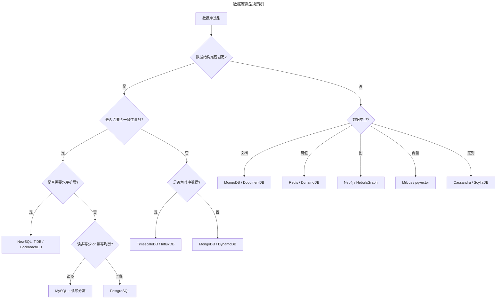
```mermaid
---
title: 数据库选型决策树
---
flowchart TD
    A[数据库选型] --> B{数据结构是否固定?}
    B -->|是| C{是否需要强一致性事务?}
    B -->|否| D{数据类型?}
    C -->|是| E{是否需要水平扩展?}
    C -->|否| F{是否为时序数据?}
    E -->|是| G[NewSQL: TiDB / CockroachDB]
    E -->|否| H{读多写少 or 读写均衡?}
    H -->|读多| I[MySQL + 读写分离]
    H -->|均衡| J[PostgreSQL]
    F -->|是| K[TimescaleDB / InfluxDB]
    F -->|否| L[MongoDB / DynamoDB]
    D -->|文档| M[MongoDB / DocumentDB]
    D -->|键值| N[Redis / DynamoDB]
    D -->|图| O[Neo4j / NebulaGraph]
    D -->|向量| P[Milvus / pgvector]
    D -->|宽列| Q[Cassandra / ScyllaDB]
```

决策树以"数据结构是否固定"为第一分流点，结构固定走关系型路径，结构灵活走 NoSQL 路径。关系型路径再根据"强一致性事务"与"水平扩展"需求进一步细分到 MySQL、PostgreSQL 或 NewSQL。NoSQL 路径则按数据类型直接映射到文档、键值、图、向量、宽列等专用数据库。

#### 2.1.3 MySQL vs PostgreSQL：2025 年对比

| 特性 | MySQL 8.x/9.x | PostgreSQL 17/18 |
|------|---------------|-----------------|
| 并行查询 | 并行 DML、并行索引扫描 | 并行顺序扫描、并行索引扫描、并行 Append |
| JSON 支持 | JSON_TABLE、JSON_VALUE | JSONB 索引、JSON 路径表达式、JSON_TABLE |
| 窗口函数 | ✅ 完整支持 | ✅ 完整支持 + 增强聚合 |
| CTE | 递归 CTE + CTE 优化 | 递归 CTE + CTE 物化控制 |
| 全文搜索 | 内置 ngram 解析器 | 内置 GIN/GiST 索引、tsvector/tsquery |
| 地理空间 | 通过 ST 函数支持 | PostGIS 扩展，功能更完善 |
| 逻辑复制 | 基于行复制 | 逻辑复制 + 发布/订阅模型 |
| 分区 | Range/List/Hash/Key 分区 | Range/List/Hash 分区 + 分区裁剪增强 |
| 向量检索 | 无原生支持 | pgvector 扩展，支持 IVFFlat/HNSW |
| 角色/权限 | 角色管理（8.0+） | 细粒度行级安全（RLS）+ 角色 |
| 异步 I/O | 传统线程模型 | 18 引入异步 I/O 子系统 |
| UUID | UUID() 函数 | UUIDv7() 函数（18） |
| 生成列 | 存储生成列 | 虚拟生成列（18） |
| 认证 | 原生认证 + PAM | OAuth 2.0 认证（18） |

**选型建议**：

- **选择 MySQL**：团队有丰富 MySQL 运维经验、读密集型场景、需要成熟的主从复制生态、使用 Percona/XtraBackup 等工具链
- **选择 PostgreSQL**：需要复杂查询与分析、地理空间处理、JSONB 深度使用、向量检索（AI 应用）、细粒度权限控制
- **核心原则**：团队对技术的驾驭能力 > 技术本身的纸面优势；数据库迁移成本极高，选型需审慎

### 2.2 索引核心原理

#### 2.2.1 B+Tree 索引

B+Tree 是关系型数据库最常用的索引结构，其核心特性：

- 非叶子节点仅存储键值，叶子节点存储完整数据（或指向数据的指针）
- 叶子节点通过双向链表连接，支持高效范围扫描
- 树高度通常为 3–4 层，可支撑千万级数据量的点查

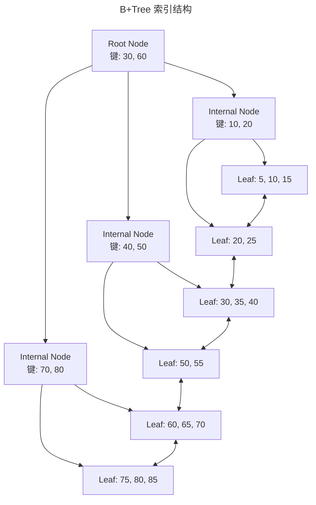
```mermaid
---
title: B+Tree 索引结构
---
graph TD
    R["Root Node<br/>键: 30, 60"] --> A["Internal Node<br/>键: 10, 20"]
    R --> B["Internal Node<br/>键: 40, 50"]
    R --> C["Internal Node<br/>键: 70, 80"]
    A --> L1["Leaf: 5, 10, 15"]
    A --> L2["Leaf: 20, 25"]
    B --> L3["Leaf: 30, 35, 40"]
    B --> L4["Leaf: 50, 55"]
    C --> L5["Leaf: 60, 65, 70"]
    C --> L6["Leaf: 75, 80, 85"]
    L1 <--> L2
    L2 <--> L3
    L3 <--> L4
    L4 <--> L5
    L5 <--> L6
```

B+Tree 的叶子节点双向链表是实现范围查询的关键：一旦定位到范围起点，即可沿链表顺序扫描，无需回溯到根节点。这种结构使得 B+Tree 同时擅长等值查询与范围查询。

#### 2.2.2 索引类型对比

| 索引类型 | 数据结构 | 适用场景 | 注意事项 |
|---------|---------|---------|---------|
| B+Tree | B+Tree | 等值查询、范围查询、排序 | 最通用索引，MySQL 默认 |
| Hash | 哈希表 | 等值查询 | 不支持范围查询、排序 |
| 全文索引 | 倒排索引 | 文本搜索 | MySQL ngram / PostgreSQL GIN |
| 空间索引 | R-Tree | 地理空间查询 | 需配合 PostGIS / MySQL ST 函数 |
| 向量索引 | IVFFlat / HNSW | 语义相似度搜索 | pgvector 扩展提供 |

#### 2.2.3 索引选择性

索引选择性（Selectivity）= 不同值数量 / 总行数，选择性越高索引效率越好。经验法则：选择性 < 0.1 的列不适合单独建索引。

### 2.3 事务与隔离级别

#### 2.3.1 ACID 原则

| 属性 | 含义 | 实现机制 |
|------|------|---------|
| Atomicity（原子性） | 事务中的操作全部成功或全部回滚 | WAL（Write-Ahead Log）、Undo Log |
| Consistency（一致性） | 事务前后数据库处于一致状态 | 约束、触发器、应用层校验 |
| Isolation（隔离性） | 并发事务互不干扰 | 锁机制、MVCC |
| Durability（持久性） | 已提交事务的修改永久保存 | WAL、fsync、Redo Log |

#### 2.3.2 隔离级别与并发异常

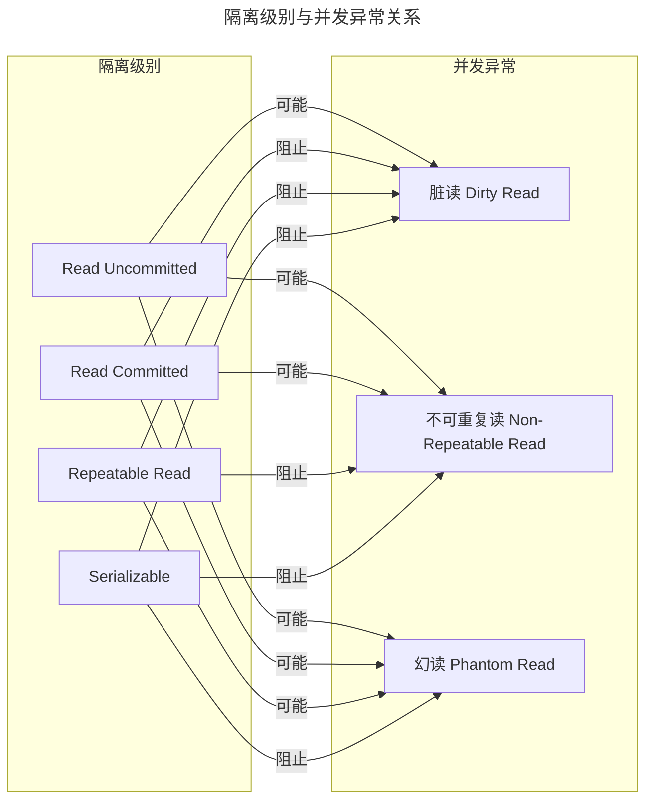
```mermaid
---
title: 隔离级别与并发异常关系
---
flowchart LR
    subgraph 隔离级别
        RU[Read Uncommitted]
        RC[Read Committed]
        RR[Repeatable Read]
        SER[Serializable]
    end

    subgraph 并发异常
        DR[脏读 Dirty Read]
        NRR[不可重复读 Non-Repeatable Read]
        PR[幻读 Phantom Read]
    end

    RU -->|可能| DR
    RU -->|可能| NRR
    RU -->|可能| PR

    RC -->|阻止| DR
    RC -->|可能| NRR
    RC -->|可能| PR

    RR -->|阻止| DR
    RR -->|阻止| NRR
    RR -->|可能| PR

    SER -->|阻止| DR
    SER -->|阻止| NRR
    SER -->|阻止| PR
```

图中清晰展示了隔离级别从低到高逐步阻止并发异常的过程：Read Uncommitted 不阻止任何异常，Read Committed 阻止脏读，Repeatable Read 额外阻止不可重复读，Serializable 阻止全部三类异常。

| 隔离级别 | 脏读 | 不可重复读 | 幻读 | MySQL InnoDB | PostgreSQL |
|---------|------|----------|------|-------------|-----------|
| Read Uncommitted | ✓ | ✓ | ✓ | 支持 | 支持 |
| Read Committed | ✗ | ✓ | ✓ | 支持 | 支持（默认） |
| Repeatable Read | ✗ | ✗ | ✓ | 支持（默认，通过 Gap Lock 部分阻止幻读） | 支持（MVCC 快照隔离，可避免幻读） |
| Serializable | ✗ | ✗ | ✗ | 支持 | 支持 |

**关键差异**：MySQL InnoDB 在 RR 级别通过 Next-Key Lock（记录锁 + 间隙锁）在一定程度上阻止幻读；PostgreSQL 的 RR 级别基于 MVCC 快照隔离实现，能避免幻读（提供比 SQL 标准更严格的保证），其 SERIALIZABLE 级别再通过 SSI（可串行化快照隔离）进一步防止写偏斜异常。InnoDB 的默认隔离级别为 REPEATABLE READ。

### 2.4 锁机制

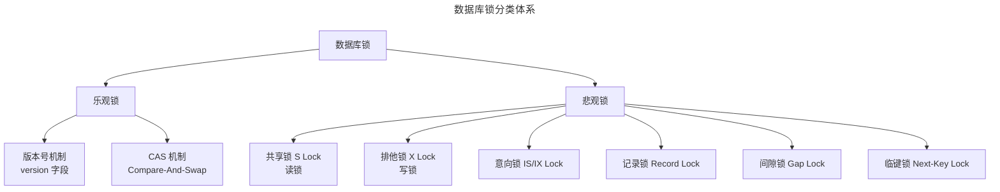
```mermaid
---
title: 数据库锁分类体系
---
graph TD
    A[数据库锁] --> B[乐观锁]
    A --> C[悲观锁]
    B --> B1[版本号机制<br/>version 字段]
    B --> B2[CAS 机制<br/>Compare-And-Swap]
    C --> C1[共享锁 S Lock<br/>读锁]
    C --> C2[排他锁 X Lock<br/>写锁]
    C --> C3[意向锁 IS/IX Lock]
    C --> C4[记录锁 Record Lock]
    C --> C5[间隙锁 Gap Lock]
    C --> C6[临键锁 Next-Key Lock]
```

锁体系以"乐观/悲观"为顶层分类：乐观锁假设冲突概率低，提交时检测；悲观锁假设冲突概率高，操作前加锁。悲观锁再细分为共享锁、排他锁、意向锁及各种行级锁。

**乐观锁 vs 悲观锁**：

| 维度 | 乐观锁 | 悲观锁 |
|------|-------|-------|
| 核心思想 | 假设冲突概率低，提交时检测 | 假设冲突概率高，操作前加锁 |
| 实现方式 | 版本号 / CAS | `SELECT ... FOR UPDATE` |
| 适用场景 | 读多写少、冲突率低 | 写多、冲突率高 |
| 性能特征 | 无锁开销，冲突时重试成本高 | 加锁开销，阻塞等待 |
| 死锁风险 | 无 | 有 |

**InnoDB 锁兼容矩阵**：

|  | S Lock | X Lock | IS Lock | IX Lock |
|--|--------|--------|---------|---------|
| **S Lock** | ✅ 兼容 | ❌ 冲突 | ✅ 兼容 | ❌ 冲突 |
| **X Lock** | ❌ 冲突 | ❌ 冲突 | ❌ 冲突 | ❌ 冲突 |
| **IS Lock** | ✅ 兼容 | ❌ 冲突 | ✅ 兼容 | ✅ 兼容 |
| **IX Lock** | ❌ 冲突 | ❌ 冲突 | ✅ 兼容 | ✅ 兼容 |

### 2.5 MVCC 多版本并发控制

MVCC 是现代关系型数据库实现高并发读写的核心机制，使读操作不阻塞写操作、写操作不阻塞读操作。

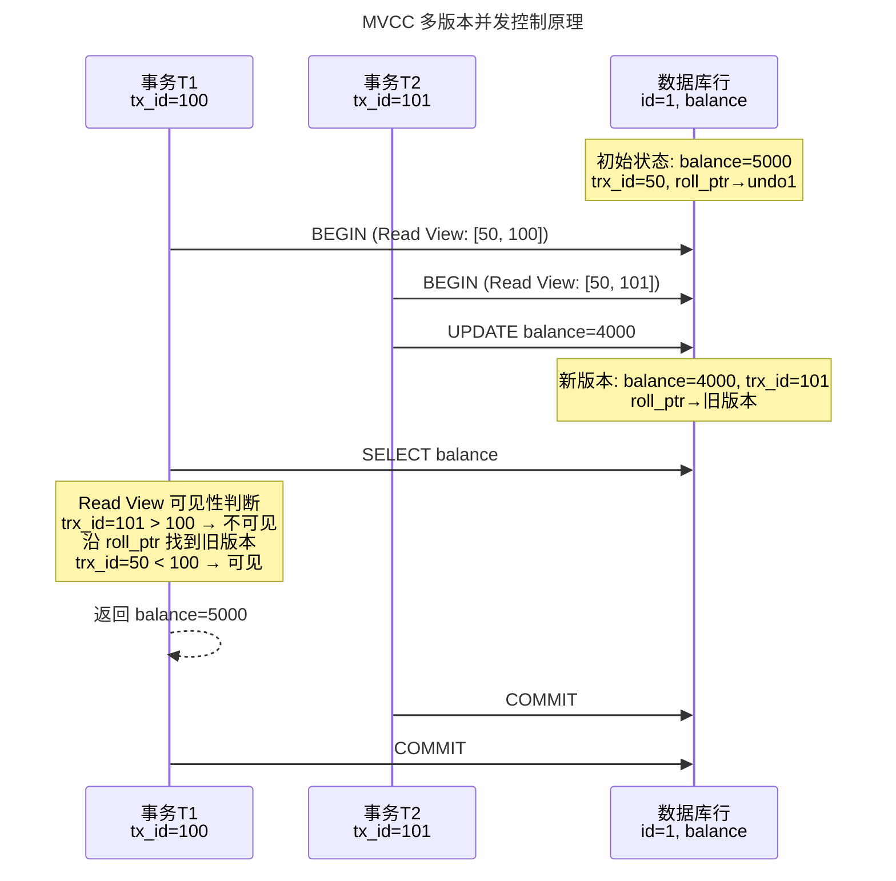
```mermaid
---
title: MVCC 多版本并发控制原理
---
sequenceDiagram
    participant T1 as 事务T1<br/>tx_id=100
    participant T2 as 事务T2<br/>tx_id=101
    participant DB as 数据库行<br/>id=1, balance

    Note over DB: 初始状态: balance=5000<br/>trx_id=50, roll_ptr→undo1

    T1->>DB: BEGIN (Read View: [50, 100])
    T2->>DB: BEGIN (Read View: [50, 101])

    T2->>DB: UPDATE balance=4000
    Note over DB: 新版本: balance=4000, trx_id=101<br/>roll_ptr→旧版本

    T1->>DB: SELECT balance
    Note over T1: Read View 可见性判断<br/>trx_id=101 > 100 → 不可见<br/>沿 roll_ptr 找到旧版本<br/>trx_id=50 < 100 → 可见
    T1-->>T1: 返回 balance=5000

    T2->>DB: COMMIT
    T1->>DB: COMMIT
```

时序图展示了 MVCC 的核心机制：T1 在 T2 提交前读取数据时，通过 Read View 判断新版本不可见，沿 roll_ptr 找到旧版本返回 balance=5000。这种"快照读"使得读操作无需加锁即可获得一致性视图。

**MySQL vs PostgreSQL MVCC 差异**：

| 维度 | MySQL InnoDB | PostgreSQL |
|------|-------------|-----------|
| 版本存储 | Undo Log（回滚段） | 行内多版本（xmin/xmax） |
| 空间回收 | Purge 线程清理 Undo | VACUUM 清理死元组 |
| 读视图 | 查询开始时创建 | 依赖隔离级别：RC 每条语句创建，RR 事务开始时创建 |
| 回滚代价 | 通过 Undo Log 回滚，代价较低 | 需要清理死元组，大事务回滚代价高 |
| 表膨胀 | 较轻 | 长事务可能导致严重表膨胀 |

### 2.6 幂等性核心概念

#### 2.6.1 定义

幂等性（Idempotency）是指一个操作在任意多次执行后所产生的系统状态与副作用，均与一次执行完全相同。数学形式化表达：

$$f(f(x)) = f(x), \quad \forall x$$

该定义涵盖两个维度：

| 维度 | 含义 | 示例 |
|------|------|------|
| **系统状态** | 多次执行后持久化数据一致 | 账户余额扣减不重复 |
| **副作用** | 多次执行后外部可观测行为一致 | 通知消息不重复发送 |

#### 2.6.2 语义范畴与语法保证

幂等是一个**语义范畴**（Semantic Category）对行为结果的定义——它描述的是"结果应该怎样"，而非"代码应该怎么写"。将语义目标转化为**语法保证**（Syntactic Guarantee）需要严谨的工程设计：通过幂等令牌、唯一性约束、去重机制等规则确保语义达成。

#### 2.6.3 幂等性分类

**强幂等 vs 弱幂等**：

| 类型 | 定义 | 响应要求 | 适用场景 |
|------|------|----------|----------|
| **强幂等** | 多次执行后系统状态与副作用均与一次执行相同，且响应内容一致 | 响应体必须相同 | 支付结算、资金转账 |
| **弱幂等** | 多次执行后系统状态与一次执行相同，但响应内容可不同 | 状态一致即可，响应可携带差异信息 | 状态查询、日志写入 |

**自然幂等 vs 设计幂等**：

- **自然幂等（Natural Idempotency）**：操作本身具有幂等语义，无需额外机制保证（如 `abs(x)`、`x = 5`、HTTP GET）
- **设计幂等（Designed Idempotency）**：操作本身非幂等，需通过工程手段实现（如 `balance -= 100`、消息发送）

#### 2.6.4 HTTP 语义中的幂等

RFC 9110 对 HTTP 方法的幂等性有明确定义：

| HTTP 方法 | 幂等性 | 安全性 | 语义说明 |
|-----------|--------|--------|----------|
| GET | ✅ 幂等 | ✅ 安全 | 资源表示获取，不应产生副作用 |
| PUT | ✅ 幂等 | ❌ 不安全 | 全量替换目标资源，多次执行结果一致 |
| DELETE | ✅ 幂等 | ❌ 不安全 | 删除目标资源，已删除后再次删除状态不变 |
| POST | ❌ 非幂等 | ❌ 不安全 | 创建子资源或触发处理，每次可能产生不同结果 |
| PATCH | ⚠️ 视实现而定 | ❌ 不安全 | 部分更新，若为绝对值替换则幂等，相对值增量则非幂等 |

> **关键区分**：HTTP 幂等性是服务器端语义承诺，而非协议层强制保证。开发者需自行在服务端实现幂等逻辑。

---

## 3. 关键流程

### 3.1 分布式数据库架构演进

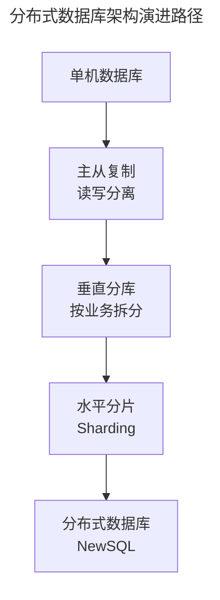
```mermaid
---
title: 分布式数据库架构演进路径
---
flowchart TD
    A[单机数据库] --> B[主从复制<br/>读写分离]
    B --> C[垂直分库<br/>按业务拆分]
    C --> D[水平分片<br/>Sharding]
    D --> E[分布式数据库<br/>NewSQL]
```

架构演进遵循"先垂直后水平"的路径：单机到主从解决读扩展与高可用，垂直分库解决业务耦合，水平分片解决单库容量瓶颈，NewSQL 则在保持 SQL 兼容性的同时提供原生分布式能力。

### 3.2 读写分离

读写分离通过主节点处理写操作、从节点处理读操作，实现读能力的水平扩展。

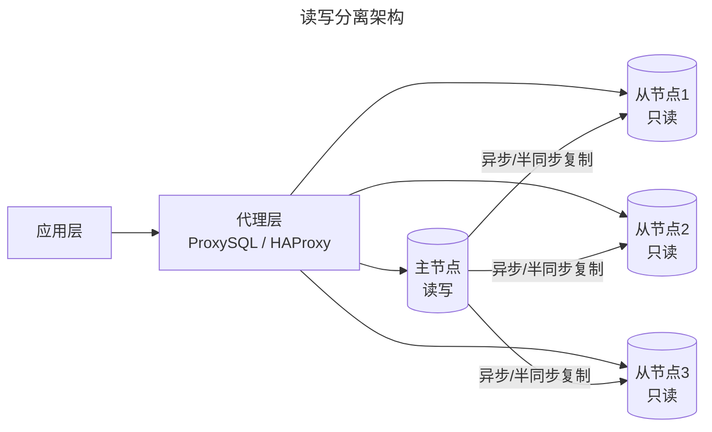
```mermaid
---
title: 读写分离架构
---
graph LR
    Client[应用层] --> Proxy[代理层<br/>ProxySQL / HAProxy]
    Proxy --> Master[(主节点<br/>读写)]
    Proxy --> S1[(从节点1<br/>只读)]
    Proxy --> S2[(从节点2<br/>只读)]
    Proxy --> S3[(从节点3<br/>只读)]

    Master -->|异步/半同步复制| S1
    Master -->|异步/半同步复制| S2
    Master -->|异步/半同步复制| S3
```

代理层负责将读请求路由到从节点、写请求路由到主节点，并对应用透明。复制模式的选择决定了一致性与性能的权衡。

**复制模式对比**：

| 复制模式 | 数据一致性 | 性能 | 适用场景 |
|---------|----------|------|---------|
| 异步复制 | 主从延迟不可控 | 最高 | 对一致性要求不高的场景 |
| 半同步复制 | 至少一个从节点确认 | 中等 | 平衡一致性与性能 |
| 全同步复制 | 所有节点确认 | 最低 | 金融级一致性要求 |
| MySQL Group Replication | 多数派共识 | 中等 | 高可用集群 |
| PostgreSQL 逻辑复制 | 按发布/订阅 | 中等 | 跨版本升级、部分表复制 |

**主从延迟应对策略**：

1. **强制走主库**：对一致性要求高的读请求直接路由到主节点
2. **等待复制位点的同步复制**：使用 `WAIT_FOR_EXECUTED_GTID_SET()` 等待从库追上
3. **中间件路由控制**：在 Proxy 层实现读写分离 + 一致性路由策略

### 3.3 分库分表

当单表数据量超过千万级或单库 QPS 达到瓶颈时，需进行水平拆分。

| 策略 | 说明 | 适用场景 |
|------|------|---------|
| 垂直分库 | 按业务域拆分到不同数据库实例 | 业务边界清晰、耦合度低 |
| 垂直分表 | 将大表中不常用列拆到扩展表 | 单行数据过大、热点列集中 |
| 水平分库 | 相同表结构分布到多个实例 | 单库 QPS 瓶颈 |
| 水平分表 | 同一实例内按规则拆分多张表 | 单表数据量过大 |

**分片键选择原则**：高基数、查询覆盖（80% 以上查询条件包含分片键）、避免热点。

**常见分片中间件**：

| 中间件 | 类型 | 特点 |
|--------|------|------|
| ShardingSphere | 客户端 + Proxy | Apache 顶级项目，功能全面 |
| Vitess | Proxy | YouTube 开源，Kubernetes 原生 |
| MyCat | Proxy | 社区活跃，国内使用广泛 |

### 3.4 NewSQL 分布式数据库

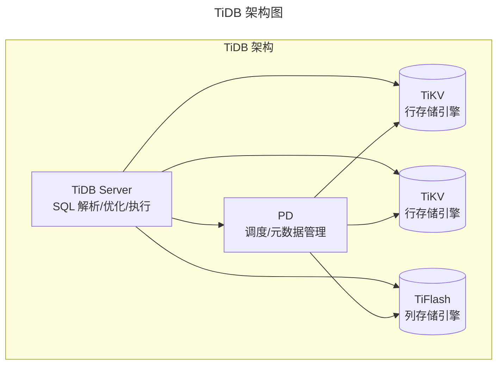
```mermaid
---
title: TiDB 架构图
---
graph TD
    subgraph "TiDB 架构"
        T1[TiDB Server<br/>SQL 解析/优化/执行] --> PD[PD<br/>调度/元数据管理]
        T1 --> Tikv1[(TiKV<br/>行存储引擎)]
        T1 --> Tikv2[(TiKV<br/>行存储引擎)]
        T1 --> Tiflash[(TiFlash<br/>列存储引擎)]
        PD --> Tikv1
        PD --> Tikv2
        PD --> Tiflash
    end
```

TiDB 架构采用存算分离设计：TiDB Server 负责 SQL 解析与执行，PD 负责调度与元数据管理，TiKV 提供行存储，TiFlash 提供列存储实现 HTAP。

| 特性 | TiDB | CockroachDB | YugabyteDB |
|------|------|-------------|-----------|
| 协议兼容 | MySQL | PostgreSQL | PostgreSQL / Cassandra |
| 存储引擎 | TiKV (RocksDB) + TiFlash | Pebble | RocksDB |
| 事务模型 | Percolator (2PC + 乐观) | 2PC + HLC | 2PC + Hybrid Logical Clock |
| HTAP | ✅ TiFlash 列存 | ❌ | ✅ 列存副本 |
| 部署形态 | 自建 / TiDB Cloud | 自建 / CockroachDB Cloud | 自建 / YugabyteDB Managed |
| 适用场景 | MySQL 兼容迁移、HTAP | PostgreSQL 兼容、全球分布 | PostgreSQL 兼容、云原生 |

### 3.5 幂等令牌机制

幂等令牌是客户端与服务端识别同一请求（或同一请求的多次重试）的唯一标识。

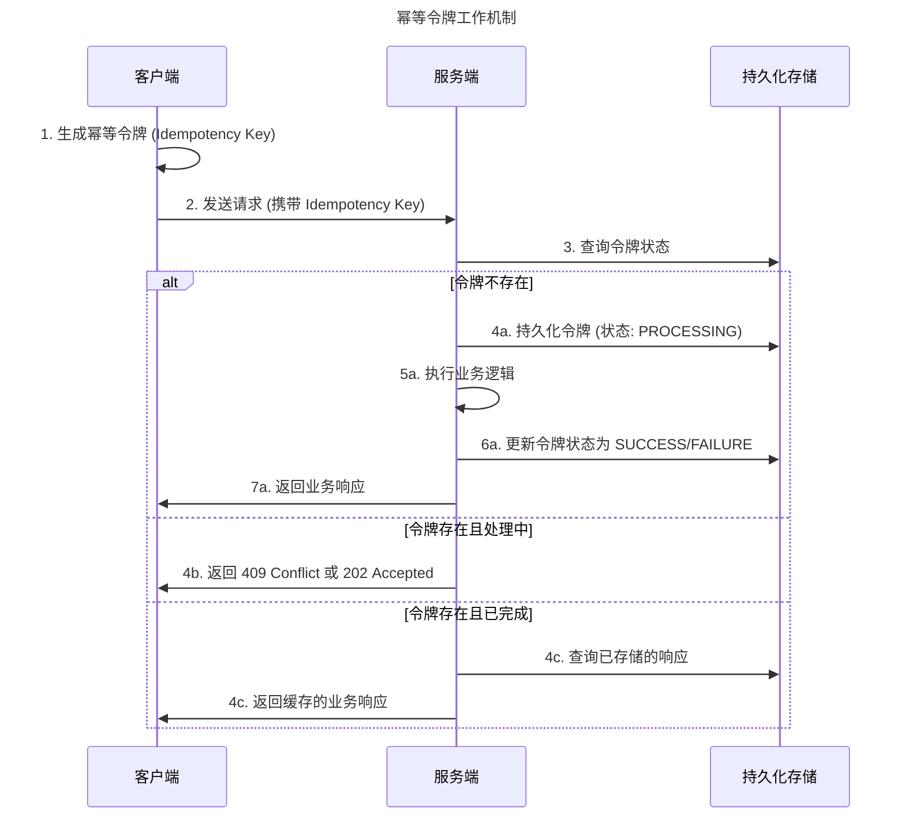
```mermaid
---
title: 幂等令牌工作机制
---
sequenceDiagram
    participant C as 客户端
    participant S as 服务端
    participant DB as 持久化存储

    C->>C: 1. 生成幂等令牌 (Idempotency Key)
    C->>S: 2. 发送请求 (携带 Idempotency Key)
    S->>DB: 3. 查询令牌状态
    alt 令牌不存在
        S->>DB: 4a. 持久化令牌 (状态: PROCESSING)
        S->>S: 5a. 执行业务逻辑
        S->>DB: 6a. 更新令牌状态为 SUCCESS/FAILURE
        S->>C: 7a. 返回业务响应
    else 令牌存在且处理中
        S->>C: 4b. 返回 409 Conflict 或 202 Accepted
    else 令牌存在且已完成
        S->>DB: 4c. 查询已存储的响应
        S->>C: 4c. 返回缓存的业务响应
    end
```

时序图展示了幂等令牌的三条分支：新令牌走完整业务流程，处理中令牌返回冲突，已完成令牌返回缓存响应。这种设计确保同一请求无论被提交多少次，业务逻辑只执行一次。

**令牌生成协议要点**：
- 令牌由客户端生成，确保重试时携带相同令牌
- 令牌需具备全局唯一性（跨客户端、跨时间）
- 令牌的生命周期需与业务语义绑定，而非与单次 HTTP 请求绑定

### 3.6 唯一性保证与去重

服务端通过数据库唯一索引确保同一幂等令牌对应的业务操作仅被执行一次。

**为什么读检查（Read-then-Write）不可靠**：

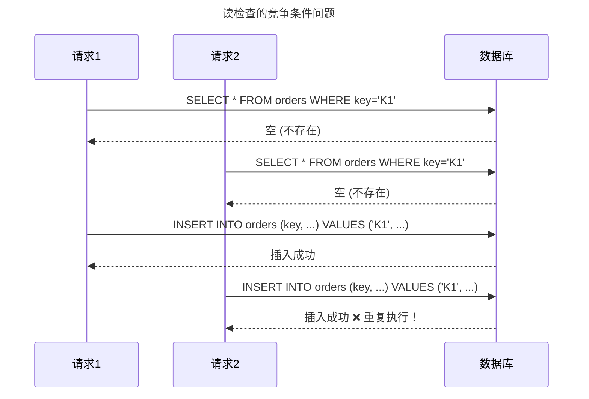
```mermaid
---
title: 读检查的竞争条件问题
---
sequenceDiagram
    participant R1 as 请求1
    participant R2 as 请求2
    participant DB as 数据库

    R1->>DB: SELECT * FROM orders WHERE key='K1'
    DB-->>R1: 空 (不存在)
    R2->>DB: SELECT * FROM orders WHERE key='K1'
    DB-->>R2: 空 (不存在)
    R1->>DB: INSERT INTO orders (key, ...) VALUES ('K1', ...)
    DB-->>R1: 插入成功
    R2->>DB: INSERT INTO orders (key, ...) VALUES ('K1', ...)
    DB-->>R2: 插入成功 ❌ 重复执行！
```

图中展示了 Check-then-Act 竞争条件：两个并发请求均读到"不存在"后各自插入，导致重复。唯一索引通过数据库的原子性约束从根本上解决此问题。

**去重机制对比**：

| 类型 | 机制 | 优点 | 缺点 |
|------|------|------|------|
| **先查后做（Check-before-Act）** | 执行前查询令牌是否存在 | 实现简单 | 存在竞争条件，需配合锁 |
| **先做后判（Act-then-Check）** | 依赖唯一索引约束，插入失败即去重 | 原子性强，无竞争 | 需处理插入异常逻辑 |

**推荐方案**：先做后判 + 唯一索引，将并发控制交由数据库事务保证。

### 3.7 请求状态机

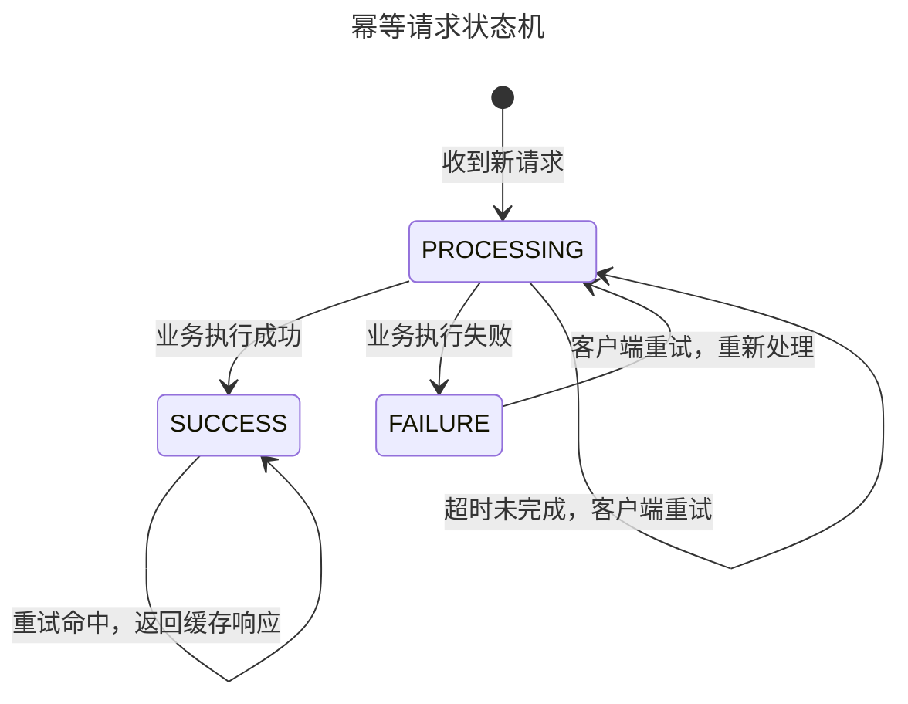
```mermaid
---
title: 幂等请求状态机
---
stateDiagram-v2
    [*] --> PROCESSING: 收到新请求
    PROCESSING --> SUCCESS: 业务执行成功
    PROCESSING --> FAILURE: 业务执行失败
    SUCCESS --> SUCCESS: 重试命中，返回缓存响应
    FAILURE --> PROCESSING: 客户端重试，重新处理
    PROCESSING --> PROCESSING: 超时未完成，客户端重试
```

状态机定义了幂等请求的完整生命周期：PROCESSING 是中间态，SUCCESS 和 FAILURE 是终态。SUCCESS 状态的重试直接返回缓存响应，FAILURE 状态允许重新处理，PROCESSING 持续中的重试返回冲突。

### 3.8 分布式幂等架构总览

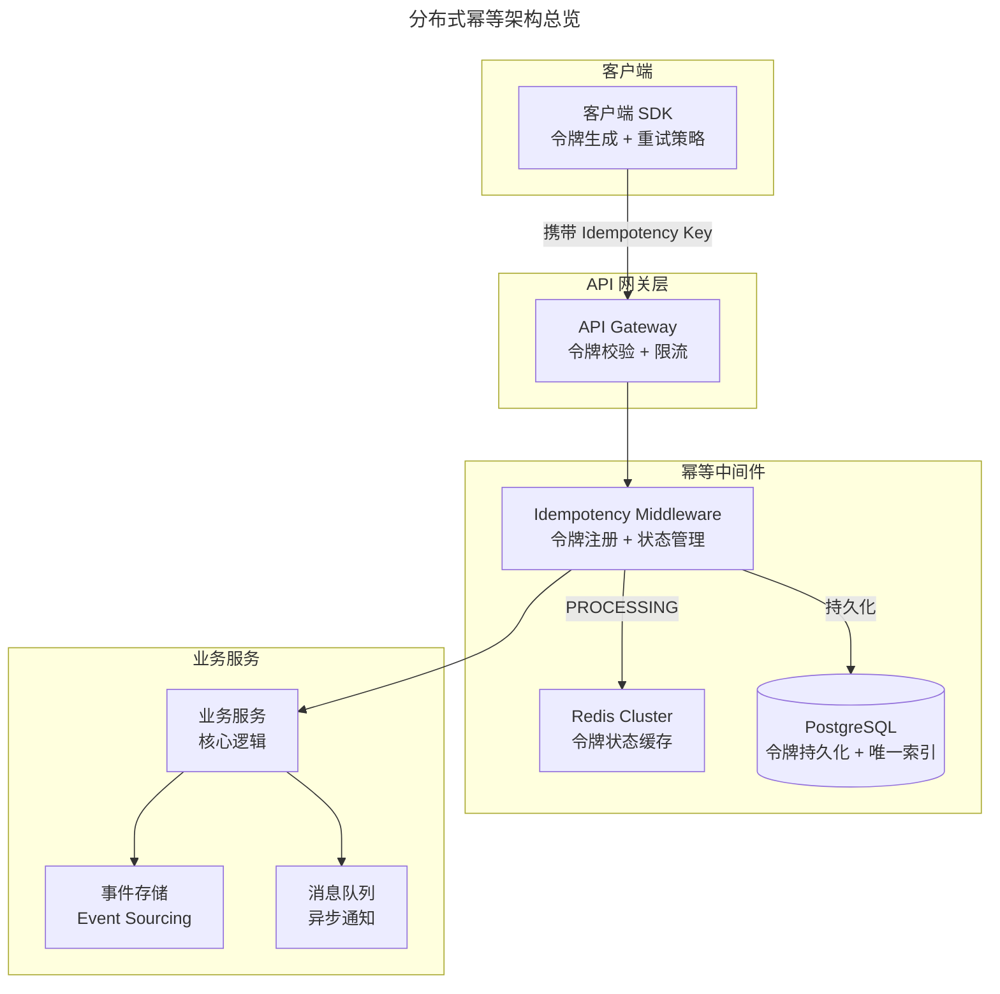
```mermaid
---
title: 分布式幂等架构总览
---
graph TB
    subgraph 客户端
        CL[客户端 SDK<br/>令牌生成 + 重试策略]
    end

    subgraph API 网关层
        GW[API Gateway<br/>令牌校验 + 限流]
    end

    subgraph 幂等中间件
        IM[Idempotency Middleware<br/>令牌注册 + 状态管理]
        IM -->|PROCESSING| RC[Redis Cluster<br/>令牌状态缓存]
        IM -->|持久化| PG[(PostgreSQL<br/>令牌持久化 + 唯一索引)]
    end

    subgraph 业务服务
        BS[业务服务<br/>核心逻辑]
        BS --> ES[事件存储<br/>Event Sourcing]
        BS --> MQ[消息队列<br/>异步通知]
    end

    CL -->|携带 Idempotency Key| GW
    GW --> IM
    IM --> BS
```

架构图展示了幂等机制的完整分层：客户端 SDK 负责令牌生成与重试，API 网关负责令牌校验与限流，幂等中间件负责令牌注册与状态管理（Redis 缓存 + PostgreSQL 持久化），业务服务专注于核心逻辑。这种分层设计使幂等能力可复用、可治理。

---

## 4. 工具与实战

### 4.1 现代数据库特性

#### 4.1.1 MySQL 8.0+ / 9.x 新特性

| 版本 | 核心特性 | 工程价值 |
|------|---------|---------|
| 8.0 | 窗口函数（`ROW_NUMBER()`, `RANK()`, `LEAD()`） | 复杂分析查询无需子查询嵌套 |
| 8.0 | 通用表表达式（CTE / Recursive CTE） | 层级数据查询（组织架构、评论树） |
| 8.0 | JSON 函数增强（`JSON_TABLE()`, `JSON_VALUE()`） | 半结构化数据处理能力提升 |
| 8.0 | 角色管理（`CREATE ROLE`, `GRANT`） | 企业级权限管理 |
| 8.0 | 不可见索引（Invisible Index） | 索引变更的安全灰度验证 |
| 8.0 | 降序索引（Descending Index） | 多列排序场景性能优化 |
| 8.0 | `NOWAIT` / `SKIP LOCKED` | 队列消费、并发控制 |
| 9.0 | JavaScript 存储过程 | MySQL 9.x 引入 JS UDF 支持 |
| 9.x | 增量备份 | 降低备份存储与时间成本 |
| 9.x | EXCEPT / INTERSECT | 集合运算语法支持 |

#### 4.1.2 PostgreSQL 17/18 新特性

| 版本 | 核心特性 | 工程价值 |
|------|---------|---------|
| 17 | SQL/JSON 标准支持（`JSON_TABLE`） | 标准化 JSON 查询，与 MySQL 对齐 |
| 17 | 逻辑复制性能提升 | 大表复制延迟显著降低 |
| 17 | 增量备份（pg_basebackup --incremental） | 降低备份窗口与存储成本 |
| 17 | `COPY` 增强 | 批量导入性能提升 |
| 18 | 异步 I/O 子系统 | 大幅提升 I/O 密集型查询性能 |
| 18 | `UUIDv7()` 内置函数 | 时间排序友好的 UUID 生成 |
| 18 | 虚拟生成列（Virtual Generated Column） | 不占用存储空间的计算列 |
| 18 | OAuth 2.0 认证 | 云原生环境下的身份集成 |
| 18 | 时态约束（Temporal Constraints） | 有效期数据的一致性保障 |
| 18 | `pgvector` 增强 | IVFFlat/HNSW 索引优化，向量检索性能提升 |

#### 4.1.3 向量数据库与 AI 应用

大语言模型（LLM）的兴起催生了向量数据库需求，核心场景为 **RAG（Retrieval-Augmented Generation）** 架构中的语义检索。

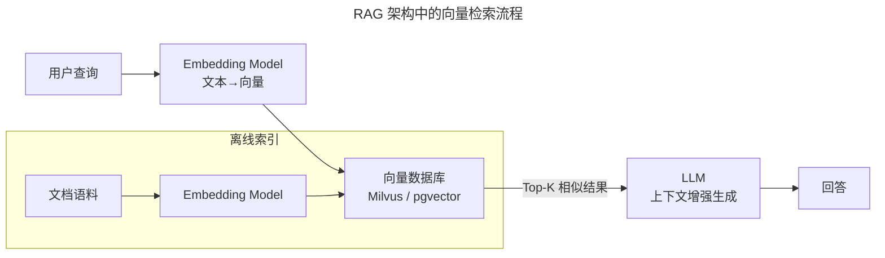
```mermaid
---
title: RAG 架构中的向量检索流程
---
flowchart LR
    Q[用户查询] --> E[Embedding Model<br/>文本→向量]
    E --> V[向量数据库<br/>Milvus / pgvector]
    V -->|Top-K 相似结果| C[LLM<br/>上下文增强生成]
    C --> A[回答]

    subgraph 离线索引
        D[文档语料] --> E2[Embedding Model]
        E2 --> V
    end
```

RAG 架构分为离线索引与在线查询两条链路：离线将文档语料通过 Embedding 模型转换为向量并入库，在线将用户查询同样向量化后在向量数据库中检索 Top-K 相似结果，作为 LLM 的上下文增强生成回答。

**向量索引算法对比**：

| 算法 | 原理 | 查询精度 | 索引构建速度 | 适用规模 |
|------|------|---------|------------|---------|
| 暴力扫描 | 全量距离计算 | 100% | 无需构建 | < 10万 |
| IVFFlat | 聚类倒排 + 精排 | 高 | 中 | 10万–1000万 |
| HNSW | 多层导航小世界图 | 高 | 慢 | 100万–10亿 |
| IVFPQ | 聚类 + 乘积量化压缩 | 中 | 中 | > 1亿 |

**pgvector 实战**：

```sql
-- 启用扩展
CREATE EXTENSION vector;

-- 创建带向量列的表
CREATE TABLE documents (
    id SERIAL PRIMARY KEY,
    content TEXT,
    embedding VECTOR(1536)
);

-- 创建 HNSW 索引
CREATE INDEX ON documents
    USING hnsw (embedding vector_cosine_ops);

-- 语义相似度查询
SELECT id, content,
       1 - (embedding <=> '[0.01, 0.02, ...]'::vector) AS similarity
FROM documents
ORDER BY embedding <=> '[0.01, 0.02, ...]'::vector
LIMIT 10;
```

### 4.2 索引优化实战

#### 4.2.1 EXPLAIN 执行计划分析

```sql
EXPLAIN ANALYZE
SELECT o.order_id, o.total_amount, u.name
FROM orders o
JOIN users u ON o.user_id = u.id
WHERE o.status = 'PAID' AND o.created_at > '2025-01-01';
```

**关键指标解读**：

| 指标 | 含义 | 优化方向 |
|------|------|---------|
| `type: ALL` | 全表扫描 | 添加合适索引 |
| `type: index` | 索引全扫描 | 优化查询条件 |
| `type: ref` | 索引等值查找 | ✅ 理想状态 |
| `type: range` | 索引范围扫描 | ✅ 可接受 |
| `Extra: Using filesort` | 额外排序 | 优化 ORDER BY 索引覆盖 |
| `Extra: Using temporary` | 临时表 | 优化 GROUP BY / DISTINCT |
| `rows` | 预估扫描行数 | 越小越好 |
| `filtered` | 过滤比例 | 越高越好 |

#### 4.2.2 索引优化策略

**最左前缀原则**：

```sql
-- 索引: idx_abc (a, b, c)
-- ✅ 命中: WHERE a = 1
-- ✅ 命中: WHERE a = 1 AND b = 2
-- ✅ 命中: WHERE a = 1 AND b = 2 AND c = 3
-- ❌ 不命中: WHERE b = 2 AND c = 3
-- ⚠️ 部分命中: WHERE a = 1 AND c = 3（仅用到 a）
```

**覆盖索引**：索引包含查询所需的所有列，避免回表。

```sql
-- 覆盖索引优化
CREATE INDEX idx_user_status_created
    ON orders (user_id, status, created_at, order_id);

-- 查询可直接从索引获取数据，无需回表
SELECT order_id, created_at
FROM orders
WHERE user_id = 1001 AND status = 'PAID';
```

**索引下推（ICP, Index Condition Pushdown）**：MySQL 5.6+ 在存储引擎层过滤索引条件，减少回表次数。

### 4.3 事务设计模式

#### 4.3.1 事务性 Outbox 模式

解决事务内包含不可逆操作（如消息发送）的一致性问题：

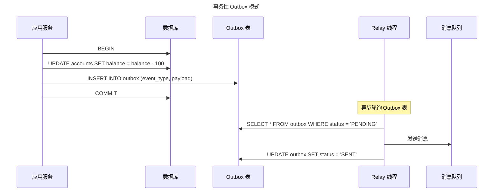
```mermaid
---
title: 事务性 Outbox 模式
---
sequenceDiagram
    participant App as 应用服务
    participant DB as 数据库
    participant Outbox as Outbox 表
    participant Relay as Relay 线程
    participant MQ as 消息队列

    App->>DB: BEGIN
    App->>DB: UPDATE accounts SET balance = balance - 100
    App->>Outbox: INSERT INTO outbox (event_type, payload)
    App->>DB: COMMIT

    Note over Relay: 异步轮询 Outbox 表

    Relay->>Outbox: SELECT * FROM outbox WHERE status = 'PENDING'
    Relay->>MQ: 发送消息
    Relay->>Outbox: UPDATE outbox SET status = 'SENT'
```

Outbox 模式将消息写入与业务操作放在同一事务中，确保"要么都成功，要么都失败"。Relay 线程异步轮询 Outbox 表并发送消息，实现最终一致性。

#### 4.3.2 Saga 模式

长事务拆分为多个本地事务，通过补偿操作实现最终一致性：

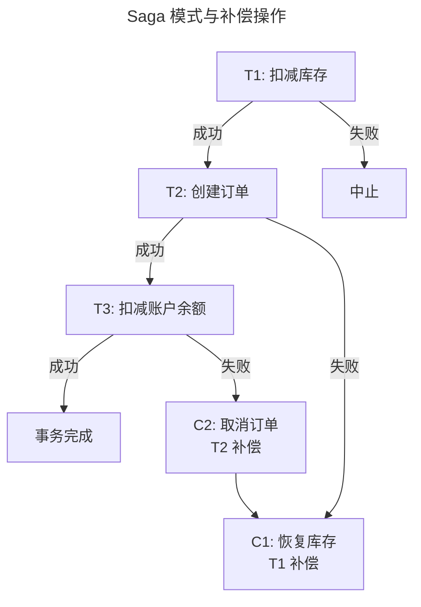
```mermaid
---
title: Saga 模式与补偿操作
---
flowchart TD
    T1[T1: 扣减库存] -->|成功| T2[T2: 创建订单]
    T2 -->|成功| T3[T3: 扣减账户余额]
    T3 -->|成功| DONE[事务完成]

    T1 -->|失败| ABORT[中止]
    T2 -->|失败| C1[C1: 恢复库存<br/>T1 补偿]
    T3 -->|失败| C2[C2: 取消订单<br/>T2 补偿]
    C2 --> C1
```

Saga 模式中每一步都有对应的补偿操作，任一步骤失败时按逆序执行已完成步骤的补偿。补偿操作必须幂等，因为可能因超时重试而被多次执行。

### 4.4 分布式唯一 ID 生成

| 维度 | Snowflake | ULID | UUID v7 |
|------|-----------|------|---------|
| 有序性 | 时间递增 | 字典序递增 | 时间递增 |
| 去中心化 | 需分配 Worker ID | 完全去中心化 | 完全去中心化 |
| 时钟回拨 | 需特殊处理 | 无影响 | 需处理 |
| 存储效率 | 64 位 | 128 位 | 128 位 |
| 适用场景 | 高吞吐 ID 生成 | 需要字典序的场景 | 通用分布式 ID |

### 4.5 分布式锁

#### 4.5.1 Redis RedLock 算法

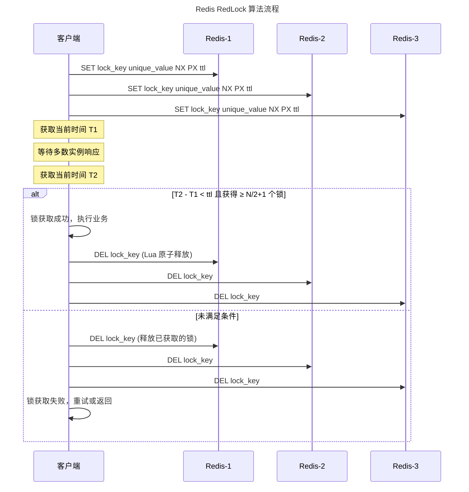
```mermaid
---
title: Redis RedLock 算法流程
---
sequenceDiagram
    participant C as 客户端
    participant R1 as Redis-1
    participant R2 as Redis-2
    participant R3 as Redis-3

    C->>R1: SET lock_key unique_value NX PX ttl
    C->>R2: SET lock_key unique_value NX PX ttl
    C->>R3: SET lock_key unique_value NX PX ttl

    Note over C: 获取当前时间 T1
    Note over C: 等待多数实例响应
    Note over C: 获取当前时间 T2

    alt T2 - T1 < ttl 且获得 ≥ N/2+1 个锁
        C->>C: 锁获取成功，执行业务
        C->>R1: DEL lock_key (Lua 原子释放)
        C->>R2: DEL lock_key
        C->>R3: DEL lock_key
    else 未满足条件
        C->>R1: DEL lock_key (释放已获取的锁)
        C->>R2: DEL lock_key
        C->>R3: DEL lock_key
        C->>C: 锁获取失败，重试或返回
    end
```

RedLock 通过多个独立 Redis 实例实现分布式互斥，需获得多数派（N/2+1）锁才算获取成功。

**RedLock 争议与注意事项**：
- Martin Kleppmann 指出 RedLock 在时钟跳变、进程暂停等场景下可能不安全
- Antirez 的反驳：多数场景下 RedLock 足够可靠，但需理解其边界
- **建议**：对正确性要求极高的场景（如金融），优先使用基于 Raft/Paxos 共识的分布式锁服务（如 etcd、ZooKeeper、Consul）

#### 4.5.2 基于 etcd 的分布式锁

etcd 基于 Raft 共识协议提供强一致性分布式锁，天然避免 RedLock 的时钟依赖问题：

```python
import etcd3

def acquire_idempotent_lock(key: str, ttl: int = 10) -> bool:
    client = etcd3.client()
    lock = client.lock(f"idempotent:{key}", ttl=ttl)
    acquired = lock.acquire(timeout=5)
    if acquired:
        try:
            execute_business_logic(key)
        finally:
            lock.release()
    return acquired
```

### 4.6 事件溯源 + CQRS

事件溯源（Event Sourcing）与 CQRS（Command Query Responsibility Segregation）为幂等提供了一种根本性的架构保障。

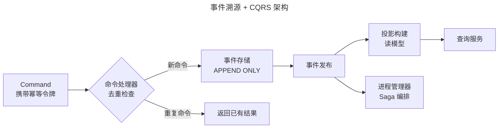
```mermaid
---
title: 事件溯源 + CQRS 架构
---
graph LR
    A[Command<br/>携带幂等令牌] --> B{命令处理器<br/>去重检查}
    B -->|新命令| C[事件存储<br/>APPEND ONLY]
    B -->|重复命令| D[返回已有结果]
    C --> E[事件发布]
    E --> F[投影构建<br/>读模型]
    E --> G[进程管理器<br/>Saga 编排]
    F --> H[查询服务]
```

事件溯源通过 APPEND ONLY 的事件存储与命令去重检查，从根本上保证同一命令只被处理一次。投影构建读模型，进程管理器编排 Saga，查询服务对外提供查询能力。

### 4.7 支付场景幂等实现

```sql
CREATE TABLE payment_transaction (
    id               BIGINT PRIMARY KEY AUTO_INCREMENT,
    idempotency_key  VARCHAR(128) NOT NULL UNIQUE,
    merchant_id      VARCHAR(64) NOT NULL,
    amount           DECIMAL(12, 2) NOT NULL,
    currency         CHAR(3) NOT NULL DEFAULT 'CNY',
    status           ENUM('PROCESSING', 'SUCCESS', 'FAILURE', 'REFUNDED') NOT NULL,
    channel          VARCHAR(32) NOT NULL,
    channel_tx_id    VARCHAR(128),
    created_at       TIMESTAMP DEFAULT CURRENT_TIMESTAMP,
    updated_at       TIMESTAMP DEFAULT CURRENT_TIMESTAMP ON UPDATE CURRENT_TIMESTAMP,
    INDEX idx_merchant (merchant_id),
    INDEX idx_status (status)
);
```

```java
public class PaymentService {

    private final PaymentTransactionRepository txRepo;
    private final PaymentChannelClient channelClient;

    public PaymentResult process(PaymentRequest request) {
        String idempotencyKey = request.getIdempotencyKey();

        PaymentTransaction existingTx = txRepo.findByIdempotencyKey(idempotencyKey);
        if (existingTx != null) {
            return handleExistingTransaction(existingTx);
        }

        PaymentTransaction tx = new PaymentTransaction();
        tx.setIdempotencyKey(idempotencyKey);
        tx.setAmount(request.getAmount());
        tx.setStatus(TransactionStatus.PROCESSING);

        try {
            txRepo.save(tx);
        } catch (DuplicateKeyException e) {
            PaymentTransaction concurrentTx = txRepo.findByIdempotencyKey(idempotencyKey);
            return handleExistingTransaction(concurrentTx);
        }

        try {
            ChannelResponse response = channelClient.charge(
                request.getChannel(), request.getAmount(), idempotencyKey
            );
            tx.setStatus(TransactionStatus.SUCCESS);
            tx.setChannelTxId(response.getTransactionId());
            txRepo.update(tx);
            return PaymentResult.success(tx);
        } catch (ChannelException e) {
            tx.setStatus(TransactionStatus.FAILURE);
            txRepo.update(tx);
            return PaymentResult.failure(e.getMessage());
        }
    }

    private PaymentResult handleExistingTransaction(PaymentTransaction tx) {
        return switch (tx.getStatus()) {
            case SUCCESS -> PaymentResult.success(tx);
            case FAILURE -> PaymentResult.failure("Previous attempt failed, retry allowed");
            case PROCESSING -> PaymentResult.conflict("Request is being processed");
            default -> PaymentResult.failure("Unknown status");
        };
    }
}
```

### 4.8 消息队列幂等实现

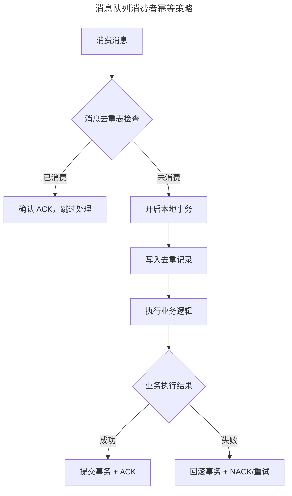
```mermaid
---
title: 消息队列消费者幂等策略
---
flowchart TD
    A[消费消息] --> B{消息去重表检查}
    B -->|已消费| C[确认 ACK，跳过处理]
    B -->|未消费| D[开启本地事务]
    D --> E[写入去重记录]
    E --> F[执行业务逻辑]
    F --> G{业务执行结果}
    G -->|成功| H[提交事务 + ACK]
    G -->|失败| I[回滚事务 + NACK/重试]
```

消费者幂等策略通过"去重记录写入 + 业务执行"在同一事务中完成，确保消息不丢失、不重复处理。

### 4.9 微服务链路中的多层幂等

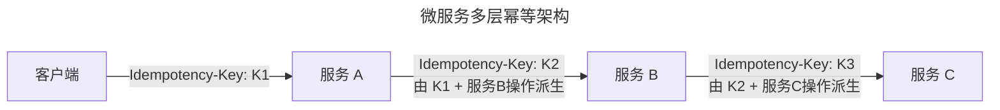
```mermaid
---
title: 微服务多层幂等架构
---
graph LR
    A[客户端] -->|Idempotency-Key: K1| B[服务 A]
    B -->|Idempotency-Key: K2<br/>由 K1 + 服务B操作派生| C[服务 B]
    C -->|Idempotency-Key: K3<br/>由 K2 + 服务C操作派生| D[服务 C]
```

**多层幂等设计原则**：
1. **令牌传递与派生**：下游服务的幂等令牌由上游令牌 + 下游操作标识确定性派生（如 `HMAC(K1, "service-B-operation")`）
2. **每层独立去重**：每个服务维护自身的幂等记录，不依赖上游或下游的去重能力
3. **响应缓存**：每层缓存已完成的响应，重试时直接返回
4. **超时与补偿**：任一层超时后，上游需根据下游状态决定重试或补偿

### 4.10 连接池配置

| 参数 | 说明 | 推荐值 |
|------|------|-------|
| `maximumPoolSize` | 最大连接数 | CPU 核心数 × 2 + 有效磁盘数 |
| `minimumIdle` | 最小空闲连接数 | 与 maximumPoolSize 相同（避免连接抖动） |
| `connectionTimeout` | 获取连接超时 | 30000ms |
| `idleTimeout` | 空闲连接超时 | 600000ms |
| `maxLifetime` | 连接最大生命周期 | 1800000ms（< 数据库 `wait_timeout`） |
| `leakDetectionThreshold` | 连接泄漏检测 | 60000ms |

### 4.11 慢查询诊断

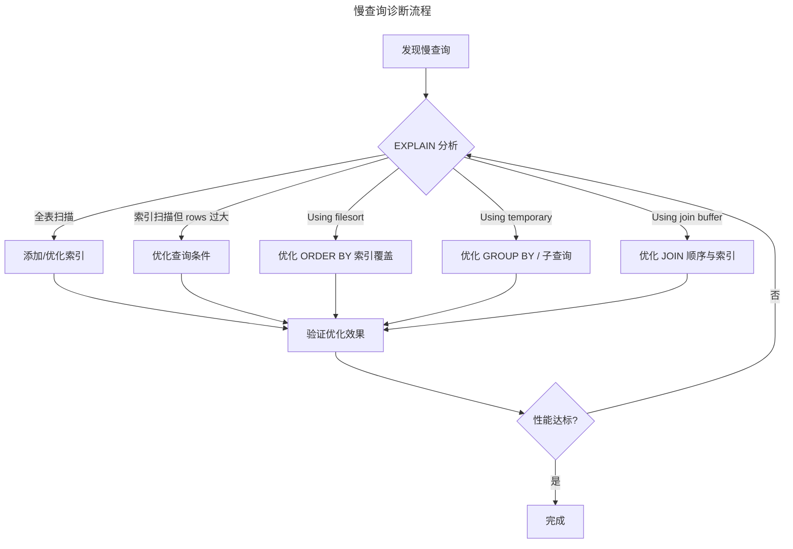
```mermaid
---
title: 慢查询诊断流程
---
flowchart TD
    A[发现慢查询] --> B{EXPLAIN 分析}
    B -->|全表扫描| C[添加/优化索引]
    B -->|索引扫描但 rows 过大| D[优化查询条件]
    B -->|Using filesort| E[优化 ORDER BY 索引覆盖]
    B -->|Using temporary| F[优化 GROUP BY / 子查询]
    B -->|Using join buffer| G[优化 JOIN 顺序与索引]
    C --> H[验证优化效果]
    D --> H
    E --> H
    F --> H
    G --> H
    H --> I{性能达标?}
    I -->|否| B
    I -->|是| J[完成]
```

**常用诊断工具**：

| 工具 | 用途 | 适用数据库 |
|------|------|-----------|
| `pt-query-digest` | 慢查询日志分析 | MySQL |
| `mysqldumpslow` | 慢查询摘要 | MySQL |
| `pg_stat_statements` | SQL 执行统计 | PostgreSQL |
| `Performance Schema` | 实时性能监控 | MySQL |
| `pgBadger` | 日志分析报告 | PostgreSQL |
| `Prometheus + Grafana` | 可视化监控 | 通用 |

### 4.12 唯一索引与 NULL 值陷阱

唯一索引保证列（或列组合）值的唯一性，但与 `NULL` 组合时存在语义陷阱：

**问题**：SQL 标准中 `NULL != NULL`，因此 `(X=1, Y=NULL)` 与 `(X=1, Y=NULL)` 被视为不同行，唯一约束不生效。

```sql
-- MySQL: 允许多条 (1, NULL)，唯一约束不阻止
CREATE TABLE orders (
    order_id INT PRIMARY KEY,
    user_id INT NOT NULL,
    coupon_code VARCHAR(32) NULL,
    UNIQUE KEY uk_user_coupon (user_id, coupon_code)
);

-- 插入以下数据均成功（不符合业务预期）
INSERT INTO orders VALUES (1, 100, NULL);
INSERT INTO orders VALUES (2, 100, NULL);  -- 预期失败，实际成功
```

**解决方案**：

```sql
-- 方案1：使用 Sentinel 值替代 NULL
ALTER TABLE orders MODIFY coupon_code VARCHAR(32) NOT NULL DEFAULT '';

-- 方案2：PostgreSQL 可使用部分索引（Partial Index）
CREATE UNIQUE INDEX uk_user_coupon ON orders (user_id, coupon_code)
    WHERE coupon_code IS NOT NULL;
```

---

## 5. 常见误区

### 5.1 数据库常见陷阱

| 陷阱 | 后果 | 解决方案 |
|------|------|---------|
| `SELECT *` | 无法利用覆盖索引，网络传输浪费 | 明确指定查询列 |
| 隐式类型转换 | 索引失效 | 确保查询参数类型与列定义一致 |
| `NULL` 与唯一索引 | 多个 `NULL` 不违反唯一约束 | 使用 Sentinel 值或 Partial Index |
| N+1 查询 | 大量小查询导致性能灾难 | 使用 JOIN / `IN` 批量查询 |
| 大事务 | 锁持有时间长、主从延迟增大 | 拆分为小事务 |
| 无限制的分页 | `OFFSET 1000000` 性能极差 | 游标分页（Cursor-based Pagination） |
| 忽略连接池配置 | 连接泄漏或连接风暴 | 合理配置并监控连接池 |
| DDL 直接执行 | 锁表导致服务不可用 | 使用 gh-ost / pt-online-schema-change |
| 主从切换误操作 | 数据丢失或脑裂 | 自动化切换 + 人工确认 + 半同步复制 |
| 过度索引 | 写入性能下降、存储浪费 | 定期审计索引使用情况 |

### 5.2 事务常见误用模式

| 误用模式 | 问题描述 | 正确做法 |
|---------|---------|---------|
| 事务过长 | 事务内包含复杂业务逻辑，持有锁时间长 | 事务内仅包含必要的数据库操作，缩短事务粒度 |
| 事务包含非 DB 操作 | 事务内发送邮件、调用外部 API | 先提交事务，再执行副作用操作；或使用 Outbox 模式 |
| 事务包含不可逆操作 | 事务回滚但消息已发送至队列 | 使用事务性 Outbox 或 Saga 模式 |
| 跨库事务 | 多数据库实例间的事务一致性无法保证 | 使用分布式事务（2PC/TCC）或最终一致性方案 |
| 嵌套事务 | 内层事务回滚导致外层事务状态不一致 | 避免嵌套事务，使用 Savepoint 管理部分回滚 |

### 5.3 幂等常见陷阱

#### 陷阱 1：令牌生成时机错误

```
❌ 错误：在重试时重新生成令牌
   请求1: POST /pay { idempotency_key: "abc" }  → 超时
   请求2: POST /pay { idempotency_key: "def" }  → 重复扣款

✅ 正确：令牌在首次请求时生成，重试复用同一令牌
   请求1: POST /pay { idempotency_key: "abc" }  → 超时
   请求2: POST /pay { idempotency_key: "abc" }  → 幂等命中
```

#### 陷阱 2：令牌被误删

数据库回滚（Rollback）可能导致已使用的令牌被删除，客户端无法感知该请求已被处理，从而生成新令牌重新提交。

**解决方案**：将幂等记录存储在独立于业务表的数据源中，或使用独立事务写入幂等记录。

#### 陷阱 3：竞争条件（Race Condition）

读检查（Check-before-Act）模式在并发场景下不可靠：

```
❌ 错误模式：
   if (!exists(key)) {        // 并发请求均通过此检查
       insert(key, data);     // 多个请求均插入成功
   }

✅ 正确模式：
   try {
       insert(key, data);     // 依赖唯一索引，重复插入抛异常
   } catch (DuplicateKeyException e) {
       return query(key);     // 幂等命中，返回已有结果
   }
```

#### 陷阱 4：PROCESSING 状态无超时处理

请求处于 PROCESSING 状态时，若服务崩溃，令牌将永久锁定。

**解决方案**：为 PROCESSING 状态设置超时阈值，超时后允许重新处理或标记为 FAILURE。

#### 陷阱 5：多层幂等漏洞

调用链中任一服务未实现幂等，整体幂等性即被破坏。需确保链路上所有服务均独立实现幂等机制。

#### 陷阱 6：幂等令牌与业务操作不在同一事务

```
❌ 错误：
   1. INSERT idempotency_record (key, PROCESSING)   -- 事务1
   2. 执行业务逻辑                                    -- 事务2
   3. UPDATE idempotency_record SET status=SUCCESS   -- 事务1

   若步骤2失败但步骤1已提交，令牌状态为 PROCESSING，后续重试可能被拒绝

✅ 正确：
   将幂等记录与业务操作放在同一事务中，或使用补偿机制清理 PROCESSING 状态
```

### 5.4 人为错误防护

| 错误类型 | 典型案例 | 防护措施 |
|---------|---------|---------|
| 误删数据 | `DELETE FROM users` 缺少 WHERE | 事务内先 SELECT 确认、开启安全更新模式 `sql_safe_updates=1` |
| DDL 锁表 | Online Schema Change 误操作 | 使用 gh-ost 工具、在低峰期执行 |
| 主从切换故障 | 拔错电源、脑裂 | 自动化故障转移（MHA / Orchestrator）、仲裁机制 |
| 程序全表扫描 | 无索引查询 + 并发 | 慢查询监控、代码审查、查询超时设置 |

---

## 6. 进阶延展

### 6.1 云原生数据库

云原生数据库以**存算分离**为核心架构，实现存储与计算的独立弹性伸缩：

- **AWS Aurora**：日志即数据库（Log is Database），计算节点共享分布式存储
- **阿里云 PolarDB**：基于 Shared-Storage 的存算分离，支持 Serverless 弹性
- **Google AlloyDB**：PostgreSQL 兼容，列存加速分析查询
- **Azure Database**：Flexible Server 模式，自动扩缩容

### 6.2 Serverless 数据库

Serverless 数据库按实际使用量计费，自动扩缩容至零，适用于间歇性工作负载：

| 产品 | 协议兼容 | 特点 |
|------|---------|------|
| PlanetScale | MySQL (Vitess) | 分支工作流、Schema 迁移 |
| Neon | PostgreSQL | 存算分离、分支、自动挂起 |
| Turso | libSQL | 边缘数据库、嵌入式副本 |
| CockroachDB Serverless | PostgreSQL | 全球分布、自动扩缩容 |

### 6.3 AI + 数据库

- **向量检索**：pgvector、Milvus、Weaviate 成为 LLM 应用的基础设施
- **AI 驱动优化**：数据库内置 AI 优化器（如 PostgreSQL 的 pg_qualstats + 自动索引建议）
- **自然语言查询**：Text-to-SQL（如 Snowflake Cortex、Databricks AI Functions）
- **自治数据库**：Oracle Autonomous Database、AWS Aurora 自适应优化
- **AI 辅助诊断**：基于 ML 的异常检测与根因分析

### 6.4 云原生环境下的幂等

Kubernetes 环境对幂等提出新的挑战与机遇：

| 挑战 | 说明 | 应对方案 |
|------|------|----------|
| Pod 随时被驱逐 | 请求处理中 Pod 可能被终止 | 优雅关闭（Graceful Shutdown）+ PROCESSING 超时机制 |
| 副本数动态伸缩 | 多副本并发处理相同请求 | 分布式幂等令牌存储（Redis/etcd） |
| 网络策略不稳定 | Service Mesh 中请求可能重试 | Istio 重试策略需配合服务端幂等 |
| 声明式 API | Kubernetes 本身依赖幂等（Desired State vs Actual State） | Controller 的 Reconcile 循环天然幂等 |

**Kubernetes Operator 幂等模式**：Kubernetes 的声明式 API 模型要求 Controller 的 Reconcile 逻辑必须幂等——无论 Reconcile 被触发多少次，最终状态都应与期望状态一致。

### 6.5 Serverless 环境下的幂等挑战

Serverless 架构（AWS Lambda、Azure Functions）的幂等面临特殊问题：冷启动、事件源重试、超时限制。

**AWS Lambda 幂等方案**：AWS 提供 `DynamoDB Conditional Write` 作为 Serverless 幂等的标准方案。

### 6.6 AI 辅助幂等检测

2025-2026 年，AI 辅助工具在幂等性领域开始发挥重要作用：

- **静态分析**：基于 LLM 的代码审查工具可自动识别非幂等的数据库操作模式
- **测试生成**：AI 可自动生成并发重试测试用例，验证幂等实现的正确性
- **架构审查**：AI 分析微服务调用链，识别链路中的幂等漏洞
- **混沌工程集成**：AI 驱动的混沌测试自动注入网络超时与重试，验证系统幂等韧性

### 6.7 幂等即服务（Idempotency as a Service）

越来越多的云平台和中间件开始提供内置幂等支持：

- **Stripe**：API 原生支持 `Idempotency-Key` 请求头
- **AWS**：DynamoDB Conditional Writes + TTL 原生支持幂等模式
- **Kafka**：Producer 端幂等（`enable.idempotence=true`）保证 Exactly-Once 语义
- **数据库**：PostgreSQL 的 `INSERT ... ON CONFLICT DO NOTHING` 原生幂等写入

### 6.8 其他趋势

| 趋势 | 说明 |
|------|------|
| HTAP 混合负载 | TiDB TiFlash、Oracle HeatWave、SingleStore 兼顾 OLTP 与 OLAP |
| 边缘数据库 | Turso/libSQL、Cloudflare D1 将数据推至边缘节点 |
| 隐私计算 | 数据库内置加密计算、可信执行环境（TEE） |
| 流式数据库 | RisingWave、Materialize 实时物化视图与流处理 |
| Rust 重写 | GreptimeDB（时序）、SurrealDB（多模）等新一代数据库采用 Rust 实现 |

### 6.9 延伸阅读

1. RFC 9110: HTTP Semantics. IETF, 2022. §9.2.2 Idempotent Methods
2. Kleppmann, M. *Designing Data-Intensive Applications*. O'Reilly, 2017. Chapter 9: Consistency and Consensus
3. Richardson, C. *Microservices Patterns*. Manning, 2018. Chapter 4: Managing Transactions with Sagas
4. AWS Architecture Blog: *Making retries safe with idempotent APIs*, 2023
5. Stripe API Reference: *Idempotent Requests*, 2024
6. Antirez. *Is Redlock safe?* Redis Blog, 2016
7. Kleppmann, M. *How to do distributed locking* (RedLock critique), 2016
8. ULID Specification: https://github.com/ulid/spec
9. Snowflake: *A Networked Service for Generating Unique IDs*, Twitter Engineering Blog, 2010
10. Vernon, V. *Implementing Domain-Driven Design*. Addison-Wesley, 2013. Chapter 8: Event Sourcing
11. [Uber Engineering: How We Saved 70K Cores Across 30 Mission-Critical Services](https://eng.uber.com/how-we-saved-70k-cores-across-30-mission-critical-services/)
12. [MySQL 8.0 Reference Manual](https://dev.mysql.com/doc/refman/8.0/en/)
13. [MySQL 9.x Release Notes](https://dev.mysql.com/doc/relnotes/mysql/9.0/en/)
14. [PostgreSQL 17 Release Notes](https://www.postgresql.org/docs/17/release.html)
15. [PostgreSQL 18 Beta Release Notes](https://www.postgresql.org/docs/18/release.html)
16. [TiDB Documentation](https://docs.pingcap.com/tidb/stable)
17. [CockroachDB Documentation](https://www.cockroachlabs.com/docs/)
18. [pgvector: Open-source vector similarity search for Postgres](https://github.com/pgvector/pgvector)
19. [Milvus Documentation](https://milvus.io/docs)
20. [Database Internals: A Deep Dive into How Distributed Data Systems Work](https://www.databass.dev/) — Alex Petrov

---

*本文档系统梳理了数据库与幂等性两大技术主题，适用于后端工程师、架构师与技术管理者。建议结合实际业务场景进行选型与设计实践。*
