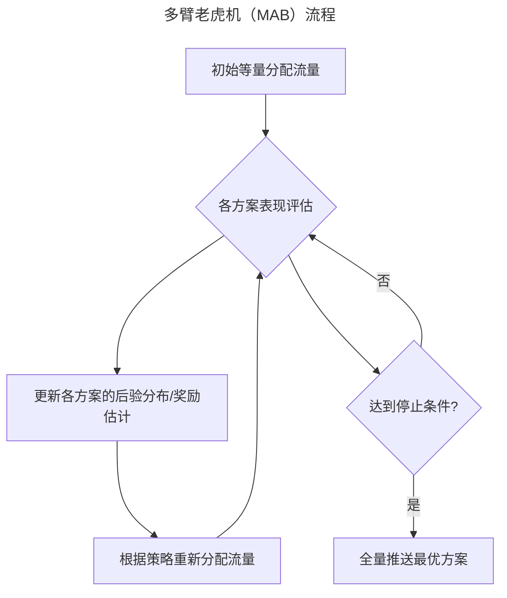
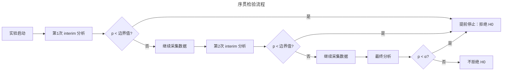
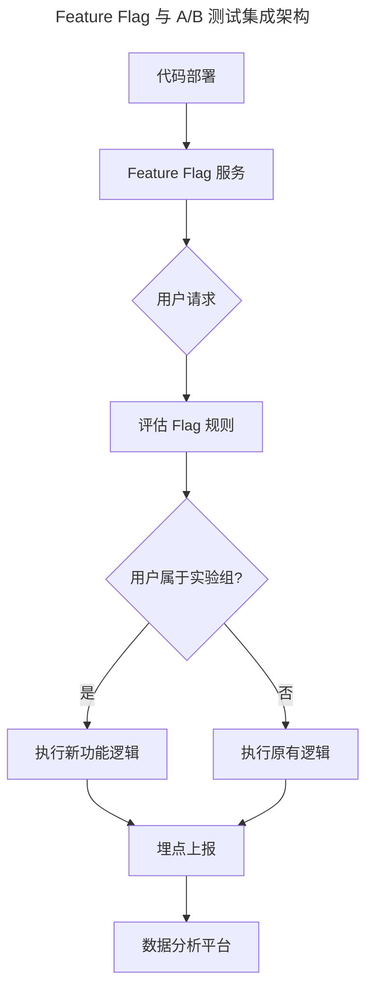
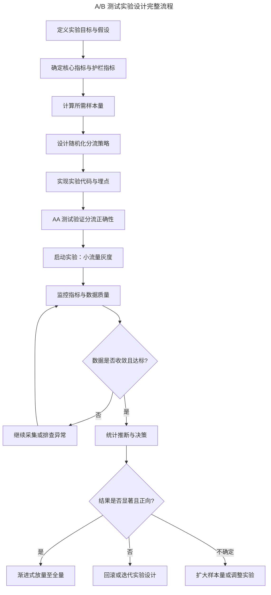
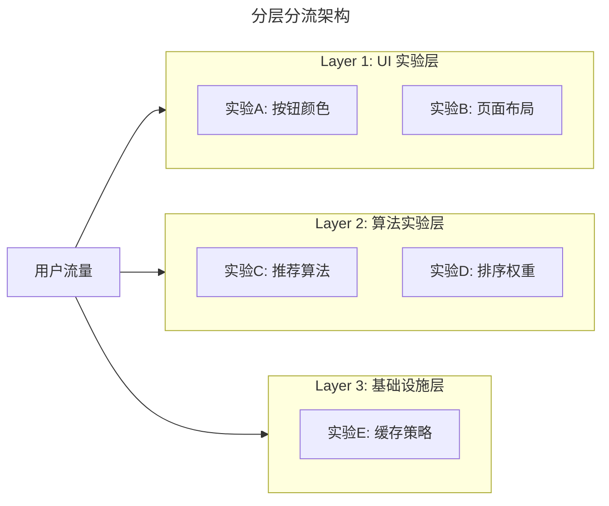
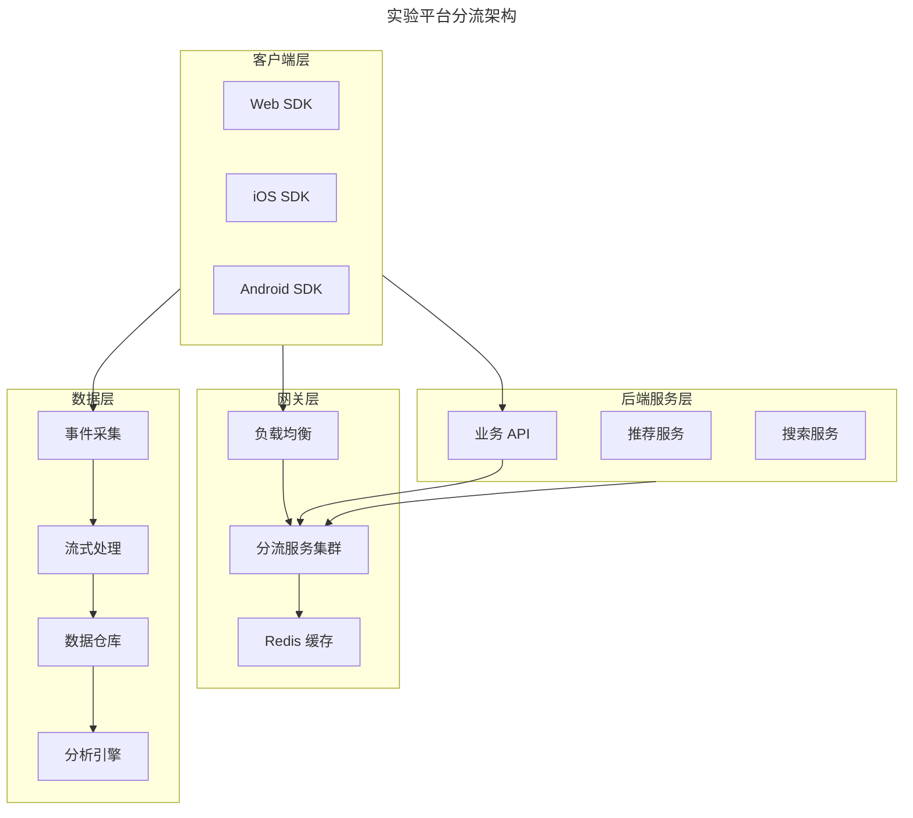
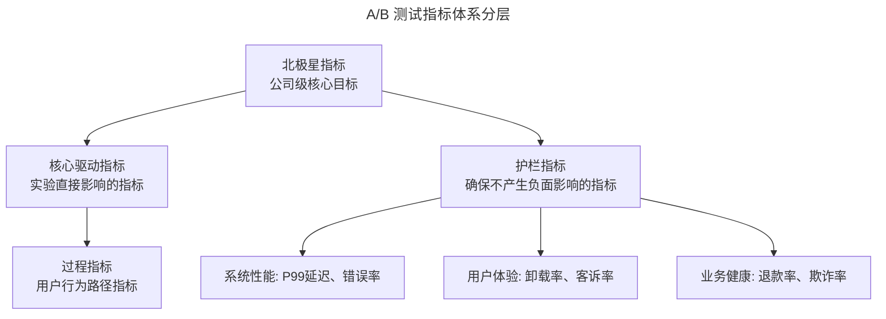
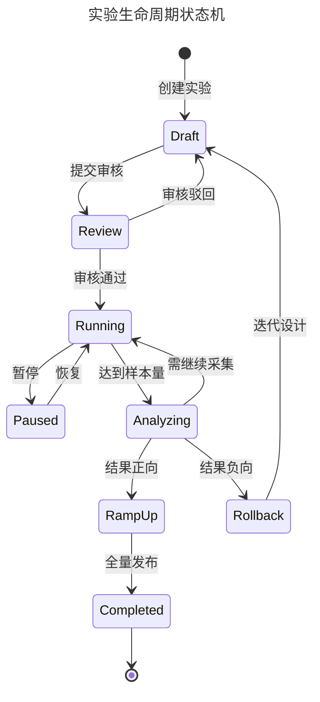
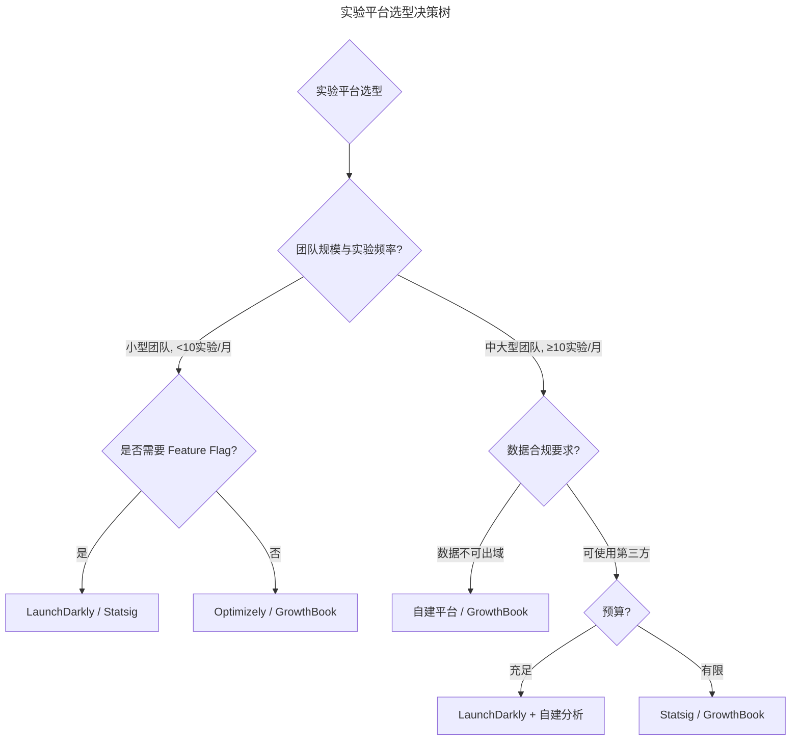

# A/B 测试：从统计原理到工程实践

> **适用范围**：后端工程师、数据工程师、产品工程师、算法工程师、增长团队成员，以及需要基于数据做决策的技术管理者。适用于产品设计、推荐系统、基础设施、营销增长、搜索质量等领域的在线实验设计与分析。
>
> **更新摘要（v2 · 2026-08 更新）**：
> - 结构化升级为 6 节骨架（导言 / 核心方法论 / 关键流程 / 工具与实战 / 常见误区 / 进阶延展）
> - 为全部 Mermaid 图补充 `--- title: ... ---` frontmatter，并在每张图后追加文字解读
> - 整合 2025-2026 年 AI 驱动实验优化、隐私保护实验设计、因果推断融合等趋势数据
> - 将原"参考资料"章节融入"进阶延展"，形成统一延伸阅读入口

---

## 1. 导言

### 1.1 定义

A/B 测试（A/B Testing），又称拆分测试（Split Testing）或受控实验（Controlled Experiment），是一种基于统计假设检验的在线实验方法。其核心机制是将用户流量通过随机化分流分配至两个或多个实验组，分别施加不同处理（Treatment），随后对关键指标进行统计推断，以确定处理效应是否具有统计显著性。

形式化表述：设对照组（Control Group）的指标期望为 $\mu_C$，实验组（Treatment Group）的指标期望为 $\mu_T$，A/B 测试的核心假设检验为：

$$H_0: \mu_T - \mu_C = 0 \quad \text{vs} \quad H_1: \mu_T - \mu_C \neq 0$$

### 1.2 Why：为什么需要 A/B 测试

A/B 测试已成为数据驱动决策的基石。Google、Meta、Microsoft、Netflix、Airbnb 等公司每年运行数万次在线实验。其核心价值在于：

- **消除直觉偏差**：人类认知存在确认偏误（Confirmation Bias），直觉判断的准确率远低于预期
- **量化因果效应**：与观察性研究不同，随机化分流确保了因果推断的内部效度
- **降低发布风险**：通过渐进式放量（Ramp-up）控制潜在负面影响
- **加速迭代周期**：Feature Flag 与 A/B 测试的集成使功能发布与代码部署解耦

### 1.3 应用场景

| 领域 | 典型场景 | 核心指标 |
|------|----------|----------|
| 产品设计 | UI 交互方案对比、页面布局优化 | 转化率（CVR）、点击率（CTR） |
| 推荐系统 | 排序算法迭代、特征工程变更 | 人均点击数、停留时长、GMV |
| 基础设施 | 缓存策略调整、数据库索引优化 | P99 延迟、错误率、吞吐量 |
| 营销增长 | 定价策略、推送策略、获客渠道 | ROI、留存率、LTV |
| 搜索质量 | 相关性模型调参、UI 改版 | NDCG@K、无结果率、翻页率 |

### 1.4 适用范围

本文覆盖从统计原理到工程平台的完整 A/B 测试体系，适用于初次接触实验文化的工程师，以及需要自建实验平台的技术团队。

---

## 2. 核心方法论

### 2.1 假设检验

假设检验是 A/B 测试的统计基础。其逻辑框架为：

1. 建立零假设 $H_0$（处理无效应）与备择假设 $H_1$（处理有效应）
2. 选择显著性水平 $\alpha$（通常取 0.05）
3. 计算检验统计量与 p 值
4. 若 $p < \alpha$，拒绝 $H_0$，认为处理效应显著

两类错误：

| 错误类型 | 定义 | 后果 |
|----------|------|------|
| 第一类错误（Type I, $\alpha$） | $H_0$ 为真时拒绝 $H_0$ | 上线实际无效的方案，浪费资源 |
| 第二类错误（Type II, $\beta$） | $H_0$ 为假时未拒绝 $H_0$ | 错失有效方案，损失收益 |

统计功效（Statistical Power）$= 1 - \beta$，表示当处理效应确实存在时，实验能正确检测到的概率。通常要求 Power $\geq 0.8$。

### 2.2 统计显著性

统计显著性（Statistical Significance）衡量观测到的效应是否不太可能由随机波动产生。当 p 值低于预设阈值 $\alpha$ 时，称结果具有统计显著性。

> **注意**：统计显著性 $\neq$ 实际显著性。一个极小的效应在大样本下也可能统计显著，但业务价值可能微不足道。

### 2.3 置信区间

置信区间（Confidence Interval, CI）提供了效应量的区间估计。95% 置信区间意味着：如果重复实验 100 次，约 95 次的区间会包含真实效应量。

$$CI = \hat{\Delta} \pm z_{\alpha/2} \cdot SE(\hat{\Delta})$$

其中 $\hat{\Delta}$ 为观测效应量，$SE$ 为标准误。置信区间比单一 p 值提供更丰富的信息——它同时反映了效应的方向、大小和精度。

### 2.4 p 值

p 值（p-value）是在零假设成立的前提下，观测到当前或更极端结果的概率。对 p 值的常见误读：

| 误读 | 正确理解 |
|------|----------|
| p = 0.03 意味着零假设为真的概率是 3% | p = 0.03 意味着如果零假设为真，观测到当前结果的概率为 3% |
| p 值衡量效应的大小 | p 值仅衡量反对零假设的证据强度，效应大小由效应量衡量 |
| p < 0.05 即可放心上线 | 还需评估效应量的业务意义、置信区间宽度等 |

### 2.5 效应量

效应量（Effect Size）量化了处理效应的实际大小，是统计显著性的必要补充。常用指标：

- **Cohen's d**：标准化均值差异，$d = (\mu_T - \mu_C) / \sigma_{pooled}$
- **相对提升（Relative Lift）**：$(\mu_T - \mu_C) / \mu_C$
- **绝对差异（Absolute Difference）**：$\mu_T - \mu_C$

| Cohen's d | 含义 |
|-----------|------|
| 0.2 | 小效应 |
| 0.5 | 中效应 |
| 0.8 | 大效应 |

### 2.6 频率学派 vs 贝叶斯学派

| 维度 | 频率学派（经典方法） | 贝叶斯学派 |
|------|----------------------|------------|
| 核心思想 | 概率是长期频率；参数为固定未知常量 | 概率是信念程度；参数为随机变量 |
| 结果表述 | p 值、置信区间 | 后验分布、可信区间、P(B > A) |
| 样本量 | 需预先确定，提前停止增加假阳性风险 | 可随时查看，自然支持序贯分析 |
| 可解释性 | p 值常被误读 | 后验概率直观可解释 |
| 计算复杂度 | 低（闭式解） | 较高（需数值积分或 MCMC） |

### 2.7 贝叶斯 A/B 测试

贝叶斯方法通过先验分布（Prior）与似然函数（Likelihood）推导后验分布（Posterior）：

$$Posterior \propto Likelihood \times Prior$$

对于转化率指标，通常采用 Beta-Binomial 共轭模型：

- 先验：$\theta \sim Beta(\alpha_0, \beta_0)$
- 观测数据：$k$ 次转化，$n$ 次曝光
- 后验：$\theta | data \sim Beta(\alpha_0 + k, \beta_0 + n - k)$

**决策依据**：
- **P(B > A)**：实验组优于对照组的后验概率。通常 $P(B > A) > 0.95$ 时判定实验组胜出
- **预期损失（Expected Loss）**：选择某方案时相对于最优方案的期望损失。当预期损失低于业务阈值时停止实验
- **可信区间（Credible Interval）**：后验分布的区间估计，可直接解读为"参数落在此区间的概率"

```python
import numpy as np
from scipy.stats import beta

def bayesian_ab_test(control_success, control_total, 
                     treatment_success, treatment_total,
                     prior_alpha=1, prior_beta=1,
                     n_samples=100000):
    control_posterior = beta.rvs(prior_alpha + control_success,
                                  prior_beta + control_total - control_success,
                                  size=n_samples)
    treatment_posterior = beta.rvs(prior_alpha + treatment_success,
                                    prior_beta + treatment_total - treatment_success,
                                    size=n_samples)
    prob_treatment_better = np.mean(treatment_posterior > control_posterior)
    expected_loss_control = np.mean(np.maximum(treatment_posterior - control_posterior, 0))
    expected_loss_treatment = np.mean(np.maximum(control_posterior - treatment_posterior, 0))
    
    return {
        "P(Treatment > Control)": prob_treatment_better,
        "Expected Loss (Control)": expected_loss_control,
        "Expected Loss (Treatment)": expected_loss_treatment,
    }
```

### 2.8 多臂老虎机（MAB）

MAB 算法在探索（Exploration）与利用（Exploitation）之间动态平衡，在实验过程中逐步将流量倾斜至表现更优的方案，减少实验期间的"遗憾"（Regret）。



MAB 通过动态流量分配实现"边实验边收益"，相比传统 A/B 测试减少了实验期间分配至次优方案的流量损失。

**常见 MAB 策略**：

| 策略 | 原理 | 优点 | 缺点 |
|------|------|------|------|
| $\varepsilon$-Greedy | 以 $\varepsilon$ 概率随机探索，$1-\varepsilon$ 概率选择当前最优 | 实现简单 | 探索效率低，$\varepsilon$ 需手动调参 |
| UCB (Upper Confidence Bound) | 选择置信上界最大的方案 | 自适应探索，理论保证 | 对非平稳环境敏感 |
| Thompson Sampling | 从后验分布采样，选择采样值最大的方案 | 贝叶斯最优，自适应 | 计算开销略高 |

**MAB vs 传统 A/B 测试**：

| 维度 | 传统 A/B 测试 | MAB |
|------|---------------|-----|
| 流量分配 | 固定比例 | 动态调整 |
| 实验期间收益 | 较低（固定分配至次优方案） | 较高（逐步收敛至最优） |
| 统计严谨性 | 高（严格的假设检验） | 较低（难以计算传统 p 值） |
| 适用场景 | 需严格统计结论的决策 | 快速优化、短期营销活动 |

### 2.9 序贯检验（Sequential Testing）

序贯检验允许在数据累积过程中多次查看结果而不膨胀假阳性率，解决了传统 A/B 测试"偷窥"（Peeking）问题。

**常用方法**：
- **O'Brien-Fleming 边界**：早期需要极强的证据才能提前停止，后期边界逐渐放宽
- **Alpha 消耗函数**（Alpha Spending Function）：将总 $\alpha$ 预算按时间分配至各次检验
- **Always-Valid p 值**：基于似然比构造，任意时刻查看均有效



序贯检验通过动态调整每次 interim 分析的显著性边界，确保多次查看不会膨胀整体假阳性率。图中展示了从实验启动到最终决策的完整流程。

### 2.10 Feature Flag 与 A/B 测试的集成

Feature Flag（特性标志）将功能发布与代码部署解耦，为 A/B 测试提供了天然的工程基础设施。



Feature Flag 服务的核心价值在于将"代码上线"与"功能对用户可见"解耦，使实验可以在不重新部署代码的情况下动态调整流量比例。

**Feature Flag 的核心能力**：

| 能力 | 说明 |
|------|------|
| 目标定向（Targeting） | 按用户属性、地域、设备等条件精确控制功能可见范围 |
| 渐进式发布（Progressive Delivery） | 从 1% → 5% → 25% → 50% → 100% 逐步放量 |
| 即时回滚（Kill Switch） | 发现问题时一键关闭，无需重新部署 |
| 实验集成 | Flag 的分流逻辑直接复用为实验分组机制 |

---

## 3. 关键流程

### 3.1 实验设计流程



该流程从"定义目标"到"全量发布"覆盖实验的完整生命周期。关键决策节点包括：AA 测试验证（分流正确性）、数据收敛判断（样本量与稳定性）、统计推断决策（显著性与业务意义）。

### 3.2 样本量计算

样本量是实验设计的核心参数，直接影响统计功效和实验周期。对于两比例检验（如转化率对比），所需样本量公式为：

$$n = \frac{(z_{\alpha/2} + z_{\beta})^2 \cdot [p_C(1-p_C) + p_T(1-p_T)]}{(p_T - p_C)^2}$$

其中 $p_C$ 为对照组转化率，$p_T$ 为实验组预期转化率，$p_T - p_C$ 为最小可检测效应（MDE, Minimum Detectable Effect）。

**关键决策**：

| 参数 | 影响 | 典型取值 |
|------|------|----------|
| $\alpha$ | 越小，所需样本越大 | 0.05（标准）、0.025（严格） |
| Power ($1-\beta$) | 越大，所需样本越大 | 0.8（标准）、0.9（严格） |
| MDE | 越小，所需样本越大 | 业务决定，通常为基线的 1%-5% |

**实践建议**：MDE 的设定应基于业务价值评估——若 1% 的提升带来的收益足以覆盖开发成本，则 MDE 可设为 1%；否则应适当放宽。

### 3.3 随机化分流

随机化是 A/B 测试因果推断的基石。分流策略决定了用户如何被分配至实验组。

#### 3.3.1 分流哈希

通常对用户标识（如 user_id、device_id）进行哈希取模分流：

```python
import hashlib

def get_experiment_group(user_id: str, experiment_id: str, num_groups: int = 2) -> str:
    hash_input = f"{experiment_id}:{user_id}"
    hash_val = int(hashlib.md5(hash_input.encode()).hexdigest(), 16)
    bucket = hash_val % (num_groups * 1000)
    if bucket < 500:
        return "control"
    else:
        return "treatment"
```

#### 3.3.2 分流层级（Layer）

为支持多实验并行且互不干扰，现代实验平台采用分层分流架构：



分层架构的核心思想是：每层使用独立的哈希盐值（Salt），同一层内实验互斥，不同层间实验正交。这确保了互斥性（同一用户不会同时进入同一层的两个实验）与正交性（不同层的实验分配相互独立，避免交互效应）。

#### 3.3.3 AA 测试

在正式实验前，应先运行 AA 测试（两组均施加相同处理），验证：

1. 分流是否均匀（各组样本量比例符合预期）
2. 指标基线是否一致（各组核心指标无显著差异）
3. 假阳性率是否在 $\alpha$ 水平附近

若 AA 测试出现显著差异，说明分流机制或数据管道存在系统性偏差，必须排查后方可启动正式实验。

### 3.4 实验周期确定

实验运行时长需综合考虑：

- **样本量需求**：达到目标样本量所需的最短天数
- **周期效应**：用户行为在工作日与周末、不同时段存在差异，通常需覆盖完整周期（至少 7 天）
- **新奇效应（Novelty Effect）**：新功能上线初期的用户好奇心会导致短期指标偏高，需等待效应消退
- **首日效应（First-Day Effect）**：新用户与老用户对新功能的反应不同，需确保样本中包含足够的老用户

### 3.5 分流架构

现代实验平台的分流架构需满足高可用、低延迟、一致性三个核心要求。



分流架构分为四层：客户端 SDK 负责本地分流决策，网关层提供集中式分流服务与缓存，后端服务按需调用分流服务，数据层负责事件采集与分析。这种分层设计兼顾了低延迟（本地缓存）与一致性（集中式配置）。

**分流服务设计要点**：
- **确定性分流**：同一用户多次请求必须返回同一分组结果
- **低延迟**：分流决策通常要求 < 5ms，需本地缓存 + 远程同步
- **高可用**：分流服务故障时降级为默认分组，不可阻塞主业务流程
- **实时配置**：实验配置变更需在秒级生效

### 3.6 指标体系

A/B 测试的指标体系应分层设计：



指标体系以北极星指标为顶层目标，向下分解为核心驱动指标与过程指标，同时设置护栏指标确保实验不产生负面影响。护栏指标即使核心指标正向，若显著恶化也应终止实验。

**指标设计原则**：
- **灵敏度（Sensitivity）**：指标应能灵敏反映处理效应。例如"7日留存"比"30日留存"灵敏度更高
- **鲁棒性（Robustness）**：指标不应受无关因素过度干扰
- **可解释性**：指标变化应能追溯到具体的用户行为变化
- **护栏机制**：任何实验都必须监控护栏指标

### 3.7 实验生命周期管理



状态机定义了实验从创建到完成的全生命周期：Draft → Review → Running → Analyzing → RampUp/Rollback → Completed。每个状态转换都有明确的触发条件，确保实验流程可治理、可审计。

---

## 4. 工具与实战

### 4.1 数据埋点

数据埋点是 A/B 测试的数据基础，其质量直接决定分析结论的可靠性。

#### 4.1.1 埋点类型

| 类型 | 实现方式 | 优势 | 劣势 |
|------|----------|------|------|
| 代码埋点 | 在业务逻辑中显式调用 SDK 上报 | 精确控制、数据丰富 | 开发成本高、需发版 |
| 声明式埋点 | 在 UI 模板中声明式配置事件 | 开发成本低、可配置 | 灵活性受限 |
| 无埋点（全埋点） | SDK 自动采集所有用户交互 | 零开发成本、覆盖全面 | 数据量大、噪声多、难以关联业务语义 |

#### 4.1.2 事件模型

推荐采用事件-属性模型：

```
Event {
    event_name:    String       // 事件名称，如 "click_checkout"
    event_time:    Timestamp    // 事件时间戳
    user_id:       String       // 用户标识
    device_id:     String       // 设备标识
    experiment_id: String       // 实验标识
    group_id:      String       // 分组标识
    properties: {               // 事件属性
        page:        String,
        element:     String,
        load_time_ms: Integer,
        ...
    }
}
```

#### 4.1.3 数据质量校验

| 校验项 | 方法 |
|--------|------|
| 事件完整性 | 对比服务端日志与客户端上报的事件数量差异 |
| 分流一致性 | 校验同一 user_id 在不同事件中的 group_id 是否一致 |
| 时间戳合理性 | 检测未来时间、过大延迟、时钟偏移 |
| 异常值检测 | 对关键指标进行分位数监控，识别异常波动 |

### 4.2 实验平台搭建

#### 4.2.1 核心模块

| 模块 | 职责 |
|------|------|
| 实验管理台 | 实验创建、配置、生命周期管理 |
| 分流引擎 | 确定性分流、层级管理、互斥组管理 |
| 事件采集 | 多端 SDK、数据校验、实时传输 |
| 数据计算 | 指标计算、统计检验、置信区间 |
| 报告看板 | 实验结果可视化、多维下钻、自动决策建议 |
| 告警系统 | 数据异常告警、护栏指标越限告警 |

### 4.3 商业平台对比

| 维度 | LaunchDarkly | Statsig | Optimizely | 自建平台 |
|------|-------------|---------|------------|----------|
| 核心定位 | Feature Flag 平台，实验为附加能力 | 实验优先，集成 Feature Flag | 完整实验平台，侧重营销优化 | 完全定制 |
| Feature Flag | ★★★★★ | ★★★★ | ★★★ | 按需实现 |
| 实验统计 | 频率学派 + 序贯检验 | 频率学派 + 贝叶斯 + MAB | 频率学派 + 贝叶斯 | 自由选择 |
| 分流能力 | 多层正交、目标定向 | 分层实验、互斥组 | 受众定向、分层 | 完全定制 |
| 数据集成 | 第三方分析集成 | 内置分析引擎 | 内置分析 + 第三方 | 深度定制 |
| 实时性 | 秒级配置生效 | 实时指标 | 近实时 | 取决于架构 |
| 适用规模 | 中大型企业 | 中小型至大型 | 中小型至大型 | 大规模、复杂场景 |
| 成本 | 较高（按 MAU 计费） | 中等 | 较高 | 前期投入大，边际成本低 |
| 数据主权 | 数据经第三方 | 数据经第三方 | 数据经第三方 | 完全自主 |

### 4.4 开源方案

| 项目 | 语言 | 特点 |
|------|------|------|
| GrowthBook | TypeScript/Python | 开源 Feature Flag + A/B 测试，支持贝叶斯与频率学派，可对接自有数据仓库 |
| Unleash | TypeScript | 开源 Feature Flag 服务，企业级特性，实验能力需扩展 |
| Wasabi | Java | Intuit 开源的 A/B 测试平台，完整实验生命周期管理 |
| A/Bingo | Ruby | 轻量级 A/B 测试框架 |
| PlanOut | Python | Facebook 开源的实验设计语言与框架 |

### 4.5 选型建议



选型决策树以"团队规模与实验频率"为第一分流点，再结合"Feature Flag 需求"与"数据合规要求"进一步细分到具体方案。

---

## 5. 常见误区

### 5.1 实验设计阶段误区

| 陷阱 | 描述 | 规避方法 |
|------|------|----------|
| **偷窥问题** | 多次查看 p 值并在显著时停止，导致假阳性率膨胀 | 使用序贯检验或严格遵守预设样本量 |
| **新奇效应** | 新功能因新鲜感获得短期提升，长期回归基线 | 延长实验周期，关注长期指标趋势 |
| **选择偏误** | 按时间/地域等非随机因素分流，引入混杂变量 | 使用基于用户 ID 的哈希分流 |
| **辛普森悖论** | 整体趋势与分组趋势相反 | 多维下钻分析，检查各子群体结果一致性 |
| **多比较问题** | 同时检验多个指标或维度，假阳性率膨胀 | Bonferroni 校正、FDR 控制或分层检验 |
| **样本量不足** | 实验未达到所需样本量即得出结论 | 严格按计算结果运行至足够样本量 |
| **实验污染** | 并行实验间流量重叠导致交互效应 | 正交分层设计、互斥组管理 |
| **幸存者偏差** | 仅分析完成实验的用户，忽略中途流失者 | 意向处理分析（Intention-to-Treat, ITT） |
| **局部推广谬误** | 将某客户端/群体的结论推广至全体 | 分客户端独立分析，谨慎跨群体推广 |

### 5.2 实验运行阶段避坑

- **避免偷窥（Peeking）**：传统频率学派方法下，在达到预设样本量前不应查看结果并做决策。若需提前查看，应使用序贯检验
- **监控数据质量**：实时监控事件上报量、分流比例、指标分布，及时发现埋点异常或分流故障
- **关注指标收敛性**：效应趋势应逐步收敛而非持续波动。若指标来回震荡，可能存在外部干扰或新奇效应
- **隔离外部干扰**：促销活动、节假日、系统故障等外部事件可能污染实验数据，需在分析中排除或标记

### 5.3 实验分析阶段避坑

- **多维下钻分析**：按客户端（Web/iOS/Android）、用户群（新/老）、地域等维度拆解结果，避免整体正向但局部恶化的情况
- **效应量优先于 p 值**：统计显著不等于业务显著，始终评估效应量的实际业务价值
- **为每个结果寻求合理解释**：无法解释的"好结果"可能是 Bug。若结果远超预期，优先排查数据质量与实验实现
- **实验间交互效应**：并行实验可能存在交互，需通过互斥组或正交层设计规避

### 5.4 实验迭代阶段避坑

- **版本化管理**：实验配置、代码变更均需版本控制，便于回溯与迭代
- **必要时重新设计**：若发现实验设计缺陷或实现 Bug，应果断终止并重新设计，而非在存在缺陷的数据上强行分析
- **知识沉淀**：将实验假设、结果、结论文档化，构建组织级实验知识库

---

## 6. 进阶延展

### 6.1 AI 驱动的实验优化

- **自动化假设生成**：基于 LLM 分析用户反馈与行为数据，自动生成实验假设
- **智能 MDE 推荐**：基于历史实验数据与业务价值模型，自动推荐合理的 MDE
- **异常自动诊断**：利用异常检测算法自动识别实验数据中的异常模式并归因

### 6.2 自动化实验平台

- **Auto-Experiment**：从假设生成、实验设计、流量分配到结果分析的全流程自动化
- **智能放量决策**：基于贝叶斯后验与业务规则，自动决定是否放量、回滚或继续实验
- **跨实验优化**：在多实验并行场景下，全局优化流量分配以最大化总体收益

### 6.3 隐私保护下的实验设计

随着 GDPR、CCPA、DPDP 等隐私法规的趋严，以及浏览器第三方 Cookie 的逐步淘汰，传统实验方法面临挑战：

| 技术方向 | 原理 | 进展 |
|----------|------|------|
| 差分隐私（Differential Privacy） | 在统计结果中注入可控噪声，保护个体隐私 | Apple/Google 已在生产环境部署 |
| 联邦学习（Federated Learning） | 在端侧计算指标，仅上传聚合结果 | 适用于移动端实验 |
| 隐私预算管理 | 限制每次实验消耗的隐私预算（$\varepsilon$），控制累积隐私损失 | 需与实验平台深度集成 |
| 一方数据增强 | 依赖第一方数据（登录用户）替代第三方 Cookie | 需调整分流与归因策略 |

### 6.4 因果推断与 A/B 测试的融合

在无法进行随机实验的场景（如定价策略、政策变更），观察性因果推断方法日益重要：

- **双重差分（DID, Difference-in-Differences）**：利用时间趋势与组间差异估计因果效应
- **合成控制法（Synthetic Control）**：构造对照组的合成版本进行反事实推断
- **工具变量（IV, Instrumental Variables）**：利用外生变量识别因果效应
- **回归不连续设计（RDD, Regression Discontinuity Design）**：利用阈值分配机制进行局部因果推断

### 6.5 延伸阅读

**经典文献**：
1. Kohavi, R., Tang, D., & Xu, Y. (2020). *Trustworthy Online Controlled Experiments: A Practical Guide to A/B Testing*. Cambridge University Press.
2. Deng, A., et al. (2013). "Improving the Sensitivity of Online Controlled Experiments by Utilizing Pre-Experiment Data." *WSDM*.
3. Howard, S. R., et al. (2021). "Time-uniform, Nonparametric, Nonasymptotic Confidence Sequences." *Annals of Statistics*.

**行业实践**：
4. Kohavi, R., Longbotham, R., Sommerfield, D., & Henne, R. M. (2010). "Overlapping Experiment Infrastructure: More, Better, Faster Experimentation." *KDD*.
5. Netflix. (2024). "Interleaving: A More Powerful A/B Test for Ranking." Netflix TechBlog.
6. Microsoft. (2024). "ExP: Experimentation Platform at Microsoft." Microsoft Research.

**工具文档**：
7. LaunchDarkly Documentation. https://docs.launchdarkly.com
8. Statsig Documentation. https://docs.statsig.com
9. Optimizely Developer Documentation. https://docs.developers.optimizely.com
10. GrowthBook Documentation. https://docs.growthbook.io

**统计学基础**：
11. Casella, G., & Berger, R. L. (2002). *Statistical Inference* (2nd ed.). Duxbury.
12. Gelman, A., et al. (2013). *Bayesian Data Analysis* (3rd ed.). CRC Press.
13. Scott, S. L. (2010). "A Modern Bayesian Look at the Multi-armed Bandit." *Applied Stochastic Models in Business and Industry*.

---

*本文档系统梳理了 A/B 测试的统计原理与工程实践，适用于工程师、产品经理与数据分析师。建议结合实际业务场景建立实验文化，持续迭代实验方法论。*
