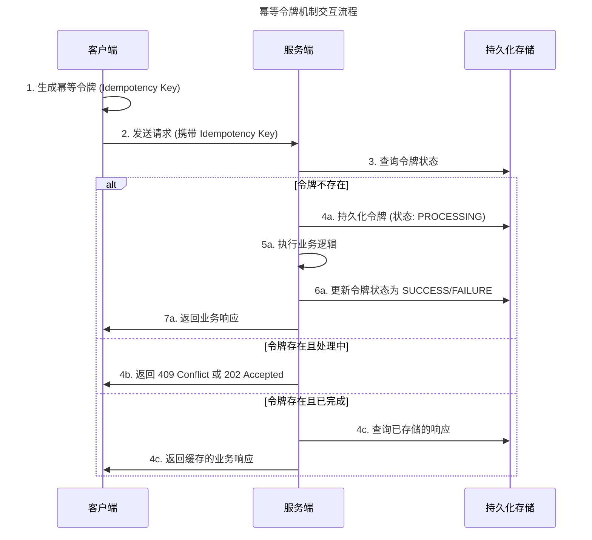
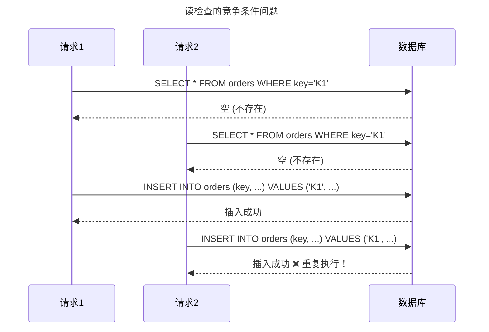
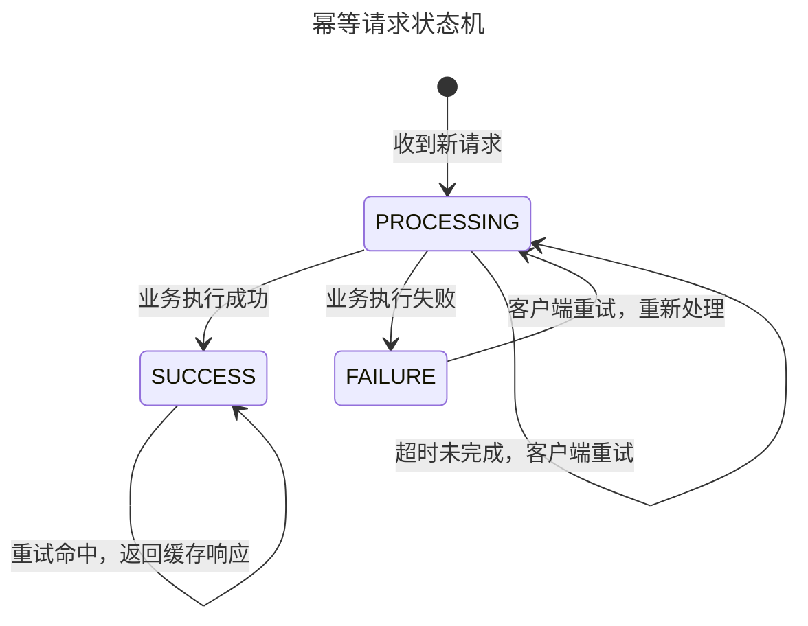
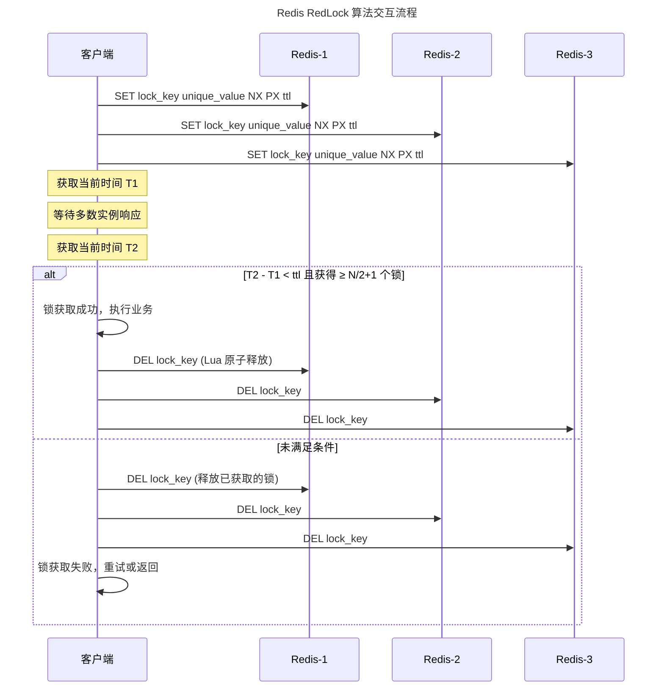
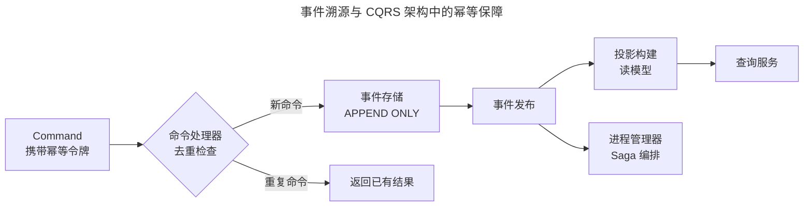
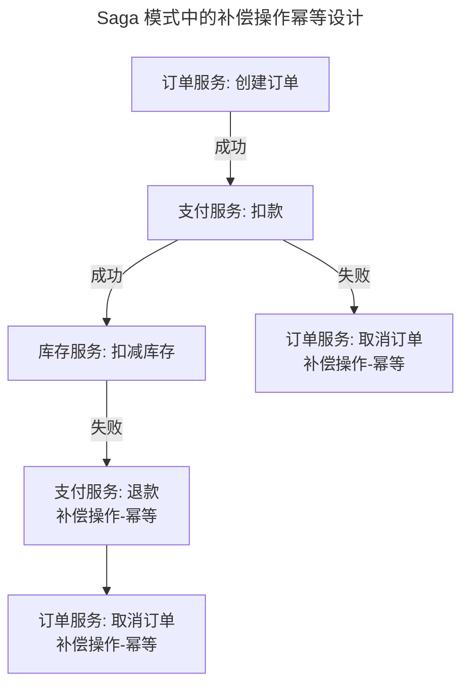
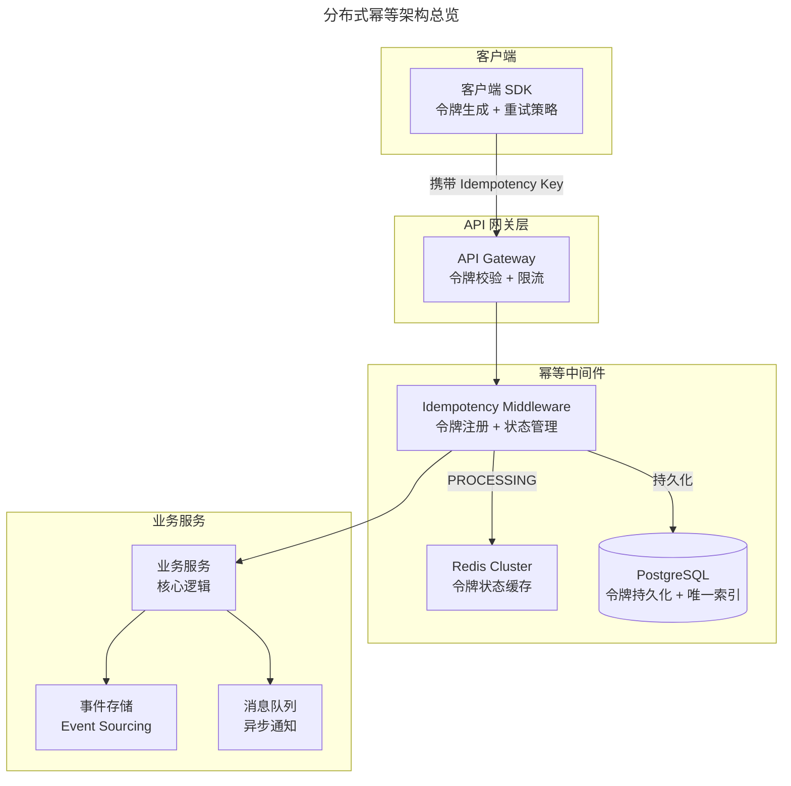
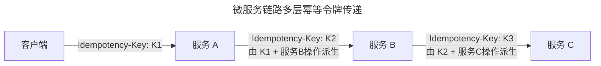
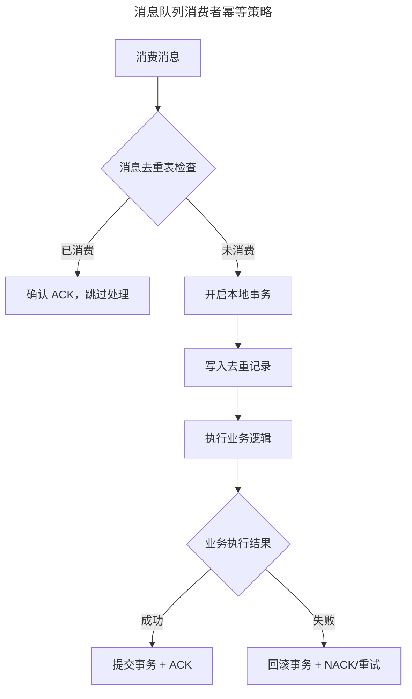

# 幂等性（Idempotency）：从理论到分布式系统实践

> **适用范围**：后端工程师、分布式系统工程师、支付/金融系统开发者、API 设计者、DevOps/SRE 工程师，以及需要保障数据一致性的技术架构师。适用于 API 设计、支付系统、消息队列、微服务调用链、Serverless、Kubernetes Operator 等场景的幂等性设计与实现。
>
> **更新摘要（v2 · 2026-08 更新）**：
> - 结构化升级为 6 节骨架（导言 / 核心方法论 / 关键流程 / 工具与实战 / 常见误区 / 进阶延展）
> - 为全部 Mermaid 图补充 `--- title: ... ---` frontmatter，并在每张图后追加文字解读
> - 整合 2025-2026 年云原生幂等、Serverless 幂等、AI 辅助幂等检测、幂等即服务等趋势数据
> - 将原"参考资料"章节融入"进阶延展"，形成统一延伸阅读入口

## 1. 导言

幂等性（Idempotency）是指一个操作在任意多次执行后所产生的系统状态与副作用，均与一次执行完全相同。数学形式化表达：

$$f(f(x)) = f(x), \quad \forall x$$

在现代软件架构中，幂等性至关重要。网络不可靠环境下，客户端需要安全重试而不产生副作用；分布式系统中，重复操作可能导致数据不一致；RESTful API 规范中，幂等性是 HTTP 方法语义的核心组成部分；手动重试、自动故障转移、消息重投递等运维场景下，幂等性是保障系统正确性的最后一道防线。

然而，幂等是一个**语义范畴**（Semantic Category）对行为结果的定义——它描述的是"结果应该怎样"，而非"代码应该怎么写"。将语义目标转化为**语法保证**（Syntactic Guarantee）需要严谨的工程设计：幂等令牌、唯一性约束、去重机制等规则缺一不可。任何单一环节的设计缺陷或实现 Bug，都可能导致幂等语义被破坏，引发重复扣款、重复发货、重复通知等严重业务事故。

本文从幂等性的基本定义出发，系统阐述技术原理、分布式实现、工程实践、常见陷阱与前沿趋势，为工程师提供一套完整的幂等设计方法论。

## 2. 核心方法论

### 2.1 幂等性分类

#### 强幂等 vs 弱幂等

| 类型 | 定义 | 响应要求 | 适用场景 |
|------|------|----------|----------|
| **强幂等** | 多次执行后系统状态与副作用均与一次执行相同，且响应内容一致 | 响应体必须相同 | 支付结算、资金转账 |
| **弱幂等** | 多次执行后系统状态与一次执行相同，但响应内容可不同 | 状态一致即可，响应可携带差异信息 | 状态查询、日志写入 |

#### 自然幂等 vs 设计幂等

- **自然幂等（Natural Idempotency）**：操作本身具有幂等语义，无需额外机制保证
  - 绝对值运算：`abs(abs(x)) = abs(x)`
  - 赋值操作：`x = 5` 执行多次结果不变
  - HTTP GET：纯读取操作天然幂等

- **设计幂等（Designed Idempotency）**：操作本身非幂等，需通过工程手段实现
  - 账户扣款：`balance -= 100` 多次执行结果不同，需幂等设计
  - 消息发送：重复发送产生多条记录，需去重机制

### 2.2 HTTP 语义中的幂等

RFC 9110 对 HTTP 方法的幂等性有明确定义：

| HTTP 方法 | 幂等性 | 安全性 | 语义说明 |
|-----------|--------|--------|----------|
| GET | ✅ 幂等 | ✅ 安全 | 资源表示获取，不应产生副作用 |
| PUT | ✅ 幂等 | ❌ 不安全 | 全量替换目标资源，多次执行结果一致 |
| DELETE | ✅ 幂等 | ❌ 不安全 | 删除目标资源，已删除后再次删除状态不变 |
| POST | ❌ 非幂等 | ❌ 不安全 | 创建子资源或触发处理，每次可能产生不同结果 |
| PATCH | ⚠️ 视实现而定 | ❌ 不安全 | 部分更新，若为绝对值替换则幂等，相对值增量则非幂等 |

> **关键区分**：HTTP 幂等性是服务器端语义承诺，而非协议层强制保证。开发者需自行在服务端实现幂等逻辑。

### 2.3 幂等令牌机制（Idempotency Key）

幂等令牌是客户端与服务端识别同一请求（或同一请求的多次重试）的唯一标识。其工作机制如下：



该时序图展示了幂等令牌的三条分支路径：首次请求（令牌不存在）时持久化令牌并执行业务逻辑；请求处理中（令牌存在且状态为 PROCESSING）时返回 409 或 202；请求已完成（令牌存在且状态为 SUCCESS/FAILURE）时直接返回缓存的响应。这种三分支设计确保了无论请求被重试多少次，业务逻辑仅执行一次，且客户端总能获得一致的响应。

**令牌生成协议要点**：

- 令牌由客户端生成，确保重试时携带相同令牌
- 令牌需具备全局唯一性（跨客户端、跨时间）
- 令牌的生命周期需与业务语义绑定，而非与单次 HTTP 请求绑定

### 2.4 唯一性保证（Uniqueness Guarantee）

服务端需确保同一幂等令牌对应的业务操作仅被执行一次。核心实现方式是数据库唯一索引（UNIQUE INDEX），利用数据库的约束机制防止重复写入：

```sql
CREATE TABLE idempotency_record (
    idempotency_key VARCHAR(128) PRIMARY KEY,
    request_hash    VARCHAR(256) NOT NULL,
    status          ENUM('PROCESSING', 'SUCCESS', 'FAILURE') NOT NULL,
    response_data   JSON,
    created_at      TIMESTAMP DEFAULT CURRENT_TIMESTAMP,
    updated_at      TIMESTAMP DEFAULT CURRENT_TIMESTAMP ON UPDATE CURRENT_TIMESTAMP
);

-- 业务表中嵌入幂等令牌作为唯一约束
CREATE TABLE payment_order (
    order_id        BIGINT PRIMARY KEY AUTO_INCREMENT,
    idempotency_key VARCHAR(128) NOT NULL UNIQUE,
    amount          DECIMAL(12, 2) NOT NULL,
    status          ENUM('PENDING', 'PAID', 'FAILED') NOT NULL,
    created_at      TIMESTAMP DEFAULT CURRENT_TIMESTAMP
);
```

#### 为什么读检查（Read-then-Write）不可靠



该图揭示了"先查后做"模式的致命缺陷：两个并发请求同时查询令牌是否存在，均得到"不存在"的结果，随后各自插入，导致重复。唯一索引通过数据库的原子性约束从根本上解决此问题——第二个插入会被数据库拒绝并抛出 DuplicateKeyException。

### 2.5 去重机制（Deduplication）

去重是幂等实现的核心手段，根据检测时机分为两类：

| 类型 | 机制 | 优点 | 缺点 |
|------|------|------|------|
| **先查后做（Check-before-Act）** | 执行前查询令牌是否存在 | 实现简单 | 存在竞争条件，需配合锁 |
| **先做后判（Act-then-Check）** | 依赖唯一索引约束，插入失败即去重 | 原子性强，无竞争 | 需处理插入异常逻辑 |

**推荐方案**：先做后判 + 唯一索引，将并发控制交由数据库事务保证。

### 2.6 请求状态机

幂等系统需对每个请求的令牌维护明确的状态机：



状态机定义了幂等令牌的完整生命周期：新请求进入 PROCESSING 状态，业务执行成功转为 SUCCESS，失败转为 FAILURE。SUCCESS 状态下的重试直接返回缓存响应；FAILURE 状态允许客户端重新处理；PROCESSING 状态的超时处理是关键设计点——若无超时机制，服务崩溃后令牌将永久锁定。

状态转换规则：

- **PROCESSING → SUCCESS**：业务逻辑执行成功，持久化响应结果
- **PROCESSING → FAILURE**：业务逻辑执行失败，允许客户端重试
- **SUCCESS → SUCCESS**：幂等命中，直接返回缓存的响应
- **PROCESSING（持续中）**：客户端重试时，返回 `409 Conflict` 或 `202 Accepted`，表示请求正在处理

## 3. 关键流程

### 3.1 分布式唯一 ID 生成

幂等令牌的全局唯一性是幂等机制的前提。在分布式环境下，需依赖分布式唯一 ID 生成方案：

#### Snowflake（雪花算法）

Twitter 提出的 64 位分布式 ID 生成方案：

```
| 1 bit | 41 bits          | 10 bits     | 12 bits       |
| 符号位 | 时间戳（毫秒级）   | 工作节点 ID  | 序列号         |
```

| 特性 | 说明 |
|------|------|
| 时间有序 | ID 按时间递增，便于索引 |
| 去中心化 | 各节点独立生成，无单点依赖 |
| 时钟回拨风险 | NTP 同步可能导致 ID 重复，需时钟回拨检测与处理 |
| 容量 | 每节点每毫秒 4096 个 ID |

#### ULID（Universally Unique Lexicographically Sortable Identifier）

```
| 48 bits          | 80 bits              |
| 时间戳（毫秒级）   | 随机数                |
```

| 特性 | 说明 |
|------|------|
| 字典序可排序 | 字符串表示天然按时间排序 |
| 无时钟依赖 | 随机部分不依赖工作节点 ID |
| 兼容性 | 128 位，与 UUID 格式兼容 |
| 单调递增 | 同一毫秒内可保证单调递增（Monotonic） |

#### 方案选型对比

| 维度 | Snowflake | ULID | UUID v7 |
|------|-----------|------|---------|
| 有序性 | 时间递增 | 字典序递增 | 时间递增 |
| 去中心化 | 需分配 Worker ID | 完全去中心化 | 完全去中心化 |
| 时钟回拨 | 需特殊处理 | 无影响 | 需处理 |
| 存储效率 | 64 位 | 128 位 | 128 位 |
| 适用场景 | 高吞吐 ID 生成 | 需要字典序的场景 | 通用分布式 ID |

### 3.2 分布式锁

在无法依赖数据库唯一索引的场景（如先查后做模式），分布式锁可确保同一时刻仅一个请求处理特定业务键。

#### Redis RedLock 算法

RedLock 通过多个独立 Redis 实例实现分布式互斥：



RedLock 通过向多个独立 Redis 实例同时申请锁，并要求获得多数（N/2+1）实例的锁才视为获取成功，从而避免单点故障。但该算法的正确性依赖于时钟假设，在时钟跳变、进程暂停等场景下可能不安全。

**RedLock 争议与注意事项**：

- Martin Kleppmann 指出 RedLock 在时钟跳变、进程暂停等场景下可能不安全
- Antirez 的反驳：多数场景下 RedLock 足够可靠，但需理解其边界
- **建议**：对正确性要求极高的场景（如金融），优先使用基于 Raft/Paxos 共识的分布式锁服务（如 etcd、ZooKeeper、Consul）

#### 基于 etcd 的分布式锁

etcd 基于 Raft 共识协议提供强一致性分布式锁，天然避免 RedLock 的时钟依赖问题：

```python
import etcd3

def acquire_idempotent_lock(key: str, ttl: int = 10) -> bool:
    client = etcd3.client()
    lock = client.lock(f"idempotent:{key}", ttl=ttl)
    acquired = lock.acquire(timeout=5)
    if acquired:
        try:
            execute_business_logic(key)
        finally:
            lock.release()
    return acquired
```

### 3.3 事件溯源 + CQRS

事件溯源（Event Sourcing）与 CQRS（Command Query Responsibility Segregation）为幂等提供了一种根本性的架构保障。



事件溯源的幂等保障核心在于"事件存储的 APPEND ONLY 特性 + 命令去重"。命令处理器在处理命令前，先检查命令 ID 是否已处理过；新命令产生事件并追加到事件存储，重复命令直接返回已有结果。由于事件存储是只追加的，同一事件不可能被写入两次，从根本上保证了幂等性。

**事件溯源中的幂等实现**：

```java
public class PaymentAggregate {

    private final List<DomainEvent> pendingEvents = new ArrayList<>();
    private final Set<String> processedCommandIds = new HashSet<>();
    private Money balance;

    public void handle(DepositCommand cmd) {
        if (processedCommandIds.contains(cmd.getCommandId())) {
            return;
        }
        if (cmd.getAmount().isNegative()) {
            throw new IllegalArgumentException("Amount must be positive");
        }
        pendingEvents.add(new MoneyDepositedEvent(
            cmd.getAggregateId(),
            cmd.getCommandId(),
            cmd.getAmount(),
            Instant.now()
        ));
        processedCommandIds.add(cmd.getCommandId());
    }

    public void apply(MoneyDepositedEvent event) {
        this.balance = this.balance.add(event.getAmount());
        processedCommandIds.add(event.getCommandId());
    }
}
```

### 3.4 Saga 模式中的幂等

分布式事务的 Saga 模式中，每个参与者的补偿操作（Compensating Action）必须幂等，因为补偿操作可能因超时重试而被多次执行。



Saga 模式的正向操作与补偿操作都需幂等设计。图中展示了订单-支付-库存链路的正常流程与补偿流程：任一步骤失败时，前序步骤的补偿操作被触发。由于补偿操作可能因超时重试被多次执行，每个补偿步骤（退款、取消订单）都必须检查当前状态，避免重复执行。

**Saga 补偿幂等要点**：

- 补偿操作必须设计为幂等：退款操作需检查退款状态，避免重复退款
- 每个补偿步骤需携带全局事务 ID 和步骤 ID，用于去重
- 补偿操作需处理"正向操作未执行但补偿被触发"的边界情况

### 3.5 分布式幂等架构总览



该架构图展示了分布式幂等系统的分层设计：客户端 SDK 负责令牌生成与重试策略；API 网关负责令牌校验与限流；幂等中间件负责令牌注册与状态管理，使用 Redis Cluster 做令牌状态缓存、PostgreSQL 做令牌持久化与唯一索引；业务服务层集成事件存储与消息队列，实现核心业务逻辑与异步通知的幂等。

### 3.6 微服务链路中的多层幂等

在微服务调用链中，每一层都需独立实现幂等，否则链路中任一环节的"幂等漏洞"将导致整体幂等性被破坏。



微服务链路中的幂等令牌需逐层派生：下游服务的幂等令牌由上游令牌 + 下游操作标识确定性派生（如 `HMAC(K1, "service-B-operation")`），确保同一上游请求对同一下游操作始终产生相同令牌。

**多层幂等设计原则**：

1. **令牌传递与派生**：下游服务的幂等令牌由上游令牌 + 下游操作标识确定性派生（如 `HMAC(K1, "service-B-operation")`），确保同一上游请求对同一下游操作始终产生相同令牌
2. **每层独立去重**：每个服务维护自身的幂等记录，不依赖上游或下游的去重能力
3. **响应缓存**：每层缓存已完成的响应，重试时直接返回
4. **超时与补偿**：任一层超时后，上游需根据下游状态决定重试或补偿

## 4. 工具与实战

### 4.1 支付场景

支付是幂等性最典型的应用场景。以下为完整的支付幂等实现：

**数据模型**：

```sql
CREATE TABLE payment_transaction (
    id               BIGINT PRIMARY KEY AUTO_INCREMENT,
    idempotency_key  VARCHAR(128) NOT NULL UNIQUE,
    merchant_id      VARCHAR(64) NOT NULL,
    amount           DECIMAL(12, 2) NOT NULL,
    currency         CHAR(3) NOT NULL DEFAULT 'CNY',
    status           ENUM('PROCESSING', 'SUCCESS', 'FAILURE', 'REFUNDED') NOT NULL,
    channel          VARCHAR(32) NOT NULL,
    channel_tx_id    VARCHAR(128),
    created_at       TIMESTAMP DEFAULT CURRENT_TIMESTAMP,
    updated_at       TIMESTAMP DEFAULT CURRENT_TIMESTAMP ON UPDATE CURRENT_TIMESTAMP,
    INDEX idx_merchant (merchant_id),
    INDEX idx_status (status)
);
```

**幂等支付服务实现**：

```java
public class PaymentService {

    private final PaymentTransactionRepository txRepo;
    private final PaymentChannelClient channelClient;

    public PaymentResult process(PaymentRequest request) {
        String idempotencyKey = request.getIdempotencyKey();

        PaymentTransaction existingTx = txRepo.findByIdempotencyKey(idempotencyKey);
        if (existingTx != null) {
            return handleExistingTransaction(existingTx);
        }

        PaymentTransaction tx = new PaymentTransaction();
        tx.setIdempotencyKey(idempotencyKey);
        tx.setAmount(request.getAmount());
        tx.setStatus(TransactionStatus.PROCESSING);

        try {
            txRepo.save(tx);
        } catch (DuplicateKeyException e) {
            PaymentTransaction concurrentTx = txRepo.findByIdempotencyKey(idempotencyKey);
            return handleExistingTransaction(concurrentTx);
        }

        try {
            ChannelResponse response = channelClient.charge(
                request.getChannel(), request.getAmount(), idempotencyKey
            );
            tx.setStatus(TransactionStatus.SUCCESS);
            tx.setChannelTxId(response.getTransactionId());
            txRepo.update(tx);
            return PaymentResult.success(tx);
        } catch (ChannelException e) {
            tx.setStatus(TransactionStatus.FAILURE);
            txRepo.update(tx);
            return PaymentResult.failure(e.getMessage());
        }
    }

    private PaymentResult handleExistingTransaction(PaymentTransaction tx) {
        return switch (tx.getStatus()) {
            case SUCCESS -> PaymentResult.success(tx);
            case FAILURE -> PaymentResult.failure("Previous attempt failed, retry allowed");
            case PROCESSING -> PaymentResult.conflict("Request is being processed");
            default -> PaymentResult.failure("Unknown status");
        };
    }
}
```

### 4.2 消息队列场景

消息队列的"至少一次"（At-least-once）投递语义要求消费者端实现幂等。



消费者幂等策略的核心在于"去重记录与业务操作在同一本地事务中"：先检查消息是否已消费，未消费则在同一事务中写入去重记录并执行业务逻辑，成功则提交事务并 ACK，失败则回滚事务并 NACK。这种设计确保了"去重"与"业务执行"的原子性——要么都成功，要么都回滚。

**Kafka 消费者幂等实现**：

```java
public class IdempotentMessageConsumer {

    private final JdbcTemplate jdbcTemplate;
    private final BusinessService businessService;

    @KafkaListener(topics = "order-events", groupId = "order-processor")
    public void consume(ConsumerRecord<String, OrderEvent> record, Acknowledgment ack) {
        String messageId = buildMessageId(record);

        int inserted = jdbcTemplate.update(
            "INSERT INTO message_dedup (message_id, topic, partition_offset, created_at) " +
            "VALUES (?, ?, ?, NOW()) ON DUPLICATE KEY UPDATE message_id = message_id",
            messageId, record.topic(), record.offset()
        );

        if (inserted > 0 || isDuplicateAllowed(record)) {
            businessService.process(record.value());
        }

        ack.acknowledge();
    }

    private String buildMessageId(ConsumerRecord<String, ?> record) {
        return record.topic() + ":" + record.partition() + ":" + record.offset();
    }
}
```

### 4.3 最佳实践速查表

| 实践 | 说明 |
|------|------|
| **令牌由客户端生成** | 确保重试时携带相同令牌，避免服务端生成导致重试令牌不一致 |
| **令牌与业务语义绑定** | 令牌应标识"业务意图"而非"HTTP 请求"，如"支付订单 #123"而非"第 3 次重试" |
| **使用数据库唯一索引** | 利用数据库原子性保证唯一性，避免读检查的竞争条件 |
| **持久化令牌状态** | 令牌状态需持久化到数据库，避免缓存丢失导致重复处理 |
| **响应缓存** | 成功请求的响应需缓存，重试命中时返回相同响应（强幂等） |
| **设置合理 TTL** | 幂等记录需设置过期时间，避免无限增长；TTL 应大于业务最长重试周期 |
| **令牌与业务操作同事务** | 幂等令牌的写入与业务操作在同一数据库事务中，避免令牌写入后业务失败导致令牌被误占 |
| **补偿操作必须幂等** | Saga 模式中的补偿操作天然需幂等设计 |

## 5. 常见误区

### 5.1 令牌生成时机错误

```
❌ 错误：在重试时重新生成令牌
   请求1: POST /pay { idempotency_key: "abc" }  → 超时
   请求2: POST /pay { idempotency_key: "def" }  → 重复扣款

✅ 正确：令牌在首次请求时生成，重试复用同一令牌
   请求1: POST /pay { idempotency_key: "abc" }  → 超时
   请求2: POST /pay { idempotency_key: "abc" }  → 幂等命中
```

令牌应在客户端首次发起请求时生成，并在重试时复用同一令牌。若每次重试都生成新令牌，幂等机制完全失效。

### 5.2 令牌被误删

数据库回滚（Rollback）可能导致已使用的令牌被删除，客户端无法感知该请求已被处理，从而生成新令牌重新提交。

**解决方案**：将幂等记录存储在独立于业务表的数据源中，或使用独立事务写入幂等记录。

### 5.3 竞争条件（Race Condition）

读检查（Check-before-Act）模式在并发场景下不可靠：

```
❌ 错误模式：
   if (!exists(key)) {        // 并发请求均通过此检查
       insert(key, data);     // 多个请求均插入成功
   }

✅ 正确模式：
   try {
       insert(key, data);     // 依赖唯一索引，重复插入抛异常
   } catch (DuplicateKeyException e) {
       return query(key);     // 幂等命中，返回已有结果
   }
```

### 5.4 PROCESSING 状态无超时处理

请求处于 PROCESSING 状态时，若服务崩溃，令牌将永久锁定。

**解决方案**：为 PROCESSING 状态设置超时阈值，超时后允许重新处理或标记为 FAILURE。

### 5.5 多层幂等漏洞

调用链中任一服务未实现幂等，整体幂等性即被破坏。需确保链路上所有服务均独立实现幂等机制。

### 5.6 幂等令牌与业务操作不在同一事务

```
❌ 错误：
   1. INSERT idempotency_record (key, PROCESSING)   -- 事务1
   2. 执行业务逻辑                                    -- 事务2
   3. UPDATE idempotency_record SET status=SUCCESS   -- 事务1

   若步骤2失败但步骤1已提交，令牌状态为 PROCESSING，后续重试可能被拒绝

✅ 正确：
   将幂等记录与业务操作放在同一事务中，或使用补偿机制清理 PROCESSING 状态
```

## 6. 进阶延展

### 6.1 云原生环境下的幂等

Kubernetes 环境对幂等提出新的挑战与机遇：

| 挑战 | 说明 | 应对方案 |
|------|------|----------|
| Pod 随时被驱逐 | 请求处理中 Pod 可能被终止 | 优雅关闭（Graceful Shutdown）+ PROCESSING 超时机制 |
| 副本数动态伸缩 | 多副本并发处理相同请求 | 分布式幂等令牌存储（Redis/etcd） |
| 网络策略不稳定 | Service Mesh 中请求可能重试 | Istio 重试策略需配合服务端幂等 |
| 声明式 API | Kubernetes 本身依赖幂等（Desired State vs Actual State） | Controller 的 Reconcile 循环天然幂等 |

**Kubernetes Operator 幂等模式**：

Kubernetes 的声明式 API 模型要求 Controller 的 Reconcile 逻辑必须幂等——无论 Reconcile 被触发多少次，最终状态都应与期望状态一致。这是云原生幂等思想的典型体现。

### 6.2 Serverless 环境下的幂等挑战

Serverless 架构（AWS Lambda、Azure Functions）的幂等面临特殊问题：

- **冷启动**：函数实例随时创建和销毁，本地状态不可靠
- **事件源重试**：AWS EventBridge、SQS 等可能重复投递事件
- **超时限制**：函数执行时间受限，PROCESSING 状态可能无法及时更新

**AWS Lambda 幂等方案**：

AWS 提供 `DynamoDB Conditional Write` 作为 Serverless 幂等的标准方案：

```python
import time

import boto3
from botocore.exceptions import ConditionalCheckFailedException

dynamodb = boto3.resource("dynamodb")
table = dynamodb.Table("idempotency_store")

def lambda_handler(event, context):
    idempotency_key = event["idempotency_key"]

    try:
        table.put_item(
            Item={
                "idempotency_key": idempotency_key,
                "status": "PROCESSING",
                "ttl": int(time.time()) + 3600,
            },
            ConditionExpression="attribute_not_exists(idempotency_key)",
        )
    except ConditionalCheckFailedException:
        return get_cached_response(idempotency_key)

    try:
        result = execute_business_logic(event)
        table.update_item(
            Key={"idempotency_key": idempotency_key},
            UpdateExpression="SET #s = :s, response = :r",
            ExpressionAttributeNames={"#s": "status"},
            ExpressionAttributeValues={":s": "SUCCESS", ":r": result},
        )
        return result
    except Exception as e:
        table.update_item(
            Key={"idempotency_key": idempotency_key},
            UpdateExpression="SET #s = :s",
            ExpressionAttributeNames={"#s": "status"},
            ExpressionAttributeValues={":s": "FAILURE"},
        )
        raise
```

### 6.3 AI 辅助幂等检测

2025 年，AI 辅助工具在幂等性领域开始发挥重要作用：

- **静态分析**：基于 LLM 的代码审查工具可自动识别非幂等的数据库操作模式（如 `UPDATE SET count = count + 1` 缺少幂等保护）
- **测试生成**：AI 可自动生成并发重试测试用例，验证幂等实现的正确性
- **架构审查**：AI 分析微服务调用链，识别链路中的幂等漏洞
- **混沌工程集成**：AI 驱动的混沌测试自动注入网络超时与重试，验证系统幂等韧性

### 6.4 幂等即服务（Idempotency as a Service）

越来越多的云平台和中间件开始提供内置幂等支持：

- **Stripe**：API 原生支持 `Idempotency-Key` 请求头
- **AWS**：DynamoDB Conditional Writes + TTL 原生支持幂等模式
- **Kafka**：Producer 端幂等（`enable.idempotence=true`）保证 Exactly-Once 语义
- **数据库**：PostgreSQL 的 `INSERT ... ON CONFLICT DO NOTHING` 原生幂等写入

### 6.5 参考资料

1. RFC 9110: HTTP Semantics. IETF, 2022. §9.2.2 Idempotent Methods —— HTTP 方法幂等性的权威定义。
2. Kleppmann, M. *Designing Data-Intensive Applications*. O'Reilly, 2017. Chapter 9: Consistency and Consensus —— 分布式系统一致性与共识机制的系统性论述。
3. Richardson, C. *Microservices Patterns*. Manning, 2018. Chapter 4: Managing Transactions with Sagas —— Saga 模式与分布式事务处理的实践指南。
4. AWS Architecture Blog: *Making retries safe with idempotent APIs*, 2023 —— AWS 幂等 API 设计的官方实践。
5. Stripe API Reference: *Idempotent Requests*, 2024 —— Stripe 幂等请求头的设计文档，工业界标杆。
6. Antirez. *Is Redlock safe?* Redis Blog, 2016 —— RedLock 安全性的作者自述。
7. Kleppmann, M. *How to do distributed locking* (RedLock critique), 2016 —— 对 RedLock 算法的学术批评，论证时钟依赖问题。
8. ULID Specification: https://github.com/ulid/spec —— ULID 规范的官方仓库。
9. Snowflake: *A Networked Service for Generating Unique IDs*, Twitter Engineering Blog, 2010 —— Snowflake 算法的原始设计文档。
10. Vernon, V. *Implementing Domain-Driven Design*. Addison-Wesley, 2013. Chapter 8: Event Sourcing —— 事件溯源与聚合设计的 DDD 视角。
