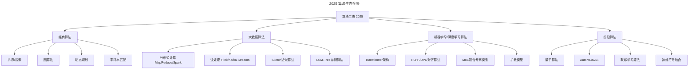
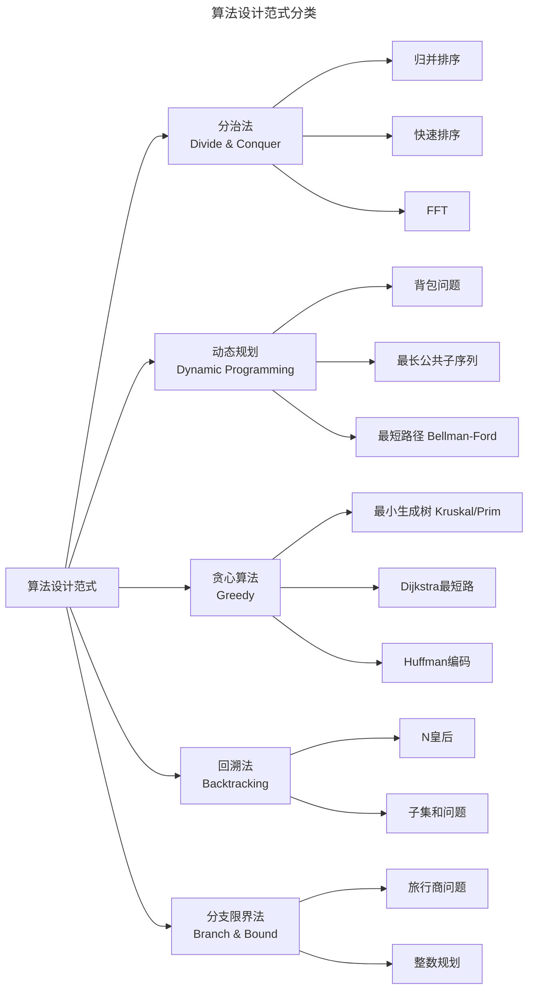
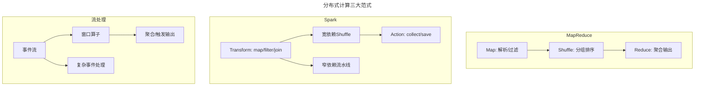
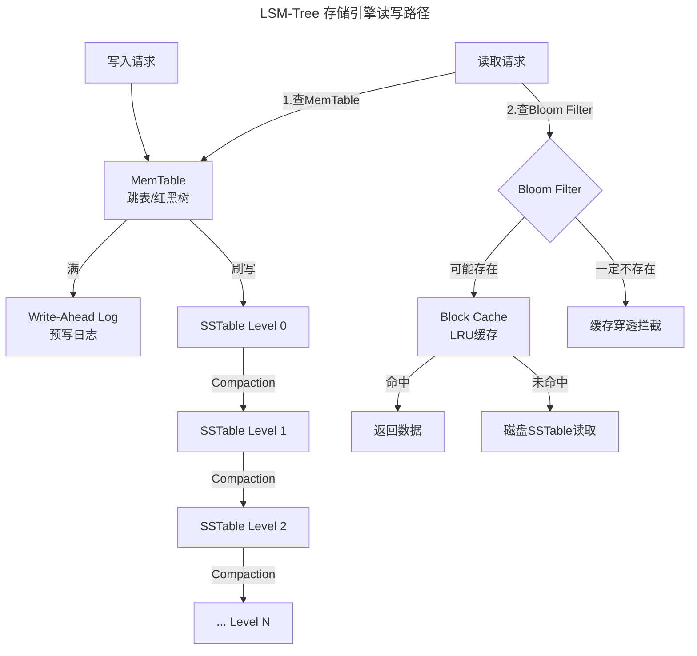
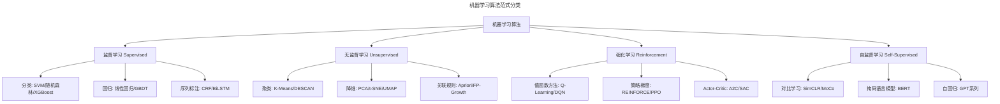
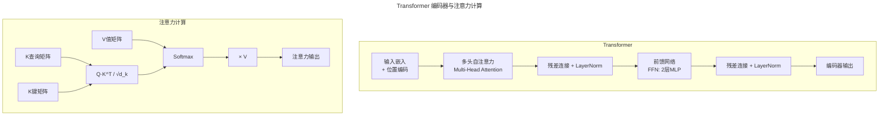
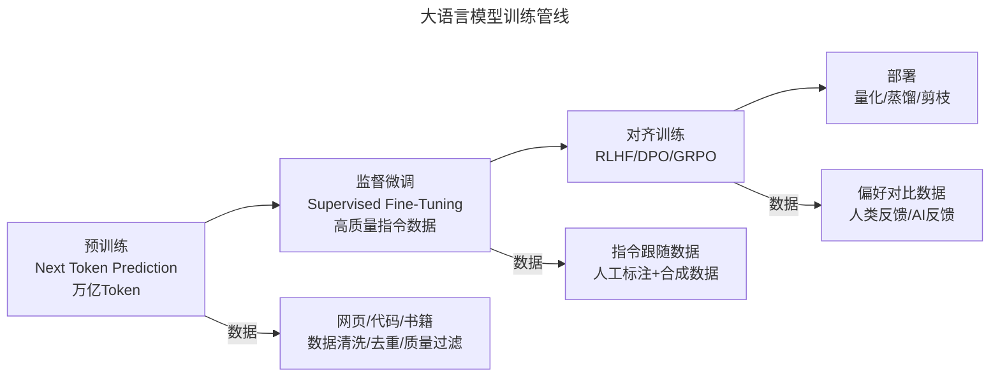
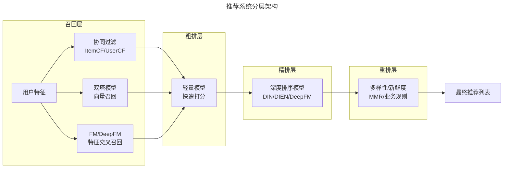
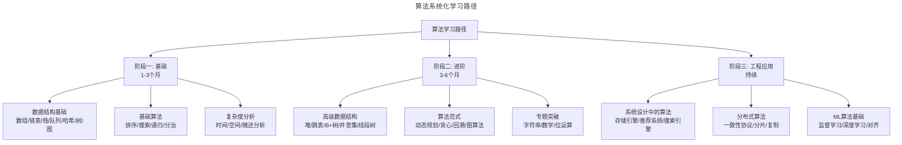

# 大数据与AI时代的算法：工程师必修课

> **适用范围**：后端/数据/算法工程师及技术管理者；适用于系统设计、算法选型、存储引擎理解、推荐/搜索引擎架构与面试准备等场景。
>
> **更新摘要（v2 · 2026-08 更新）**：
> - 结构化升级为 6 节骨架（导言 / 核心方法论 / 关键流程 / 工具与实战 / 常见误区 / 进阶延展）
> - 为全部 9 张 Mermaid 图补充 `--- title: ... ---` frontmatter 与图后文字解读
> - 将原"参考资料"融入"6. 进阶延展"以便读者顺读
> - 保留 2025 算法生态、Transformer/MoE/RLHF、LSM-Tree 代码、推荐系统分层等核心内容

## 1. 导言

传统观点认为"大数据优于好算法"——只要数据量足够大，即使算法不够精良也能产出可接受的结果。这一认知在2017年被DeepMind的AlphaGo Zero彻底颠覆：该系统从零知识状态出发，无需任何人类对弈数据，以100:0击败上一代AlphaGo。AlphaGo首席研究员David Silver指出，AlphaGo Zero使用的计算资源比前代少一个数量级，但凭借更优的算法原理实现了更强的性能。

进入2025年，这一趋势更加显著。大语言模型（LLM）的突破性进展表明，算法架构的创新（如Transformer、MoE混合专家模型、RLHF对齐算法）与数据规模同等重要，甚至在某些场景下更为关键。算法不再仅仅是面试筛选工具，而是决定系统性能上限的核心变量。本文按"理论→大数据/ML 流程→工程实战→误区→趋势"组织，帮助工程师建立完整的算法认知地图。

## 2. 核心方法论

### 2.1 2025年算法生态概览

当前算法生态呈现三大特征：

- **规模驱动与效率驱动的双轨演进**：一方面，大规模分布式算法处理PB级数据；另一方面，端侧推理算法追求极致的参数效率与推理延迟
- **传统算法与AI算法的深度融合**：数据库查询优化器引入学习型索引（Learned Index），推荐系统将协同过滤与深度学习模型协同部署
- **算法即基础设施**：从搜索引擎到推荐系统，从自动驾驶到金融风控，算法已成为技术基础设施的核心组件



生态全景图将算法划分为经典、大数据、机器学习/深度学习、前沿四大类。工程师应按所在领域选择深耕方向，但需意识到四类算法在现代系统中往往协同工作（如推荐系统同时使用经典数据结构、分布式计算与深度学习模型）。

### 2.2 复杂度分析基础

算法复杂度是评估算法效率的数学框架，是算法选型的理论依据。

| 复杂度类 | 记号 | 典型算法 | 数据规模上限（1s时限） |
|---------|------|---------|---------------------|
| 常数 | O(1) | 哈希查找 | 无限制 |
| 对数 | O(log n) | 二分查找、B+树查询 | ~2^10^7 |
| 线性 | O(n) | 线性扫描、计数排序 | ~10^8 |
| 线性对数 | O(n log n) | 归并排序、快速排序 | ~4×10^7 |
| 平方 | O(n²) | 冒泡排序、朴素最近邻 | ~10^4 |
| 指数 | O(2^n) | 子集枚举、精确TSP | ~30 |
| 阶乘 | O(n!) | 全排列、精确TSP | ~12 |

实际工程中需同时关注：
- **时间复杂度**：决定算法能否在可接受时间内完成计算
- **空间复杂度**：决定内存占用，在嵌入式与端侧场景尤为关键
- **I/O复杂度**：在外存算法（如外部排序、B树操作）中起决定性作用
- **缓存友好性**：算法的局部性特征对现代CPU缓存命中率影响显著

### 2.3 算法设计范式



**分治法**将问题分解为独立子问题，分别求解后合并。核心在于分解策略与合并代价。典型应用：归并排序（O(n log n)）、快速排序（平均O(n log n)）、大整数乘法（Karatsuba算法）。

**动态规划**适用于具有最优子结构和重叠子问题特征的问题。状态定义与状态转移方程是设计关键。空间优化（滚动数组、状态压缩）是工程实践中的常见需求。典型应用：0-1背包、编辑距离、区间DP。

**贪心算法**通过局部最优选择期望达到全局最优。需严格证明贪心选择性质。典型应用：活动选择、Huffman编码、Dijkstra算法。

**回溯法**系统搜索解空间树，通过剪枝减少无效搜索。典型应用：组合优化、约束满足问题。

上图展示的五大范式覆盖了绝大多数经典问题。选型关键在于判断问题是否具备"最优子结构"（动态规划）、"贪心选择性质"（贪心）或"解空间可剪枝"（回溯）。

### 2.4 NP问题与近似算法

工程中大量问题属于NP-hard范畴，无法在多项式时间内精确求解，需采用近似算法或启发式方法：

| 策略 | 方法 | 适用场景 |
|------|------|---------|
| 近似算法 | 贪心近似、LP松弛+舍入 | 可证明近似比的问题 |
| 启发式搜索 | 模拟退火、遗传算法、蚁群算法 | 组合优化、调度问题 |
| 随机化算法 | Las Vegas/Monte Carlo | 大规模图计算、素性测试 |
| 参数化算法 | 固定参数可解（FPT） | 实例中存在小参数的NP-hard问题 |

### 2.5 核心数据结构

| 数据结构 | 时间复杂度（查找/插入/删除） | 空间开销 | 核心适用场景 |
|---------|---------------------------|---------|------------|
| 数组 | O(1)/O(n)/O(n) | O(n) | 随机访问密集、大小已知 |
| 链表 | O(n)/O(1)/O(1) | O(n) | 频繁插入删除、大小动态 |
| 哈希表 | O(1)均摊 | O(n) + 开销 | 键值查找、去重、缓存 |
| 二叉搜索树 | O(log n)~O(n) | O(n) | 有序遍历、范围查询 |
| AVL/红黑树 | O(log n) | O(n) | 需要严格平衡的有序操作 |
| 堆 | O(n)/O(log n)/O(log n) | O(n) | 优先队列、Top-K、调度 |
| 跳表 | O(log n)均摊 | O(n)×因子 | 有序集合、并发友好（Redis ZSet） |
| B+树 | O(log n)（低高度） | O(n) | 磁盘索引、数据库查询 |
| LSM-Tree | O(1)写入均摊 | O(n) + compaction | 高吞吐写入、时序数据 |
| 图（邻接表） | O(deg)查找邻居 | O(V+E) | 社交网络、路径规划 |
| 字典树（Trie） | O(L)（L为键长） | O(总字符数) | 前缀匹配、自动补全 |
| 布隆过滤器 | O(k)（k为哈希数） | O(m)（bit数组） | 存在性过滤、防缓存穿透 |

### 2.6 工程中高频使用的数据结构

**B+树**：数据库索引的事实标准。所有数据存储在叶子节点，叶子节点通过指针串联，支持高效范围查询。树高度通常为3-4层即可管理亿级记录，每层对应一次磁盘I/O。

**LSM-Tree（Log-Structured Merge-Tree）**：写优化存储引擎的核心数据结构。写入先进入内存表（MemTable），达到阈值后刷写为磁盘上的SSTable（Sorted String Table），后台通过Compaction合并排序。LevelDB、RocksDB、Cassandra、HBase均基于此架构。

**跳表**：通过多层索引实现O(log n)查找，实现简单且天然支持并发。Redis的有序集合（ZSET）在元素数量超过128或元素长度超过64字节时，从小型编码的紧凑列表（listpack，旧版本为 ziplist/压缩列表）切换为跳表+哈希表实现。

**布隆过滤器**：空间效率极高的概率型数据结构，判断元素"一定不存在"或"可能存在"。在缓存穿透防护、爬虫URL去重、邮箱垃圾邮件过滤中广泛使用。误判率可通过增加bit数组长度和哈希函数数量控制。

## 3. 关键流程

### 3.1 分布式计算范式



**MapReduce**：将计算抽象为Map（映射）和Reduce（归约）两阶段，中间通过Shuffle按Key分组。适用于批处理场景，但每次Shuffle涉及磁盘I/O，迭代计算效率低。

**Spark**：基于RDD（弹性分布式数据集）的内存计算框架。通过DAG调度器优化执行计划，窄依赖（narrow dependency）在流水线中执行不触发Shuffle，宽依赖（wide dependency）才需Shuffle。支持SQL、Streaming、MLlib、GraphX多范式。

**流处理算法**：Flink等流处理框架支持事件时间（Event Time）语义下的窗口计算，包括滚动窗口、滑动窗口、会话窗口。Watermark机制处理乱序事件，允许设置允许延迟（Allowed Lateness）控制结果完整性。

上图对比了批处理（MapReduce）、内存计算（Spark）与流处理三种范式的差异：MapReduce 每阶段落盘，Spark 通过 DAG 优化避免不必要的 Shuffle，流处理则以事件时间窗口为核心抽象。

### 3.2 Sketch近似算法

当数据规模远超内存容量时，精确计算代价过高，Sketch算法以可控的精度损失换取数量级的资源节省：

| Sketch算法 | 功能 | 空间复杂度 | 误差界 | 典型应用 |
|-----------|------|----------|-------|---------|
| Count-Min Sketch | 频率估计 | O(ε⁻¹log δ⁻¹) | ε·‖f‖₁ w.p. 1-δ | 热点统计、流量监控 |
| HyperLogLog | 基数估计 | O(ε⁻² log log n) | 标准误差~1.04/√m | UV统计、去重计数 |
| Bloom Filter | 存在性判断 | O(n·log(1/ε)) | 假阳性率ε | 缓存穿透防护 |
| Heavy Hitters | 频繁项检测 | O(k·log n) | 误差ε | DDoS检测、热门内容 |
| T-Digest | 分位数估计 | O(ε⁻¹) | δ-quantile误差 | P99延迟监控 |
| Count-Min Sketch + | 关联频率 | O(ε⁻¹log δ⁻¹) | ε·‖f‖₁ | 共现统计 |

### 3.3 存储引擎算法：从BigTable到RocksDB

存储引擎是算法在工程中深度应用的典型领域。以下梳理LSM-Tree存储引擎的算法体系：



**技术谱系**：BigTable（2004，Google内部）→ LevelDB（2011，Jeff Dean & Sanjay Ghemawat开源重写）→ RocksDB（Facebook基于LevelDB增强多CPU支持）→ CockroachDB（基于RocksDB的分布式SQL数据库，Spanner开源实现）。

**核心算法要点**：
- **SSTable**：不可变的有序键值对文件，支持二分查找与布隆过滤器加速
- **Compaction**：合并多层SSTable，消除过期与删除标记，分为Leveled Compaction（LevelDB/RocksDB默认）与Tiered Compaction（写放大更小）
- **Bloom Filter**：每SSTable一个，快速排除不包含目标Key的文件，减少磁盘I/O
- **Block Cache**：LRU策略缓存热点数据块，减少重复磁盘读取

上图清晰呈现了 LSM-Tree 的写入路径（MemTable→WAL→SSTable 多层 Compaction）与读取路径（MemTable→Bloom Filter→Block Cache→磁盘）。Bloom Filter 在读路径上承担了"快速排除"的关键职责，避免对不相关 SSTable 的无效磁盘访问。

### 3.4 机器学习学习范式分类



### 3.5 监督学习核心算法

| 算法 | 类型 | 核心思想 | 适用场景 | 复杂度 |
|------|------|---------|---------|-------|
| 线性/逻辑回归 | 线性模型 | 线性决策边界+正则化 | 高维稀疏特征、基线模型 | O(nd)训练 |
| 决策树 | 树模型 | 信息增益/基尼系数递归分裂 | 可解释性要求高 | O(n·d·log n) |
| 随机森林 | 集成-Bagging | 多棵决策树投票/平均 | 通用分类回归、特征重要性 | O(T·n·d·log n) |
| XGBoost/LightGBM | 集成-Boosting | 梯度提升+正则化+直方图加速 | 结构化数据竞赛与工业场景 | O(T·n·d) |
| SVM | 核方法 | 最大间隔超平面+核技巧 | 中小规模非线性分类 | O(n²~n³) |
| 神经网络 | 深度学习 | 多层非线性变换+反向传播 | 图像/文本/语音等非结构化数据 | 取决于架构 |

### 3.6 深度学习基础架构

**卷积神经网络（CNN）**：通过局部感受野与权值共享提取空间局部特征。ResNet引入残差连接解决深层网络退化问题，是计算机视觉领域的里程碑架构。

**循环神经网络（RNN）**：处理序列数据，LSTM/GRU通过门控机制缓解长程依赖问题。在Transformer出现前是NLP主流架构，现主要用于时序预测等场景。

**Transformer架构**：2017年提出的自注意力机制架构，已成为2025年AI领域的主导范式：



**Transformer核心公式**：

$$\text{Attention}(Q, K, V) = \text{softmax}\left(\frac{QK^T}{\sqrt{d_k}}\right)V$$

**关键变体与演进**：
- **BERT**（2018）：双向编码器，掩码语言模型预训练
- **GPT系列**（2019-2025）：自回归解码器，规模定律（Scaling Law）驱动
- **MoE**（Mixture of Experts）：稀疏激活，以较少计算量实现更大参数容量
- **Flash Attention**（2022-2024）：I/O感知的精确注意力算法，显著降低内存访问开销
- **Ring Attention**（2024）：支持超长序列的分布式注意力计算

上图右侧的注意力计算揭示了 Transformer 的核心：通过 Q·K^T 计算查询与键的相关性，softmax 归一化后加权聚合 V。缩放因子 √d_k 用于防止点积过大导致 softmax 梯度消失。

### 3.7 强化学习与对齐算法

AlphaGo Zero的突破本质上是强化学习算法的胜利。其核心流程：

1. **自我对弈（Self-Play）**：当前策略网络与自身对弈生成训练数据
2. **蒙特卡洛树搜索（MCTS）**：在推理阶段进行前瞻搜索，提升决策质量
3. **策略迭代**：用MCTS的搜索结果作为监督信号训练策略网络

2025年，强化学习在LLM对齐中发挥关键作用：

| 对齐算法 | 类型 | 核心机制 | 特点 |
|---------|------|---------|------|
| RLHF | 基于奖励模型的RL | 训练奖励模型→PPO优化策略 | 效果好但训练不稳定 |
| DPO | 直接偏好优化 | 将偏好学习转化为分类问题 | 无需奖励模型，训练更稳定 |
| GRPO | 组相对策略优化 | 组内相对排名作为奖励 | DeepSeek-R1使用的对齐方法 |
| Constitutional AI | 宪法式AI | 基于原则的自我修正 | Anthropic提出 |

### 3.8 大语言模型训练算法管线



训练管线图展示了 LLM 从预训练到部署的四阶段：预训练注入世界知识，SFT 学习指令跟随，对齐训练对齐人类偏好，部署阶段通过量化/蒸馏/剪枝压缩模型。每阶段对应不同的数据类型与算法目标。

## 4. 工具与实战

### 4.1 算法在存储系统中的应用

存储系统是算法密集型基础设施，以下以RocksDB为例说明：

**写入路径**：
1. 请求写入WAL（Write-Ahead Log）保证持久性
2. 写入MemTable（内存中的跳表/红黑树）
3. MemTable达到阈值后变为Immutable MemTable
4. 后台线程将Immutable MemTable刷写为Level 0 SSTable
5. 后台Compaction将低层SSTable合并到高层

**读取路径**：
1. 查询MemTable → Immutable MemTable
2. 查询Block Cache（LRU缓存）
3. 对每层SSTable查询Bloom Filter排除不相关文件
4. 在可能包含Key的SSTable中进行二分查找
5. 解压数据块并返回结果

**代码示例——LSM-Tree写入流程伪代码**：

```python
class LSMTree:
    def __init__(self, memtable_limit=4 * 1024 * 1024):
        self.memtable = SkipList()
        self.wal = WriteAheadLog()
        self.immutable_memtables = []
        self.levels = [SSTableLevel(i) for i in range(7)]
        self.block_cache = LRUCache(capacity=8 * 1024 * 1024)
        self.memtable_limit = memtable_limit

    def put(self, key, value):
        self.wal.append(WriteOp(key, value))
        self.memtable.insert(key, value)
        if self.memtable.size >= self.memtable_limit:
            self._flush_memtable()

    def get(self, key):
        result = self.memtable.get(key)
        if result is not None:
            return result if not result.is_deleted else None
        for imm in self.immutable_memtables:
            result = imm.get(key)
            if result is not None:
                return result if not result.is_deleted else None
        for level in self.levels:
            sstable = level.find_sstable_may_contain(key)
            if sstable and sstable.bloom_filter.may_contain(key):
                cached = self.block_cache.get(sstable, key)
                if cached is not None:
                    return cached
                result = sstable.get_from_disk(key)
                if result is not None:
                    self.block_cache.put(sstable, key, result)
                    return result if not result.is_deleted else None
        return None

    def _flush_memtable(self):
        self.immutable_memtables.append(self.memtable)
        self.memtable = SkipList()
        self.wal.rotate()
        self._trigger_compaction()

    def _trigger_compaction(self):
        imm = self.immutable_memtables.pop(0)
        sstable = SSTable.from_memtable(imm)
        self.levels[0].add(sstable)
        for i in range(len(self.levels) - 1):
            if self.levels[i].size_exceeds_limit():
                self._compact_level(i)
```

### 4.2 推荐系统算法架构

推荐系统是算法在工业界最广泛的应用之一，涉及多种算法协同工作：



**各层算法选型**：

| 层级 | 目标 | 候选集规模 | 延迟要求 | 典型算法 |
|------|------|----------|---------|---------|
| 召回 | 高覆盖率 | 千级→万级 | <50ms | 协同过滤、向量检索（HNSW/IVF-PQ）、多路召回 |
| 粗排 | 初步过滤 | 千级→百级 | <20ms | 轻量DSSM、FM、简化版排序模型 |
| 精排 | 精准排序 | 百级→十级 | <30ms | DeepFM/DIN/DIEN/多目标学习 |
| 重排 | 多样性与业务约束 | 十级 | <10ms | MMR、业务规则引擎、List-wise排序 |

推荐系统的"召回→粗排→精排→重排"漏斗是工程化算法选型的典型范例：每层在候选集规模与延迟约束下选择最合适的算法，体现了"在正确的层级用正确的算法"的工程思想。

### 4.3 搜索引擎算法

搜索引擎涉及信息检索的核心算法栈：

- **倒排索引**：Term → Document列表的映射，支持O(1)文档检索
- **TF-IDF/BM25**：词项权重计算，BM25是工业标准排序函数
- **向量检索**：基于语义嵌入的近似最近邻搜索（ANN），算法包括HNSW、IVF-PQ、ScaNN
- **页面排序**：PageRank算法基于链接结构的图算法，计算节点重要性

**BM25评分公式**：

$$\text{BM25}(D, Q) = \sum_{i=1}^{|Q|} \text{IDF}(q_i) \cdot \frac{f(q_i, D) \cdot (k_1 + 1)}{f(q_i, D) + k_1 \cdot (1 - b + b \cdot \frac{|D|}{\text{avgdl}})}$$

### 4.4 支付领域的压缩编码算法

在支付系统中，信用卡BIN（Bank Identification Number）参数需从服务端同步至移动App，数据传输量直接影响用户体验。核心挑战：

- 各国信用卡前缀格式差异大（中国16位、韩国15-16位、墨西哥16位等）
- 需在压缩率与客户端解码复杂度间取得平衡
- 客户端代码复杂度过高易引入Bug，影响支付可靠性

**典型方案**：采用前缀树（Trie）编码BIN范围，对Trie进行路径压缩（Patricia Trie），再对序列化结果进行变长整数编码（Varint）+ Snappy压缩。相比直接传输JSON，压缩率可达10:1以上，且客户端解码逻辑仅需标准Trie遍历，复杂度可控。

### 4.5 算法学习路径



学习路径图将算法学习分为基础、进阶、工程应用三阶段。第三阶段尤其重要——它将面试中的"算法题"与真实系统中的算法使用连接起来，避免"会刷题但不会做系统设计"的脱节。

### 4.6 推荐学习资源

| 类别 | 资源 | 说明 |
|------|------|------|
| 经典教材 | 《算法导论》（CLRS） | 理论基础，适合系统学习 |
| 经典教材 | 《算法设计手册》（Skiena） | 工程导向，实战性强 |
| 经典教材 | 《算法》（Sedgewick） | Java实现，图示丰富 |
| 在线课程 | MIT 6.006/6.046 | 算法导论/高级算法，免费公开课 |
| 在线课程 | Stanford CS161/CS261 | 算法设计与分析 |
| 刷题平台 | LeetCode | 面试准备首选，按专题分类 |
| 刷题平台 | Codeforces | 竞赛向，提升算法思维 |
| 工程实践 | 读LevelDB/RocksDB源码 | 存储引擎算法实战 |
| 工程实践 | 读Redis源码 | 数据结构与网络算法实战 |

### 4.7 面试准备策略

技术面试中算法考察仍是核心环节，尤其在头部科技公司。准备要点：

1. **按专题系统刷题**：不要随机刷，按数据结构和算法范式分类练习
2. **重视模式识别**：多数面试题可归入有限模式（滑动窗口、双指针、单调栈、拓扑排序等）
3. **训练白板编码**：在无IDE环境下写出可运行代码，边写边沟通思路
4. **复杂度分析习惯**：每道题必须分析时间/空间复杂度，讨论优化空间
5. **系统设计中的算法**：高级面试常考算法在系统设计中的应用（如设计限流器需令牌桶/漏桶算法）

## 5. 常见误区

### 5.1 "大数据优于好算法"的迷信

如导言所述，AlphaGo Zero 已证明在算法原理更优时，即使数据更少、算力更省也能取得压倒性优势。工程中应避免"先堆数据再谈算法"的惰性思维——当数据规模带来边际收益递减时，算法架构创新往往是突破瓶颈的关键。

### 5.2 唯复杂度论

时间复杂度是选型依据之一，但不是全部。低复杂度算法若常数因子过大（如hash map 在小数据量下不如线性扫描）、缓存不友好（如链表遍历破坏空间局部性）或实现复杂易出错，在实际场景中可能劣于"理论复杂度更高"的简单算法。工程选型必须结合数据规模、I/O 模式与可维护性综合判断。

### 5.3 忽视 I/O 与缓存友好性

在分析阶段只看时间复杂度，忽略 I/O 复杂度与缓存命中率，是数据库与存储系统性能问题的常见根源。例如 B+树之所以成为数据库索引事实标准，正是因为它针对磁盘 I/O 进行了优化（低树高、大节点），而非因为它在 CPU 时间上最优。

### 5.4 面试刷题与工程脱节

仅靠刷题掌握的算法往往是"孤立片段"，缺乏与真实系统的联系。常见表现：能写出 Dijkstra 但不理解其在路由协议中的作用，能写出 LRU 但不知道 MySQL Buffer Pool 如何使用改进版 LRU。建议结合源码阅读（LevelDB/RocksDB/Redis）将算法放回工程语境。

### 5.5 过度工程化算法选型

在数据量尚未达到瓶颈时过早引入复杂算法（如百万级数据就用分布式计算、千级文档就上 HNSW 向量索引），会带来不必要的运维复杂度与故障面。应遵循"先用简单算法验证，再按瓶颈优化"的渐进式原则。

### 5.6 忽略近似算法的可控精度

Sketch 类近似算法（Count-Min Sketch、HyperLogLog）在工程中常被误用为"精确算法"或被拒绝采用。正确做法是明确误差界与置信度，并在监控中追踪实际误差，而非一刀切地追求精确或放弃使用。

## 6. 进阶延展

### 6.1 AI驱动的算法优化

机器学习正在重塑传统算法的设计与优化方式：

- **学习型索引（Learned Index）**：用神经网络替代B+树索引结构，在特定数据分布下可减少50%以上的I/O次数
- **学习型排序（Learned Sort）**：利用数据分布先验优化排序策略，在近乎有序数据上接近O(n)
- **学习型查询优化**：用强化学习替代基于规则的查询计划选择，Google已在大规模SQL引擎中实践
- **AI辅助调度**：用深度强化学习优化数据中心任务调度、网络路由

### 6.2 AutoML与神经架构搜索

AutoML旨在自动化机器学习管线中的算法选择与超参优化：

- **NAS（Neural Architecture Search）**：自动搜索最优网络架构，DARTS、ENAS等方法将搜索时间从GPU年降至GPU天
- **超参优化**：贝叶斯优化（Bayesian Optimization）、HyperBand、BOHB等方法自动调优
- **模型压缩自动化**：自动搜索最优的剪枝率、量化位宽与蒸馏策略组合

### 6.3 量子算法

量子计算为特定问题类别提供多项式甚至指数级加速：

| 量子算法 | 加速类型 | 适用问题 | 当前状态 |
|---------|---------|---------|---------|
| Shor算法 | 指数加速 | 大数分解（RSA破解） | 理论验证，需大规模量子比特 |
| Grover算法 | 平方加速 | 无序数据库搜索 | 小规模验证 |
| VQE | 启发式 | 量子化学模拟 | NISQ时代可用 |
| QAOA | 启发式 | 组合优化 | 小规模验证 |
| 量子机器学习 | 待定 | 线性代数子程序 | 理论研究阶段 |

### 6.4 联邦学习与隐私计算

数据隐私法规趋严背景下，联邦学习算法使多方在不共享原始数据的前提下协同训练模型：

- **FedAvg**：客户端本地训练→服务端聚合模型参数，最基础的联邦学习算法
- **FedProx**：引入近端项解决客户端数据异构性问题
- **差分隐私（DP）**：通过添加校准噪声提供数学可证明的隐私保障
- **安全多方计算（MPC）**：在加密数据上直接计算，不泄露原始输入

### 6.5 算法公平性与可解释性

算法的社会影响日益受到关注：

- **公平性**：检测和缓解算法中的偏见（如招聘、信贷场景中的性别/种族偏见）
- **可解释性**：SHAP、LIME等工具提供模型决策的局部与全局解释
- **可审计性**：算法决策过程需可追溯、可审计，满足监管要求

### 6.6 延伸阅读

- Cormen T H, et al. *Introduction to Algorithms* (CLRS), 4th Edition, MIT Press, 2022. —— 算法理论权威教材。
- Sedgewick R, Wayne K. *Algorithms*, 4th Edition, Addison-Wesley, 2011.
- Skiena S S. *The Algorithm Design Manual*, 3rd Edition, Springer, 2020. —— 工程导向。
- Dean J, Ghemawat S. MapReduce: Simplified Data Processing on Large Clusters, *OSDI*, 2004.
- Vaswani A, et al. Attention Is All You Need, *NeurIPS*, 2017. —— Transformer 原始论文。
- Ouyang L, et al. Training language models to follow instructions with human feedback, *NeurIPS*, 2022. —— RLHF。
- Rafailov R, et al. Direct Preference Optimization: Your Language Model is Secretly a Reward Model, *NeurIPS*, 2023. —— DPO。
- Krizhevsky A, Sutskever I, Hinton G E. ImageNet Classification with Deep Convolutional Neural Networks, *NeurIPS*, 2012.
- He K, et al. Deep Residual Learning for Image Recognition, *CVPR*, 2016. —— ResNet。
- Silver D, et al. Mastering the Game of Go without Human Knowledge, *Nature*, 2017. —— AlphaGo Zero。
- O'Neil C. *Weapons of Math Destruction*, Crown, 2016. —— 算法公平性。
- SSTable与Log-Structured存储: https://www.igvita.com/2012/02/06/sstable-and-log-structured-storage-leveldb/
