# 数据库核心技术：从原理到工程实践

> **适用范围**：后端工程师、架构师、DBA 及技术管理者；适用于数据库选型、索引优化、事务设计、分布式架构与 AI 应用（RAG/向量检索）等场景。
>
> **更新摘要（v2 · 2026-08 更新）**：
> - 结构化升级为 6 节骨架（导言 / 核心方法论 / 关键流程 / 工具与实战 / 常见误区 / 进阶延展）
> - 为全部 12 张 Mermaid 图补充 `--- title: ... ---` frontmatter 与图后文字解读
> - 将原"参考资料"融入"6. 进阶延展"以便读者顺读
> - 保留 B+Tree、MVCC、隔离级别、NewSQL、pgvector、Outbox/Saga 等 2025 年核心内容

## 1. 导言

数据库技术经历了从层次模型、网状模型到关系模型的范式跃迁。1970年 Edgar F. Codd 发表《A Relational Model of Data for Large Shared Data Banks》，奠定了关系型数据库的理论基础。此后数十年，数据库系统沿以下脉络持续演进：

| 阶段 | 时间跨度 | 代表系统 | 核心特征 |
|------|---------|---------|---------|
| 商业关系型 | 1980s–1990s | Oracle、DB2、SQL Server | ACID 事务、SQL 标准、商业支持 |
| 开源关系型 | 1990s–2010s | MySQL、PostgreSQL | 开源生态、互联网规模部署 |
| NoSQL 运动 | 2009–2015 | MongoDB、Cassandra、Redis | 放弃强一致性、追求水平扩展与灵活 Schema |
| NewSQL | 2012–至今 | TiDB、CockroachDB、Spanner | 兼顾 SQL 兼容性与分布式扩展 |
| 多模与云原生 | 2018–至今 | Aurora、PolarDB、YugabyteDB | 存算分离、Serverless、多模融合 |
| AI 原生 | 2023–至今 | Milvus、Pinecone、pgvector | 向量检索、语义搜索、RAG 架构 |

本文按"原理→分布式架构→工程实战→误区→趋势"组织，帮助工程师建立从单机到分布式、从关系型到向量数据库的完整认知地图。

## 2. 核心方法论

### 2.1 2025年数据库生态全景

当前数据库生态呈现**多模融合、云原生化、AI 驱动**三大趋势：

- **关系型数据库**仍是核心生产负载的主力，MySQL 8.x/9.x 与 PostgreSQL 17/18 持续增强分析能力与分布式特性
- **文档型数据库**（MongoDB 8.0、DocumentDB）在内容管理、IoT 场景保持优势
- **时序数据库**（TimescaleDB、InfluxDB 3.0、TDengine）随可观测性与 IoT 爆发而增长
- **向量数据库**（Milvus 2.x、Weaviate、Qdrant）因 LLM/RAG 应用成为新热点
- **云原生数据库**（Aurora、PolarDB、AlloyDB）以 Serverless 形态降低运维复杂度
- **嵌入式数据库**（SQLite、DuckDB、libSQL）在边缘计算与本地分析场景崛起

### 2.2 数据库选型决策框架

数据库选型应从以下维度进行系统性评估：

| 维度 | 评估要点 |
|------|---------|
| 数据模型 | 关系型 / 文档型 / 键值型 / 宽列 / 图 / 时序 / 向量 |
| 一致性需求 | 强一致性 / 最终一致性 / 因果一致性 |
| 读写特征 | 读密集 / 写密集 / 读写均衡 / 点查 / 范围扫描 |
| 扩展模式 | 垂直扩展 / 水平扩展（分片） / 存算分离 |
| 运维复杂度 | 自建 / 托管 / Serverless |
| 生态与人才 | 社区活跃度、ORM 支持、DBA 人才储备 |
| 成本 | 许可证、云服务费用、运维人力成本 |
| 合规 | 数据主权、加密、审计 |

### 2.3 选型决策树

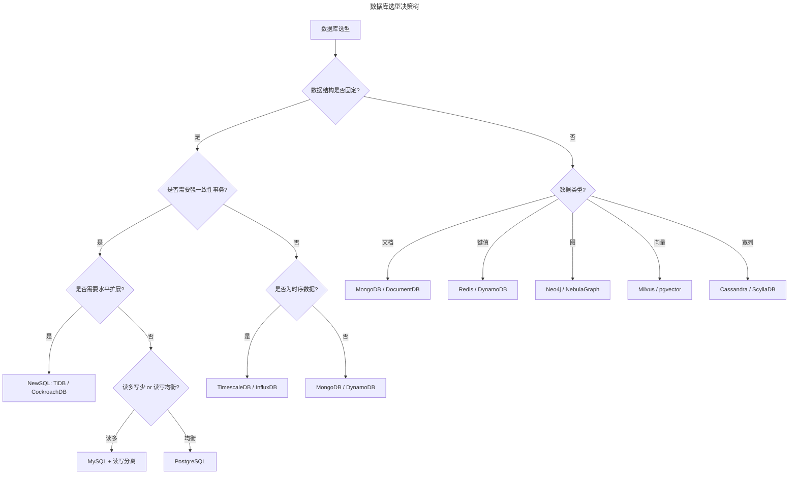

决策树以"数据结构是否固定"为入口分支，逐步细化到一致性、扩展性、数据类型等维度，最终指向具体产品。实际选型时还需叠加运维复杂度与团队驾驭能力。

### 2.4 MySQL vs PostgreSQL：2025年对比

| 特性 | MySQL 8.x/9.x | PostgreSQL 17/18 |
|------|---------------|-----------------|
| 并行查询 | 并行 DML、并行索引扫描 | 并行顺序扫描、并行索引扫描、并行 Append |
| JSON 支持 | JSON_TABLE、JSON_VALUE | JSONB 索引、JSON 路径表达式、JSON_TABLE |
| 窗口函数 | ✅ 完整支持 | ✅ 完整支持 + 增强聚合 |
| CTE | 递归 CTE + CTE 优化 | 递归 CTE + CTE 物化控制 |
| 全文搜索 | 内置 ngram 解析器 | 内置 GIN/GiST 索引、tsvector/tsquery |
| 地理空间 | 通过 ST 函数支持 | PostGIS 扩展，功能更完善 |
| 逻辑复制 | 基于行复制 | 逻辑复制 + 发布/订阅模型 |
| 分区 | Range/List/Hash/Key 分区 | Range/List/Hash 分区 + 分区裁剪增强 |
| 向量检索 | 无原生支持 | pgvector 扩展，支持 IVFFlat/HNSW |
| 角色/权限 | 角色管理（8.0+） | 细粒度行级安全（RLS）+ 角色 |
| 异步 I/O | 传统线程模型 | 18 引入异步 I/O 子系统 |
| UUID | UUID() 函数 | UUIDv7() 函数（18） |
| 生成列 | 存储生成列 | 虚拟生成列（18） |
| 认证 | 原生认证 + PAM | OAuth 2.0 认证（18） |

**选型建议**：

- **选择 MySQL**：团队有丰富 MySQL 运维经验、读密集型场景、需要成熟的主从复制生态、使用 Percona/XtraBackup 等工具链
- **选择 PostgreSQL**：需要复杂查询与分析、地理空间处理、JSONB 深度使用、向量检索（AI 应用）、细粒度权限控制
- **核心原则**：团队对技术的驾驭能力 > 技术本身的纸面优势；数据库迁移成本极高，选型需审慎

### 2.5 索引深度解析

#### B+Tree 索引

B+Tree 是关系型数据库最常用的索引结构，其核心特性：

- 非叶子节点仅存储键值，叶子节点存储完整数据（或指向数据的指针）
- 叶子节点通过双向链表连接，支持高效范围扫描
- 树高度通常为 3–4 层，可支撑千万级数据量的点查

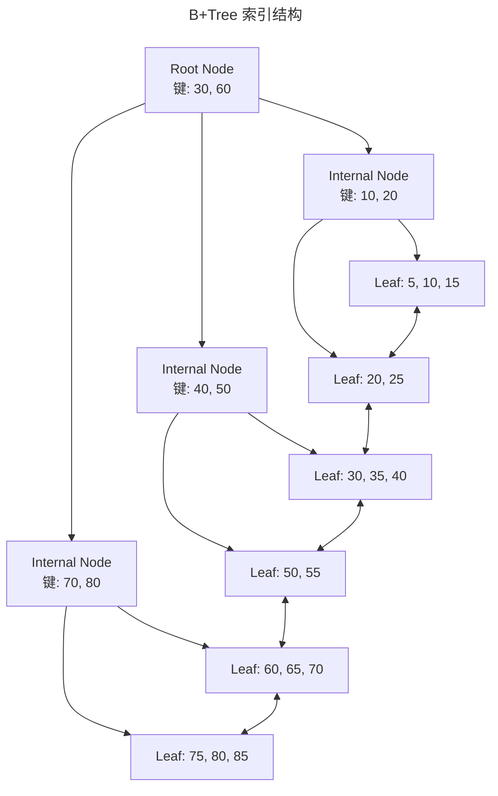

B+Tree 的设计针对磁盘 I/O 优化：非叶子节点只存键值，单页可容纳大量键，使树高保持 3-4 层即可管理亿级数据；叶子节点通过双向链表串联，支持高效范围扫描。

#### 索引类型对比

| 索引类型 | 数据结构 | 适用场景 | 注意事项 |
|---------|---------|---------|---------|
| B+Tree | B+Tree | 等值查询、范围查询、排序 | 最通用索引，MySQL 默认 |
| Hash | 哈希表 | 等值查询 | 不支持范围查询、排序 |
| 全文索引 | 倒排索引 | 文本搜索 | MySQL ngram / PostgreSQL GIN |
| 空间索引 | R-Tree | 地理空间查询 | 需配合 PostGIS / MySQL ST 函数 |
| 向量索引 | IVFFlat / HNSW | 语义相似度搜索 | pgvector 扩展提供 |

#### 唯一索引与 NULL 值陷阱

唯一索引保证列（或列组合）值的唯一性，但与 `NULL` 组合时存在语义陷阱：

**问题**：SQL 标准中 `NULL != NULL`，因此 `(X=1, Y=NULL)` 与 `(X=1, Y=NULL)` 被视为不同行，唯一约束不生效。

```sql
-- MySQL: 允许多条 (1, NULL)，唯一约束不阻止
CREATE TABLE orders (
    order_id INT PRIMARY KEY,
    user_id INT NOT NULL,
    coupon_code VARCHAR(32) NULL,
    UNIQUE KEY uk_user_coupon (user_id, coupon_code)
);

-- 插入以下数据均成功（不符合业务预期）
INSERT INTO orders VALUES (1, 100, NULL);
INSERT INTO orders VALUES (2, 100, NULL);  -- 预期失败，实际成功
```

**解决方案**：

```sql
-- 方案1：使用 Sentinel 值替代 NULL
ALTER TABLE orders MODIFY coupon_code VARCHAR(32) NOT NULL DEFAULT '';

-- 方案2：PostgreSQL 可使用部分索引（Partial Index）
CREATE UNIQUE INDEX uk_user_coupon ON orders (user_id, coupon_code)
    WHERE coupon_code IS NOT NULL;
```

#### 索引选择性

索引选择性（Selectivity）= 不同值数量 / 总行数，选择性越高索引效率越好。经验法则：选择性 < 0.1 的列不适合单独建索引。

```sql
-- 计算选择性
SELECT
    COUNT(DISTINCT status) / COUNT(*) AS status_selectivity,
    COUNT(DISTINCT user_id) / COUNT(*) AS user_id_selectivity
FROM orders;
```

### 2.6 事务与隔离级别

#### ACID 原则

| 属性 | 含义 | 实现机制 |
|------|------|---------|
| Atomicity（原子性） | 事务中的操作全部成功或全部回滚 | WAL（Write-Ahead Log）、Undo Log |
| Consistency（一致性） | 事务前后数据库处于一致状态 | 约束、触发器、应用层校验 |
| Isolation（隔离性） | 并发事务互不干扰 | 锁机制、MVCC |
| Durability（持久性） | 已提交事务的修改永久保存 | WAL、fsync、Redo Log |

#### 隔离级别与并发异常

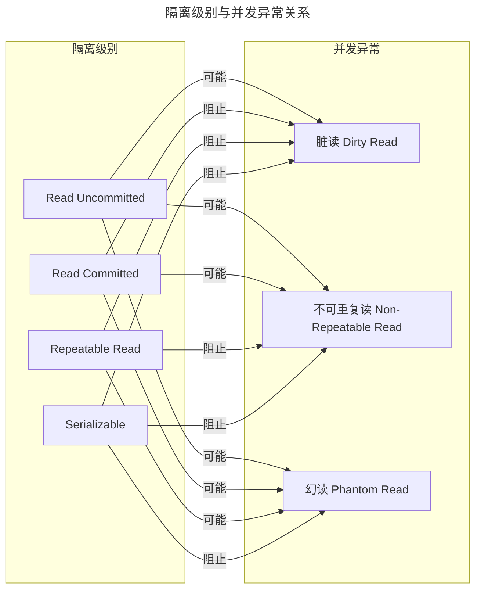

| 隔离级别 | 脏读 | 不可重复读 | 幻读 | MySQL InnoDB | PostgreSQL |
|---------|------|----------|------|-------------|-----------|
| Read Uncommitted | ✓ | ✓ | ✓ | 支持 | 支持 |
| Read Committed | ✗ | ✓ | ✓ | 支持 | 支持（默认） |
| Repeatable Read | ✗ | ✗ | ✓ | 支持（默认，通过 Gap Lock 部分阻止幻读） | 支持（MVCC 快照隔离，可避免幻读） |
| Serializable | ✗ | ✗ | ✗ | 支持 | 支持 |

**关键差异**：MySQL InnoDB 在 RR 级别通过 Next-Key Lock（记录锁 + 间隙锁）在一定程度上阻止幻读；PostgreSQL 的 RR 级别基于 MVCC 快照隔离实现，能避免幻读（提供比 SQL 标准更严格的保证），其 SERIALIZABLE 级别再通过 SSI（可串行化快照隔离）进一步防止写偏斜异常。InnoDB 的默认隔离级别为 REPEATABLE READ。

上图揭示了隔离级别与三类并发异常的对应关系：隔离级别越高，阻止的异常越多，但并发性能开销也越大。工程中需在一致性与性能间权衡，多数互联网场景选择 RC。

### 2.7 锁机制

#### 锁分类

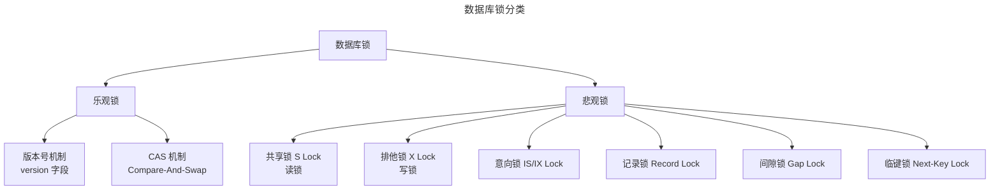

#### 乐观锁 vs 悲观锁

| 维度 | 乐观锁 | 悲观锁 |
|------|-------|-------|
| 核心思想 | 假设冲突概率低，提交时检测 | 假设冲突概率高，操作前加锁 |
| 实现方式 | 版本号 / CAS | `SELECT ... FOR UPDATE` |
| 适用场景 | 读多写少、冲突率低 | 写多、冲突率高 |
| 性能特征 | 无锁开销，冲突时重试成本高 | 加锁开销，阻塞等待 |
| 死锁风险 | 无 | 有 |

**乐观锁实现示例**：

```sql
-- 1. 读取数据及版本号
SELECT id, balance, version FROM accounts WHERE id = 1001;
-- 结果: balance=5000, version=3

-- 2. 更新时校验版本号
UPDATE accounts
SET balance = balance - 1000, version = version + 1
WHERE id = 1001 AND version = 3;
-- 影响行数 = 0 则表示冲突，需重试
```

**悲观锁实现示例**：

```sql
BEGIN;
SELECT balance FROM accounts WHERE id = 1001 FOR UPDATE;
-- 此时其他事务无法修改此行
UPDATE accounts SET balance = balance - 1000 WHERE id = 1001;
COMMIT;
```

#### InnoDB 锁兼容矩阵

|  | S Lock | X Lock | IS Lock | IX Lock |
|--|--------|--------|---------|---------|
| **S Lock** | ✅ 兼容 | ❌ 冲突 | ✅ 兼容 | ❌ 冲突 |
| **X Lock** | ❌ 冲突 | ❌ 冲突 | ❌ 冲突 | ❌ 冲突 |
| **IS Lock** | ✅ 兼容 | ❌ 冲突 | ✅ 兼容 | ✅ 兼容 |
| **IX Lock** | ❌ 冲突 | ❌ 冲突 | ✅ 兼容 | ✅ 兼容 |

### 2.8 MVCC 多版本并发控制

MVCC 是现代关系型数据库实现高并发读写的核心机制，使读操作不阻塞写操作、写操作不阻塞读操作。

#### MVCC 实现原理

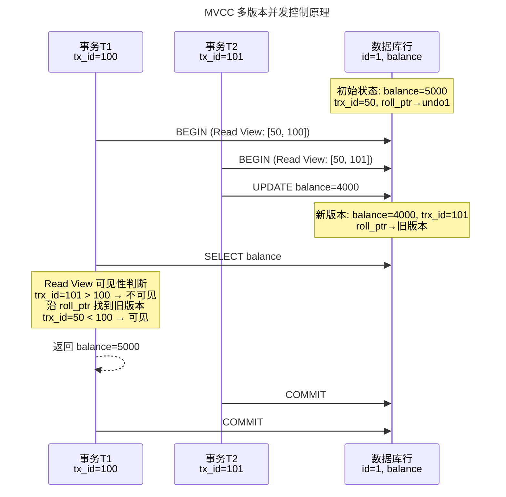

时序图展示了 MVCC 如何通过 Read View 与 undo 链实现"读不阻塞写"：T1 在 T2 提交前查询时，通过可见性判断沿 roll_ptr 找到旧版本，返回 balance=5000，而非 T2 未提交的新值。

#### MySQL vs PostgreSQL MVCC 差异

| 维度 | MySQL InnoDB | PostgreSQL |
|------|-------------|-----------|
| 版本存储 | Undo Log（回滚段） | 行内多版本（xmin/xmax） |
| 空间回收 | Purge 线程清理 Undo | VACUUM 清理死元组 |
| 读视图 | 查询开始时创建 | 依赖隔离级别：RC 每条语句创建，RR 事务开始时创建 |
| 回滚代价 | 通过 Undo Log 回滚，代价较低 | 需要清理死元组，大事务回滚代价高 |
| 表膨胀 | 较轻 | 长事务可能导致严重表膨胀 |

## 3. 关键流程

### 3.1 分布式数据库架构演进路径

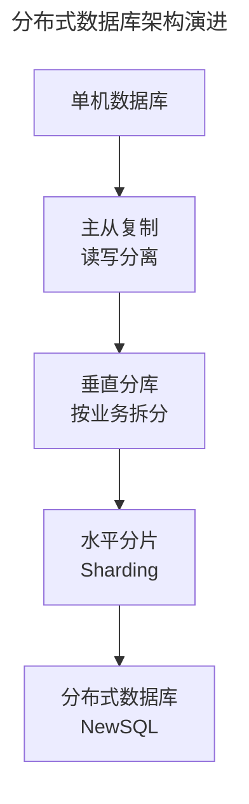

演进路径图展示了从单机到 NewSQL 的四步演进。每一步都对应单机能力达到瓶颈后的架构升级，但升级也带来运维复杂度的跃升，不应过早跳级。

### 3.2 读写分离

读写分离通过主节点处理写操作、从节点处理读操作，实现读能力的水平扩展。

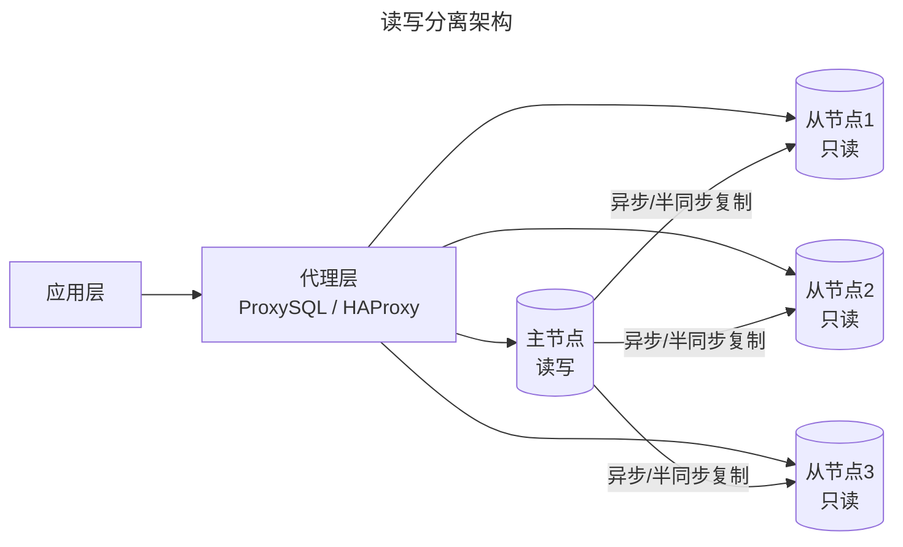

**复制模式对比**：

| 复制模式 | 数据一致性 | 性能 | 适用场景 |
|---------|----------|------|---------|
| 异步复制 | 主从延迟不可控 | 最高 | 对一致性要求不高的场景 |
| 半同步复制 | 至少一个从节点确认 | 中等 | 平衡一致性与性能 |
| 全同步复制 | 所有节点确认 | 最低 | 金融级一致性要求 |
| MySQL Group Replication | 多数派共识 | 中等 | 高可用集群 |
| PostgreSQL 逻辑复制 | 按发布/订阅 | 中等 | 跨版本升级、部分表复制 |

**主从延迟应对策略**：

1. **强制走主库**：对一致性要求高的读请求直接路由到主节点
2. **等待复制位点的同步复制**：使用 `WAIT_FOR_EXECUTED_GTID_SET()` 等待从库追上
3. **中间件路由控制**：在 Proxy 层实现读写分离 + 一致性路由策略

读写分离架构图体现了"写主读从"的基本模式。关键决策在于复制模式选择：异步性能最好但有数据丢失风险，半同步是多数互联网场景的平衡点。

### 3.3 分库分表

当单表数据量超过千万级或单库 QPS 达到瓶颈时，需进行水平拆分。

| 策略 | 说明 | 适用场景 |
|------|------|---------|
| 垂直分库 | 按业务域拆分到不同数据库实例 | 业务边界清晰、耦合度低 |
| 垂直分表 | 将大表中不常用列拆到扩展表 | 单行数据过大、热点列集中 |
| 水平分库 | 相同表结构分布到多个实例 | 单库 QPS 瓶颈 |
| 水平分表 | 同一实例内按规则拆分多张表 | 单表数据量过大 |

**分片键选择原则**：

- 高基数：分片键的值域足够大，保证数据均匀分布
- 查询覆盖：80% 以上的查询条件包含分片键，避免跨分片查询
- 避免热点：如按时间分片时，写入集中在最新分片

**常见分片中间件**：

| 中间件 | 类型 | 特点 |
|--------|------|------|
| ShardingSphere | 客户端 + Proxy | Apache 顶级项目，功能全面 |
| Vitess | Proxy | YouTube 开源，Kubernetes 原生 |
| MyCat | Proxy | 社区活跃，国内使用广泛 |

### 3.4 NewSQL 分布式数据库

NewSQL 在保持 SQL 兼容性的同时，提供原生分布式能力，避免分库分表的运维复杂度。

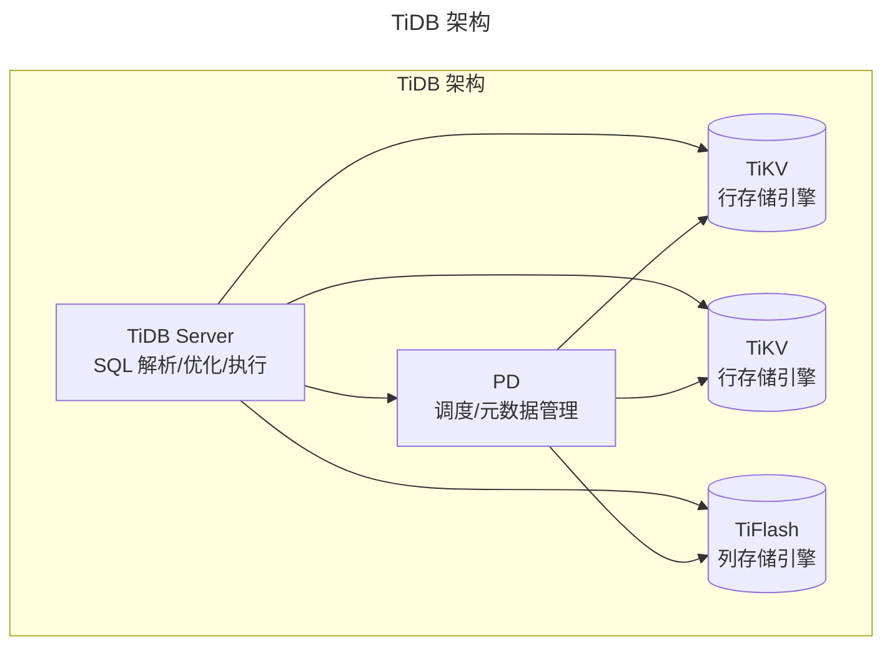

| 特性 | TiDB | CockroachDB | YugabyteDB |
|------|------|-------------|-----------|
| 协议兼容 | MySQL | PostgreSQL | PostgreSQL / Cassandra |
| 存储引擎 | TiKV (RocksDB) + TiFlash | Pebble | RocksDB |
| 事务模型 | Percolator (2PC + 乐观) | 2PC + HLC | 2PC + Hybrid Logical Clock |
| HTAP | ✅ TiFlash 列存 | ❌ | ✅ 列存副本 |
| 部署形态 | 自建 / TiDB Cloud | 自建 / CockroachDB Cloud | 自建 / YugabyteDB Managed |
| 适用场景 | MySQL 兼容迁移、HTAP | PostgreSQL 兼容、全球分布 | PostgreSQL 兼容、云原生 |

TiDB 架构图展示了存算分离的设计：TiDB Server 负责SQL 解析与优化，PD 负责调度与元数据，TiKV/TiFlash 分别提供行存与列存。这种分离使计算与存储可独立弹性伸缩。

## 4. 工具与实战

### 4.1 MySQL 8.0+ / 9.x 新特性

| 版本 | 核心特性 | 工程价值 |
|------|---------|---------|
| 8.0 | 窗口函数（`ROW_NUMBER()`, `RANK()`, `LEAD()`） | 复杂分析查询无需子查询嵌套 |
| 8.0 | 通用表表达式（CTE / Recursive CTE） | 层级数据查询（组织架构、评论树） |
| 8.0 | JSON 函数增强（`JSON_TABLE()`, `JSON_VALUE()`） | 半结构化数据处理能力提升 |
| 8.0 | 角色管理（`CREATE ROLE`, `GRANT`） | 企业级权限管理 |
| 8.0 | 不可见索引（Invisible Index） | 索引变更的安全灰度验证 |
| 8.0 | 降序索引（Descending Index） | 多列排序场景性能优化 |
| 8.0 | `NOWAIT` / `SKIP LOCKED` | 队列消费、并发控制 |
| 9.0 | JavaScript 存储过程 | MySQL 9.x 引入 JS UDF 支持 |
| 9.x | 增量备份 | 降低备份存储与时间成本 |
| 9.x | EXCEPT / INTERSECT | 集合运算语法支持 |

### 4.2 PostgreSQL 17/18 新特性

| 版本 | 核心特性 | 工程价值 |
|------|---------|---------|
| 17 | SQL/JSON 标准支持（`JSON_TABLE`） | 标准化 JSON 查询，与 MySQL 对齐 |
| 17 | 逻辑复制性能提升 | 大表复制延迟显著降低 |
| 17 | 增量备份（pg_basebackup --incremental） | 降低备份窗口与存储成本 |
| 17 | `COPY` 增强 | 批量导入性能提升 |
| 18 | 异步 I/O 子系统 | 大幅提升 I/O 密集型查询性能 |
| 18 | `UUIDv7()` 内置函数 | 时间排序友好的 UUID 生成 |
| 18 | 虚拟生成列（Virtual Generated Column） | 不占用存储空间的计算列 |
| 18 | OAuth 2.0 认证 | 云原生环境下的身份集成 |
| 18 | 时态约束（Temporal Constraints） | 有效期数据的一致性保障 |
| 18 | `pgvector` 增强 | IVFFlat/HNSW 索引优化，向量检索性能提升 |

### 4.3 向量数据库与 AI 应用

大语言模型（LLM）的兴起催生了向量数据库需求，核心场景为 **RAG（Retrieval-Augmented Generation）** 架构中的语义检索。

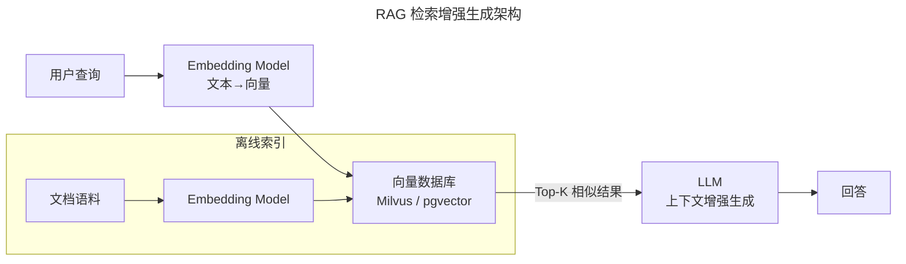

RAG 架构图展示了离线索引（文档语料→Embedding→向量库）与在线检索（查询→Embedding→相似搜索→LLM 生成）两条路径。向量数据库在其中承担"语义记忆"的角色，是 LLM 应用的基础设施。

**向量索引算法对比**：

| 算法 | 原理 | 查询精度 | 索引构建速度 | 适用规模 |
|------|------|---------|------------|---------|
| 暴力扫描 | 全量距离计算 | 100% | 无需构建 | < 10万 |
| IVFFlat | 聚类倒排 + 精排 | 高 | 中 | 10万–1000万 |
| HNSW | 多层导航小世界图 | 高 | 慢 | 100万–10亿 |
| IVFPQ | 聚类 + 乘积量化压缩 | 中 | 中 | > 1亿 |

**pgvector 实战**：

```sql
-- 启用扩展
CREATE EXTENSION vector;

-- 创建带向量列的表
CREATE TABLE documents (
    id SERIAL PRIMARY KEY,
    content TEXT,
    embedding VECTOR(1536)
);

-- 创建 HNSW 索引
CREATE INDEX ON documents
    USING hnsw (embedding vector_cosine_ops);

-- 语义相似度查询
SELECT id, content,
       1 - (embedding <=> '[0.01, 0.02, ...]'::vector) AS similarity
FROM documents
ORDER BY embedding <=> '[0.01, 0.02, ...]'::vector
LIMIT 10;
```

### 4.4 索引优化实战

#### EXPLAIN 执行计划分析

```sql
EXPLAIN ANALYZE
SELECT o.order_id, o.total_amount, u.name
FROM orders o
JOIN users u ON o.user_id = u.id
WHERE o.status = 'PAID' AND o.created_at > '2025-01-01';
```

**关键指标解读**：

| 指标 | 含义 | 优化方向 |
|------|------|---------|
| `type: ALL` | 全表扫描 | 添加合适索引 |
| `type: index` | 索引全扫描 | 优化查询条件 |
| `type: ref` | 索引等值查找 | ✅ 理想状态 |
| `type: range` | 索引范围扫描 | ✅ 可接受 |
| `Extra: Using filesort` | 额外排序 | 优化 ORDER BY 索引覆盖 |
| `Extra: Using temporary` | 临时表 | 优化 GROUP BY / DISTINCT |
| `rows` | 预估扫描行数 | 越小越好 |
| `filtered` | 过滤比例 | 越高越好 |

#### 索引优化策略

**最左前缀原则**：

```sql
-- 索引: idx_abc (a, b, c)
-- ✅ 命中: WHERE a = 1
-- ✅ 命中: WHERE a = 1 AND b = 2
-- ✅ 命中: WHERE a = 1 AND b = 2 AND c = 3
-- ❌ 不命中: WHERE b = 2 AND c = 3
-- ⚠️ 部分命中: WHERE a = 1 AND c = 3（仅用到 a）
```

**覆盖索引**：索引包含查询所需的所有列，避免回表。

```sql
-- 覆盖索引优化
CREATE INDEX idx_user_status_created
    ON orders (user_id, status, created_at, order_id);

-- 查询可直接从索引获取数据，无需回表
SELECT order_id, created_at
FROM orders
WHERE user_id = 1001 AND status = 'PAID';
```

**索引下推（ICP, Index Condition Pushdown）**：MySQL 5.6+ 在存储引擎层过滤索引条件，减少回表次数。

```sql
-- 索引: idx_name_age (last_name, age)
-- 查询: WHERE last_name LIKE 'Zhang%' AND age > 30
-- 无 ICP: 存储引擎返回所有 last_name LIKE 'Zhang%' 的行，Server 层再过滤 age
-- 有 ICP: 存储引擎直接在索引中过滤 age > 30，减少回表
```

### 4.5 事务设计模式

#### 事务性 Outbox 模式

解决事务内包含不可逆操作（如消息发送）的一致性问题：

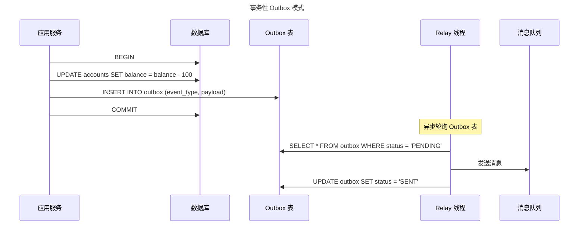

Outbox 模式通过将"消息发送"转化为"同事务内的 Outbox 表写入"，确保业务数据与消息要么同时成功要么同时失败，解决了事务内发送消息的原子性问题。

#### Saga 模式

长事务拆分为多个本地事务，通过补偿操作实现最终一致性：

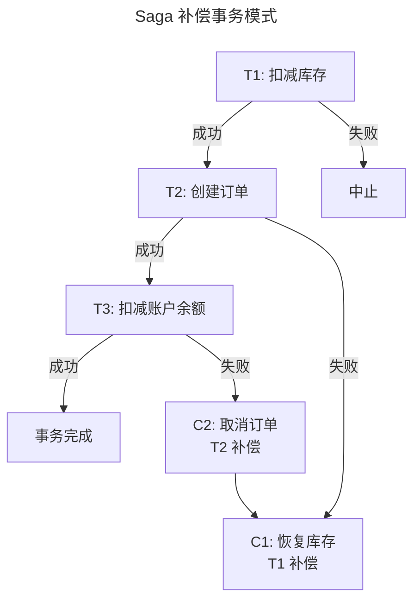

Saga 模式图展示了长事务的正向链与补偿链：任一本地事务失败时，按逆序执行已完成事务的补偿操作。相比 2PC，Saga 放弃了全局一致性，换取了更高的可用性与性能。

### 4.6 连接池配置

#### 连接池核心参数

| 参数 | 说明 | 推荐值 |
|------|------|-------|
| `maximumPoolSize` | 最大连接数 | CPU 核心数 × 2 + 有效磁盘数 |
| `minimumIdle` | 最小空闲连接数 | 与 maximumPoolSize 相同（避免连接抖动） |
| `connectionTimeout` | 获取连接超时 | 30000ms |
| `idleTimeout` | 空闲连接超时 | 600000ms |
| `maxLifetime` | 连接最大生命周期 | 1800000ms（< 数据库 `wait_timeout`） |
| `leakDetectionThreshold` | 连接泄漏检测 | 60000ms |

#### 连接池监控指标

- **Active Connections**：当前活跃连接数，持续接近最大值需扩容
- **Idle Connections**：空闲连接数，过高则浪费资源
- **Pending Threads**：等待连接的线程数，非零表示连接不足
- **Connection Creation Rate**：连接创建频率，过高表示连接生命周期过短

### 4.7 慢查询诊断

#### 慢查询日志配置

```sql
-- MySQL 慢查询配置
SET GLOBAL slow_query_log = ON;
SET GLOBAL long_query_time = 1;        -- 超过 1 秒记录
SET GLOBAL log_queries_not_using_indexes = ON;
SET GLOBAL slow_query_log_file = '/var/log/mysql/slow.log';
```

```ini
# PostgreSQL 慢查询配置 (postgresql.conf)
log_min_duration_statement = 1000      # 超过 1 秒记录
log_checkpoints = on
log_lock_waits = on
deadlock_timeout = 1000
```

#### 诊断流程

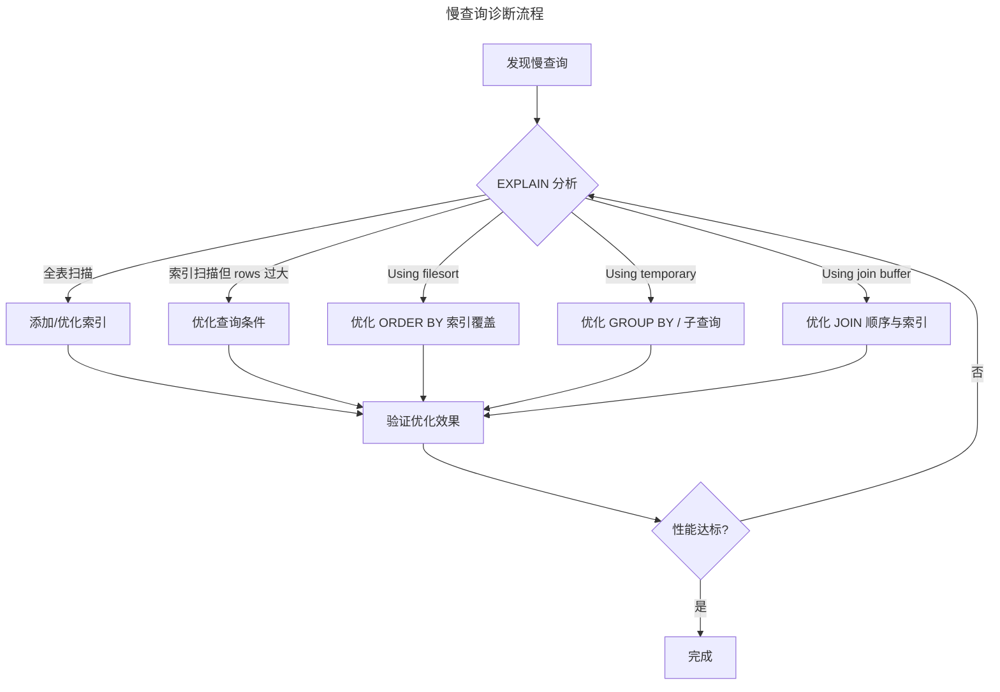

诊断流程图展示了"发现→EXPLAIN 分析→对症优化→验证→迭代"的闭环。关键在于根据 EXPLAIN 输出的不同症状（全表扫描、filesort、temporary 等）选择对应的优化手段。

#### 常用诊断工具

| 工具 | 用途 | 适用数据库 |
|------|------|-----------|
| `pt-query-digest` | 慢查询日志分析 | MySQL |
| `mysqldumpslow` | 慢查询摘要 | MySQL |
| `pg_stat_statements` | SQL 执行统计 | PostgreSQL |
| `Performance Schema` | 实时性能监控 | MySQL |
| `pgBadger` | 日志分析报告 | PostgreSQL |
| `Prometheus + Grafana` | 可视化监控 | 通用 |

### 4.8 数据库最佳实践

| 领域 | 实践 | 说明 |
|------|------|------|
| Schema 设计 | 遵循范式，适度反范式 | 写密集场景适度冗余减少 JOIN，读密集场景保持范式 |
| 索引 | 为高频查询建索引，定期清理无用索引 | 使用 `sys.schema_unused_indexes` 识别 |
| 事务 | 事务粒度最小化 | 事务内仅包含必要的 DB 操作 |
| 连接 | 使用连接池，避免短连接 | 短连接频繁创建/销毁开销大 |
| 读写分离 | 关键业务读走主库 | 避免主从延迟导致的数据不一致 |
| 备份 | 定期全量 + 增量备份，验证恢复流程 | 未验证的备份等于没有备份 |
| 变更 | DDL 变更使用 Online DDL 或 gh-ost | 避免长时间锁表 |
| 监控 | 监控 QPS、慢查询、连接数、复制延迟 | 建立基线与告警阈值 |

## 5. 常见误区

### 5.1 事务常见误用模式

| 误用模式 | 问题描述 | 正确做法 |
|---------|---------|---------|
| 事务过长 | 事务内包含复杂业务逻辑，持有锁时间长 | 事务内仅包含必要的数据库操作，缩短事务粒度 |
| 事务包含非 DB 操作 | 事务内发送邮件、调用外部 API | 先提交事务，再执行副作用操作；或使用 Outbox 模式 |
| 事务包含不可逆操作 | 事务回滚但消息已发送至队列 | 使用事务性 Outbox 或 Saga 模式 |
| 跨库事务 | 多数据库实例间的事务一致性无法保证 | 使用分布式事务（2PC/TCC）或最终一致性方案 |
| 嵌套事务 | 内层事务回滚导致外层事务状态不一致 | 避免嵌套事务，使用 Savepoint 管理部分回滚 |

### 5.2 常见陷阱

| 陷阱 | 后果 | 解决方案 |
|------|------|---------|
| `SELECT *` | 无法利用覆盖索引，网络传输浪费 | 明确指定查询列 |
| 隐式类型转换 | 索引失效 | 确保查询参数类型与列定义一致 |
| `NULL` 与唯一索引 | 多个 `NULL` 不违反唯一约束 | 使用 Sentinel 值或 Partial Index |
| N+1 查询 | 大量小查询导致性能灾难 | 使用 JOIN / `IN` 批量查询 |
| 大事务 | 锁持有时间长、主从延迟增大 | 拆分为小事务 |
| 无限制的分页 | `OFFSET 1000000` 性能极差 | 游标分页（Cursor-based Pagination） |
| 忽略连接池配置 | 连接泄漏或连接风暴 | 合理配置并监控连接池 |
| DDL 直接执行 | 锁表导致服务不可用 | 使用 gh-ost / pt-online-schema-change |
| 主从切换误操作 | 数据丢失或脑裂 | 自动化切换 + 人工确认 + 半同步复制 |
| 过度索引 | 写入性能下降、存储浪费 | 定期审计索引使用情况 |

### 5.3 人为错误防护

| 错误类型 | 典型案例 | 防护措施 |
|---------|---------|---------|
| 误删数据 | `DELETE FROM users` 缺少 WHERE | 事务内先 SELECT 确认、开启安全更新模式 `sql_safe_updates=1` |
| DDL 锁表 | Online Schema Change 误操作 | 使用 gh-ost 工具、在低峰期执行 |
| 主从切换故障 | 拔错电源、脑裂 | 自动化故障转移（MHA / Orchestrator）、仲裁机制 |
| 程序全表扫描 | 无索引查询 + 并发 | 慢查询监控、代码审查、查询超时设置 |

### 5.4 选型与运维误区

- **盲目追逐新技术**：在团队未具备运维能力时过早引入 NewSQL 或向量数据库，带来故障面扩大。
- **忽视迁移成本**：数据库迁移成本极高，仅因纸面特性优势而迁移往往得不偿失。
- **过度依赖 ORM**：ORM 屏蔽了底层 SQL，导致 N+1 查询、隐式类型转换等问题难以被及时发现。
- **备份未验证**：未验证恢复流程的备份等于没有备份，应在定期演练中验证可恢复性。

## 6. 进阶延展

### 6.1 云原生数据库

云原生数据库以**存算分离**为核心架构，实现存储与计算的独立弹性伸缩：

- **AWS Aurora**：日志即数据库（Log is Database），计算节点共享分布式存储
- **阿里云 PolarDB**：基于 Shared-Storage 的存算分离，支持 Serverless 弹性
- **Google AlloyDB**：PostgreSQL 兼容，列存加速分析查询
- **Azure Database**：Flexible Server 模式，自动扩缩容

### 6.2 Serverless 数据库

Serverless 数据库按实际使用量计费，自动扩缩容至零，适用于间歇性工作负载：

| 产品 | 协议兼容 | 特点 |
|------|---------|------|
| PlanetScale | MySQL (Vitess) | 分支工作流、Schema 迁移 |
| Neon | PostgreSQL | 存算分离、分支、自动挂起 |
| Turso | libSQL | 边缘数据库、嵌入式副本 |
| CockroachDB Serverless | PostgreSQL | 全球分布、自动扩缩容 |

### 6.3 AI + 数据库

- **向量检索**：pgvector、Milvus、Weaviate 成为 LLM 应用的基础设施
- **AI 驱动优化**：数据库内置 AI 优化器（如 PostgreSQL 的 pg_qualstats + 自动索引建议）
- **自然语言查询**：Text-to-SQL（如 Snowflake Cortex、Databricks AI Functions）
- **自治数据库**：Oracle Autonomous Database、AWS Aurora 自适应优化
- **AI 辅助诊断**：基于 ML 的异常检测与根因分析

### 6.4 向量检索与多模融合

- **多模数据库**：PostgreSQL + pgvector 兼顾关系查询与向量检索；MySQL 9.x 探索向量类型支持
- **混合检索**：向量检索 + 关键词检索 + 元数据过滤的融合查询
- **实时更新**：HNSW 索引的增量更新能力持续增强

### 6.5 其他趋势

| 趋势 | 说明 |
|------|------|
| HTAP 混合负载 | TiDB TiFlash、Oracle HeatWave、SingleStore 兼顾 OLTP 与 OLAP |
| 边缘数据库 | Turso/libSQL、Cloudflare D1 将数据推至边缘节点 |
| 隐私计算 | 数据库内置加密计算、可信执行环境（TEE） |
| 流式数据库 | RisingWave、Materialize 实时物化视图与流处理 |
| Rust 重写 | GreptimeDB（时序）、SurrealDB（多模）等新一代数据库采用 Rust 实现 |

### 6.6 延伸阅读

- [Uber Engineering: How We Saved 70K Cores Across 30 Mission-Critical Services](https://eng.uber.com/how-we-saved-70k-cores-across-30-mission-critical-services/)（Uber 从 PostgreSQL 迁移至 MySQL 的技术分析）
- [MySQL 8.0 Reference Manual](https://dev.mysql.com/doc/refman/8.0/en/)
- [MySQL 9.x Release Notes](https://dev.mysql.com/doc/relnotes/mysql/9.0/en/)
- [PostgreSQL 17 Release Notes](https://www.postgresql.org/docs/17/release.html)
- [PostgreSQL 18 Beta Release Notes](https://www.postgresql.org/docs/18/release.html)
- [TiDB Documentation](https://docs.pingcap.com/tidb/stable)
- [CockroachDB Documentation](https://www.cockroachlabs.com/docs/)
- [pgvector: Open-source vector similarity search for Postgres](https://github.com/pgvector/pgvector)
- [Milvus Documentation](https://milvus.io/docs)
- *Designing Data-Intensive Applications* — Martin Kleppmann, https://dataintensive.net/
- *Database Internals: A Deep Dive into How Distributed Data Systems Work* — Alex Petrov, https://www.databass.dev/
