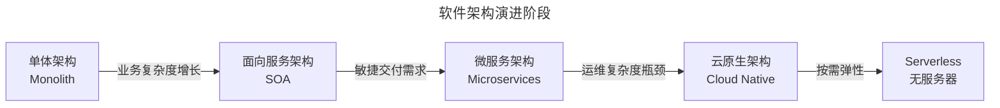
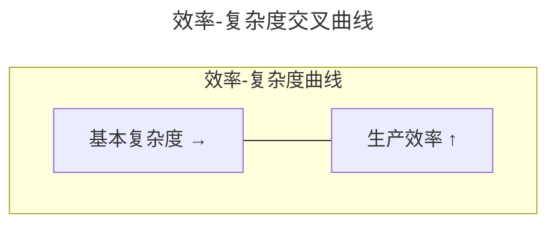
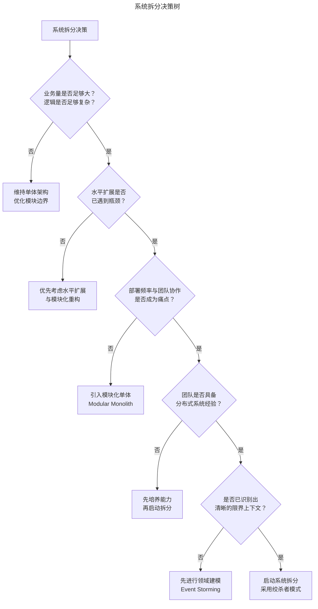
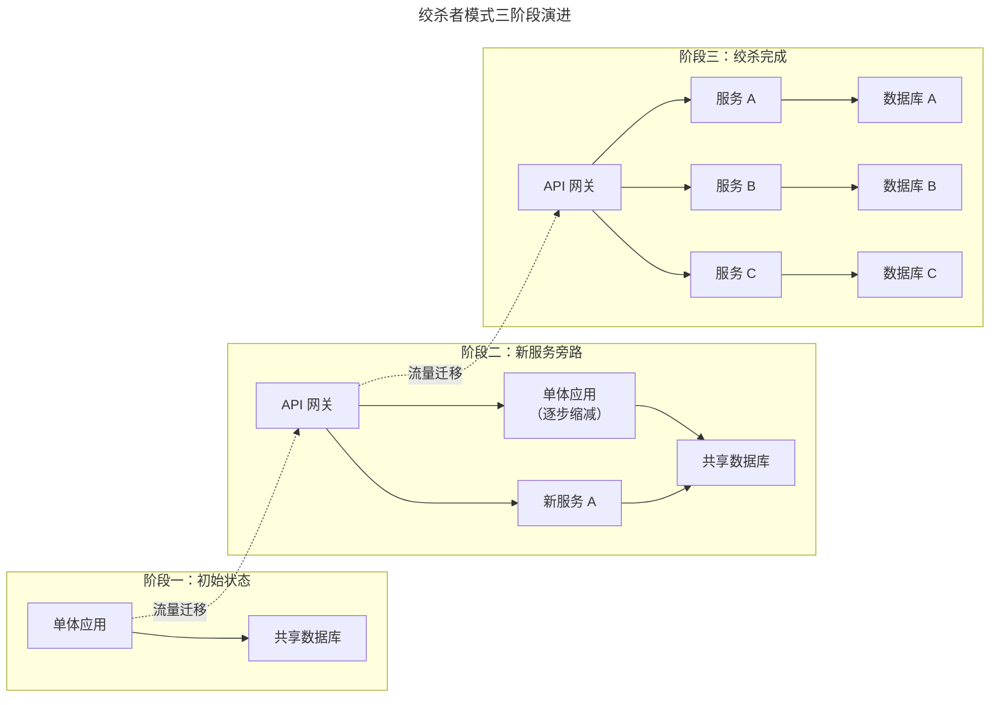
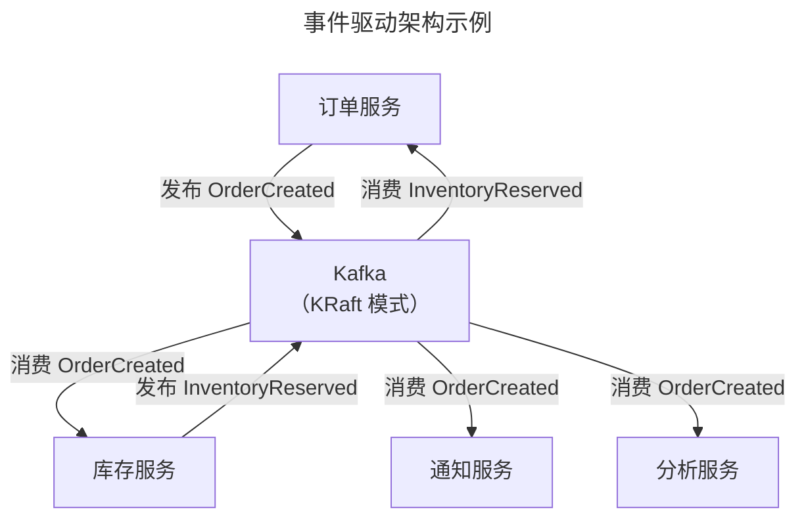
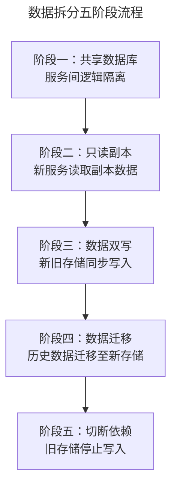
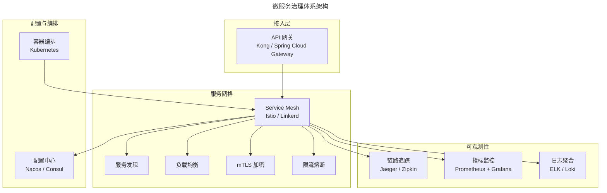
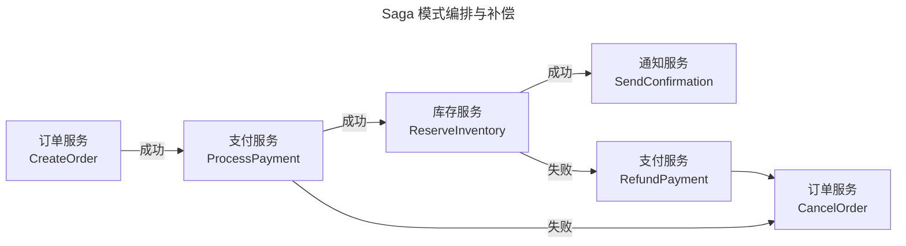

# 系统拆分：从单体架构到云原生微服务的演进与实践

> **适用范围**：后端工程师、架构师、技术负责人及技术管理者；适用于面临系统拆分决策、微服务治理、分布式系统工程挑战的中大型团队。
>
> **更新摘要（v2 · 2026-08 更新）**：
> - 结构化升级为 6 节骨架（导言 / 核心方法论 / 关键流程 / 工具与实战 / 常见误区 / 进阶延展）
> - 为全部 8 张 Mermaid 图补充 `--- title: ... ---` frontmatter 与图后文字解读
> - 将原"参考资料"融入进阶延展节，便于延伸阅读
> - 将原"反模式"内容独立为常见误区节，强化避坑指引

## 1. 导言

系统拆分是软件架构演进中最关键的决策之一。从 Square 到 Airbnb，从 Amazon 到 Netflix，几乎所有成功的技术公司都经历了从单体代码库（Monolith）到分布式微服务架构的演进过程。这一过程并非简单的技术升级，而是组织规模、业务复杂度与工程效率三者博弈的结果。

2025 年，随着云原生架构的全面成熟，系统拆分的实践方式已发生深刻变化。Kafka KRaft 模式取代了 ZooKeeper 依赖，Spring Boot 4.0 支持 GraalVM Native Image 与云原生部署，Service Mesh 与 Dapr 等分布式运行时成为主流，AI 辅助的架构决策工具开始进入工程实践。本文将从理论模型、决策框架、实施策略、治理体系、工程挑战五个维度，系统性地阐述系统拆分的方法论与最佳实践。

## 2. 核心方法论

### 2.1 架构演进模型

软件架构的演进遵循从简单到复杂的客观规律，每一阶段的出现都是对前一阶段核心矛盾的回应：



上图展示了软件架构从单体到 Serverless 的五阶段演进路径。每一次跃迁都是由前阶段的核心矛盾驱动：单体因业务复杂度增长而演进至 SOA，SOA 因敏捷交付需求演进至微服务，微服务因运维复杂度瓶颈演进至云原生，云原生因按需弹性需求演进至 Serverless。理解演进动因有助于判断当前系统所处阶段及下一步方向。

| 阶段 | 核心特征 | 适用场景 | 典型技术栈 |
|------|---------|---------|-----------|
| 单体架构 | 所有功能在单一代码库中编译、部署、运行 | 创业初期、业务验证阶段 | Ruby on Rails、Spring Boot Monolith、Django |
| SOA | 通过企业服务总线（ESB）实现服务间通信，强调服务复用 | 大型企业异构系统集成 | WebSphere、Oracle SOA Suite |
| 微服务 | 服务独立部署、独立数据存储、轻量级通信协议 | 中大型团队、快速迭代需求 | Spring Cloud、Kubernetes、gRPC |
| 云原生 | 容器化部署、动态编排、声明式 API、可观测性内置 | 云端大规模分布式系统 | Istio、Kubernetes、Prometheus |
| Serverless | 按需执行、零运维、事件驱动 | 突发性流量、短时任务 | AWS Lambda、Knative、Cloud Run |

### 2.2 效率-复杂度关系模型

单体架构与微服务架构的生产效率随系统复杂度的变化呈现交叉关系：



该模型揭示了一个关键现象：单体与微服务的效率优劣并非绝对，而是取决于系统复杂度所处区间。

- **低复杂度区间**：单体架构效率显著高于微服务。无需分布式通信开销，集成测试简单，部署流程统一。
- **临界点（Crossover Point）**：当基本复杂度超过临界值后，单体架构的效率急剧下降——代码耦合导致修改影响面扩大，部署窗口延长，团队协作冲突加剧。此时微服务架构的效率优势开始显现。
- **高复杂度区间**：微服务架构通过服务边界隔离变化，使各团队可独立迭代，效率持续优于单体。

> **关键洞察**：临界点并非固定值，它取决于团队规模、部署频率、代码耦合程度和业务迭代速度。过早拆分与过晚拆分同样有害。

### 2.3 康威定律与逆康威机动

Melvin Conway 于 1968 年提出：**"设计系统的组织，其产生的设计等同于组织之内、组织之间的沟通结构。"** 这一洞察对系统拆分具有根本性指导意义：

- **正向推论**：组织结构决定架构形态。如果三个团队维护一个代码库，代码的模块边界将不可避免地模糊。
- **逆向应用（Inverse Conway Maneuver）**：通过主动调整组织结构来驱动目标架构的形成。先按业务域划分团队，再让团队推动对应服务的拆分，比先拆代码再调组织更有效。

### 2.4 领域驱动设计与限界上下文

Eric Evans 提出的领域驱动设计（Domain-Driven Design, DDD）为系统拆分提供了系统性的方法论基础：

- **限界上下文（Bounded Context）**：每个限界上下文定义了模型的明确边界，边界内的模型具有一致性。限界上下文是微服务拆分的天然单元。
- **上下文映射（Context Mapping）**：描述不同限界上下文之间的关系模式，包括共享内核（Shared Kernel）、防腐层（Anti-Corruption Layer）、开放主机服务（Open Host Service）等。
- **聚合根（Aggregate Root）**：定义事务一致性边界，一个聚合根通常对应一个服务的数据所有权。

### 2.5 拆分决策树



决策树以五个关键问题层层递进，从业务复杂度、扩展瓶颈、协作痛点、团队能力到领域建模成熟度逐项评估。只有当所有前置条件满足时才启动拆分，避免盲目跟风。值得注意的是，"先培养能力"与"先进行领域建模"是两条重要的回退路径——拆分并非唯一选择。

### 2.6 拆分临界点评估矩阵

| 评估维度 | 未达临界点 | 达到临界点 | 超过临界点 |
|---------|-----------|-----------|-----------|
| 部署频率 | 每周 1-2 次，可控 | 部署窗口紧张，排队严重 | 部署成为瓶颈，频繁回滚 |
| 代码耦合 | 模块间依赖清晰 | 修改一处影响多处 | 任何改动都需全量回归测试 |
| 团队协作 | 团队间无冲突 | 合并冲突增多 | 代码合并成为日常痛点 |
| 故障半径 | 故障范围可控 | 故障影响多个模块 | 单点故障拖垮整个系统 |
| 扩展能力 | 垂直扩展即可 | 部分模块需独立扩展 | 整体扩展成本不可接受 |

> **原则**：系统拆分是"从一到多容易，从多到一困难"的近乎不可逆过程。在启动拆分前，务必确认已越过临界点，且团队已具备驾驭分布式系统的能力。

## 3. 关键流程

### 3.1 绞杀者模式（Strangler Fig Pattern）

绞杀者模式是系统拆分最推荐的渐进式策略，其核心思想是在旧系统外围逐步构建新服务，将流量逐步迁移至新系统，最终"绞杀"旧系统：



绞杀者模式通过三个阶段实现从单体到微服务的平滑过渡：阶段一为初始单体状态；阶段二引入 API 网关并在旁路构建新服务，新旧系统共享数据库以降低风险；阶段三完成全部服务拆分与数据隔离，旧单体被完全绞杀。这一模式的核心优势在于每一步都可独立验证与回滚。

**实施要点**：

1. 在单体应用前部署 API 网关，作为流量的统一入口
2. 按限界上下文逐步提取新服务，通过网关路由流量
3. 新服务与单体应用共享数据库（初期），后续再进行数据拆分
4. 每次迁移一个服务，确保稳定后再进行下一次
5. 使用特性开关（Feature Toggle）控制流量切换比例

### 3.2 事件驱动拆分

当服务间存在复杂的数据依赖时，事件驱动架构可有效解耦服务间的同步调用关系：



事件驱动架构通过消息中间件（如 Kafka）实现服务间的松耦合：订单服务发布事件后无需等待下游响应，库存、通知、分析等服务各自消费事件并独立处理。这种模式将同步调用转化为异步事件流，显著降低服务间的时序耦合，同时提升系统的可扩展性与容错能力。

**2025 年技术选型**：

| 组件 | 推荐方案 | 关键特性 |
|------|---------|---------|
| 消息总线 | Apache Kafka（KRaft 模式） | 无需 ZooKeeper，Exactly-Once 语义，Kafka Streams |
| 事件网格 | Dapr Pub/Sub | 与具体消息中间件解耦，云可移植 |
| 事件溯源 | EventStoreDB / Apache Kafka | 完整审计线索，事件回放能力 |
| CQRS | Axon Framework / 自建 | 读写分离，查询模型独立优化 |

### 3.3 数据拆分策略

数据拆分是系统拆分中最复杂、风险最高的环节，需遵循以下原则与步骤：

**拆分原则**：

- **每个服务拥有独立数据存储**（Database per Service），禁止跨服务直接访问数据库
- **通过 API 或事件进行数据共享**，而非共享数据库表
- **先拆服务，后拆数据**：初期可共享数据库，通过逻辑隔离降低风险

**拆分步骤**：



数据拆分遵循五阶段渐进流程：从共享数据库逻辑隔离起步，经只读副本、数据双写、历史数据迁移，最终切断旧存储依赖。每个阶段都设置了可验证的里程碑，确保数据一致性在迁移过程中不被破坏。双写阶段尤其关键，需通过对比校验确保新旧存储数据同步。

### 3.4 接口兼容性管理

接口变更是系统拆分后最常见的工程挑战之一。以下为安全变更接口的标准流程：

**向后兼容变更协议**：

1. **扩展阶段**：提供方接口同时支持新旧两种数据格式（如同时接受 `integer` 和 `string`），部署上线
2. **迁移阶段**：消费方逐步迁移至新格式，部署上线
3. **清理阶段**：确认所有消费方完成迁移后，提供方移除旧格式支持

**保障机制**：

- 使用 Protocol Buffers 或 Avro 等支持 Schema 演进的序列化协议
- 通过 Schema Registry（如 Confluent Schema Registry）管理接口版本
- 建立消费者驱动的契约测试（Consumer-Driven Contract Testing，如 Pact）
- 在 CI/CD 流水线中集成契约验证，防止不兼容变更合入主分支

### 3.5 微服务治理体系

微服务拆分后，服务治理成为保障系统稳定运行的核心基础设施：



治理体系由接入层、服务网格、可观测性、配置与编排四大子系统构成。API 网关统一入口，Service Mesh 承载服务间通信的可靠性逻辑，可观测性三大支柱（追踪、指标、日志）提供全链路洞察，Kubernetes 负责容器编排。这一分层架构使业务代码与基础设施能力彻底解耦。

**核心治理能力**：

| 治理能力 | 2025 年推荐方案 | 说明 |
|---------|---------------|------|
| 服务发现 | Kubernetes Service + Istio | 云原生环境原生支持，无需额外注册中心 |
| 配置管理 | Nacos / Consul / Kubernetes ConfigMap | 支持动态推送，配置变更热更新 |
| 链路追踪 | OpenTelemetry + Jaeger | 统一 Trace/Span 语义标准，多语言 SDK |
| 限流熔断 | Istio / Resilience4j / Sentinel | Service Mesh 层面统一治理，或 SDK 嵌入 |
| 安全通信 | Istio mTLS / SPIFFE | 零信任网络，服务间自动加密通信 |
| API 管理 | Kong / APISIX / Spring Cloud Gateway 4.x | 统一入口，认证鉴权，流量控制 |

### 3.6 Service Mesh 深度解析

Service Mesh 将服务间通信的可靠性逻辑从业务代码中剥离至基础设施层，是云原生架构的核心组件：

**数据面（Data Plane）**：以 Sidecar 代理（Envoy）形式拦截所有服务间流量，实现负载均衡、熔断、重试、超时控制。

**控制面（Control Plane）**：Istio 负责配置分发、证书管理、策略执行，将运维决策与业务逻辑彻底解耦。

**2025 年演进趋势**：

- **Ambient Mesh**：Istio 推出无 Sidecar 模式，降低资源开销与运维复杂度
- **eBPF 加速**：Cilium 基于 eBPF 实现内核级网络策略，替代部分 Sidecar 功能
- **多集群联邦**：跨集群、跨区域的服务发现与流量管理成为标配

### 3.7 拆分后的工程挑战

#### 分布式事务

系统拆分后，原本在单一数据库中通过本地事务保证的一致性，变为跨服务的分布式事务问题。

**解决方案对比**：

| 方案 | 一致性保证 | 适用场景 | 实现复杂度 |
|------|-----------|---------|-----------|
| Saga 模式 | 最终一致性 | 长事务、跨服务业务流程 | 中 |
| TCC（Try-Confirm-Cancel） | 最终一致性 | 资源预留型业务（如库存） | 高 |
| 两阶段提交（2PC） | 强一致性 | 对一致性要求极高的场景 | 高，性能差 |
| Outbox 模式 | 最终一致性 | 事件发布与数据更新的原子性 | 中 |

**Saga 模式实现**：



Saga 模式通过正向操作链与补偿操作链实现分布式事务：正向链按订单→支付→库存→通知顺序执行，任一步骤失败则触发反向补偿（如退款、取消订单）。补偿链的执行顺序与正向链相反，确保每一步都有对应的回滚动作。

**2025 年推荐实践**：使用 Dapr Workflow 或 Seata 等框架简化 Saga 编排，避免从零实现补偿逻辑。

#### 数据一致性

跨服务的数据一致性是系统拆分后最持久的挑战：

- **CAP 定理约束**：分布式系统无法同时满足一致性（Consistency）、可用性（Availability）和分区容错（Partition Tolerance），系统拆分后必须在 C 与 A 之间做出权衡。
- **最终一致性作为默认选择**：大多数业务场景可接受短暂的数据不一致，通过事件驱动机制实现最终一致性。
- **审计线索（Audit Trail）**：支付、金融等场景需要完整的"谁在何时做了什么"的变更记录。Kafka 事件流 + 事件溯源（Event Sourcing）是当前最成熟的解决方案。

#### 可观测性

系统拆分后，原本在单一进程中可追踪的调用链路变为跨服务的分布式调用，可观测性（Observability）成为不可或缺的基础能力：

**三大支柱**：

| 支柱 | 工具 | 作用 |
|------|------|------|
| 日志（Logs） | ELK Stack / Grafana Loki | 记录离散事件，问题定位 |
| 指标（Metrics） | Prometheus + Grafana | 量化系统状态，告警触发 |
| 追踪（Traces） | OpenTelemetry + Jaeger | 还原分布式调用链路 |

**统一标准**：OpenTelemetry 已成为 2025 年可观测性的事实标准，提供统一的 Trace/Span 语义、多语言 SDK 和 Collector 管道，消除了不同厂商的 instrumentation 差异。

**异常传播规范**：

- 服务端必须将异常信息封装后通过 HTTP 4XX/5XX 响应体返回，包含结构化的错误码、错误消息和追踪 ID（Trace ID）
- 调用方通过 Trace ID 关联跨服务的请求链路，避免出现 `Error! HTTP 400 response from http://another-service/update` 这类无上下文的错误信息
- 在日志中统一注入 Trace ID、Span ID，实现日志与追踪的自动关联

#### 超时与重试策略

系统拆分后，超时设置从单进程内的方法调用超时变为跨网络的请求超时，复杂度显著增加：

**超时设置原则**：

- **全局超时与局部超时分层**：入口请求设置全局超时（如 5 秒），每层服务调用设置局部超时，局部超时之和不得超过全局超时
- **超时预算（Timeout Budget）**：为每一跳分配超时预算，预留缓冲时间应对网络抖动
- **重试与退避**：使用指数退避（Exponential Backoff）+ 抖动（Jitter）避免重试风暴

**Service Mesh 层统一治理**：Istio 可在网格层面统一配置超时与重试策略，无需修改业务代码：

```yaml
apiVersion: networking.istio.io/v1alpha3
kind: VirtualService
spec:
  http:
  - route:
    - destination:
        host: inventory-service
    timeout: 2s
    retries:
      attempts: 3
      perTryTimeout: 1s
      retryOn: 5xx,reset,connect-failure
```

#### CI/CD 与部署策略

系统拆分后，CI/CD 从单一部署流水线变为多服务独立交付，需要重新设计：

| 维度 | 单体架构 | 微服务架构 |
|------|---------|-----------|
| 部署单元 | 单一制品 | 每服务独立制品 |
| 部署频率 | 低（周级） | 高（日级/小时级） |
| 回滚策略 | 整体回滚 | 按服务独立回滚 |
| 测试策略 | 集成测试为主 | 契约测试 + 端到端测试 |
| 环境管理 | 简单 | 需要完整的环境隔离与治理 |

**2025 年推荐实践**：

- 使用 Kubernetes + ArgoCD 实现 GitOps 部署模型
- 每个服务独立 CI/CD 流水线，通过契约测试保障接口兼容性
- 采用蓝绿部署或金丝雀发布降低发布风险
- Spring Boot 4.0 应用可编译为 GraalVM Native Image，启动时间从秒级降至毫秒级，显著优化容器调度效率

## 4. 工具与实战

### 4.1 最佳实践

1. **先模块化，再拆分**：在单体应用中先建立清晰的模块边界（Modular Monolith），验证限界上下文划分的合理性，再逐步拆分为独立服务
2. **渐进式拆分**：采用绞杀者模式，每次只拆分一个服务，确保稳定后再进行下一次
3. **数据先行**：先明确数据所有权边界，再进行服务拆分；共享数据是耦合的根源
4. **契约测试优先**：在服务拆分前建立消费者驱动的契约测试，确保接口兼容性
5. **可观测性前置**：在拆分前部署完整的可观测性基础设施（日志、指标、追踪），拆分后问题定位能力不降级
6. **标准化技术栈**：限制服务实现的语言与框架选择，避免"技术秀"导致维护成本失控
7. **服务生命周期管理**：建立服务注册、版本管理、废弃与下线的标准流程，避免服务数量膨胀失控

### 4.2 技术选型速查

- **消息总线**：Apache Kafka（KRaft 模式）
- **Service Mesh**：Istio（Ambient Mesh）/ Linkerd
- **可观测性**：OpenTelemetry + Jaeger + Prometheus + Grafana + Loki
- **配置中心**：Nacos / Consul / Kubernetes ConfigMap
- **API 网关**：Kong / APISIX / Spring Cloud Gateway 4.x
- **分布式事务**：Dapr Workflow / Seata
- **部署**：Kubernetes + ArgoCD（GitOps）

## 5. 常见误区

### 5.1 拆分反模式

| 反模式 | 表现 | 后果 | 应对策略 |
|-------|------|------|---------|
| 分布式单体 | 服务拆分后仍存在强同步依赖 | 部署仍需协调，丧失独立交付能力 | 识别并消除同步依赖，改用事件驱动 |
| 纳米服务 | 服务拆分过细，每个服务仅包含极少逻辑 | 运维成本指数级增长，网络开销过大 | 合并内聚性强的服务，遵循单一限界上下文 |
| 共享数据库 | 多个服务直接访问同一数据库 | 数据耦合，变更影响面不可控 | 严格执行 Database per Service |
| 忽略运维就绪 | 拆分服务但未建设可观测性与部署能力 | 故障定位困难，回滚复杂 | 拆分前完成基础设施准备 |
| 技术栈碎片化 | 每个服务使用不同语言与框架 | 招聘与维护成本失控 | 制定技术栈标准，限制选择范围 |
| 大爆炸式拆分 | 一次性拆分所有服务 | 风险集中爆发，回滚困难 | 渐进式拆分，逐步验证 |

### 5.2 决策误区

- **过早拆分**：在复杂度未达临界点时盲目拆分，引入不必要的分布式复杂度
- **过晚拆分**：在系统已严重耦合后才拆分，拆分成本与风险剧增
- **忽视康威定律**：仅调整架构而不调整组织结构，导致架构与组织错配
- **跳过领域建模**：未识别清晰的限界上下文即开始拆分，服务边界划分不合理
- **忽视团队成熟度**：团队缺乏分布式系统经验即启动拆分，导致运维失控

## 6. 进阶延展

### 6.1 发展趋势

#### 云原生架构成为默认选择

2025 年，云原生已从前沿技术演进为行业默认架构范式。Kubernetes 成为事实上的操作系统，容器化与声明式 API 成为标准部署模型。系统拆分的目标不再是"拆分为微服务"，而是"拆分为云原生工作负载"。

#### Dapr 与分布式运行时

Dapr（Distributed Application Runtime）将分布式系统的通用能力（服务调用、状态管理、发布订阅、Actor 等）抽象为标准化 API，使开发者无需关心底层实现：

- **服务间调用**：Dapr Sidecar 自动处理重试、超时、mTLS
- **状态管理**：统一 API 支持 Redis、CosmosDB、DynamoDB 等多种后端
- **发布订阅**：与 Kafka、RabbitMQ、Azure Service Bus 等解耦
- **Workflow**：内置 Saga 编排能力，简化分布式事务实现

Dapr 代表了"分布式能力下沉至运行时"的趋势，使系统拆分后的治理复杂度显著降低。

#### Serverless 容器

AWS Fargate、Google Cloud Run、Azure Container Apps 等 Serverless 容器平台使服务无需管理底层节点即可运行，按实际使用量计费。对于拆分后负载波动较大的服务，Serverless 容器提供了更优的弹性与成本模型。

#### AI 辅助架构决策

2025 年，AI 工具开始应用于架构决策领域：

- **依赖分析**：基于代码调用图自动识别服务边界候选
- **变更影响预测**：分析代码修改的潜在影响范围，辅助判断拆分优先级
- **架构合规检查**：自动检测服务间是否存在违规的直接数据库访问或同步调用链

#### 模块化单体的回归

值得注意的是，2025 年技术社区出现了对模块化单体（Modular Monolith）的重新审视。对于中小规模团队，在单体应用中通过严格的模块边界（如 Java 9+ Module System、Spring Modulith）实现逻辑隔离，可在不引入分布式复杂度的前提下获得部分微服务收益。这一趋势提醒我们：**架构选择应基于实际需求，而非技术潮流**。

### 6.2 延伸阅读

1. Martin Fowler, "Strangler Fig Pattern", https://martinfowler.com/bliki/StranglerFigApplication.html
2. Eric Evans, *Domain-Driven Design: Tackling Complexity in the Heart of Software*, 2003
3. Sam Newman, *Building Microservices: Designing Fine-Grained Systems*, 2nd Edition, 2021
4. Confluent, "Kafka KRaft Mode", https://docs.confluent.io/platform/current/kafka-metadata/kraft.html
5. Istio, "Ambient Mesh", https://istio.io/latest/docs/ambient/overview/
6. Dapr Documentation, https://docs.dapr.io/
7. OpenTelemetry Specification, https://opentelemetry.io/docs/specs/
8. Spring Boot 4.0 Documentation, https://spring.io/projects/spring-boot
9. Chris Richardson, *Microservices Patterns: With Examples in Java*, 2018
10. Vernon Vaughn, *Implementing Domain-Driven Design*, 2013
