# API 设计与实现：现代技术架构指南

> **适用范围**：后端工程师、架构师、平台工程师及 API 产品负责人；适用于涉及 API 设计、协议选型、安全认证、网关架构、契约测试与开放平台建设的技术从业者。
>
> **更新摘要（v2 · 2026-08 更新）**：
> - 结构化升级为 6 节骨架（导言 / 核心方法论 / 关键流程 / 工具与实战 / 常见误区 / 进阶延展）
> - 为全部 15 张 Mermaid 图补充 `--- title: ... ---` frontmatter 与图后文字解读
> - 将原"常见陷阱"独立为常见误区节，强化反模式指引
> - 将原"参考资料"与"总结"融入进阶延展节，便于延伸阅读

## 1. 导言

### 1.1 API 设计的战略意义

应用程序编程接口（Application Programming Interface，API）是现代软件架构的核心纽带。在分布式系统、微服务架构、云原生应用盛行的 2025 年，API 已从简单的功能调用接口演进为数字经济的基石。一套设计精良的 API 能够：

- **降低系统集成成本**：标准化的接口规范使跨团队、跨组织协作成为可能
- **提升开发效率**：良好的抽象层次让开发者专注于业务逻辑而非底层实现
- **保障系统可演进性**：向后兼容的设计原则支持系统平滑升级
- **构建生态系统**：开放 API 可成为平台战略的核心资产

### 1.2 2025 年 API 生态全景

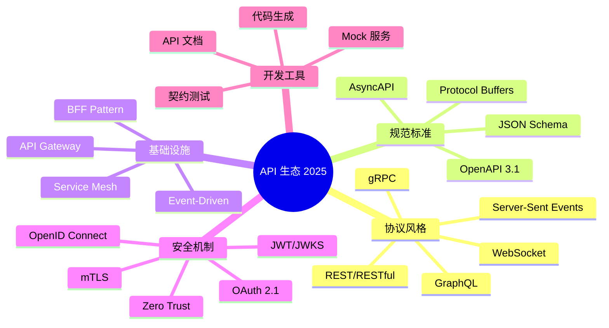

该思维导图呈现了 2025 年 API 生态的五大维度：协议风格涵盖 REST、GraphQL、gRPC 等；规范标准以 OpenAPI 3.1 与 AsyncAPI 为核心；基础设施层包含 API 网关、Service Mesh 与 BFF 模式；安全机制向 OAuth 2.1 与零信任演进；开发工具链覆盖代码生成、契约测试与 Mock 服务。理解这一全景有助于在 API 设计时做出符合生态趋势的技术选型。

## 2. 核心方法论

### 2.1 RESTful 架构风格深度解析

REST（Representational State Transfer）是 Roy Fielding 于 2000 年提出的架构风格，其核心约束包括：

| 约束条件 | 描述 | 实践要点 |
|---------|------|---------|
| 客户端-服务器分离 | 关注点分离，提升可移植性 | 前后端独立部署演进 |
| 无状态性 | 每个请求包含完整上下文 | 便于水平扩展 |
| 可缓存性 | 响应需明确缓存语义 | 减少网络开销 |
| 统一接口 | 资源标识、操作语义标准化 | 简化架构理解 |
| 分层系统 | 中间层透明处理 | 支持负载均衡、安全网关 |
| 按需代码（可选） | 服务器可扩展客户端功能 | 脚本下发场景 |

**资源导向设计原则**：

```
资源（Resource）→ 标识符（URI）→ 表征（Representation）→ 状态转移（State Transfer）
```

**HTTP 方法语义映射**：

| HTTP 方法 | CRUD 操作 | 幂等性 | 安全性 | 语义说明 |
|-----------|----------|--------|--------|---------|
| GET | Read | ✓ | ✓ | 获取资源表征 |
| POST | Create | ✗ | ✗ | 创建新资源 |
| PUT | Update/Replace | ✓ | ✗ | 完整替换资源 |
| PATCH | Update/Modify | ✗ | ✗ | 部分更新资源 |
| DELETE | Delete | ✓ | ✗ | 删除资源 |
| HEAD | Read Metadata | ✓ | ✓ | 获取资源元数据 |
| OPTIONS | Discovery | ✓ | ✓ | 获取支持的方法 |

**URI 设计规范**：

```
# 资源命名使用名词复数形式
GET    /api/v1/users              # 用户集合
GET    /api/v1/users/{userId}     # 单个用户
POST   /api/v1/users              # 创建用户
PUT    /api/v1/users/{userId}     # 替换用户
PATCH  /api/v1/users/{userId}     # 部分更新
DELETE /api/v1/users/{userId}     # 删除用户

# 子资源关系表达
GET    /api/v1/users/{userId}/orders           # 用户订单集合
GET    /api/v1/users/{userId}/orders/{orderId} # 特定订单

# 过滤、排序、分页通过查询参数实现
GET    /api/v1/users?status=active&sort=-createdAt&page=1&limit=20
```

### 2.2 GraphQL 适用场景分析

GraphQL 是 Facebook 于 2015 年开源的查询语言，解决了 REST 的部分痛点：

**核心特性**：

- **声明式数据获取**：客户端精确指定所需字段，避免过度获取（Over-fetching）和获取不足（Under-fetching）
- **强类型系统**：Schema 定义明确，支持编译时类型检查
- **单一端点**：所有查询通过 `/graphql` 端点处理
- **实时订阅**：原生支持 Subscription 实现实时数据推送

**REST vs GraphQL 对比**：

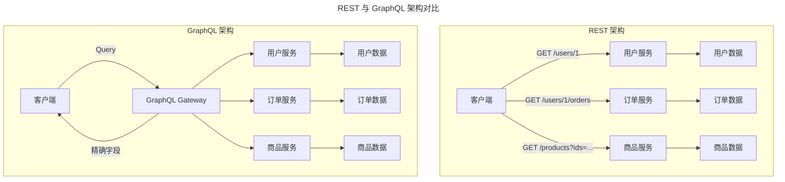

对比图揭示了两种架构的本质差异：REST 架构下客户端需多次请求不同端点获取关联数据，容易产生过度获取或获取不足；GraphQL 架构通过单一网关统一编排多个后端服务，客户端只需一次查询即可精确获取所需字段。这一差异使 GraphQL 在多端异构客户端与复杂数据聚合场景中具有显著优势。

**适用场景矩阵**：

| 场景特征 | 推荐方案 | 理由 |
|---------|---------|------|
| 资源结构简单、关系清晰 | REST | 实现简单、缓存友好 |
| 多端异构客户端、需求差异大 | GraphQL | 按需获取、减少请求 |
| 复杂数据聚合、BFF 层 | GraphQL | 统一编排、类型安全 |
| 公开 API、第三方集成 | REST + OpenAPI | 标准化、工具链成熟 |
| 实时数据推送需求 | GraphQL Subscription | 原生支持、开发效率高 |
| 高性能内部服务通信 | gRPC | 二进制协议、流式传输 |

### 2.3 gRPC 高性能场景应用

gRPC 是 Google 开源的高性能 RPC 框架，基于 HTTP/2 和 Protocol Buffers：

**技术优势**：

- **二进制协议**：Protocol Buffers 序列化效率高，体积小
- **HTTP/2 多路复用**：单一连接支持多请求并发
- **双向流式通信**：支持 Unary、Server Streaming、Client Streaming、Bidirectional Streaming
- **强类型契约**：`.proto` 文件定义服务契约，多语言代码生成
- **内置压缩**：支持 GZIP 压缩，减少网络传输

**服务定义示例**：

```protobuf
syntax = "proto3";

package order.v1;

option go_package = "github.com/example/gen/order/v1;orderv1";

import "google/protobuf/timestamp.proto";
import "google/protobuf/field_mask.proto";

service OrderService {
  rpc GetOrder(GetOrderRequest) returns (Order);
  rpc ListOrders(ListOrdersRequest) returns (stream Order);
  rpc CreateOrder(stream CreateOrderRequest) returns (CreateOrderResponse);
  rpc ProcessOrders(stream OrderRequest) returns (stream OrderResponse);
}

message Order {
  string order_id = 1;
  string user_id = 2;
  repeated OrderItem items = 3;
  OrderStatus status = 4;
  google.protobuf.Timestamp created_at = 5;
  google.protobuf.Timestamp updated_at = 6;
}

message GetOrderRequest {
  string order_id = 1;
  google.protobuf.FieldMask read_mask = 2;
}
```

### 2.4 协议选型决策树

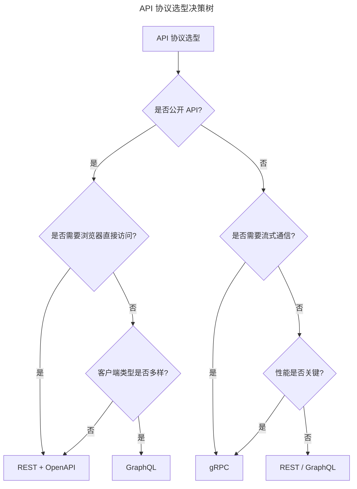

决策树以"是否公开 API"为首要分叉，公开 API 优先选择 REST + OpenAPI 以获得最佳标准化与工具链支持；内部 API 则根据流式通信需求与性能要求在 gRPC、REST、GraphQL 之间选择。客户端类型多样性是选择 GraphQL 的关键信号。

## 3. 关键流程

### 3.1 API 签名与协议设计

#### 请求/响应规范

**请求结构标准化**：

```json
{
  "method": "POST",
  "url": "/api/v1/orders",
  "headers": {
    "Content-Type": "application/json",
    "Accept": "application/json",
    "Authorization": "Bearer <token>",
    "X-Request-ID": "uuid-v4",
    "X-Correlation-ID": "trace-across-services",
    "Idempotency-Key": "client-generated-key"
  },
  "body": {
    "data": {
      "type": "order",
      "attributes": {
        "items": [...],
        "shipping_address": {...}
      },
      "relationships": {
        "user": {"data": {"type": "user", "id": "123"}}
      }
    }
  }
}
```

**响应结构标准化（JSON:API 规范）**：

```json
{
  "jsonapi": {"version": "1.1"},
  "data": {
    "type": "order",
    "id": "order-123",
    "attributes": {
      "status": "pending",
      "total": 299.99,
      "created_at": "2025-06-07T10:30:00Z"
    },
    "relationships": {
      "user": {
        "data": {"type": "user", "id": "user-456"},
        "links": {"related": "/api/v1/orders/order-123/user"}
      }
    },
    "links": {"self": "/api/v1/orders/order-123"}
  },
  "meta": {
    "request_id": "req-uuid",
    "timestamp": "2025-06-07T10:30:01Z"
  }
}
```

**错误响应标准化（RFC 9457 Problem Details，原 RFC 7807）**：

```json
{
  "type": "https://api.example.com/errors/insufficient-funds",
  "title": "Insufficient Funds",
  "status": 400,
  "detail": "Account balance $50.00 is insufficient for order total $299.99",
  "instance": "/api/v1/orders/order-123",
  "traceId": "trace-uuid-123",
  "errors": [
    {
      "code": "INSUFFICIENT_BALANCE",
      "field": "payment.amount",
      "message": "Required amount exceeds available balance"
    }
  ]
}
```

#### OpenAPI 3.1 规范实践

OpenAPI 3.1 是当前最新的 API 描述规范，与 JSON Schema 完全兼容：

```yaml
openapi: 3.1.0
info:
  title: Order Management API
  version: 1.2.0
  description: |
    Enterprise order management system API.
    Supports order lifecycle from creation to fulfillment.
  contact:
    name: API Support
    email: api@example.com
    url: https://developer.example.com
  license:
    name: Apache 2.0
    url: https://www.apache.org/licenses/LICENSE-2.0

servers:
  - url: https://api.example.com/v1
    description: Production
  - url: https://api.staging.example.com/v1
    description: Staging

tags:
  - name: Orders
    description: Order management operations
  - name: Users
    description: User account operations

paths:
  /orders:
    get:
      tags: [Orders]
      operationId: listOrders
      summary: List orders with filtering and pagination
      parameters:
        - $ref: '#/components/parameters/PageParam'
        - $ref: '#/components/parameters/LimitParam'
        - name: status
          in: query
          schema:
            type: string
            enum: [pending, processing, shipped, delivered, cancelled]
        - name: created_after
          in: query
          schema:
            type: string
            format: date-time
      responses:
        '200':
          description: Successful response
          content:
            application/json:
              schema:
                $ref: '#/components/schemas/OrderList'
              example:
                data:
                  - id: order-123
                    status: delivered
                    total: 299.99
                meta:
                  total: 150
                  page: 1
                  limit: 20
        '401':
          $ref: '#/components/responses/Unauthorized'
        '500':
          $ref: '#/components/responses/InternalError'
    
    post:
      tags: [Orders]
      operationId: createOrder
      summary: Create a new order
      requestBody:
        required: true
        content:
          application/json:
            schema:
              $ref: '#/components/schemas/CreateOrderRequest'
      responses:
        '201':
          description: Order created
          headers:
            Location:
              schema:
                type: string
                format: uri
          content:
            application/json:
              schema:
                $ref: '#/components/schemas/Order'
        '400':
          $ref: '#/components/responses/BadRequest'
        '422':
          $ref: '#/components/responses/ValidationError'

  /orders/{orderId}:
    parameters:
      - $ref: '#/components/parameters/OrderIdParam'
    
    get:
      tags: [Orders]
      operationId: getOrder
      summary: Get order by ID
      responses:
        '200':
          description: Successful response
          content:
            application/json:
              schema:
                $ref: '#/components/schemas/Order'
        '404':
          $ref: '#/components/responses/NotFound'

components:
  schemas:
    Order:
      type: object
      required: [id, status, items, total, created_at]
      properties:
        id:
          type: string
          format: uuid
          example: 550e8400-e29b-41d4-a716-446655440000
        status:
          $ref: '#/components/schemas/OrderStatus'
        items:
          type: array
          items:
            $ref: '#/components/schemas/OrderItem'
          minItems: 1
        total:
          type: number
          format: decimal
          minimum: 0
          exclusiveMinimum: true
        created_at:
          type: string
          format: date-time
        updated_at:
          type: string
          format: date-time

    OrderStatus:
      type: string
      enum: [pending, processing, shipped, delivered, cancelled]
      default: pending

    OrderItem:
      type: object
      required: [product_id, quantity, unit_price]
      properties:
        product_id:
          type: string
          format: uuid
        quantity:
          type: integer
          minimum: 1
          maximum: 100
        unit_price:
          type: number
          format: decimal

    CreateOrderRequest:
      type: object
      required: [items, shipping_address]
      properties:
        items:
          type: array
          items:
            $ref: '#/components/schemas/OrderItem'
        shipping_address:
          $ref: '#/components/schemas/Address'
        payment_method_id:
          type: string
          format: uuid

    OrderList:
      type: object
      properties:
        data:
          type: array
          items:
            $ref: '#/components/schemas/Order'
        meta:
          $ref: '#/components/schemas/PaginationMeta'

    PaginationMeta:
      type: object
      properties:
        total:
          type: integer
        page:
          type: integer
        limit:
          type: integer
        has_more:
          type: boolean

  parameters:
    OrderIdParam:
      name: orderId
      in: path
      required: true
      schema:
        type: string
        format: uuid
    PageParam:
      name: page
      in: query
      schema:
        type: integer
        minimum: 1
        default: 1
    LimitParam:
      name: limit
      in: query
      schema:
        type: integer
        minimum: 1
        maximum: 100
        default: 20

  responses:
    BadRequest:
      description: Bad request
      content:
        application/problem+json:
          schema:
            $ref: '#/components/schemas/ProblemDetail'
    Unauthorized:
      description: Authentication required
    NotFound:
      description: Resource not found
    ValidationError:
      description: Validation failed
    InternalError:
      description: Internal server error

  securitySchemes:
    BearerAuth:
      type: http
      scheme: bearer
      bearerFormat: JWT
      description: JWT access token
    ApiKeyAuth:
      type: apiKey
      in: header
      name: X-API-Key
    OAuth2:
      type: oauth2
      flows:
        authorizationCode:
          authorizationUrl: https://auth.example.com/oauth/authorize
          tokenUrl: https://auth.example.com/oauth/token
          scopes:
            read:orders: Read order information
            write:orders: Create and modify orders
            admin: Full administrative access

security:
  - BearerAuth: []
  - OAuth2: [read:orders]
```

#### API 版本管理策略

**版本管理方案对比**：

| 策略 | 实现方式 | 优点 | 缺点 | 适用场景 |
|-----|---------|-----|-----|---------|
| URI 路径版本 | `/api/v1/`, `/api/v2/` | 简单直观、易于路由 | URL 污染、缓存分离 | 大版本变更 |
| 查询参数版本 | `/api/resource?version=2` | URL 简洁 | 易被忽略、缓存复杂 | 小版本迭代 |
| Header 版本 | `Accept: application/vnd.api.v2+json` | URL 干净、RESTful | 调试不便、代理兼容性 | RESTful 纯粹主义 |
| 内容协商 | `Accept: application/json; version=2` | 符合 HTTP 语义 | 实现复杂 | 资源表征变化 |

**版本生命周期管理**：

```mermaid
---
title: API 版本生命周期状态机
---
stateDiagram-v2
    [*] --> Draft: 规划中
    Draft --> Current: 发布
    Current --> Deprecated: 新版本发布
    Deprecated --> Sunset: 通知下线
    Sunset --> Retired: 停止服务
    Retired --> [*]
    
    note right of Current
        默认版本
        完整支持
    end note
    
    note right of Deprecated
        维护模式
        仅修复严重 Bug
        返回 Warning Header
    end note
    
    note right of Sunset
        计划下线
        返回 Sunset Header
        迁移期 6-12 个月
    end note
```

状态机描述了 API 版本从 Draft 到 Retired 的完整生命周期：Current 为默认版本并提供完整支持；Deprecated 进入维护模式仅修复严重 Bug 并返回 Warning Header；Sunset 阶段返回 Sunset Header 并提供 6-12 个月迁移期；最终 Retired 停止服务。这一流程确保版本演进对消费者透明且可预期。

**弃用响应头规范**：

```http
HTTP/1.1 200 OK
Deprecation: true
Sunset: Sat, 31 Dec 2025 23:59:59 GMT
Link: </api/v2/orders>; rel="successor-version"
Link: </docs/migration/v1-to-v2>; rel="deprecation-help"
Warning: 299 - "API v1 is deprecated, migrate to v2 by 2025-12-31"
```

#### 向后兼容性设计

**兼容性变更分类**：

| 变更类型 | 兼容性 | 示例 |
|---------|--------|-----|
| 添加可选字段 | ✓ 向后兼容 | 响应新增 `metadata` 字段 |
| 添加可选参数 | ✓ 向后兼容 | 请求新增 `?include=details` |
| 添加新端点 | ✓ 向后兼容 | 新增 `/api/v1/analytics` |
| 添加新枚举值 | ⚠️ 部分兼容 | 客户端需处理新值 |
| 重命名字段 | ✗ 破坏性 | `user_name` → `username` |
| 删除字段 | ✗ 破坏性 | 移除 `legacy_id` |
| 修改数据类型 | ✗ 破坏性 | `integer` → `string` |
| 修改必填状态 | ✗ 破坏性 | 可选 → 必填 |

**平滑迁移模式**：

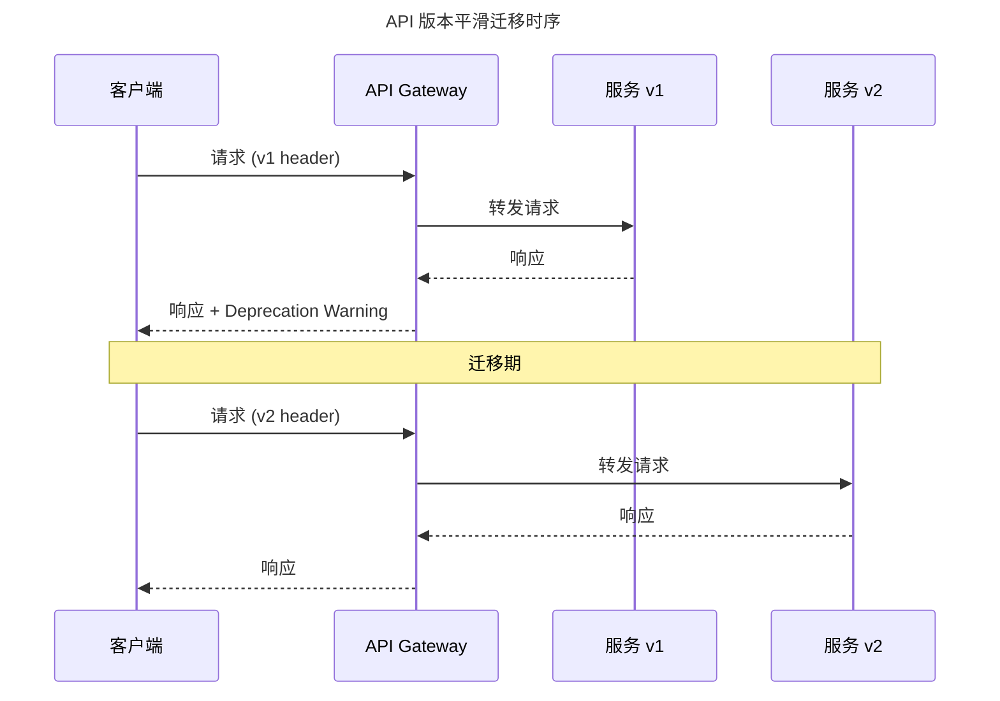

时序图展示了版本迁移期间的请求路由：迁移期内客户端仍可使用 v1 header 请求，网关在响应中附加 Deprecation Warning 提示迁移；客户端切换至 v2 header 后，网关将请求路由至新版本服务。这一双版本并行机制确保迁移过程不中断服务。

### 3.2 认证与安全

#### 认证机制对比

| 认证方式 | 适用场景 | 安全等级 | 实现复杂度 | 无状态支持 |
|---------|---------|---------|-----------|-----------|
| API Key | 服务间调用、简单集成 | 低 | 低 | ✓ |
| Basic Auth | 内部工具、测试环境 | 低 | 低 | ✗ |
| Session/Cookie | 传统 Web 应用 | 中 | 中 | ✗ |
| JWT | 微服务、移动应用 | 中高 | 中 | ✓ |
| OAuth 2.0 | 第三方授权、SSO | 高 | 高 | ✓ |
| mTLS | 零信任网络、服务网格 | 极高 | 高 | ✓ |

#### OAuth 2.1 / OIDC 认证流程

OAuth 2.1 简化并强化了 OAuth 2.0 的安全最佳实践：

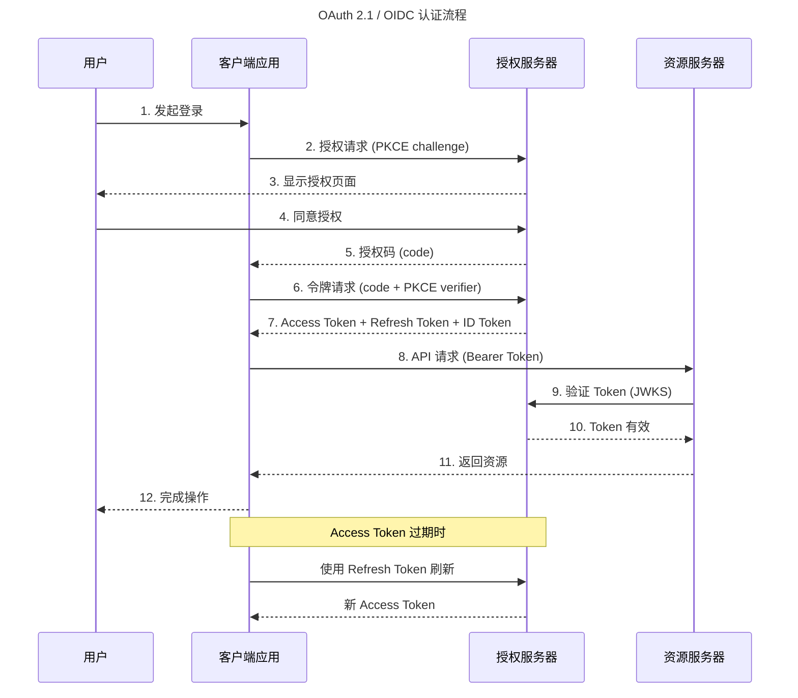

时序图完整呈现了 OAuth 2.1 的 12 步认证流程，其中 PKCE（Proof Key for Code Exchange）是关键安全增强——客户端在授权请求时发送 challenge，在令牌请求时发送 verifier，防止授权码被截获后被利用。Access Token 过期后可通过 Refresh Token 无需用户再次授权即获取新令牌。

**PKCE (Proof Key for Code Exchange) 实现**：

```javascript
import crypto from 'crypto';

function generatePKCE() {
  const verifier = crypto.randomBytes(32).toString('base64url');
  const challenge = crypto
    .createHash('sha256')
    .update(verifier)
    .digest('base64url');
  
  return {
    code_verifier: verifier,
    code_challenge: challenge,
    code_challenge_method: 'S256'
  };
}
```

#### JWT 安全实践

**JWT 结构与验证**：

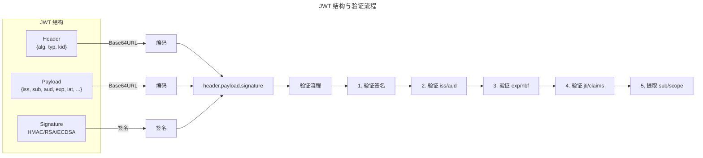

流程图展示了 JWT 的三段式结构（Header.Payload.Signature）与五步验证流程：先验证签名完整性，再依次校验签发者（iss）、受众（aud）、有效期（exp/nbf）、自定义声明（jti/claims），最后提取主体与权限范围。严格的验证顺序确保 Token 的真实性与有效性。

**安全配置清单**：

```yaml
jwt_security:
  algorithm:
    allowed: [RS256, RS384, RS512, ES256, ES384, ES512]
    forbidden: [HS256, none]  # 禁止对称算法和无签名
  
  claims:
    required: [iss, sub, aud, exp, iat]
    issuer_validation: true
    audience_validation: true
  
  token:
    access_token_ttl: 900      # 15 分钟
    refresh_token_ttl: 604800  # 7 天
    id_token_ttl: 3600         # 1 小时
  
  key_management:
    rotation_enabled: true
    jwks_cache_ttl: 3600
    key_id_required: true
  
  transmission:
    secure_cookie: true
    cookie_same_site: strict
    cookie_http_only: true
    authorization_header_only: true
```

#### mTLS 双向认证

mTLS（Mutual TLS）在服务间通信中提供最高安全等级：

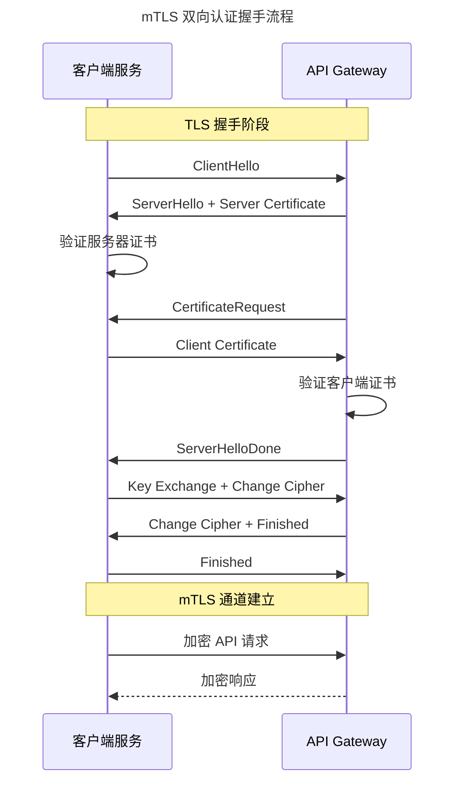

时序图展示了 mTLS 双向认证的完整握手过程：与单向 TLS 不同，mTLS 在服务器证书验证后额外增加客户端证书验证环节，确保通信双方身份均经过证书验证。这一机制是零信任网络与服务网格中服务间通信安全的基础。

#### 速率限制与配额管理

**限流策略矩阵**：

| 策略 | 算法 | 特点 | 适用场景 |
|-----|-----|-----|---------|
| 固定窗口 | 计数器 | 简单、边界突发 | 简单配额 |
| 滑动窗口 | 加权计数 | 平滑、精确 | 精确限流 |
| 令牌桶 | Token Bucket | 允许突发、灵活 | API 网关 |
| 漏桶 | Leaky Bucket | 恒定速率、削峰 | 流量整形 |

**多维度限流配置**：

```yaml
rate_limiting:
  global:
    requests_per_second: 10000
    concurrent_connections: 5000
  
  per_endpoint:
    /api/v1/orders:
      get:
        requests_per_minute: 1000
        burst: 100
      post:
        requests_per_minute: 100
        burst: 20
    
    /api/v1/search:
      requests_per_minute: 500
      cost_weight: 2  # 搜索消耗更多配额
  
  per_client:
    tier_free:
      requests_per_day: 1000
      requests_per_minute: 10
    tier_pro:
      requests_per_day: 100000
      requests_per_minute: 100
    tier_enterprise:
      requests_per_day: unlimited
      requests_per_minute: 1000
  
  headers:
    limit: X-RateLimit-Limit
    remaining: X-RateLimit-Remaining
    reset: X-RateLimit-Reset
    retry_after: Retry-After
```

### 3.3 API 架构模式

#### API Gateway 模式

API Gateway 是微服务架构的核心基础设施组件：

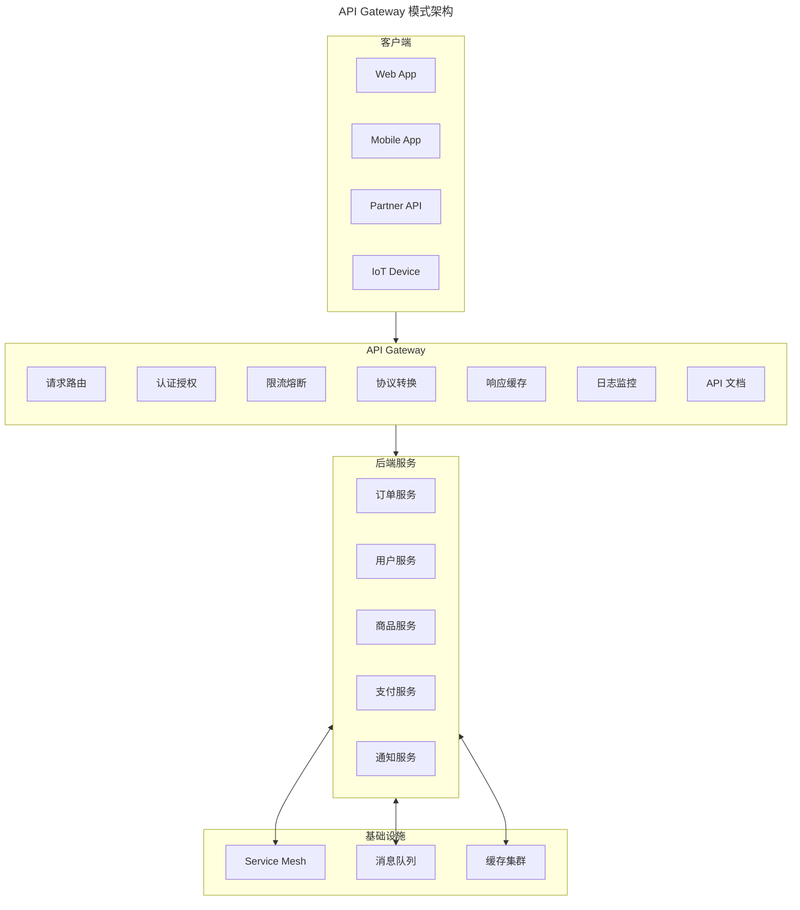

架构图展示了 API Gateway 作为客户端与后端服务之间的统一入口：所有客户端请求经网关路由至后端服务，网关集中承担认证授权、限流熔断、协议转换、响应缓存等横切关注点。后端服务通过 Service Mesh、消息队列与缓存集群获得分布式能力支撑。

**Gateway 核心能力**：

| 能力层 | 功能 | 实现技术 |
|-------|-----|---------|
| 安全层 | 认证、授权、加密、WAF | OAuth2、JWT、mTLS、ModSecurity |
| 流量层 | 限流、熔断、重试、超时 | Token Bucket、Circuit Breaker |
| 路由层 | 请求路由、负载均衡、灰度发布 | DNS、Nginx、Envoy、Kong |
| 转换层 | 协议转换、请求/响应改写 | gRPC-JSON Transcoding |
| 可观测层 | 日志、指标、追踪 | OpenTelemetry、Prometheus、Jaeger |
| 生命周期 | 文档、Mock、版本管理 | OpenAPI、Prism、Spec Sync |

#### BFF（Backend for Frontend）模式

BFF 为不同客户端提供定制化的 API 聚合层：

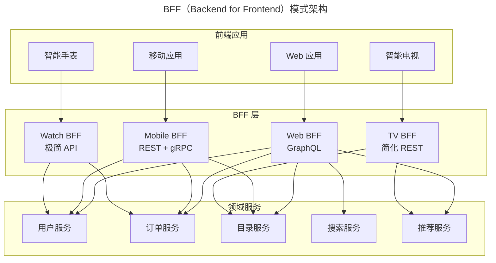

架构图展示了 BFF 模式的核心思想：为每种前端类型（Web、移动、电视、手表）配备专属的 BFF 服务，各 BFF 仅暴露该前端所需的最小 API 集合，并在 BFF 层完成多服务数据聚合。这一模式避免了"一个 API 服务所有端"导致的过度获取与格式不适配问题。

**BFF 设计原则**：

- **单一职责**：每个 BFF 服务仅服务于特定前端类型
- **最小暴露**：仅暴露该前端所需的最小 API 集合
- **数据聚合**：在 BFF 层完成多服务数据聚合，减少前端请求
- **格式适配**：根据前端特性优化响应格式（字段、精度、编码）
- **独立演进**：BFF 与前端同生命周期，独立部署

#### 事件驱动 API

事件驱动架构支持松耦合、高扩展的异步通信：

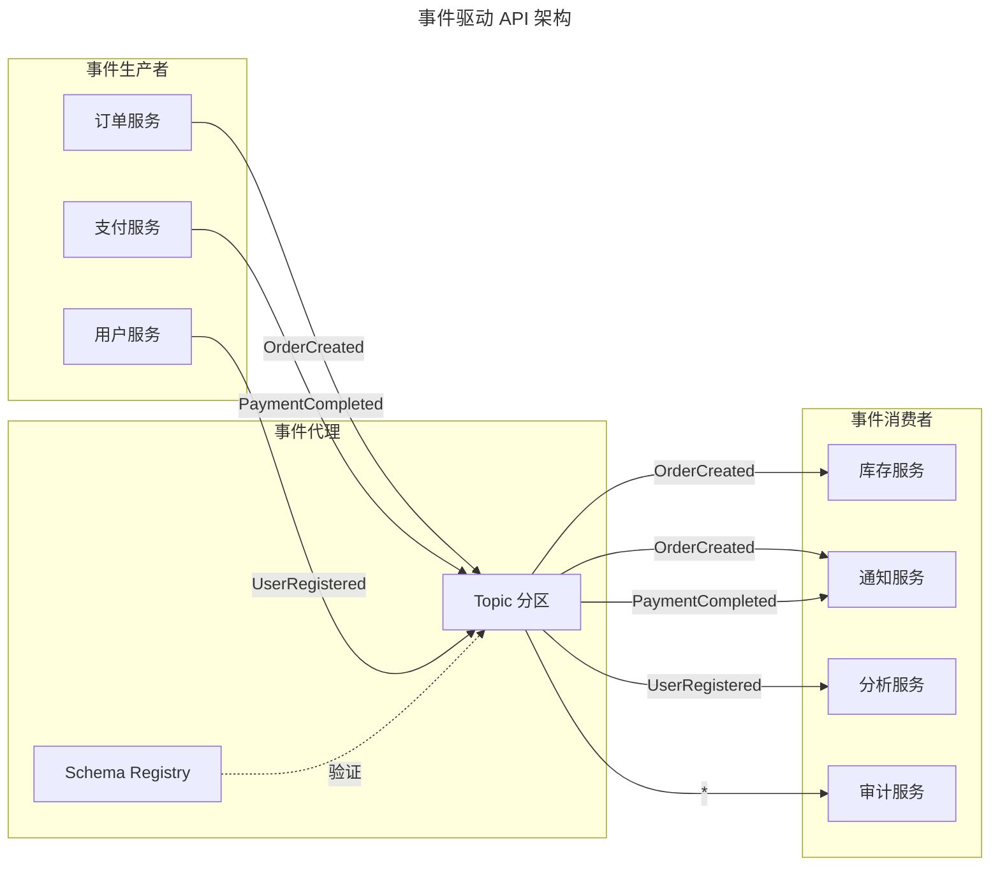

架构图展示了事件驱动 API 的生产者-代理-消费者三方模型：生产者将事件发布至事件代理的 Topic 分区，消费者按订阅关系消费事件。Schema Registry 在事件进入 Topic 前进行 Schema 验证，确保事件结构的兼容性。审计服务通过订阅全部事件（`*`）实现完整审计线索。

**CloudEvents 规范**：

```json
{
  "specversion": "1.0",
  "type": "com.example.order.created",
  "source": "/services/order-service",
  "id": "A234-1234-1234",
  "time": "2025-06-07T10:30:00Z",
  "datacontenttype": "application/json",
  "dataschema": "https://schemas.example.com/order/v1",
  "subject": "order-12345",
  "data": {
    "orderId": "order-12345",
    "userId": "user-67890",
    "items": [...],
    "total": 299.99
  },
  "extension_traceparent": "00-4bf92f3577b34da6a3ce929d0e0e4736-00f067aa0ba902b7-01"
}
```

## 4. 工具与实战

### 4.1 框架选型指南

**主流 API 框架对比（2025）**：

| 语言 | REST 框架 | GraphQL 框架 | gRPC 框架 | 特点 |
|-----|----------|-------------|----------|-----|
| Go | Gin, Echo, Fiber | gqlgen | grpc-go | 高性能、云原生 |
| Java/Kotlin | Spring Boot, Quarkus | Netflix DGS | grpc-java | 企业级、生态丰富 |
| Node.js | Express, Fastify, NestJS | Apollo Server | @grpc/grpc-js | 全栈友好、快速开发 |
| Python | FastAPI, Flask | Strawberry, Ariadne | grpcio | AI/ML 集成、简洁 |
| Rust | Actix, Axum | async-graphql | tonic | 极致性能、安全 |
| C# | ASP.NET Core | Hot Chocolate | grpc-dotnet | 微软生态、企业级 |

**选型决策因素**：

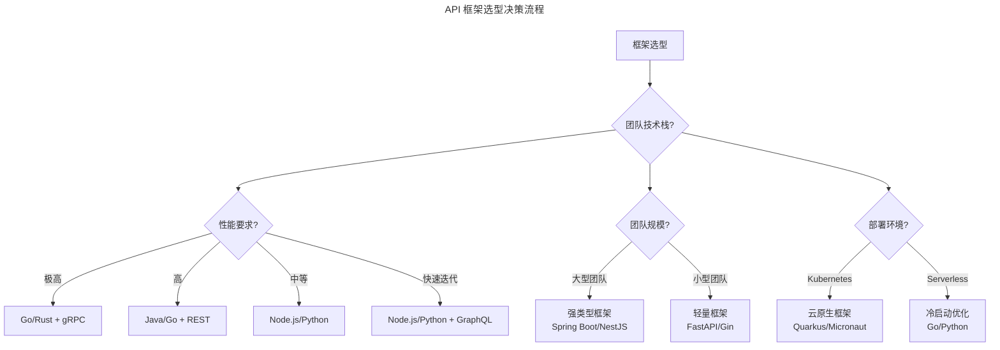

决策流程图从团队技术栈出发，根据性能要求、团队规模与部署环境三个维度进行选型：极高性能需求选择 Go/Rust + gRPC；大型团队偏好强类型框架；Kubernetes 环境选择云原生框架；Serverless 环境注重冷启动优化。三个维度的组合决策确保框架选型与团队实际匹配。

### 4.2 文档自动生成

**OpenAPI 代码生成工具链**：

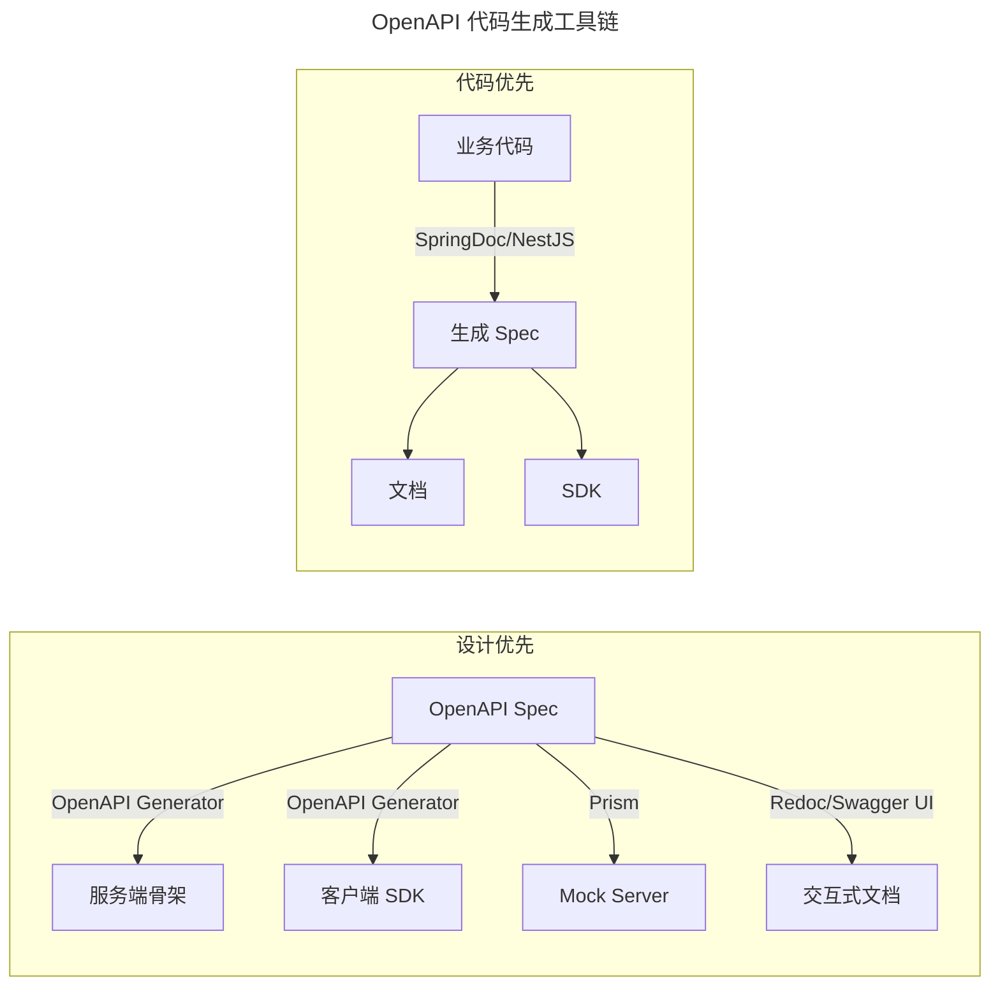

工具链图对比了"设计优先"与"代码优先"两种 API 文档生成路径：设计优先从 OpenAPI Spec 出发，通过 Generator 同时生成服务端骨架、客户端 SDK、Mock Server 与交互式文档；代码优先则从业务代码通过注解生成 Spec，再衍生文档与 SDK。设计优先更适合跨团队协作，代码优先更适合快速迭代。

**OpenAPI Generator 多语言 SDK 生成**：

```bash
# 生成 TypeScript Axios 客户端
openapi-generator-cli generate \
  -i openapi.yaml \
  -g typescript-axios \
  -o ./sdk/typescript \
  --additional-properties=npmName=@example/api-client,npmVersion=1.0.0

# 生成 Go 客户端
openapi-generator-cli generate \
  -i openapi.yaml \
  -g go \
  -o ./sdk/go \
  --additional-properties=packageName=apiclient,isGoSubmodule=true

# 生成 Python 客户端
openapi-generator-cli generate \
  -i openapi.yaml \
  -g python \
  -o ./sdk/python \
  --additional-properties=packageName=example_api_client,packageVersion=1.0.0
```

### 4.3 契约测试

契约测试确保 API 提供者与消费者之间的兼容性：

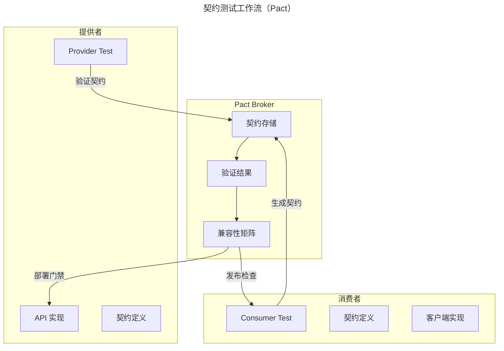

工作流图展示了契约测试的双向验证机制：消费者测试生成契约并存入 Pact Broker，提供者测试从 Broker 拉取契约进行验证，验证结果形成兼容性矩阵。矩阵既作为消费者的发布检查，也作为提供者的部署门禁，确保接口变更不会破坏消费者。

**Pact 契约测试示例**：

```javascript
// 提供者验证（Provider Verification）：从 Pact Broker 拉取消费者契约并验证
const { Verifier } = require('@pact-foundation/pact');
const path = require('path');

describe('Order API Provider Verification', () => {
  it('should match the order creation contract', async () => {
    const result = await new Verifier({
      providerBaseUrl: 'http://localhost:8080',
      pactUrls: [
        path.resolve(__dirname, './pacts/order-consumer-order-provider.json')
      ],
      providerVersion: '1.2.0',
      providerVersionTags: ['main'],
      publishVerificationResult: true,
      stateHandlers: {
        'user exists': () => userRepository.insert(testUser),
        'order is empty': () => orderRepository.clear()
      }
    }).verifyProvider();
    
    expect(result.matched).toBe(true);
  });
});
```

### 4.4 Mock 服务实践

**Prism Mock Server 配置**：

```yaml
# prism-config.yaml
routes:
  - path: /api/*
    strategy: mock
    mock:
      dynamic: true
      code: 200
      delay:
        min: 100
        max: 500
      examples:
        - name: success
          code: 200
          mediaType: application/json
          body:
            id: "mock-order-123"
            status: "pending"
        - name: error
          code: 400
          mediaType: application/problem+json
          body:
            type: "https://example.com/errors/validation"
            title: "Validation Error"

logging:
  level: info
  format: json

cors:
  allowedOrigins: ["*"]
  allowedMethods: ["GET", "POST", "PUT", "DELETE"]
```

### 4.5 设计最佳实践

| 实践领域 | 最佳实践 | 反模式 |
|---------|---------|-------|
| 资源命名 | 使用名词复数、层级清晰 | 动词路径、深层嵌套 |
| 响应格式 | 统一结构、包含元数据 | 格式不一致、缺少错误详情 |
| 错误处理 | 标准错误码、可追溯 ID | 通用错误消息、暴露堆栈 |
| 分页 | 游标分页、包含总数 | 偏移分页大数据集、无边界 |
| 过滤排序 | 查询参数、支持多字段 | 请求体过滤、硬编码排序 |
| 版本管理 | 明确策略、弃用通知 | 静默破坏性变更 |
| 安全 | 最小权限、审计日志 | 过度授权、敏感信息泄露 |
| 性能 | 响应压缩、条件请求 | 无限制响应、无缓存策略 |

### 4.6 性能优化清单

```yaml
api_performance:
  request:
    - 启用 HTTP/2 或 HTTP/3
    - 启用 Gzip/Brotli 压缩
    - 使用 Keep-Alive 连接复用
    - 批量请求支持
  
  response:
    - 分页限制响应大小
    - 字段选择减少传输
    - ETag 支持 304 Not Modified
    - Cache-Control 头设置
  
  infrastructure:
    - CDN 缓存静态资源
    - API Gateway 响应缓存
    - 数据库查询优化
    - 连接池配置
  
  monitoring:
    - P50/P95/P99 延迟监控
    - 错误率告警
    - 流量异常检测
    - 容量规划预警
```

## 5. 常见误区

### 5.1 常见陷阱与解决方案

**陷阱 1：过度获取与获取不足**

```json
// 问题：REST 返回过多字段
GET /api/v1/users/123
Response: { id, name, email, address, phone, preferences, ... }  // 100+ 字段

// 解决方案 1：字段选择
GET /api/v1/users/123?fields=id,name,email

// 解决方案 2：GraphQL 精确查询
query { user(id: "123") { id name email } }
```

**陷阱 2：N+1 查询问题**

```javascript
// 问题：循环调用 API
for (const order of orders) {
  const user = await fetchUser(order.userId);  // N 次请求
}

// 解决方案：批量查询或包含参数
GET /api/v1/orders?include=user
// 或
GET /api/v1/users?ids=user1,user2,user3
```

**陷阱 3：缺少幂等性设计**

```javascript
// 问题：重复提交创建多个订单
POST /api/v1/orders
{ "items": [...] }

// 解决方案：幂等键
POST /api/v1/orders
Headers: { "Idempotency-Key": "client-uuid-123" }
Body: { "items": [...] }

// 服务端存储幂等键，重复请求返回原结果
```

**陷阱 4：时间处理不一致**

```json
// 问题：时区混乱
{ "created_at": "2025-06-07 10:30:00" }  // 什么时区？

// 解决方案：统一 UTC + ISO 8601
{ "created_at": "2025-06-07T10:30:00Z" }
// 或带时区偏移
{ "created_at": "2025-06-07T18:30:00+08:00" }
```

### 5.2 设计误区

- **动词路径**：URI 中使用动词（如 `/api/v1/createOrder`）而非名词复数，违反 RESTful 资源导向原则
- **深层嵌套**：URI 层级过深（如 `/users/{id}/orders/{id}/items/{id}/attributes/{id}`），导致路由复杂且缓存困难
- **通用错误消息**：返回"Something went wrong"而非结构化错误码与 Trace ID，使消费者无法定位问题
- **静默破坏性变更**：在未发布弃用通知的情况下删除字段或修改数据类型，破坏消费者集成
- **过度授权**：授予超出业务需要的权限范围，违反最小权限原则
- **无限制响应**：返回全部数据不分页，导致响应过大与性能问题
- **无缓存策略**：缺失 Cache-Control 与 ETag，导致重复请求与带宽浪费

## 6. 进阶延展

### 6.1 AI 原生 API

大语言模型（LLM）正在重塑 API 设计范式：

**LLM 友好 API 设计**：

```yaml
ai_native_api:
  design_principles:
    - 语义清晰的端点命名
    - 完整的 OpenAPI 描述
    - 丰富的示例和错误说明
    - 结构化的错误响应
  
  llm_integration:
    - Function Calling 接口
    - 语义搜索 API
    - 向量数据库接口
    - 流式响应支持
  
  tools:
    - LangChain API 集成
    - OpenAI Function 定义
    - Semantic Kernel 插件
```

**OpenAI Function Calling 示例**：

```json
{
  "type": "function",
  "function": {
    "name": "create_order",
    "description": "创建新订单，包含商品列表和配送地址",
    "parameters": {
      "type": "object",
      "properties": {
        "items": {
          "type": "array",
          "items": {
            "type": "object",
            "properties": {
              "product_id": {"type": "string", "description": "商品ID"},
              "quantity": {"type": "integer", "minimum": 1}
            }
          }
        },
        "shipping_address": {
          "type": "object",
          "description": "配送地址"
        }
      },
      "required": ["items", "shipping_address"]
    }
  }
}
```

### 6.2 实时 API 与流式通信

**WebSocket vs Server-Sent Events vs WebRTC**：

| 特性 | WebSocket | SSE | WebRTC |
|-----|----------|-----|--------|
| 通信方向 | 全双工 | 单向（服务器→客户端） | P2P 全双工 |
| 协议 | ws:// / wss:// | HTTP/HTTPS | 专有协议 |
| 重连机制 | 需自行实现 | 浏览器自动重连 | ICE 重连 |
| 二进制支持 | ✓ | 需编码 | ✓ |
| 浏览器支持 | 广泛 | 广泛 | 广泛 |
| 适用场景 | 聊天、游戏、协作 | 通知、股票行情 | 音视频、P2P |

**GraphQL Subscription 实时数据**：

```graphql
subscription OnOrderStatusChanged($orderId: ID!) {
  orderStatusChanged(orderId: $orderId) {
    id
    status
    updatedAt
    tracking {
      carrier
      trackingNumber
      location
    }
  }
}
```

### 6.3 API 经济与开放平台

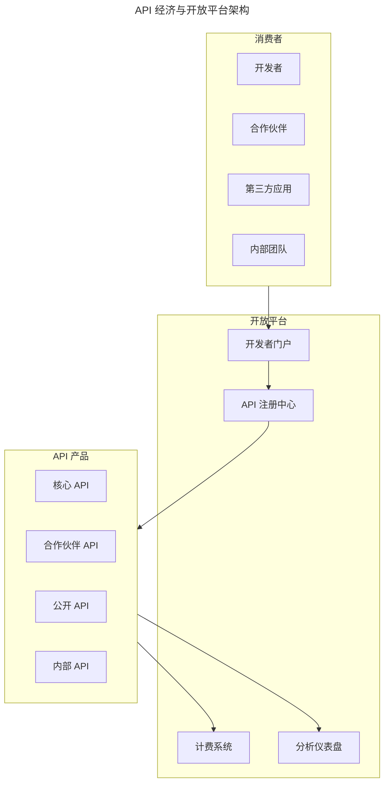

架构图展示了 API 经济的四方模型：消费者通过开发者门户访问 API 注册中心，注册中心管理核心、合作伙伴、公开与内部四类 API 产品，API 产品同时对接计费系统与分析仪表盘。这一模型将 API 视为产品进行全生命周期管理，是平台战略的核心资产。

**API 产品化指标**：

| 指标类别 | 关键指标 | 说明 |
|---------|---------|-----|
| 采用指标 | 注册开发者数、API 调用量 | 平台吸引力 |
| 活跃指标 | MAU、调用增长率 | 生态健康度 |
| 质量指标 | 可用性、延迟 P95、错误率 | 服务质量 |
| 商业指标 | API 收入、ARPU、转化率 | 商业价值 |
| 开发者体验 | 文档满意度、集成时间、NPS | 开发者体验 |

### 6.4 总结

API 设计是一项需要平衡多方因素的工程艺术。从 RESTful 的资源导向设计，到 GraphQL 的精确查询，再到 gRPC 的高性能通信，每种方案都有其适用场景。2025 年的 API 工程师需要：

1. **掌握核心原则**：RESTful 约束、幂等性、向后兼容是永恒的基础
2. **理解协议选型**：根据场景选择 REST、GraphQL 或 gRPC
3. **重视安全实践**：OAuth 2.1、JWT、mTLS 构建零信任安全体系
4. **善用架构模式**：API Gateway、BFF、事件驱动解决复杂场景
5. **拥抱工程实践**：契约测试、文档生成、Mock 服务提升开发效率
6. **关注发展趋势**：AI 原生 API、实时通信、API 经济塑造未来

API 的演进是一个持续迭代的过程。正如原文所述，一套成熟的 API 需要通过不断演化迭代而来。在特定的时间点，当前的设计就是最优方案——关键在于建立可演进的基础，为未来的变化留出空间。

### 6.5 延伸阅读

**规范标准**：

- [OpenAPI Specification 3.1.0](https://spec.openapis.org/oas/v3.1.0)
- [JSON:API Specification v1.1](https://jsonapi.org/format/)
- [RFC 9110 - HTTP Semantics](https://httpwg.org/specs/rfc9110.html)
- [RFC 9457 - Problem Details for HTTP APIs](https://www.rfc-editor.org/rfc/rfc9457)（取代 RFC 7807）
- [RFC 8252 - OAuth 2.0 for Native Apps](https://tools.ietf.org/html/rfc8252)
- [OAuth 2.1 Draft](https://datatracker.ietf.org/doc/html/draft-ietf-oauth-v2-1)
- [CloudEvents Specification v1.0.2](https://github.com/cloudevents/spec)
- [AsyncAPI Specification v3.0](https://www.asyncapi.com/docs/reference/specification)

**推荐书籍**：

- 《API Design Patterns》- JJ Geewax
- 《Designing Web APIs》- Brenda Jin, Saurabh Sahni, Amir Shevat
- 《Practical API Architecture and Development with Azure》- Eldert Grootenboer
- 《Building Microservices》- Sam Newman
- 《API Security in Action》- Neil Madden

**工具资源**：

| 类别 | 工具 | 用途 |
|-----|-----|-----|
| API 设计 | Stoplight Studio, Insomnia | 可视化 API 设计 |
| 文档生成 | Redoc, Swagger UI, Elements | 交互式文档 |
| Mock 服务 | Prism, Mockoon, WireMock | API 模拟 |
| 测试 | Postman, k6, Dredd | API 测试 |
| 契约测试 | Pact, Schemathesis | 契约验证 |
| Gateway | Kong, Envoy, APISIX | API 网关 |
| 监控 | Datadog, New Relic, Prometheus | 可观测性 |
