# 中美支付技术体系：架构、生态与工程实践

> **适用范围**：支付系统工程师、后端架构师、跨境业务技术负责人、金融科技产品经理，以及需要理解中美支付生态差异的技术管理者。
>
> **更新摘要（v2 · 2026-08 更新）**：
> - 结构化升级为 6 节骨架（导言 / 核心方法论 / 关键流程 / 工具与实战 / 常见误区 / 进阶延展）
> - 所有 Mermaid 图补充 `title` frontmatter，并确保每张图后附文字解读
> - 将原"参考资料"融入"进阶延展"节，保持内容连贯
> - 保留全部 2025 年数据、术语英文对照、代码示例与对比矩阵

---

## 1. 导言

### 1.1 全球支付生态 2025

支付系统是价值转移的基础设施——将资金从付款方安全、高效地转移至收款方。根据 Global Payments 第十一届《全球支付报告》（2025）数据，全球数字钱包交易额已达 13.8 万亿美元，占电商交易额 56%、POS 交易额 33%，全球钱包用户约 45 亿。中国以 POS 场景 89%、电商场景 92% 的数字支付渗透率位居全球首位。

支付场景涵盖：零售 POS、电子商务、账单支付、P2P 转账、B2B 结算、薪资发放、跨境汇款等。按发起方式可分为：

| 维度 | 收款方发起（Pull） | 付款方发起（Push） |
|------|-------------------|-------------------|
| 典型场景 | 刷卡消费、订阅扣款 | 银行转账、P2P 付款 |
| 信息需求 | 付款方账号/令牌 | 收款方账号/地址 |
| 风险特征 | 需授权验证 | 需身份认证 |

### 1.2 支付系统核心定义

支付系统的本质是**清算与结算**：

- **清算（Clearing）**：交易指令的传输、确认与净额计算
- **结算（Settlement）**：资金在最终账户间的实际划转
- **授权（Authorization）**：付款方银行对交易的事前批准
- **捕获（Capture）**：将授权转化为实际扣款指令
- **对账（Reconciliation）**：多方账务记录的一致性校验

理解清算与结算的分离是把握支付系统架构的钥匙：清算是"信息的流动"，结算是"资金的流动"，两者在时间上往往解耦（如 T+1 结算），这为支付系统的分布式设计与风险控制提供了基础。

---

## 2. 核心方法论

### 2.1 四层架构模型

现代支付系统可抽象为四层架构：

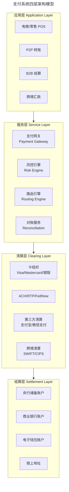

四层架构的核心价值在于**关注点分离**：应用层关注业务场景，服务层提供横切能力（风控、路由、对账），清算层对接多方网络，结算层完成资金最终划转。工程师在设计与排障时，先定位问题所属层级，再沿层间接口追踪，可大幅缩短定位时间。

### 2.2 关键概念

| 概念 | 说明 |
|------|------|
| 收单方（Acquirer） | 为商户处理卡交易的金融机构 |
| 发卡方（Issuer） | 向持卡人发行支付卡的金融机构 |
| ISV | 独立软件供应商，为商户集成支付能力 |
| PSP | 支付服务提供商，聚合多种支付方式 |
| MDR | 商户折扣率，商户为每笔交易支付的手续费比例 |
| Interchange | 发卡方向收单方收取的网络费用 |
| Chargeback | 持卡人发起的退款争议 |
| T+0/T+1/T+2 | 交易日至结算日的间隔 |

### 2.3 中美支付生态对比

#### 2.3.1 美国支付生态

美国支付体系以**卡基支付**为核心，呈现多网络并存的格局：

**卡支付网络**

| 类型 | 代表 | 特征 |
|------|------|------|
| 信用卡 | Visa、Mastercard、Amex、Discover | MDR 1.5%–3.5%，Chargeback 风险高 |
| 借记卡 | Visa Debit、Mastercard Debit | MDR 0.05%–0.8%（受 Durbin 修正案上限约束） |
| 预付卡 | Green Dot、Netspend | 闭环/半闭环，限额管理 |

信用卡交易笔数约占美国非现金交易的 20%，但交易额仅占约 3%（因高 MDR 限制了大额场景使用）。

**ACH 与实时支付**

| 网络 | 上线时间 | 结算速度 | 适用场景 |
|------|---------|---------|---------|
| ACH | 1970s | T+1 至 T+2（Same-day ACH 可达当天） | 薪资、账单、B2B |
| RTP（The Clearing House） | 2017 | 实时（秒级） | P2P、即时账单支付 |
| FedNow | 2023.07 | 实时（秒级），7×24 | 全场景即时支付 |

FedNow 截至 2025 年已有约 1,000 家金融机构接入（全美 9,000+ 银行），正在逐步替代传统 ACH 的大额实时场景。ACH 仍以 60%+ 的交易额占比主导 B2B 和薪资发放。

**P2P 支付平台**

| 平台 | 母公司 | 2024 年 TPV | 核心机制 |
|------|--------|------------|---------|
| Zelle | Early Warning Services（银行联盟） | ~$1.0T | 银行账户直连，即时到账 |
| Venmo | PayPal | ~$275B | 社交支付，余额/卡/银行 |
| Cash App | Block（原 Square） | ~$60B | $Cashtag，Cash Card，BTC 交易 |

Zelle 凭借银行联盟的信任背书和零手续费，在 P2P 转账领域占据绝对优势。

**数字钱包**

- **Apple Pay**：基于 NFC + Tokenization，2025 年美国 NFC 支付占比约 6%，增长缓慢
- **Google Pay**：NFC + HCE 架构
- **PayPal**：4.3 亿+活跃账户，电商支付主导，One Touch 免密体验
- **Cash App**：从 P2P 扩展至 Cash Card、Direct Deposit、BTC

**Square/Block 生态**

Square（2021 年更名 Block）已从移动读卡器发展为完整商务生态：

| 产品 | 定位 |
|------|------|
| Square POS | 全渠道销售终端（硬件 + 软件） |
| Square Online | 电商建站 |
| Cash App | 消费者金融超级应用 |
| Square Banking | 商户贷款与储蓄 |
| Afterpay（BNPL） | 先买后付 |
| Spiral | BTC/区块链开发 |
| TIDAL | 音乐流媒体 |

技术特征：音频口读卡器 → 芯片卡/NFC 读卡器 → API 优先架构 → 开发者平台。

#### 2.3.2 中国支付生态

中国支付体系以**二维码支付**为核心，形成双寡头格局：

**支付宝**

| 维度 | 数据（2025） |
|------|-------------|
| 活跃用户 | 10 亿+ |
| 市场份额 | 约 36%–49%（按统计口径不同） |
| 电商场景优势 | 淘宝/天猫生态闭环 |
| 技术峰值 | 双 11 峰值 54.4 万笔/秒（2019） |
| 核心能力 | 担保交易、花呗（BNPL）、芝麻信用、跨境支付 |

支付宝从担保交易起步，已发展为涵盖支付、信贷、理财、保险的金融科技平台。其技术架构经历了从单体到微服务、从 Oracle 到 OceanBase 的演进，是分布式支付系统的标杆实践。

**微信支付**

| 维度 | 数据（2025） |
|------|-------------|
| 活跃用户 | 9 亿+（基于微信 13 亿+ MAU） |
| 市场份额 | 约 50%–60%（线下场景优势显著） |
| 线下场景 | 小额高频、社交红包、小程序支付 |
| 核心能力 | 红包、小程序支付、微信分账、跨境支付 |

微信支付依托社交关系链，在线下小额高频场景占据主导。2025 年 Q1 数据显示微信支付市场份额约 59.7%，支付宝约 36.2%，两者合计超 90%。

**数字人民币（e-CNY）**

| 维度 | 说明 |
|------|------|
| 定位 | 流通中现金（M0）的数字形态 |
| 运营模式 | 央行—商业银行双层运营体系 |
| 技术架构 | 中心化管理的分布式账本（非公有链） |
| 核心特性 | 可控匿名、双离线支付、可编程性（智能合约） |
| 试点范围 | 17 省 26 城试点，覆盖零售、政务、交通等场景 |
| 跨境探索 | mBridge 多边央行数字货币桥项目 |

**其他参与者**

- **银联云闪付**：NFC + 二维码双模，银行系支付入口
- **抖音支付**：字节跳动旗下，依托抖音电商场景
- **拉卡拉**：线下 POS 收单
- **合众支付/苏宁支付**：垂直场景支付

#### 2.3.3 中美支付生态对比图

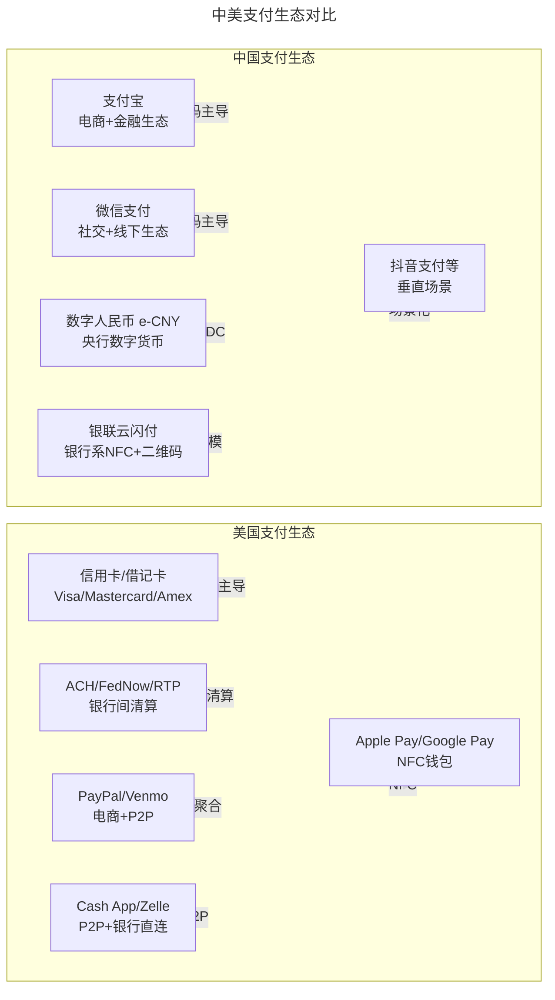

上图清晰呈现了中美支付生态的根本分野：美国以卡基（Pull 模式）为骨架，多网络并存；中国以二维码（Push 模式）为骨架，双寡头集中。这种差异源于监管路径（市场驱动 vs 牌照准入）、基础设施历史（银行卡普及度）与用户习惯（社交支付入口）的共同作用。

#### 2.3.4 核心差异总结

| 维度 | 美国 | 中国 |
|------|------|------|
| 主导模式 | 卡基支付（Pull 模式） | 二维码支付（Push 模式） |
| 清算网络 | 多网络并存（Visa/MC/ACH/FedNow） | 双寡头（支付宝/微信支付）+ 银联 |
| 手续费水平 | 信用卡 1.5%–3.5%，借记卡 0.05%–0.8% | 0.6% 标准费率（线下），0.6%–1.0%（线上） |
| P2P 主流 | Zelle（银行直连） | 微信红包/转账 |
| NFC 渗透 | 约 6%（增长缓慢） | 极低（二维码绝对主导） |
| 二维码渗透 | 极低 | >90% 线下场景 |
| 监管模式 | 市场驱动 + 事后监管 | 牌照准入 + 事前监管 |
| 跨境能力 | SWIFT + 卡组织全球网络 | CIPS + 钱包出海 + mBridge |

---

## 3. 关键流程

### 3.1 卡支付清算流程

以信用卡交易为例，完整生命周期如下：

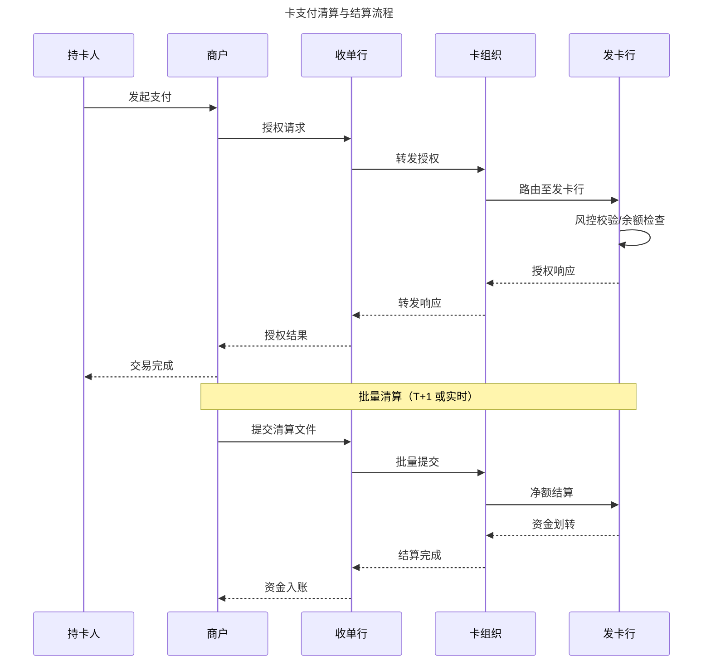

该流程的关键特征是**授权与清算的分离**：持卡人发起支付时仅完成授权（冻结额度），实际资金划转在 T+1 或实时批量清算时发生。这种分离使商户在交易完成时获得"承诺"而非"资金"，也解释了为何 Chargeback（退款争议）可以在交易完成后发起——因为清算与结算可能尚未最终完成。

### 3.2 Apple Pay NFC 支付流程

NFC（Near Field Communication）基于 ISO/IEC 14443 标准，工作频率 13.56 MHz，通信距离 < 10 cm。

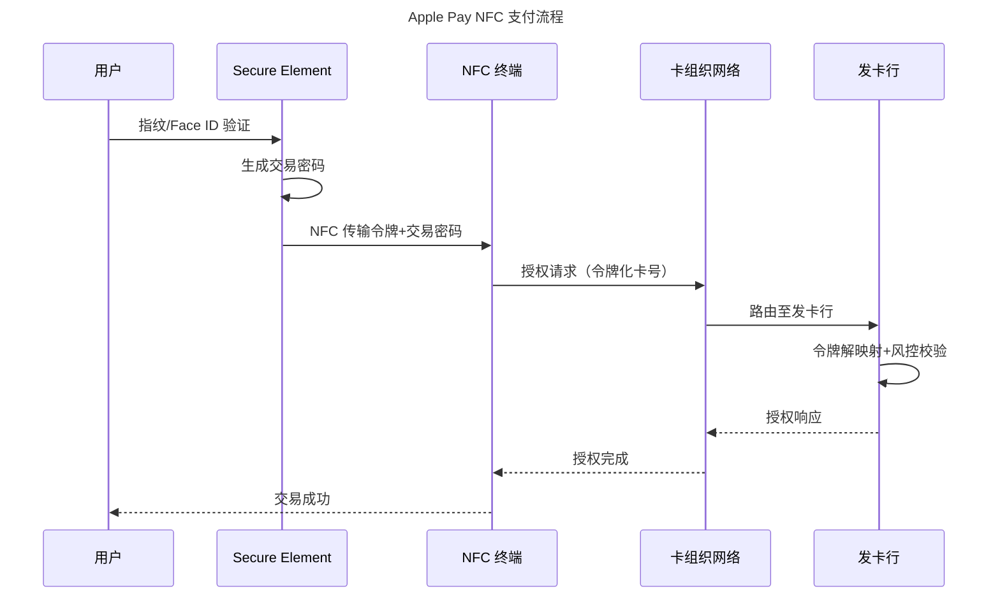

Apple Pay 的安全设计精髓在于：用户生物特征验证在设备本地完成（SE 安全芯片内），永不离开设备；传输至终端的是令牌化卡号（Token）而非真实卡号（PAN），发卡行通过令牌解映射还原真实卡号后完成风控校验。这种设计使即使终端被入侵，也无法获取用户真实卡号。

**关键组件**：

| 组件 | 说明 |
|------|------|
| Secure Element（SE） | 独立安全芯片，存储令牌与密钥，防物理攻击 |
| HCE（Host Card Emulation） | Android 软件模拟智能卡，依赖 TEE 保护 |
| TEE（Trusted Execution Environment） | 处理器隔离安全区域，运行可信应用 |
| Contactless Indicator | 非接标识，终端支持 NFC 的视觉标记 |

### 3.3 二维码支付流程

二维码支付是中国移动支付的核心技术路线，分为**主扫**（用户扫商户码）和**被扫**（商户扫用户码）两种模式。

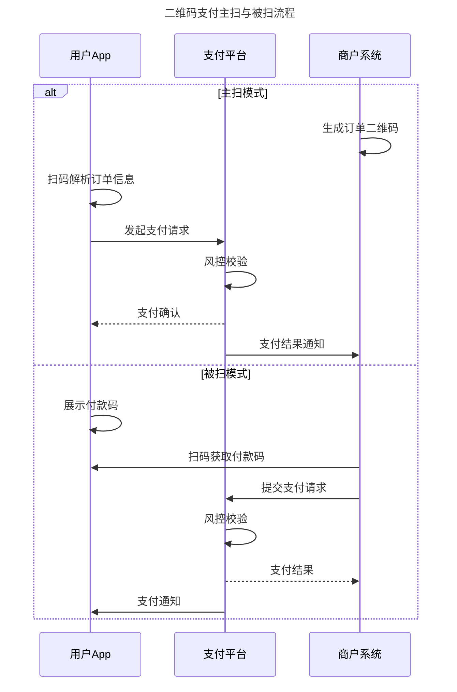

主扫与被扫的本质差异在于**谁发起支付请求**：主扫由用户 App 发起（Push 模式），被扫由商户系统发起（Pull 模式）。被扫模式在小额高频场景（如便利店）更高效，因为商户扫码速度通常快于用户扫码；主扫模式则更适合用户需要确认金额的场景。

**二维码支付 vs NFC 支付**：

| 维度 | 二维码支付 | NFC 支付 |
|------|-----------|---------|
| 硬件要求 | 摄像头 + 屏幕（极低） | NFC 芯片 + SE/TEE（较高） |
| 终端改造成本 | 打印二维码即可 | 需 NFC 读卡器 |
| 交易速度 | 3–5 秒 | < 1 秒 |
| 离线能力 | 有限（被扫可离线展示） | 有限（Apple Pay 离线模式） |
| 安全性 | 令牌化 + 动态码 | 令牌化 + SE + 交易密码 |
| 全球普及 | 中国主导 | 欧美日主导 |

### 3.4 3D Secure 2.0 流程

3DS 2.0 是 EMVCo 制定的在线支付身份验证协议，替代了体验极差的 3DS 1.0。

**核心改进**：

| 维度 | 3DS 1.0 | 3DS 2.0 |
|------|---------|---------|
| 用户体验 | 强制跳转发卡行页面 | 无摩擦流（Frictionless）优先 |
| 数据传输 | 有限 | 100+ 数据点风控评估 |
| 认证结果 | 通过/失败 | 通过/需挑战/拒绝 |
| 移动端适配 | 差 | 原生支持 |
| SCA 合规 | 不满足 | 满足 PSD2 SCA 要求 |

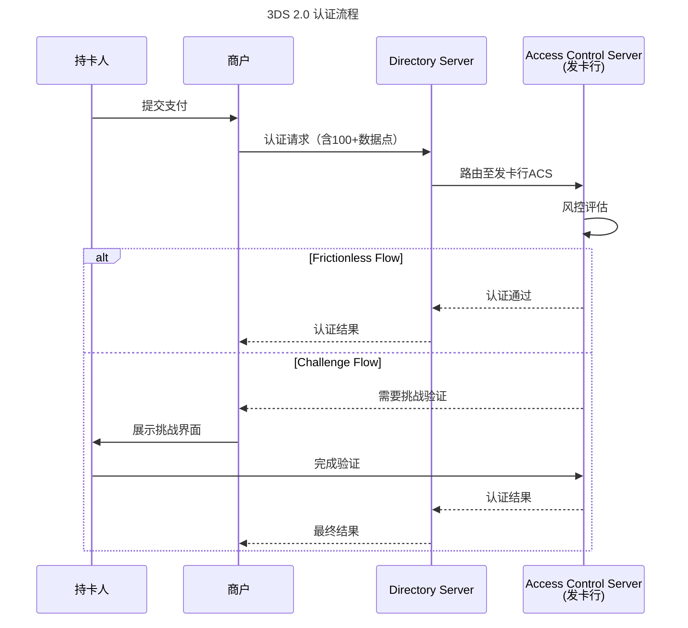

3DS 2.0 的核心创新是**基于数据的风控决策**：通过 100+ 数据点（设备指纹、历史行为、交易上下文）让发卡行在后台完成风险评估，仅在风控不确定时才触发 Challenge Flow（挑战验证）。这使得大多数交易可以在用户无感知的情况下完成认证（Frictionless Flow），将转换率损失从 3DS 1.0 时代的 5-10% 降至 1% 以下。

### 3.5 AML 与 KYC 流程

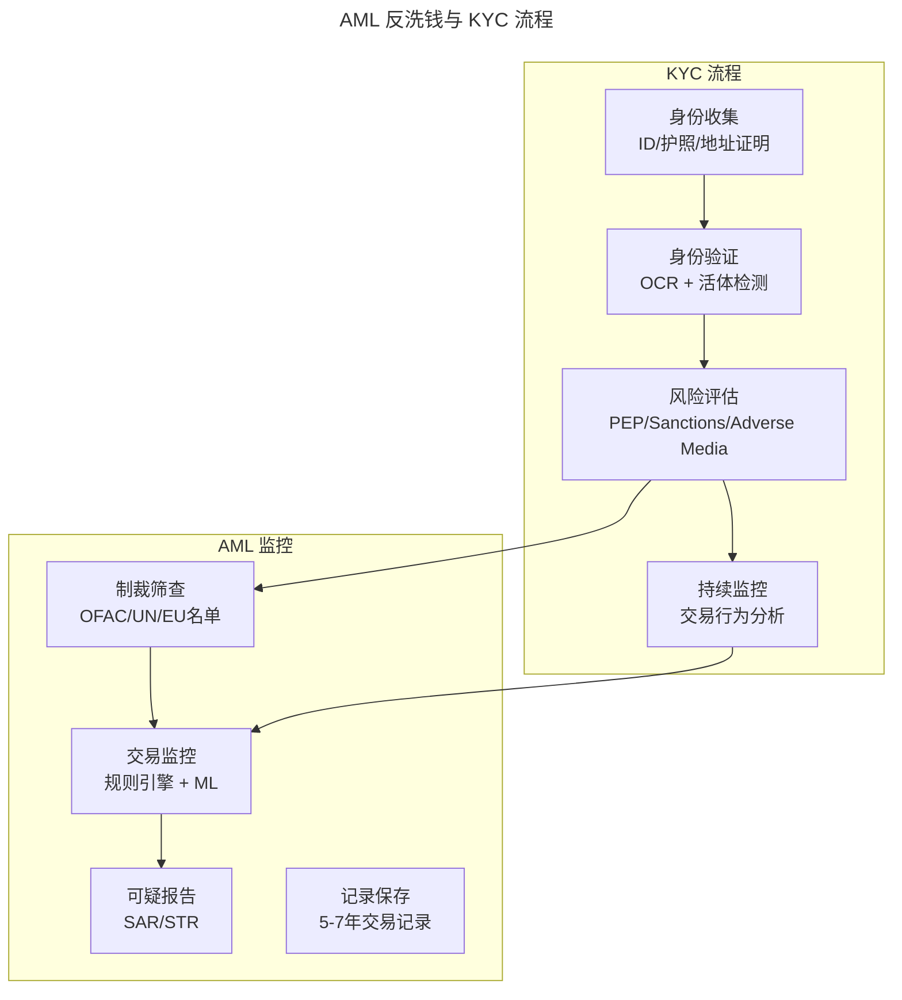

KYC 是 AML 的前置环节：先通过身份收集与验证建立客户画像，再基于风险评估结果设定监控策略。KYC 的"持续监控"与 AML 的"交易监控"形成闭环——客户行为偏离初始画像时触发告警，进入人工审核或自动拦截。

**中美监管差异**：

| 维度 | 美国 | 中国 |
|------|------|------|
| AML 法规 | BSA（Bank Secrecy Act）、FinCEN | 反洗钱法、央行监管 |
| KYC 标准 | CIP（Customer Identification Program） | 实名认证 + 人脸识别 |
| 报告义务 | CTR（>$10,000 现金交易）、SAR | 大额交易报告（>5 万元）、可疑交易报告 |
| 制裁合规 | OFAC 制裁名单（一级合规风险） | 联合国制裁名单 + 国内名单 |
| 数据本地化 | 无强制要求 | 支付数据必须境内存储 |

### 3.6 开放银行技术架构

PSD2（Payment Services Directive 2）是欧盟支付法规，对全球支付架构产生深远影响：

**核心要求**：

- **SCA（Strong Customer Authentication）**：双因素认证（知识 + 持有 + 固有特征中选两种）
- **AIS（Account Information Services）**：授权第三方访问账户信息
- **PIS（Payment Initiation Services）**：授权第三方发起支付

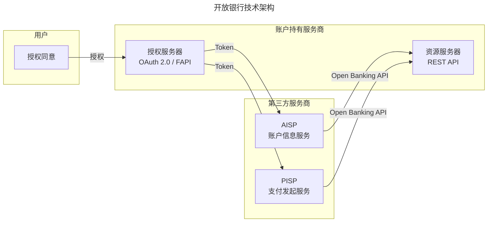

开放银行的核心是**用户数据主权**：用户授权后，第三方服务商（TPP）可通过标准化 API 访问用户的账户信息或发起支付，打破了银行对支付发起权的垄断。OAuth 2.0 / FAPI 协议确保了授权过程的安全性，用户始终掌握撤销权。

中国虽无 PSD2 等效法规，但网联（NUCC）的建立实现了支付清算的集中化，央行推动的金融数据交换标准也在逐步开放银行 API 生态。

### 3.7 数字人民币（e-CNY）技术架构

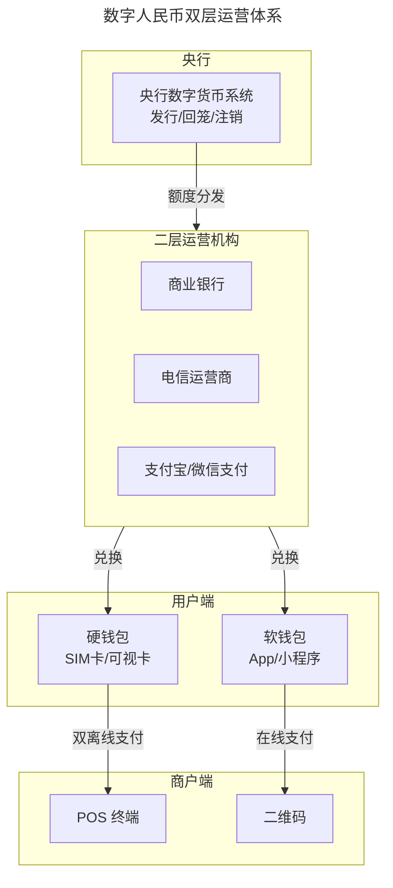

e-CNY 采用**央行—商业银行双层运营体系**：央行负责发行与回笼，不直接面向公众；商业银行等运营机构负责向公众兑换与流通。这种设计既保证了央行对货币主权的集中管控，又利用了商业银行已有的服务网络与风控能力。

**e-CNY 核心技术**：

- **双离线支付**：交易双方均无网络时，通过 NFC 完成价值转移，后续联网同步
- **可控匿名**：小额交易匿名，大额交易可追溯
- **可编程性**：智能合约限定资金用途（如政府补贴定向使用）
- **中心化管理**：央行统一发行，不采用去中心化共识

---

## 4. 工具与实战

### 4.1 支付技术栈全景

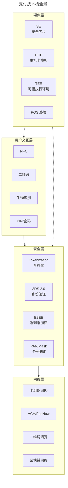

技术栈全景图揭示了支付系统的**纵深防御**设计：用户交互层提供多种支付方式，安全层在每一层嵌入防护（令牌化、加密、脱敏），网络层对接多种清算渠道，硬件层提供可信执行基础。工程师在设计支付产品时，需在每一层选择合适的技术组合。

### 4.2 令牌化（Tokenization）

令牌化是支付安全的基石技术，将敏感卡号（PAN）替换为无计算关联的令牌（Token）。

**EMVCo 令牌化框架**：

| 角色 | 职责 |
|------|------|
| Token Requestor | 请求令牌的实体（如 Apple Pay、Google Pay） |
| Token Service Provider（TSP） | 管理令牌生命周期（发行/更新/撤销） |
| Card Issuer | 发卡行，维护 PAN-Token 映射 |

**令牌类型**：

| 类型 | 用途 | 限制 |
|------|------|------|
| Device-Specific Token | 绑定特定设备 | 仅该设备可用 |
| Merchant-Specific Token | 绑定特定商户 | 仅该商户可用 |
| Domain-Restricted Token | 限定使用域 | 限定渠道/场景 |
| General Purpose Token | 通用场景 | 较少限制 |

### 4.3 生物识别支付

| 技术 | 应用场景 | 安全等级 |
|------|---------|---------|
| 指纹识别 | 手机解锁 + 支付确认 | 中（存在伪造风险） |
| 面部识别 | Apple Face ID、支付宝刷脸支付 | 高（3D 结构光） |
| 掌静脉识别 | 微信刷掌支付 | 极高（活体检测 + 皮下特征） |
| 声纹识别 | 电话银行身份验证 | 中（环境噪声影响） |

微信刷掌支付（2023 年推出）基于掌纹 + 掌静脉双模态识别，在地铁、零售等场景部署，是生物识别支付的前沿实践。

### 4.4 PCI DSS 4.0

PCI DSS（Payment Card Industry Data Security Standard）4.0 于 2024 年 3 月全面生效，主要变化：

| 维度 | v3.2.1 | v4.0 |
|------|--------|------|
| 合规方法 | 固定要求 | 自定义方法（Customized Approach） |
| 认证频率 | 年度评估 | 持续监控 + 年度评估 |
| MFA 范围 | 仅管理访问 | 所有对 CDE 的访问 |
| 目标风险分析 | 无 | 每项要求需进行风险分析 |
| 脚本安全 | 未明确 | 明确脚本完整性监控 |

**PCI DSS 4.0 核心要求（12 项 → 6 大目标域）**：

1. **安全网络与系统**：防火墙、默认密码、加密传输
2. **保护账户数据**：加密存储、加密传输、最小化数据保留
3. **漏洞管理**：防恶意软件、系统补丁
4. **访问控制**：最小权限、MFA、物理访问
5. **定期监控**：日志审计、安全测试
6. **安全策略**：信息安全政策、人员培训

### 4.5 稳定币支付

2024 年 USDT 交易量超越 Visa，稳定币已成为跨境支付的重要基础设施。

| 稳定币 | 发行方 | 锚定 | 市值（2025） | 合规状态 |
|--------|--------|------|-------------|---------|
| USDT | Tether | USD | ~$140B | 有限合规 |
| USDC | Circle | USD | ~$60B | 完全合规（美国） |
| PYUSD | PayPal | USD | ~$1B | 完全合规 |
| USD1 | WLFI（特朗普家族） | USD | 新发行 | 合规推进中 |

**稳定币跨境支付优势**：

- 结算速度：链上确认 1–10 分钟（vs SWIFT 1–5 天）
- 手续费：$1–5/笔（vs 传统跨境 3%–5%）
- 可编程性：智能合约自动执行
- 无需代理行：点对点结算

**监管进展**：

- 美国：GENIUS Act（稳定币监管法案）已于 2025 年 7 月签署成为法律，要求 1:1 储备与定期审计；相关实施细则仍在推进
- 欧盟：MiCA（Markets in Crypto-Assets）2024 年生效，稳定币纳入监管
- 中国：禁止稳定币发行与流通，但探索跨境沙盒

### 4.6 加密支付

| 项目 | 类型 | 支付场景 |
|------|------|---------|
| Lightning Network | BTC 二层 | 小额即时支付 |
| Solana Pay | SOL 链上 | 商户二维码支付 |
| Coinbase Commerce | 多链 | 电商加密支付 |
| BitPay | 多链 | 商户收单 |

加密支付在日常场景仍面临价格波动、税务合规、用户体验等挑战，但在跨境汇款、Web3 经济中已形成实际需求。

### 4.7 支付系统设计模式

#### 4.7.1 幂等性设计

支付系统最核心的设计原则：**同一笔业务请求无论执行多少次，结果必须一致**。

```java
public class PaymentService {

    private final PaymentRepository paymentRepo;
    private final IdempotencyKeyRepository idempotencyRepo;

    public PaymentResult processPayment(PaymentRequest request) {
        String idempotencyKey = request.getIdempotencyKey();

        if (idempotencyRepo.exists(idempotencyKey)) {
            return paymentRepo.findByKey(idempotencyKey).toResult();
        }

        IdempotencyRecord record = IdempotencyRecord.processing(idempotencyKey);
        idempotencyRepo.save(record);

        try {
            Payment payment = executePayment(request);
            record.complete(payment.getId());
            idempotencyRepo.save(record);
            return payment.toResult();
        } catch (Exception e) {
            record.fail();
            idempotencyRepo.save(record);
            throw e;
        }
    }
}
```

**幂等键设计要点**：

- 幂等键 = 业务唯一标识（如 `order_id + retry_sequence`）
- 幂等记录需设置合理 TTL（建议 24–72 小时）
- 并发请求需加分布式锁或数据库唯一约束
- 处理中状态需有超时机制，避免永久阻塞

#### 4.7.2 对账系统

对账是支付系统财务安全的最后防线，确保所有参与方账务一致。

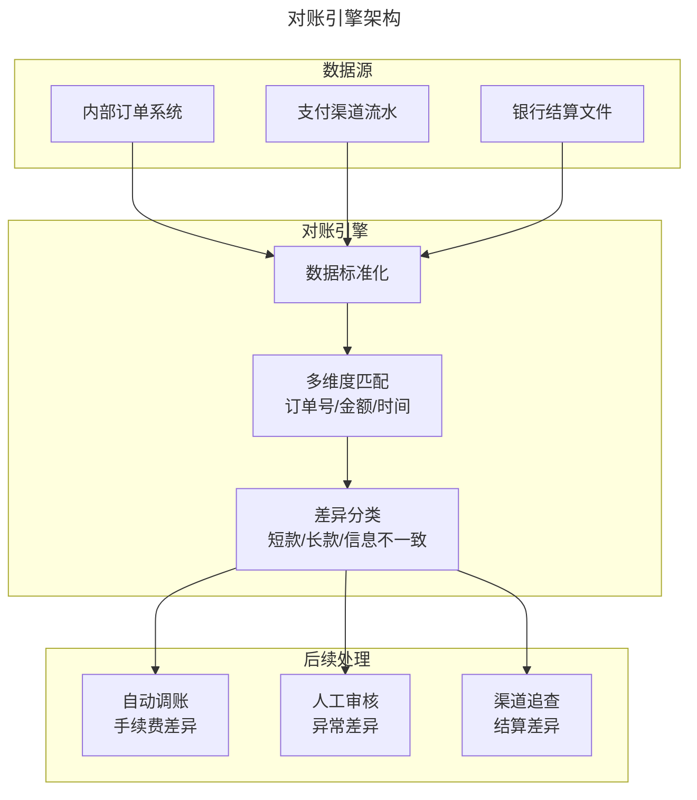

对账引擎的设计核心是**差异分类与自动化处理**：数据标准化消除格式差异后，按订单号、金额、时间多维度匹配，将结果分为"匹配""短款""长款""信息不一致""单边账"等类别。小额手续费差异可自动调账，大额或异常差异需人工审核，确保财务安全。

**对账代码示例**：

```python
from dataclasses import dataclass
from enum import Enum
from typing import Optional

class ReconStatus(Enum):
    MATCHED = "matched"
    SHORT_PAY = "short_pay"
    OVER_PAY = "over_pay"
    INFO_MISMATCH = "info_mismatch"
    MISSING_CHANNEL = "missing_channel"
    MISSING_INTERNAL = "missing_internal"

@dataclass
class ReconItem:
    internal_txn: Optional[Transaction]
    channel_txn: Optional[Transaction]
    status: ReconStatus
    diff_amount: int = 0

def reconcile(
    internal_txns: dict[str, Transaction],
    channel_txns: dict[str, Transaction],
    tolerance_cents: int = 1,
) -> list[ReconItem]:
    results = []
    all_keys = set(internal_txns.keys()) | set(channel_txns.keys())

    for key in all_keys:
        internal = internal_txns.get(key)
        channel = channel_txns.get(key)

        if internal and not channel:
            results.append(ReconItem(internal, None, ReconStatus.MISSING_CHANNEL))
            continue
        if channel and not internal:
            results.append(ReconItem(None, channel, ReconStatus.MISSING_INTERNAL))
            continue

        diff = abs(internal.amount_cents - channel.amount_cents)
        if diff <= tolerance_cents:
            results.append(ReconItem(internal, channel, ReconStatus.MATCHED))
        elif internal.amount_cents < channel.amount_cents:
            results.append(ReconItem(internal, channel, ReconStatus.OVER_PAY, diff))
        else:
            results.append(ReconItem(internal, channel, ReconStatus.SHORT_PAY, diff))

    return results
```

#### 4.7.3 支付路由引擎

智能路由根据成本、成功率、延迟等维度选择最优支付渠道：

```python
class PaymentRouter:
    def __init__(self, channels: list[PaymentChannel]):
        self.channels = channels

    def route(self, request: PaymentRequest) -> PaymentChannel:
        candidates = [
            ch for ch in self.channels
            if ch.supports(request.payment_method, request.currency, request.amount)
        ]

        scored = sorted(
            candidates,
            key=lambda ch: self._score(ch, request),
            reverse=True,
        )

        return scored[0] if scored else None

    def _score(self, channel: PaymentChannel, req: PaymentRequest) -> float:
        cost_score = 1.0 - (channel.fee_rate(req.amount) / 0.05)
        success_score = channel.success_rate(req.payment_method) / 100.0
        latency_score = 1.0 - min(channel.avg_latency_ms / 3000.0, 1.0)
        return (
            cost_score * 0.4
            + success_score * 0.4
            + latency_score * 0.2
        )
```

### 4.8 风控引擎

支付风控系统采用**规则引擎 + 机器学习**双层架构：

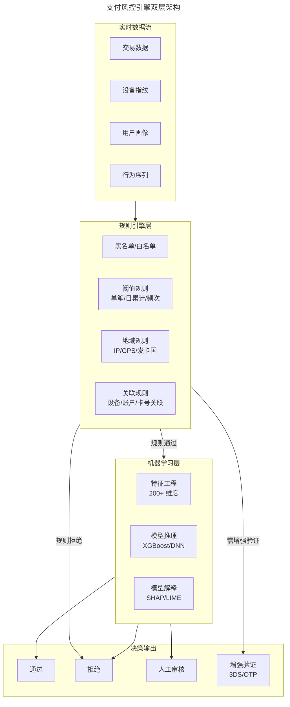

双层架构的设计逻辑是**确定性风险与模糊性风险分工**：规则引擎处理已知的、确定性的风险模式（黑名单、阈值、地域），速度快且可解释；机器学习层处理未知的、模糊的风险模式（行为异常、关联欺诈），覆盖面广但需可解释性保障。规则引擎先执行快速过滤，通过的交易再进入 ML 层深度评估。

**风控特征工程示例**：

| 特征类别 | 示例特征 | 计算方式 |
|---------|---------|---------|
| 交易特征 | 单笔金额/历史均值比 | Z-Score 标准化 |
| 时间特征 | 交易时间间隔 | 滑动窗口统计 |
| 地域特征 | 交易距离/速度 | Haversine 距离 |
| 设备特征 | 设备风险评分 | 指纹库匹配 |
| 关联特征 | 关联账户数 | 图算法（PageRank/Community Detection） |
| 行为特征 | 输入节奏/滑动模式 | 时序分析 |

### 4.9 分布式事务与一致性

支付系统对数据一致性要求极高，常见模式：

| 模式 | 适用场景 | 一致性保证 | 性能影响 |
|------|---------|-----------|---------|
| TCC（Try-Confirm-Cancel） | 跨服务资金操作 | 最终一致 | 中 |
| Saga | 长流程编排 | 最终一致 | 低 |
| 本地消息表 | 异步通知 | 最终一致 | 低 |
| XA 两阶段提交 | 强一致要求 | 强一致 | 高 |

**TCC 模式示例**：

```java
public class TransferService {

    @TccTransaction
    public void transfer(String fromAcct, String toAcct, long amountCents) {
        accountService.tryFreeze(fromAcct, amountCents);
        accountService.tryReserve(toAcct, amountCents);
    }

    @Confirm
    public void confirm(String fromAcct, String toAcct, long amountCents) {
        accountService.confirmDebit(fromAcct, amountCents);
        accountService.confirmCredit(toAcct, amountCents);
    }

    @Cancel
    public void cancel(String fromAcct, String toAcct, long amountCents) {
        accountService.cancelFreeze(fromAcct, amountCents);
        accountService.cancelReserve(toAcct, amountCents);
    }
}
```

---

## 5. 最佳实践与常见陷阱

### 5.1 最佳实践

| 领域 | 实践 | 说明 |
|------|------|------|
| 幂等性 | 全链路幂等键 | 从入口到渠道调用，每层均需幂等保障 |
| 对账 | T+1 自动对账 + 实时异常监控 | 对账是财务安全的最后防线 |
| 安全 | 令牌化 + E2EE | 永远不在自有系统存储原始卡号（PAN） |
| 风控 | 规则 + ML 双层 | 规则引擎处理确定性风险，ML 处理模糊风险 |
| 可观测性 | 全链路 Trace + 业务指标 | 支付成功率、延迟 P99、渠道可用率 |
| 容灾 | 多活 + 渠道降级 | 主渠道故障时自动切换备渠道 |
| 测试 | 沙盒环境 + 混沌工程 | 模拟渠道超时、网络分区等故障场景 |
| 合规 | PCI DSS 最小化范围 | 通过令牌化将系统排除在 CDE 之外 |

### 5.2 常见陷阱

| 陷阱 | 后果 | 解决方案 |
|------|------|---------|
| 忽略幂等性 | 重复扣款/重复发货 | 全链路幂等键 + 唯一约束 |
| 浮点数计算金额 | 精度丢失导致账务不平 | 使用整数（分/cent）存储和计算 |
| 异步通知无签名校验 | 伪造通知导致虚假发货 | 验证通知签名 + 查询确认 |
| 渠道超时未处理 | 状态不一致 | 超时主动查询 + 补偿机制 |
| 忽略部分退款场景 | 对账困难 | 设计支持多次部分退款的账户模型 |
| 硬编码渠道配置 | 渠道变更需发版 | 配置中心动态路由 |
| 日志记录敏感信息 | PCI DSS 违规 + 数据泄露 | 脱敏处理（保留前 6 后 4 位） |
| 单点依赖单一渠道 | 渠道故障时业务中断 | 多渠道冗余 + 自动降级 |

上述陷阱的共同特征是**短期看似无害，长期必然爆发**。支付系统的工程严谨性体现在对这些"边界情况"的系统性防护——每一项陷阱都对应一次真实的生产事故，工程师应将其作为 Code Review 与系统设计的检查清单。

---

## 6. 进阶延展

### 6.1 嵌入式金融（Embedded Finance）

支付能力正从独立服务嵌入到非金融产品中：

- **Shopify**：内置 Shopify Payments
- **Uber**：内置钱包与分账
- **SaaS 平台**：Stripe Connect 为平台型商户提供资金分拨
- **超级 App**：微信/支付宝从支付入口到生活服务平台

嵌入式金融的核心是**支付即基础设施**，开发者通过 API 将支付能力无缝集成到业务流程中。

### 6.2 AI 驱动的风控与反欺诈

| 应用 | 技术 | 效果 |
|------|------|------|
| 实时欺诈检测 | GNN（图神经网络） | 关联欺诈识别率提升 30%+ |
| 行为生物识别 | 深度学习 | 打字节奏/滑动模式异常检测 |
| 智能路由 | 强化学习 | 动态优化渠道选择 |
| AML 告警降噪 | NLP + 分类模型 | 误报率降低 50%+ |
| 3DS 智能决策 | ML 风控模型 | Frictionless Rate 提升至 95%+ |

### 6.3 跨境支付革新

| 趋势 | 说明 |
|------|------|
| 实时跨境 | SWIFT gpi、RTP/FedNow 跨境互联、mBridge |
| 稳定币结算 | USDC/USDT 跨境支付，2025 年 Q1 真实世界支付达 $94.2B |
| 本地化支付 | 接入各国本地支付方式（Pix/iDEAL/Klarna/GrabPay） |
| CIPS 扩展 | 人民币跨境支付系统覆盖 180+ 国家/地区 |
| UPI 国际化 | 印度 UPI 与新加坡 PayNow、美国 FedNow 互联 |

### 6.4 实时支付网络全球扩展

| 国家/地区 | 实时支付系统 | 上线时间 |
|----------|------------|---------|
| 中国 | CNAPS/网联 | 2015+ |
| 印度 | UPI | 2016 |
| 欧元区 | SEPA Instant | 2017 |
| 美国 | FedNow | 2023 |
| 巴西 | Pix | 2020 |
| 新加坡 | PayNow | 2017 |
| 澳大利亚 | NPP | 2018 |

全球实时支付交易量预计 2025 年将超过 3000 亿笔，年增长率 30%+。

### 6.5 先买后付（BNPL）

BNPL 已从新兴模式发展为支付生态的重要组成部分：

| 平台 | 市场 | 特征 |
|------|------|------|
| Afterpay（Block） | 澳/美/英 | 4 期免息分期 |
| Klarna | 欧洲/美 | 30 天延期 + 分期 |
| Affirm | 美国 | 灵活分期，APR 0%–30% |
| 花呗 | 中国 | 支付宝生态内消费信贷 |

监管趋势：美国 CFPB、欧盟均在加强对 BNPL 的消费者保护监管。

### 6.6 可穿戴与无感支付

- **Apple Watch**：NFC 支付已成标配
- **智能戒指**：NFC + 生物识别融合
- **车机支付**：加油站/停车场/Drive-through 自动扣款
- **刷掌支付**：微信刷掌，无需携带任何设备
- **AR/VR 支付**：元宇宙场景中的虚拟支付

### 6.7 参考资料与延伸阅读

1. Global Payments, *Global Payments Report 2025* (11th Edition)
2. EMVCo, *EMVCo Tokenisation Specification v2.0*
3. EMVCo, *3D Secure 2.0 Specification*
4. PCI Security Standards Council, *PCI DSS v4.0*
5. European Commission, *Payment Services Directive 2 (PSD2)*
6. People's Bank of China, *数字人民币白皮书*
7. Bank for International Settlements, *CBDC Annual Report 2024*
8. Federal Reserve, *FedNow Service Documentation*
9. FXC Intelligence, *Stablecoins in Cross-Border Payments 2025*
10. World Bank, *Payment Systems Worldwide 2024*

> **延伸方向**：建议读者在掌握本文基础后，进一步研究 SWIFT gpi 的报文标准（ISO 20022）、Stripe 的支付编排架构（Payment Orchestration Layer），以及 mBridge 多边央行数字货币桥的跨链清算机制。这些主题代表了支付技术的前沿实践方向。
