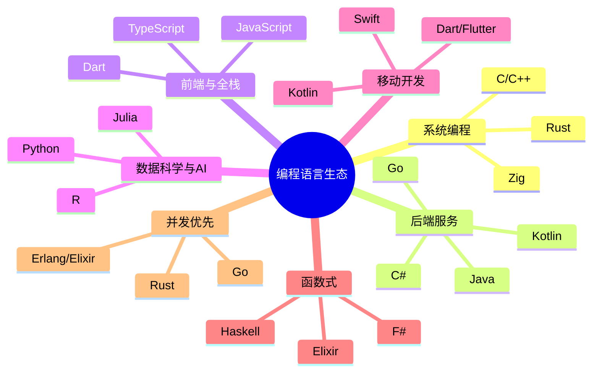
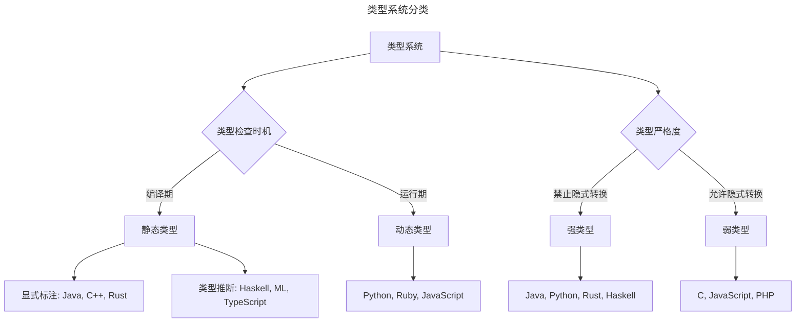
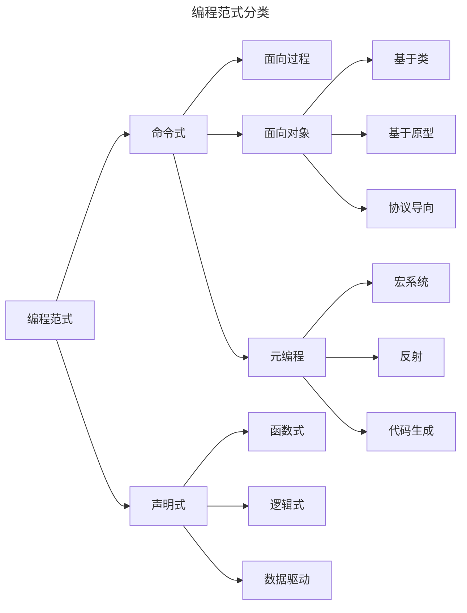
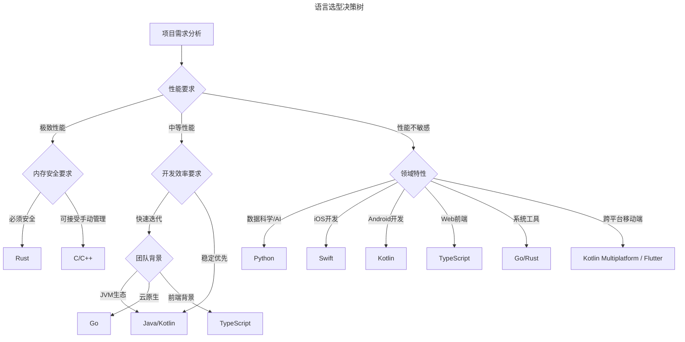
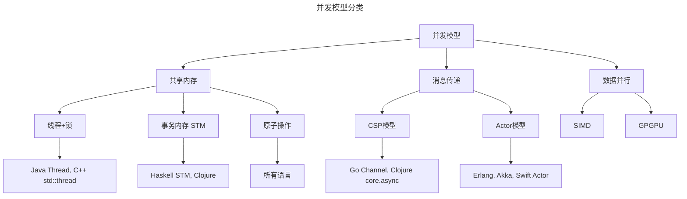
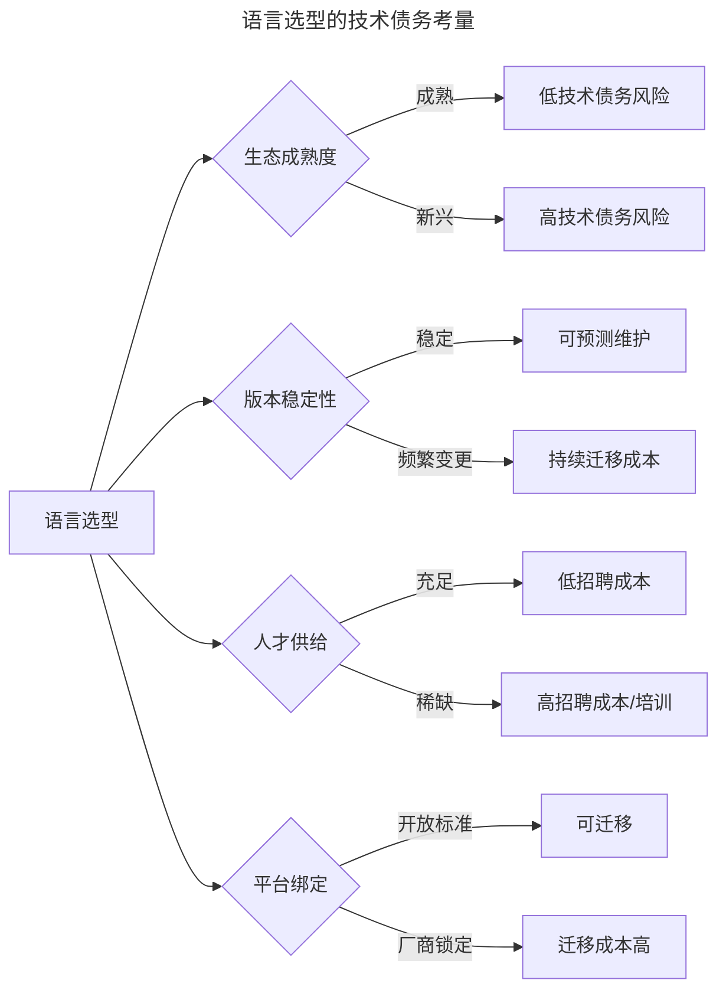
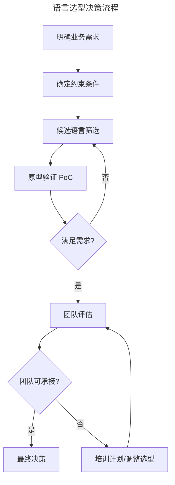
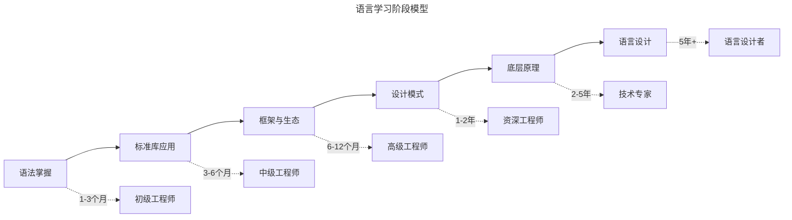
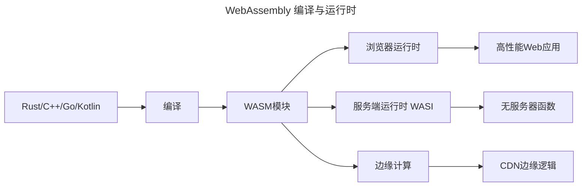

# 编程语言：理论、实践与选型决策

> **适用范围**：初级到高级工程师、技术架构师、技术管理者，以及需要在多语言生态中做选型决策与团队技能规划的技术负责人。
>
> **更新摘要（v2 · 2026-08 更新）**：
> - 结构化升级为 6 节骨架（导言 / 核心方法论 / 关键流程 / 工具与实战 / 常见误区 / 进阶延展）
> - 所有 Mermaid 图补充 `title` frontmatter，并确保每张图后附文字解读
> - 将原"参考资料"与"结语"融入"进阶延展"节
> - 保留全部类型系统理论、Lambda 演算公式、并发模型对比与语言选型决策树

---

## 1. 导言

编程语言是软件工程的基础设施，是人与计算机之间的桥梁。从 1940 年代的机器语言到 2025 年的现代编程语言生态，编程语言的演进反映了计算模型、工程实践和领域需求的深刻变革。

本文基于程序语言设计与编译器研究的理论视角，结合工业界实践经验，系统阐述编程语言的核心理论、主流语言特性、并发编程模型、选型决策框架及发展趋势，面向初级到高级工程师及技术管理者提供理论与实践并重的参考。

### 1.1 编程语言的本质

从计算机科学理论视角，编程语言具有以下核心属性：

| 维度 | 描述 | 理论基础 |
|------|------|----------|
| **计算模型** | 语言能够表达的计算能力边界 | 图灵机、Lambda演算 |
| **类型系统** | 值与表达式的分类约束机制 | 类型论、范畴论 |
| **语义定义** | 程序行为的数学化描述 | 操作语义、指称语义、公理语义 |
| **抽象机制** | 复杂性管理的语言特性 | 数据抽象、控制抽象、过程抽象 |

### 1.2 2025 年语言生态全景



生态全景图揭示了 2025 年编程语言的多极化格局：没有任何一种语言能覆盖所有领域，每种语言都在其优势场景中深耕。系统编程领域 Rust 挑战 C/C++ 的地位；后端服务领域 Java、Go、Kotlin 三足鼎立；数据科学与 AI 领域 Python 保持绝对主导。工程师需要理解这种多极化格局，避免"一把锤子解决所有问题"的思维。

---

## 2. 核心方法论

### 2.1 类型系统

类型系统是编程语言最核心的设计决策之一，决定了程序的可靠性、表达能力和运行效率。

#### 2.1.1 类型系统分类



类型系统分类图展示了两个正交维度：检查时机（静态 vs 动态）与严格度（强 vs 弱）。这两个维度的组合决定了语言的基本性格——静态强类型语言（如 Rust、Haskell）在编译期捕获最多错误但灵活性较低；动态弱类型语言（如 JavaScript）灵活性最高但运行时错误风险大。现代语言的趋势是在静态类型框架内引入类型推断（如 TypeScript、Kotlin），兼顾安全性与开发效率。

#### 2.1.2 类型系统核心概念

| 概念 | 定义 | 示例语言 |
|------|------|----------|
| **参数多态** | 类型参数化的多态 | Java泛型、Rust泛型、C++模板 |
| **Ad-hoc多态** | 同名操作不同实现 | Rust trait、TypeScript重载、Haskell Typeclass |
| **子类型多态** | 子类型可替代父类型 | Java继承、TypeScript结构子类型 |
| **类型推断** | 编译器自动推导类型 | Haskell（Hindley-Milner）、TypeScript、Rust |
| **代数数据类型** | 积类型与和类型的组合 | Haskell、Rust（enum）、Swift、Kotlin（sealed class） |
| **依赖类型** | 类型依赖于值 | Idris、Agda、Coq、Lean |
| **渐进类型** | 静态与动态类型的混合 | TypeScript、Python 3.5+、Typed Racket |
| **行多态** | 对记录结构的多态 | PureScript、OCaml、TypeScript（映射类型） |

#### 2.1.3 类型安全保证

**定理（类型安全 / Type Safety）**：若程序通过类型检查，则运行时不会发生未定义的类型错误。形式化为：

$$\Gamma \vdash e : \tau \land e \rightarrow^* v \Rightarrow \Gamma \vdash v : \tau$$

其中 $\Gamma$ 是类型环境，$e$ 是表达式，$\tau$ 是类型，$v$ 是值。该定理由两个子性质组成：

- **进展性（Progress）**：良类型的表达式要么是值，要么可以继续求值
- **保持性（Preservation）**：求值步骤保持表达式的类型

### 2.2 Lambda演算

Lambda演算是函数式编程语言的理论基础，由 Alonzo Church 于 1930 年代提出。它与图灵机具有等价的计算能力（Church-Turing论题）。

#### 2.2.1 基本语法

$$e ::= x \mid \lambda x.e \mid e_1 \, e_2$$

- **变量（Variable）**：$x$
- **抽象（Abstraction）**：$\lambda x.e$（函数定义）
- **应用（Application）**：$e_1 \, e_2$（函数调用）

#### 2.2.2 归约规则

**β-归约**（函数应用的核心计算规则）：
$$(\lambda x.e_1) \, e_2 \rightarrow_\beta e_1[x := e_2]$$

**α-转换**（变量重命名，保证等价性）：
$$\lambda x.e \rightarrow_\alpha \lambda y.e[x := y] \quad (y \notin \mathrm{FV}(e))$$

**η-归约**（外延性等价）：
$$\lambda x.(e \, x) \rightarrow_\eta e \quad (x \notin \mathrm{FV}(e))$$

#### 2.2.3 类型化Lambda演算与语言对应

| Lambda演算系统 | 类型能力 | 对应编程语言特性 |
|----------------|----------|------------------|
| 无类型λ演算 | 无类型约束 | 动态类型语言 |
| 简单类型λ演算（STLC） | 基本类型、函数类型 | C、Pascal |
| System F | 全称量词、参数多态 | Java泛型、Haskell |
| System Fω | 高阶类型构造子 | Haskell（Kind系统） |
| 依赖类型λ演算 | 类型依赖值 | Idris、Agda、Coq |

#### 2.2.4 求值策略

| 策略 | 描述 | 代表语言 |
|------|------|----------|
| **严格求值（Call-by-Value）** | 参数先求值再代入 | Java, Python, JavaScript, Rust |
| **惰性求值（Call-by-Need）** | 参数仅在需要时求值 | Haskell |
| **按名求值（Call-by-Name）** | 参数未求值直接代入 | Scala（`=>`参数） |

### 2.3 图灵完备性

**定义**：一个计算系统是图灵完备的，当且仅当它可以模拟任意图灵机。

**等价条件**（满足任一即图灵完备）：
- 可计算部分递归函数
- 可实现条件分支 + 无限循环
- 可模拟任意其他图灵完备系统（如μ-递归函数、Lambda演算）

**实践意义**：几乎所有通用编程语言都是图灵完备的，这保证了它们的计算能力等价。图灵完备性是必要条件而非充分条件——语言的实际表达能力还取决于类型系统、抽象机制和生态。

**非图灵完备的特例**：正则表达式、SQL（不含递归CTE）、HTML/CSS、Totality语言（Idris的有限片段）。

### 2.4 程序语言语义学

| 语义类型 | 描述方法 | 核心工具 | 应用场景 |
|----------|----------|----------|----------|
| **操作语义** | 定义程序的执行步骤 | 推理规则、抽象机 | 解释器设计、编译器验证、语言标准定义 |
| **指称语义** | 将程序映射到数学对象 | 域论、连续函数 | 程序等价性证明、语义基础 |
| **公理语义** | 基于逻辑断言定义语义 | Hoare逻辑、最弱前置条件 | 程序验证、形式化证明 |

### 2.5 编程范式

编程范式定义了程序的组织方式和思维模式。现代语言普遍支持多范式融合，理解各范式的核心思想有助于选择合适的抽象层次。

#### 2.5.1 范式分类



范式分类图展示了编程世界的两大谱系：命令式（描述"如何做"）与声明式（描述"是什么"）。现代语言的演进趋势是融合——Rust 同时支持函数式与面向对象（trait），Swift 融合协议导向与函数式。工程师应根据问题域选择最合适的范式而非拘泥于单一范式。

#### 2.5.2 范式对比

| 范式 | 核心思想 | 代表语言 | 优势 | 劣势 |
|------|----------|----------|------|------|
| **命令式** | 描述"如何做"，通过状态变更驱动计算 | C, Pascal, Go | 直观、效率可控、硬件映射 | 状态管理复杂、副作用难追踪 |
| **面向对象** | 封装、继承、多态，以对象为基本单元 | Java, C#, Smalltalk | 模块化、复用性、领域建模 | 继承耦合、性能开销、可变性 |
| **函数式** | 描述"是什么"，纯函数与不可变数据 | Haskell, ML, Clojure | 无副作用、易测试、易并行 | 学习曲线陡峭、性能权衡 |
| **逻辑式** | 声明约束与规则，由引擎推导结果 | Prolog, Datalog | 声明性强、自动推理 | 效率不可控、调试困难 |
| **元编程** | 代码生成代码，提升抽象层次 | Lisp宏, Rust宏, C++模板 | 抽象能力强、消除重复 | 复杂度高、编译错误难读 |

#### 2.5.3 多范式融合

现代语言普遍支持多范式，开发者应根据问题域选择最合适的范式而非拘泥于单一范式：

| 语言 | 支持范式 | 主导范式 |
|------|----------|----------|
| **Rust** | 函数式 + 面向对象（trait） + 元编程（宏） | 函数式 + trait导向 |
| **Kotlin** | 函数式 + 面向对象 + 协程 | 面向对象 + 函数式增强 |
| **Swift** | 函数式 + 面向对象 + 协议导向 | 协议导向 + 函数式 |
| **Python** | 命令式 + 面向对象 + 函数式 | 多范式均衡 |
| **Scala** | 函数式 + 面向对象 | 函数式主导 |
| **Go** | 命令式 + 接口导向 + 并发 | 命令式 + CSP并发 |

---

## 3. 关键流程

### 3.1 主流语言特性对比

| 特性 | Python | Java | Go | Rust | Kotlin | Swift | TypeScript |
|------|--------|------|-----|------|--------|-------|------------|
| **类型系统** | 动态强类型 | 静态强类型 | 静态强类型 | 静态强类型 | 静态强类型 | 静态强类型 | 渐进类型 |
| **内存管理** | 引用计数+GC | GC（G1/ZGC） | GC（并发标记清除） | 所有权系统 | GC | ARC | GC（V8） |
| **并发模型** | GIL/asyncio | Virtual Thread | Goroutine | async/await | 协程 | async/actor | async/await |
| **泛型支持** | 有（运行时） | 有 | 1.18+ | 有 | 有 | 有 | 有 |
| **空安全** | 无（PEP 484 Optional） | Optional | 无 | Option/Result | 内置 | 内置 | 严格模式 |
| **模式匹配** | 3.10+ | 21+（switch） | 无 | 有 | 有 | 有 | 无 |
| **编译目标** | 解释/字节码 | JVM字节码 | 原生 | 原生/WASM | JVM字节码/原生 | 原生/WASM | JavaScript |
| **包管理** | pip/poetry | Maven/Gradle | Go Modules | Cargo | Gradle | SPM | npm/pnpm |
| **主要场景** | 数据科学/AI | 企业后端 | 云原生/微服务 | 系统编程 | Android/后端 | Apple生态 | 前端全栈 |

### 3.2 语言选型决策树



选型决策树以"性能要求"为第一分流维度，体现了性能约束对语言选型的决定性影响。极致性能场景下，内存安全要求进一步分流 Rust 与 C/C++；中等性能场景下，团队背景决定生态方向。这棵树的价值不在于给出"唯一正确答案"，而在于提供了一个结构化的决策路径——团队可以基于此路径讨论各分支的权衡。

### 3.3 现代语言深度剖析

#### 3.3.1 Rust：系统编程的新范式

**核心创新**：所有权系统（Ownership System）——在编译期保证内存安全，无需垃圾回收。

```rust
fn ownership_demo() {
    let s1 = String::from("hello");
    let s2 = s1;
    // println!("{}", s1); // 编译错误：值已被移动

    let s3 = s2.clone();
    println!("{} {}", s2, s3);

    take_ownership(s3);
    // println!("{}", s3); // 编译错误：值已被移动

    let s4 = give_ownership();
}

fn take_ownership(s: String) {
    println!("{}", s);
}

fn give_ownership() -> String {
    String::from("world")
}
```

**借用规则（Borrow Checker）**：
- 任意多个不可变借用（`&T`），或
- 一个可变借用（`&mut T`）
- 借用在所有者之前失效
- 编译期检查，零运行时开销

**生命周期（Lifetime）**：确保引用始终指向有效数据，是 Rust 类型系统的一部分。

**2025年生态成熟度**：
- Linux内核已正式接纳 Rust（6.1+）
- Web引擎（Servo）、数据库（TiKV）、区块链（Solana）广泛采用
- WASM编译目标成熟（wasm32-unknown-unknown）
- 异步生态稳定（Tokio 事实标准）

**适用场景**：操作系统内核、浏览器引擎、游戏引擎、嵌入式系统、高性能网络服务、安全敏感系统。

#### 3.3.2 Go：工程化的极致

**设计哲学**：少即是多——通过语言设计的简洁性最大化工程效率。

```go
package main

import (
    "fmt"
    "sync"
)

func worker(id int, jobs <-chan int, results chan<- int, wg *sync.WaitGroup) {
    defer wg.Done()
    for j := range jobs {
        results <- j * 2
        fmt.Printf("Worker %d processed job %d\n", id, j)
    }
}

func main() {
    const numJobs = 100
    const numWorkers = 5

    jobs := make(chan int, numJobs)
    results := make(chan int, numJobs)

    var wg sync.WaitGroup

    for w := 1; w <= numWorkers; w++ {
        wg.Add(1)
        go worker(w, jobs, results, &wg)
    }

    for j := 1; j <= numJobs; j++ {
        jobs <- j
    }
    close(jobs)

    go func() {
        wg.Wait()
        close(results)
    }()

    for result := range results {
        fmt.Println("Result:", result)
    }
}
```

**核心特性**：
- **Goroutine**：轻量级协程（初始2KB栈，动态增长），M:N调度模型
- **Channel**：CSP模型的通信机制，`select`多路复用
- **接口**：隐式实现（鸭子类型），组合优于继承
- **垃圾回收**：并发标记清除，低延迟（<1ms STW）
- **泛型**：1.18版本引入类型参数，兼顾表达力与简洁性

**适用场景**：云原生基础设施（Docker、Kubernetes）、微服务架构、DevOps工具链、网络编程、CLI工具。

#### 3.3.3 Kotlin：现代JVM语言

**核心特性**：空安全、协程、多平台（Kotlin Multiplatform）。

```kotlin
data class User(val id: Int, val name: String, val email: String?)

sealed class Result<out T> {
    data class Success<T>(val data: T) : Result<T>()
    data class Error(val message: String) : Result<Nothing>()
}

suspend fun fetchUser(id: Int): Result<User> = coroutineScope {
    try {
        val response = httpClient.get("https://api.example.com/users/$id")
        Result.Success(response.body<User>())
    } catch (e: Exception) {
        Result.Error(e.message ?: "Unknown error")
    }
}

fun main() = runBlocking {
    when (val result = fetchUser(1)) {
        is Result.Success -> println("User: ${result.data.name}")
        is Result.Error -> println("Error: ${result.message}")
    }
}
```

**2025年关键进展**：
- Kotlin Multiplatform（KMP）进入稳定阶段，支持iOS/Android/Web/Desktop共享业务逻辑
- Compose Multiplatform统一UI开发
- Kotlin/WASM编译目标成熟
- 协程与Flow成为异步编程标准方案

**适用场景**：Android应用开发（Google官方推荐）、服务端开发（Ktor/Spring）、跨平台移动应用、Gradle构建脚本。

#### 3.3.4 Swift：Apple生态的现代语言

**核心特性**：协议导向编程、值语义、内存安全（ARC + 所有权）。

```swift
protocol Drawable {
    func draw(in context: CGContext)
}

struct Circle: Drawable {
    var center: CGPoint
    var radius: CGFloat

    func draw(in context: CGContext) {
        context.addEllipse(in: CGRect(
            x: center.x - radius,
            y: center.y - radius,
            width: radius * 2,
            height: radius * 2
        ))
        context.strokePath()
    }
}

@MainActor
class ViewModel: ObservableObject {
    @Published var items: [Item] = []

    func loadItems() async throws {
        let (data, _) = try await URLSession.shared.data(from: itemsURL)
        items = try JSONDecoder().decode([Item].self, from: data)
    }
}
```

**2025年关键进展**：
- Swift 6引入严格并发检查（Sendable、Actor隔离）
- Swift Concurrency（async/await、Actor）全面成熟
- Swift Macros提供编译期元编程能力
- Swift在服务端（Vapor）与WASM目标持续发展
- noncopyable类型与所有权模型引入

**适用场景**：iOS/iPadOS/macOS/watchOS/visionOS应用、Apple平台框架开发、服务端（Vapor）。

#### 3.3.5 TypeScript：类型安全的JavaScript

**核心特性**：渐进类型系统、结构化类型、类型推断。

```typescript
interface User {
    id: number;
    name: string;
    email?: string;
}

type AsyncResult<T> = Promise<
    { data: T; error: null } | { data: null; error: Error }
>;

async function fetchUser(id: number): AsyncResult<User> {
    try {
        const response = await fetch(`/api/users/${id}`);
        const data: User = await response.json();
        return { data, error: null };
    } catch (error) {
        return { data: null, error: error as Error };
    }
}

function processUsers<T extends User>(users: T[]): string[] {
    return users.map(u => u.name.toUpperCase());
}
```

**2025年关键进展**：
- TypeScript 5.x：装饰器标准化（Stage 3）、`satisfies`运算符、`using`关键字
- 生态覆盖率极高：主流前端框架（React、Vue、Angular）全面TypeScript优先
- Node.js后端采用率持续增长
- 与AI代码生成工具深度集成

**适用场景**：大型前端项目、Node.js后端、全栈应用、跨平台开发（React Native/Electron）。

### 3.4 并发编程模型

并发编程是现代软件工程的核心挑战。理解不同并发模型的原理与权衡，是设计高性能、高可靠性系统的前提。

#### 3.4.1 并发模型分类



并发模型分类图揭示了三条并发路线：共享内存（通过锁或事务保护共享状态）、消息传递（通过通信避免共享）、数据并行（SIMD/GPU）。Go 与 Erlang 选择了消息传递路线（CSP 与 Actor），Rust 选择了共享内存但通过所有权系统在编译期消除数据竞争。理解这三条路线的权衡是并发编程选型的基础。

#### 3.4.2 各语言并发实现对比

| 语言 | 并发原语 | 调度方式 | 通信机制 | 结构化并发 | 特点 |
|------|----------|----------|----------|------------|------|
| **Go** | Goroutine | M:N调度（GMP模型） | Channel | 有（errgroup） | 轻量、CSP模型 |
| **Rust** | async/await | 运行时可选（Tokio等） | Channel/Mutex | 有（tokio::spawn + scope） | 零成本抽象、编译期安全 |
| **Java 21+** | Virtual Thread | M:N调度 | Blocking Queue | 有（StructuredTaskScope） | 虚拟线程、JVM生态 |
| **Kotlin** | Coroutine | M:N调度 | Channel/Flow | 内置（coroutineScope） | 结构化并发、挂起函数 |
| **Swift** | async/await | GCD | Actor | 有（TaskGroup） | Actor隔离、Sendable检查 |
| **Erlang** | Process | 抢占式调度 | 消息传递 | 有（supervisor树） | 容错、热更新、BEAM VM |
| **Python** | asyncio | 单线程事件循环 | Queue/asyncio.Queue | 有（TaskGroup 3.11+） | GIL限制、IO密集适用 |
| **C#** | async/await | 线程池 | Channel | 有 | 语言级支持、.NET生态 |

#### 3.4.3 CSP模型（Communicating Sequential Processes）

**核心思想**：不要通过共享内存来通信，而要通过通信来共享内存（Do not communicate by sharing memory; instead, share memory by communicating）。

**理论提出**：C.A.R. Hoare，1978年。

```go
func pipeline() {
    generator := func(done <-chan struct{}, nums ...int) <-chan int {
        out := make(chan int)
        go func() {
            defer close(out)
            for _, n := range nums {
                select {
                case out <- n:
                case <-done:
                    return
                }
            }
        }()
        return out
    }

    square := func(done <-chan struct{}, in <-chan int) <-chan int {
        out := make(chan int)
        go func() {
            defer close(out)
            for n := range in {
                select {
                case out <- n * n:
                case <-done:
                    return
                }
            }
        }()
        return out
    }

    done := make(chan struct{})
    defer close(done)

    nums := generator(done, 1, 2, 3, 4, 5)
    squares := square(done, nums)

    for s := range squares {
        fmt.Println(s)
    }
}
```

**适用场景**：数据流水线、生产者-消费者模式、微服务间通信。

#### 3.4.4 Actor模型

**核心思想**：Actor是并发计算的基本单元，拥有私有状态，仅通过异步消息传递进行通信，无共享状态。

**理论提出**：Carl Hewitt，1973年。

```swift
actor Counter {
    private var count = 0

    func increment() -> Int {
        count += 1
        return count
    }

    func decrement() -> Int {
        count -= 1
        return count
    }

    func getValue() -> Int {
        return count
    }
}

@MainActor
func useCounter() async {
    let counter = Counter()
    async let r1 = counter.increment()
    async let r2 = counter.increment()
    async let r3 = counter.decrement()
    let _ = await (r1, r2, r3)
    print("Final count: \(await counter.getValue())") // 1
}
```

**适用场景**：高并发状态管理、分布式系统、实时系统、容错系统。

#### 3.4.5 async/await模型

**核心思想**：用同步的语法编写异步代码，编译器/运行时负责挂起与恢复。

```rust
use tokio::sync::mpsc;

async fn async_example() {
    let (tx, mut rx) = mpsc::channel(100);

    tokio::spawn(async move {
        for i in 0..10 {
            tx.send(i).await.unwrap();
        }
    });

    while let Some(i) = rx.recv().await {
        println!("Received: {}", i);
    }
}

#[tokio::main]
async fn main() {
    let task1 = async_function1();
    let task2 = async_function2();

    let (result1, result2) = tokio::join!(task1, task2);
}
```

**各语言实现差异**：

| 语言 | Future/Promise模型 | 零成本抽象 | 取消机制 |
|------|-------------------|------------|----------|
| **Rust** | 手动实现Future trait | 是（编译期状态机） | CancellationToken |
| **Kotlin** | 挂起函数（CPS变换） | 接近零成本 | 协程取消 |
| **Swift** | 编译器生成状态机 | 是 | Task.cancel() |
| **Python** | 原生协程（async def） | 否（解释器开销） | Task.cancel() |
| **JavaScript** | Promise链 | 否（事件循环） | AbortController |

#### 3.4.6 并发安全保证

| 机制 | 描述 | 语言支持 | 编译期检查 |
|------|------|----------|------------|
| **Mutex/RWLock** | 互斥访问共享资源 | 所有语言 | 否（需人工保证） |
| **Channel** | 消息传递避免共享 | Go, Rust, Kotlin | 否 |
| **Actor隔离** | 状态封装在Actor内 | Erlang, Swift, Akka | Swift（Sendable检查） |
| **所有权系统** | 编译期检查数据竞争 | Rust | **是** |
| **STM** | 事务内存，乐观并发 | Haskell, Clojure | 否 |
| **原子操作** | 无锁编程原语 | 所有语言 | 否 |
| **不可变数据** | 消除竞态条件根源 | Haskell, Rust, Clojure | Haskell（默认）、Rust（&T） |

### 3.5 语言选型决策框架

#### 3.5.1 决策维度

| 维度 | 权重因素 | 评估方法 | 量化指标 |
|------|----------|----------|----------|
| **性能** | 吞吐量、延迟、资源消耗 | 基准测试、性能剖析 | QPS、P99延迟、内存占用 |
| **生态** | 库成熟度、社区活跃度 | 依赖分析、GitHub指标 | 包数量、Issue响应时间 |
| **学习曲线** | 团队熟悉度、培训成本 | 技能矩阵评估 | 上手周期、培训投入 |
| **工程支持** | 工具链、IDE、调试器 | 开发环境评估 | IDE支持度、CI/CD集成 |
| **长期维护** | 版本稳定性、向后兼容 | 历史版本分析 | 破坏性变更频率 |
| **招聘** | 人才供给、薪资水平 | 市场调研 | 可用候选人数量 |

#### 3.5.2 场景化选型矩阵

| 场景 | 首选语言 | 备选语言 | 关键考量 |
|------|----------|----------|----------|
| **Web后端** | Java/Kotlin | Go, TypeScript | 生态成熟度、团队技能 |
| **微服务** | Go | Java, Rust | 启动速度、资源占用 |
| **系统编程** | Rust | C++, Go | 内存安全、性能 |
| **数据科学** | Python | R, Julia | 库生态、交互性 |
| **机器学习** | Python | Julia, Rust | 框架支持、推理性能 |
| **移动开发** | Kotlin/Swift | Flutter, React Native | 平台原生性、跨平台需求 |
| **前端开发** | TypeScript | JavaScript | 类型安全、工程规模 |
| **游戏开发** | C++ | C#, Rust | 引擎支持、性能 |
| **嵌入式** | C/Rust | C++, Zig | 资源约束、安全 |
| **区块链** | Rust | Go, Solidity | 安全性、性能 |
| **DevOps工具** | Go | Python, Rust | 编译部署、交叉编译 |
| **实时系统** | Erlang/Elixir | Rust, Go | 容错、低延迟 |

#### 3.5.3 技术债务考量

语言选型需考虑长期维护成本，避免短期决策导致长期技术债务：



技术债务考量图揭示了语言选型的四个风险维度：生态成熟度、版本稳定性、人才供给、平台绑定。新兴语言虽可能带来技术优势，但需评估其生态成熟度与人才供给风险。建议在核心系统选择成熟稳定的语言，在非关键系统尝试新兴语言。

#### 3.5.4 选型决策流程



选型决策流程强调**原型验证（PoC）**与**团队评估**两个关键关卡：PoC 验证语言的技术可行性，团队评估验证组织可行性。跳过 PoC 直接选型容易在后期遇到技术瓶颈；跳过团队评估直接推行则可能导致团队抵触与执行困难。

---

## 4. 工具与实战

### 4.1 语言学习阶段模型



学习阶段模型展示了从语法掌握到语言设计的六阶段路径，每阶段对应不同的工程师层级。关键洞见是：从"框架与生态"到"设计模式"的跨越（高级→资深）是从"会用"到"会用得好"的分水岭；从"底层原理"到"语言设计"的跨越（专家→设计者）则是从"理解"到"创造"的跃迁。

### 4.2 学习策略

#### 4.2.1 第一门语言选择

**原则**：不纠结第一门语言的选择，快速入门，建立编程思维。编程思维一旦建立，语言切换只是语法和惯用法的适应过程。

| 入门语言 | 优势 | 适用人群 | 注意事项 |
|----------|------|----------|----------|
| **Python** | 语法简洁、生态丰富、即时反馈 | 零基础、数据方向 | 需后续补充类型系统认知 |
| **JavaScript** | 即时可见、Web生态、就业机会 | Web开发方向 | 需关注语言陷阱，过渡到TypeScript |
| **Java** | 严谨规范、就业广泛、工程实践 | 企业开发方向 | 语法较冗长，需理解设计思想 |
| **Go** | 语法简单、并发友好、云原生 | 后端开发方向 | 泛型与错误处理需额外学习 |

#### 4.2.2 触类旁通策略

掌握一门语言后，学习其他语言的效率显著提升。关键在于理解语言间的共性与差异：

| 已掌握语言 | 易迁移语言 | 学习重点 |
|------------|------------|----------|
| Java | Kotlin, C#, TypeScript | 语法简化、空安全、函数式特性 |
| Python | Ruby, JavaScript | 类型系统、异步模型、模块系统 |
| C++ | Rust, D, Zig | 所有权模型、生命周期、安全保证 |
| JavaScript | TypeScript, Dart | 类型系统、工程化实践 |
| Go | Rust | 泛型、生命周期、更严格的类型系统 |
| Swift | Kotlin, Rust | 跨平台差异、内存管理模型 |

#### 4.2.3 全栈能力构建

**后端工程师学习前端**：
- 理解事件驱动模型与浏览器事件循环
- 掌握异步编程范式（Promise/async-await）
- 理解浏览器渲染机制（布局、绘制、合成）
- 体验用户交互设计与前端状态管理

**前端工程师学习后端**：
- 理解请求处理流程（中间件、路由、控制器）
- 掌握数据库设计与查询优化
- 理解并发模型与分布式系统基础
- 体验服务端架构与部署运维

### 4.3 关键技能矩阵

| 技能领域 | 初级 | 中级 | 高级 |
|----------|------|------|------|
| **语言掌握** | 语法正确、能实现功能 | 惯用法熟练、代码可读 | 深入底层原理、能优化编译器行为 |
| **并发编程** | 理解概念、能使用基本原语 | 正确使用锁/Channel/async | 设计并发架构、排查竞态问题 |
| **测试能力** | 编写单元测试 | TDD/BDD实践、Mock技巧 | 测试架构设计、模糊测试、性能测试 |
| **SQL能力** | 基本CRUD、简单JOIN | 窗口函数、索引优化、事务 | 执行计划分析、查询优化、分库分表 |
| **系统设计** | 模块划分、接口定义 | 架构模式应用、技术选型 | 分布式系统设计、容灾方案 |

### 4.4 SQL的重要性

SQL是数据交互的核心语言，无论使用何种编程语言，工程师都必须熟练掌握SQL：

| 技能层级 | 能力要求 |
|----------|----------|
| **基础** | CRUD操作、JOIN（INNER/LEFT/RIGHT）、GROUP BY、HAVING |
| **中级** | 子查询、窗口函数（ROW_NUMBER/RANK/LAG）、索引优化、事务隔离级别 |
| **高级** | 执行计划分析（EXPLAIN）、查询重写优化、分库分表、读写分离 |

### 4.5 测试框架能力

无论使用何种语言，测试能力是工程师的核心素养。测试不仅是质量保障手段，更是设计反馈工具：

| 测试类型 | 目的 | 工具示例 |
|----------|------|----------|
| **单元测试** | 验证函数/方法正确性 | JUnit 5, pytest, Go test, Rust #[test] |
| **集成测试** | 验证模块间交互 | TestContainers, WireMock |
| **端到端测试** | 验证系统行为 | Playwright, Cypress |
| **性能测试** | 验证性能指标 | JMeter, k6, Gatling |
| **模糊测试** | 发现边界问题与安全漏洞 | AFL, libFuzzer, cargo-fuzz |
| **快照测试** | 验证UI/输出一致性 | Jest, Vitest |

### 4.6 并发思维培养

**核心原则**：始终以并发、分布式视角审视程序设计，而非事后添加并发支持。

**思维转换**：

| 单线程思维 | 并发思维 | 收益 |
|------------|----------|------|
| 同步阻塞调用 | 异步消息传递 | 系统吞吐量提升 |
| 共享可变状态 | 不可变数据 + 消息传递 | 消除竞态条件 |
| 全局锁 | 细粒度锁 / 无锁结构 | 减少锁争用 |
| 单体事务 | 最终一致性 / SAGA | 系统可用性提升 |
| 本地缓存 | 分布式缓存一致性 | 水平扩展能力 |

---

## 5. 常见误区

### 5.1 SQL 常见陷阱

- N+1查询问题（ORM默认行为导致）
- 缺少索引导致全表扫描
- 大事务锁表（长事务持有行锁/表锁）
- 不当使用OR/函数导致索引失效
- 隐式类型转换导致索引失效

这些陷阱的共同特征是**在数据量小时无明显症状，数据量增长后突然成为性能瓶颈**。建议在 Code Review 中将 SQL 审查作为强制环节，并通过慢查询监控持续发现隐患。

### 5.2 追求"银弹"语言

在2025年的技术生态中，没有"银弹"语言，只有最适合场景的选择。常见误区包括：认为某种语言"什么都能做"而强行用于不适合的场景（如用 Java 写系统级工具），或追逐新兴语言而忽视团队技能与生态成熟度。正确做法是参考场景化选型矩阵，结合团队背景做出务实选择。

### 5.3 忽视类型安全

动态类型语言（如 Python、JavaScript）在小型项目中开发效率高，但随着项目规模增长，类型相关的运行时错误会成为维护负担。常见误区是长期停留在动态类型而不引入类型检查（如 TypeScript、Python 类型标注）。渐进类型系统允许逐步引入类型标注，是平衡效率与安全的务实路径。

### 5.4 并发编程事后添加

许多工程师在单线程设计完成后再"添加并发支持"，这种做法往往导致竞态条件、死锁等难以排查的问题。正确做法是**并发优先**：在系统设计阶段就考虑并发模型，将并发作为设计约束而非优化手段。

### 5.5 过度依赖 ORM 而忽视 SQL

ORM 框架（如 Hibernate、SQLAlchemy）提升了开发效率，但也隐藏了 SQL 的实际执行细节。过度依赖 ORM 会导致 N+1 查询、不必要的全表扫描等问题。建议工程师掌握原生 SQL 能力，在关键性能场景绕过 ORM 直接优化。

---

## 6. 进阶延展

### 6.1 WebAssembly（WASM）

**定义**：一种面向Web的二进制指令格式，支持多语言编译为通用字节码，在沙箱环境中以接近原生的速度运行。



WASM 的价值在于**打破语言与运行时的绑定**：后端语言（Rust、Go、C++）可编译为 WASM 在浏览器运行，前端不再被 JavaScript 垄断；服务端通过 WASI 实现"一次编译，到处运行"的跨平台部署。2025 年的关键进展包括组件模型（Component Model）标准化与 WASI Preview 2。

**2025年关键进展**：
- **WASM组件模型（Component Model）**：标准化跨语言互操作，支持接口定义语言（WIT）
- **WASI Preview 2**：标准化系统接口，支持网络、文件系统等能力
- **GC提案**：支持GC语言（Kotlin、Dart）编译为WASM，无需自带GC
- **多语言生态**：Rust、C++、Go、Kotlin、Python均可编译为WASM

**影响**：
- 打破JavaScript在Web运行时的垄断
- 语言选择更加灵活，后端语言可运行于前端
- 性能接近原生，适用于计算密集型Web应用
- 跨平台代码复用（浏览器、服务端、嵌入式）

### 6.2 领域特定语言（DSL）

**趋势**：针对特定领域优化的语言日益重要，通用语言无法高效表达所有领域逻辑。

| DSL类型 | 示例 | 应用领域 | 嵌入方式 |
|---------|------|----------|----------|
| **查询语言** | SQL, GraphQL, Cypher | 数据查询 | 独立语言 |
| **配置语言** | HCL, Dhall, CUE | 基础设施即代码 | 独立语言 |
| **构建语言** | Gradle(Kotlin), Bazel(STARLARK) | 构建系统 | 内部DSL |
| **测试语言** | Gherkin, RSpec | 测试规范 | 内部DSL |
| **数据转换** | Jsonnet, CUE, Pkl | 数据模板化 | 独立语言 |
| **基础设施** | Pulumi(多语言), CDK(TypeScript) | 云资源编排 | 内部DSL |

### 6.3 AI辅助编程

**影响维度**：

| 维度 | 变化 | 实践建议 |
|------|------|----------|
| **学习曲线** | 降低入门门槛，AI可生成基础代码 | 仍需理解生成代码的语义 |
| **生产力** | 代码生成效率提升30-50% | 适用于样板代码、API调用 |
| **语言选择** | 弱化语法记忆，强化设计思维 | 语言选择更关注生态与架构 |
| **代码质量** | AI建议需人工审核，可能引入缺陷 | 建立代码审查流程，AI生成代码需测试 |
| **技能要求** | 从语法记忆转向架构设计与问题分解 | 强化系统设计、调试、安全审计能力 |

**2025年AI编程工具生态**：
- GitHub Copilot、Cursor、Codeium等深度集成IDE
- 大语言模型对主流语言（Python、TypeScript、Java、Rust）支持度最高
- AI辅助调试、测试生成、代码审查逐步成熟

### 6.4 低代码/无代码平台

**定位**：非专业开发者的应用构建工具，降低简单业务场景的开发门槛。

**对编程语言的影响**：
- 简化常见业务场景开发（表单、审批、报表）
- 专业开发者聚焦复杂系统与定制化需求
- 领域建模能力更加重要（抽象业务逻辑）
- 与传统编程语言互补而非替代

### 6.5 语言演进趋势

| 趋势 | 描述 | 代表语言/特性 |
|------|------|---------------|
| **类型系统增强** | 渐进类型、更强大的推断、依赖类型 | TypeScript 5.x、Python类型标注、Rust GATs |
| **内存安全** | 所有权模型、自动管理、编译期检查 | Rust所有权、Swift noncopyable、C++安全Profile |
| **并发优先** | 语言级结构化并发、Actor模型 | Go Goroutine、Swift Actor、Java Virtual Thread |
| **元编程增强** | 编译期计算、宏系统、代码生成 | Rust过程宏、Swift Macros、Zig comptime |
| **跨平台编译** | 多目标编译、WASM、KMP | Rust（多target）、Kotlin Multiplatform、Go交叉编译 |
| **互操作性** | 跨语言调用、FFI简化 | Rust-Unsafe FFI、Kotlin/Native、Swift C++互操作 |

### 6.6 参考资料与延伸阅读

#### 经典著作

| 书籍 | 作者 | 主题 |
|------|------|------|
| 《Types and Programming Languages》 | Benjamin C. Pierce | 类型系统理论 |
| 《Structure and Interpretation of Computer Programs》 | Harold Abelson等 | 程序设计原理 |
| 《Concepts, Techniques, and Models of Computer Programming》 | Peter Van Roy等 | 编程模型 |
| 《Programming Language Pragmatics》 | Michael L. Scott | 语言设计实践 |
| 《The Rust Programming Language》 | Steve Klabnik等 | Rust语言 |
| 《Programming in Haskell》 | Graham Hutton | 函数式编程 |
| 《Java Concurrency in Practice》 | Brian Goetz | 并发编程 |
| 《Design Patterns》 | Erich Gamma等 | 设计模式 |

#### 在线资源

| 资源 | 链接 | 内容 |
|------|------|------|
| **Rust官方文档** | doc.rust-lang.org | Rust学习资源 |
| **Go by Example** | gobyexample.com | Go实践教程 |
| **Kotlin官方文档** | kotlinlang.org | Kotlin参考 |
| **Swift文档** | swift.org/documentation | Swift指南 |
| **TypeScript手册** | typescriptlang.org/docs | TypeScript参考 |
| **Compiler Explorer** | godbolt.org | 在线查看编译输出 |

#### 学术会议

| 会议 | 领域 |
|------|------|
| **PLDI** | 编程语言设计与实现 |
| **OOPSLA** | 面向对象编程系统 |
| **ICFP** | 函数式编程 |
| **POPL** | 编程语言原理 |
| **ECOOP** | 欧洲面向对象编程 |
| **SPLASH** | 软件工程与语言 |

### 6.7 结语

编程语言是软件工程师的核心工具，但工具本身并非目的。理解语言背后的理论、掌握多种范式、培养并发思维、建立正确的学习路径，才是持续成长的关键。

在2025年的技术生态中，没有"银弹"语言，只有最适合场景的选择。工程师应当：

1. **深入一门**：精通至少一门语言，理解其设计哲学与底层原理
2. **触类旁通**：建立语言间的知识迁移能力，理解共性与差异
3. **持续学习**：关注语言演进，拥抱新范式与新技术
4. **工程思维**：从语言特性上升到架构设计，关注可维护性与可扩展性
5. **并发优先**：始终以分布式视角审视系统，将并发作为设计约束而非优化手段

编程语言，既是工具，也是思维方式的载体。掌握语言的本质，方能以不变应万变。

> **延伸方向**：建议读者在掌握本文基础后，深入研究 *Types and Programming Languages*（Benjamin Pierce）以建立类型论基础，并通过 Compiler Explorer（godbolt.org）直观观察不同语言的编译输出差异。对于并发编程，推荐对比研究 Go 的 CSP 模型与 Erlang 的 Actor 模型在分布式系统设计中的不同哲学。
