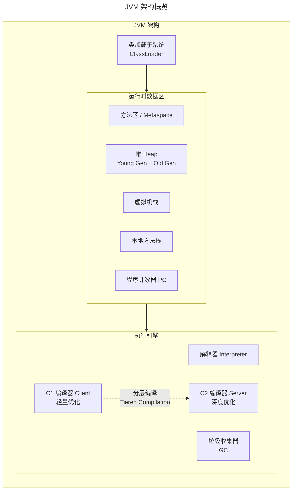
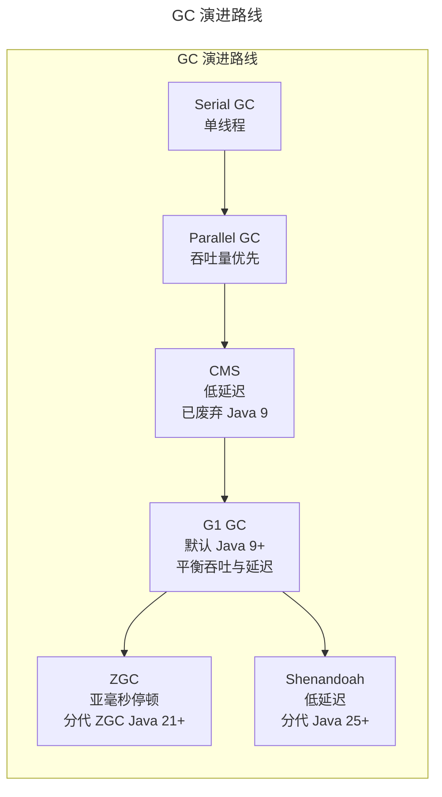
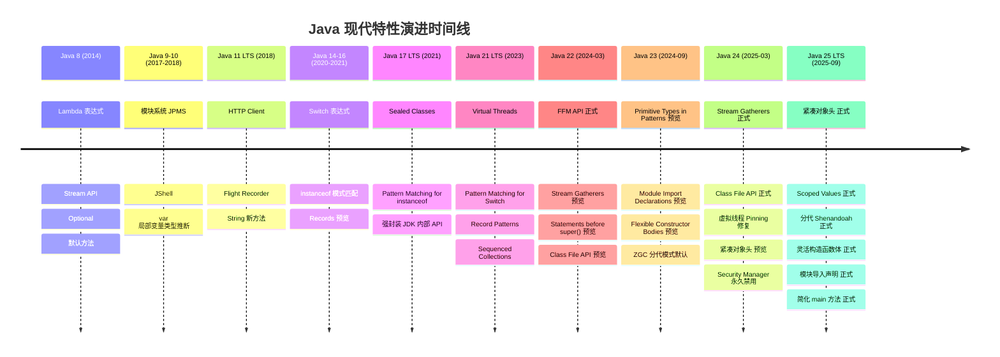
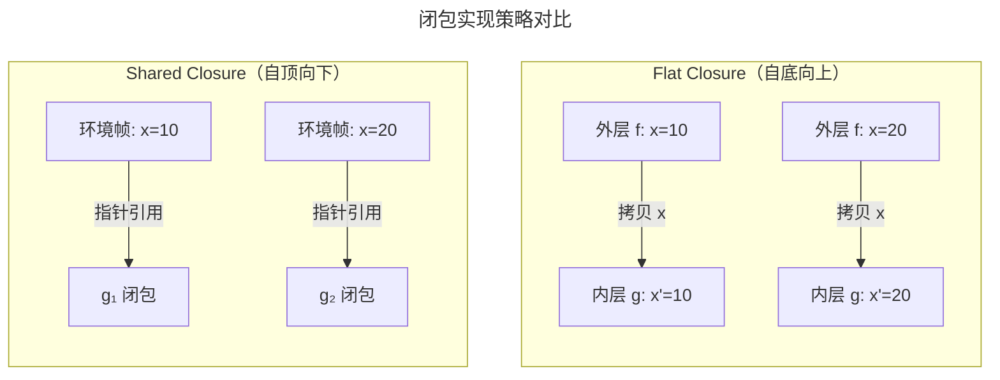
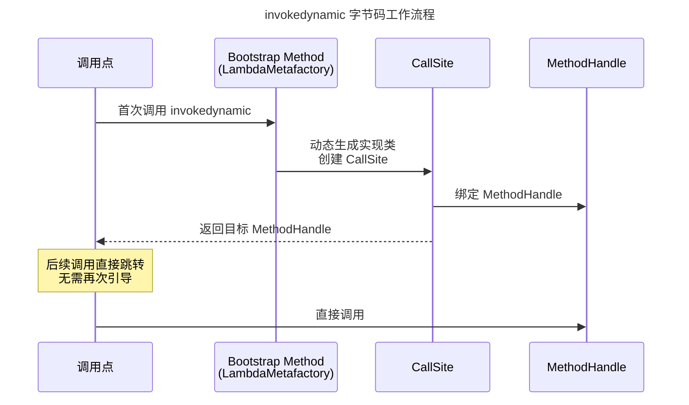
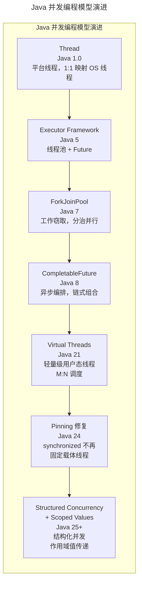
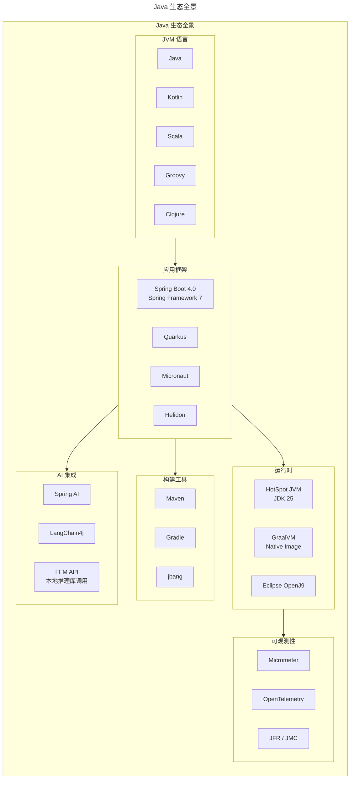

# Java 语言：从经典到现代的工程化演进

> **适用范围**：Java 后端工程师、JVM 生态开发者、技术架构师、技术管理者，以及需要评估 Java 技术栈选型与升级路径的决策者。
>
> **更新摘要（v2 · 2026-08 更新）**：
> - 结构化升级为 6 节骨架（导言 / 核心方法论 / 关键流程 / 工具与实战 / 常见误区 / 进阶延展）
> - 所有 Mermaid 图补充 `title` frontmatter，并确保每张图后附文字解读
> - 将原"参考资料"融入"进阶延展"节
> - 保留 Java 25 LTS 全部新特性、JVM 架构图、GC 演进路线与并发模型对比

---

## 1. 导言

### 1.1 Java 语言演进史

Java 自 1995 年发布以来，经历了从 Oak 到 JDK 1.0、从企业级后端主导到云原生适配的完整演进周期。2017 年 Oracle 宣布将 JDK 发行周期从多年一版调整为每六个月一版（快速发布模型），显著加速了语言特性的迭代节奏。截至 2025 年 9 月，Java 25 作为最新 LTS 版本正式发布，标志着 Java 进入云原生与高性能并行的新纪元。

| 阶段 | 版本范围 | 核心里程碑 |
|------|----------|------------|
| 语言奠基期 | JDK 1.0–1.4 | JVM 规范确立、Collections Framework、NIO |
| 企业级成熟期 | Java 5–7 | 泛型、注解、自动装箱、ForkJoinPool |
| 现代化转型期 | Java 8–11 | Lambda、Stream、模块系统、HTTP Client |
| 云原生演进期 | Java 17–21 | Records、Sealed Classes、Pattern Matching、Virtual Threads |
| 高性能新纪元 | Java 22–25 | Stream Gatherers、FFM API、紧凑对象头、分代 Shenandoah、Scoped Values |

### 1.2 2025 年 Java 生态地位

截至 2025 年，Java 在 TIOBE 指数中稳居前三，在企业级后端开发领域仍占据主导地位。根据 JetBrains 2024 开发者调查，约 65% 的后端开发者将 Java 作为主力语言。Java 25 作为最新 LTS 版本（2025 年 9 月 16 日发布，至少八年支持），已成为企业迁移的首选目标版本。

关键趋势：

- **云原生适配**：GraalVM Native Image 将 Java 应用启动时间压缩至毫秒级，Spring Boot 4.0 / Quarkus / Micronaut 均已提供原生镜像一等公民支持
- **并发模型革新**：Project Loom 引入的虚拟线程从根本上简化了高并发编程模型，Java 24 修复了 synchronized Pinning 问题（JEP 491）
- **内存效率跃升**：Java 25 的紧凑对象头（JEP 519）将对象头从 12-16 字节缩减至 8 字节，堆内存占用降低约 15%
- **多语言生态**：Kotlin 已成为 Android 开发首选语言，Scala 在大数据领域持续深耕
- **AI 集成**：Project Panama 的 FFM API（Java 22 正式）使 Java 能够高效调用本地 AI 推理库，Spring AI 提供声明式 AI 应用开发框架

### 1.3 从程序语言研究到工程实践

本文的技术视角深受程序语言理论（PL Theory）影响。作者在莱斯大学（Rice University）从事程序语言研究期间，参与了 DrJava IDE 项目——一个面向初学者的 Java 开发环境，其核心特性之一是交互式求值（Interactions Pane），这要求对 Java 语言的语法、类型系统和运行时语义有深入理解。DrJava 项目使用 JavaCC 构建语法解析器，通过编译器 API（javax.tools.JavaCompiler）实现动态编译与执行，这些实践经验为理解 Java Lambda 的闭包实现原理、类型系统设计决策提供了第一性原理的视角。

---

## 2. 核心方法论

### 2.1 JVM 架构

JVM 是 Java "Write Once, Run Anywhere" 承诺的技术基石。现代 JVM（HotSpot）采用解释器与即时编译器（JIT）混合执行模式，结合分层编译策略实现启动速度与峰值性能的平衡。



JVM 架构图展示了类加载、运行时数据区与执行引擎三大子系统。分层编译（Tiered Compilation）是性能优化的关键：C1 编译器在启动阶段快速编译，执行基本优化以保证启动速度；C2 编译器在热点代码积累足够 profiling 数据后深度优化（内联、逃逸分析、循环优化），实现峰值性能。这种"先快后优"的策略使 Java 既能快速启动，又能在长期运行中达到接近 C++ 的性能。

**关键组件说明**：

| 组件 | 职责 |
|------|------|
| ClassLoader | 类加载、链接（验证/准备/解析）、初始化 |
| Metaspace | 替代 PermGen（Java 8+），存储类元数据，使用本地内存 |
| C1 编译器 | 快速编译，适用于启动阶段，执行基本优化 |
| C2 编译器 | 深度优化编译，包括内联、逃逸分析、循环优化 |
| GC | 自动内存管理，现代默认 G1（Java 9+），ZGC 可用于低延迟场景 |

**Java 24+ 启动优化**：JEP 483（Early Class-File Loading & Linking）通过缓存已加载和链接的类，将大型 Spring 应用的启动时间减少 40% 以上，且对应用代码零侵入。

### 2.2 类型系统

Java 采用静态强类型系统，结合名义类型（Nominal Typing）与泛型擦除机制：

- **原始类型与引用类型**：8 种原始类型（`byte`, `short`, `int`, `long`, `float`, `double`, `char`, `boolean`）直接存储值语义，引用类型通过对象头（Mark Word + Klass Pointer）间接访问。Java 25 的紧凑对象头（JEP 519）将 64 位架构下的对象头从 96-128 位缩减至 64 位
- **泛型与类型擦除**：Java 泛型在编译期进行类型检查，运行时擦除为原始类型（Raw Type），这是与 C# 泛型（具化泛型）的本质区别。Project Valhalla 的 Value Types 与 Universal Generics 将从根本上解决此问题
- **协变与逆变**：数组是协变的（`String[]` 是 `Object[]` 的子类型），泛型是不变的（`List<String>` 不是 `List<Object>` 的子类型），通配符 `? extends` / `? super` 提供使用点变型
- **Sealed Classes**（Java 17+ 正式）：允许类声明其允许的子类，使类型系统具备代数数据类型（ADT）的表达能力
- **Primitive Types in Patterns**（Java 23+ 预览，JEP 507 第三次预览于 Java 25）：允许 `instanceof` 和 `switch` 直接匹配原始类型，进一步消除类型转换的模板代码

### 2.3 内存模型

Java 内存模型（JMM, JSR-133）定义了多线程环境下共享变量的可见性与有序性保证：

- **happens-before 关系**：程序顺序规则、volatile 写-读规则、锁的释放-获取规则、线程启动/终止规则
- **volatile 语义**：禁止指令重排序，保证可见性，但不保证原子性（复合操作仍需 `synchronized` 或 `Atomic` 类）
- **final 语义增强**（Java 5+）：构造函数内对 final 字段的写入，在构造函数返回前对其他线程可见
- **Scoped Values**（Java 25 正式，JEP 506）：替代 `ThreadLocal` 的轻量级作用域值传递机制，基于写入时复制（copy-on-write）语义，特别适用于虚拟线程场景下的上下文传递

### 2.4 垃圾回收



GC 演进路线图展示了从 Serial GC 到分代 Shenandoah 的发展脉络，核心驱动力是**降低 STW（Stop-The-World）停顿时间**以适应实时与低延迟场景。G1 GC 成为默认选择（Java 9+）标志着"分区收集"成为主流；ZGC 与 Shenandoah 将停顿时间压缩至亚毫秒级，使 Java 可用于之前被 C++ 垄断的实时交易系统。

| GC | 适用场景 | STW 停顿目标 | 启用方式 |
|----|----------|-------------|----------|
| Serial | 小型应用、客户端 | 无特殊要求 | `-XX:+UseSerialGC` |
| Parallel | 批处理、离线计算 | 吞吐量优先 | `-XX:+UseParallelGC` |
| G1 | 通用服务端应用（默认） | < 200ms | 默认 / `-XX:+UseG1GC` |
| ZGC | 低延迟交易、实时系统 | < 1ms（分代 ZGC） | `-XX:+UseZGC` |
| Shenandoah | 低延迟服务 | < 10ms | `-XX:+UseShenandoahGC` |
| 分代 Shenandoah | 低延迟 + 高吞吐 | < 10ms + 更高吞吐 | `-XX:+UseShenandoahGC -XX:ShenandoahGCMode=generational`（Java 25+） |

**Java 25 GC 重大更新**：JEP 521 将分代 Shenandoah（Generational Shenandoah）作为正式特性引入，通过分代收集更高效地回收年轻代中的"朝生夕死"对象，在保持极低暂停时间的同时显著提升吞吐量。

### 2.5 Java 现代特性演进

#### 2.5.1 特性演进时间线



时间线图直观展示了 Java 从 8 到 25 的特性演进节奏。2017 年改为六个月发布周期后，Java 的迭代速度显著加快。关键里程碑包括：Java 8（Lambda/Stream，函数式编程范式引入）、Java 17（Sealed Classes/Pattern Matching，现代类型系统）、Java 21（Virtual Threads，并发模型革新）、Java 25（紧凑对象头/Scoped Values，内存效率与上下文传递）。

#### 2.5.2 Java 8 → Java 25 核心特性对照

| 特性领域 | Java 8 | Java 17 LTS | Java 21 LTS | Java 24 | Java 25 LTS |
|----------|--------|-------------|-------------|---------|-------------|
| 函数式编程 | Lambda + Stream | 同左 + 增强 | 同左 | Stream Gatherers 正式 | 同左 |
| 数据建模 | POJO / Lombok | Record Classes | Record Patterns | 同左 | 同左 |
| 类型系统 | 枚举 + 接口 | Sealed Classes | Sealed + Pattern Matching | 同左 | Primitive Patterns 预览 |
| 空值安全 | Optional | 同左 | 同左 | 同左 | 同左 |
| 并发模型 | Stream.parallel / ForkJoin | 同左 | Virtual Threads | Pinning 修复 | Scoped Values 正式 |
| 结构化并发 | 无 | 无 | 预览 | 第四次预览 | 第五次预览 |
| 内存效率 | 无优化 | 无优化 | 分代 ZGC | 紧凑对象头 预览 | 紧凑对象头 正式 |
| 外部交互 | JNI | FFM API 预览 | FFM API 预览 | 同左 | 同左（Java 22 已正式） |
| 构造函数 | super() 必须首行 | 同左 | 同左 | 预览 | 灵活构造函数体 正式 |
| 入门门槛 | public static void main | 同左 | 预览 | 预览 | 简化 main 方法 正式 |

#### 2.5.3 Record 与 Sealed Class

**Record Classes**（Java 16 正式）提供了一种简洁的语法来声明不可变数据载体：

```java
public record Point(int x, int y) {

    public Point {
        if (x < 0 || y < 0) {
            throw new IllegalArgumentException("Coordinates must be non-negative");
        }
    }

    public double distanceTo(Point other) {
        return Math.sqrt(Math.pow(this.x - other.x, 2) + Math.pow(this.y - other.y, 2));
    }
}
```

Record 的核心特性：自动生成 `equals()`、`hashCode()`、`toString()`、`componentN()` 访问器；隐式 `final` 不可变；不可扩展其他类但可实现接口。

**Sealed Classes**（Java 17 正式）允许类声明其允许的子类列表，实现代数数据类型：

```java
public sealed interface Shape permits Circle, Rectangle, Triangle {}

public record Circle(double radius) implements Shape {}
public record Rectangle(double width, double height) implements Shape {}
public record Triangle(double a, double b, double c) implements Shape {}
```

#### 2.5.4 Pattern Matching

**instanceof 模式匹配**（Java 16 正式）消除了冗余的类型转换：

```java
// Java 8
if (obj instanceof String) {
    String s = (String) obj;
    System.out.println(s.length());
}

// Java 16+
if (obj instanceof String s) {
    System.out.println(s.length());
}
```

**Switch 模式匹配**（Java 21 正式）结合 Sealed Classes 实现穷尽性检查：

```java
static String formatShape(Shape shape) {
    return switch (shape) {
        case Circle c -> String.format("Circle(r=%.2f)", c.radius());
        case Rectangle r -> String.format("Rectangle(w=%.2f, h=%.2f)", r.width(), r.height());
        case Triangle t -> String.format("Triangle(a=%.2f, b=%.2f, c=%.2f)", t.a(), t.b(), t.c());
    };
}
```

**Record Patterns**（Java 21 正式）支持嵌套解构：

```java
static void printPoint(Object obj) {
    if (obj instanceof Point(int x, int y)) {
        System.out.printf("Point(%d, %d)%n", x, y);
    }
}
```

**Primitive Types in Patterns**（Java 23+ 预览，JEP 507）允许模式匹配直接作用于原始类型：

```java
static void test(Object obj) {
    if (obj instanceof int i) {
        System.out.println("int value: " + i);
    }
}
```

#### 2.5.5 Java 25 关键新特性

**紧凑对象头**（JEP 519，正式）：在 64 位 HotSpot 中将对象头从 96-128 位缩减至 64 位，减少堆内存占用约 15%，提升数据局部性。通过 `-XX:+UseCompactObjectHeaders` 启用。

**Scoped Values**（JEP 506，正式）：替代 `ThreadLocal` 的作用域值传递机制，基于 copy-on-write 语义保证线程间数据隔离与安全，特别适用于虚拟线程场景：

```java
final static ScopedValue<User> CURRENT_USER = ScopedValue.newInstance();

ScopedValue.where(CURRENT_USER, user)
    .run(() -> {
        processRequest();
    });

void processRequest() {
    User user = CURRENT_USER.get();
}
```

**灵活构造函数体**（JEP 513，正式）：允许在 `super()` 调用之前执行初始化逻辑，解决长期以来的构造函数代码组织限制：

```java
class Employee extends Person {
    private final int employeeId;

    public Employee(String name, int age, int employeeId) {
        if (employeeId <= 0) {
            throw new IllegalArgumentException("Invalid employee ID");
        }
        this.employeeId = employeeId;
        super(name, age);
    }
}
```

**简化 main 方法**（JEP 512，正式）：降低 Java 入门门槛，允许省略 `public static` 修饰符和 `String[] args` 参数：

```java
void main() {
    System.out.println("Hello, World!");
}
```

**模块导入声明**（JEP 511，正式）：允许导入整个模块的所有导出包，简化模块化库的使用：

```java
import module java.base;

void main() {
    var list = List.of("apple", "berry", "citrus");
    var map = list.stream()
        .collect(Collectors.toMap(
            s -> s.toUpperCase().substring(0, 1),
            Function.identity()));
}
```

---

## 3. 关键流程

### 3.1 Lambda 与函数式编程深度解析

#### 3.1.1 闭包实现原理

Lambda 表达式的核心挑战在于闭包（Closure）的正确实现。从程序语言理论的视角，闭包由两部分组成：

> **闭包 = Lambda 表达式 + 捕获环境的赋值映射**

考虑以下伪代码：

```
def f(x):
    def g():
        return x
    return g
```

在不支持闭包的语言（如 C 语言）中，内层函数 `g` 无法访问外层变量 `x`。即使通过全局变量模拟，也无法正确处理多次调用（`f(10)` 和 `f(20)` 将产生错误结果），因为全局状态会被覆盖。

闭包的实现策略分为两大类：

| 策略 | 名称 | 原理 | 优势 | 劣势 |
|------|------|------|------|------|
| 自底向上 | Flat Closure | 从最内层逐层拷贝变量值，重命名后合并为单层环境 | 实现简单，访问快速 | 拷贝开销，变量重命名复杂 |
| 自顶向下 | Shared Closure | 从最外层通过指针共享变量到内层 Lambda | 避免拷贝和重命名 | 共享状态管理复杂，GC 压力增大 |



两种闭包实现策略代表了不同的权衡：Flat Closure 通过拷贝变量值实现隔离，访问快速但有拷贝开销；Shared Closure 通过指针共享环境帧，避免拷贝但增加了 GC 追踪复杂度。Java Lambda 的 `effectively final` 约束正是在两者间的折中——通过限制可变性来简化实现并保证线程安全。

闭包实现给语言设计带来的挑战：

1. **类型系统复杂化**：闭包的引入使类型推导和类型安全证明的复杂度显著增加。在 DrJava 项目的开发实践中，交互式求值功能要求在运行时动态编译和执行代码片段，闭包的类型检查在动态上下文中尤为棘手
2. **GC 压力**：闭包捕获的变量生命周期可能超出原始作用域，需要 GC 追踪。Shared Closure 策略下，环境帧的引用关系增加了可达性分析的复杂度
3. **可变性约束**：Java 要求 Lambda 捕获的局部变量为 effectively final，正是为了避免 Shared Closure 中的可变共享状态问题。这一设计决策在 Flat Closure 与 Shared Closure 之间做出了折中——通过限制可变性来简化实现并保证线程安全
4. **逃逸分析**：JIT 编译器的逃逸分析（Escape Analysis）可以优化闭包的堆分配，当闭包未逃逸出当前方法时，可直接在栈上分配环境帧

#### 3.1.2 Java Lambda 实现机制

Java 8 的 Lambda 采用 `invokedynamic` + `LambdaMetafactory` 的实现策略，这是一种延迟生成策略：

```java
Function<String, Integer> parser = Integer::parseInt;
```

编译后生成的字节码使用 `invokedynamic` 指令，在首次调用时由 `LambdaMetafactory` 动态生成实现类，而非编译期生成内部类。这种策略的优势：

- **减少类加载开销**：避免为每个 Lambda 生成 `.class` 文件
- **运行时优化空间**：JVM 可根据调用频率决定是否内联
- **无捕获 Lambda 优化**：不捕获外部变量的 Lambda 直接返回单例实例

**`invokedynamic` 字节码层面的工作流程**：



`invokedynamic` 的工作流程体现了"延迟绑定"的设计哲学：首次调用时通过 Bootstrap Method（LambdaMetafactory）动态生成实现类并绑定 MethodHandle，后续调用直接跳转至已绑定的 MethodHandle，无需再次引导。这种设计将"如何实现 Lambda"的决策从编译期推迟到运行时，为 JVM 后续优化（如内联、逃逸分析）留出了空间。

Java 8 的 Lambda 限制：类型系统中不存在独立的函数类型（Function Type），Lambda 表达式必须通过函数式接口（Functional Interface）进行类型声明。这意味着 Lambda 相关的某些类型错误可能在编译期无法被检测。

#### 3.1.3 函数式接口

Java 8 在 `java.util.function` 包中定义了核心函数式接口：

| 接口 | 签名 | 典型用途 |
|------|------|----------|
| `Supplier<T>` | `() -> T` | 延迟计算、工厂 |
| `Consumer<T>` | `T -> void` | 副作用操作、遍历 |
| `Function<T, R>` | `T -> R` | 转换、映射 |
| `Predicate<T>` | `T -> boolean` | 过滤、条件判断 |
| `BiFunction<T, U, R>` | `(T, U) -> R` | 二元运算 |
| `UnaryOperator<T>` | `T -> T` | 一元运算 |

自定义函数式接口只需标注 `@FunctionalInterface`，确保接口仅包含一个抽象方法。

#### 3.1.4 Stream API

Stream API 是 Java 函数式编程的核心载体，提供声明式的集合处理能力：

```java
List<String> topStudents = students.stream()
    .filter(s -> s.getScore() >= 90)
    .sorted(Comparator.comparing(Student::getScore).reversed())
    .map(Student::getName)
    .limit(10)
    .toList();
```

**Stream 执行机制**：

- **惰性求值**：中间操作（`filter`, `map`, `sorted`）不会立即执行，仅在终止操作触发时构建执行管道
- **短路求值**：`limit()`, `findFirst()`, `anyMatch()` 可提前终止管道
- **并行流**：`parallelStream()` 基于 ForkJoinPool 实现数据并行，适用于 CPU 密集型无状态操作

**Java 24 Stream Gatherers**（JEP 485 正式）扩展了 Stream 的中间操作能力，允许自定义中间操作：

```java
// 固定窗口分组
List<List<Integer>> batches = numbers.stream()
    .gather(Gatherers.windowFixed(3))
    .toList();

// 自定义去重逻辑：按字符串长度去重
var result = Stream.of("foo", "bar", "baz", "quux")
    .gather(Gatherer.ofSequential(
        HashSet::new,
        (set, str, downstream) -> {
            if (set.add(str.length())) {
                return downstream.push(str);
            }
            return true;
        }
    ))
    .toList();
```

`Gatherer` 接口定义了四个核心组件：初始化器（Initializer）、整合器（Integrator）、完成器（Finisher）和并行组合器（Combiner），提供了比内置中间操作更灵活的状态管理和转换能力。

### 3.2 并发编程模型

#### 3.2.1 并发模型演进



并发模型演进图展示了 Java 从 1.0 到 25+ 的七代并发编程模型。每次演进都在解决前一代的痛点：Thread（1:1 映射 OS 线程，开销大）→ Executor（线程池复用）→ ForkJoinPool（工作窃取）→ CompletableFuture（异步编排）→ Virtual Threads（轻量级 M:N 调度）→ Pinning 修复（synchronized 兼容）→ Structured Concurrency（生命周期管理）。这一演进路线的核心驱动力是降低并发编程的心智负担。

#### 3.2.2 线程池与 Executor Framework

线程池是 Java 并发编程的基础设施，核心接口 `ExecutorService` 提供任务提交与生命周期管理：

```java
ExecutorService executor = Executors.newFixedThreadPool(
    Runtime.getRuntime().availableProcessors(),
    new ThreadFactoryBuilder().setNameFormat("worker-%d").build()
);

List<Future<Result>> futures = tasks.stream()
    .map(task -> executor.submit(task::execute))
    .toList();

List<Result> results = futures.stream()
    .map(f -> {
        try { return f.get(5, TimeUnit.SECONDS); }
        catch (Exception e) { return Result.failure(e); }
    })
    .toList();
```

**线程池选型指南**：

| 工厂方法 | 队列类型 | 适用场景 | 风险 |
|----------|----------|----------|------|
| `newFixedThreadPool` | 无界队列 | 限流控制 | 队列积压 OOM |
| `newCachedThreadPool` | 同步队列 | 短时异步任务 | 线程数爆炸 |
| `newSingleThreadExecutor` | 无界队列 | 顺序执行 | 队列积压 OOM |
| `newScheduledThreadPool` | 延迟队列 | 定时/周期任务 | 队列积压 OOM |
| 自定义 ThreadPoolExecutor | 有界队列 | 生产环境推荐 | 需合理配置参数 |

生产环境推荐使用自定义 `ThreadPoolExecutor`，显式配置核心线程数、最大线程数、有界队列、拒绝策略。

#### 3.2.3 ForkJoinPool

ForkJoinPool 采用工作窃取（Work-Stealing）算法，适用于可递归分解的 CPU 密集型任务：

```java
ForkJoinPool pool = new ForkJoinPool();
long result = pool.invoke(new RecursiveTask<Long>() {
    @Override
    protected Long compute() {
        if (size <= THRESHOLD) {
            return computeDirectly();
        }
        var left = new SubTask(leftHalf);
        left.fork();
        var right = new SubTask(rightHalf);
        return right.compute() + left.join();
    }
});
```

#### 3.2.4 Virtual Threads（虚拟线程）

Java 21 引入的虚拟线程（Project Loom）是并发模型的范式转变。Java 24 通过 JEP 491 修复了虚拟线程在 `synchronized` 块中的 Pinning 问题，使虚拟线程在 `synchronized` 方法中阻塞时能够正常释放载体线程。

**平台线程 vs 虚拟线程**：

| 维度 | 平台线程 | 虚拟线程 |
|------|----------|----------|
| 映射模型 | 1:1 映射 OS 线程 | M:N 映射（多个虚拟线程映射到少量载体线程） |
| 内存开销 | ~1MB 栈空间 | ~几 KB 栈空间 |
| 创建成本 | 昂贵（系统调用） | 廉价（用户态对象） |
| 阻塞行为 | 阻塞 OS 线程 | 自动卸载载体线程 |
| synchronized | 正常 | Java 21-23 可能 Pinning；Java 24+ 已修复 |
| 适用场景 | CPU 密集型 | I/O 密集型、高并发 |

```java
try (var executor = Executors.newVirtualThreadPerTaskExecutor()) {
    IntStream.range(0, 100_000).forEach(i -> {
        executor.submit(() -> {
            Thread.sleep(Duration.ofSeconds(1));
            return i;
        });
    });
}
```

**关键设计原则**：

- 虚拟线程不使用线程池，每次创建新实例即可
- Java 24+ 中 `synchronized` 不再导致 Pinning，但 `ReentrantLock` 仍是显式控制的首选
- 虚拟线程适用于 I/O 密集型场景，CPU 密集型任务仍应使用平台线程
- 使用 Scoped Values（Java 25 正式）替代 ThreadLocal 进行上下文传递

#### 3.2.5 结构化并发（Structured Concurrency）

结构化并发确保并发任务的生命周期被限定在语法作用域内，避免任务泄漏。该特性在 Java 25 中处于第五次预览（JEP 505）：

```java
try (var scope = StructuredTaskScope.open()) {
    Subtask<String> user = scope.fork(() -> fetchUser(userId));
    Subtask<Integer> order = scope.fork(() -> fetchOrderCount(userId));

    scope.join();  // 任一子任务失败时抛出 FailedException，其余子任务被取消

    return new UserStats(user.get(), order.get());
}
```

**结构化并发的核心价值**：

- **生命周期绑定**：所有子任务必须在 `try-with-resources` 块退出前完成
- **错误传播**：任一子任务失败可触发其余子任务取消
- **可观测性**：线程转储中可清晰展示任务间的父子关系
- **与虚拟线程协同**：每个 `fork` 创建一个虚拟线程，实现真正的轻量级并发

---

## 4. 工具与实战

### 4.1 Java 生态体系

#### 4.1.1 生态全景



生态全景图展示了 Java 在 2025 年的完整版图：从 JVM 语言（Java/Kotlin/Scala）到应用框架（Spring Boot 4.0/Quarkus），从运行时（HotSpot/GraalVM）到可观测性（Micrometer/OpenTelemetry），再到 AI 集成（Spring AI/LangChain4j）。这种"全栈生态"是 Java 在企业级开发中保持主导地位的核心竞争力——任何新兴技术方向（云原生、AI）都能在 Java 生态中找到成熟或快速成长的方案。

#### 4.1.2 应用框架

| 框架 | 定位 | 基线要求 | 启动时间 | Native Image | 适用场景 |
|------|------|----------|----------|-------------|----------|
| Spring Boot 4.0 | 全栈企业框架 | Java 17+（支持至 25）+ Jakarta EE 11 | ~1s | 一等支持（AOT） | 企业级应用、微服务 |
| Quarkus | 云原生优先 | Java 17+ | ~0.04s | 一等支持 | Serverless、Kubernetes |
| Micronaut | 轻量级 | Java 17+ | ~0.8s | 一等支持 | 微服务、无反射 |
| Helidon | Oracle 官方 | Java 17+ | ~1s | 支持 | Oracle 生态集成 |

**Spring Boot 4.0 核心升级**（2025 年 11 月 GA）：

- 基于 Spring Framework 7，基线为 Java 17+（支持至 Java 25）
- Jakarta EE 11 全面适配（`javax.*` → `jakarta.*` 全量迁移完成）
- GraalVM AOT 一等公民支持，Native Image 编译期处理反射元数据
- 虚拟线程全面释放：默认启用虚拟线程，百万级轻量级并发
- 可观测性集成（Micrometer + OpenTelemetry）深度整合
- Spring AI 2.1.0+ 集成，声明式 AI 应用开发
- 空安全体系（Null Safety）增强

#### 4.1.3 JVM 语言对比

| 语言 | 范式 | 与 Java 互操作 | 典型领域 | 学习曲线 |
|------|------|---------------|----------|----------|
| Kotlin | 多范式（OOP + FP） | 完全兼容 | Android、服务端 | 低 |
| Scala | 多范式（OOP + FP） | 完全兼容 | 大数据（Spark）、分布式 | 高 |
| Groovy | 动态类型 | 完全兼容 | 脚本、测试、DSL | 低 |
| Clojure | 函数式（Lisp 方言） | 互操作 | 并发编程、数据处理 | 高 |

**Kotlin** 已成为 Android 开发首选语言，其空安全（Null Safety）、协程（Coroutines）、扩展函数（Extension Functions）等特性显著提升了开发效率。在服务端，Kotlin 与 Spring Boot 的组合也日益流行，Spring Framework 对 Kotlin 协程提供一等公民支持。

**Scala** 在大数据领域（Apache Spark、Apache Kafka）保持核心地位，其强大的类型系统和函数式编程能力使其在复杂数据处理场景中具有优势。Scala 3 的推出带来了更简洁的语法和更强大的类型系统。

#### 4.1.4 构建工具

| 工具 | 构建模型 | 配置语言 | 增量构建 | 依赖管理 |
|------|----------|----------|----------|----------|
| Maven | 固定生命周期 | XML（pom.xml） | 有限 | 中央仓库 + BOM |
| Gradle | 灵活 DAG | Kotlin DSL / Groovy DSL | 增量编译 + 缓存 + 配置缓存 | 中央仓库 + Version Catalog |

Gradle 在大型项目中的构建速度优势明显（增量编译、构建缓存、配置缓存），Maven 在标准化和可维护性方面仍有优势。两者均支持多模块项目、依赖约束管理和 BOM 导入。

### 4.2 工程实践

#### 4.2.1 项目结构规范

统一的项目结构是团队协作的基础。推荐遵循以下约定：

```
project-root/
├── build.gradle / pom.xml
├── src/
│   ├── main/
│   │   ├── java/
│   │   │   └── com/example/project/
│   │   │       ├── config/          # 配置类
│   │   │       ├── controller/      # 入口层（Web）
│   │   │       ├── service/         # 业务逻辑层
│   │   │       ├── repository/      # 数据访问层
│   │   │       ├── model/           # 领域模型（Record / Entity）
│   │   │       ├── dto/             # 数据传输对象
│   │   │       ├── exception/       # 异常定义
│   │   │       └── util/            # 工具类
│   │   └── resources/
│   │       ├── application.yml
│   │       └── db/migration/        # Flyway 迁移脚本
│   └── test/
│       ├── java/
│       └── resources/
└── docs/
```

**关键原则**：

- 分层架构：Controller → Service → Repository，严格单向依赖
- 包命名反映领域而非技术：`com.example.order` 优于 `com.example.service`
- 测试镜像源码结构：测试类与被测类同包名
- 多模块项目按业务领域拆分，而非按技术层拆分

#### 4.2.2 依赖注入

依赖注入（DI）是解耦组件依赖的核心模式。Java 生态提供多种 DI 方案：

| 方案 | 类型 | 适用场景 |
|------|------|----------|
| Spring IoC | 运行时反射注入 | Spring 生态项目 |
| Guice | 运行时编译注入 | 非 Spring 项目、轻量级 DI |
| Micronaut | 编译期注入 | 云原生、GraalVM |
| Dagger | 编译期代码生成 | Android、无反射场景 |

**DI 最佳实践**：

- 优先构造器注入（`final` 字段 + 单构造器），避免字段注入
- 面向接口编程，依赖抽象而非具体实现
- 限定 Bean 作用域（`@Singleton`, `@RequestScope`, `@Prototype`）
- 避免过度使用 `@Autowired` 字段注入，Spring 官方推荐构造器注入

```java
@Service
public class OrderService {
    private final OrderRepository orderRepository;
    private final PaymentGateway paymentGateway;

    public OrderService(OrderRepository orderRepository,
                        PaymentGateway paymentGateway) {
        this.orderRepository = orderRepository;
        this.paymentGateway = paymentGateway;
    }
}
```

#### 4.2.3 API 设计

**RESTful API 规范**：

- 使用 OpenAPI 3.1 定义接口契约（IDL-First 或 Code-First）
- 统一 URL 命名：`/api/v1/resources`，使用复数名词
- HTTP 方法语义：GET（幂等查询）、POST（创建）、PUT（全量更新）、PATCH（部分更新）、DELETE（删除）
- 统一错误响应格式：

```json
{
  "timestamp": "2025-01-15T10:30:00Z",
  "status": 404,
  "error": "Not Found",
  "message": "Order not found: ORD-12345",
  "path": "/api/v1/orders/ORD-12345",
  "traceId": "abc123def456"
}
```

**API 版本策略**：

| 策略 | 方式 | 优势 | 劣势 |
|------|------|------|------|
| URL 路径 | `/api/v1/` | 简单直观 | URL 膨胀 |
| 请求头 | `Accept: application/vnd.api.v1+json` | URL 整洁 | 客户端复杂 |
| 查询参数 | `?version=1` | 灵活 | 不够 RESTful |

#### 4.2.4 测试策略

采用测试金字塔模型：

| 层级 | 工具 | 覆盖目标 |
|------|------|----------|
| 单元测试 | JUnit 5 + Mockito | 业务逻辑、边界条件 |
| 集成测试 | Testcontainers + Spring Boot Test | 数据库、消息队列、外部服务 |
| 契约测试 | Pact | 服务间 API 契约 |
| E2E 测试 | Playwright / REST Assured | 关键用户流程 |

**测试最佳实践**：

- 测试命名：`should_ExpectedBehavior_When_Condition`
- 使用 `@ParameterizedTest` 覆盖边界值
- Testcontainers 替代嵌入式数据库，保证测试环境与生产一致
- 目标覆盖率：行覆盖 ≥ 80%，分支覆盖 ≥ 70%

#### 4.2.5 开发环境规范

| 规范项 | 推荐方案 | 说明 |
|--------|----------|------|
| JDK 版本 | 统一 JDK 25 LTS | 使用 SDKMAN 管理多版本 |
| 构建工具 | Gradle Kotlin DSL / Maven Wrapper | 统一版本，避免本地安装差异 |
| IDE | IntelliJ IDEA + 统一插件集 | CheckStyle、SpotBugs、Save Actions |
| 代码格式化 | 统一 `.editorconfig` + CheckStyle | 空格、缩进、import 顺序一致 |
| Git 规范 | Conventional Commits | `feat:`, `fix:`, `refactor:` 前缀 |
| 容器化 | Dev Containers / Docker Compose | 统一数据库、中间件环境 |
| CI/CD | GitHub Actions / GitLab CI | 统一构建、测试、部署流水线 |

#### 4.2.6 性能调优

**JVM 调优核心参数**：

| 参数 | 说明 | 推荐值 |
|------|------|--------|
| `-Xms` / `-Xmx` | 堆初始/最大大小 | 相同值，避免动态扩缩 |
| `-XX:+UseZGC` | 使用 ZGC（Java 21+） | 低延迟场景 |
| `-XX:+UseG1GC` | 使用 G1（默认） | 通用场景 |
| `-XX:MaxGCPauseMillis` | GC 停顿目标 | G1: 200, ZGC: 10 |
| `-XX:+AlwaysPreTouch` | 启动时预分配内存 | 低延迟场景 |
| `-XX:+UseCompactObjectHeaders` | 紧凑对象头（Java 25+） | 内存敏感场景 |
| `-XX:+ClassDataSharing` | 类数据共享（Java 24+） | 加速启动 |

**性能分析工具链**：

- **JFR (Java Flight Recorder)**：生产级低开销性能采集，JMC (JDK Mission Control) 可视化分析
- **Async Profiler**：采样式 CPU/分配分析，无安全点偏差
- **JMH (Java Microbenchmark Harness)**：微基准测试框架，避免 JIT 陷阱

---

## 5. 常见误区

### 5.1 常见陷阱

| 陷阱 | 说明 | 解决方案 |
|------|------|----------|
| 虚拟线程中使用 synchronized（Java 21-23） | 固定载体线程（Pinning） | 升级至 Java 24+（JEP 491 已修复）或改用 `ReentrantLock` |
| Stream 中修改外部状态 | 违反函数式原则，导致并发问题 | 使用 `reduce` / `collect` 产生新结果 |
| Optional 作为方法参数 | 增加调用方复杂度 | 方法重载或空对象模式 |
| 忽略 InterruptedException | 吞没中断信号 | 恢复中断：`Thread.currentThread().interrupt()` |
| 在 Lambda 中捕获可变局部变量 | 编译错误（effectively final 约束） | 使用 `AtomicReference` 或数组包装 |
| 过度使用并行流 | 共享 ForkJoinPool，可能阻塞 | 指定自定义 ForkJoinPool 或使用虚拟线程 |
| 忽略 AutoCloseable 资源泄漏 | 连接/流未关闭 | 使用 try-with-resources |
| 依赖传递冲突 | 不同版本同一库 | 使用 `mvn dependency:tree` 或 `gradle dependencies` 分析 |
| 使用 sun.misc.Unsafe | Java 24+ 发出运行时警告，未来将移除 | 迁移至 VarHandle 或 FFM API 的 MemorySegment |

### 5.2 库选型原则

- **不重复造轮子**：优先使用成熟的开源库，避免团队内引入功能重叠的多个库
- **不搬太多不同型号的轮子**：统一技术栈选型（如序列化统一使用 Jackson，日志统一使用 SLF4J + Logback）
- **评估标准**：社区活跃度、维护状态、许可证兼容性、性能基准、API 稳定性
- **关注迁移成本**：选择与 Java 新版本兼容性好的库，避免使用依赖已废弃 API（如 Security Manager、sun.misc.Unsafe）的库

### 5.3 虚拟线程使用误区

虚拟线程虽好，但并非"银弹"。常见误区包括：对 CPU 密集型任务使用虚拟线程（虚拟线程优势在 I/O 密集型场景，CPU 密集型仍应使用平台线程）；为虚拟线程配置线程池（虚拟线程的设计理念是"用完即弃"，不需要池化）；在虚拟线程中使用 ThreadLocal（应迁移至 Scoped Values，ThreadLocal 在百万级虚拟线程场景下内存开销显著）。

---

## 6. 进阶延展

### 6.1 最佳实践

| 实践 | 说明 |
|------|------|
| 优先使用 Record | 不可变数据载体，替代 Lombok `@Value` |
| 优先使用 Sealed Interface | 限定继承层次，配合 Pattern Matching 实现穷尽检查 |
| 优先使用 Virtual Threads | I/O 密集型场景替代线程池 + 回调 |
| 优先使用 var | 局部变量类型推断，减少冗余，提升可读性 |
| 优先使用文本块 | 多行字符串使用 `"""` 语法 |
| 优先使用 Switch 表达式 | 替代传统 switch 语句，更简洁安全 |
| 使用 Optional 明确空值语义 | 返回值可能为空时使用 `Optional<T>`，但避免作为字段或参数类型 |
| 统一依赖版本管理 | 使用 BOM（Bill of Materials）或 Gradle Version Catalog |
| 使用 Scoped Values 替代 ThreadLocal | Java 25+ 中优先使用 Scoped Values 进行上下文传递 |
| 启用紧凑对象头 | Java 25+ 中通过 `-XX:+UseCompactObjectHeaders` 减少内存占用 |

### 6.2 发展趋势

#### 6.2.1 GraalVM Native Image

GraalVM Native Image 通过 Ahead-of-Time (AOT) 编译将 Java 应用编译为独立本地可执行文件：

| 维度 | 传统 JVM | Native Image |
|------|----------|-------------|
| 启动时间 | 秒级 | 毫秒级 |
| 内存占用 | 百 MB 级 | 十 MB 级 |
| 峰值吞吐 | 高（JIT 深度优化） | 较低（无运行时优化） |
| 反射支持 | 完整 | 需显式配置 |
| 适用场景 | 长期运行服务 | Serverless、CLI、Kubernetes 快速扩缩 |

Spring Boot 4.0 通过 Spring AOT 在编译期处理反射元数据，显著降低了 Native Image 的配置负担。结合 Java 25 虚拟线程，Spring Boot 4.0 + GraalVM Native Image 组合可实现启动时间缩短 60%、内存占用降低 45% 的效果。

#### 6.2.2 Project Loom

虚拟线程（Java 21 已正式发布）是 Project Loom 的核心交付物。后续演进方向：

- **Structured Concurrency**：结构化并发 API（`StructuredTaskScope`），Java 25 中第五次预览（JEP 505），预计在下一个 LTS 版本中正式化
- **Scoped Values**：作用域值（JEP 506），Java 25 已正式发布，替代 `ThreadLocal` 的轻量级上下文传递机制
- **Pinning 修复**：Java 24 的 JEP 491 彻底解决了虚拟线程在 `synchronized` 块中的载体线程固定问题

#### 6.2.3 Project Panama

Project Panama 旨在改善 JVM 与本地代码（C/C++）的互操作性：

- **Foreign Function & Memory API (FFM API)**（Java 22 正式，JEP 454）：替代 JNI，提供安全、高效的本地函数调用和内存访问
- **Vector API**（Java 25 第十次孵化，JEP 508）：提供跨平台的 SIMD 向量计算能力，使 Java 在科学计算和机器学习领域接近 C++ 性能
- **jextract 工具**：从 C 头文件自动生成 Java 绑定

FFM API 的核心优势：无需手写 JNI 代码，类型安全，无需本地编译工具链。`sun.misc.Unsafe` 的内存访问方法在 Java 24 中已发出运行时警告（JEP 498），未来将被移除，FFM API 的 `MemorySegment` + `VarHandle` 是官方推荐的替代方案。

#### 6.2.4 Project Valhalla

Project Valhalla 致力于引入值类型（Value Types）和泛型特化：

- **Value Classes**：允许定义无对象头的纯值类型，减少内存占用和缓存未命中。Java 25 的紧凑对象头（JEP 519）可视为向值类型迈进的过渡方案
- **Universal Generics**：使泛型支持原始类型，消除装箱开销

这将从根本上解决 Java 泛型擦除带来的性能问题，对数值计算和高性能场景影响深远。

#### 6.2.5 AI + Java

Java 在 AI 领域的定位正在从"模型训练"转向"推理部署与应用集成"：

- **Spring AI**：Spring 官方 AI 集成项目，支持 OpenAI、Azure OpenAI、Ollama、Anthropic 等，提供声明式 AI 应用开发模型
- **LangChain4j**：Java 版 LangChain，提供 LLM 应用开发框架，支持 RAG、Tool Use、Agent 等模式
- **Project Panama FFM API**：高效调用本地 AI 推理库（如 ONNX Runtime、TensorFlow Lite）
- **GraalVM Native Image**：将 AI 推理服务编译为轻量级本地可执行文件，适配边缘部署
- **Vector API**：为 AI 推理中的向量计算提供 SIMD 加速，接近本地语言性能

#### 6.2.6 量子安全

Java 24 引入了量子抗性数字签名算法 ML-DSA（JEP 497），Java 25 继续增强密码学能力。这表明 Java 正在为后量子时代的安全需求做准备，企业应开始评估现有加密方案的迁移路径。

### 6.3 参考资料与延伸阅读

- [Oracle Java Documentation](https://docs.oracle.com/en/java/)
- [JEP Index - JDK Enhancement Proposals](https://openjdk.org/jeps/0)
- [Java Language Specification (JLS)](https://docs.oracle.com/javase/specs/jls/se21/html/index.html)
- [JVM Specification](https://docs.oracle.com/javase/specs/jvms/se21/html/index.html)
- [Project Loom](https://openjdk.org/projects/loom/)
- [Project Panama](https://openjdk.org/projects/panama/)
- [Project Valhalla](https://openjdk.org/projects/valhalla/)
- [GraalVM Documentation](https://www.graalvm.org/latest/docs/)
- [Spring Boot 4.0 Reference](https://docs.spring.io/spring-boot/docs/current/reference/html/)
- [Quarkus Documentation](https://quarkus.io/guides/)
- *Effective Java (3rd Edition)* — Joshua Bloch
- *Java Concurrency in Practice* — Brian Goetz
- *Java 8 in Action* — Mario Fusco, Alan Mycroft
- [DrJava IDE](https://drjava.sourceforge.net/)

> **延伸方向**：建议读者在掌握本文基础后，深入研究 Project Valhalla 的 Value Types 提案——这将从根本上改变 Java 的内存模型与泛型语义。对于云原生方向，推荐对比 Spring Boot 4.0 AOT 与 Quarkus 的编译期优化策略。AI 集成方面，Spring AI 与 LangChain4j 的 RAG（检索增强生成）模式是当前最活跃的工程实践方向。
