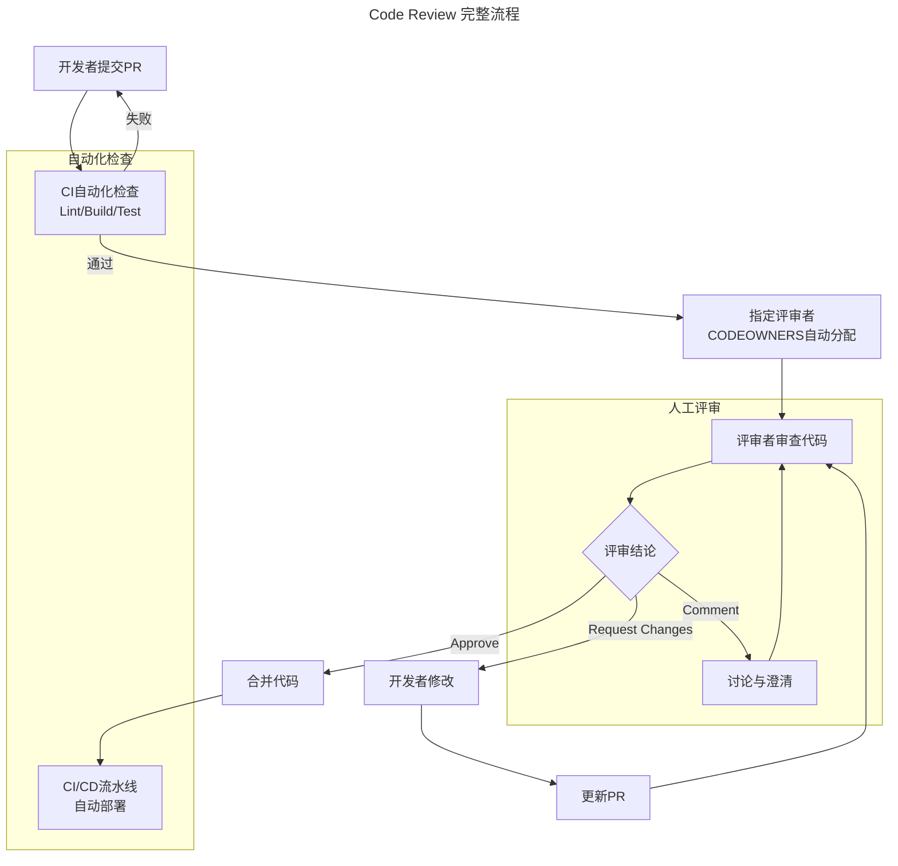

# Code Review：质量保障与工程文化的基石

> **适用范围**：工程师、Tech Lead、工程经理，以及负责制定 Code Review 规范与工具链的工程效能团队。
>
> **更新摘要（v2 · 2026-08 更新）**：
> - 结构化升级为 6 节骨架（导言 / 核心方法论 / 关键流程 / 工具与实战 / 常见误区 / 进阶延展）
> - Mermaid 图补齐 `--- title ---` frontmatter 并补充图后解读
> - 将 2025 AI 辅助 Code Review 工具生态与参考资料整合至"进阶延展"一节
> - 新增"常见误区"小节，归纳评审文化与沟通中的典型反模式

---

## 1. 导言

Code Review（代码评审）是软件开发过程中对源代码进行系统性同级审查的实践，旨在通过多视角审查发现缺陷、传播知识、塑造工程文化。在硅谷技术组织中，Code Review 已成为开发流程的强制性环节，而非可选实践。本文系统阐述 Code Review 的理论基础、流程设计、评审标准、沟通技巧、工具链演进，以及 AI 辅助评审的最新发展。

研究表明，代码评审可检测出 60-90% 的缺陷（IBM 研究），每小时 Review 投入可节省 33 小时的维护成本。Code Review 与测试互补——Review 擅长发现逻辑错误、架构问题、安全漏洞；测试擅长发现功能回归。

---

## 2. 核心方法论

### 质量保障

Code Review 是缺陷检测的高效手段：

- 代码评审可检测出 60-90% 的缺陷（IBM 研究）
- 每小时 Review 投入可节省 33 小时的维护成本
- 与测试互补：Review 擅长发现逻辑错误、架构问题、安全漏洞；测试擅长发现功能回归

### 知识传播

- **隐性知识显性化**：编码技巧、架构模式、业务规则通过 Review 评论传递
- **代码库知识扩散**：评审者通过阅读他人代码了解系统全貌
- **规范内化**：通过反复的 Review 反馈，团队编码规范从约束变为习惯

### 文化塑造

- **质量文化**：Code Review 将质量从个人责任转变为集体责任
- **学习文化**：Review 过程本身就是持续学习的过程
- **开放文化**：代码公开评审降低信息孤岛，促进技术透明

### 评审维度与标准

#### 代码质量

- **格式规范**：遵循团队 Coding Style Guideline，消除风格争议
- **可读性**：
  - 函数长度适中，过长则拆分
  - 变量命名表意明确（如 `hosting_address_hash` 而非 `hah`）
  - 避免深层嵌套的条件/循环语句
  - 避免过长的布尔表达式
  - 注释准确且与代码一致
- **DRY 原则**：重复代码提取为公共方法或模块
- **常量管理**：禁止硬编码魔法数字，统一定义于文件顶部

#### 架构设计

- 文件组织方式与代码库风格一致
- 函数抽象层级合理（Lib/Helper/Service 分层）
- 继承与组合的选择恰当
- API 设计符合 RESTful 规范
- 模块间耦合度与内聚性

#### 安全性

- 输入验证与参数校验
- SQL 注入、XSS 等常见漏洞检查
- 敏感数据处理（加密、脱敏）
- 权限与认证逻辑

#### 性能

- 算法复杂度评估
- 数据库查询优化（N+1 问题、索引使用）
- 缓存策略合理性
- 资源泄漏风险

#### 可维护性

- 错误处理完备性（Error Handling）

典型错误处理审查示例：

```ruby
def update_user_name(params)
  user = User.find(params[:user_id])
  user.name = params[:new_name]
  user.save!
end
```

审查要点：
1. `params` 中是否包含 `user_id` 和 `new_name` 的校验
2. `user_id` 对应的用户是否存在
3. `save!` 的数据库异常处理策略

- 测试用例覆盖所有功能路径
- 防御性编程：预见他人代码变更可能引发的兼容性问题

#### 业务逻辑

- 业务边界条件覆盖
- 逻辑死角排查
- 需求与实现的一致性

---

## 3. 关键流程

### Code Review 流程设计



流程分为自动化检查与人工评审两个子图。自动化检查（CI/CD）负责格式、构建、测试等可机器验证的维度；人工评审负责逻辑、架构、业务等需要判断的维度。两者协同——自动化检查过滤低级问题，人工评审聚焦高价值判断。

### PR 提交规范

**核心概念**：

- **Commit**：源代码的最小原子改动单位
- **Pull Request（PR）**：包含一个或多个 Commit 的代码提交请求，展示与目标分支的完整 Diff

**PR 提交要求**：

1. **目的明确**：PR 描述必须清晰说明变更原因与内容
2. **目标单一**：每个 PR 聚焦一个目的，禁止混合功能开发与代码重构
3. **测试完备**：所有变更必须经过测试验证
4. **变更可视化**：前端变更需附截图（Before/After）

### PR 分类与评审策略

| PR 类型 | 描述 | 评审重点 |
|--------|------|---------|
| Bug 修复 | 关联 Bug Ticket，修复已知缺陷 | 根因分析、回归风险、边界条件 |
| 代码优化 | 重构、文件拆分、性能优化 | 行为等价性、性能度量、无副作用 |
| 系统迁移 | 代码库拆分、语言重写、框架升级 | 迁移完整性、兼容性、回滚方案 |
| 新功能 | 关联 Design Doc，实现新需求 | 设计一致性、API 契约、测试覆盖 |

### 合并规则

- 所有 PR 必须至少 1 人 Approve 方可合并
- 涉及多项目代码需各项目 Owner 分别 Approve
- 关键代码（支付、安全等）需特定组确认
- CODEOWNERS 文件定义代码所有权与强制评审者

### 评审粒度策略

- **新人代码**：全面审查——风格、性能、架构、业务逻辑
- **资深工程师代码**：聚焦业务逻辑与架构设计，风格与性能给予更多信任
- **时间紧张时**：可分层评审——先审查算法与核心逻辑，标注已审查范围

---

## 4. 工具与实战

### 代码托管与评审平台

| 平台 | 特点 |
|------|------|
| GitHub | PR 工作流、CODEOWNERS、Review Assignees、Checks API |
| GitLab | Merge Request、代码质量报告、安全扫描集成 |
| Gerrit | Google 开源，细粒度评审，Change-Id 机制 |
| Phabricator | Differential 评审，审计功能 |

### 自动化检查集成

- **静态分析**：SonarQube、CodeClimate、Semgrep
- **安全扫描**：Snyk、Trivy、Dependabot
- **格式化**：Prettier、Black、gofmt（自动格式化消除风格争议）
- **Lint**：ESLint、RuboCop、Pylint
- **CI 门禁**：PR 合并前必须通过所有自动化检查

### CODEOWNERS 机制

通过 `CODEOWNERS` 文件定义代码所有权：

- 自动分配评审者
- 强制关键代码需特定团队 Approve
- 防止未经授权的代码变更

### 组织层面支持

1. **统一工具与流程**：全公司使用同一 Code Review 平台与工作流
2. **激励机制**：将 Code Review 贡献纳入绩效评估
3. **编码规范**：制定统一的 Coding Style Guideline，消除个人偏好争议
4. **自动化保障**：通过 CI/CD 流水线自动执行 Lint、格式化、静态分析

### 评审者行为准则

**核心原则：帮助成长，而非替代实现**

- ❌ 直接重写他人代码
- ✅ 指出问题并解释原因，引导作者自行修正
- 长期视角：Review 投入 10 倍于自己写的时间，但"复制"了生产力

**沟通技巧**：

| 场景 | 推荐表达 | 避免表达 |
|------|---------|---------|
| 风格建议 | "我个人更倾向于 A 风格，不过这不是硬性规定" | "你应该用 A 风格" |
| 指出问题 | "这里是否需要处理 X 边界情况？" | "你漏了 X" |
| 建议改进 | "考虑将这段逻辑提取为独立方法，可读性会更好" | "这段代码太乱了" |
| 不同意见 | "我的理解是...，你觉得呢？" | "你这样不对" |

---

## 5. 常见误区

### 误区一：评审者直接重写他人代码

评审者越俎代庖直接修改代码，剥夺作者学习机会。**纠正**：指出问题并解释原因，引导作者自行修正——帮助成长，而非替代实现。

### 误区二：评审沦为风格之争

将大量时间消耗在代码风格争议上。**纠正**：制定统一的 Coding Style Guideline，通过自动化工具（Prettier、gofmt）消除风格争议。

### 误区三：评审沟通居高临下

使用"你漏了""你这样不对"等指责性表达，破坏心理安全。**纠正**：使用"这里是否需要处理 X 边界情况？""我的理解是...，你觉得呢？"等协作性表达。

### 误区四：PR 目标混杂

一个 PR 同时包含功能开发与代码重构，增加评审难度与回滚风险。**纠正**：每个 PR 聚焦一个目的，禁止混合功能开发与代码重构。

### 误区五：仅审查代码风格，忽视架构与业务逻辑

评审流于形式，仅检查格式而忽视逻辑正确性、架构合理性、业务边界条件。**纠正**：评审深度应关注逻辑正确性、边界条件、异常处理，而非仅代码风格。

### 误区六：新人代码与资深代码采用同一评审标准

对新人代码仅审查风格，对资深代码过度审查细节。**纠正**：新人代码全面审查（风格、性能、架构、业务逻辑），资深工程师代码聚焦业务逻辑与架构设计。

---

## 6. 进阶延展

### 2025 年 AI 辅助 Code Review

#### AI Review 工具生态

2025 年，AI 辅助 Code Review 已从实验性工具发展为工程实践标配：

| 工具 | 能力 |
|------|------|
| GitHub Copilot Code Review | 自动生成 PR 摘要、检测常见缺陷、建议改进 |
| CodeRabbit | AI 驱动的 PR 评审，提供逐行评论与摘要 |
| Amazon CodeGuru | AWS 生态的 AI 代码评审与性能建议 |
| Sourcery | 自动化代码质量改进建议 |

#### AI Review 的核心能力

- **缺陷检测**：识别常见 Bug 模式（空指针、资源泄漏、竞态条件）
- **安全审计**：检测 OWASP Top 10 安全漏洞
- **代码质量**：评估可读性、复杂度、可维护性
- **变更摘要**：自动生成 PR 描述与影响分析
- **测试建议**：推荐缺失的测试用例

#### AI Review 的局限与最佳实践

**局限**：

- 无法理解深层业务逻辑与领域知识
- 可能产生误报，需人工校验
- 对架构级问题的理解有限

**最佳实践**：

- AI Review 作为预检环节，不替代人工评审
- 将 AI 建议分类为"必须修复"与"建议改进"
- 持续校准 AI 工具的规则与阈值
- 保留人工评审对业务逻辑与架构的判断

### 未来展望

- **上下文感知评审**：AI 理解完整代码库上下文，提供更精准建议
- **自动修复**：AI 不仅检测问题，还生成修复代码
- **架构级评审**：AI 评估变更对系统架构的影响
- **个性化反馈**：根据开发者经验水平调整评审深度与表达方式

### 参考资料与延伸阅读

- Google Engineering Practices Documentation: https://google.github.io/eng-practices/review/
- SmartBear: Best Practices for Peer Code Review
- Michael Fagan: Design and Code Inspections to Reduce Errors in Program Development (1976)
- "The Code Reviewer's Guide" by Google
- GitHub Flow: https://docs.github.com/en/get-started/quickstart/github-flow
- OWASP Code Review Guide: https://owasp.org/www-project-code-review-guide/
