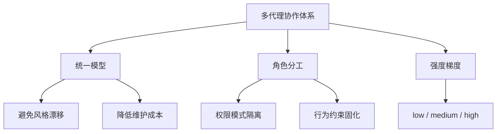
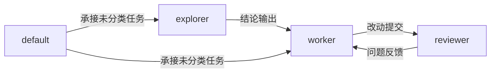
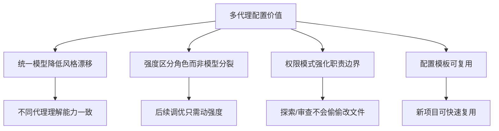

# AI多代理协作配置实践

## 概述

在 AI 辅助开发工作流中，将"探索代码""执行改动""代码审查"等职责拆分给不同子代理（Sub-Agent），是提升任务质量和效率的关键策略。本文记录多代理协作的配置方法论，包括角色划分原则、权限模型设计、推理强度分配，以及从项目级验证到全局推广的落地路径。

## 前置知识

- 了解 AI 辅助编码工具的基本使用（如 Copilot、Cursor、Codex 等）
- 理解角色分离（Separation of Concerns）在软件工程中的应用
- 了解 TOML 配置文件基本语法

## 学习目标

- 理解多代理协作中角色划分的设计原则
- 掌握通过权限模式和推理强度区分角色的方法
- 能够设计适合自身项目的子代理配置方案
- 理解"先局部验证，再推广全局"的配置落地策略

---

## 一、设计目标

多代理配置的核心目标：

1. **统一模型基座**：所有子代理使用相同模型，避免输出风格和推理质量波动
2. **职责边界清晰**：通过权限模式和行为约束固化角色分工
3. **强度按需分配**：仅通过推理强度（reasoning effort）区分工作深度



---

## 二、角色设计

### 2.1 四角色模型

| 子代理 | 推理强度 | 权限模式 | 主要职责 |
|--------|---------|---------|---------|
| default | medium | workspace-write | 通用任务承接、常规分析与实现 |
| explorer | low | read-only | 代码探索、入口定位、调用链梳理 |
| worker | medium | workspace-write | 定点实现、问题修复、局部验证 |
| reviewer | high | read-only | 正确性审查、回归风险识别、测试缺口提示 |

### 2.2 角色设计原则



**核心约束**：

- `explorer` 专注"读"和"找"，不直接改代码 → `read-only`
- `worker` 专注落地实现，不做无关重构 → `workspace-write`
- `reviewer` 专注"判断"和"质疑"，不直接修改 → `read-only`
- `default` 承接通用任务，保持范围收敛 → `workspace-write`

### 2.3 强度分配逻辑

| 强度 | 适用场景 | 选择理由 |
|------|---------|---------|
| low | 代码检索、结构梳理、结论归纳 | 探索类任务不需要深度推理 |
| medium | 日常实现、定点修改、通用分析 | 效率与稳定性的平衡点 |
| high | 回归风险识别、逻辑严谨性审查 | 审查需要更深的推理和质疑能力 |

---

## 三、配置结构

### 3.1 目录布局

```
.codex/
├── config.toml          # 总配置（并发限制、层级限制）
└── agents/
    ├── default.toml     # 通用代理
    ├── explorer.toml    # 探索代理
    ├── worker.toml      # 执行代理
    └── reviewer.toml    # 审查代理
```

### 3.2 总配置

```toml
[agents]
max_threads = 6    # 最多并行 6 个子代理任务
max_depth = 1      # 单层委派，避免递归创建导致上下文失控
```

`max_depth = 1` 是偏稳妥的起步方案，适合文档类、前端类和中等规模代码修改任务。

### 3.3 子代理配置示例

**explorer.toml**（探索代理）：

```toml
name = "explorer"
model = "gpt-5.4"
model_reasoning_effort = "low"
sandbox_mode = "read-only"
```

**reviewer.toml**（审查代理）：

```toml
name = "reviewer"
model = "gpt-5.4"
model_reasoning_effort = "high"
sandbox_mode = "read-only"
```

---

## 四、配置层级策略

### 4.1 全局 vs 项目级

| 配置层级 | 路径 | 作用 |
|---------|------|------|
| 全局配置 | `~/.codex/` | 所有项目共享的基础代理体系 |
| 项目配置 | `项目根/.codex/` | 项目级覆盖或扩展 |

执行优先级：项目配置 > 全局配置

### 4.2 落地顺序


采用"先局部验证，再推广全局"的策略：

1. 先在当前项目新增项目级配置
2. 确认配置结构和角色划分合理
3. 方案可用后同步到全局
4. 后续项目如需特殊 agent，可单独覆盖

---

## 五、行为约束设计

除模型与强度外，每个子代理应配置专门的 `developer_instructions`，固化职责边界：

| 角色 | 行为约束要点 |
|------|------------|
| explorer | 专注探索，输出结构化结论，不修改任何文件 |
| worker | 按指令定点修改，不顺手做无关重构 |
| reviewer | 优先关注真实缺陷和回归风险，而非风格问题 |
| default | 承接通用任务时保持范围收敛，不扩散 |

---

## 六、使用建议

### 6.1 显式委派

子代理通常不会自动无条件触发，建议在任务提示中明确委派意图：

```text
开两个 subagents 并行：
1. explorer 先定位主题设置抽屉的状态流和入口文件
2. reviewer 审查这次改动的回归风险和测试缺口
```

或按流水线顺序：

```text
先用 explorer 梳理通信链路，
再让 worker 做定点修改，
最后让 reviewer 做一次回归审查。
```

### 6.2 配置生效

修改配置后建议重开会话，确保新配置从启动阶段被读取。

### 6.3 后续扩展

当项目出现大量固定类型任务时，可继续拆出新角色：

- `doc-writer`：文档编写
- `frontend-refactor`：前端重构
- `test-auditor`：测试审计

初期建议保持 4 角色体系，复杂度更可控。

---

## 七、配置价值总结



---

## 常见问题

| 问题 | 解决方案 |
|------|---------|
| 子代理输出风格不一致 | 统一模型基座，仅调整推理强度 |
| explorer 修改了文件 | 设置 `sandbox_mode = "read-only"` |
| reviewer 直接改代码 | 权限隔离 + 行为约束明确"只审不改" |
| 子代理递归创建子代理 | 设置 `max_depth = 1` 限制层级 |
| 配置不生效 | 重开会话，确保启动时读取新配置 |

---

## 最佳实践

1. **统一模型，梯度强度**：避免用不同模型分裂角色
2. **权限最小化**：只读角色不给写权限
3. **先验证后推广**：项目级确认可用再同步全局
4. **行为约束固化**：把职责边界写进配置文件而非口头约定
5. **保持简洁**：初期 4 角色足够，按需扩展
6. **显式委派**：在提示词中明确指定使用哪个子代理

---

## 延伸阅读

- OpenAI Codex 多代理文档
- 软件工程中的关注点分离（Separation of Concerns）原则
- 最小权限原则（Principle of Least Privilege）
