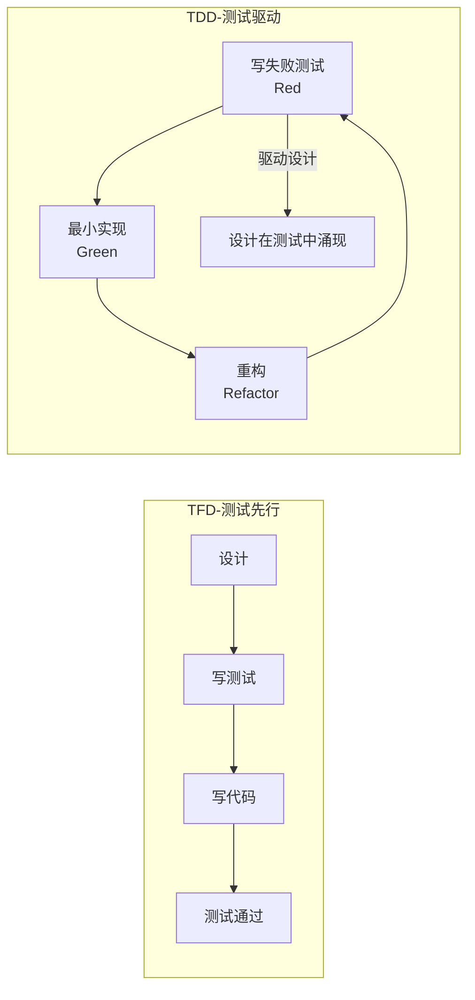
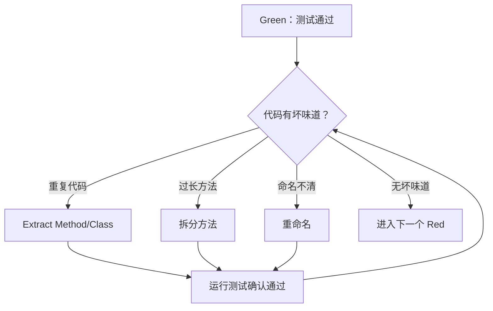
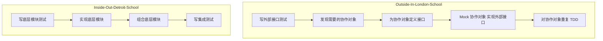
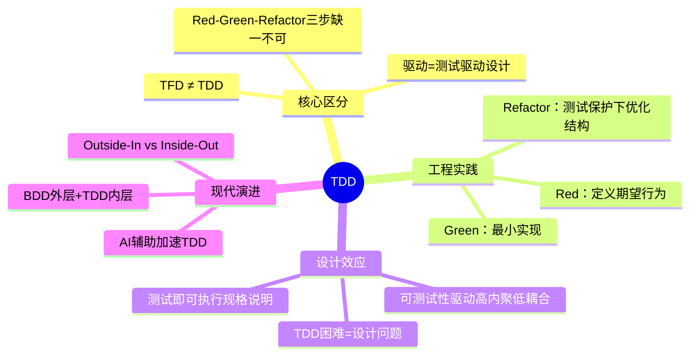
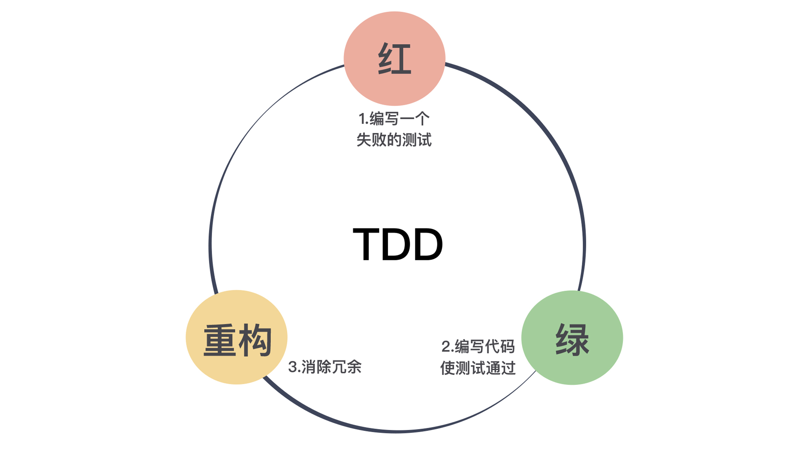

# 先写测试，就是测试驱动开发吗

## 核心命题

**测试先行开发（Test First Development）≠ 测试驱动开发（Test Driven Development）**。两者的关键差异在于"驱动"——TDD 不仅仅是"先写测试后写代码"，更是一种**通过测试来驱动设计决策**的工程实践。TDD 的核心节奏是 **Red-Green-Refactor**，其本质是将"功能实现"分解为"定义行为→最小实现→优化结构"三个独立步骤。

---

## 1. Test First ≠ TDD：精确区分

### 1.1 两种实践的本质差异

| 维度 | 测试先行开发（TFD） | 测试驱动开发（TDD） |
|------|---------------------|---------------------|
| **核心理念** | 先写测试，后写代码 | 用测试**驱动**设计与实现 |
| **测试的作用** | 验证代码正确性 | 定义期望行为 + 驱动设计 |
| **重构步骤** | 可选 | **必须**（Red-Green-Refactor 三步缺一不可） |
| **设计导向** | 先有设计，测试验证 | 测试即设计，代码跟随测试演进 |
| **增量粒度** | 按功能模块增量 | 按最小行为增量 |



### 1.2 "驱动"的含义

> **驱动（Driven）** 意味着测试不仅是验证工具，更是**设计工具**——测试的编写过程本身就是对"功能应该如何行为"的思考过程。

TDD 的三个步骤对应三种不同的思维活动：

| 步骤 | 思维活动 | 问题 |
|------|---------|------|
| **Red（写失败测试）** | **定义期望行为** | "这个功能应该做什么？" |
| **Green（最小实现）** | **最小化实现** | "怎样用最少的代码使测试通过？" |
| **Refactor（重构）** | **优化结构** | "如何让代码更清晰、更易维护？" |

---

## 2. Red-Green-Refactor 的工程实践

### 2.1 Red：定义行为

Red 阶段的核心是**在写任何实现代码之前，先定义期望行为**。这一步骤的关键约束：

1. **一个测试只验证一个行为**——保持单一关注点
2. **测试必须失败**——确保测试确实能检测缺失的实现
3. **失败信息应清晰**——从失败信息即可推断期望行为

```java
// Red：定义"购物车应能计算含税总价"的行为
@Test
void shouldCalculateTotalWithTax() {
    ShoppingCart cart = new ShoppingCart();
    cart.addItem(new Item("Book", BigDecimal.valueOf(100.00)));
    BigDecimal total = cart.calculateTotalWithTax(BigDecimal.valueOf(0.08));
    assertThat(total).isEqualByComparingTo(BigDecimal.valueOf(108.00));
}
```

### 2.2 Green：最小实现

Green 阶段的核心是**用最少的代码使测试通过**，不应在此时考虑代码优雅性：

| 策略 | 描述 | 适用场景 |
|------|------|---------|
| **硬编码** | 直接返回期望值 | 第一个测试、探索性实现 |
| **简单实现** | 实现刚好满足当前测试的逻辑 | 测试覆盖了基本场景 |
| **三角测量** | 通过多个测试案例推导通用实现 | 不确定通用算法时 |

> **原则**：不要在 Green 阶段过度设计。重构是下一步的事。

### 2.3 Refactor：消除重复与优化结构

Refactor 阶段的核心是**在测试保护下安全地优化代码**：



**重构的安全保障**：

- 重构前：所有测试 Green
- 重构中：每一步微重构后立即运行测试
- 重构后：所有测试仍然 Green → 行为未改变，结构已优化

---

## 3. TDD 的设计驱动效应

### 3.1 测试即设计文档

TDD 的测试用例构成了一份**可执行的规格说明**：

```java
// 这组测试即文档：定义了"用户登录"的完整行为
@Test void shouldLoginWithValidCredentials() { ... }
@Test void shouldRejectInvalidPassword() { ... }
@Test void shouldLockAccountAfterThreeFailedAttempts() { ... }
@Test void shouldUnlockAccountAfterTimeout() { ... }
```

| 传统文档 | TDD 测试 |
|---------|---------|
| 静态、易过时 | 动态、始终与代码同步 |
| 语义模糊 | 精确断言 |
| 无法验证正确性 | 每次构建自动验证 |

### 3.2 TDD 与可测试性设计

TDD 天然驱动代码走向**高内聚、低耦合**的设计：

| TDD 困难 | 设计问题 | 重构方向 |
|----------|---------|---------|
| 测试难以初始化 | 依赖过多 | 依赖注入 |
| 测试难以隔离 | 静态方法/单例 | 实例化 + 接口抽象 |
| 测试顺序敏感 | 共享可变状态 | 不可变对象/值对象 |
| Mock 复杂 | 职责不清 | 单一职责拆分 |

> **反向推理**：如果 TDD 实践困难，说明设计本身存在问题。TDD 是设计的"雷达"——难以测试的代码往往也是难以维护的代码。

---

## 4. TDD 的现代实践演进

### 4.1 TDD 与 AI 编程助手的协作

2024-2025 年，AI 编程助手为 TDD 带来了新的工作流：

| 阶段 | AI 辅助 | 人类职责 |
|------|---------|---------|
| **Red** | AI 生成测试骨架 | 审核断言是否准确表达业务意图 |
| **Green** | AI 生成最小实现 | 审核实现是否符合约束 |
| **Refactor** | AI 建议重构方案 | 审核重构方向是否合理 |

> **原则**：AI 可加速 TDD 的执行，但**测试断言的业务语义必须由人类审核**——AI 不理解业务上下文。

### 4.2 TDD 与 BDD 的关系

| 维度 | TDD | BDD |
|------|-----|-----|
| 关注点 | 代码级行为 | 业务级行为 |
| 语言 | 编程语言 | 业务语言（Given-When-Then） |
| 驱动层次 | 单元/方法级 | 功能/场景级 |
| 工具 | JUnit、pytest | Cucumber、SpecFlow |
| 适用者 | 开发者 | 开发者 + 产品 + QA |

**最佳实践**：BDD 在功能级定义行为（外层循环），TDD 在实现级驱动设计（内层循环）。

### 4.3 Outside-In TDD（London School）

与传统的 Inside-Out TDD（Detroit School）不同，London School 主张从外部接口开始测试，由外向内驱动设计：



| 学派 | 起点 | Mock 使用 | 设计导向 | 适用场景 |
|------|------|----------|---------|---------|
| **London School** | 外部接口 | 大量 Mock | 交互驱动 | 新系统、接口设计优先 |
| **Detroit School** | 内部模块 | 少量 Mock/Fake | 状态驱动 | 算法密集、已有系统扩展 |

---

## 5. 总结



**核心要义**：先写测试不等于 TDD。TDD 的"驱动"意味着测试不仅是验证工具，更是设计工具。Red-Green-Refactor 的节奏，将"功能实现"分解为"定义行为→最小实现→优化结构"三个独立步骤，每一步都有明确的输入、输出和验证标准。

---

> **延伸阅读**
>
> - Kent Beck, *Test Driven Development: By Example* (2002): TDD 奠基之作
> - Kent Beck, *Extreme Programming Explained* (1999): 极限编程与 TDD 的源流
> - "Growing Object-Oriented Software, Guided by Tests" (Steve Freeman & Nat Pryce, 2009): London School TDD
> - Martin Fowler, "TestDrivenDevelopment": https://martinfowler.com/bliki/TestDrivenDevelopment.html

---

## 原文存档

> 以下为郑晔原文完整内容，保留作为参考。

## 13 | 先写测试，就是测试驱动开发吗？

在前文中，我向你说明了为什么程序员应该写测试，今天我准备与你讨论一下程序员应该在什么阶段写测试。

或许你会说，写测试不就是先写代码，然后写测试吗？没错，这是一个符合直觉的答案。但是，这个行业里确实有人探索了一些不同的做法。接下来，我们就将进入不那么直觉的部分。

既然自动化测试是程序员应该做的事，那是不是可以做得更极致一些，在写代码之前就把测试先写好呢？

有人确实这么做了，于是，形成了一种先写测试，后写代码的实践，这个实践的名字是什么呢？它就是测试先行开发（Test First Development）。

我知道，当我问出这个问题的时候，一个名字已经在很多人的脑海里呼之欲出了，那就是 **测试驱动开发（Test Driven Development）**，也就是大名鼎鼎的 **TDD**，TDD 正是我们今天内容的重点。

在很多人看来，TDD 就是先写测试后写代码。在此我必须澄清一下，这个理解是错的。先写测试，后写代码的实践指的是测试先行开发，而非测试驱动开发。

下一个问题随之而来，测试驱动开发到底是什么呢？测试驱动开发和测试先行开发只差了一个词：驱动。只有理解了什么是驱动，才能理解了测试驱动开发。要理解驱动，先来看看这两种做法的差异。

### 测试驱动开发

学习 TDD 的第一步，是要记住TDD的节奏：“红-绿-重构”。



红，表示写了一个新的测试，测试还没有通过的状态；绿，表示写了功能代码，测试通过的状态；而重构，就是在完成基本功能之后，调整代码的过程。

这里说到的“红和绿”，源自单元测试框架，测试不过的时候展示为红色，通过则是绿色。这在单元测试框架形成之初便已经约定俗成，各个不同语言的后代也将它继承了下来。

我们前面说过，让单元测试框架流行起来的是 JUnit，它的作者之一是 Kent Beck。同样，也是 Kent Beck 将 TDD 从一个小众圈子带到了大众视野。

考虑到 Kent Beck 是单元测试框架和 TDD 共同的贡献者，你就不难理解为什么 TDD 的节奏叫“红-绿-重构”了。

测试先行开发和测试驱动开发在第一步和第二步是一样的，先写测试，然后写代码完成功能。二者的差别在于，测试驱动开发并没有就此打住，它还有一个更重要的环节： **重构（refactoring）。**

也就是说，在功能完成而且测试跑通之后，我们还会再次回到代码上，处理一下代码上写得不好的地方，或是新增代码与旧有代码的重复。因为我们第二步“绿”的关注点，只在于让测试通过。

**测试先行开发和测试驱动开发的差异就在重构上。**

很多人通过了测试就认为大功告成，其实，这是忽略了新增代码可能带来的“坏味道（Code Smell）”。

如果你真的理解重构，你就知道，它就是一个消除代码坏味道的过程。一旦你有了测试，你就可以大胆地重构了，因为任何修改错误，测试会替你捕获到。

在测试驱动开发中，重构与测试是相辅相成的：没有测试，你只能是提心吊胆地重构；没有重构，代码的混乱程度是逐步增加的，测试也会变得越来越不好写。

**因为重构和测试的互相配合，它会驱动着你把代码写得越来越好。这是对“驱动”一词最粗浅的理解。**

### 测试驱动设计

接下来，我们再来进一步理解“驱动”： **由测试驱动代码的编写。**

许多人抗拒测试有两个主要原因：第一，测试需要“额外”的工作量。这里我特意把额外加上引号，因为，你也许本能上认为，测试是额外的工作，但实际上，测试也应该是程序员工作的一部分，这在上一篇文章中我已经讲过。

第二，很多人会觉得代码太多不好测。之所以这些人认为代码不好测，其中暗含了一个假设：代码已经写好了，然后，再写测试来测它。

如果我们把思路反过来，我有一个测试，怎么写代码能通过它。一旦你先思考测试，设计思路就完全变了： **我的代码怎么写才是能测试的，也就是说，我们要编写具有可测试性的代码。** 用这个角度，测试是不是就变得简单了呢？

这么说还是有些抽象，我们举个写代码中最常见的问题：static 方法。

很多人写代码的时候喜欢使用 static 方法，因为用着省事，随便在哪段代码里面，直接引用这个 static 方法就可以。可是，一旦当你写测试的时候，你就会发现一个问题，如果你的代码里直接调用一个static 方法，这段代码几乎是没法测的。尤其是这个 static 方法里面有一些业务逻辑，根据不同业务场景返回各种值。为什么会这样？

我们想想，常见的测试手法应该是什么样的？如果我们在做的是单元测试，那测试的目标应该就是一个单元，在这个面向对象作为基础设施流行的时代，这个单元大多是一个类。测试一个类，尤其是一个业务类，一般会涉及到一些与之交互的类。

比如，常见的 REST 服务三层架构中，资源层要访问服务层，而在服务层要访问数据层。编写服务层代码时，因为要依赖数据层。所以，测试服务层通常的做法是，做一个假的数据层对象，这样即便数据层对象还没有编写，依然能够把服务层写完测好。

在之前的“蛮荒时代”，我们通常会写一个假的类，模拟被依赖那个类，因为它是假的，我们会让它返回固定的值，使用这样的类创建出来的对象，我们一般称之为 Stub 对象。

这种“造假”的方案之所以可行，一个关键点在于，这个假对象和原有对象应该有相同的接口，遵循同样的契约。从设计上讲，这叫符合 Liskov 替换法则。这不是我们今天讨论的重点，就不进一步展开了。

因为这种“造假”的方案实在很常见，所以，有人做了框架支持它，就是常用的 Mock 框架。使用 Mock 对象，我们可以模拟出被依赖对象的各种行为，返回不同的值，抛出异常等等。

它之所以没有用原来 Stub 这个名字，是因为这样的 Mock 对象往往有一个更强大的能力：验证这个 Mock 对象在方法调用过程中的使用情况，比如调用了几次。

我们回到 static 的讨论上，你会发现 Mock 对象的做法面对 static 时行不通了。因为它跳出了对象体系，static 方法是没法继承的，也就是说，没法用一系列面向对象的手法处理它。你没有办法使用 Mock 对象，也就不好设置对应的方法返回值。

要想让这个方法返回相应的值，你必须打开这个 static 方法，了解它的实现细节，精心地按照里面的路径，小心翼翼地设置对应的参数，才有可能让它给出一个你预期的结果。

更糟糕的是，因为这个方法是别人维护的，有一天他心血来潮修改了其中的实现，你小心翼翼设置的参数就崩溃了。而要重新进行设置的话，你只能把代码重读一遍。

如此一来，你的工作就退回到原始的状态。更重要的是，它并不是你应该关注的重点，这也不会增加你的 KPI。显然，你跑偏了。

讨论到这里你已经知道了 static 方法对测试而言，并不友好。所以，如果你要想让你的代码更可测， **一个好的解决方案是尽量不写 static 方法。**

这就是“从测试看待代码，而引起的代码设计转变”的一个典型例子。

关于 static 方法，我再补充几点。static 方法从本质上说，是一种全局方法，static 变量就是一种全局变量。我们都知道，全局方法也好，全局变量也罢，都是我们要在程序中努力消除的。一旦放任 static 的使用，就会出现和全局变量类似的效果，你的程序崩溃了，因为别人在另外的地方修改了代码，代码变得脆弱无比。

static 是一个方便但邪恶的东西。所以，要限制它的使用。除非你的 static 方法是不涉及任何状态而且行为简单，比如，判断字符串是否为空。否则，不要写 static 方法。你看出来了，这样的 static 方法更适合做库函数。所以，我们日常写应用时，能不用尽量不用。

前面关于 static 方法是否可以 Mock 的讨论有些绝对，市面上确实有某些框架是可以 Mock static方法的，但我不建议使用这种特性，因为它不是一种普遍适用的解决方案，只是某些特定语言特定框架才有。

更重要的是，正如前面所说，它会在设计上将你引到一条不归路上。

如果你在自己的代码遇到第三方的 static 方法怎么办，很简单，将第三方代码包装一下，让你的业务代码面对的都是你自己的封装就好了。

以我对大多数人编程习惯的认知，上面这个说法是违反许多人编程直觉的，但如果你从代码是否可测的角度分析，你就会得到这样的结论。

先测试后写代码的方式，会让你看待代码的角度完全改变，甚至要调整你的设计，才能够更好地去测试。所以，很多懂 TDD 的人会把 TDD 解释为测试驱动设计（Test Driven Design）。

还有一个典型的场景，从测试考虑会改变的设计，那就是依赖注入（Dependency Injection）。

不过，因为 Spring 这类 DI 容器的流行，现在的代码大多都写成了符合依赖注入风格的代码。原始的做法是直接 new 一个对象，这是符合直觉的做法。但是，你也可以根据上面的思路，自己推演一下，从 new 一个对象到依赖注入的转变。

有了编写可测试代码的思路，即便你不做 TDD，依然对你改善软件设计有着至关重要的作用。所以， **写代码之前，请先想想怎么测。**

即便我做了调整，是不是所有的代码就都能测试了呢？不尽然。从我个人的经验上看，不能测试的代码往往是与第三方相关的代码，比如访问数据库的代码，或是访问第三方服务之类的。但不能测试的代码已经非常有限了。我们将它们隔离在一个小角落就好了。

至此，我们已经从理念上讲了怎样做好 TDD。有的人可能已经跃跃欲试了，但更多的人会用自己所谓的“经验”告诉你，TDD 并不是那么好做的。

怎么做好 TDD 呢？下一部分，我会给你继续讲解，而且，我们“任务分解大戏”这个时候才开始真正拉开大幕！

### 总结时刻

一些优秀的程序员不仅仅在写测试，还在探索写测试的实践。有人尝试着先写测试，于是，有了一种实践叫测试先行开发。还有人更进一步，一边写测试，一边调整代码，这叫做测试驱动开发，也就是 TDD。

从步骤上看，关键差别就在，TDD 在测试通过之后，要回到代码上，消除代码的坏味道。

测试驱动开发已经是行业中的优秀实践，学习测试驱动开发的第一步是，记住测试驱动开发的节奏：红——绿——重构。把测试放在前面，还带来了视角的转变，要编写可测的代码，为此，我们甚至需要调整设计，所以，有人也把 TDD 称为测试驱动设计。

如果今天的内容你只能记住一件事，那请记住： **我们应该编写可测的代码。**

最后，我想请你分享一下，你对测试驱动开发的理解是怎样的呢？学习过这篇内容之后，你又发现了哪些与你之前理解不尽相同的地方呢？

感谢阅读，如果你觉得这篇文章对你有帮助的话，也欢迎把它分享给你的朋友。