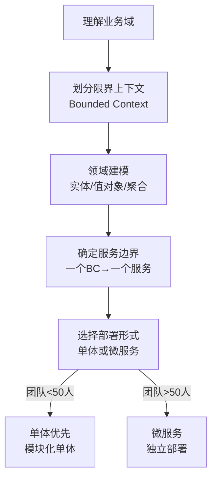
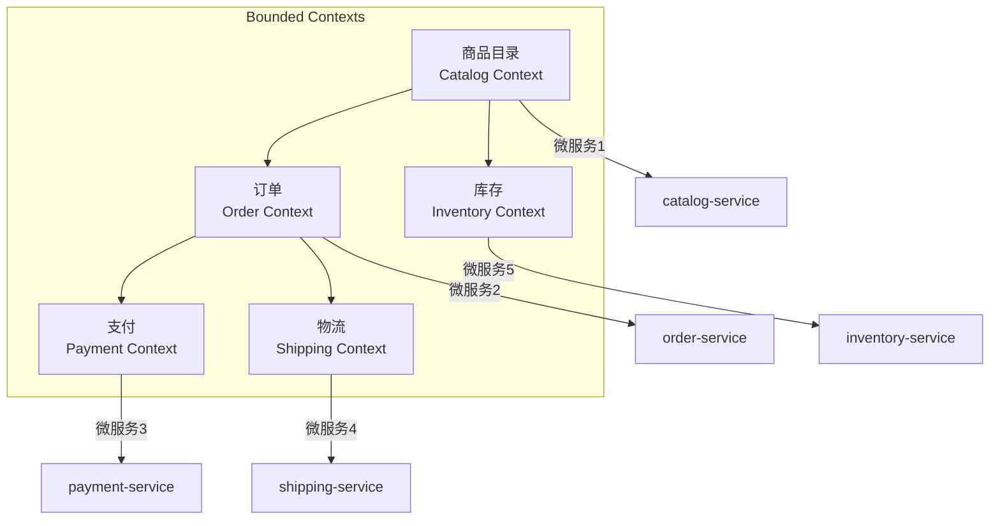

# 先做好DDD再谈微服务吧，那只是一种部署形式

## 核心命题

微服务的本质是**一种部署形式**，而非架构本身。没有 DDD（领域驱动设计）作为基础，微服务只会变成"分布式单体"——服务间耦合依旧，只是增加了分布式系统的复杂性代价。**先做好领域建模和限界上下文划分，再考虑微服务拆分**，这是正确的顺序。

---

## 1. 微服务的本质与前提

### 1.1 微服务的正确理解

| 误解 | 正解 |
|------|------|
| 微服务 = 把系统拆成小服务 | 微服务 = 按业务领域边界（Bounded Context）拆分的独立部署单元 |
| 微服务 = Spring Cloud 工具集 | 微服务 = 一种部署策略，技术选型是次要的 |
| 微服务 = 一切都要拆 | 微服务 = 仅在必要时拆，单体优先 |

### 1.2 DDD → 微服务的正确路径

---

## 2. 分布式单体：微服务的失败模式

### 2.1 分布式单体的特征

| 特征 | 说明 | 后果 |
|------|------|------|
| **服务间共享数据库** | 多个服务访问同一个库 | 无法独立部署和演进 |
| **服务间同步调用链过长** | A→B→C→D 串行调用 | 一处故障全链失败 |
| **服务按技术层拆分** | UI服务、业务服务、数据服务 | 业务变更需跨多个服务 |
| **缺乏 API 契约** | 服务间接口随意变化 | 集成频繁出问题 |

### 2.2 微服务的代价清单

| 代价 | 说明 | 缓解措施 |
|------|------|---------|
| **分布式通信** | 网络延迟、序列化开销 | gRPC / 服务网格 |
| **数据一致性** | 跨服务事务困难 | Saga / Eventual Consistency |
| **运维复杂度** | 多服务部署、监控、调试 | GitOps + 平台工程 |
| **组织协调** | 多团队协作成本 | API 契约 + 契约测试 |

> **Martin Fowler 的忠告**：不要从微服务开始——先从单体开始，在边界清晰后再拆分（MonolithFirst）。

---

## 3. DDD 的 Bounded Context → 微服务边界

### 3.1 示例：电商系统的 Bounded Context 划分

---

## 4. 总结

**核心要义**：先做好 DDD 再谈微服务。微服务是部署形式，DDD 是设计方法。没有好的领域划分，微服务只会变成分布式单体——增加了复杂性，但没有获得独立演进的收益。

---

> **延伸阅读**
>
> - Martin Fowler, "Microservices": https://martinfowler.com/articles/microservices.html
> - Martin Fowler, "MonolithFirst": https://martinfowler.com/bliki/MonolithFirst.html
> - Eric Evans, *Domain-Driven Design* (2003)
> - Vaughn Vernon, *Implementing Domain-Driven Design* (2013)
---

## 原文存档

> 以下为郑晔原文完整内容，保留作为参考。

## 37 | 先做好DDD再谈微服务吧，那只是一种部署形式

在“自动化”模块的最后，我们来聊一个很多人热衷讨论却没做好的实践：微服务。

在今天做后端服务似乎有一种倾向，如果你不说自己做的是微服务，出门都不好意思和人打招呼。

一有技术大会，各个大厂也纷纷为微服务出来站台，不断和你强调自己公司做微服务带来的各种收益，下面的听众基本上也是热血沸腾，摩拳擦掌，准备用微服务拯救自己的业务。

我就亲眼见过这样的例子，几个参加技术大会的人回到公司，跟人不断地说微服务的好，说服了领导，在接下来大的项目改造中启用了微服务。

结果呢？一堆人干了几个月，各自独立开发的微服务无法集成。最后是领导站出来，又花了半个月时间，将这些“微服务”重新合到了一起，勉强将这个系统送上了线。

人家的微服务那么美，为什么到你这里却成了烂摊子呢？因为你只学到了微服务的形。

### 微服务

大部分人对微服务的了解源自 James Lewis 和 Martin Fowler 在2014年写的 [一篇文章](http://www.martinfowler.com/articles/microservices.html)，他们在其中给了微服务一个更清晰的定义，把它当作了一种新型的架构风格。

但实际上，早在这之前的几年，很多人就开始用“微服务”这个词进行讨论了。

“在企业内部将服务有组织地进行拆分”这个理念则脱胎于 SOA（Service Oriented Architecture，面向服务的架构），只不过，SOA 诞生自那个大企业操盘技术的年代，自身太过于复杂，没有真正流行开来。而微服务由于自身更加轻量级，符合程序员的胃口，才得以拥有更大的发展空间。

谈到微服务，你会想起什么呢？很多人对微服务的理解，就是把一个巨大的后台系统拆分成一个一个的小服务，再往下想就是一堆堆的工具了。

所以，市面上很多介绍微服务的内容，基本上都是在讲工具的用法，或是一些具体技术的讨论，比如，用 Spring Boot 可以快速搭建服务，用 Spring Cloud 建立分布式系统，用 Service Mesh 技术作为服务的基础设施，以及怎么在微服务架构下保证事务的一致性，等等。

确实，这些内容在你实现微服务时，都是有价值的。但必须先回答一个问题，我们为什么要做微服务？

对这个问题的标准回答是，相对于整体服务（Monolithic）而言，微服务足够小，代码更容易理解，测试更容易，部署也更简单。

这些道理都对，但这是做好了微服务的结果。怎么才能达到这个状态呢？这里面有一个关键因素， **怎么划分微服务，也就是一个庞大的系统按照什么样的方式分解。**

这是在很多关于微服务的讨论中所最为欠缺的，也是很多团队做“微服务”却死得很难看的根本原因。

不了解这一点，写出的服务，要么是服务之间互相调用，造成整个系统执行效率极低；要么是你需要花大力气解决各个服务之间的数据一致性。换句话说，服务划分不好，等待团队的就是无穷无尽的偶然复杂度泥潭。只有正确地划分了微服务，它才会是你心目中向往的样子。

**那应该怎么划分微服务呢？你需要了解领域驱动设计。**

### 领域驱动设计

领域驱动设计（Domain Driven Design，DDD）是 Eric Evans 提出的从系统分析到软件建模的一套方法论。它要解决什么问题呢？就是将业务概念和业务规则转换成软件系统中概念和规则，从而降低或隐藏业务复杂性，使系统具有更好的扩展性，以应对复杂多变的现实业务问题。

这听上去很自然，不就应该这么解决问题吗？并不然，现实情况可没那么理想。

在此之前，人们更多还是采用面向数据的建模方式，时至今日，还有许多团队一提起建模，第一反应依然是建数据库表。这种做法是典型的面向技术实现的做法。一旦业务发生变化，团队通常都是措手不及。

**DDD 到底讲了什么呢？它把你的思考起点，从技术的角度拉到了业务上。**

贴近业务，走近客户，我们在这些内容中已经提到过很多次。但把这件事直接体现在写代码上，恐怕还是很多人不那么习惯的一件事。DDD 最为基础的就是通用语言（Ubiquitous Language），让业务人员和程序员说一样的语言。

这一点我在《 [21 \| 你的代码为谁而写？](http://time.geekbang.org/column/article/82581)》中已经提到过了。使用通用语言，等于把思考的层次从代码细节中拉到了业务层面。越高层的抽象越稳定，越细节的东西越容易变化。

有了通用语言做基础，然后就要进入到 DDD 的实战环节了。DDD 分为战略设计（Strategic Design）和战术设计（Tactical Design）。

战略设计是高层设计，它帮我们将系统切分成不同的领域，并处理不同领域的关系。我在 [前面的内容](http://time.geekbang.org/column/article/82581) 中给你举过“订单”和“用户”的例子。从业务上区分，把不同的概念放到不同的地方，这是从根本上解决问题，否则，无论你的代码写得再好，混乱也是不可避免的。而这种以业务的角度思考问题的方式就是 DDD 战略设计带给我的。

战术设计，通常是指在一个领域内，在技术层面上如何组织好不同的领域对象。举个例子，国内的程序员喜欢用 myBatis 做数据访问，而非 JPA，常见的理由是 JPA 在有关联的情况下，性能太差。但真正的原因是没有设计好关联。

如果能够理解 DDD 中的聚合根（Aggregate Root），我们就可以找到一个合适的访问入口，而非每个人随意读取任何数据。这就是战术设计上需要考虑的问题。

战略设计和战术设计讨论的是不同层面的事情，不过，这也是 Eric Evans 最初没有讲清楚的地方，导致了人们很长时间都无法理解 DDD 的价值。

### 走向微服务

说了半天，这和微服务有什么关系呢？微服务真正的难点并非在于技术实现，而是业务划分，而这刚好是 DDD 战略设计中限界上下文（Bounded Context）的强项。

虽然通用语言打通了业务与技术之间的壁垒，但计算机并不擅长处理模糊的人类语言，所以，通用语言必须在特定的上下文中表达，才是清晰的。就像我们说过的“订单”那个例子，交易的“订单”和物流的“订单”是不同的，它们都有着自己的上下文，而这个上下文就是限界上下文。

**它限定了通用语言自由使用的边界，一旦出界，含义便无法保证。** 正是由于边界的存在，一个限界上下文刚好可以成为一个独立的部署单元，而这个部署单元就可以成为一个服务。

所以要做好微服务，第一步应该是识别限界上下文。

你也看出来了，每个限界上下文都应该是独立的，每个上下文之间就不应该存在大量的耦合，困扰很多人的微服务之间大量相互调用，本身就是一个没有划分好边界而带来的伪命题，靠技术解决业务问题，事倍功半。

有了限界上下文就可以做微服务了吧？且慢！

Martin Fowler 在写《 [企业应用架构模式](http://book.douban.com/subject/1230559/)》时，提出了一个分布式对象第一定律：不要分布对象。同样的话，在微服务领域也适用，想做微服务架构，首先是不要使用微服务。如果将一个整体服务贸然做成微服务，引入的复杂度会吞噬掉你以为的优势。

你可能又会说了，“我都把限界上下文划出来了，你告诉我不用微服务？”

还记得我在《 [30 \| 一个好的项目自动化应该是什么样子的？](http://time.geekbang.org/column/article/86561)》中提到的分模块吗？如果你划分出了限界上下文，不妨先按照它划分模块。

以我拙见，一次性把边界划清楚并不是一件很容易的事。大家在一个进程里，调整起来会容易很多。然后，让不同的限界上下文先各自独立演化。等着它演化到值得独立部署了，再来考虑微服务拆分的事情。到那时，你也学到各种关于微服务的技术，也就该派上用场了！

### 总结时刻

微服务是很多团队的努力方向，然而，现在市面上对于微服务的介绍多半只停留在技术层面上，很多人看到微服务的好，大多数是结果，到自己团队实施起来却困难重重。想要做好微服务，关键在于服务的划分，而划分服务，最好先学习 DDD。

Eric Evans 2003年写了《 [领域驱动设计](http://book.douban.com/subject/1629512/)》，向行业介绍了DDD 这套方法论，立即在行业中引起广泛的关注。但实话说，Eric 在知识传播上的能力着实一般，这本 DDD 的开山之作写作质量难以恭维，想要通过它去学好 DDD，是非常困难的。所以，在国外的技术社区中，有很多人是通过各种交流讨论逐渐认识到 DDD 的价值所在，而在国内 DDD 几乎没怎么掀起波澜。

2013年，在 Eric Evans 出版《领域驱动设计》十年之后，DDD 已经不再是当年吴下阿蒙，有了自己一套比较完整的体系。Vaughn Vernon 将十年的精华重新整理，写了一本《 [实现领域驱动设计](http://book.douban.com/subject/25844633/)》，普通技术人员终于有机会看明白 DDD 到底好在哪里了。所以，你会发现，最近几年，国内的技术社区开始出现了大量关于 DDD 的讨论。

再后来，因为《实现领域驱动设计》实在太厚，Vaughn Vernon 又出手写了一本精华本《 [领域驱动设计精粹](http://book.douban.com/subject/30333944/)》，让人可以快速上手 DDD，这本书也是我向其他人推荐学习 DDD 的首选。

即便你学了 DDD，知道了限界上下文，也别轻易使用微服务。我推荐的一个做法是，先用分模块的方式在一个工程内，让服务先演化一段时间，等到真的觉得某个模块可以“毕业”了，再去开启微服务之旅。

如果今天的内容你只能记住一件事，那请记住：学习领域驱动设计。

最后，我想请你分享一下，你对 DDD 的理解是什么样的呢？

感谢阅读，如果你觉得这篇文章对你有帮助的话，也欢迎把它分享给你的朋友。