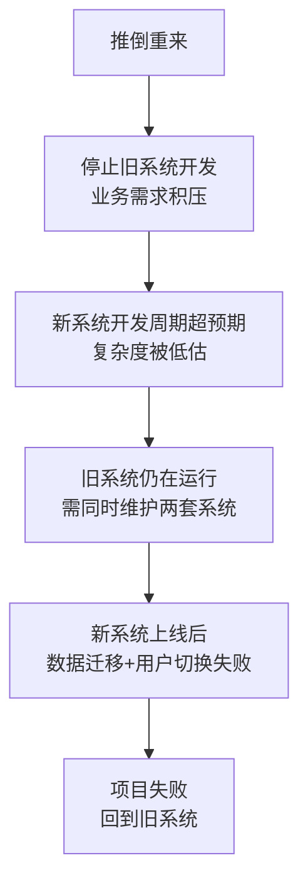
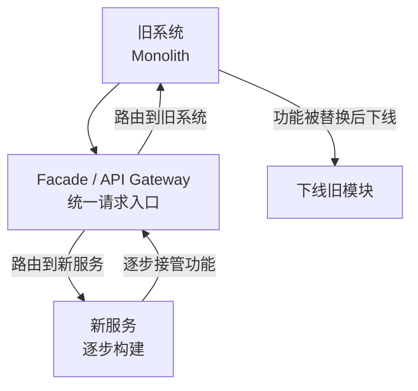
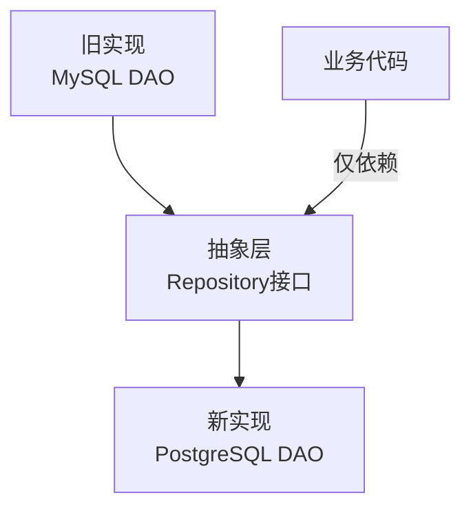
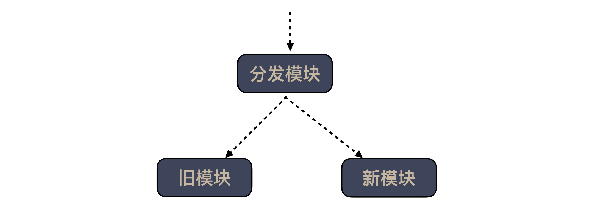

# 面对遗留系统，你应该这样做

## 核心命题

遗留系统（Legacy System）不是"坏系统"，而是**曾经满足当时需求但已不适配当前约束的系统**。面对遗留系统的正确策略不是"推倒重来"（Big Rewrite 几乎必然失败），而是**渐进式改造**——通过 Strangler Fig 模式，逐步用新系统替换旧系统，每一步都可验证、可回滚。渐进式改造的本质是**将风险分散到多个小步骤中**，而非一次性承担巨大的重构风险。

---

## 1. 遗留系统的认知重构

### 1.1 重新定义"遗留系统"

| 误解 | 正解 |
|------|------|
| 遗留系统 = 烂代码 | 遗留系统 = 曾经正确的决策，但环境已变 |
| 重写是最佳方案 | 渐进式改造风险更低、成功率更高 |
| 先重构再加功能 | 并行推进：新功能用新架构，旧功能逐步迁移 |
| 遗留系统一定要替换 | 有些遗留系统稳定运行，优先替换高痛点部分 |

### 1.2 为什么 Big Rewrite 几乎必然失败

| Big Rewrite 的风险 | 说明 |
|-------------------|------|
| **停止旧系统演进** | 业务需求无法等待新系统 |
| **低估复杂度** | 旧系统积累了大量隐含业务规则 |
| **双系统并行** | 同时维护旧+新，成本翻倍 |
| **数据迁移风险** | 历史数据量巨大且格式不一致 |
| **用户切换阻力** | 用户习惯旧系统操作方式 |

---

## 2. Strangler Fig 模式

### 2.1 渐进式替换流程

> **Martin Fowler 的定义**：Strangler Fig 模式源自自然界中藤蔓逐渐覆盖并替代树木的过程。在软件中，通过 Facade 层逐步将请求路由到新系统，直到旧系统被完全替代。

### 2.2 Strangler Fig 的实施步骤

| 步骤 | 活动 | 验证方式 |
|------|------|---------|
| ① **建立 Facade** | API Gateway / 统一入口 | 所有请求通过 Facade 路由 |
| ② **识别可替换功能** | 选择低风险、高价值的功能 | 功能列表 + 优先级排序 |
| ③ **构建新服务** | 用新架构实现第一个功能 | 新服务独立运行 |
| ④ **路由切换** | Facade 将特定请求路由到新服务 | 灰度验证 + 数据比对 |
| ⑤ **验证+监控** | 对比新旧系统输出一致性 | 监控面板 + 数据校验 |
| ⑥ **下线旧模块** | 确认新服务稳定后下线旧模块 | 确认无流量到旧模块 |
| ⑦ **重复 ③-⑥** | 对下一个功能重复流程 | 直到旧系统完全被替代 |

---

## 3. 其他改造策略

### 3.1 策略选择矩阵

| 策略 | 适用场景 | 风险 | 速度 |
|------|---------|--------|------|
| **Strangler Fig** | 有明确边界的功能替换 | 低 | 中 |
| **Branch by Abstraction** | 替换底层实现（如数据库/消息队列） | 中 | 中 |
| **Parallel Run** | 关键路径替换（如支付/结算） | 低 | 慢 |
| **Anticorruption Layer** | 与外部系统集成 | 中 | 快 |
| **Big Rewrite** | 系统已完全无法维护 | 极高 | 慢 |

### 3.2 Branch by Abstraction

**步骤**：
1. 创建抽象层（Repository 接口）
2. 业务代码改为依赖抽象层
3. 创建新实现（PostgreSQL DAO）
4. 切换到新实现
5. 移除旧实现

### 3.3 Parallel Run

适用于**关键路径**的替换（如支付系统）——新旧系统并行运行，数据比对验证一致性：

| 阶段 | 新系统状态 | 验证方式 |
|------|-----------|---------|
| **Shadow Mode** | 后台运行，不影响用户 | 比对新旧系统输出 |
| **Parallel Mode** | 同时处理请求，新旧都响应 | 比对结果一致性 |
| **Primary Mode** | 新系统为主，旧系统为备 | 监控新系统稳定性 |
| **Switch Mode** | 完全切换到新系统 | 确认无异常后下线旧系统 |

---

## 4. 遗留系统改造的度量

| 度量项 | 说明 | 目标 |
|--------|------|------|
| **替换功能占比** | 已替换功能数 / 总功能数 | 每月增加 5-10% |
| **新系统错误率** | 新服务的 5xx 错误率 | < 0.1% |
| **数据一致性** | 新旧系统数据比对差异 | 0 差异 |
| **旧系统流量占比** | 通过 Facade 路由到旧系统的请求占比 | 逐步降低 |

---

## 5. 总结

**核心要义**：面对遗留系统，渐进式改造优于推倒重来。Strangler Fig 模式通过 Facade 逐步路由到新服务，每一步可验证、可回滚。Branch by Abstraction 替换底层实现，Parallel Run 验证关键路径。Big Rewrite 几乎必然失败——将风险分散到多个小步骤中，才是安全高效的改造路径。

---

> **延伸阅读**
>
> - Martin Fowler, "StranglerFigApplication": https://martinfowler.com/bliki/StranglerFigApplication.html
> - Michael Feathers, *Working Effectively with Legacy Code* (2004): 遗留代码改造圣经
> - Sam Newman, *Building Microservices* (2nd ed. 2021): 渐进式拆分策略
---

## 原文存档

> 以下为郑晔原文完整内容，保留作为参考。

## 39 | 面对遗留系统，你应该这样做

在前文中，结合着“新入职一家公司”的场景，我给你讲了如何在具体情况下应用我们前面学到的知识。本文，我们再来选择一个典型的实际工作场景，将所学综合应用起来。这个场景就是面对遗留系统。

在《 [34 \| 你的代码是怎么变混乱的？](http://time.geekbang.org/column/article/87845)》中，我给你讲了代码是会随着时间腐化的，无论是有意，还是无意。即便是最理想的场景，代码设计得很好，维护得也很精心，但随着技术的不断升级进步，系统也需要逐步升级换代。

比如，我们一直认为电信是一个独特的领域，与 IT 技术是完全独立的，学好 CT（Communication Technology，通信技术）就可以高枕无忧了。但随着 IT 技术的不断发展，今天的电信领域也开始打破壁垒，拥抱 IT 技术，提出了 ICT 的概念（Information and Communications Technology，信息通信技术）。

所以，无论怎样，系统不断升级改造是不可避免的事。问题是，你连自己三个月前写的代码都不愿意维护，那当面对庞杂的遗留系统时，你又该何去何从呢？

很多人的第一直觉是，我把系统重写一下就好了。不经思考的重写，就像买彩票一样，运气好才能写好，但大多数人没有这么好运气的，我们不能总指望买彩票中大奖改变生活。那有什么稍微靠谱的一点的路呢？

### 分清现象与根因

面对庞大的遗留系统，我们可以再次回到思考框架上寻找思路。

- Where are we?（我们现在在哪？）
- Where are we going?（我们要到哪儿去？）
- How can we get there?（我们如何到达那里？）

第一个问题，面对遗留系统，我们的现状是什么呢？

我在这些内容前面的部分，基本上讨论的都是怎么回答目标和实现路径的问题。而对于“现状”，我们关心的比较少。因为大多数情况下，现状都是很明显的，但这一次不一样。也许你会说，有什么不一样，不就是遗留系统，烂代码，赶紧改吧。但请稍等！

请问，遗留系统和烂代码到底是不是问题呢？其实并不是， **它们只是现象，不是根因。**

在动手改动之前，我们需要先分析一下，找到问题的根因。比如，实现一个直觉上需要两天的需求，要做两周或更长时间，根因是代码耦合太严重，改动影响的地方太多；再比如，性能优化遇到瓶颈，怎么改延迟都降不下来，根因是架构设计有问题，等等。

所以，最好先让团队坐到一起，让大家一起来回答第一个问题，现状到底是什么样的。还记得我在《 [25 \| 开发中的问题一再出现，应该怎么办？](http://time.geekbang.org/column/article/83841)》中提到的复盘吗？这就是一种很好的手段，让团队共同确认现状是什么样子的，找到根因。

为什么一定要先做这个分析，直接重写不就好了？因为如果不进行根因分析，你很难确定问题到底出在哪，更关键的是，你无法判断重写是不是真的能解决问题。

如果是架构问题，你只进行模型的调整是解决不了问题的。同样，如果是模型不清楚，你再优化架构也是浪费时间。所以，我们必须要找到问题的根源，防止自己重新走上老路。

### 确定方案

假定你和团队分析好了遗留系统存在问题的根因，顺利地回答了第一个问题。接下来，我们来回答第二个问题：目标是什么。对于遗留系统而言，这个问题反而是最好回答的：重写某些代码。

你可能会问，为什么不是重构而是重写呢？以我对大部分企业的了解，如果重构能够解决的问题，他们要么不把它当作问题，要么早就改好了，不会让它成为问题。所以我们的目标大概率而言，就是要重写某些代码。

但是，在继续讨论之前，我强烈建议你， **先尝试重构你的代码，尽可能在已有代码上做小步调整，不要走到大规模改造的路上，因为重构的成本是最低的。**

我们真正的关注点在于第三个问题：怎么做？我们需要将目标分解一下。

要重写一个模块，这时你需要思考，怎么才能保证我们重写的代码和原来的代码功能上是一致的。对于这个问题，唯一靠谱的答案是测试。对两个系统运行同样的测试，如果返回的结果是一样的，我们就认为它们的功能是一样的。

不管你之前对测试是什么看法，这个时候，你都会无比希望自己已经有了大量的测试。如果没，你最好是先给这个模块补测试。因为只有当你构建起测试防护网了，后续的修改才算是走在坚实的道路上。

说到遗留代码和测试，我推荐一本经典的书：Michael Feathers 的《 [修改代码的艺术](http://book.douban.com/subject/2248759/)》（Working Effectively with Legacy Code），从它的英文名中，你就不难发现，它就是一本关于遗留代码的书。如果你打算处理遗留代码，也建议你读读这本书。

在2007年，我就给这本书写了一篇 [书评](http://book.douban.com/review/1226942/)，我将它评价为“这是一本关于如何编写测试的书”，它会教你如何给真实的代码写测试。

这本书对于遗留系统的定义在我脑中留下了深刻印象：遗留代码就是没有测试的代码。这个定义简直就是振聋发聩。按照这个标准，很多团队写出来的就是遗留代码，换言之，自己写代码就是在伤害自己。

有了测试防护网，下一个问题就是怎么去替换遗留系统，答案是分成小块，逐步替换。你看到了，这又是任务分解思想在发挥作用。

我在《 [36 \| 为什么总有人觉得5万块钱可以做一个淘宝？](http://time.geekbang.org/column/article/88764)》中提到，淘宝将系统改造成 Java 系统的升级过程，就是将业务分成若干的小模块，每次只升级一个模块，老模块只维护，不增加新功能，新功能只在新模块开发，新老模块共用数据库。新功能上线，则关闭老模块对应功能，所有功能替换完毕，则老模块下线。

这个道理是普遍适用的，差别只是体现在模块的大小上。如果你的“小模块”是一个系统，那就部署新老两套系统，在前面的流量入口做控制，逐步把流量从老系统转到新系统上去；如果“小模块”只在代码层面，那就要有一段分发的代码，根据参数将流程转到不同的代码上去，然后，根据开发的进展，逐步减少对老代码的调用，一直到完全不依赖于老代码。

这里还有一个小的建议，按照分模块的做法，将新代码放到新模块里，按照新的标准去写新的代码，比如，测试覆盖率要达到100%，然后，让调用入口的地方依赖于这个新的模块。

最后，有了测试，有了替换方案，但还有一个关键问题，新代码要怎么写？

要回答这个问题，我们必须回到一开始的地方，我们为什么要做这次调整。因为这个系统已经不堪重负了，那我们新做的修改是不是一定能解决这个问题呢？答案是不好说。

很多程序员都会认为别人给留下的代码是烂摊子，但真有一个机会让你重写代码，你怎么保证不把摊子弄烂？这是很多人没有仔细思考过的问题。

如果你不去想这个问题，即便今天你重写了这段代码，明天你又会怨恨写这段代码的人没把这段代码写好，只不过，这个被抱怨的人是你自己而已。

要想代码腐化的速度不那么快，一定要在软件设计上多下功夫。 **一方面，建立好领域模型，另一方面，寻找行业对于系统构建的最新理解。**

关于领域模型的价值，我在专栏前面已经提到过不少次了。有不少行业已经形成了自己在领域模型上的最佳实践，比如，电商领域，你可以作为参考，这样可以节省很多探索的成本。

我们稍微展开说说后面一点，“寻找行业中的最新理解”。简言之，我们需要知道现在行业已经发展到什么水平了。

比如说，今天做一个大访问量的系统，我们要用缓存系统，要用 CDN，而不是把所有流量都直接转给数据库。而这么做的前提是，内存成本已经大幅度降低，缓存系统才成为了标准配置。拜 REST 所赐，行业对于 HTTP 的理解已经大踏步地向前迈进，CDN 才有了巨大的进步空间。

而今天的缓存系统已经不再是简单的大 Map，有一些实现得比较好的缓存系统可以支持很多不同的数据结构，甚至支持复杂的查询。从某种程度上讲，它们已经变成了一个性能更好的“数据库”。

有了这些理解，做技术选型时，你就可以根据自己系统的特点，选择适合的技术，而不是以昨天的技术解决今天的问题，造成的结果就是，代码写出来就是过时的。

前面这个例子用到的是技术选型，关于“最新理解”还有一个角度是，行业对于最佳实践的理解。

其实在这些内容里，我讲的内容很多都是各种“最佳实践”，比如，要写测试，要有持续集成，要有自动化等等，这些内容看似很简单，但如果你不做，结果就是团队很容易重新陷入泥潭，继续苦苦挣扎。

既然选择重写代码，至少新的代码应该按照“最佳实践”来做，才能够尽可能减缓代码腐化的速度。

总之， **改造遗留系统，一个关键点就是，不要回到老路上。**

### 总结时刻

我们把前面学到的各种知识运用到了“改造遗留系统”上。只要产品还在发展，系统改造就是不可避免的。改造遗留系统，前提条件是要弄清楚现状，知道系统为什么要改造，是架构有问题，还是领域模型混乱，只有知道根因，才可能有的放矢地进行改造。

改造遗留系统，我给你几个建议：

- 构建测试防护网，保证新老模块功能一致；
- 分成小块，逐步替换；
- 构建好领域模型；
- 寻找行业中关于系统构建的最新理解。

如果今天的内容你只能记住一件事，那请记住： **小步改造遗留系统，不要回到老路上。**

最后，我想请你分享一下，你有哪些改造遗留系统的经验呢？

感谢阅读，如果你觉得这篇文章对你有帮助的话，也欢迎把它分享给你的朋友。