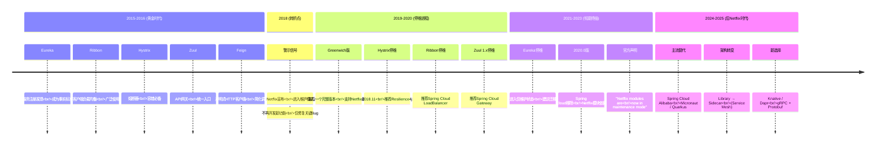
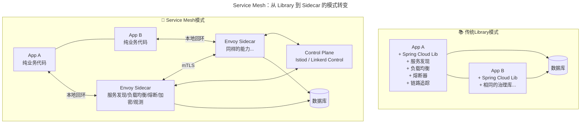
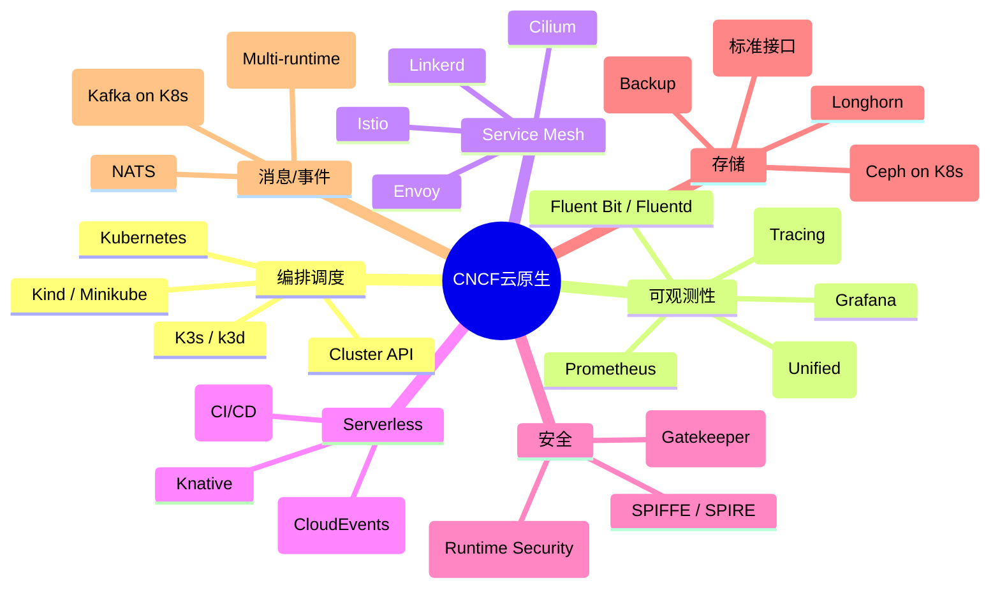
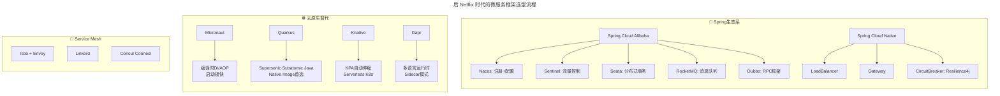
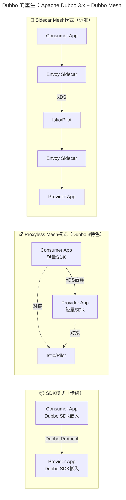
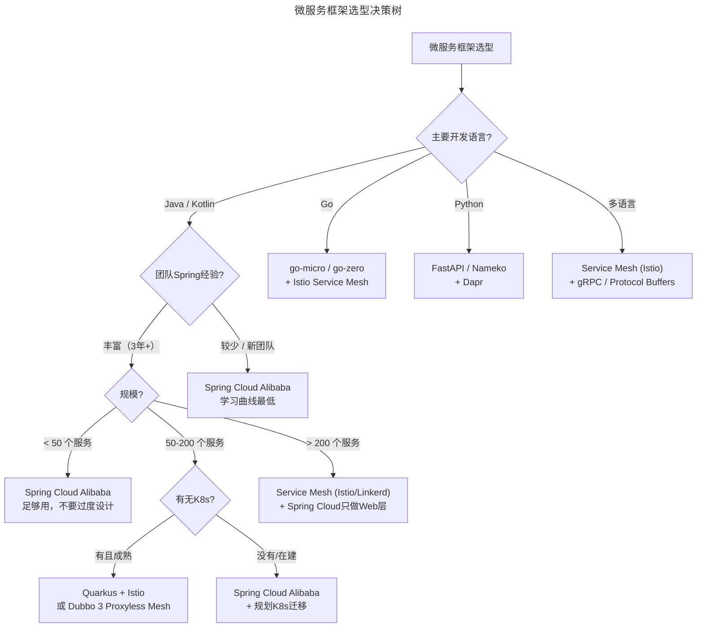
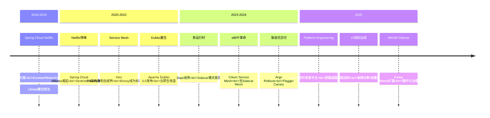

# Spring Cloud：面向应用层的云架构解决方案 - 从Netflix停维到Service Mesh时代

> **v2 升级摘要**：本文在保留原 frontmatter、所有 Mermaid 图、表格、案例与术语英文对照的基础上，按 v2 标准的 6 节骨架（导言、核心方法论、关键流程、工具与实战、常见误区、进阶延展）重新组织内容；补充 Pivotal/VMware/Broadcom 收购链对 Spring 生态的影响，更新 Netflix 停维时间线至 2025 年的后 Netflix 时代，并将原参考资料内容融入进阶延展一节。

## 一、导言

前文介绍了混合云，以及在实际操作中常见的几种混合云模式。本文将探讨 Spring Cloud 如何解决应用层的云架构问题。

**⚠️ 重要提示**：这是这些内容中技术变化最大的一篇。自 2019 年至今，Spring Cloud 生态经历了颠覆性的变化——曾经的主流方案 Spring Cloud Netflix 已全面停维，整个微服务治理领域正在从 Library 模式向 Sidecar 模式（Service Mesh，服务网格）演进。本文将系统梳理这一技术变革的全貌。

对于 Spring Cloud，应该不会陌生，它跟 Spring 生态中的另一个开源项目 Spring Boot，基本上已经成为国内绝大多数公司向微服务架构转型时的首选开发框架。Spring Boot 可以支持快速开发单个微服务应用，Spring Cloud 则提供一系列的服务治理框架，比如服务注册、服务发现、动态路由、负载均衡以及熔断等等能力，可以将一个个独立的微服务作为一个整体，进行很好的管理和维护。

（注：因为 Spring Cloud 必须基于 Spring Boot 框架才能发挥它的治理能力，所以下面提到的 Spring Cloud 是默认包含了 Spring Boot 框架的。）

## 二、核心方法论

### 2.1 Spring Cloud 框架中云的影子

目前整个 Spring 生态是由 Pivotal 这家商业公司在主导，然而 Pivotal 更大的目标是要为客户提供云上的端到端的解决方案。

> **2025 年重要更新：Pivotal/VMware/Broadcom 收购链**
>
> - **2019 年**：VMware 收购 Pivotal（27 亿美元）
> - **2021 年**：Dell 将 VMware 分拆为独立公司
> - **2023 年**：Broadcom 以 610 亿美元收购 VMware
> - **2024 年**：Broadcom 完成对 VMware 的整合，Pivotal/PCF/Tanzu 产品线面临战略调整
>
> 这一系列并购对 Spring 生态的影响深远——企业客户开始担忧厂商锁定（Vendor Lock-in）风险，加速了向开源替代方案的迁移。

基于这样的理念，Pivotal 打造了自己的云原生解决方案 PCF（Pivotal Cloud Foundry），包括多云和跨云平台的管理、监控、发布，以及基础的 DB、缓存和消息队列等等，一应俱全。

这个时候，**Spring Cloud 除了提供微服务治理能力之外，还成为了微服务应用与云平台上各项基础设施和基础服务之间的纽带，并在其中起到了承上启下的关键作用。**

至此，我们可以得出这样一个判断：**Spring Cloud 不仅仅是微服务治理解决方案，它同时还是面向应用层的云架构解决方案。**

### 2.2 重大变革：Spring Cloud Netflix 全面停维

这是本文最重要的部分。如果正在使用或计划使用 Spring Cloud Netflix，以下信息至关重要。

### Spring Cloud Netflix 停维时间线



### 各子项目停维详情与替代方案

| Netflix 组件 | 功能 | 停维时间 | 官方推荐替代 | 社区热门替代 |
|------------|------|---------|-------------|-------------|
| **Eureka** | 服务注册与发现 | 2021（维护模式）| Spring Cloud Consul / Nacos | Consul, Nacos, ZooKeeper |
| **Ribbon** | 客户端负载均衡 | 2020 | Spring Cloud LoadBalancer | Spring Cloud LoadBalancer |
| **Hystrix** | 熔断/降级/限流 | 2018.11（停止开发）| Resilience4j | Sentinel, Resilience4j |
| **Zuul 1.x** | API 网关 | 2020 | Spring Cloud Gateway | Spring Cloud Gateway, Kong, APISIX |
| **Feign** | 声明式 HTTP 客户端 | 集成到 `spring-cloud-openfeign` | OpenFeign (独立维护) | OpenFeign, Retrofit, gRPC |
| **Archaius** | 动态配置管理 | 随整体停维 | Spring Cloud Config / Apollo | Apollo, Nacos, Consul Config |
| **RxJava** | 响应式编程 | 项目仍在活跃 | Project Reactor | Project Reactor |

> **为什么 Netflix 要停维？**
> Netflix 在 2015-2016 年间开源了这些组件，当时它们运行在 AWS 上，使用的是基于 JVM 的微服务架构。但到了 2018-2019 年，Netflix 自身已经大规模迁移到：
> - **全面容器化**：自研容器管理平台 Titus，并逐步与 Kubernetes 生态融合
> - **gRPC + Protobuf** 替代 REST/JSON 进行服务间通信
> - **内部自研的 Sidecar 基础设施**（早于 Istio/Envoy）
>
> 换句话说，**连 Netflix 自己都不再使用这些开源项目了**。

### 2.3 Service Mesh：从 Library 到 Sidecar 的模式转变

随着容器及编排技术的发展和成熟，就出现了另外一个云原生的体系，且活跃程度非常高：它就是以 Google 为首的 CNCF（Cloud Native Computing Foundation，云原生计算基金会）。

Spring Cloud 采用的是 **Library 模式（SDK 模式）**——每个微服务都需要引入 Spring Cloud 的库，这意味着：

| Library 模式的痛点 | 描述 |
|------------------|------|
| **语言绑定** | 只能用于 Java/Spring 生态，其他语言需重新实现 |
| **版本耦合** | 所有服务必须使用相同版本的 Spring Cloud |
| **升级困难** | 升级 Spring Cloud 需要所有服务同步升级 |
| **侵入性强** | 业务代码与服务治理代码耦合 |
| **团队协作成本** | 开发团队需要理解服务治理细节 |
| **资源开销不可控** | 每个服务的治理逻辑消耗的资源累加 |

**Service Mesh（服务网格）** 将这些能力从应用代码中抽离出来，放到 **Sidecar 代理** 中：



### 2.4 CNCF 全景图与关键洞察

CNCF 设想中的云原生分层架构示意图，经过几年的发展已经演变为更加丰富的生态系统：



### 关键洞察：Spring Cloud vs CNCF 生态的关系

| 维度 | Spring Cloud（应用层） | CNCF 生态（平台层） |
|------|---------------------|-------------------|
| **抽象层次** | 应用代码内嵌（Library） | 平台基础设施（Infrastructure）|
| **目标用户** | Java/Spring 开发者 | 平台工程师/SRE |
| **治理粒度** | 方法级/接口级 | Pod/Service/Namespace 级 |
| **语言绑定** | Java 强绑定 | 语言无关 |
| **运维参与度** | 开发主导 | 运维/平台团队主导 |
| **适用规模** | 中小规模（<500 服务）| 大规模（500+ 服务）|

**结论：两者不是替代关系，而是互补关系。** 对于中小型团队，Spring Cloud Alibaba 仍然是最佳选择；对于大型企业，CNCF 生态（尤其是 Service Mesh）提供了更强的治理能力和更好的扩展性。越来越多的企业采用"**Spring Cloud 做业务开发 + Service Mesh 做流量治理**"的混合策略。

## 三、关键流程

### 3.1 后 Netflix 时代的微服务框架选型流程



#### 详细对比表

| 维度 | Spring Cloud Alibaba | Micronaut | Quarkus |
|------|---------------------|-----------|---------|
| **开发者** | 阿里巴巴 | Object Computing (OCI) | Red Hat |
| **基础框架** | Spring Boot | 自研编译时框架 | 基于 Hibernate/CDI |
| **核心定位** | Spring Cloud 的中国增强版 | 云原生 Java（编译时优化） | Kubernetes Native Java |
| **启动速度** | ~2-5 秒（JVM） | ~100-500ms（JVM）/ <50ms（Native） | ~200ms（JVM）/ <30ms（Native）|
| **内存占用** | ~200-500MB | ~50-150MB（JVM）/ ~20MB（Native） | ~80-200MB（JVM）/ ~30MB（Native）|
| **服务注册** | ✅ Nacos / Consul / ZooKeeper | ✅ Consul / Eureka / Kubernetes | ✅ Kubernetes Service Discovery |
| **配置中心** | ✅ Nacos / Apollo | ✅ Consul / AWS Parameter Store | ✅ Kubernetes ConfigMap / Apollo |
| **熔断降级** | ✅ Sentinel（功能强大） | ✅ CircuitBreaker (内置) | ✅ SmallRye Fault Tolerance |
| **网关** | ✅ Spring Cloud Gateway | ✅ HTTP Client Filter | ❌ 无专用网关组件（搭配 Kong/APISIX） |
| **分布式事务** | ✅ Seata（阿里成熟方案） | ❌ 需自行集成 | ❌ 需自行集成 |
| **消息队列** | ✅ RocketMQ 集成 | ✅ Kafka/RabbitMQ/Kafka Streams | ✅ AMQP/Kafka/Reactive Messaging |
| **RPC 支持** | ✅ Apache Dubbo 3.x | ✅ 声明式 HTTP/gRPC/GraphQL | ✅ RESTEasy/gRPC |
| **Serverless 适配** | ⚠️ 需额外适配 | ✅ 原生支持（Micronaut Function） | ✅ Quarkus Funqy / Serverless |
| **GraalVM Native Image** | ⚠️ 实验性支持（Spring Boot 3 AOT） | ✅ 一等公民 | ✅ 一等公民（Supersonic Subatomic）|
| **社区活跃度** | 🟢 高（中国开发者主力） | 🟡 中（增长中） | 🟢 高（Red Hat 背书）|
| **学习曲线** | 低（Spring 开发者无缝上手） | 中（新概念需学习） | 中高（CDI 概念）|
| **生产案例** | 阿里/蚂蚁/美团/京东大量使用 | Netflix/Apple/BOFA 部分使用 | Red Hat 产品核心 |

#### 如何选择？

| 场景 | 推荐方案 | 理由 |
|------|---------|------|
| **现有 Spring 团队转型** | Spring Cloud Alibaba | 学习成本最低，中文文档完善 |
| **全新 Greenfield 项目 + 追求性能** | Micronaut 或 Quarkus | 启动快、内存低、Native Image 友好 |
| **Serverless/FaaS 场景** | Quarkus > Micronaut > SCA | Native Image 冷启动优势明显 |
| **需要分布式事务** | Spring Cloud Alibaba (Seata) | Seata 是目前最成熟的分布式事务方案 |
| **Kubernetes 重度用户** | Quarkus 或 直接 Service Mesh | 与 K8s 生态深度整合 |
| **多语言微服务环境** | Service Mesh (Istio/Linkerd) | 语言无关的治理能力 |

### 3.2 Dubbo 的重生：Apache Dubbo 3.x + Dubbo Mesh

需补充说明的是，早期阿里开源的 Dubbo，其实是跟 Spring Cloud 类似的微服务框架，并且经过阿里大规模的应用实践，可以说是非常优秀的开源项目。早些年国内在选择微服务框架时，Dubbo 基本是首选，然而近年来因为开源维护不力，很早停止了版本更新，导致大量的用户流失，促使用户纷纷涌入 Spring Cloud 阵营。

**然而到了 2025 年，Dubbo 已经完成了华丽的转身！**

#### Dubbo 3.x 核心升级

| 能力 | Dubbo 2.x | Dubbo 3.x |
|------|----------|----------|
| **通信协议** | 单一 Dubbo 协议 | Triple（兼容 gRPC）+ REST + Dubbo |
| **服务发现** | ZooKeeper 注册中心 | 应用级服务发现（与 K8s Service 对齐）|
| **路由规则** | 条件路由/脚本路由 | 路由规则 Mesh 化（xDS 协议适配）|
| **云原生支持** | 无 | 原生 Kubernetes 支持、Service Mesh 友好 |
| **多协议互通** | 仅 Dubbo 协议 | gRPC/REST/Triple/Thrift 全支持 |
| **性能** | 优秀 | 更优（Netty4 + 协议优化）|
| **社区状态** | 2014-2017 停维 | Apache 顶级项目，活跃开发中 |

#### Dubbo Mesh 架构

Dubbo 3.x 的一个重要设计目标是 **与 Service Mesh 共存**：



**Dubbo 3 的 Proxyless Mesh 是其独特卖点**——不需要部署 Sidecar 代理，通过 Dubbo SDK 直接与 Control Plane（如 Istio Pilot）通信获取配置，兼顾了性能和 Mesh 治理能力。这对于性能敏感且不想承担 Sidecar 资源开销的场景非常具有吸引力。

### 3.3 Spring Cloud → Service Mesh 迁移路径

如果组织正在考虑从 Spring Cloud 迁移到 Service Mesh，以下是推荐的渐进式路径：

```
Phase 1: 共存期（3-6个月）
├── 新服务采用 Service Mesh
├── Spring Cloud 服务逐步剥离治理逻辑
└── 通过 Ingress Gateway 统一入口

Phase 2: 混合过渡期（6-12个月）
├── 核心服务迁移到 Mesh
├── 保留 Spring Cloud for Legacy
└── 统一可观测性（OpenTelemetry）

Phase 3: 全面 Mesh 化（12-24个月）
├── 全部服务纳入 Mesh
├── Spring Cloud 仅保留业务框架
└── 多集群 Mesh 联邦
```

## 四、工具与实战

### 4.1 主流 Service Mesh 产品对比（2025）

| 产品 | Sidecar | Control Plane | 性能开销 | 成熟度 | 适用场景 |
|------|---------|--------------|---------|--------|---------|
| **Istio** | Envoy | istiod (Go) | 较高（~10% CPU/100MB 内存）| ⭐⭐⭐⭐⭐ | 大型企业、复杂治理需求 |
| **Linkerd** | Linkerd2-proxy (Rust) | Linkerd Control Plane (Go)| 极低（<1% CPU/10MB 内存）| ⭐⭐⭐⭐ | 追求性能、简单易用 |
| **Consul Connect** | Envoy 内置 | Consul (Go) | 中等 | ⭐⭐⭐ | 已有 Consul 基础设施 |
| **Cilium Service Mesh** | eBPF (无 Sidecar 可选) | Cilium Agent | 极低（内核级）| ⭐⭐⭐⭐ | Kubernetes 原生、高性能需求 |

> **2025 年趋势：** Sidecar 模式本身也在进化——
> - **Ambient Mesh（Istio 1.18+）**：将网格分为 ztunnel（L4）与 waypoint（L7）两层，大幅减少 Sidecar 数量
> - **Cilium without Sidecar**：利用 eBPF 实现 Service Mesh 能力，完全无需 Sidecar
> - **gRPC Mesh**：基于 gRPC 的轻量级 Mesh 方案

### 4.2 微服务框架选型决策树

结合 2025 年技术现状，给还在纠结选型的团队一个简明的决策参考：



### 4.3 安全实践清单

无论选择哪种微服务框架，以下安全实践不可忽视：

| 安全维度 | 关键措施 | 工具/方案 |
|---------|---------|----------|
| **服务间认证** | mTLS 双向证书 | Istio Automatic mTLS / SPIFFE |
| **授权控制** | RBAC + ABAC | OPA / Kyverno / Spiffe OIDC |
| **API 安全** | Schema 验证 + Rate Limiting | grpc-gateway / OAS Validator |
| **Secret 管理** | 外部化存储 | HashiCorp Vault / AWS Secrets Manager / External Secrets Operator |
| **供应链安全** | SBOM + 镜像签名 | Syft / Cosign / Sigstore |
| **审计日志** | 所有操作可追溯 | Auditbeat / ELK Stack |
| **网络策略** | 最小权限开放 | Cilium Network Policy / Calico |

## 五、常见误区

### 5.1 盲目追新：停维不等于不能使用

很多团队一听到 Netflix 组件停维就立即启动大规模迁移，但事实上：

- **维护模式 ≠ 不可用**：Eureka 等组件仍能稳定运行，只是在功能上不再演进
- **迁移成本需评估**：一次大规模迁移可能引入更多风险
- **建议**：评估业务实际需要，制定 12-24 个月的渐进式迁移计划

### 5.2 混淆适用规模：Spring Cloud 与 Service Mesh 不是替代关系

- **误区**：认为 Service Mesh 一定优于 Spring Cloud
- **现实**：对于中小规模团队（<50 服务），Spring Cloud Alibaba 仍是最优解；Service Mesh 带来的 Sidecar 资源开销和运维复杂度不容忽视
- **建议**：参考决策树，根据规模和团队能力选型

### 5.3 忽视迁移过渡期：直接全量切换

- **误区**：直接停用 Spring Cloud，全量切换到 Service Mesh
- **现实**：业务连续性风险极高，治理能力会出现短暂真空
- **建议**：采用"共存 → 混合 → 全面"三阶段渐进式迁移

### 5.4 过度治理：为小规模系统引入完整 Mesh

- **误区**：5-10 个微服务也上 Istio 全套
- **现实**：Sidecar 资源开销可能超过业务本身
- **建议**：小规模系统使用 Spring Cloud LoadBalancer + Resilience4j 即可

## 六、进阶延展

### 6.1 可以预见的技术发展趋势

分析可见，无论是 Spring Cloud、CNCF、云原生、还是 K8s 等等新技术或理念，究其根本，都是为了能够更快更好地支持业务需求的快速实现。从云原生的理念中分析可见，跟业务无直接关系且相对通用的技术在不断地被标准化，而且标准化层面越来越高。



**技术每被标准化一层，原来繁琐低效的工作就少一些，技术标准化的层面越高，技术门槛就会变得越低。** 可作个大胆的预想：或许未来真的只会有业务解决方案和业务代码。

对于技术人员来说，未来更多更迫切的能力需求将会是：如何利用好业界已有的丰富的技术产品和平台，在面对更加丰富多样且复杂的业务领域需求时，能够更加专注于寻求业界解决方案，以更好地将业务和技术连接起来。找到适合业务解决方案的技术并落地实现，而不再只是专注于技术层面的造轮子。

### 6.2 对运维角色的启示

对于运维来说，同样要了解技术发展趋势。虽然不会直接参与具体的业务解决方案和代码的开发，然而，如果架构师是业务架构的设计者，那么应该成为 **技术架构的管理者和平台工程的构建者**，从效率、成本、稳定性这几个方面来检验架构是否合理，并为架构朝着更加健康的方向发展保驾护航。这也是运维职能转型和思路转变的一个重要方向。

### 6.3 延伸阅读与参考资源

- **Spring 官方生态**：Spring Cloud、Spring Boot、Spring Native 项目主页与官方文档
- **CNCF 全景图**：Cloud Native Interactive Landscape，跟踪云原生生态演进
- **Netflix 技术博客**：Netflix TechBlog，了解 Netflix 自身架构演进的真实路径
- **Service Mesh 生态**：Istio、Linkerd、Cilium、Envoy 官方文档与社区最佳实践
- **Dubbo 3.x 文档**：Apache Dubbo 官方网站，关注 Proxyless Mesh 与 Triple 协议演进
- **云原生 Java**：Micronaut、Quarkus 官方文档与 GraalVM Native Image 实践
- **Dapr 项目**：多语言运行时与 Sidecar 模式的代表性方案

如果今天的内容对你有帮助，也欢迎你分享给身边的朋友。