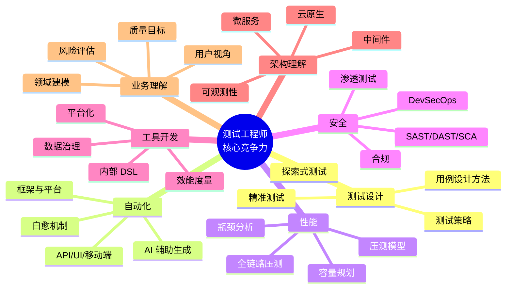
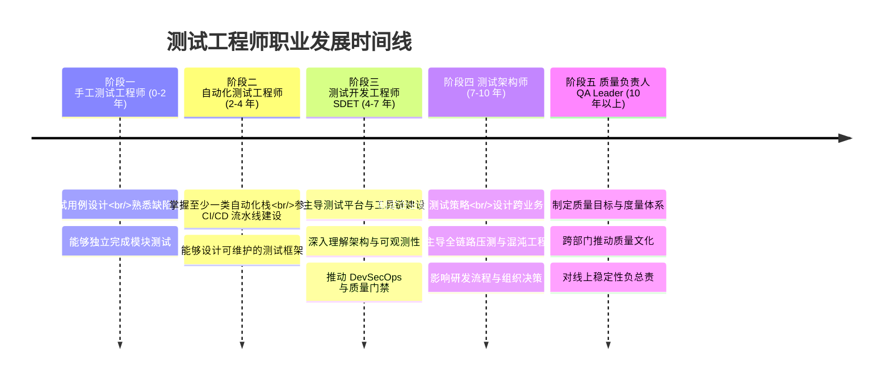

# 测试工程师的核心竞争力与职业路径

测试工程师的核心竞争力，不是"会用多少工具"，也不是"写过多少脚本"，而是在有限时间与资源下，对被测系统做出准确的质量判断，并推动质量持续改进的能力。本文以 2024–2026 年行业实践为坐标，系统梳理测试工程师的七项核心竞争力、职业发展路径、主流职级体系、角色定位差异以及新时代的趋势变化，给出可执行的成长建议。

## 一、核心概念：测试工程师的核心竞争力模型

测试工程师的核心竞争力可以抽象为一个由七项能力构成的模型。这七项能力相互支撑，缺一不可：

- **测试设计能力**：决定"测什么、怎么测"，是质量判断的源头；
- **自动化能力**：决定"测得多快、能不能反复测"，是规模化交付的引擎；
- **性能能力**：决定"系统能不能扛得住"，是高可用保障的关键；
- **安全能力**：决定"系统会不会被攻破"，是合规与信任的底线；
- **工具开发能力**：决定"能力能否沉淀复用"，是工程化的体现；
- **架构理解能力**：决定"测得对不对、深不深"，是技术深度的标志；
- **业务理解能力**：决定"测得有没有价值"，是业务价值与质量目标的桥梁。

七项能力并非孤立存在。测试设计能力决定了"测什么"，自动化与性能、安全能力决定了"怎么测得高效且全面"，工具开发能力把单点能力沉淀为团队资产，架构理解能力保证测试与系统真实结构对齐，业务理解能力则保证测试服务于真实的业务价值与风险。任何一项能力短板，都会以"漏测""误报""低效""与业务脱节"等形式暴露出来。

## 二、七项核心竞争力详解

### 2.1 测试设计能力

测试设计能力是测试工程师最核心也最难培养的能力，本质上是"在不确定条件下做出最优测试决策"的能力。它要求测试工程师能够快速理解需求，识别风险点，选择最适合的测试方法，并明确测试范围、深度与优先级。

现代测试设计已超越传统的等价类、边界值与错误推测，形成了更完整的方法谱系：**基于模型的测试（MBT）** 适合状态机复杂的协议与嵌入式系统；**属性驱动测试（PBT）** 通过 QuickCheck、hypothesis 等框架自动生成海量随机输入并校验系统不变量，在函数式与高可靠性系统中应用广泛；**契约测试（Pact、Spring Cloud Contract）** 已成为微服务架构下接口兼容性验证的事实标准；**基于会话的测试管理（SBTM）** 则为探索式测试提供了结构化、可度量的工程框架。

测试策略设计还须遵循"测试左移"与"测试右移"原则：左移要求在需求分析、设计评审阶段即介入，把缺陷拦截在上游；右移则关注生产环境的监控、灰度发布与在线故障分析，形成质量闭环。

### 2.2 自动化能力

自动化能力是测试工程师从"重复劳动"中解放出来的关键。需要强调的是，自动化的核心价值仍是"测试"本身，"自动化"只是手段——盲目追求自动化率、用脚本数量衡量产出，是行业中最常见的本末倒置。

现代自动化技术栈已形成清晰的分层：

- **API 自动化**：投入产出比最高，Postman v11、REST Assured、Karate、HTTParty 是主流工具链；
- **GUI 自动化**：Selenium 4（W3C WebDriver）、Playwright 1.60+（自动等待、Trace Viewer、组件测试）、Cypress 15+（时间旅行调试）三足鼎立；
- **移动端自动化**：Appium 3（Driver/Plugin 架构、BiDi 协议）、Maestro（YAML DSL）、XCUITest、UiAutomator2；
- **AI 辅助测试**：GitHub Copilot、Cursor 辅助生成测试脚本，Playwright Agents 引入 LLM 引导的测试创建与修复，Mabl、Testim 等平台提供智能自愈（Auto-healing）机制。

### 2.3 性能能力

性能能力涵盖性能测试目标制定、场景建模、瓶颈定位与容量规划。在云原生与微服务时代，单机压测已无法反映真实瓶颈，**全链路压测**（基于影子库表、流量录制回放、流量染色隔离）成为头部企业的标配。JMeter 5.6+、k6、Locust 是主流压测引擎；Prometheus + Grafana + SkyWalking 10 + OpenTelemetry 构成性能可观测性栈；JFR、Arthas 4.0、async-profiler 用于 JVM 级瓶颈定位。

性能能力的难点不在于"跑出 QPS"，而在于"识别真正的瓶颈并给出可落地的优化建议"——是连接池配置、是 GC 抖动、是网络抖动、还是下游服务拖尾，需要在海量指标中快速判断。

### 2.4 安全能力

随着 DevSecOps 的普及，安全已不再是安全团队的独占领域，测试工程师须具备基础的安全测试能力。**SAST**（静态应用安全测试，如 SonarQube Server 2026.x、Semgrep）、**DAST**（动态应用安全测试，如 OWASP ZAP、Burp Suite）、**SCA**（软件成分分析，如 Snyk、Trivy）三类工具链的集成是 CI/CD 流水线的标准动作。

测试工程师应理解 OWASP Top 10 的常见漏洞模式（XSS、SQL 注入、CSRF、SSRF、反序列化等），能够在测试设计阶段就把安全场景纳入用例库，而不是等上线前的渗透测试才发现问题。

### 2.5 工具开发能力

工具开发能力是测试工程师向测试开发（SDET）方向演进的关键能力。它要求工程师能够识别重复性、规模化场景，将其沉淀为可复用的工具或平台。典型的工具开发产物包括：测试数据生成器、Mock 服务、用例管理平台、测试报告门户、CI/CD 集成插件等。

工具开发的核心不是"会写代码"，而是"会做需求分析"——能否站在测试架构师的高度，识别出真正值得工程化的场景，避免把简单问题复杂化。

### 2.6 架构理解能力

架构理解能力决定了测试工程师能否设计出与系统真实结构对齐的测试方案。不理解微服务的服务边界，就无法设计有效的契约测试；不理解 K8s 的 Pod 生命周期与探针机制，就无法构建稳定的容器化测试环境；不理解缓存、消息队列、分库分表的设计，就无法覆盖真实的并发与一致性场景；不理解可观测性体系，就无法把测试数据与生产监控打通。

现代测试工程师须掌握的核心架构知识包括：微服务架构（服务注册、配置中心、网关、熔断限流）、云原生栈（Docker、Kubernetes 1.36+、Istio 1.30+）、中间件（Redis、Kafka、Elasticsearch）、可观测性（OpenTelemetry、Prometheus 3.0、Grafana、Jaeger）。

### 2.7 业务理解能力

业务理解能力是测试工程师与开发工程师能力差异的关键所在。测试工程师须深入理解业务领域、用户场景与商业目标，才能在测试设计中识别真正的风险点，而非机械地遍历功能点。

需要警惕的是，**业务知识不能等同于测试能力**。一位测试工程师若只在单一业务领域积累经验，离开该业务后无法快速迁移，其价值会大打折扣。真正的业务理解能力，是把领域知识与系统性测试方法融合，对任何被测系统都能输出高质量的测试设计。

## 三、职业发展路径

测试工程师的职业发展大致经历五个阶段，每个阶段对应不同的能力重心与价值产出：

需要注意的是，这条路径并非线性单选。**手工测试 → 测试架构师**与**测试开发 → 质量负责人**是两条常见的并行路径，前者偏重技术深度与架构能力，后者偏重工程化与组织影响力。也有资深工程师选择在 SDET 阶段长期深耕，成为某一领域（如性能、安全、AI 测试）的专家，不必非走管理路线。

## 四、主流职级体系（2026）

### 4.1 阿里巴巴 P 体系（专业路线改革后）

阿里自 2020 年起对 P 体系进行调整，**P8 及以上职级明显去职级化**，鼓励资深工程师走专业化路线而非单纯依赖职级晋升。当前测试工程师常见职级与对应能力如下：

| 职级 | 角色定位 | 典型能力要求 | 总包区间（人民币） |
|------|---------|-------------|------------------|
| P5 | 高级工程师（校招为主） | 独立完成模块测试，掌握一类自动化工具 | 30–45 万 |
| P6 | 资深工程师 | 主导子系统测试方案，参与框架建设 | 45–70 万 |
| P7 | 技术专家 | 跨业务线影响，主导测试平台或专项工程 | 70–110 万 |
| P8+ | 高级专家 / 资深专家 | 走专业化路线，主导企业级质量体系建设 | 110–200 万+ |

P8+ 已不再以"晋升"为核心驱动，而是以"专业影响力"衡量，包括对外技术输出、对内体系建设的深度与广度。

### 4.2 腾讯 4–17 级新职级体系

腾讯于 2021 年完成职级改革，取消原 T1–T6 的旧体系，改为 **4–17 级**的数字职级，4 级最低、17 级最高。测试工程师（含测试开发）常见职级：

| 数字职级 | 对应角色 | 能力要求 | 总包区间 |
|---------|---------|---------|---------|
| 4–5 级 | 初级工程师 | 完成被分配的测试任务 | 25–40 万 |
| 6–7 级 | 中级工程师 | 独立设计测试方案，主导一类自动化 | 40–60 万 |
| 8–9 级 | 高级工程师 | 跨团队影响，主导测试平台或专项 | 60–95 万 |
| 10–11 级 | 专家工程师 | 制定企业级测试策略，影响组织决策 | 95–150 万 |
| 12 级+ | 高级专家 / 资深专家 | 主导质量体系建设，对外技术输出 | 150 万+ |

改革后职级更扁平，晋升节奏放缓，更强调专业沉淀而非快速晋升。

### 4.3 字节跳动 OKR 体系

字节跳动不采用传统职级体系，而以 **OKR（目标与关键结果）** 驱动，配合 1-1 至 4-1 的内部序列（对外不公开），并以"长效激励"包裹现金与期权。测试工程师在字节的能力评估主要依据：

- **业务结果**：负责业务线的线上稳定性、缺陷逃逸率、回归效率等可量化指标；
- **技术影响力**：主导的测试平台、工具链在跨业务线的复用范围；
- **组织贡献**：跨团队协作、人才培养、流程优化贡献。

字节更强调"用结果说话"，测试工程师需要在 OKR 中明确给出可度量的产出，而非依赖职级标签。

### 4.4 百度 T 体系

百度仍沿用 T 系列职级，T3–T7 为社招主招区间：

| 职级 | 角色定位 | 能力要求 | 总包区间 |
|------|---------|---------|---------|
| T3 | 中级工程师 | 胜任模块测试，掌握一类自动化方案 | 30–45 万 |
| T4 | 高级工程师 | 主导子系统测试方案，发现架构薄弱点 | 40–65 万 |
| T5 | 资深工程师 | 主导子系统级测试架构，能评审他人方案 | 55–85 万 |
| T6 | 技术专家 | 跨团队影响，主导专项测试体系建设 | 80–120 万 |
| T7+ | 高级技术专家 | 制定企业级测试策略，影响组织决策 | 120 万+ |

百度的胜任力模型强调"主动性"——不只是被动完成测试任务，更要主动发现系统薄弱环节并提出改进方案。

> **横向对照**：阿里 P7 ≈ 腾讯 9 级 ≈ 百度 T6 ≈ 字节高级工程师偏上水平，对应总包约 70–110 万。具体数字因业务、城市、个人议价而异。

## 五、SDET vs SET vs QE：三种角色的定位与技能差异

测试行业角色细分日趋成熟，**SDET（Software Development Engineer in Test）**、**SET（Software Engineer in Test）** 与 **QE（Quality Engineer）** 是三个常被混淆但定位不同的角色：

| 维度 | SDET | SET | QE |
|------|------|-----|-----|
| 核心定位 | 测试基础设施与平台开发 | 测试自动化与脚本编写 | 全流程质量保障与流程推动 |
| 工作产物 | 测试平台、工具链、CI/CD 集成 | 自动化脚本、测试框架 | 质量策略、流程规范、度量体系 |
| 技能重心 | 后端开发、分布式系统、云原生 | 编程、自动化框架、API/UI 测试 | 测试设计、风险管理、跨团队协作 |
| 与开发关系 | 与开发同等深度，关注"测试即代码" | 偏测试侧，关注"用代码做测试" | 偏流程侧，关注"把质量嵌入研发全流程" |
| 典型晋升方向 | 测试架构师 / 资深开发 | 高级 SDET / 测试架构师 | 质量负责人 / QA Leader |

需要说明的是，三者的边界并非泾渭分明，许多公司混用这些 title，实际工作内容取决于团队规模与组织成熟度。判断自身定位的关键是问自己：**"我创造的价值主要落在代码上、脚本上，还是流程与决策上？"**

## 六、2024–2026 新趋势

### 6.1 AI 时代的测试工程师转型

2024 年以来，AI 对测试行业的影响已从"概念"走向"工程实践"，体现在三个层面：

- **AI 辅助测试**：LLM 辅助生成测试用例、测试脚本、缺陷描述、回归分析报告，GitHub Copilot、Cursor、Playwright Agents 已成为测试工程师日常工具；
- **AI 系统的测试**：测试工程师开始负责 LLM 应用的评估——包括幻觉检测、对齐性测试、安全护栏测试、Prompt 鲁棒性测试，传统等价类与边界值方法在 AI 系统上需要重构；
- **AI 测试基础设施**：基于 LLM 的智能测试生成平台、视觉 AI 验证（Applitools）、智能自愈（Mabl、Testim）等工具链在企业内规模化落地。

测试工程师不会被 AI 替代，但**不会用 AI 的测试工程师会被会用 AI 的同行替代**。关键转型方向是：把 AI 作为"能力放大器"，从执行者转向策略制定者与质量决策者。

### 6.2 远程协作时代的测试协作

混合办公常态化后，测试协作呈现三个新特征：

- **异步协作**：缺陷报告、测试计划、测试报告的书面表达质量变得至关重要，飞书、Slack、Notion 上的沟通清晰度直接影响协作效率；
- **可观测性替代口头沟通**：OpenTelemetry、Grafana、Jaeger 等可观测性工具让分布式团队对系统状态有共同认知，减少"我问你答"的低效环节；
- **质量共建文化**：质量不再是测试团队的责任，而是全团队的共同目标，测试工程师的角色从"质量把关者"转变为"质量推动者"。

### 6.3 测试左移与右移的工程化

测试左移与右移已从理念走向工程化实践：

- **左移**：在需求阶段引入需求评审与可测试性分析（Testability Review），在设计阶段引入契约测试与架构评审，在编码阶段引入 TDD 与代码评审；
- **右移**：把测试数据延伸到生产环境，通过 A/B 测试、灰度发布、混沌工程（Chaos Engineering）、线上巡检等手段持续验证生产系统质量；
- **质量门禁（Quality Gate）**：在 CI/CD 流水线各阶段设置质量门禁，结合 SonarQube、JaCoCo 增量覆盖率、精准测试与变更影响分析，实现"质量内建"。

## 七、常见陷阱与最佳实践

### 7.1 常见陷阱

- **业务绑定陷阱**：所有经验积累强绑定单一业务领域，离开后无法迁移。**对策**：刻意抽象通用方法，把领域知识与系统性测试设计方法分离沉淀。
- **自动化本末倒置**：把大量精力放在脚本数量与覆盖率上，忽视测试策略与缺陷发现能力。**对策**：以"发现的缺陷价值"而非"脚本数量"衡量自动化产出。
- **测试开发岗位认知偏差**：把测试开发岗位理解为"按部就班的开发"。**对策**：测试开发的核心仍是"测试"，开发只是手段，须站在测试架构师高度做需求分析。
- **职级焦虑**：过度关注职级标签而忽视专业沉淀。**对策**：在扁平化职级体系下，专业影响力比职级晋升更可持续。
- **AI 盲信**：直接采纳 LLM 生成的测试脚本与用例而不验证。**对策**：把 AI 作为加速器而非替代品，所有产出须经过人工评审与运行验证。
- **安全测试后置**：把安全测试留到上线前的渗透测试阶段。**对策**：将 SAST/DAST/SCA 嵌入 CI/CD 流水线，安全左移。

### 7.2 最佳实践

- **以风险驱动测试**：测试资源永远有限，应基于风险评估（失效概率 × 失效影响）分配测试投入，而非平均铺开；
- **测试策略先行**：任何测试活动开始前先写测试策略文档，明确目标、范围、方法、风险与退出标准；
- **质量度量体系化**：建立缺陷逃逸率、回归测试效率、自动化稳定性、线上故障数等核心指标，用数据驱动决策；
- **能力沉淀为资产**：把单点能力沉淀为团队可复用的工具、平台与文档，避免"人在能力在，人走能力走"；
- **持续学习与开源参与**：跟踪 OpenTelemetry、Playwright、k6 等开源项目的演进，必要时参与贡献，保持技术敏感度；
- **跨角色协作**：与开发、运维、安全、产品建立常态化协作机制，在 DevOps 与 DevSecOps 文化中推动质量共建。

## 总结

测试工程师的核心竞争力是七项能力的综合体：测试设计、自动化、性能、安全、工具开发、架构理解与业务理解。职业发展从手工测试到质量负责人，路径上每一步都对应能力重心的迁移。2024–2026 年间，AI 辅助测试、远程协作、测试左右移的工程化，正在重塑测试工程师的能力边界。无论职级体系如何变迁，"在不确定条件下做出准确的质量判断并推动持续改进"始终是测试工程师不可替代的核心价值。
