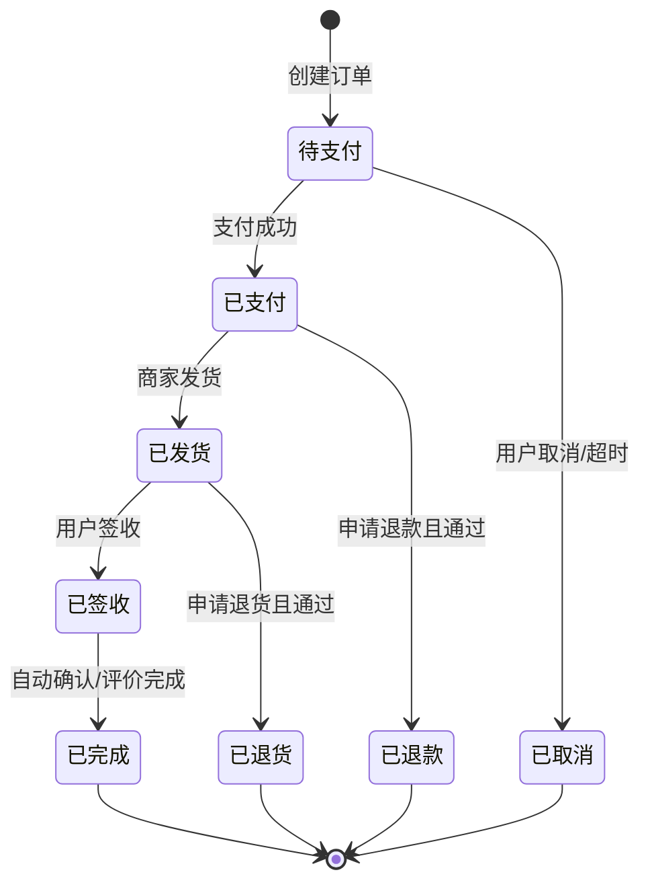
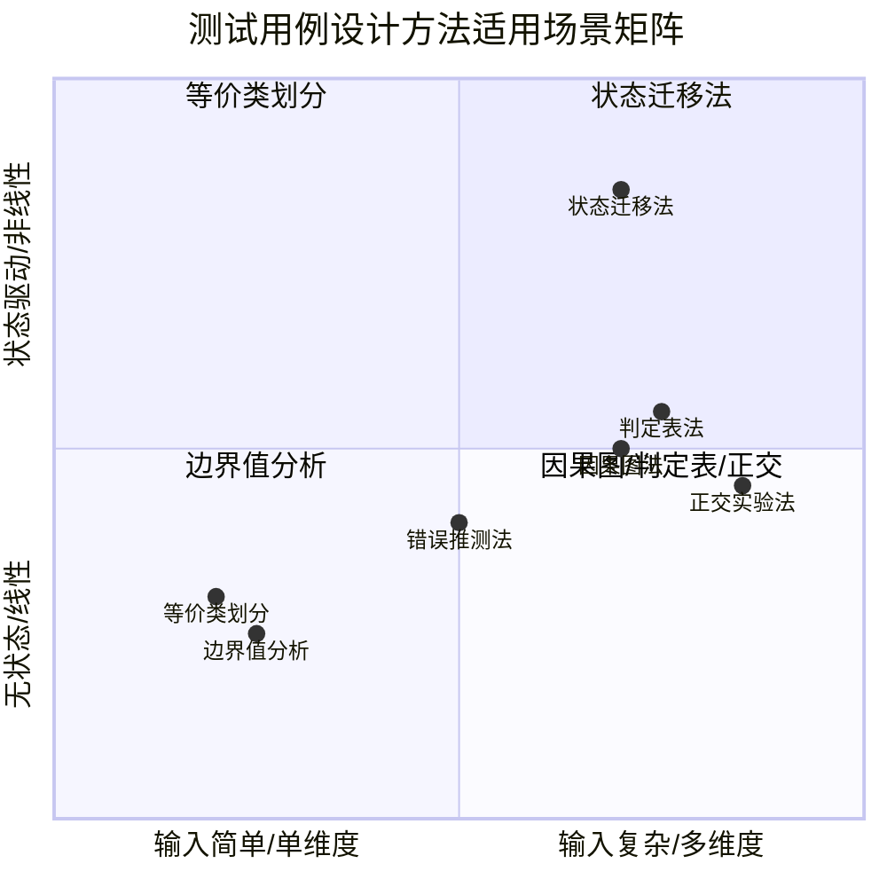

# 测试用例设计方法：等价类、边界值、错误推测、正交与七大体系

测试用例设计的本质是在"穷尽测试不可行"这一基本约束下，用有限且具有代表性的输入组合覆盖尽可能多的缺陷风险。本文系统梳理七大经典设计方法，并补充 2024-2026 年间 AI 辅助用例生成、基于模型的测试（MBT）、Property-Based Testing 与探索式测试的工程化新趋势。

## 一、核心概念：什么是"好的"测试用例

"好的"测试用例不应被定义为"发现了缺陷的用例"——这会陷入"傻子吃烧饼"式的归因谬误：缺陷被修复后，同一个用例难道就不再"好"了吗？更合理的定义是：**"好的"测试用例是一个完备的集合，能够覆盖所有等价类与各种边界值，而跟能否发现缺陷无关**。

工程上还需引入**基于风险的测试策略（Risk-Based Testing, RBT）**作为补充：在有限资源下，"好的"用例集是**对高风险等价类与关键边界值实现充分覆盖**的集合，而非追求绝对完备。

### 设计原则

1. **整体完备性**：用例集是有效用例的集合，能完全覆盖测试需求
2. **等价类划分的准确性**：同一等价类内任一输入通过测试，其他输入也一定通过
3. **等价类集合的完备性**：所有可能的边界值与边界条件均被正确识别
4. **缺陷代表性**：单个用例应尽可能独立揭露某一类缺陷，避免冗余
5. **可执行与可维护**：前置条件、输入、预期结果、清理动作清晰无歧义

## 二、等价类划分法

等价类划分（Equivalence Partitioning）的核心假设是：**等价类中任意一个输入对于揭露程序潜在错误具有同等效果**。因此只需从每个等价类中选取一个代表值，即可用少量输入取得较好的覆盖效果。

### 有效等价类与无效等价类

- **有效等价类**：符合需求规约的输入集合，用于验证功能正确实现
- **无效等价类**：违反需求规约的输入集合，用于验证异常处理与容错能力

### 划分原则

1. 若输入条件规定了取值范围（如 0~100），则可划分为一个有效等价类（0~100）和两个无效等价类（<0、>100）
2. 若输入条件规定了取值集合（如"红/绿/蓝"），则每个取值为一个有效等价类，整体之外为无效等价类
3. 若输入条件为布尔值，则"真"与"假"各为一个有效等价类
4. 若输入条件规定必须为某类型（如整数），则该类型为有效等价类，其他类型为无效等价类

### 实战示例：考试成绩输入框

需求：考试成绩取值 0~100 之间的整数，及格线 60。划分结果：

| 等价类 | 范围 | 代表值 |
|--------|------|--------|
| 有效等价类 1 | 0~59 | 50 |
| 有效等价类 2 | 60~100 | 80 |
| 无效等价类 1 | <0 的负数 | -1 |
| 无效等价类 2 | >100 的整数 | 101 |
| 无效等价类 3 | 0~100 之间的浮点数 | 75.5 |
| 无效等价类 4 | 非数字字符 | "abc" |

## 三、边界值分析法

工程经验表明，**大量缺陷发生在输入输出的边界上**，而非中心区域。边界值分析（Boundary Value Analysis）作为等价类划分的补充，选取正好等于、刚刚大于、刚刚小于边界的值作为测试数据。

### 边界选取规则

- 对于范围 `[a, b]`，选取 `a-1, a, a+1, b-1, b, b+1` 共 6 个边界点
- 对于有序集合，选取第一个、第二个、倒数第二个、最后一个元素
- 对于字符串长度限制 `n`，选取长度 `0, 1, n-1, n, n+1` 的输入
- 多变量组合时，**一个变量取边界值、其他变量取正常值**，避免组合爆炸

### 与等价类结合使用

等价类划分关注"代表性"，边界值分析关注"极端性"，二者必须组合使用。继续以考试成绩为例，结合后的边界值为：`-1, 0, 1, 59, 60, 61, 99, 100, 101`，与等价类代表值（50, 80）共同构成完整用例集。

## 四、错误推测法

错误推测法（Error Guessing）依赖测试人员的经验、直觉与对被测系统的深入理解，**推测程序可能存在的缺陷**，从而有针对性地设计用例。其本质与"探索式测试"的思想一脉相承。

### 经验驱动

经典经验清单包括：

- Web 缓存开关下页面表现是否一致
- API 依赖的第三方服务超时/异常返回时的降级逻辑
- 单元测试中函数入参为 `null` 时的内部处理
- 数据库事务在并发场景下的死锁
- 输入框对全角/半角字符、零宽字符、Emoji 的处理
- 文件上传中文件名为空、超大、特殊扩展名的处理

### 缺陷库驱动

为降低对个人能力的依赖，工程上通常建立**缺陷知识库（Defect Knowledge Base）**作为 Checklist：

- 中小团队：维护一个 Wiki 页面，每轮测试后补充
- 中大型团队：将缺陷库作为数据驱动测试的输入，自动生成部分测试数据
- AI 增强模式：基于历史缺陷数据训练 ML 模型预测高风险代码区域

## 五、因果图法与判定表法

当输入条件之间存在**逻辑组合关系**时，等价类划分难以系统化覆盖所有组合，此时需要因果图法（Cause-Effect Graph）与判定表法（Decision Table）。

### 因果图法

因果图法通过识别**原因（输入条件）**与**结果（输出动作）**之间的逻辑关系（与、或、非、恒等），构建因果图，再转换为判定表。其核心价值在于：**揭示需求规约中模糊或矛盾的逻辑约束**。

### 判定表法

判定表将原因组合作为列、动作作为行，每列对应一条测试用例。判定表的构建步骤：

1. 列出所有原因（条件）和结果（动作）
2. 构造所有原因的真值组合（2^n 种，n 为原因数）
3. 根据需求规约，对每种组合标注结果
4. 化简等价列与不可能列
5. 每一列对应一条测试用例

### 实战示例：订单优惠判定表

需求：订单金额 > 100 且为 VIP 用户时享受 8 折；订单金额 > 100 且非 VIP 用户时享受 9 折；订单金额 ≤ 100 不享受折扣。

| 用例编号 | 金额 > 100 | 是 VIP | 优惠 |
|---------|:---------:|:------:|------|
| TC1 | Y | Y | 8 折 |
| TC2 | Y | N | 9 折 |
| TC3 | N | Y | 无折扣 |
| TC4 | N | N | 无折扣 |

## 六、正交实验法

当输入因素较多且每个因素有多个水平时，**全组合测试用例数量呈指数级增长**。正交实验法（Orthogonal Experimental Design）借助正交表，从全组合中挑选出具有"均匀分散、整齐可比"特性的子集，实现用例数量大幅缩减。

### 核心概念

- **因素（Factor）**：影响测试结果的输入变量
- **水平（Level）**：每个因素的可能取值
- **正交表 L_n(k^m)**：n 行（用例数）、m 列（因素）、每列 k 个水平

例如 `L_9(3^4)` 表示 4 因素、每因素 3 水平，仅需 9 条用例即可覆盖，而全组合需要 3^4=81 条。

### 用例缩减示例

假设某注册接口有 4 个参数：用户名（A/B/C）、密码（强/中/弱）、邮箱（QQ/163/Gmail）、性别（男/女/-）。直接组合为 3×3×3×3=81 条用例，使用正交表可缩减至 9 条，且任意两因素的所有水平组合至少出现一次。

### 与 Pairwise 测试的关系

Pairwise（成对测试）是正交实验法的简化版本，**仅保证任意两个因素的所有水平组合至少出现一次**，不要求三阶及以上组合覆盖。主流工具如 PICT（Microsoft）、AllPairs 算法均基于此思想。

## 七、状态迁移法

对于**状态机驱动的系统**（如订单流转、审批工作流、协议栈），状态迁移法（State Transition Testing）是首选设计方法。它通过状态图建模系统行为，再基于覆盖准则生成用例。

### 状态-事件-动作三元组

- **状态（State）**：系统在某一时刻所处的稳定情形
- **事件（Event）**：触发状态迁移的外部输入
- **动作（Action）**：状态迁移时系统执行的操作

### 覆盖准则

- **状态覆盖**：每个状态至少被访问一次
- **迁移覆盖（0-switch）**：每个状态-事件对至少执行一次
- **N-switch 覆盖**：覆盖连续 N+1 次迁移的路径，N 越大覆盖越强
- **全路径覆盖**：覆盖所有可能路径（含环路），实践中通常不可达

### 状态迁移图示例：订单生命周期



上图展示了一个典型电商订单的状态机：从"待支付"到"已完成"或"已退款/已取消/已退货"等终态。基于迁移覆盖准则，可设计出覆盖所有合法迁移的用例集；进一步通过**非法迁移**（如"待支付"直接跳"已发货"）补充异常路径用例。

## 八、2024-2026 新趋势

### 七大方法适用场景矩阵



### AI 辅助测试用例生成

2024 年以来，大语言模型（LLM）在测试用例生成上的工程化应用快速成熟：

- **基于需求文档生成用例骨架**：将 PRD/用户故事输入 GPT-4o/Claude 3.5/Qwen，自动提取功能点并生成等价类与边界值用例
- **基于代码生成单元测试**：GitHub Copilot、Cursor、Trae 等工具可针对函数签名与实现生成 JUnit/pytest 用例
- **缺陷预测增强错误推测**：基于历史缺陷训练的 ML 模型可标注高风险代码区域，引导测试人员定向设计用例
- **AI 自适应路径发现**：Mabl、Testim、Functionize 等平台利用强化学习发现 GUI 中的潜在缺陷路径

**工程提示**：AI 生成的用例必须经过人工 Review，重点检查等价类完备性、边界值选取合理性、业务语义正确性。

### 基于模型的测试（MBT）

MBT（Model-Based Testing）通过构建系统行为模型（状态机、UML 活动图、B-method 形式化模型），由工具自动生成测试用例与测试脚本。2024-2026 的趋势：

- **工具链成熟**：GraphWalker（Java）、Modbat（Scala）、Tricentis Tosca、Conformiq 等支持从模型自动生成可执行脚本
- **与 CI/CD 集成**：模型变更触发用例重新生成，避免手工维护成本
- **覆盖率自动度量**：基于模型的覆盖率（状态覆盖、迁移覆盖、N-switch）可自动统计

### Property-Based Testing（基于属性的测试）

Property-Based Testing（PBT）从**另一角度补充用例设计**：不针对具体输入值设计用例，而是声明**输入应满足的不变量（Property）**，由框架自动生成大量随机输入验证不变量。

```python
# 使用 Hypothesis 进行 Property-Based Testing 示例
from hypothesis import given, strategies as st

# 定义被测函数：对一个列表进行升序排序
def sort_ascending(nums: list[int]) -> list[int]:
    return sorted(nums)

# 声明不变量：排序后列表长度不变、非递减、元素集合相同
@given(st.lists(st.integers()))
def test_sort_properties(nums):
    result = sort_ascending(nums)
    # 不变量 1：长度不变
    assert len(result) == len(nums)
    # 不变量 2：非递减
    assert all(result[i] <= result[i + 1] for i in range(len(result) - 1))
    # 不变量 3：元素集合相同（含重复计数）
    assert sorted(result) == sorted(nums)
```

主流框架：Hypothesis（Python）、QuickCheck（Haskell）、jqwik（Java）、fast-check（JS/TS）。PBT 与传统用例设计方法**互补**：传统方法聚焦代表性输入，PBT 聚焦不变量与随机化覆盖，二者结合可显著提升测试深度。

### 探索式测试与脚本测试的平衡

探索式测试（Exploratory Testing）强调**测试设计与执行同步进行**，依赖测试人员的实时判断。2024-2026 的实践共识是**平衡探索与脚本**：

- **高风险变更**：脚本化回归测试 + 自动化契约测试保证基线
- **新功能/复杂场景**：探索式测试发现未知缺陷，发现后再脚本化
- **Session-Based 测试管理（SBTM）**：将探索式测试组织为时间盒 Session，每 Session 产出 Charter、缺陷、覆盖笔记
- **AI 辅助探索**：LLM 在 Session 中实时建议下一步操作路径

## 九、常见陷阱与最佳实践

### 常见陷阱

1. **只设计有效等价类，忽略无效等价类**——导致异常路径覆盖不足
2. **边界值只取边界点，忽略边界附近的"刚刚"值**——遗漏 off-by-one 缺陷
3. **以代码实现为依据设计用例**——开发代码错误会传染到测试用例
4. **判定表未化简，用例数量爆炸**——未合并等价列与不可能列
5. **正交实验法滥用**——对单因素或两因素场景使用正交表，徒增复杂度
6. **状态迁移法遗漏非法迁移**——只测合法路径，忽略异常状态跳转
7. **AI 生成用例盲目采用**——未经人工 Review 直接执行，可能引入语义错误

### 最佳实践

1. **以需求规约为唯一依据**——而非代码实现
2. **三大基础方法优先**——等价类、边界值、错误推测满足 80% 场景
3. **复杂逻辑用判定表**——条件组合超过 3 个时优先判定表
4. **状态系统用状态迁移**——订单/工作流/协议栈必用
5. **组合爆炸用正交或 Pairwise**——多因素多水平场景必用
6. **引入覆盖率度量闭环**——需求覆盖率 + 代码覆盖率 + 变异测试
7. **AI 生成 + 人工 Review**——LLM 提效，人工把关语义正确性
8. **PBT 补充不变量覆盖**——对算法、数据结构类代码尤为有效
9. **维护团队级缺陷知识库**——将错误推测从个人经验升级为组织资产

## 总结

测试用例设计的七大方法并非相互替代，而是**在不同场景下分层组合使用**：等价类与边界值是基础，错误推测是经验增强，因果图与判定表处理条件组合，正交实验法压缩组合空间，状态迁移法建模状态系统。2024-2026 年的新趋势——AI 辅助生成、MBT、Property-Based Testing、探索式测试——并非颠覆经典方法，而是**在生成效率、覆盖深度、人机协作三个维度上对经典方法的工程化增强**。测试工程师的核心能力，正在从"手工设计用例"演进为"在 AI 与模型的辅助下，聚焦高风险区域、把控用例质量、构建可持续演进的用例集"。
