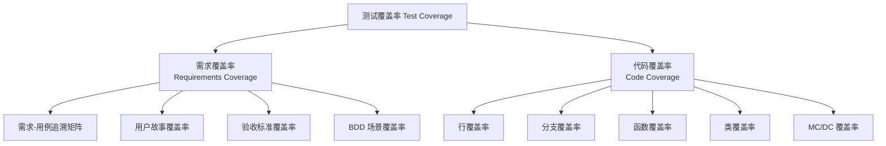
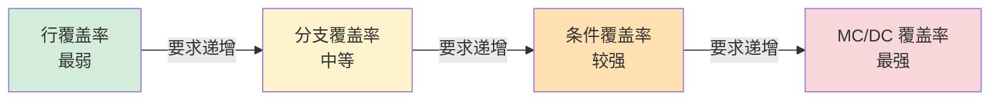
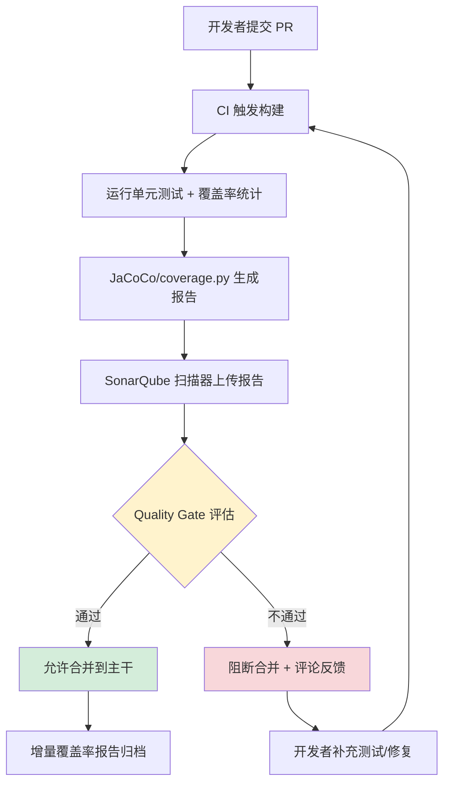

# 测试覆盖率与质量门禁

测试覆盖率（Test Coverage）是衡量测试充分性的量化指标，也是现代 CI/CD 质量门禁的核心输入。然而在工程实践中，"100% 覆盖率等于无缺陷"是最常见的认知误区。本文聚焦覆盖率的方法论——概念体系、覆盖率类型强弱、需求-用例追溯、质量门禁设计与增量覆盖率实践；具体工具（JaCoCo、coverage.py、SonarQube）的安装与配置细节由同系列《测试覆盖率工具（JaCoCo 与 coverage.py 与 SonarQube）》一文承接，两文互补。

## 一、核心概念：测试覆盖率的定义与两大维度

> **测试覆盖率**是指在测试执行过程中，至少被执行了一次的条目数占整个可执行条目数的百分比。

"条目"的粒度决定了覆盖率的类型：以语句为条目即得行覆盖率，以判定分支为条目即得分支覆盖率，以需求为条目即得需求覆盖率。从度量维度上看，测试覆盖率可分为两大类：

- **需求覆盖率**（Requirements Coverage）：面向项目维度，回答"需求是否被测试覆盖"
- **代码覆盖率**（Code Coverage）：面向技术维度，回答"代码是否被测试执行"



敏捷模式下，"测试覆盖率"通常默认指代码覆盖率，但需求覆盖率以用户故事覆盖率、验收标准覆盖率、BDD 场景覆盖率等轻量级形式持续存在。两者并非二选一，而是从不同视角共同支撑质量评估。

## 二、代码覆盖率类型：行/分支/函数/类/MC/DC

代码覆盖率的强弱由"条目"粒度决定，粒度越细，发现缺陷的能力越强，但测试设计成本也越高。

### 2.1 各类型定义

- **行覆盖率**（Statement/Line Coverage）：已被执行到的语句占总可执行语句的百分比。最常用、要求最低，仅能保证代码"被走过"，无法发现分支遗漏。
- **分支覆盖率**（Branch/Decision Coverage）：每个判定的真假分支各被覆盖至少一次。例如 `if(a>0 && b>0)`，要求整体判定取 TRUE 和 FALSE 各一次。
- **条件覆盖率**（Condition Coverage）：判定中每个原子条件的可能取值至少出现一次。对 `if(a>0 && b>0)`，要求 `a>0` 取 TRUE/FALSE 各一次，`b>0` 取 TRUE/FALSE 各一次。
- **函数覆盖率**（Function Coverage）：被调用过的函数占全部函数的百分比。常用于度量 API/集成测试的覆盖广度。
- **类覆盖率**（Class Coverage）：被加载或实例化的类占全部类的百分比，多见于面向对象语言（Java/Kotlin）。
- **MC/DC 覆盖率**（Modified Condition/Decision Coverage）：修正条件/判定覆盖，是航空电子 DO-178C、汽车 ISO 26262 ASIL-D 等安全关键标准的最高等级指标。要求：① 每个条件所有可能取值至少出现一次；② 每个判定所有可能结果至少出现一次；③ **每个条件都能独立影响判定结果**。

### 2.2 强弱对比



从行覆盖到 MC/DC，发现能力递增，设计成本也递增：行覆盖仅能发现"未执行的代码"，分支覆盖能发现"未执行的分支"，条件覆盖能发现"原子条件遗漏"，MC/DC 能发现"条件独立影响缺陷"。业务项目主指标通常选分支覆盖；MC/DC 仅用于航空、自动驾驶、医疗等安全关键系统。Google 公开实践建议：单元测试 60% 为可接受、75% 为良好、90% 为优秀。

## 三、需求覆盖率：需求-用例追溯矩阵

需求覆盖率的核心做法是建立**需求与测试用例的一对多映射**，最终保证每条需求至少被一个用例覆盖。其量化公式为：

```
需求覆盖率 = 已被测试用例覆盖的需求数 / 总需求数 × 100%
```

### 3.1 需求-用例追溯矩阵

追溯矩阵（Traceability Matrix）是需求覆盖率的标准载体。现代团队通常使用 Jira + Xray/Zephyr Scale、Azure DevOps、TestRail 等工具维护，但本质上就是一张映射表：

| 需求 ID | 需求描述 | 关联用例 ID | 用例状态 | 覆盖状态 |
|---------|---------|------------|---------|---------|
| REQ-001 | 用户使用手机号登录 | TC-101, TC-102 | 通过 | ✅ 已覆盖 |
| REQ-002 | 密码连续错误 5 次锁定 | TC-103 | 失败 | ⚠️ 覆盖但缺陷未修复 |
| REQ-003 | 第三方 OAuth 登录 | — | — | ❌ 未覆盖 |

通过这张矩阵，可以一眼看出哪些需求未被测试覆盖、哪些需求虽然覆盖但用例失败。在敏捷模式下，"需求"的粒度变为 User Story 或 Acceptance Criteria，但追溯关系不变。

### 3.2 需求覆盖率的局限

需求覆盖率同样存在盲区：**需求本身可能不完整或错误**。如果 PRD 漏掉了"密码强度校验"这一隐含需求，即使需求覆盖率 100%，缺陷仍然存在。因此需求覆盖率必须与代码覆盖率、探索式测试结合使用，形成多视角交叉验证。

## 四、质量门禁设计：SonarQube Quality Gate 与 CI/CD 卡点

质量门禁（Quality Gate）是 CI/CD 流水线中"合并不通过即阻断"的量化门槛。它把覆盖率、静态检查、漏洞数量等指标统一为二值决策：**通过则允许合并，不通过则阻塞**。

### 4.1 SonarQube Quality Gate

SonarQube 的 Quality Gate 是业界事实标准。其核心思想是把多维质量条件组合为一个整体判定，任一条件不达标即整体 FAIL。以下是覆盖率相关的 Quality Gate 条件的示意结构（字段为示意；实际通过 SonarQube Web API `api/qualitygates/create` 创建门禁，再用 `api/qualitygates/create_condition` 以 `gateName`/`metric`/`op`/`error` 参数逐条添加条件，新代码指标对应 `new_coverage`/`new_branch_coverage`/`new_line_coverage`）：

```json
{
  "name": "我的覆盖率门禁规则",
  "conditions": [
    {
      "metric": "coverage",
      "operator": "LESS_THAN",
      "threshold": "80",
      "onNewCode": true,
      "_comment": "新代码整体覆盖率必须 ≥ 80%"
    },
    {
      "metric": "branch_coverage",
      "operator": "LESS_THAN",
      "threshold": "65",
      "onNewCode": true,
      "_comment": "新代码分支覆盖率必须 ≥ 65%"
    },
    {
      "metric": "line_coverage",
      "operator": "LESS_THAN",
      "threshold": "80",
      "onNewCode": true,
      "_comment": "新代码行覆盖率必须 ≥ 80%"
    },
    {
      "metric": "coverage",
      "operator": "LESS_THAN",
      "threshold": "70",
      "onNewCode": false,
      "_comment": "整体覆盖率（含历史代码）不能低于 70%，防止长期劣化"
    }
  ]
}
```

> **关键设计点**：`onNewCode: true` 区分"新代码"与"整体代码"。新代码门槛严苛（80%），整体代码门槛宽松（70%）——这是渐进式提升覆盖率的核心策略，避免一次性补齐历史债务。

### 4.2 CI/CD 卡点流程



### 4.3 门禁规则设计原则

1. **新代码严、整体宽**：新代码 80%+，整体 60%~70%，避免历史债务阻塞业务迭代
2. **多维指标组合**：覆盖率 + 重复代码率 + 静态告警数 + 严重漏洞数，单一指标容易"刷数据"
3. **可降级**：紧急修复（Hotfix）允许临时绕过门禁，但需人工审批并留痕
4. **可视化反馈**：PR 评论中直接展示覆盖率变化（如 `Coverage: 82.3% (+1.2%)`），让开发者立刻看到影响

## 五、增量覆盖率：diff-cover 与 PR 级检查

整体覆盖率是"存量指标"——历史代码的覆盖率会被新代码稀释或掩盖。**增量覆盖率（Incremental Coverage）只关注本次 PR 变更的代码行**，确保新增代码不拉低整体水平。

### 5.1 diff-cover 工具

`diff-cover` 是 Python 生态最常用的增量覆盖率工具，它把 `coverage.py` 生成的 XML 报告与 `git diff` 的结果做交集，只统计变更行的覆盖率：

```bash
# 1. 运行测试并生成 XML 格式的覆盖率报告
coverage run -m pytest && coverage xml -o coverage.xml

# 2. 生成相对于目标分支（如 origin/main）的 diff
git diff origin/main...HEAD > changes.diff

# 3. 计算增量覆盖率并生成 HTML 报告
diff-cover coverage.xml --compare-branch=origin/main --html-report diff_coverage.html

# 4. 命令行直接输出增量覆盖率摘要
diff-cover coverage.xml --compare-branch=origin/main

# 5. 设置阈值，低于 80% 退出码非零（用于 CI 卡点）
diff-cover coverage.xml --compare-branch=origin/main --fail-under=80
```

Java 生态可使用 SonarQube 的 `onNewCode` 条件实现同等效果；JS/TS 生态可用 `c8 --reporter=json` 配合自定义脚本对比 diff。

### 5.2 GitHub Actions 集成

```yaml
name: 增量覆盖率检查
on:
  pull_request:
    branches: [main]
jobs:
  coverage:
    runs-on: ubuntu-latest
    steps:
      - uses: actions/checkout@v4
        with:
          fetch-depth: 0  # 必须拉取完整历史，否则 diff 对比失败
      - name: 安装依赖
        run: pip install coverage diff-cover pytest
      - name: 运行测试
        run: coverage run -m pytest
      - name: 生成增量覆盖率报告
        run: |
          coverage xml
          # 仅检查 PR 变更行，阈值 80%
          diff-cover coverage.xml \
            --compare-branch=origin/${{ github.base_ref }} \
            --fail-under=80 \
            --html-report diff_coverage.html
      - name: 上传报告
        if: always()
        uses: actions/upload-artifact@v4
        with:
          name: 增量覆盖率报告
          path: diff_coverage.html
```

> **关键陷阱**：`fetch-depth: 0` 不可省略。默认浅克隆只有 1 条提交，`diff-cover` 无法对比基线分支，会导致"所有变更行都被判定为未覆盖"的假失败。

## 六、覆盖率误区与正确认知

### 6.1 100% 覆盖率 ≠ 无缺陷

这是最核心的误区。覆盖率的计算基于**已有代码**，只能告诉你"哪些代码被执行过"，无法发现：

- **未考虑的输入组合**：例如只测了正数，没测 0 和负数
- **缺失的功能实现**：函数只有 `return null`，覆盖率 100% 但功能完全缺失
- **错误的业务逻辑**：实现错了但用例也按错的逻辑断言，覆盖率仍然 100%
- **边界值处理遗漏**：覆盖了常规路径，遗漏了边界条件

### 6.2 覆盖率是必要非充分条件

> **高的代码覆盖率不一定能保证软件质量，但低的代码覆盖率一定不能保证软件质量。**

覆盖率回答的是"**执行了多少**"，而非"**验证对了多少**"。它是质量保障的必要输入，但不能作为唯一判据。需要与变异测试、探索式测试、生产监控结合使用。

### 6.3 覆盖率目标设定

覆盖率目标不应"一刀切"，应分层设定：

| 代码层级 | 推荐覆盖率 | 说明 |
|---------|-----------|------|
| 核心域模型/算法 | 90%+ | 业务核心，缺陷代价高 |
| 工具类/纯函数 | 85%+ | 边界条件密集，易测 |
| 控制器/适配器 | 70%~80% | 集成测试覆盖为主 |
| DTO/POJO/配置类 | 0%~50% | 仅 getter/setter，无需强求 |
| 实验性代码 | 不强制 | 通过特性开关隔离 |

## 七、2024-2026 新趋势

### 7.1 变异测试验证覆盖率有效性

变异测试（Mutation Testing）通过在代码中自动注入微小语法变更（如 `>` 改为 `>=`、`+` 改为 `-`），然后运行测试套件验证是否"杀死"这些变异。**无法杀死的变异意味着测试虽然覆盖了代码，但并未真正验证其正确性**。

- **Java**：PITest，与 JUnit 5/Maven/Gradle 原生集成
- **JS/TS**：Stryker，支持变异测试报告可视化
- **Python**：mutmut，轻量级命令行工具

主流实践是在 CI 中以"变异分数（Mutation Score）≥ 60%"作为补充门禁，避免"刷覆盖率但不验证"的反模式。

### 7.2 AI 识别覆盖率盲区

2024 年以来，AI 辅助盲区识别成为新趋势：

- **Codecov AI**：基于历史缺陷数据，自动推荐未覆盖的高风险路径
- **Diffblue Cover**：自动生成补充测试用例，填补覆盖率缺口
- **GitHub Copilot test generation**：根据覆盖率报告生成候选测试，开发者审核后采纳

AI 的价值在于**把覆盖率从"被动统计"转向"主动补齐"**——不再依赖人工逐行分析未覆盖代码，而是由 AI 识别"该测但没测"的逻辑分支并生成测试用例。

### 7.3 覆盖率与 SLO/Error Budget 结合

在 SRE 实践中，覆盖率开始与 SLO（Service Level Objective）和错误预算（Error Budget）挂钩：

- **高 SLO 服务 = 高覆盖率要求**：核心交易、支付等 99.99% SLO 服务，覆盖率门禁提升至 90%+
- **Error Budget 消耗触发覆盖率复审**：当某个服务的 Error Budget 消耗超过 50%，自动触发该服务近期变更代码的覆盖率复审
- **生产覆盖率（Production Coverage）**：通过生产流量回放（如 Replayer）统计真实流量覆盖的代码路径，与测试覆盖率做差集，识别"测试覆盖但生产未走"和"生产走过但测试未覆盖"的两类盲区

这种结合把覆盖率从"开发期指标"扩展为"全生命周期质量信号"，使其与业务可用性直接挂钩。

## 八、常见陷阱与最佳实践

**陷阱**：

1. **追求 100% 行覆盖率而忽视分支覆盖**：行覆盖率 100% 时分支覆盖率可能仅 50%
2. **覆盖率作为 KPI 考核开发者**：导致"为覆盖而覆盖"的伪测试（如 `assertTrue(true)`）
3. **跨项目比较覆盖率**：JaCoCo 与 coverage.py 分支覆盖率算法不同，数值不可直接对比
4. **整体覆盖率达标即放行**：存量 80% 可能掩盖新代码仅 30% 的问题，必须看增量

**最佳实践**：

1. **三层门禁**：整体（防劣化）+ 新代码（严卡）+ 变更行（PR 级）
2. **覆盖率 + 变异分数结合**：覆盖率 80% + 变异分数 60%，比单独覆盖率 90% 更可靠
3. **按代码层级分目标**：核心域模型 90%+，DTO 不强制，避免资源错配
4. **PR 评论可视化覆盖率变化**：让开发者立刻看到本次变更对覆盖率的影响

## 总结

测试覆盖率是质量保障的必要输入，但绝非充分条件。本文从方法论视角梳理了覆盖率的两大维度、代码覆盖率类型的强弱对比、需求-用例追溯矩阵、SonarQube Quality Gate 与 CI/CD 卡点设计、增量覆盖率实践，并澄清了"100% 覆盖率 ≠ 无缺陷"等核心误区。具体工具落地（JaCoCo、coverage.py、SonarQube 的安装配置）由同系列《测试覆盖率工具》一文承接——方法论定方向，工具链出结果，才能让覆盖率真正成为质量保障的助力，而非数字游戏。
