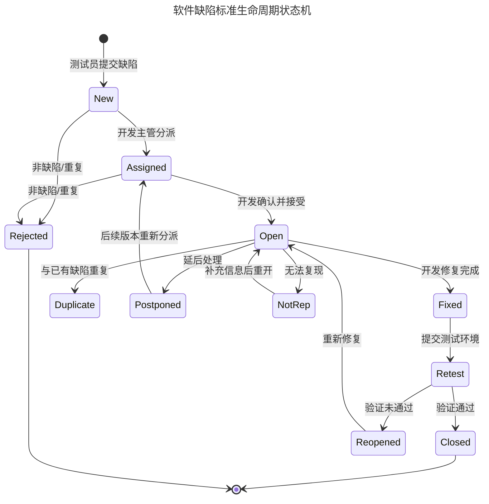
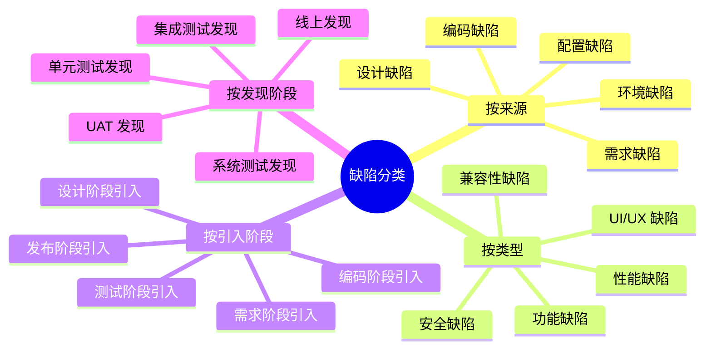
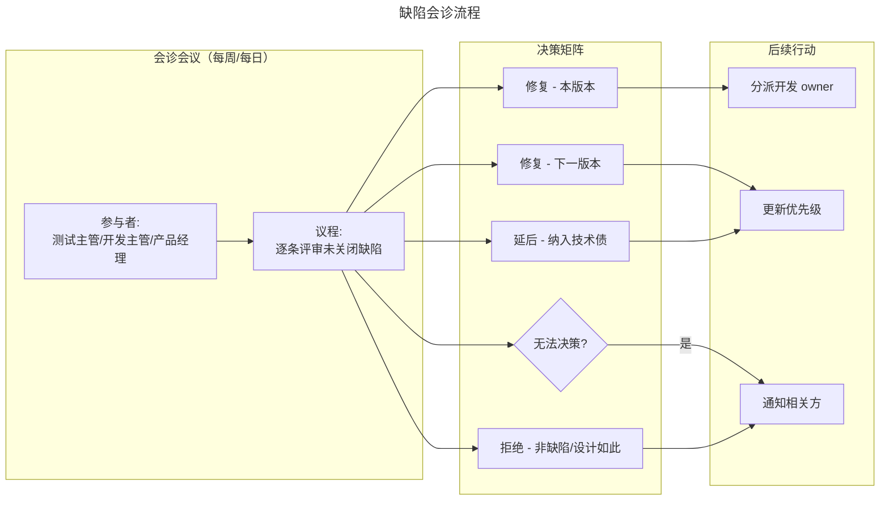
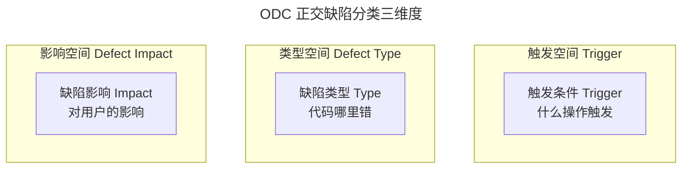

# 软件缺陷报告与缺陷生命周期

## 一、模块介绍

**软件缺陷**（Software Defect / Bug）是指软件产品未满足需求规格、设计意图或用户预期的任何瑕疵。缺陷管理是测试工程的基础能力——发现缺陷只是起点，将缺陷**清晰表达、准确分级、高效流转、闭环验证**才是完整的缺陷管理闭环。

一份高质量的缺陷报告能将缺陷修复的平均时间（Mean Time To Repair，MTTR）降低 50% 以上；反之，一份模糊的缺陷报告会引发"开发说无法复现→测试说确实存在→反复沟通"的恶性循环。本文系统阐述缺陷生命周期管理、缺陷报告编写规范、严重度与优先级定级、以及缺陷度量分析方法。

## 二、核心方法论

### 2.1 缺陷生命周期

缺陷从被发现到被关闭，经历一系列状态流转。不同团队的流程略有差异，但核心状态机一致：



该状态机覆盖了缺陷的完整流转路径。关键决策节点包括：**New → Assigned**（分派）、**Open → Fixed**（修复）、**Retest → Closed/Reopened**（验证）、以及多个异常分支（Rejected/Duplicate/Postponed/NotRep）。

### 2.2 严重度与优先级

**严重度**（Severity）衡量缺陷对系统的影响程度，是**客观属性**；**优先级**（Priority）衡量缺陷修复的紧急程度，是**主观决策**。两者独立评估，不可混淆：

| 严重度 | 定义 | 示例 |
| --- | --- | --- |
| **S1 - 致命（Blocker/Fatal）** | 系统崩溃、核心功能完全不可用、数据丢失 | 支付成功但订单未生成 |
| **S2 - 严重（Critical/Major）** | 主要功能不可用或结果错误，无规避方案 | 搜索返回空白结果 |
| **S3 - 一般（Normal/Minor）** | 次要功能问题，有规避方案 | 筛选条件偶尔不生效 |
| **S4 - 轻微（Trivial/Cosmetic）** | UI 瑕疵、文案错误、不影响功能 | 按钮图标偏移 2px |

| 优先级 | 定义 | 修复时效要求 |
| --- | --- | --- |
| **P1 - 立即修复** | 阻塞发布或线上事故 | 即时/24 小时内 |
| **P2 - 高优先** | 本迭代或本版本必须修复 | 3 个工作日内 |
| **P3 - 中优先** | 下一版本计划修复 | 本 Sprint 内 |
| **P4 - 低优先** | 有空就修，或纳入技术债 | 不强制时效 |

**严重度与优先级的经典错配**：一个文案错误在首页显著位置（S4 严重度），但因为影响品牌形象可能被定为 P1 优先级。反之，一个深层模块的崩溃（S2 严重度）如果只有极少数用户触发，可能被定为 P3 优先级。

### 2.3 缺陷分类维度



多维分类支持根因分析（Root Cause Analysis，RCA）：若"需求阶段引入"的缺陷占比高，说明需求评审环节薄弱；若"线上发现"占比高，说明测试覆盖不足。

## 三、关键流程

### 3.1 缺陷报告标准结构

一份专业的缺陷报告应包含以下字段，缺一不可：

| 字段 | 说明 | 规范要求 |
| --- | --- | --- |
| **标题**（Summary） | 一句话概括缺陷 | 包含功能模块+操作+现象，≤50 字 |
| **环境**（Environment） | OS/浏览器/版本/设备 | 精确到版本号 |
| **前置条件**（Precondition） | 复现所需的数据与状态 | 包含测试账号与数据准备 |
| **复现步骤**（Reproduction Steps） | 1-2-3 编号的操作步骤 | 精确、可复制、无跳跃 |
| **期望结果**（Expected Result） | 按需求规格应有的行为 | 引用需求文档条目 |
| **实际结果**（Actual Result） | 实际发生的行为 | 客观描述，不加判断 |
| **附件**（Attachment） | 截图/录屏/日志 | 必须标注关键信息 |
| **严重度**（Severity） | 影响程度 | 客观评估 |
| **优先级**（Priority） | 修复紧急度 | 协商确定 |
| **频率**（Frequency） | 必现/偶发/特定条件 | 偶发需标注概率 |

### 3.2 缺陷报告实例

以下是一个高质量缺陷报告示例：

```
标题: [订单中心] 满减券叠加后实付金额计算错误（多减 10 元）

环境:
  - 前端: Chrome 149 / macOS 15
  - 后端: order-service v2.4.1（预发布环境）
  - 测试账号: tester-001

前置条件:
  1. 购物车有 3 件商品，单价分别为 100/200/300 元，合计 600 元
  2. 账户有 2 张可用券：
     - 券A: 满 500 减 50
     - 券B: 满 400 减 30

复现步骤:
  1. 进入购物车页面
  2. 同时勾选券A和券B
  3. 点击"结算"按钮
  4. 观察订单确认页的"优惠金额"和"实付金额"

期望结果:
  优惠金额 = 50 + 30 = 80 元
  实付金额 = 600 - 80 = 520 元

实际结果:
  优惠金额 = 90 元（错误）
  实付金额 = 510 元（多减 10 元）

附件:
  - 截图 1: 购物车券选择页（标注两张券）
  - 截图 2: 订单确认页（标注错误金额）
  - 日志: order-service.log 第 234-256 行

严重度: S1 - 致命（金额计算错误）
优先级: P1 - 立即修复
频率: 必现（10 次测试 10 次复现）

推测原因:
  疑似券B的满减基准不是商品总价 600 元，而是叠加券A后的金额 550 元，
  且优惠被错误地按"超出 400 元部分的 25%"计算（150 × 25% = 37.5，
  取整为 40），而非固定减免 30 元。
```

### 3.3 缺陷会诊流程

对于 S1/S2 级缺陷或争议性缺陷，需启动缺陷会诊（Bug Triage）流程：



## 四、工具与实践

### 4.1 Jira 缺陷管理工作流配置

Jira 是业界最主流的缺陷管理工具。以下是一个标准 Bug 工作流的 Jira 配置（YAML 格式简化表示）：

```yaml
# Jira Bug 工作流配置（简化版）
workflow:
  name: Bug-Standard-Workflow
  statuses:
    - name: "待处理"
      id: 1
      category: TO_DO
    - name: "处理中"
      id: 4
      category: IN_PROGRESS
    - name: "已修复"
      id: 5
      category: IN_PROGRESS
    - name: "待验证"
      id: 6
      category: IN_PROGRESS
    - name: "已关闭"
      id: 3
      category: DONE
    - name: "已拒绝"
      id: 7
      category: DONE

  transitions:
    - name: "分派"
      from: "待处理"
      to: "处理中"
      conditions:
        - type: PermissionCondition
          permission: "BROWSE"
    - name: "标记已修复"
      from: "处理中"
      to: "已修复"
      validators:
        - type: FieldRequiredValidator
          field: "resolution"
    - name: "部署到测试环境"
      from: "已修复"
      to: "待验证"
    - name: "验证通过"
      from: "待验证"
      to: "已关闭"
      conditions:
        - type: UserIsInGroupCondition
          group: "qa-team"
    - name: "验证失败"
      from: "待验证"
      to: "处理中"
```

### 4.2 缺陷度量指标

| 指标 | 计算方式 | 健康阈值 |
| --- | --- | --- |
| 缺陷密度（Defect Density） | 缺陷数 / 千行代码（KLOC） | < 5/KLOC |
| 缺陷逃逸率（Defect Escape Rate） | 线上缺陷 / 总缺陷 × 100% | < 5% |
| 缺陷修复率（Fix Rate） | 已修复缺陷 / 总缺陷 × 100% | > 95% |
| 平均修复时长（MTTR） | 总修复时长 / 缺陷数 | S1 < 4h，S2 < 24h |
| 缺陷重开率（Reopen Rate） | 重开次数 / 总修复数 × 100% | < 10% |
| 缺陷发现率（Defect Detection Rate） | 各阶段发现缺陷占比 | 测试阶段 > 85% |

### 4.3 正交缺陷分类（ODC）

IBM 提出的 **正交缺陷分类**（Orthogonal Defect Classification，ODC）是缺陷根因分析的系统化方法。每个缺陷按类型（Type）、触发（Trigger）、影响（Impact）三个正交空间标注：



ODC 标注的缺陷可在后期聚合分析：如发现"赋值类"缺陷占 40%，说明开发在变量赋值环节易错，可针对性加强 Code Review 规则。

## 五、常见误区

### 5.1 标题过于笼统

**误区**：标题写"页面报错了""功能不可用""计算有误"。

**纠正**：标题应包含**模块 + 操作 + 现象**三要素，让开发一眼定位。如"[订单中心] 多券叠加后实付金额多减 10 元"。

### 5.2 复现步骤跳步

**误区**：步骤写成"登录后下单，金额算错了"，省略关键操作。

**纠正**：复现步骤应做到"任何测试员照做都能复现"。每一步只含一个操作，不合并。使用编号列表，避免段落式描述。

### 5.3 期望结果无依据

**误区**：期望结果写"应该是对的"或"按常识应该 X"。

**纠正**：期望结果必须引用**需求文档条目**或**设计稿编号**。若无文档依据，应在缺陷报告中标注"需产品确认预期行为"。

### 5.4 缺陷报告夹带情绪

**误区**：报告中出现"这个 Bug 太低级了""开发怎么连这都没测"等主观评判。

**纠正**：缺陷报告是**客观技术文档**，只描述事实不评判责任。情绪化表述会引发开发防御心理，降低修复效率。

### 5.5 关闭缺陷不验证

**误区**：开发标记 Fixed 后测试直接关闭，不复验。

**纠正**：缺陷必须经过**测试环境复验**才能关闭。复验应使用原报告中的复现步骤，并验证关联功能未受影响。

## 六、进阶扩展与参考

### 6.1 缺陷预测与质量度量

基于历史缺陷数据，可构建缺陷预测模型（Defect Prediction Model）。常用方法包括：

- **复杂度模型**：代码圈复杂度（Cyclomatic Complexity）越高，缺陷概率越高
- **变更模型**：最近 N 次提交修改的文件，缺陷概率更高
- **开发者模型**：开发者经验、近期疲劳度与缺陷率的相关性

这些模型在大型项目中能指导测试资源分配——将探索式测试与 Code Review 聚焦于高风险模块。

### 6.2 与 CI/CD 的集成

现代缺陷管理已与 CI/CD 流水线深度集成：测试失败自动创建缺陷、缺陷关联提交记录与构建号、修复后自动触发回归。GitLab 的 Issue 与 Merge Request 联动、GitHub 的 Issue 与 PR/Commit 关联都是这一趋势的体现。

### 6.3 推荐参考

- 标准：IEEE Std 1044-2009《Standard Classification for Software Anomalies》
- 标准：ISO/IEC 25010《Systems and software Quality Requirements and Evaluation (SQuaRE)》
- 图书：《Why We Make Mistakes》Joseph T. Hallinan（理解人为错误的本质）
- 方法：IBM ODC（Orthogonal Defect Classification）白皮书
- 工具：Atlassian Jira（atlassian.com/software/jira）
