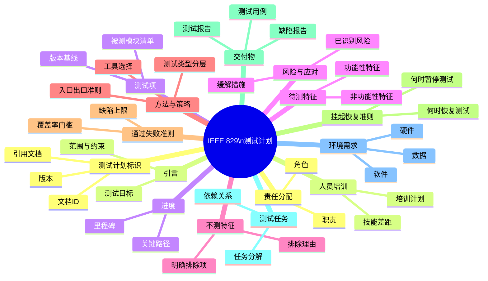
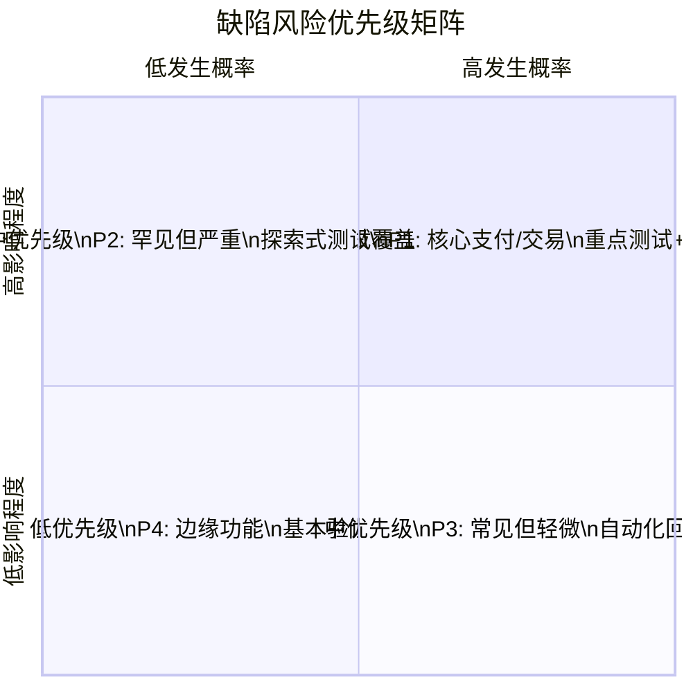
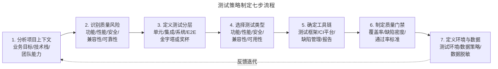
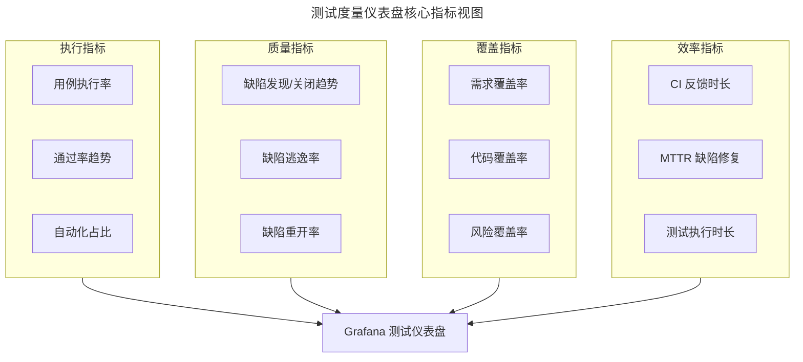

# 测试计划与测试策略

## 一、模块介绍

**测试计划**（Test Plan）与**测试策略**（Test Strategy）是测试工程的顶层设计文档。测试策略定义组织级或项目级的测试方针与方法论——"我们如何测试"；测试计划则针对具体版本或迭代，定义具体的测试范围、资源、进度——"这次测什么、谁来测、什么时候完成"。

两者关系类似于军事领域的"战略"与"战役计划"：战略是长期的、原则性的、覆盖全局的；战役计划是短期的、具体的、针对单一目标的。在敏捷时代，详尽的"百页测试计划文档"已不合时宜，但测试策略与轻量级测试计划的价值反而更加凸显——**没有策略的执行是盲目的，没有计划的策略是空洞的**。

## 二、核心方法论

### 2.1 测试策略与测试计划的边界

| 维度 | 测试策略 | 测试计划 |
| --- | --- | --- |
| 范围 | 项目级/产品线级 | 版本级/Sprint 级 |
| 时效 | 长期稳定（年度更新） | 短期动态（每版本更新） |
| 关注点 | 方法论、工具链、质量标准 | 范围、资源、进度、风险 |
| 变更频率 | 低 | 高 |
| 审批层级 | 项目经理/技术总监 | 测试主管/产品经理 |

### 2.2 IEEE 829 测试计划标准

IEEE Std 829-2008《Standard for Software and System Test Documentation》定义了测试文档的标准结构。虽然其原始形态较重，但其骨架仍是现代轻量级测试计划的基础：



敏捷时代并非照搬 IEEE 829 全部章节，而是**选取关键章节以轻量级形式落地**：测试策略文档通常 5-10 页，测试计划通常以 Sprint 测试检查表形式存在。

### 2.3 风险驱动测试策略

现代测试策略的核心是**风险驱动**（Risk-Based Testing，RBT）：测试资源是有限的，应优先测试风险最高的区域。风险由两个维度评估：

$$Risk = Probability（发生概率） \times Impact（影响程度）$$



风险矩阵帮助团队将 80% 的测试资源投入 20% 的高风险区域，避免"均匀撒网"式的低效测试。

## 三、关键流程

### 3.1 测试策略制定流程



### 3.2 测试估算方法

测试估算是测试计划的核心难点。四种主流方法各有适用场景：

| 方法 | 说明 | 适用场景 | 局限 |
| --- | --- | --- | --- |
| **专家评估法**（Expert Judgment） | 资深测试员凭经验估算 | 早期需求不明确时 | 主观性强 |
| **类比估算法**（Analogous Estimation） | 参考历史相似项目的实际数据 | 有历史数据积累的项目 | 需良好度量基础 |
| **分解估算法**（Decomposition） | 将测试任务分解到 WBS 最小单元再汇总 | 需求明确的项目 | 耗时长 |
| **三点估算法**（PERT） | 乐观(O)+最可能(M)+悲观(P) → (O+4M+P)/6 | 高不确定性场景 | 需三种估算 |

三点估算法的数学基础是 **PERT 分布**，能将不确定性量化为期望值与方差：

$$E（期望值）= \frac{O + 4M + P}{6}$$

$$\sigma（标准差）= \frac{P - O}{6}$$

### 3.3 入口准则与出口准则

**入口准则**（Entry Criteria）：测试阶段开始前必须满足的条件，避免"带病启动"：

- 需求评审通过且基线化
- 测试环境搭建完成并通过冒烟测试
- 测试用例评审通过
- 开发自测通过（单元测试覆盖率达标）

**出口准则**（Exit Criteria）：测试阶段结束的判定标准，避免"草草收场"：

- 测试用例执行率 ≥ 95%
- 通过率 ≥ 98%
- S1/S2 缺陷 100% 关闭
- S3 缺陷关闭率 ≥ 90%
- 代码覆盖率达标（如行覆盖 ≥ 80%）
- 性能基线达标（如 P99 响应时间 ≤ 200ms）

## 四、工具与实践

### 4.1 轻量级测试策略文档模板

以下是适用于敏捷项目的轻量级测试策略文档模板：

```markdown
# [项目名] 测试策略 v1.0

## 1. 测试目标
- 确保核心交易链路零 S1 缺陷上线
- API 自动化覆盖率 ≥ 90%，回归测试 30 分钟内完成
- 性能：P99 响应时间 ≤ 500ms，支持 5000 QPS

## 2. 测试分层
| 层级 | 工具 | 覆盖目标 | 执行频率 |
| --- | --- | --- | --- |
| 单元测试 | JUnit 5 + Mockito | 行覆盖 ≥ 80% | 每次提交 |
| 集成测试 | Spring Boot Test + Testcontainers | 模块覆盖 100% | 每次合并 |
| API 测试 | REST Assured + Postman | 接口覆盖 ≥ 95% | 每日构建 |
| E2E 测试 | Playwright 1.61 | 关键路径 100% | 每日构建 |
| 性能测试 | k6 + JMeter | 每版本回归 | 版本发布前 |
| 探索式测试 | SBTM + Session Report | 每 Sprint 4 次会话 | Sprint 内 |

## 3. 质量门禁
- PR 合并：单元测试 + 静态检查 + 覆盖率 ≥ 80%
- 合并到 main：集成测试 + API 测试全通过
- 发布候选（RC）：E2E + 性能 + 安全扫描通过

## 4. 环境策略
| 环境 | 用途 | 数据策略 |
| --- | --- | --- |
| Dev | 开发自测 | Mock 依赖 |
| Test | 功能测试 | 脱敏数据 |
| Staging | 预发布/性能 | 影子库 |
| Prod | 生产 | 真实数据 |

## 5. 风险与应对
| 风险 | 概率 | 影响 | 应对措施 |
| --- | --- | --- | --- |
| 三方接口不稳定 | 中 | 高 | Mock + 契约测试 |
| 测试数据准备慢 | 高 | 中 | 数据工厂 + 快照恢复 |
| 性能环境资源不足 | 中 | 高 | 容量预估 + 弹性扩容 |
```

### 4.2 Sprint 测试计划检查表

敏捷项目不需要百页测试计划，但每个 Sprint 应有一份检查表：

```yaml
# Sprint 24 测试计划检查表
sprint: "Sprint 24"
duration: "2026-08-12 ~ 2026-08-25"
stories:
  - id: "USER-101"
    name: "会员积分兑换"
    test_approach: "BDD + 探索式"
    owner: "张三"
    risk: "中"  # 涉及金额计算
    automation: "是"

  - id: "USER-102"
    name: "搜索结果排序优化"
    test_approach: "AB 对比 + 性能"
    owner: "李四"
    risk: "低"
    automation: "部分"

test_activities:
  - phase: "Sprint 计划"
    items:
      - "参与需求评审，确认验收标准"
      - "识别高风险故事，制定专项测试方案"

  - phase: "Sprint 执行"
    items:
      - "Day 1-2: 编写自动化测试骨架"
      - "Day 3-8: 并行测试 + 持续反馈"
      - "Day 9: 回归 + 探索式测试"
      - "Day 10: Sprint Review 准备"

entry_criteria:
  - "所有故事的验收标准已确认"
  - "测试环境数据准备完成"

exit_criteria:
  - "所有故事满足 DoD"
  - "回归测试通过率 ≥ 98%"
  - "无 S1/S2 缺陷遗留"
  - "自动化测试覆盖率无下降"
```

### 4.3 测试度量仪表盘

测试计划执行过程中需持续监控关键指标，Grafana 是构建测试度量仪表盘的主流工具：



## 五、常见误区

### 5.1 "敏捷不需要测试计划"

**误区**：认为敏捷"响应变化高于遵循计划"就完全不需要计划。

**纠正**：敏捷宣言原文是"响应变化**高于**遵循计划"，不是"不要计划"。轻量级测试计划（Sprint 检查表）能确保测试活动有序推进，避免遗漏关键风险。

### 5.2 测试计划一旦定稿不可变

**误区**：将测试计划视为合同，即使需求变化也严格按原计划执行。

**纠正**：测试计划应是**活文档**，随需求变化与风险认知更新而调整。关键是变更需有记录与评审，而非"偷偷改"。

### 5.3 范围越界：测试所有功能

**误区**：测试策略中"不测特征"（Features Not to Be Tested）章节为空，试图覆盖一切。

**纠正**：明确排除低风险或非本版本范围的功能，集中资源。排除需有理由记录，便于追溯。

### 5.4 风险评估一次性

**误区**：项目初期做一次风险评估后不再更新。

**纠正**：风险是动态的——新功能引入新风险、旧风险可能消解。每 Sprint 应复评风险矩阵，调整测试优先级。

### 5.5 出口准则过于宽松

**误区**：出口准则设为"测试用例执行完毕"或"测试时间结束"，缺乏质量约束。

**纠正**：出口准则应包含**量化质量指标**（覆盖率、缺陷数、性能基线），而非仅"做完"。"做完"不等于"做好"。

## 六、进阶扩展与参考

### 6.1 与 OKR 对齐的测试策略

成熟团队将测试策略与组织 OKR（Objectives and Key Results）对齐：如公司级 OKR 包含"线上事故减少 50%"，则测试策略的 Key Result 应包含"缺陷逃逸率从 8% 降至 4%"。这种对齐确保测试投入服务于业务目标，而非孤立的技术指标。

### 6.2 AI 辅助测试计划

2025-2026 年趋势：LLM 能基于需求文档自动生成测试策略草案、自动识别高风险模块、自动估算测试工作量。AI 生成的草案仍需测试架构师评审与调整，但能将测试计划编写时间从天级缩短至小时级。

### 6.3 推荐参考

- 标准：IEEE Std 829-2008《Standard for Software and System Test Documentation》
- 标准：ISO/IEC/IEEE 29119《Software and systems engineering — Software testing》系列标准
- 图书：《Critical Testing Processes》Rex Black
- 图书：《Risk-Based Testing》David C. DeGroff
- 方法：ISTQB Test Management 认证大纲
