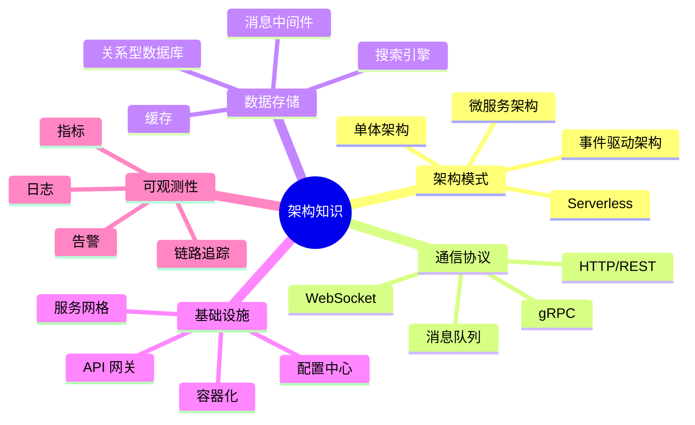
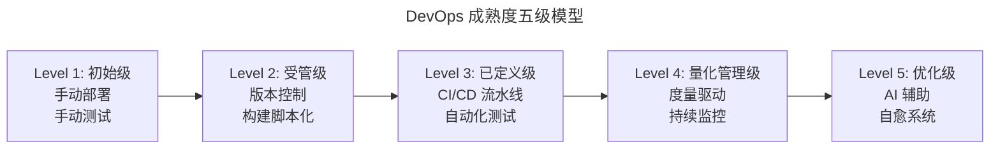
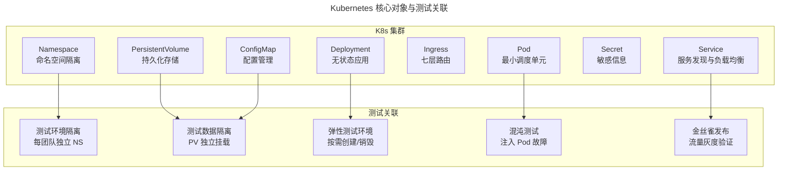
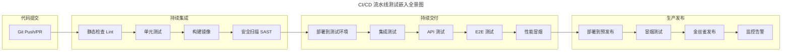

# 测试工程师的非测试知识（架构/K8s/DevOps）

## 一、模块介绍

现代测试工程师的竞争力已不局限于"测试用例设计与执行"。在云原生（Cloud Native）与 DevOps 时代，被测系统从单体演变为微服务，部署从物理机演变为 Kubernetes 集群，交付从月级演变为日级。测试工程师若不理解系统架构、容器编排与 DevOps 流水线，就无法有效定位问题、设计真实场景、参与质量左移。

本文系统梳理测试工程师应掌握的三大"非测试"知识域：**系统架构思维**（理解被测对象的结构与依赖）、**Kubernetes 基础**（理解测试环境的运行载体）、**DevOps 实践**（理解代码从提交到上线的完整旅程）。

## 二、核心方法论

### 2.1 系统架构知识图谱



测试工程师不需要能设计这些架构，但必须**能读懂架构图、理解数据流向、识别单点故障与性能瓶颈**。

### 2.2 架构理解对测试设计的驱动价值

| 架构知识 | 对测试设计的价值 |
| --- | --- |
| 微服务拆分边界 | 设计契约测试，验证服务间接口一致性 |
| 数据库读写分离 | 测试主从延迟场景，验证读一致性 |
| 缓存策略（Cache Aside/Write Through） | 设计缓存失效与击穿场景 |
| 消息队列异步解耦 | 测试消息丢失、重复、顺序场景 |
| API 网关限流熔断 | 测试高并发下的降级与熔断行为 |
| 服务发现与负载均衡 | 测试节点扩缩容时的请求路由 |

### 2.3 DevOps 成熟度模型



测试工程师应评估所在团队的 DevOps 成熟度，制定与成熟度匹配的测试策略：Level 1-2 团队优先建设自动化基础；Level 3 团队强化测试门禁；Level 4-5 团队引入 AI 辅助与自愈机制。

## 三、关键流程

### 3.1 Kubernetes 核心概念与测试关联

Kubernetes（K8s）已成为容器编排事实标准。测试工程师需理解以下核心概念如何影响测试：



### 3.2 CI/CD 流水线中的测试嵌入点



每个嵌入点都有明确的测试目标与门禁：CI 阶段追求分钟级反馈，CD 阶段追求小时级验证，生产阶段追求实时监控与快速回滚。

### 3.3 可观测性三支柱

测试工程师在云原生环境中定位问题，依赖可观测性（Observability）三支柱：

| 支柱 | 工具 | 测试应用 |
| --- | --- | --- |
| **日志**（Logging） | ELK / Loki | 查看请求链路中的异常日志 |
| **指标**（Metrics） | Prometheus + Grafana | 监控 QPS/延迟/错误率趋势 |
| **追踪**（Tracing） | Jaeger / SkyWalking | 定位跨服务调用瓶颈 |

## 四、工具与实践

### 4.1 Testcontainers：测试环境即代码

Testcontainers 是云原生测试的利器，能在测试中自动创建销毁 Docker 容器作为依赖服务：

```java
// Java 示例：使用 Testcontainers 启动 MySQL + Redis 进行集成测试
import org.testcontainers.containers.MySQLContainer;
import org.testcontainers.containers.GenericContainer;
import org.testcontainers.junit.jupiter.Container;
import org.testcontainers.junit.jupiter.Testcontainers;
import org.testcontainers.utility.DockerImageName;
import org.junit.jupiter.api.Test;

import static org.junit.jupiter.api.Assertions.assertNotNull;
import static org.junit.jupiter.api.Assertions.assertTrue;

import java.util.List;

@Testcontainers
class OrderServiceIntegrationTest {

    @Container
    static MySQLContainer<?> mysql = new MySQLContainer<>(
        DockerImageName.parse("mysql:8.4-lts"))
        .withDatabaseName("test_db")
        .withUsername("test")
        .withPassword("test");

    @Container
    static GenericContainer<?> redis = new GenericContainer<>(
        DockerImageName.parse("redis:8-alpine"))
        .withExposedPorts(6379);

    @Test
    void shouldCreateOrderWithCache() {
        // mysql.getJdbcUrl() 自动返回动态端口连接串
        // redis.getHost() / redis.getMappedPort(6379) 同理
        String jdbcUrl = mysql.getJdbcUrl();
        String redisHost = redis.getHost();
        int redisPort = redis.getMappedPort(6379);

        OrderService service = new OrderService(jdbcUrl, redisHost, redisPort);
        Order order = service.createOrder("user-001", List.of("sku-1", "sku-2"));

        assertNotNull(order.getId());
        assertTrue(service.isCached(order.getId()));
    }
}
```

Testcontainers 的价值：**每个测试用例拥有独立、干净、真实的依赖环境**，消除"在我的机器上能跑"的环境差异问题。

### 4.2 kubectl 测试常用命令

测试工程师在 K8s 环境中的日常操作命令清单：

```bash
# 查看测试命名空间的所有资源
kubectl get all -n test-namespace

# 查看特定 Pod 的日志（实时跟踪）
kubectl logs -f deployment/order-service -n test-namespace

# 查看 Pod 的详细事件（排查启动失败）
kubectl describe pod <pod-name> -n test-namespace

# 进入 Pod 执行命令（如检查网络连通性）
kubectl exec -it <pod-name> -n test-namespace -- /bin/sh

# 端口转发（本地访问集群内服务）
kubectl port-forward svc/order-service 8080:80 -n test-namespace

# 临时启动一个调试 Pod
kubectl run debug --image=nicolaka/netshoot -it --rm --restart=Never

# 查看 Pod 资源使用（需 metrics-server）
kubectl top pods -n test-namespace

# 强制删除卡住的 Pod
kubectl delete pod <pod-name> -n test-namespace --force --grace-period=0
```

### 4.3 混沌工程入门

混沌工程（Chaos Engineering）是 DevOps 时代的"主动式可靠性测试"。Netflix 的 Chaos Monkey 是先驱，如今 Chaos Mesh（CNCF 项目）是 K8s 原生的混沌实验平台：

```yaml
# Chaos Mesh 实验示例：注入网络延迟
apiVersion: chaos-mesh.org/v1alpha1
kind: NetworkChaos
metadata:
  name: order-service-latency
  namespace: test-namespace
spec:
  action: delay        # 延迟注入
  mode: all            # 影响所有 Pod
  selector:
    namespaces:
      - test-namespace
    labelSelectors:
      app: order-service
  delay:
    latency: "500ms"   # 注入 500ms 延迟
    correlation: "0"
    jitter: "50ms"
  duration: "5m"       # 持续 5 分钟
```

## 五、常见误区

### 5.1 "测试不需要懂架构"

**误区**：认为架构是开发与架构师的事，测试只需按需求验证功能。

**纠正**：不理解架构就无法设计有效的非功能测试（性能、可靠性、容灾）。如不知道有缓存层，就不会测试缓存击穿；不知道有读写分离，就不会测试主从延迟。

### 5.2 过度深入运维细节

**误区**：测试工程师试图成为 K8s 管理员，投入大量精力学习集群运维。

**纠正**：测试工程师需要"会用"而非"会管"K8s——能查看日志、定位问题、编写测试用的 YAML 清单即可。集群运维是 SRE 的职责。

### 5.3 忽视可观测性数据

**误区**：测试发现 Bug 后只看应用层日志，不查看链路追踪与指标。

**纠正**：云原生系统中，一个功能涉及多个微服务。仅看单服务日志无法定位根因，必须借助分布式追踪（如 SkyWalking）查看完整调用链。

### 5.4 测试环境与生产环境脱节

**误区**：测试环境用 Docker Compose 单机部署，生产用 K8s 多节点集群，环境差异巨大。

**纠正**：尽量缩小测试与生产的环境差距。Testcontainers + K8s 测试命名空间是当前最佳实践。至少预发布环境应与生产架构一致。

## 六、进阶扩展与参考

### 6.1 平台工程与 IDP

2025-2026 年趋势：**平台工程**（Platform Engineering）与**内部开发者平台**（Internal Developer Platform，IDP）兴起。测试平台作为 IDP 的能力之一，与部署平台、监控平台、安全平台集成，提供"自助式测试"体验。测试工程师需理解 IDP 理念，参与测试能力的平台化建设。

### 6.2 eBPF 与深度观测

eBPF（extended Berkeley Packet Filter）技术在 K8s 内核层提供无侵入的深度观测能力。测试工程师可利用 eBPF 工具（如 Pixie、Inspektor Gadget）在不修改代码的情况下捕获 HTTP 请求、数据库查询、网络延迟等细粒度数据，用于性能测试与根因分析。

### 6.3 推荐参考

- 图书：《Designing Data-Intensive Applications》Martin Kleppmann（架构基础）
- 图书：《Kubernetes Up & Running》Kelsey Hightower 等
- 图书：《Observability Engineering》Charity Majors 等
- 项目：Chaos Mesh（chaos-mesh.org）
- 项目：Testcontainers（testcontainers.com）
