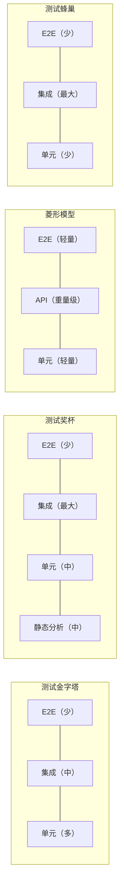

# 测试金字塔与测试奖杯

测试分层（Test Layering）是测试策略设计的基石。不同层级在反馈速度、维护成本、信心增益上各有取舍，将测试合理分布到各层，才能在质量、效率、成本之间取得平衡。本文系统梳理业界主流的四种测试分层模型——金字塔、奖杯、菱形、蜂巢，并补充云原生环境下测试分层的新变化。

## 一、为什么测试分层如此重要

测试的本质是用最低的成本获取对系统行为最大的信心。单一层级的测试无法同时满足"快、稳、广、真"四个维度：

- 单元测试快而稳，但难以验证业务流程真实性；
- 端到端测试真实但慢、脆弱、维护成本高；
- 集成测试介于两者之间，但若不加约束会演变为"巨型集成测试套件"。

测试分层的核心目的，是让每一类测试各司其职——快的测试快速反馈、稳的测试建立信心、真的测试验证业务价值。Mike Cohn 在《Succeeding with Agile》(2009) 中首次提出测试金字塔（Testing Pyramid）这一形象隐喻，将测试分布比作金字塔的形状：底层多、顶层少。

需要强调的是，分层模型是一种"指导原则"而非"硬性比例"。每个项目都需要根据自身的技术栈、发布节奏、团队能力进行裁剪。这也是后续出现奖杯、菱形、蜂巢等替代模型的根本原因。

## 二、测试金字塔（Mike Cohn）

测试金字塔是经典的三层结构，自下而上为单元测试、集成测试、端到端（E2E）测试。

### 三层结构与职责

| 层级 | 测试类型 | 主要执行者 | 测试方法 | 数量占比 | 反馈速度 |
| --- | --- | --- | --- | --- | --- |
| 底层 | 单元测试 | 开发工程师 | 白盒 | 最多（约 70%） | 毫秒级 |
| 中层 | 集成/API 测试 | 测试工程师 | 灰盒 | 适中（约 20%） | 秒级 |
| 顶层 | E2E/GUI 测试 | 测试工程师 | 黑盒 | 最少（约 10%） | 分钟级 |

### 核心原则

1. **底层多、顶层少**：越往上测试越慢、越脆弱，因此数量应递减。
2. **快反馈优先**：单元测试应能在 CI 流水线中秒级反馈，让开发者在提交后立即知道是否破坏了既有逻辑。
3. **避免倒金字塔**：即"冰淇淋筒"反模式——大量脆弱的 UI 自动化、极少单元测试，导致维护成本高、反馈慢。
4. **层级职责清晰**：单元测试验证逻辑正确性，集成测试验证模块协作，E2E 验证业务流程。

### 适用场景

测试金字塔最适合传统软件产品：发布周期长（月/年）、技术栈稳定、客户端变化少。在传统企业级软件中，一轮完整回归可能包含数千 GUI 用例和数万 API 用例，执行时间长达数十小时，这是金字塔模型能够承载的。

但对于发布周期以"天/小时"计的互联网产品，金字塔模型则显得力不从心。

## 三、测试奖杯（Kent C. Dodds）

2018 年，Kent C. Dodds 在前端工程实践中提出测试奖杯（Testing Trophy）模型，针对现代前端应用的特性重新分配了测试投入。

### 四层结构

| 层级 | 测试类型 | 占比 | 主要工具 | 价值 |
| --- | --- | --- | --- | --- |
| 底层 | 静态分析 | 中 | ESLint、TypeScript、Prettier | 最早发现低级错误 |
| 中下层 | 单元测试 | 中 | Jest、Vitest | 验证独立逻辑 |
| 中上层 | 集成测试 | **最大** | Testing Library、MSW | 验证组件协作 |
| 顶层 | E2E 测试 | 少 | Playwright、Cypress | 验证关键业务流程 |

### 集成测试占比最大的原因

测试奖杯最显著的特点是集成测试占据最大比重，这与金字塔模型形成鲜明对比。Dodds 的核心论据是：

1. **前端单元测试的"单元"难以界定**：一个 React 组件涉及 hooks、context、样式、子组件协作，纯函数式单元测试难以反映真实行为。
2. **集成测试更接近用户行为**：通过 Testing Library 以"用户视角"渲染组件树并断言 DOM 行为，能在不依赖真实后端的情况下验证交互逻辑。
3. **投入产出比最高**：集成测试既保留了较快的反馈速度，又覆盖了真实的组件协作路径，是"信心增益/成本"比最优的层级。
4. **静态分析前置**：通过 TypeScript 类型系统和 ESLint 规则在编码期捕获大量低级错误，减少了对单元测试的依赖。

### 测试奖杯 vs 测试金字塔

| 维度 | 测试金字塔 | 测试奖杯 |
| --- | --- | --- |
| 层数 | 3 层 | 4 层（增加静态分析） |
| 重心 | 单元测试 | 集成测试 |
| 适用领域 | 后端/传统软件 | 前端/现代 Web 应用 |
| 单元测试定位 | 数量最多 | 数量适中 |
| 静态分析 | 未明确独立 | 独立为底层 |
| 反馈速度优先级 | 速度优先 | 信心优先 |

测试奖杯并非否定金字塔，而是针对前端工程的特性进行裁剪。在 TypeScript 普及、组件化架构成为主流的今天，奖杯模型对前端测试策略设计具有重要参考价值。

## 四、菱形模型：互联网产品的测试策略

菱形模型（Diamond Model）是互联网行业在实践中演化出的测试策略，其核心是"重量级 API 测试、轻量级 GUI 测试、轻量级单元测试"。

### 三层结构

| 层级 | 投入 | 策略 | 主要原因 |
| --- | --- | --- | --- |
| 单元测试 | 轻量级 | 分而治之 | 迭代快，应用层频繁变化，单元测试难以全面开展 |
| API 测试 | 重量级 | 全面覆盖 + 契约测试 | 投入产出比最高，契合微服务架构 |
| E2E/GUI 测试 | 轻量级 | 手工为主 + 核心自动化 | 界面频繁变化，自动化脆弱 |

### API 测试成为重心的五条理由

1. **开发调试效率高**：API 测试用例是"准备数据→发起请求→验证响应"的标准流程，工具链（Postman、REST Assured、Karate）成熟。
2. **执行稳定性高**：不依赖 UI 渲染，无随机失败问题。
3. **单用例执行时间短**：便于并发执行，可在分钟级完成数千用例。
4. **契合微服务架构**：微服务测试本质上是对 Web Service 的 API 测试。
5. **接口后向兼容**：API 变更通常保持后向兼容，用例可重用性高。

### 单元测试的"分而治之"

互联网产品架构通常分为客户端应用层、后端应用服务、后端基础服务：

- **客户端应用层**：变动频繁，仅做少量单元测试；
- **后端非公用应用服务**：变动频繁，少量单元测试；
- **后端公共应用服务/基础服务**：相对稳定，"牵一发动全身"，全面单元测试；
- **核心算法/关键接口**（如支付网关、银行集成）：全面单元测试。

### GUI 测试的"轻量级"边界

GUI 测试采用"手工为主、自动化为辅"策略：

- 自动化仅覆盖最核心、直接影响主营业务流程的 E2E 场景；
- 探索式测试（Exploratory Testing）发现潜在问题；
- 视觉回归测试（Applitools、Percy）补充传统断言。

近年来 Playwright、Cypress 等现代框架显著改善了 GUI 自动化的编写体验，AI 辅助自愈测试（Mabl、Testim）也在缓解维护成本，但 GUI 测试本质上仍受制于界面变更的脆弱性。

## 五、测试蜂巢（Honeycomb）：微服务测试模型

Spotify 测试工程团队在微服务实践中提出测试蜂巢（Testing Honeycomb）模型，后经 Sam Newman 的《Building Microservices》推广，强调以集成测试为重心，而非单元测试。

### 蜂巢模型的三层结构

| 层级 | 占比 | 在微服务语境下的含义 |
| --- | --- | --- |
| 单元测试 | 较少 | 单个服务内部的纯函数/算法逻辑 |
| 集成测试 | **最大** | 服务与服务之间的协作、契约验证 |
| E2E 测试 | 较少 | 跨多服务的端到端业务流程 |

### 为什么微服务下集成测试最重要

微服务的核心复杂性不在服务内部，而在服务间协作。一个微服务的单元测试再充分，也无法保证它与其他服务的接口契约不被破坏。蜂巢模型认为：

1. 单元测试覆盖单个服务的内部逻辑，但微服务的"单元"本身就是分布式的；
2. E2E 测试需要拉起整个服务拓扑，成本高、不稳定；
3. 集成测试在中间层验证服务间契约和数据流，是投入产出比最优的层级。

### Contract Testing 在蜂巢模型中的位置

契约测试（Contract Testing）是微服务集成测试的关键补充，尤其以消费者驱动的契约测试（Consumer-Driven Contract Testing，CDCT）为代表：

- **消费者**：定义对提供者接口的期望（请求格式、响应 schema）；
- **提供者**：在 CI 中验证这些契约是否被满足；
- **核心价值**：在不运行全链路集成的前提下，保证接口兼容性。

Pact 是事实上的标准实现（当前 JavaScript 版本 17.x）。契约测试在蜂巢模型中位于集成测试层，但与传统集成测试的区别在于：它不验证业务逻辑，只验证接口契约。

## 六、云原生环境的测试分层变化

随着 Kubernetes、Service Mesh、Serverless 的普及，测试分层进一步细化。传统的"单元/集成/E2E"三段式已不足以描述云原生环境下的测试类型。

### Component Testing（组件测试）

Component Testing 是介于单元测试和集成测试之间的层级，针对单个微服务进行独立测试，但 mock 掉外部依赖：

- **测试范围**：单个微服务的全部内部逻辑，包括数据库访问、消息队列、外部 API 调用；
- **测试方式**：使用 Testcontainers 启动真实依赖（如 PostgreSQL、Kafka），或使用 WireMock 模拟外部服务；
- **价值**：在不拉起整个服务拓扑的前提下，验证单个服务的完整行为。

Component Testing 在测试分层中的位置：

| 层级 | 范围 | 反馈速度 | 信心增益 |
| --- | --- | --- | --- |
| 单元测试 | 单个函数/类 | 极快 | 低 |
| Component Testing | 单个微服务 | 快 | 中高 |
| 集成测试/契约测试 | 服务间协作 | 中 | 中高 |
| E2E 测试 | 完整业务流程 | 慢 | 高 |

### Contract Testing 的进一步定位

在云原生环境下，契约测试不仅是集成测试的补充，更是服务独立部署的关键保障：

- **消费者侧测试**：验证消费者能正确处理提供者的响应；
- **提供者侧测试**：验证提供者仍满足所有消费者的契约；
- **Pact Broker**：作为契约的存储和版本管理中心，支持跨团队协作。

### Sidecar 测试与 Service Mesh 场景

在 Istio、Linkerd 等 Service Mesh 架构下，Sidecar（如 Envoy）承担了流量管理、熔断、可观测性等横切关注点。这带来了新的测试维度：

- **Sidecar 行为测试**：验证熔断、重试、超时等策略是否生效；
- **流量镜像测试**：将生产流量镜像到新版本，验证行为一致性；
- **混沌测试**：主动注入故障（如 Latency、5xx），验证系统韧性。

这些测试属于"右移"范畴，但与传统 E2E 不同——它们关注的是基础设施层面的韧性，而非业务逻辑。

### 微服务测试分层全景

```mermaid
graph TB
    subgraph 微服务测试分层
        E2E["E2E 测试<br/>跨服务业务流程<br/>少量关键路径"]
        Integ["集成测试<br/>服务间协作 + 契约验证<br/>占比最大"]
        Comp["Component Testing<br/>单个微服务独立测试<br/>Testcontainers/WireMock"]
        Unit["单元测试<br/>纯函数/算法逻辑<br/>毫秒级反馈"]
    end
    E2E --> Integ --> Comp --> Unit

    subgraph 契约测试体系
        Consumer["消费者侧契约"]
        Provider["提供者侧契约"]
        Broker["Pact Broker<br/>契约版本管理"]
    end
    Consumer -.验证.-> Provider
    Consumer -.发布.-> Broker
    Provider -.拉取.-> Broker
    Integ -.包含.-> Consumer

    subgraph Service Mesh 测试
        Sidecar["Sidecar 行为测试<br/>熔断/重试/超时"]
        Mirror["流量镜像测试"]
        Chaos["混沌测试"]
    end
    E2E -.延伸.-> Sidecar
    E2E -.延伸.-> Mirror
    E2E -.延伸.-> Chaos
```

## 七、四种模型对比

四种模型并非互斥，而是不同语境下的不同裁剪：

| 模型 | 提出者 | 层数 | 重心 | 适用场景 |
| --- | --- | --- | --- | --- |
| 测试金字塔 | Mike Cohn (2009) | 3 | 单元测试 | 传统软件、后端服务 |
| 测试奖杯 | Kent C. Dodds (2018) | 4 | 集成测试 | 前端、现代 Web 应用 |
| 菱形模型 | 互联网实践 | 3 | API 测试 | 互联网产品、快速迭代 |
| 测试蜂巢 | Spotify（Songman Kang） | 3 | 集成测试 | 微服务架构 |

实际项目中常常是混合策略：

- **后端微服务**：蜂巢模型 + 契约测试 + Component Testing；
- **前端 Web 应用**：奖杯模型；
- **移动端**：菱形模型变种（API 重、UI 轻）；
- **传统企业软件**：金字塔模型仍然有效。

## 八、常见陷阱与最佳实践

### 常见陷阱

1. **倒金字塔（冰淇淋筒）**：大量 UI 自动化、极少单元测试，维护成本高、反馈慢。
2. **测试分层僵化**：盲目套用某种模型，不考虑项目特性。例如在前端项目强行追求 70% 单元测试覆盖率。
3. **集成测试失控**：集成测试膨胀为"小型 E2E"，失去了快速反馈的价值。
4. **忽视静态分析**：未将 TypeScript、ESLint、CodeQL 等静态检查纳入测试体系，让本可在编码期发现的问题流入测试阶段。
5. **契约测试形式化**：只写契约不验证，或契约与实际接口脱节。
6. **E2E 测试追求覆盖率**：试图用 E2E 覆盖所有分支，导致套件脆弱且执行时间失控。

### 最佳实践

1. **以投入产出比为决策依据**：没有放之四海而皆准的模型，每个项目都应根据反馈速度、维护成本、信心增益三维度裁剪。
2. **静态分析前置**：将类型系统、Lint、SAST 作为测试体系的第一道防线。
3. **测试左移**：在需求、设计、编码阶段就介入质量保障，TDD/BDD 是核心实践。
4. **测试右移**：通过监控、混沌工程、金丝雀发布验证生产环境质量。
5. **契约测试常态化**：在 CI 中强制执行契约验证，防止接口破坏性变更。
6. **E2E 测试聚焦关键路径**：仅覆盖核心业务流程，分支逻辑交给下层测试。
7. **测试基础设施即代码**：将测试环境（Testcontainers、Kind）纳入版本管理，保证可重现。

## 总结

测试分层模型从金字塔到奖杯、菱形、蜂巢的演进，反映了软件架构从单体到微服务、从后端为主到前后端并重、从人工发布到 CI/CD 的变迁。理解每种模型背后的核心逻辑——在不同测试层级间分配资源时始终以投入产出比为依据——比记住某个具体的比例更重要。

在云原生时代，测试分层进一步细化为单元测试、Component Testing、契约测试、集成测试、E2E 测试、生产环境测试等多层级体系。工程师需要根据自身的技术栈和业务场景，灵活组合这些层级，构建适合自己的测试策略。
