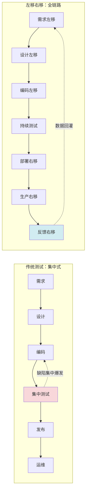
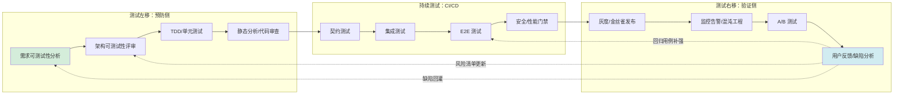

# 测试左移与测试右移

## 一、核心概念

### 1.1 什么是测试左移与测试右移

测试左移（Shift-Left Testing）与测试右移（Shift-Right Testing）是相对于传统"开发完成后集中测试"的瀑布式模型而言的两种质量策略：

- **测试左移**：把测试活动尽可能前移到需求、设计、编码阶段，强调"缺陷在成本最低的环节被发现"，本质是**预防优于检测**。
- **测试右移**：把验证活动延伸到部署、生产、反馈阶段，强调"生产环境是真实质量的最终裁判"，本质是**用真实数据持续校准**。

二者并非互斥，而是构成完整的全生命周期质量闭环：左移保证"交付前质量"，右移保证"交付后质量"，中间通过持续反馈闭环相互驱动。

### 1.2 为什么需要左移与右移

传统测试模型面临三类痛点，左移右移分别给出了回应：

| 痛点 | 传统测试表现 | 左移/右移应对 |
| --- | --- | --- |
| 缺陷修复成本爆炸 | 需求缺陷到生产才暴露，修复成本是编码阶段的 10-100 倍 | 左移在需求阶段做可测试性分析，把缺陷消灭在描述阶段 |
| 线上质量与测试环境脱节 | 测试环境无法复现生产复杂度，"测试通过"不等于"用户满意" | 右移通过灰度、监控、混沌工程在生产侧持续验证 |
| 反馈周期长、改进滞后 | 缺陷数据要等迭代结束才回灌，组织学习慢 | 左右移联动形成持续反馈闭环，缺陷数据实时驱动测试改进 |

### 1.3 与传统测试的对比



传统测试把质量责任集中在测试阶段，左移右移则把质量责任**分布到价值流的每个环节**，由全员共担。

## 二、测试左移

测试左移按价值流划分为三个关键阶段：需求、设计、编码。每个阶段都有可落地的工程实践。

### 2.1 需求阶段左移

需求阶段的左移目标是"在写下第一行代码前，明确什么是正确的、可被验证的"。

- **可测试性分析**：在故事评审时即评估"这个需求是否可测试"，识别隐含的非功能要求（性能、兼容性、安全）。
- **INVEST 原则**：用 Independent、Negotiable、Valuable、Estimable、Small、Testable 六个维度评估故事质量，"Testable"是硬门槛。
- **DoR/DoD**：定义就绪标准（Definition of Ready）与完成标准（Definition of Done）。DoD 必须包含"自动化测试通过""可测试性已覆盖"等条款。

BDD 的 Gherkin 是把需求转成可测试规格的典型工具：

```gherkin
# 背景：购物车折扣计算
Feature: 会员折扣
  作为注册会员
  我希望下单时按等级享受折扣
  以便我获得与等级匹配的优惠

  # 场景：黄金会员满 200 减 30
  Scenario: 黄金会员满额折扣
    # 前置条件
    Given 会员等级为 "黄金"
    And 购物车小计为 250 元
    # 触发动作
    When 系统计算订单优惠
    # 预期结果
    Then 应收金额为 220 元
    And 折扣明细包含 "满 200 减 30"
```

### 2.2 设计阶段左移

设计阶段决定系统的可测试性上限。一旦架构层面缺乏可观测点与可注入点，后续再多的测试都难以弥补。

- **架构可测试性评审**：评估服务边界是否清晰、依赖是否可替换、关键路径是否有埋点、是否有降级开关。
- **契约先行（Contract-First）**：前后端、微服务间先约定 OpenAPI / Protobuf 契约，再做消费者驱动的契约测试（CDC）。
- **TDD/BDD 实施约定**：约定哪些层用 TDD（领域逻辑），哪些层用 BDD（业务流程），避免"为测试而测试"。

### 2.3 编码阶段左移

编码阶段是左移的主战场，目标是"缺陷在 IDE 内即被发现，而不是流到 CI"。

- **单元测试与 TDD**：红-绿-重构循环，强制把"可测试"作为代码设计目标，耦合度高的代码天然难以测试。
- **代码审查**：在 PR 内即由同行与机器人审查可测试性、边界条件、Mock 滥用。
- **静态分析前置**：把 SAST、依赖扫描、复杂度检查作为 IDE 插件或提交钩子，而不是等 CI 阶段才暴露。

```yaml
# 提交钩子示例：本地预提交检查
# .pre-commit-config.yaml
repos:
  - repo: https://github.com/pre-commit/pre-commit-hooks
    rev: v4.6.0
    hooks:
      - id: trailing-whitespace      # 去除行尾空白
      - id: end-of-file-fixer        # 文件末尾换行
  - repo: https://github.com/golangci/golangci-lint
    rev: v1.60.0
    hooks:
      - id: golangci-lint            # 静态检查
        args: [--new-from-rev=HEAD]
  - repo: local
    hooks:
      - id: unit-test
        name: 单元测试快速子集
        entry: go test -short ./...
        language: system
        pass_filenames: false
```

## 三、测试右移

测试右移同样按价值流分为三个阶段：部署、生产、反馈。它把生产环境视为"持续的质量数据源"，而非"测试结束的终点"。

### 3.1 部署阶段右移

部署阶段右移的目标是"用最小爆炸半径验证变更"。

- **灰度发布**：按用户标签、地域、流量百分比逐步放量，每一步都设置质量门禁。
- **金丝雀发布（Canary）**：把少量真实流量导向新版本，对比关键指标（错误率、延迟、转化率），异常即自动回滚。
- **蓝绿部署**：维护两套对称环境，切换即生效，回滚即切回，规避"上线即不可逆"的风险。

### 3.2 生产阶段右移

生产阶段右移关注"系统在真实负载与真实用户下表现如何"。

- **监控告警**：APM、日志聚合、指标系统三位一体，覆盖业务指标与技术指标。
- **混沌工程**：主动注入故障（杀 Pod、断网、CPU 打满、依赖延迟），验证系统韧性与可观测性是否如设计预期。
- **A/B 测试**：把功能差异作为假设，用真实用户分流验证业务效果，避免"自以为是的优化"。

Prometheus 告警规则示例：

```yaml
# Prometheus 告警规则：支付接口错误率突增
groups:
  - name: payment-alerts
    rules:
      - alert: PaymentErrorRateHigh
        # 表达式：5 分钟内支付接口错误率 > 1%
        expr: |
          sum(rate(payment_requests_total{status="error"}[5m]))
          /
          sum(rate(payment_requests_total[5m]))
          > 0.01
        for: 3m                # 持续 3 分钟才告警，避免瞬时抖动
        labels:
          severity: critical
          team: payment
        annotations:
          summary: "支付接口错误率高于 1%"
          description: "实例 {{ $labels.instance }} 错误率 {{ $value | humanizePercentage }}"
```

### 3.3 反馈阶段右移

反馈阶段右移把生产侧数据回灌到研发侧，是右移闭环的关键一环。

- **用户反馈聚合**：客服工单、应用商店评分、NPS、社交舆情统一归集，自动聚类成缺陷候选。
- **生产缺陷分析**：每起线上事故做 5-Whys 与根因分析，识别"测试为什么没拦住"。
- **测试改进回灌**：把线上缺陷转化为回归用例、补强探索式测试场景、更新风险清单与质量门禁。

## 四、左移右移的协同

左移与右移不是两条独立轨道，而是通过**持续反馈闭环**耦合在一起，构成全生命周期质量保障。

### 4.1 全生命周期质量保障



### 4.2 持续反馈闭环

闭环的关键在于"数据要回流，且要有 owner 跟进"：

- **线上缺陷 → 左移改进**：每起线上缺陷都问"如果需求/设计/编码阶段多做什么，能避免它逃逸？"
- **生产指标 → 测试门禁**：把生产侧观察到的常见失败模式（缓存击穿、依赖超时）固化进 CI 的非功能测试。
- **用户行为 → 测试场景**：用真实用户路径反推测试用例的覆盖盲区，特别是边缘设备、弱网、低频功能。

没有回灌的右移只是"看监控"，闭环的右移才是"用生产驱动研发"。

## 五、DevSecOps：安全左移右移

安全是测试左右移中专业性最强、最容易被忽视的一环。DevSecOps 的核心是"安全不是安全团队的事，而是嵌入到 DevOps 流水线中"。

### 5.1 安全左移

- **威胁建模（Threat Modeling）**：在设计阶段用 STRIDE 等模型识别威胁，比上线后补救成本低一个数量级。
- **SAST（静态应用安全测试）**：扫描源代码漏洞，如 SQL 注入、XSS、硬编码密钥，前置到 IDE 与 PR 检查。
- **SCA（软件成分分析）**：扫描第三方依赖的已知 CVE，把依赖升级作为常规维护项。

### 5.2 安全右移

- **DAST（动态应用安全测试）**：对运行中的应用做黑盒扫描，发现 SAST 难以察觉的运行时问题。
- **IAST（交互式应用安全测试）**：在测试阶段通过 Agent 插桩，结合代码与流量，准确率高、误报少。
- **RASP（运行时应用自保护）**：在生产环境内嵌防护，攻击发生时即时阻断，是右移的最后一道防线。

安全左右移的关键是**按风险分层**：高危漏洞（如远程代码执行）必须在 CI 阻断，中低危可在生产侧持续监控，避免"一刀切"导致流水线瘫痪。

## 六、2024-2026 新趋势

### 6.1 Feature Flags 与测试右移

Feature Flags（功能开关）正在重塑测试右移的形态：

- **解耦部署与发布**：代码先部署到生产，功能通过开关按需开启，把"上线"从一次性事件变成可灰度、可回滚的连续过程。
- **定向测试**：先对内部员工或 1% 用户开启开关，等同于"生产环境的金丝雀测试"，无需额外环境。
- **杀死开关**：发现严重问题时秒级关闭功能，无需回滚代码，极大压缩 MTTR。

功能开关配置示例（分阶段放量，Unleash / LaunchDarkly / OpenFeature 生态均支持类似能力）：

```yaml
# 功能开关配置（示意）：分阶段放量
feature_flags:
  new_checkout_flow:
    description: 新版结算流程灰度
    enabled: true
    variants:
      - name: control        # 对照组：旧版
        value: false
        weight: 90
      - name: treatment      # 实验组：新版
        value: true
        weight: 10
    targeting_rules:
      - rule: 内部员工优先
        conditions:
          - field: user.email
            operator: ends_with
            value: "@company.com"
        variant: treatment
      - rule: 灰度用户
        conditions:
          - field: user.cohort
            operator: in
            value: [beta, early_access]
        variant: treatment
    # 质量门禁：错误率 > 0.5% 自动关闭
    auto_kill:
      metric: checkout_error_rate
      threshold: 0.005
      window: 5m
      action: disable
```

### 6.2 AI 辅助生产监控与缺陷预测

2024-2026 年间，LLM 与时序异常检测的融合让"AI 辅助监控"从噱头走向实用：

- **告警归因**：LLM 结合拓扑图与历史变更，自动给出"哪次发布导致哪个指标异常"的初步判断，缩短故障定位时间。
- **缺陷预测**：基于代码变更频次、复杂度、历史缺陷密度，预测下一迭代高风险模块，把测试资源前置投入。
- **日志智能聚类**：用 embedding 聚类海量日志，把"每天几万条 ERROR"压缩成"5 类根因"，让人能看懂。

需要注意：AI 在监控与预测上是**辅助而非替代**，必须有"人在回路"（Human-in-the-loop）复核，避免幻觉导致误判或漏判。

### 6.3 SRE 与测试右移融合

SRE（站点可靠性工程）与测试右移在目标上高度一致——"用工程化手段保障生产质量"，二者正在融合：

- **错误预算驱动测试策略**：SLO 与错误预算剩余量决定本迭代是否允许激进发布、是否需要补强混沌实验。
- **故障演练常态化**：把混沌工程从"特殊演练日"变成"每月例行注入"，与回归测试同等地位。
- **测试与 On-Call 共享用例**：测试用例描述"预期行为"，Runbook 描述"异常时怎么办"，二者共享同一份故障模型。

## 七、常见陷阱与最佳实践

### 7.1 常见陷阱

- **左移只移到编码**：把左移等同于"多写单元测试"，忽略需求与设计阶段的可测试性分析，缺陷仍会在源头逃逸。
- **右移变成"看监控"**：只部署监控不回灌数据，右移沦为被动观测，没有形成改进闭环。
- **自动化滥用**：把脆弱的 UI 自动化堆在金字塔顶层，形成"冰淇淋筒"，维护成本吞噬收益。
- **安全左右移一刀切**：所有漏洞都设为 CI 阻断，导致流水线频繁红，团队最终绕过安全检查。
- **Feature Flags 失控**：开关只增不删，代码里堆积大量死分支，技术债雪球式增长。

### 7.2 最佳实践

- **左移以"可测试性"为准绳**：每个阶段都问"这一步是否让下游更容易测试"，而不是"是否多写了测试"。
- **右移以"回灌"为闭环**：建立线上缺陷到测试改进的 owner 机制，没有回灌的右移不算闭环。
- **测试金字塔动态调整**：根据团队成熟度与服务边界变化，定期复盘各层比例，警惕冰淇淋筒反模式。
- **安全按风险分层**：高危阻断 CI，中低危监控生产，把"安全治理"做成可持续的常态化活动。
- **Feature Flags 生命周期管理**：每个开关设定到期日，到期自动告警，强制清理或转正。
- **左右移指标对齐**：用缺陷逃逸率、MTTR、错误预算消耗率等贯穿全链路的指标，避免左移与右移各自为政。

## 八、小结

测试左移与测试右移不是两套独立的实践清单，而是同一种质量哲学的两面：**把质量责任分布到价值流的全过程，用持续反馈闭环驱动改进**。左移把缺陷消灭在源头，右移用真实数据校准认知，中间靠 DevSecOps、Feature Flags、AI 辅助、SRE 融合等新趋势不断扩展边界。落地时切忌"机械搬运工具"，而应回到"可测试性、闭环反馈、风险分层"三条主线，结合团队实际持续演化。
