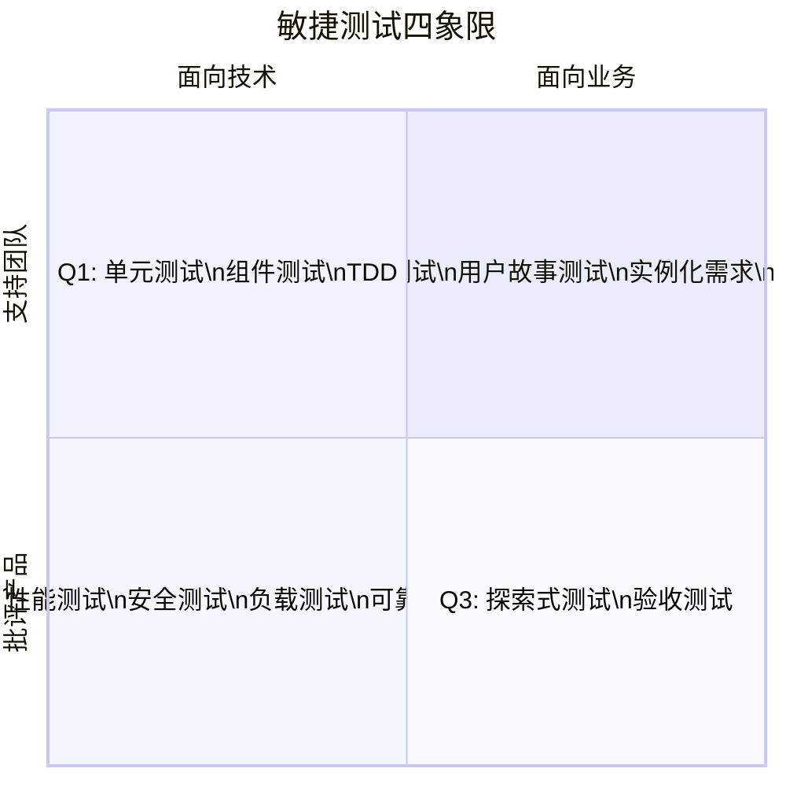
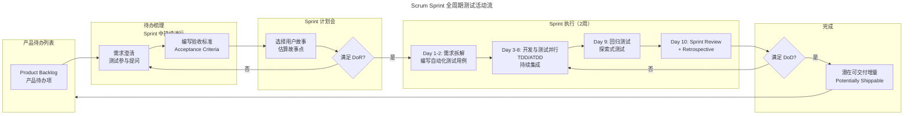
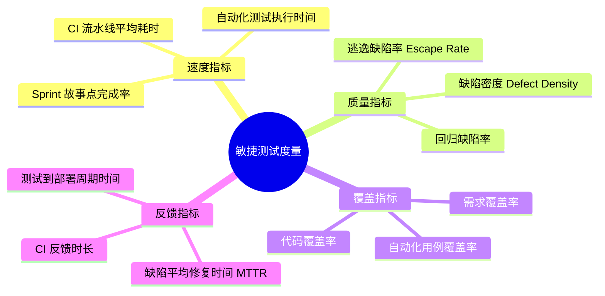

# 敏捷测试思维与 Sprint 流程

## 一、模块介绍

敏捷测试（Agile Testing）并非一种具体的测试技术，而是一种**与敏捷开发理念深度对齐的测试思维与实践体系**。在传统瀑布模型（Waterfall Model）中，测试作为独立阶段位于开发之后；而在敏捷体系中，测试活动贯穿整个迭代（Sprint），测试工程师的角色从"质量守门员"转变为"质量赋能者"（Quality Enabler）。

本文系统阐述敏捷测试的核心理念、Scrum 框架下 Sprint 各环节的测试活动、关键质量关卡（DoR/DoD）的设计，以及敏捷测试与传统测试在思维层面的本质差异。

## 二、核心方法论

### 2.1 敏捷测试四象限

Brian Marick 提出的测试四象限（Testing Quadrants）是敏捷测试的经典框架，按"面向技术 vs 面向业务"与"支持团队 vs 批评产品"两个维度划分四类测试：



四象限模型的核心价值在于：**它不是测试执行的先后顺序，而是测试策略的覆盖视图**。Q1（技术支持）与 Q2（业务支持）在 Sprint 内并行执行，Q3（业务批评）与 Q4（技术批评）在 Sprint 末尾或迭代间执行。

### 2.2 敏捷测试思维转变

| 维度 | 传统测试思维 | 敏捷测试思维 |
| --- | --- | --- |
| 质量责任 | 测试团队负责质量 | **全员质量责任**（Whole Team Responsibility） |
| 测试时机 | 开发完成后测试 | 测试前移至需求分析阶段 |
| 文档 | 详尽的测试计划与用例文档 | 轻量级检查表（Checklist）+ 活文档 |
| 反馈周期 | 周级/月级 | 分钟级/小时级 |
| 缺陷发现 | 事后验证找 Bug | 持续集成预防 Bug |
| 测试对象 | 完整系统 | 增量功能 + 回归 |

### 2.3 Whole Team 与 T-shaped 技能

敏捷团队强调"Whole Team"（全功能团队）理念，测试工程师需要具备 **T 型技能结构**（T-shaped Skills）：横向具备需求分析、开发协作、DevOps 基础等广度知识，纵向在测试自动化、性能测试等某一领域有深度专长。

## 三、关键流程

### 3.1 Scrum Sprint 中的测试活动全景



上述流程展示了测试活动如何嵌入 Sprint 的每个环节。测试并非 Sprint 末尾的独立阶段，而是从待办梳理（Backlog Refinement）就开始参与，直到满足完成定义（Definition of Done, DoD）才结束。

### 3.2 DoR 与 DoD 设计

**DoR（Definition of Ready，就绪定义）** 是用户故事进入 Sprint 前必须满足的条件，典型条目包括：

- 用户故事遵循 INVEST 原则（Independent、Negotiable、Valuable、Estimable、Small、Testable）
- 验收标准（Acceptance Criteria）已编写且团队已评审
- 依赖项已识别并解决
- UI/UX 设计稿已提供（如适用）

**DoD（Definition of Done，完成定义）** 是用户故事标记为"完成"的统一标准，典型条目包括：

- 所有验收标准通过验证
- 单元测试覆盖率达标（如 ≥80%）
- 代码已通过 Code Review
- 自动化测试用例已编写并纳入 CI 流水线
- 无严重（Critical/Blocker）缺陷遗留
- 文档已更新（API 文档、部署说明等）

### 3.3 Sprint 内测试并行策略

传统"开发→测试"串行模式在敏捷中行不通。采用**测试与开发并行策略**：

| Sprint 阶段 | 开发活动 | 测试活动 |
| --- | --- | --- |
| Day 1-2 | 技术方案设计 | 拆解验收标准，编写自动化测试脚本骨架 |
| Day 3-6 | 实现功能代码（TDD） | 逐条验证自动化测试，补充边界用例 |
| Day 7-8 | Bug 修复 + 重构 | 探索式测试（Exploratory Testing） |
| Day 9 | 准备演示 | 回归测试 + 性能冒烟 |
| Day 10 | Sprint Review | 参与回顾，提出改进项 |

## 四、工具与实践

### 4.1 持续集成中的测试门禁

敏捷测试依赖 CI（Continuous Integration）流水线实现分钟级反馈。以下是一个典型的 GitHub Actions 测试门禁配置：

```yaml
name: CI Test Gate
on:
  pull_request:
    branches: [main, develop]

jobs:
  test-gate:
    runs-on: ubuntu-latest
    steps:
      - uses: actions/checkout@v4
      - uses: actions/setup-python@v5
        with:
          python-version: '3.13'

      - name: 安装依赖
        run: pip install -r requirements.txt pytest pytest-cov ruff

      - name: 静态检查（Linter）
        run: ruff check src/

      - name: 单元测试 + 覆盖率门禁
        run: |
          pytest tests/unit/ --cov=src --cov-fail-under=80 \
            --cov-report=xml --junitxml=report.xml

      - name: 集成测试
        run: pytest tests/integration/ -m integration

      - name: 上传覆盖率到 SonarQube
        uses: SonarSource/sonarqube-scan-action@v2
        env:
          SONAR_TOKEN: ${{ secrets.SONAR_TOKEN }}
```

该配置实现了三道门禁：静态检查、单元测试覆盖率（≥80%）、集成测试全通过。只有全部通过才允许合并 PR。

### 4.2 用户故事与验收标准实践

优秀的验收标准应遵循 **Given-When-Then** 结构，既可被业务方理解，又可直接被 BDD 工具（如 Cucumber）执行：

```gherkin
Feature: 购物车优惠券应用

  Scenario: 满减券在达到门槛时自动应用
    Given 用户购物车中有 3 件商品，总价为 280 元
    And 用户有一张"满 300 减 50"的满减券
    When 用户添加第 4 件商品，价格为 50 元
    Then 购物车总价应为 330 元
    And 优惠券自动应用
    And 最终应付金额为 280 元
```

### 4.3 敏捷测试度量指标



度量指标体系帮助团队量化敏捷测试效果，但需警惕"古德哈特定律"（Goodhart's Law）——当指标成为目标时，它就不再是好指标。指标应用于发现改进点，而非考核工具。

## 五、常见误区

### 5.1 "敏捷不需要测试计划"

**误区**：认为敏捷"响应变化高于遵循计划"就不需要任何计划。

**纠正**：敏捷仍需要测试计划，只是从"重量级文档"变为"轻量级策略"。测试策略（Test Strategy）文档应在项目级定义，描述自动化分层策略、环境管理、数据策略等长期方针；Sprint 级别用检查表替代详尽的测试用例文档。

### 5.2 "自动化测试覆盖一切"

**误区**：追求 100% 自动化，取消所有手工测试。

**纠正**：自动化测试擅长回归验证，但探索式测试（Exploratory Testing）依赖人的直觉与创造力，无法被自动化替代。健康的比例通常是 70% 自动化 + 30% 探索式测试。

### 5.3 "DoD 是测试的事"

**误区**：DoD 仅由测试工程师定义和检查。

**纠正**：DoD 是**团队共识**，需由开发、测试、产品共同制定并遵守。将"代码已通过 Code Review"纳入 DoD 就是强调开发质量责任。

### 5.4 忽视技术债积累

**误区**：Sprint 节奏紧张时压缩测试时间，导致技术债（Technical Debt）不断累积。

**纠正**：在每个 Sprint 预留 10%-15% 的容量用于偿还技术债——重构测试代码、补充缺失用例、优化 CI 流水线。

## 六、进阶扩展与参考

### 6.1 与 DevOps/TestOps 的衔接

敏捷测试是 DevOps 体系的基础环节。成熟团队的演进路径为：**敏捷测试 → 持续交付 → DevOps → TestOps**。TestOps 强调测试活动本身的可观测性与自动化运营，包括测试资产版本管理、测试环境动态调度、测试结果数据分析等。

### 6.2 敏捷测试中的 AI 辅助

2025-2026 年趋势：LLM（Large Language Model）辅助生成用户故事的验收标准、自动从需求文档提取测试用例、基于代码变更智能推荐回归用例集。这些能力正在将测试工程师从重复劳动中解放，使其聚焦于高价值的探索式测试与策略设计。

### 6.3 推荐参考

- 图书：《Agile Testing: A Practical Guide for Testers and Agile Teams》Lisa Crispin & Janet Gregory
- 图书：《More Agile Testing: Learning Journeys for the Whole Team》Janet Gregory & Lisa Crispin
- 框架：Scrum Guide（scrumguides.org，2020 最新版）
- 实践：ISTQB Agile Tester Extension 认证大纲
