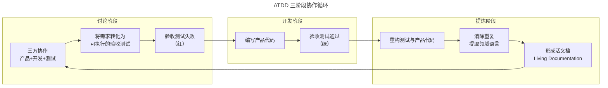
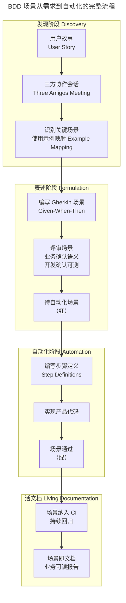

# ATDD-BDD 与实例化需求

## 一、模块介绍

**验收测试驱动开发**（Acceptance Test-Driven Development，ATDD）、**行为驱动开发**（Behavior-Driven Development，BDD）与**实例化需求**（Specification by Example，SBE）是三种紧密关联的敏捷实践。它们共享同一个核心理念：**用具体的、可执行的例子替代模糊的自然语言需求，让业务方、开发和测试三方对"做什么"达成一致**。

三者侧重点不同但高度互补：

| 实践 | 关注点 | 核心问题 |
| --- | --- | --- |
| ATDD | 流程与协作 | 如何让验收标准在编码前就明确？ |
| BDD | 表达与自动化 | 如何用业务可读的语言描述行为并自动验证？ |
| SBE | 需求与文档 | 如何用例子提炼领域知识并形成活文档？ |

## 二、核心方法论

### 2.1 ATDD 三阶段循环

ATDD 由 Kent Beck 与 Eric Lefever 提出，核心是一个"红-绿-重构"的变体循环：



ATDD 的关键不在于"先写测试"，而在于"讨论"阶段——在编写任何代码前，三方通过对话将模糊需求转化为具体的验收条件。这个讨论过程往往能暴露需求中的歧义与遗漏。

### 2.2 BDD 与 Gherkin 语法

BDD 由 Dan North 提出，是 ATDD 在表达层面的进化。BDD 使用结构化的 **Gherkin 语法**描述行为，强制使用"Given-When-Then"三段式：

- **Given（假设）**：描述初始上下文/前置条件
- **When（当）**：描述触发事件/动作
- **Then（那么）**：描述期望结果/断言

Gherkin 的核心价值是**消除自然语言歧义**，同时保持业务可读性。它既是需求文档，也是可执行的自动化测试脚本。

### 2.3 实例化需求（SBE）六步法

Gojko Adzic 在《Specification by Example》中总结了 SBE 的六个关键流程：

1. **从目标中推导规格**（Deriving scope from goals）——聚焦业务价值，而非功能清单
2. **制定协作规范**（Specifying collaboratively）——三方共同编写，而非一方交付
3. **用例子说明**（Illustrating using examples）——用具体数据替代抽象描述
4. **提炼规格**（Refining the specification）——去除冗余，提炼领域语言
5. **自动化验证**（Automating validation）——将例子转为可执行测试
6. **频繁验证**（Validating frequently）——纳入 CI 持续运行

## 三、关键流程

### 3.1 BDD 场景编写流程



### 3.2 Three Amigos 会议实践

Three Amigos（三个火枪手）会议是 BDD 的核心协作仪式，在 Sprint 计划或待办梳理阶段进行。参与者至少包含三个视角：

- **产品视角**（Product Owner/Business Analyst）：澄清业务意图与优先级
- **开发视角**（Developer）：评估技术可行性与实现方案
- **测试视角**（Tester）：识别边界条件与异常场景

会议产出物是**用例表格**（Example Mapping），格式如下：

```
用户故事: 会员登录
├── 规则: 密码错误 5 次锁定账户
│   ├── 例子: 第 5 次错误 → 账户锁定 30 分钟
│   └── 例子: 第 4 次错误 → 仍可重试
├── 规则: 支持手机验证码登录
│   ├── 例子: 有效手机号 + 正确验证码 → 登录成功
│   └── 例子: 验证码过期 → 提示重新获取
└── 问题: 第三方登录是否在本期范围？（→ 延后）
```

## 四、工具与实践

### 4.1 Cucumber 与 Gherkin 自动化

Cucumber 是 BDD 领域最主流的工具，支持 Java、Python、JavaScript、Ruby 等多语言。以下是一个完整的 Python Cucumber（behave）实践：

**Feature 文件（login.feature）**：

```gherkin
Feature: 会员登录
  作为会员
  我希望使用手机号和验证码登录
  以便安全访问我的账户

  # @smoke 标签用于 CI 中选择性执行
  @smoke
  Scenario: 手机验证码正常登录
    Given 注册手机号 "13800138000" 已存在
    And 已发送验证码 "123456" 到该手机号
    When 在登录页输入手机号 "13800138000" 和验证码 "123456"
    And 点击登录按钮
    Then 应跳转到首页 "/"
    And 页面应显示用户昵称

  @regression
  Scenario Outline: 验证码过期后登录失败
    Given 注册手机号 "<phone>" 已存在
    And 已发送验证码 "<code>" 到该手机号，但已过期
    When 在登录页输入手机号 "<phone>" 和验证码 "<code>"
    And 点击登录按钮
    Then 应提示 "验证码已过期，请重新获取"
    And 仍停留在登录页

    Examples:
      | phone       | code   |
      | 13800138001 | 111111 |
      | 13800138002 | 222222 |
      | 13900139000 | 333333 |
```

**步骤定义（steps/login_steps.py）**：

```python
from behave import given, when, then
import requests

BASE_URL = "http://localhost:8000/api"

@given('注册手机号 "{phone}" 已存在')
def step_register_phone(context, phone):
    context.phone = phone
    # 通过 API 注册或确认用户存在
    requests.post(f"{BASE_URL}/test/setup-user", json={"phone": phone})

@given('已发送验证码 "{code}" 到该手机号')
def step_send_code(context, code):
    # 注入验证码（测试环境 Mock 短信网关）
    requests.post(f"{BASE_URL}/test/inject-code",
                  json={"phone": context.phone, "code": code})

@given('已发送验证码 "{code}" 到该手机号，但已过期')
def step_send_expired_code(context, code):
    requests.post(f"{BASE_URL}/test/inject-code",
                  json={"phone": context.phone, "code": code, "expired": True})

@when('在登录页输入手机号 "{phone}" 和验证码 "{code}"')
def step_input_credentials(context, phone, code):
    context.response = requests.post(f"{BASE_URL}/auth/login",
                                     json={"phone": phone, "code": code})

@when('点击登录按钮')
def step_click_login(context):
    pass  # 上一步已包含提交

@then('应跳转到首页 "/"')
def step_verify_redirect(context):
    assert context.response.status_code == 200
    assert context.response.json()["redirect"] == "/"

@then('应提示 "{message}"')
def step_verify_message(context, message):
    resp = context.response.json()
    assert message in resp.get("message", ""), \
        f"期望提示 '{message}'，实际: {resp}"

@then('页面应显示用户昵称')
def step_verify_nickname(context):
    assert context.response.json().get("nickname")

@then('仍停留在登录页')
def step_verify_login_page(context):
    assert context.response.json().get("redirect") is None
```

### 4.2 Serenity BDD 报告

Serenity BDD 是 Java 生态中 BDD 报告的标杆工具，能将 Cucumber 场景执行结果转化为业务可读的需求覆盖报告：

```xml
<!-- pom.xml 依赖 -->
<dependency>
    <groupId>net.serenity-bdd</groupId>
    <artifactId>serenity-cucumber</artifactId>
    <version>4.3.4</version>
    <scope>test</scope>
</dependency>
```

Serenity 报告的核心价值是**将测试结果映射回业务需求**，产品经理看到的是"用户故事覆盖率"而非"测试用例通过率"。

### 4.3 活文档生成

活文档（Living Documentation）是 SBE 的终极产出物——它是自动生成的、永远与代码同步的、业务可读的需求文档。工具链推荐：

| 工具 | 语言生态 | 特点 |
| --- | --- | --- |
| Cucumber Reports | 多语言 | 基础 HTML 报告 |
| Serenity BDD | Java/Kotlin | 需求覆盖 + 截图 + 时序 |
| Allure BDD 适配 | 多语言 | 支持 BDD 场景展示 |
| Relish | Ruby/JS | 在线协作式活文档 |

## 五、常见误区

### 5.1 "BDD 就是自动化测试工具"

**误区**：团队引入 Cucumber 后直接从编写 Feature 文件开始，跳过协作讨论。

**纠正**：BDD 的核心价值在"发现"（Discovery）和"表述"（Formulation）阶段，而非"自动化"（Automation）阶段。如果没有 Three Amigos 协作，Gherkin 只是另一种形式的测试脚本，丧失了业务沟通价值。

### 5.2 Gherkin 过度技术化

**误区**：Feature 文件中出现 `点击 id="login-btn" 的元素`、`发送 POST /api/login 请求` 等技术细节。

**纠正**：Gherkin 应描述**业务行为**而非**技术实现**。正确写法是 `点击登录按钮`。步骤定义层负责将业务语言映射到技术操作，这是 BDD 的"翻译层"职责。

### 5.3 场景数量爆炸

**误区**：为每个边界条件编写独立场景，导致 Feature 文件臃肿难以维护。

**纠正**：使用 `Scenario Outline` + `Examples` 表格合并同类场景。核心业务路径用独立场景详写，边界条件用数据表批量覆盖。

### 5.4 将验收测试等同单元测试

**误区**：用 ATDD/BDD 替代单元测试。

**纠正**：ATDD/BDD 验收测试是**黑盒级别**的外部行为验证，位于测试金字塔的顶层；单元测试是**白盒级别**的内部结构验证，位于测试金字塔的底层。两者互补而非替代。

## 六、进阶扩展与参考

### 6.1 与契约测试的关系

在微服务架构中，BDD 场景可转化为**消费者驱动的契约测试**（Consumer-Driven Contract Testing）。Pact 框架支持在消费者端测试运行时生成契约文件，在提供者端验证。这使得 BDD 不仅验证业务行为，还验证服务间契约一致性。

### 6.2 AI 辅助 BDD 场景生成

2025-2026 年趋势：LLM 可从用户故事自动生成候选场景与边界用例。例如输入 `作为会员，我希望用手机号登录`，AI 输出包含正常路径、验证码过期、账户锁定、频率限制等场景草案。但 AI 生成的场景必须经 Three Amigos 评审后才能采纳——AI 能扩展思路，但业务意图的最终裁定权在人。

### 6.3 推荐参考

- 图书：《Specification by Example》Gojko Adzic
- 图书：《BDD in Action》John Ferguson Smart
- 工具：Cucumber（cucumber.io）
- 工具：Serenity BDD（serenity-bdd.github.io）
- 实践：Example Mapping 工作坊（cucumber.io/blog/example-mapping）
