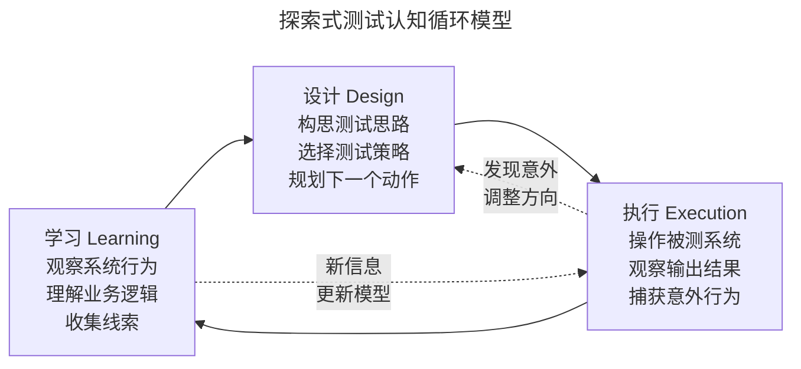
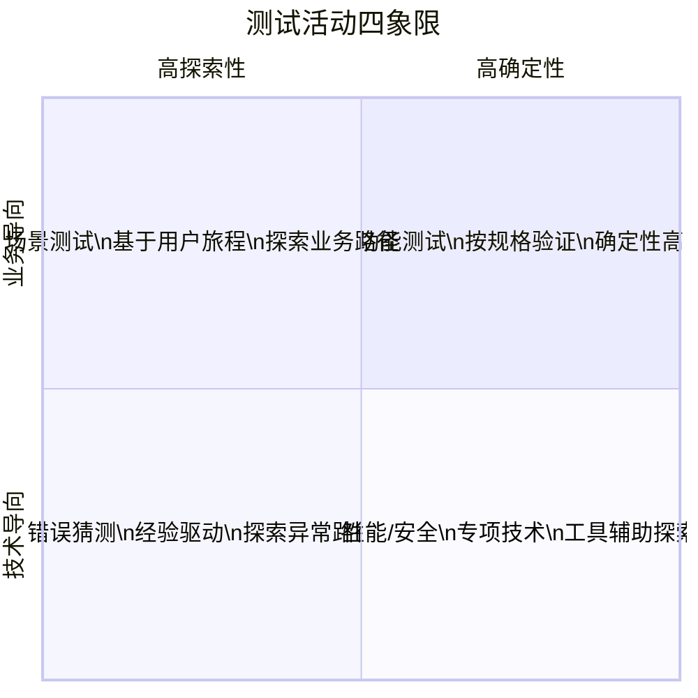
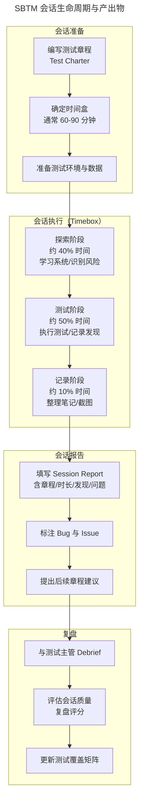

# 探索式测试（SBTM）

## 一、模块介绍

**探索式测试**（Exploratory Testing，ET）是一种将测试设计与测试执行融为一体的测试方法。测试工程师在执行测试的同时，持续学习被测系统、设计测试思路、调整测试方向。这与传统脚本测试（Scripted Testing）的"先设计后执行"模式形成鲜明对比。

**基于会话的测试管理**（Session-Based Test Management，SBTM）由 James Bach（Satisfice）提出，是对探索式测试的结构化管理框架。它保留了探索式测试的灵活性与创造性，同时通过"测试章程"（Test Charter）、"时间盒"（Timebox）和"会话报告"（Session Report）提供可度量、可审计的管理机制。

探索式测试的核心价值在于：**自动化测试只能验证已知的预期行为，而探索式测试发现未知的意外问题**。在敏捷与 CI/CD 体系中，探索式测试是自动化测试不可或缺的补充。

## 二、核心方法论

### 2.1 探索式测试的认知模型

James Bach 用 **"探索"（Exploration）= "学习"（Learning）+ "设计"（Design）+ "执行"（Execution）** 定义探索式测试。三者不是串行阶段，而是交织进行的认知循环：



这个循环的关键特征是**反馈驱动**：每一步执行的结果都会更新对系统的认知，进而影响下一步的设计。这种"边测边想"的能力是人类测试员区别于自动化脚本的核心优势。

### 2.2 探索式测试四象限

按照"确定性 vs 探索性"与"业务 vs 技术"两个维度，可将测试活动分为四类：



探索式测试主要分布在 Q2（场景测试）和 Q3（错误猜测），但并非排斥自动化——优秀的探索式测试员会使用自动化工具辅助（如 Quickcheck 生成随机数据、Fiddler 抓包分析请求），只是**测试的"大脑"是人而非脚本**。

### 2.3 启发式测试策略模型（HTSM）

James Bach 的 **启发式测试策略模型**（Heuristic Test Strategy Model，HTSM）是探索式测试的系统化思维框架：

| 层级 | 内容 | 示例 |
| --- | --- | --- |
| **产品元素** | 被测对象的结构、功能、数据、接口 | 结构：代码/配置/硬件；功能：用户操作/API/系统消息 |
| **质量标准** | 评估质量的多维标准 | 功能性/可靠性/性能/安全性/可维护性/兼容性 |
| **测试技术** | 生成测试的启发式方法 | 功能等价类/边界值/状态迁移/错误猜测/巡游测试 |
| **项目环境** | 约束测试的资源与条件 | 时间/预算/工具/团队技能/测试环境 |
| **感知到的质量** | 测试的最终产出 | 缺陷报告/风险评估/质量评估报告 |

HTSM 不是流程，而是**检查表**——测试员根据项目上下文从中选取合适的元素组合测试策略。

## 三、关键流程

### 3.1 SBTM 会话生命周期



### 3.2 测试章程编写

测试章程（Test Charter）是 SBTM 的核心制品，它是一段简短的、聚焦的测试任务描述。优秀的章程应包含三个要素：**目标**（探索什么）+ **范围**（涉及哪些功能）+ **策略**（用什么方法）。

章程模板：

```
【章程】探索 <功能/模块> 的 <质量属性>
通过 <测试策略/巡游方法>
来发现 <潜在风险类型>
```

章程示例：

```
【章程】探索"购物车优惠券叠加"功能的计算正确性
通过"复杂场景巡游 + 边界值挑战"
来发现"多券叠加时的金额计算错误"

环境：预发布环境，测试账号 sku-test-001
时间盒：90 分钟
```

### 3.3 会话报告与复盘评分

会话报告（Session Report）记录会话的实际执行情况，关键字段包括：

| 字段 | 说明 | 示例 |
| --- | --- | --- |
| 章程 | 关联的测试章程 | 探索购物车优惠券叠加 |
| 时长 | 实际耗时（分钟） | 85 / 90 |
| 执行 | 测试执行占比 | 65%（约 55 分钟） |
| Bug 调查 | 缺陷调查占比 | 20%（约 17 分钟） |
| 设置 | 环境准备占比 | 15%（约 13 分钟） |
| 发现 | 发现的 Bug 数 | 3 个（1 高 / 2 低） |
| 问题 | 待澄清的疑问 | 2 个 |
| 覆盖 | 覆盖的功能点 | 5 个 Charter Point |

**复盘评分**是复盘会话质量的常用手段，团队可自定义评分维度，例如：

- **P**reparation（准备充分度）
- **R**esult（结果价值）
- **O**rchestration（过程协调）
- **S**kill（技能发挥）
- **T**horoughness（彻底程度）

每项 1-5 分，总分 25 分，低于 15 分的会话需分析原因。

## 四、工具与实践

### 4.1 探索式测试巡游方法

James Whittaker 在《探索式软件测试》中系统化了多种"巡游"（Tour）方法，将探索式测试从随机行为转化为有策略的指导：

| 巡游类型 | 方法 | 应用场景 |
| --- | --- | --- |
| **商业区巡游**（Business District Tour） | 按最常用的业务路径逐条测试 | 验证核心功能稳定性 |
| **历史区巡游**（Historic District Tour） | 测试遗留功能、老旧代码区域 | 回归探索 |
| **旅游区巡游**（Tourist District Tour） | 以新手视角测试最显眼的功能 | 易用性与新手体验 |
| **娱乐区巡游**（Entertainment District Tour） | 测试辅助功能、彩蛋功能 | 覆盖度补充 |
| **酒店区巡游**（Hotel District Tour） | 测试不常触发但必须正确的功能 | 安全与容错 |
| **危险区巡游**（Seedy District Tour） | 攻击系统最脆弱的环节 | 错误处理与边界 |

### 4.2 错误猜测启发式清单

基于经验的错误猜测是探索式测试的核心技能。Boris Beizer 的**错误分类法**提供了系统化的猜测框架：

```python
# 探索式测试错误猜测检查表（Python 伪代码展示结构）

ERROR_CHECKLIST = {
    "数据异常": [
        "空值/None/Null",
        "超长字符串（>字段长度限制）",
        "特殊字符（SQL/HTML/路径分隔符）",
        "负数/零值/最大值溢出",
        "时区边界（跨日/跨月/跨年）",
    ],
    "状态异常": [
        "未初始化状态操作",
        "已关闭会话再次操作",
        "并发同一资源操作",
        "状态机非法迁移",
    ],
    "交互异常": [
        "操作中途网络中断",
        "操作中途刷新/后退",
        "多标签页同时操作",
        "与浏览器自动填充冲突",
    ],
    "环境异常": [
        "磁盘空间不足",
        "权限被拒绝",
        "依赖服务超时",
        "时钟不同步",
    ],
}
```

### 4.3 探索式测试记录工具

| 工具 | 类型 | 特点 |
| --- | --- | --- |
| **Session Tester** | 开源 | 时间盒 + 笔记 + 截图集成 |
| **Rapid Reporter** | 开源 | 轻量级会话记录，截图自动归档 |
| **TestRail** | 商业 | 支持探索式测试会话管理模块 |
| **Obsidian + 模板** | 通用 | 灵活的 Markdown 知识库 |
| **CHARIWISE** | 商业 | AI 辅助章程生成与会话分析 |

## 五、常见误区

### 5.1 "探索式测试就是随意测试"

**误区**：将探索式测试等同于"无计划的随机点击"。

**纠正**：探索式测试是**有目的、有策略、有记录**的结构化探索。SBTM 通过测试章程聚焦目标，通过 HTSM 框架选择策略，通过会话报告保证可追溯。其纪律性不亚于脚本测试，只是灵活度更高。

### 5.2 "探索式测试不可度量"

**误区**：认为探索式测试缺乏量化指标，无法评估工作量与效果。

**纠正**：SBTM 通过会话报告提供丰富度量维度：会话数、Charter Point 覆盖率、Bug 发现率、会话复盘评分等。这些指标既能度量投入，也能评估产出。

### 5.3 "自动化 vs 探索式"二选一

**误区**：团队争论"该投入自动化还是探索式测试"。

**纠正**：两者是**互补**关系。自动化测试覆盖已知的回归路径（占 60-70%），释放时间让测试员专注探索式测试（占 30-40%）。测试金字塔的顶层就应由探索式测试占据。

### 5.4 探索式测试无文档

**误区**：探索式测试不产出文档，无法通过审计。

**纠正**：SBTM 的会话报告本身就是测试证据。配合屏幕录制、截图归档、Bug 报告，探索式测试的文档化程度可以达到任何审计标准。活文档理念也可应用于探索式测试——将会话发现提炼为知识库。

## 六、进阶扩展与参考

### 6.1 与变异测试的结合

变异测试（Mutation Testing）自动注入代码缺陷验证测试用例有效性，探索式测试发现真实缺陷。将两者结合：用变异测试评估自动化测试套件强度，用探索式测试覆盖自动化测试的盲区，形成"机器验证已知 + 人类探索未知"的协同。

### 6.2 AI 辅助探索式测试

2025-2026 年趋势：AI 驱动的自主测试代理（Autonomous Testing Agent）开始辅助探索式测试。例如 GitHub Copilot 等 AI 编码助手能基于代码变更生成测试建议清单，AI 还能分析会话报告识别"探索盲区"。但 AI 目前仍无法替代人类测试员的领域直觉与创造性推理——它更多是"副驾驶"角色。

### 6.3 推荐参考

- 图书：《Exploratory Software Testing》James A. Whittaker
- 图书：《Lessons Learned in Software Testing》Cem Kaner, James Bach, Bret Pettichord
- 文章：James Bach 的《Exploratory Testing Explained》
- 工具：satisfice.com（James Bach 的 SBTM 资源站）
- 实践： Weekend Testing 工作坊（community-driven 探索式测试练习）
