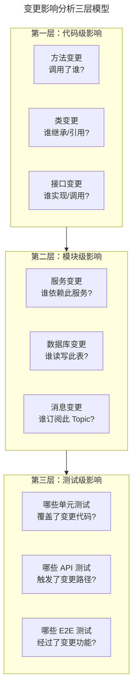
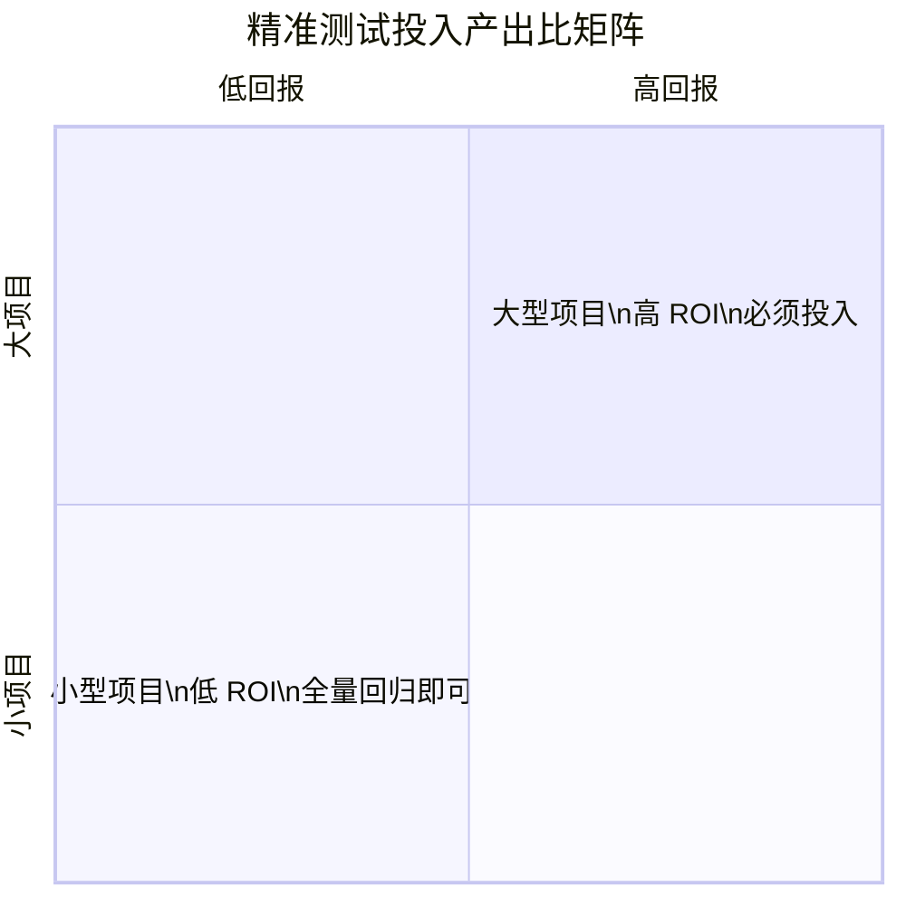
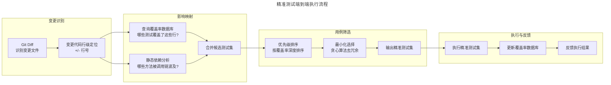
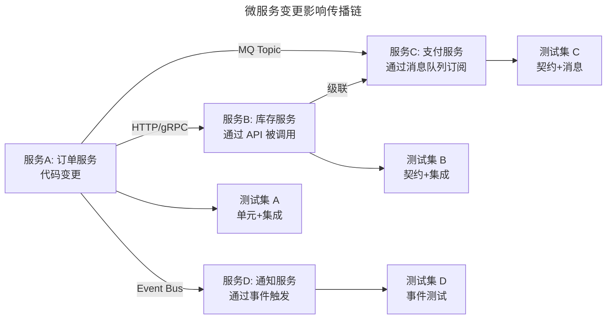

# 精准测试与变更影响分析

## 一、模块介绍

**精准测试**（Precision Testing）是一种基于代码变更影响范围的测试策略——只测"受影响的代码"而非"全部代码"。在大型项目中，全量回归测试动辄数小时甚至数天，而其中 80% 的用例可能与本次变更无关。精准测试通过**变更影响分析**（Change Impact Analysis，CIA）精准定位需要回归的测试范围，将回归时间从小时级压缩到分钟级。

精准测试是 CI/CD 体系下"快速反馈"理念的关键支撑：每次代码提交只运行相关测试，让开发者在 5-10 分钟内得到反馈，而非等待全量测试完成。本文系统阐述变更影响分析的原理、精准测试的实现路径、以及主流工具的实践。

## 二、核心方法论

### 2.1 变更影响分析的三层模型

变更影响分析从三个层次评估代码变更的波及范围：



### 2.2 代码到测试的映射方法

精准测试的核心是建立"代码 ↔ 测试"的双向映射。三种主流映射方法：

| 方法 | 原理 | 精度 | 实现复杂度 |
| --- | --- | --- | --- |
| **静态依赖分析** | 解析 AST/字节码，构建调用图 | 中（无法覆盖反射/动态调用） | 中 |
| **动态覆盖率映射** | 运行测试时收集代码覆盖率，建立"测试→覆盖代码行"映射 | 高（反映实际执行路径） | 低（需覆盖率工具） |
| **运行时追踪** | 通过 APM/追踪系统记录"请求→代码路径" | 极高（真实生产路径） | 高 |

### 2.3 精准测试的 ROI 模型



精准测试的投入产出比与项目规模正相关：小项目全量回归只需几分钟，精准测试的建设成本高于收益；大项目全量回归数小时，精准测试能节省 80%+ 的回归时间。微型项目直接全量即可，中型项目可按变更集中度选择性投入，介于两端之间。

## 三、关键流程

### 3.1 精准测试执行流程



### 3.2 覆盖率数据库构建

精准测试的基础设施是**覆盖率数据库**——记录每个测试用例覆盖了哪些代码行。构建流程：

1. **首次全量运行**：执行全部测试用例，每个用例独立收集覆盖率
2. **存储映射**：将"测试ID → 覆盖的文件:行号集合"存入数据库
3. **增量更新**：新测试用例加入时，单独运行并更新映射
4. **定期校准**：代码重构后，重新全量运行校准映射

### 3.3 微服务环境的影响传播

在微服务架构中，一个服务的代码变更可能通过 API 调用影响下游服务。影响传播分析：



微服务精准测试需结合**契约测试**：消费者端的契约验证自动覆盖了提供者变更的影响传播。

## 四、工具与实践

### 4.1 JaCoCo 离线覆盖率分析

Java 生态使用 JaCoCo 收集覆盖率，配合精准测试工具构建映射：

```xml
<!-- pom.xml: JaCoCo 覆盖率收集 -->
<plugin>
    <groupId>org.jacoco</groupId>
    <artifactId>jacoco-maven-plugin</artifactId>
    <version>0.8.12</version>
    <executions>
        <execution>
            <id>prepare-agent</id>
            <goals>
                <goal>prepare-agent</goal>
            </goals>
        </execution>
        <execution>
            <id>report</id>
            <phase>test</phase>
            <goals>
                <goal>report</goal>
            </goals>
        </execution>
    </executions>
</plugin>
```

JaCoCo 报告输出的是整次运行的覆盖率；按用例粒度的映射需要在 CI 中逐用例（或逐测试类）运行并合并执行数据，形成 3.2 节所述的覆盖率数据库。

### 4.2 自研精准测试选择脚本

以下是一个基于 Git Diff + 覆盖率数据库的精准测试选择 Python 脚本（覆盖率数据库即 3.2 节构建的"测试ID → 覆盖的文件:行号"映射）：

```python
"""
精准测试用例选择器
输入：Git Diff + 覆盖率数据库（3.2 节构建的"测试ID → 覆盖的文件:行号"映射）
输出：需要执行的测试用例列表
"""
import json
import re
import subprocess
import sys
from collections import defaultdict

DIFF_RE = re.compile(r"^\+\+\+ b/(.+)$")
HUNK_RE = re.compile(r"^@@ -\d+(?:,\d+)? \+(\d+)(?:,(\d+))? @@")

def get_changed_lines():
    """获取 Git 变更的文件与行号"""
    diff = subprocess.check_output(
        ["git", "diff", "--unified=0", "origin/main...HEAD"],
        text=True
    )
    changed = defaultdict(set)
    current_file = None

    for line in diff.split("\n"):
        match = DIFF_RE.match(line)
        if match:
            current_file = match.group(1)
        elif current_file:
            hunk = HUNK_RE.match(line)
            if hunk:
                # 解析 @@ -old,count +new,count @@，记录新增区间的每一行
                start = int(hunk.group(1))
                count = int(hunk.group(2) or "1")
                changed[current_file].update(range(start, start + count))

    return changed

def load_coverage_data(db_path):
    """加载覆盖率数据库，构建测试→代码映射"""
    with open(db_path) as f:
        coverage_db = json.load(f)

    test_to_code = {
        test_id: {
            file_path: set(lines)
            for file_path, lines in files.items()
        }
        for test_id, files in coverage_db.items()
    }
    return test_to_code

def select_precision_tests(changed_lines, test_to_code):
    """选择覆盖了变更代码的测试用例"""
    selected = set()
    for test_id, files in test_to_code.items():
        for file_path, lines in files.items():
            if changed_lines.get(file_path, set()) & lines:
                selected.add(test_id)
                break
    return selected

def main():
    changed = get_changed_lines()
    if not changed:
        print("无代码变更，跳过测试")
        sys.exit(0)

    test_to_code = load_coverage_data("coverage-map.json")
    selected = select_precision_tests(changed, test_to_code)

    if not selected:
        print("变更代码未被任何测试覆盖，建议补充测试!")
        sys.exit(1)

    print(f"精准选择 {len(selected)} 个测试用例:")
    for test_id in sorted(selected):
        print(f"  {test_id}")

    # 输出给 pytest 执行
    with open("precision-tests.txt", "w") as f:
        for test_id in sorted(selected):
            f.write(test_id + "\n")

if __name__ == "__main__":
    main()
```

### 4.3 GitHub Actions 精准测试集成

```yaml
name: Precision Testing
on:
  pull_request:
    branches: [main]

jobs:
  precision-test:
    runs-on: ubuntu-latest
    steps:
      - uses: actions/checkout@v4
        with:
          fetch-depth: 0  # 需要完整历史以计算 diff

      - uses: actions/setup-python@v5
        with:
          python-version: '3.13'

      - name: 下载上次构建的覆盖率数据
        uses: actions/download-artifact@v4
        with:
          name: coverage-baseline
          path: .

      - name: 精准选择测试用例
        id: select
        run: |
          python scripts/precision_test_selector.py
          echo "count=$(wc -l < precision-tests.txt)" >> $GITHUB_OUTPUT

      - name: 执行精准测试
        if: steps.select.outputs.count != '0'
        run: |
          pytest $(cat precision-tests.txt | tr '\n' ' ') \
            --cov=src --cov-report=xml

      - name: 上传更新后的覆盖率数据
        uses: actions/upload-artifact@v4
        with:
          name: coverage-baseline
          path: coverage-map.json
```

### 4.4 主流精准测试工具对比

| 工具 | 语言生态 | 核心方法 | 特点 |
| --- | --- | --- | --- |
| **Diffblue Cover** | Java | AI 生成测试 | 自动补充测试覆盖 |
| **Test Impact Analysis (TIA)** | .NET | 运行时映射 | Visual Studio 内置 |
| **Gradle Test Selector** | Java/Gradle | 静态分析 | Gradle 插件 |
| **pytest-testmon** | Python | 覆盖率映射 | pytest 插件，轻量 |
| **Bazel Test Selection** | 多语言 | 依赖图 | 大型 monorepo |

## 五、常见误区

### 5.1 "精准测试就是跳过测试"

**误区**：将精准测试理解为"少跑测试省时间"，忽视覆盖率盲区。

**纠正**：精准测试是**智能选择**而非**随意跳过**。其前提是覆盖率数据库完整且准确。如果变更代码未被任何测试覆盖，精准测试应**告警**而非"不跑任何测试"。

### 5.2 覆盖率数据过时

**误区**：覆盖率数据库建好后长期不更新，代码已大幅重构而映射仍指向旧代码。

**纠正**：覆盖率数据需定期（每日或每周）全量校准。重大重构后应立即触发校准。

### 5.3 忽视反射与动态调用

**误区**：仅依赖静态依赖分析，遗漏反射调用、动态代理、依赖注入等运行时绑定。

**纠正**：静态分析应与动态覆盖率映射结合。动态映射能捕获反射调用的真实路径，弥补静态分析的盲区。

### 5.4 精准测试完全替代全量回归

**误区**：全面采用精准测试后取消所有全量回归。

**纠正**：精准测试用于 PR 级快速反馈，**全量回归仍应在每日夜间或发布前执行**。两者互补：精准测试追求速度，全量回归追求完备。

## 六、进阶扩展与参考

### 6.1 AI 驱动的测试选择

2025-2026 年趋势：LLM 能理解代码语义，实现比"行号映射"更智能的测试选择。例如，变更了一个方法的参数名（无行为变化），传统精准测试仍会选择相关测试，而 AI 能判断此变更无行为影响而跳过测试。

### 6.2 生产环境驱动的精准测试

利用生产环境的真实请求路径数据（通过 APM 追踪）反向驱动测试选择：只回归生产环境实际被调用的代码路径。这种"生产驱动测试"能进一步缩小回归范围，但需注意隐私与数据脱敏。

### 6.3 推荐参考

- 论文：《Test Selection for Regression Testing》
- 工具：pytest-testmon（github.com/tarpas/pytest-testmon）
- 工具：Diffblue Cover（diffblue.com）
- 实践：Google 的 Bazel Test Selection 文档
