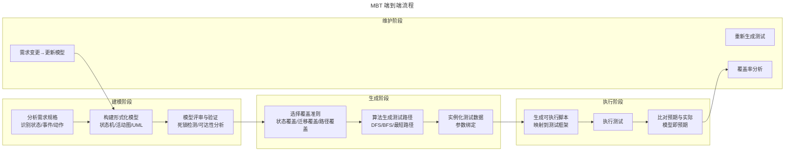
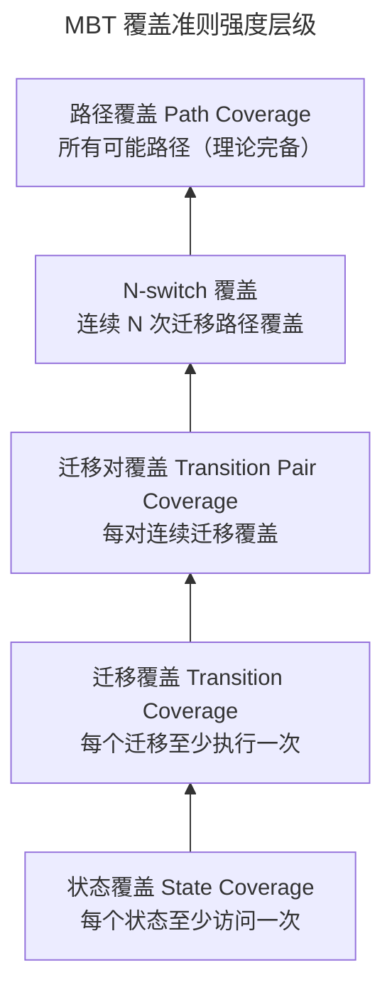
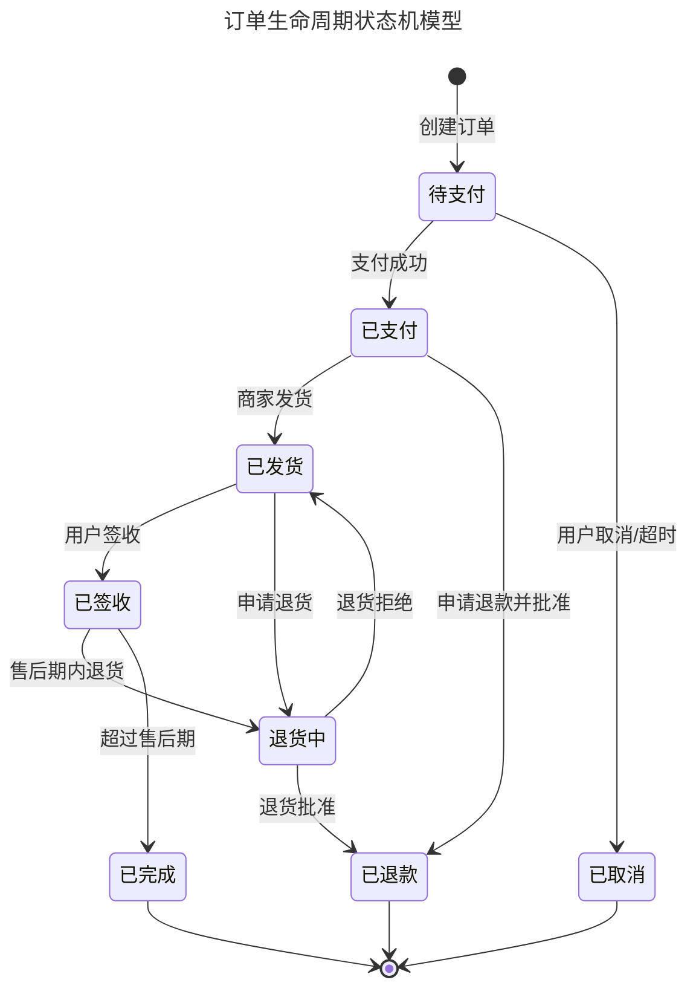

# 基于模型的测试（MBT）

## 一、模块介绍

**基于模型的测试**（Model-Based Testing，MBT）是一种从系统行为模型自动生成测试用例的测试方法。测试工程师不再逐条手写测试用例，而是构建一个描述系统行为的**形式化模型**（如状态机、活动图、决策表），由工具根据模型自动生成覆盖路径的测试用例。

MBT 的核心价值在于：**模型比测试用例更简洁、更可维护、更易发现遗漏**。一个拥有 10 个状态、20 个迁移的状态机，可能对应数百条测试路径，手写用例极易遗漏；而模型本身只有 30 个元素，清晰且可验证。MBT 在嵌入式系统、通信协议、安全关键系统（如航空航天、医疗设备）领域应用最成熟，近年逐步扩展到 Web 应用与微服务领域。

## 二、核心方法论

### 2.1 MBT 的核心流程



### 2.2 模型类型选择

| 模型类型 | 适用场景 | 优势 | 局限 |
| --- | --- | --- | --- |
| **有限状态机**（FSM） | 有明确状态流转的系统（订单、审批流） | 直观、可形式化验证 | 难以表达并发与数据 |
| **状态迁移图**（State Transition Diagram） | 协议测试、认证流程 | 标准化、工具支持好 | 状态爆炸问题 |
| **UML 活动图** | 业务流程、工作流 | 表达并行与分支 | 半形式化、需补充约束 |
| **决策表**（Decision Table） | 多条件组合的业务规则 | 覆盖完整、无遗漏 | 仅适合规则驱动场景 |
| **马尔可夫链**（Markov Chain） | 随机用户行为模拟 | 可统计可靠性 | 需概率数据 |

### 2.3 测试覆盖准则

MBT 的覆盖准则决定了从模型生成多少测试路径：



覆盖强度从弱到强：状态覆盖 < 迁移覆盖 < 迁移对覆盖 < N-switch 覆盖 < 路径覆盖。实际项目中通常选择迁移覆盖或迁移对覆盖作为基准，路径覆盖因路径爆炸一般不可行。

## 三、关键流程

### 3.1 状态机建模实战

以"订单生命周期"为例，构建状态机模型：



该状态机有 8 个状态、11 个迁移。迁移覆盖要求 11 个迁移全部至少执行一次，但由于部分迁移互斥（如"商家发货"与"退款批准"只能二选一），无法用单条路径完成，需按覆盖目标分段生成测试路径；迁移对覆盖需更多路径（验证所有连续迁移组合的合法性）。

### 3.2 从模型到测试用例

从状态机生成测试用例的算法逻辑：

```python
"""
基于状态机模型自动生成测试用例
覆盖准则：迁移覆盖（Transition Coverage）
"""
from collections import defaultdict

# 状态机定义（state, event, action, next_state）
TRANSITIONS = [
    ("待支付", "支付成功", "扣款", "已支付"),
    ("待支付", "用户取消", "释放库存", "已取消"),
    ("待支付", "超时", "释放库存", "已取消"),
    ("已支付", "商家发货", "创建物流单", "已发货"),
    ("已支付", "退款批准", "退款", "已退款"),
    ("已发货", "用户签收", "更新状态", "已签收"),
    ("已发货", "申请退货", "创建退货单", "退货中"),
    ("退货中", "退货批准", "退款", "已退款"),
    ("退货中", "退货拒绝", "恢复状态", "已发货"),
    ("已签收", "申请退货", "创建退货单", "退货中"),
    ("已签收", "超过售后期", "归档", "已完成"),
]

def generate_transition_coverage_tests(transitions, initial="待支付"):
    """生成迁移覆盖测试路径：多段生成，每段从初始状态出发（等价于复位前置）"""
    # 构建邻接表
    graph = defaultdict(list)
    for src, event, action, dst in transitions:
        graph[src].append((event, action, dst))

    all_trans = {(s, e, d) for s, e, _, d in transitions}
    covered, tests = set(), []

    # 部分迁移互斥，一条路径无法覆盖全部迁移，
    # 因此分段生成：每段优先走未覆盖迁移，段内不重复走同一迁移
    while covered < all_trans:
        state, path, walked = initial, [], set()
        while True:
            options = [
                t for t in graph[state]
                if (state, t[0], t[2]) not in walked
            ]
            if not options:
                break  # 无迁移可走，本段结束
            # 优先选择尚未覆盖的迁移
            options.sort(key=lambda t: (state, t[0], t[2]) in covered)
            event, action, dst = options[0]
            path.append((state, event, action, dst))
            walked.add((state, event, dst))
            state = dst

        newly = walked - covered
        if not newly:
            break  # 无新增覆盖：剩余迁移无法从初始状态经合法路径到达
        covered |= newly
        tests.append(path)

    return tests

tests = generate_transition_coverage_tests(TRANSITIONS)
print(f"生成 {len(tests)} 条测试路径")
for i, test in enumerate(tests[:3]):  # 展示前 3 条
    print(f"\n测试路径 {i+1}:")
    for state, event, action, next_state in test:
        print(f"  {state} --[{event}/{action}]--> {next_state}")
```

上述脚本对本例生成 5 条测试路径，合计覆盖全部 11 个迁移（运行输出"生成 5 条测试路径"，其中第 1 条为主线：待支付→已支付→已发货→已签收→退货中→已退款）。

### 3.3 模型验证与静态分析

在生成测试前，需对模型本身进行验证，确保模型无逻辑缺陷：

| 验证项 | 说明 | 工具 |
| --- | --- | --- |
| **死锁检测** | 是否存在不可达状态或死循环 | SPIN、NuSMV |
| **可达性分析** | 所有状态是否可达 | 模型检查器 |
| **完整性检查** | 是否有状态缺少必要迁移 | 静态分析 |
| **确定性检查** | 同一事件是否在不同状态有冲突迁移 | 状态机验证 |

## 四、工具与实践

### 4.1 Graphwalker 实战

Graphwalker 是开源的 MBT 工具，支持从状态机/活动图模型生成测试路径并驱动 Selenium/REST Assured 执行：

```json
// 订单模型（Graphwalker JSON 格式）
{
  "name": "OrderLifecycle",
  "models": [
    {
      "name": "Order",
      "generator": "random(edge_coverage(100))",
      "startElementId": "v0",
      "vertices": [
        {"id": "v0", "name": "待支付"},
        {"id": "v1", "name": "已支付"},
        {"id": "v2", "name": "已发货"},
        {"id": "v3", "name": "已签收"},
        {"id": "v4", "name": "已完成"}
      ],
      "edges": [
        {"id": "e0", "name": "创建订单", "sourceVertexId": "v0", "targetVertexId": "v0"},
        {"id": "e1", "name": "支付成功", "sourceVertexId": "v0", "targetVertexId": "v1"},
        {"id": "e2", "name": "商家发货", "sourceVertexId": "v1", "targetVertexId": "v2"},
        {"id": "e3", "name": "用户签收", "sourceVertexId": "v2", "targetVertexId": "v3"},
        {"id": "e4", "name": "超过售后期", "sourceVertexId": "v3", "targetVertexId": "v4"}
      ]
    }
  ]
}
```

```java
// Java 实现：Graphwalker + REST Assured 执行
import org.graphwalker.java.test.Result;
import org.graphwalker.java.test.TestExecutor;
import io.restassured.RestAssured;
import static io.restassured.RestAssured.*;
import static org.hamcrest.Matchers.*;

public class OrderTest implements OrderLifecycle {
    private String orderId;
    private String baseUrl = "http://localhost:8080/api";

    @Override
    public void 创建订单() {
        orderId = given()
            .contentType("application/json")
            .body("{\"userId\":\"u1\",\"items\":[{\"skuId\":\"s1\",\"qty\":1}]}")
            .when()
            .post(baseUrl + "/orders")
            .then()
            .statusCode(201)
            .extract().path("id");
    }

    @Override
    public void 支付成功() {
        given()
            .body("{\"method\":\"ALIPAY\"}")
            .when()
            .post(baseUrl + "/orders/" + orderId + "/pay")
            .then()
            .statusCode(200)
            .body("status", equalTo("PAID"));
    }

    @Override
    public void 商家发货() {
        given()
            .body("{\"carrier\":\"SF\",\"trackingNo\":\"SF123\"}")
            .when()
            .post(baseUrl + "/orders/" + orderId + "/ship")
            .then()
            .statusCode(200);
    }

    @Override
    public void 用户签收() {
        given()
            .when()
            .post(baseUrl + "/orders/" + orderId + "/receive")
            .then()
            .statusCode(200);
    }

    @Override
    public void 超过售后期() {
        given()
            .when()
            .post(baseUrl + "/orders/" + orderId + "/archive")
            .then()
            .statusCode(200);
    }
}
```

### 4.2 主流 MBT 工具对比

| 工具 | 模型类型 | 语言生态 | 特点 |
| --- | --- | --- | --- |
| **Graphwalker** | 状态机/JSON | Java/Python | 开源、轻量、CI 友好 |
| **Spec Explorer** | 状态机/契约 | .NET | 微软出品、Visual Studio 集成 |
| **Conformiq** | 状态机/UML | Java/多语言 | 商业、企业级、自动生成代码 |
| **ModelJUnit** | 状态机 | Java | 学术、JUnit 集成 |
| **PyModel** | 状态机 | Python | 学术、轻量 |

### 4.3 决策表建模实践

对于规则密集型业务（如保险费率计算、促销规则），决策表比状态机更合适：

```
| 条件 \ 规则 | R1 | R2 | R3 | R4 | R5 | R6 | R7 | R8 |
|-------------|----|----|----|----|----|----|----|----|
| 会员等级     | 普通| 普通| 普通| 普通| VIP | VIP | VIP | VIP |
| 订单金额>500 | N  | N  | Y  | Y  | N  | N  | Y  | Y  |
| 使用优惠券   | N  | Y  | N  | Y  | N  | Y  | N  | Y  |
|-------------|----|----|----|----|----|----|----|----|
| 折扣率       | 0% | 0% | 5% | 5% | 5% | 5% | 10%| 15%|
| 免运费       | N  | N  | Y  | Y  | Y  | Y  | Y  | Y  |
```

决策表的每列直接对应一条测试用例，天然保证组合完整性。

## 五、常见误区

### 5.1 "MBT 适用于所有项目"

**误区**：认为 MBT 是银弹，适用于所有测试场景。

**纠正**：MBT 适合**状态明确、规则清晰、路径组合复杂**的场景。对于 CRUD 为主的简单业务，MBT 的建模成本可能高于收益。评估标准：当测试用例数量超过 100 条且存在大量组合路径时，MBT 的 ROI 开始显现。

### 5.2 模型与需求脱节

**误区**：模型构建后不与需求方确认，模型本身就有错误。

**纠正**：模型是测试的"预期来源"，模型错误会导致所有测试无效。模型必须经需求方（产品/业务）评审确认。UML 状态机是较好的沟通媒介——业务方能看懂。

### 5.3 状态爆炸

**误区**：将所有变量纳入状态维度，导致状态数量指数级膨胀。

**纠正**：状态机只建模**关键业务状态**，不建模所有变量组合。数据差异用"扩展状态变量"（Extended State Variables）处理，而非独立状态节点。如订单有 8 个业务状态，不应将"金额>500"也作为状态维度。

### 5.4 忽视模型维护

**误区**：一次性建模后不再更新，模型与实际系统逐渐脱节。

**纠正**：模型是**活文档**，需随需求变更同步更新。CI 中应加入"模型验证"步骤：每次代码变更后检查模型是否仍覆盖实际状态迁移。

## 六、进阶扩展与参考

### 6.1 MBT 与 AI 的结合

2025-2026 年趋势：LLM 能从需求文档自动生成候选状态机模型，大幅降低建模门槛。AI 辅助建模的流程：需求文档 → LLM 提取状态/事件/迁移 → 人工评审修正 → 工具生成测试。但 AI 生成的模型必须经领域专家验证——AI 可能遗漏隐含的状态约束。

### 6.2 MBT 在微服务中的应用

微服务的 API 契约可建模为状态机：每个 API 端点是事件，服务端响应后的状态变化是迁移。基于此模型可自动生成契约测试与集成测试路径，覆盖服务间交互的所有合法路径。

### 6.3 推荐参考

- 图书：《Model-Based Testing Essentials》Anne Kramer
- 图书：《Practical Model-Based Testing》Mark Utting & Bruno Legeard
- 工具：Graphwalker（graphwalker.github.io）
- 工具：Conformiq（conformiq.com）
- 标准：UML Testing Profile（OMG 标准）
