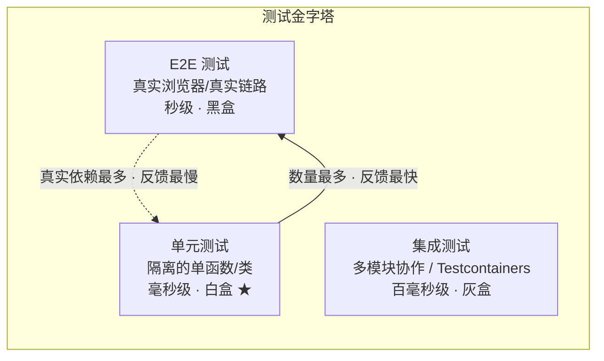
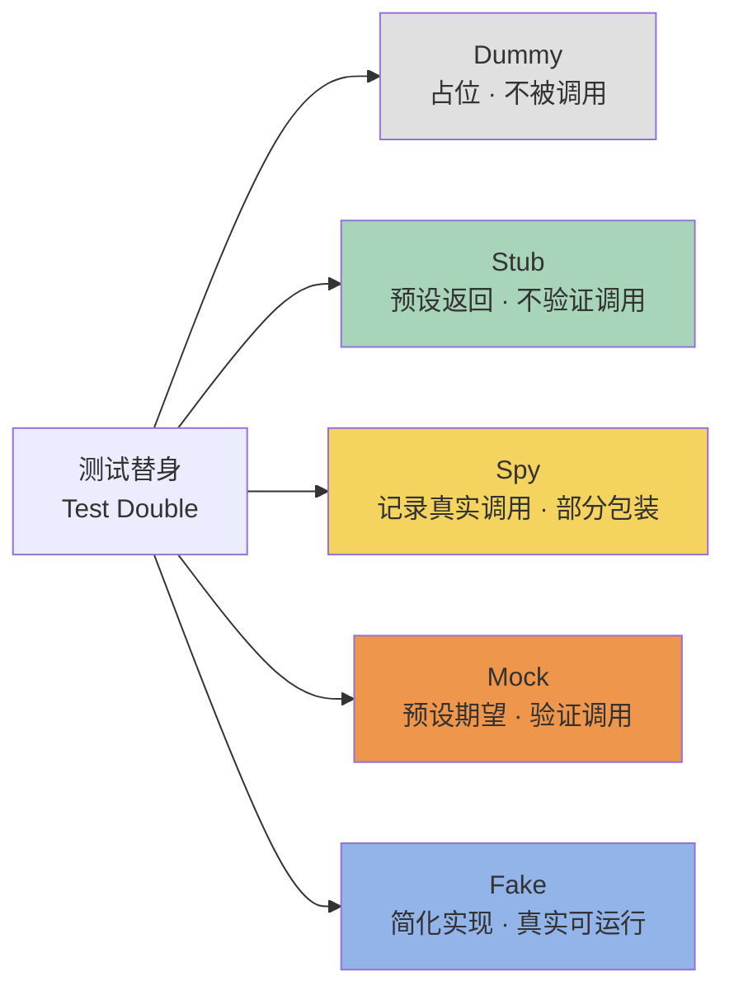

# 单元测试基础与测试替身

单元测试是质量保障金字塔的底座，也是开发工程师最直接的质量工具。本文聚焦三件事：厘清单元测试的边界与原则、系统讲解 Dummy/Stub/Spy/Mock/Fake 五种测试替身、给出 Java（JUnit 5 + Mockito 5.x）、Python（pytest + unittest.mock）以及前端 Vitest 4 的现代落地实践。

## 1. 核心概念：定义、FIRST 原则与边界

### 1.1 单元测试的定义

> **单元测试**是对软件中的最小可测试单元（通常是函数或类）在与程序其他部分相隔离的情况下进行检查和验证。

三个关键约束缺一不可：

- **最小可测试单元**：粒度收敛到单个函数/类，而非模块或服务
- **隔离**：被测单元的所有外部依赖（数据库、网络、文件系统、其他模块）都必须被替换为测试替身
- **验证**：基于功能逻辑推算预期输出，而非基于代码实现反推

### 1.2 FIRST 原则

业界普遍以 FIRST 原则评估单元测试质量：

| 原则 | 含义 | 实践要点 |
|------|------|----------|
| **F**ast | 快速 | 单个用例执行应在毫秒级，全量套件不超过分钟级 |
| **I**solated | 隔离 | 用例间无共享状态、无执行顺序依赖 |
| **R**epeatable | 可重复 | 多次执行结果一致，不依赖外部环境 |
| **S**elf-Validating | 自验证 | 用例自动判定通过/失败，无需人工检查输出 |
| **T**imely | 及时 | 测试代码与生产代码同步甚至先于生产代码编写（TDD） |

### 1.3 与集成测试、E2E 测试的边界

单元测试、集成测试、E2E 测试三者在对象、依赖、速度上有明显差异。明确边界有助于避免"用单元测试测集成逻辑"或"用 E2E 测纯函数"的资源错配。



判定一条测试归属哪一层，看的是"它依赖了多少真实组件"。当被测函数只是纯逻辑计算时，单元测试足以；当需要验证多个模块协作或与真实数据库交互时，进入集成测试范畴——Testcontainers 让集成测试可以在容器化的真实中间件上运行，但代价是执行时间从毫秒级跃升到秒级，已不属于单元测试。

> 补充：前端项目常用 Kent C. Dodds 的"测试奖杯"模型，将重心从纯单元测试上移到"组件 + API 协作"的集成层。两种模型并不冲突——奖杯模型强调"前端缺陷多发生在协作边界"，但对工具函数、纯状态机、算法逻辑仍应坚持单元测试。模型只是资源分配的参考，单元测试的"隔离 + 最小单元"定义不变。

## 2. 测试替身体系：Dummy/Stub/Spy/Mock/Fake

测试替身（Test Double）是 Gerard Meszaros 在《xUnit Test Patterns》中提出的术语，统指"用于替代真实依赖的测试对象"。其中五种类型常被混淆，区分关键在于"替身是否参与行为验证"和"替身是否提供预设返回"。



### 2.1 五种类型定义

| 类型 | 定义 | 典型场景 |
|------|------|----------|
| **Dummy** | 仅占位、从不被调用的对象 | 满足方法签名的参数填充 |
| **Stub** | 为被测方法调用提供预设返回值 | 隔离外部依赖、控制执行路径 |
| **Spy** | 包装真实对象，记录调用信息 | 验证少量关键调用，同时保留真实逻辑 |
| **Mock** | 预设调用期望，并在测试末尾验证 | 验证"是否调用、参数、次数、顺序" |
| **Fake** | 拥有简化但可工作的实现 | 内存版仓库替代真实数据库 |

### 2.2 Stub vs Mock：常被混淆的核心差异

二者最易混淆。区分要点是**断言位置**：

- **Stub 模式**：断言在被测函数的返回值/状态上，Stub 只负责"喂"数据
- **Mock 模式**：断言在 Mock 对象的调用行为上，验证"是否被调用、如何被调用"

Martin Fowler 在《Mocks Aren't Stubs》中据此区分了"状态验证"与"行为验证"两种测试风格。值得注意：现代 Mock 框架（Mockito、unittest.mock）已通过 API 模糊了二者边界——`when().thenReturn()` 是 Stub 用法，`verify()` 是 Mock 用法，可在同一用例中混用。

### 2.3 选型建议

实际工程中并不需要每次都纠结分类，但下列经验可参考：

- **优先 Stub**：90% 的场景只需控制返回值，无需验证调用行为
- **慎用 Mock verify**：过度验证调用次数/顺序会导致测试与实现强耦合，重构即破
- **Fake 用于复杂领域逻辑**：当 Stub 无法表达多步状态时，写一个内存 Fake 更清晰
- **Spy 仅在无法替换为接口时使用**：例如包装第三方类

一个简单的判别流程：先问"我关心返回值还是调用行为"——前者用 Stub，后者用 Mock；再问"依赖是否有复杂状态机"——是则升级为 Fake；若只是参数占位用 Dummy；若需要"既保留真实逻辑又观察调用"则用 Spy。

## 3. Java 单元测试：JUnit 5 + Mockito 5.x

### 3.1 JUnit 5 模块化架构与生命周期

JUnit 5 由 JUnit Platform（运行平台）+ Jupiter（新编程模型）+ Vintage（兼容 JUnit 4）三部分组成。生命周期注解如下：

```java
import org.junit.jupiter.api.*;

class ExampleTest {
    @BeforeAll  static void initAll()     { /* 整个测试类前执行一次 */ }
    @BeforeEach void init()               { /* 每个测试方法前执行 */ }
    @Test       void test()               { /* 测试方法 */ }
    @AfterEach  void tearDown()           { /* 每个测试方法后执行 */ }
    @AfterAll   static void tearDownAll() { /* 整个测试类后执行一次 */ }
}
```

### 3.2 参数化测试

参数化测试是 JUnit 5 的核心增强，可大幅减少样板代码：

```java
import org.junit.jupiter.params.*;
import org.junit.jupiter.params.provider.*;

@ParameterizedTest
@CsvSource({
    "1, 1, 2",
    "2, 3, 5",
    "-1, 1, 0"
})
void shouldAdd(int a, int b, int expected) {
    // 参数化：同一段断言逻辑跑多组输入
    assertEquals(expected, Calculator.add(a, b));
}
```

`@ValueSource`、`@MethodSource`、`@EnumSource` 等注解可覆盖各种数据来源场景。

### 3.3 断言与异常验证

JUnit 5 的 `Assertions` 类提供 `assertAll`（分组断言，全部执行后统一报告失败）与 `assertThrows`（断言抛出指定异常）：

```java
@Test
void shouldThrowWhenUserNotFound() {
    when(userRepository.findById(99L)).thenReturn(Optional.empty());

    // 断言抛出指定类型异常，并捕获异常实例做进一步校验
    UserNotFoundException ex = assertThrows(
        UserNotFoundException.class,
        () -> userService.getUserById(99L)
    );
    assertTrue(ex.getMessage().contains("99"));
}
```

### 3.4 Mockito 5.x：Inline Mock Maker 默认

Mockito 5.x 的最大变化是 **Inline Mock Maker 成为默认实现**，开箱即支持 mock final 类、静态方法（`mockStatic`）和构造函数（`mockConstruction`），不再需要 PowerMock。

```java
import org.junit.jupiter.api.*;
import org.junit.jupiter.api.extension.ExtendWith;
import org.mockito.*;
import static org.mockito.Mockito.*;

@ExtendWith(MockitoExtension.class)  // 启用 Mockito 的 JUnit 5 扩展
class UserServiceTest {

    @Mock  private UserRepository userRepository;  // 自动创建 Mock 对象
    @InjectMocks private UserService userService;  // 自动注入 Mock 依赖

    @Test
    void shouldReturnUserWhenValidId() {
        // Arrange - Stub 用法：预设返回值
        when(userRepository.findById(1L))
            .thenReturn(Optional.of(new User("Alice")));

        // Act - 调用被测方法
        User result = userService.getUserById(1L);

        // Assert - 状态验证
        assertEquals("Alice", result.getName());

        // Verify - 行为验证（Mock 用法）
        verify(userRepository, times(1)).findById(1L);
    }
}
```

> 注：Mockito 5 默认 mock 实例方法。如需 mock 静态方法，须用 `try (MockedStatic<Utility> ms = mockStatic(Utility.class)) { ... }` 显式声明作用域，避免线程污染。`verify` 的滥用会让测试与实现强耦合，应仅在"调用本身是契约"时使用。

## 4. Python 单元测试：pytest 9 + unittest.mock

### 4.1 pytest 9 与 unittest.mock

pytest 9 延续了"fixture + 参数化 + 简洁断言"的极简风格；而 `unittest.mock` 作为 Python 标准库，提供了 `Mock`/`MagicMock`/`patch` 三件套，无需第三方依赖即可完成绝大多数替身工作。

### 4.2 fixture：依赖注入的官方答案

```python
import pytest

@pytest.fixture
def user_repo():
    """返回一个内存版 Fake 仓库，每个用例独立一份实例"""
    return InMemoryUserRepository()

def test_get_user(user_repo):  # 通过参数名注入 fixture
    user_repo.save(User(1, "Alice"))
    assert user_repo.find(1).name == "Alice"
```

fixture 作用域通过 `scope` 参数控制（`function`/`class`/`module`/`session`），跨用例共享资源时建议使用 `scope="session"`；可链式依赖、可使用 `yield` 在 teardown 阶段做清理。跨文件共享的 fixture 放在 `conftest.py` 中即可被同目录及子目录自动发现，无需手动 import。

### 4.3 参数化测试

```python
@pytest.mark.parametrize("a, b, expected", [
    (1, 1, 2),
    (2, 3, 5),
    (-1, 1, 0),
])
def test_add(a, b, expected):
    assert Calculator.add(a, b) == expected
```

### 4.4 mark：用例分类与选择性执行

```python
@pytest.mark.slow
@pytest.mark.integration
def test_full_pipeline():
    ...

# 命令行：仅跑非 slow 用例
# pytest -m "not slow"
```

自定义 mark 需在 `pyproject.toml` 中注册，否则会触发 warning。

### 4.5 unittest.mock 实战

```python
from unittest.mock import patch, MagicMock

class UserService:
    def __init__(self, repo):
        self.repo = repo

    def get_user(self, uid):
        return self.repo.find(uid)

def test_get_user_with_mock():
    # 用 patch 上下文管理器替换真实依赖
    with patch("__main__.UserRepository") as MockRepo:
        # Arrange - Stub 行为
        instance = MockRepo.return_value
        instance.find.return_value = User(1, "Alice")

        # Act
        service = UserService(instance)
        result = service.get_user(1)

        # Assert
        assert result.name == "Alice"
        # Verify - Mock 行为验证
        instance.find.assert_called_once_with(1)
```

`patch` 既可作装饰器也可作上下文管理器；`MagicMock` 自动支持魔术方法（`__len__`、`__iter__` 等），是默认推荐类型。`spec=UserRepository` 可限制 mock 只能访问真实类的方法名，避免拼写错误静默通过。

## 5. 前端单元测试：Vitest 4

### 5.1 为什么是 Vitest 4

Vitest 4 基于 Vite 生态，启动时间从 Jest 的秒级降到毫秒级，原生支持 ESM 与 TypeScript，已成为 2024-2026 年前端单元测试的新首选。其 API 与 Jest 高度兼容，迁移成本极低；与 Vite 共享配置，开发/测试构建零割裂。

### 5.2 纯函数测试

```typescript
// sum.test.ts
import { describe, it, expect } from "vitest";
import { sum } from "./sum";

describe("sum", () => {
  it("应该正确求和两数", () => {
    expect(sum(1, 2)).toBe(3);
  });
});
```

### 5.3 组件测试与 mock

Vitest 与 @testing-library/react 配合实现组件级测试，使用 `vi.mock` 替换模块：

```typescript
import { render, screen } from "@testing-library/react";
import { vi, it, expect } from "vitest";
import { UserCard } from "./UserCard";

vi.mock("./api", () => ({  // Fake：替换整个模块的导出
  fetchUser: vi.fn().mockResolvedValue({ name: "Alice" }),
}));

it("应该渲染用户名", async () => {
  render(<UserCard id={1} />);
  expect(await screen.findByText("Alice")).toBeInTheDocument();
});
```

`vi.fn()` 创建可断言的 mock 函数（对应 Spy/Mock），`vi.mock` 工厂函数返回的对象则更像 Fake——它替换的是模块整体行为。

### 5.4 快照测试

快照测试用于捕获 UI 或序列化输出的意外变更，**适合纯展示组件、配置文件、错误信息**，不适合业务逻辑：

```typescript
it("匹配快照", () => {
  const { container } = render(<UserCard id={1} />);
  expect(container).toMatchSnapshot();
});
```

快照失败时优先检查"是预期变更还是回归"，再用 `vitest -u` 更新。快照文件应纳入版本控制并参与 Code Review，否则会沦为"另一种形式的 `assert true`"。

## 6. 测试覆盖率：JaCoCo / coverage.py / SonarQube

### 6.1 行覆盖率 vs 分支覆盖率

| 指标 | 含义 | 局限 |
|------|------|------|
| **行覆盖率** | 被执行到的代码行比例 | 一行写多条语句时失真；不反映分支 |
| **分支覆盖率** | 分支判定（if/for/三元）的真/假两路覆盖比例 | 不覆盖组合条件 |
| **MC/DC 覆盖率** | 条件组合中每个子条件独立影响判定结果 | 计算成本高，多用于安全关键场景 |

**行覆盖率 100% ≠ 测试充分**。一段 `if (a && b) { ... }` 即使两路都执行过，也可能从未在 `a=true, b=false` 路径下被验证。

### 6.2 工具选型

| 语言 | 工具 | 用法 |
|------|------|------|
| Java | JaCoCo 0.8.x | `mvn jacoco:check` 设门禁；与 SonarQube 集成做趋势分析 |
| Python | coverage.py | `coverage run -m pytest && coverage report --fail-under=80` |
| 多语言 | SonarQube | 聚合 JaCoCo/coverage.py 报告，统一质量门禁与新增代码视图 |

### 6.3 覆盖率门禁实践

仅看数字无意义，建议：

- **新建代码覆盖率门禁 ≥ 80%**，存量代码不强制
- **分支覆盖率比行覆盖率更重要**，门禁值应单独设置
- **结合 SonarQube 的"新增代码"视图**，避免历史包袱拖垮团队

JaCoCo 在 Maven 中的典型门禁配置示例：

```xml
<plugin>
  <groupId>org.jacoco</groupId>
  <artifactId>jacoco-maven-plugin</artifactId>
  <version>0.8.12</version>
  <executions>
    <execution>
      <id>check</id>
      <goals><goal>check</goal></goals>
      <configuration>
        <rules>
          <rule>
            <element>BUNDLE</element>
            <limits>
              <limit><counter>LINE</counter>   <minimum>0.80</minimum></limit>
              <limit><counter>BRANCH</counter> <minimum>0.70</minimum></limit>
            </limits>
          </rule>
        </rules>
      </configuration>
    </execution>
  </executions>
</plugin>
```

门禁失败时构建即失败，这是把"覆盖率"从"事后看一眼"升级为"事前阻断"的关键配置。

## 7. 常见陷阱与最佳实践

单元测试的失败往往不是工具问题，而是设计问题。下面列出的陷阱在真实项目中反复出现，识别它们比掌握任何 API 都更重要。

### 7.1 常见陷阱

1. **基于实现推算预期输出**：开发者按自己的代码反推预期值，等于"代码自证代码"，掩耳盗铃
2. **过度 verify 调用细节**：`verify(mock, times(1)).foo(any())` 看似严谨，实则将测试与实现耦合，重构即破
3. **测试间共享状态**：mutable 静态变量、共享 fixture 实例导致用例顺序依赖
4. **mock 一切**：连被测对象的纯函数逻辑都 mock，测试失去意义
5. **追求覆盖率数字**：为达成 80% 写一堆 `assertNotNull` 空断言

### 7.2 最佳实践

- **测试名表达意图**：`shouldReturnUserWhenValidId` 而非 `test1`，失败时即可读懂场景
- **AAA 结构**：Arrange / Act / Assert 三段分明，断言集中在末尾
- **每个用例只验证一个行为**：失败时定位最快
- **ArchUnit 约束架构**：用 ArchUnit 把"Controller 不能直接调 DAO"等架构规则写成测试，违规即红，是单元测试之外的有效补充
- **Testcontainers 用于集成测试**：当必须验证真实数据库行为时，用 Testcontainers 启动一次性容器，**但不要混入单元测试套件**——它属于集成测试范畴
- **变异测试验证有效性**：用 PITest / mutmut 注入缺陷，若测试仍通过则说明测试无效

### 7.3 AI 辅助生成

2024-2026 年 Copilot、Qodo、Diffblue Cover 等工具已能根据被测函数自动生成测试骨架，但需注意：AI 易基于代码实现反推预期输出，存在"掩耳盗铃"风险。正确姿势是 **AI 生成骨架 + 人工审查预期 + 变异测试验证** 形成闭环。

## 总结

1. **单元测试 = 隔离 + 最小单元 + 基于功能逻辑的验证**，FIRST 原则评估其质量，与集成/E2E 测试的边界由"依赖多少真实组件"决定
2. **测试替身五种类型**中，Stub 与 Mock 是最常混淆的，区分关键在断言位置；现代 Mock 框架已模糊二者边界，应优先 Stub、慎用 verify
3. **Java 用 JUnit 5 + Mockito 5.x**（Inline Mock Maker 默认），**Python 用 pytest 9 + unittest.mock**，**前端用 Vitest 4**，三套栈的参数化、依赖注入、mock 能力都已成熟
4. **覆盖率只看数字会被欺骗**：分支覆盖率 > 行覆盖率，配合变异测试才能验证测试有效性
5. **ArchUnit 约束架构、Testcontainers 支撑集成**，但后者不属于单元测试——明确边界比堆砌工具更重要
