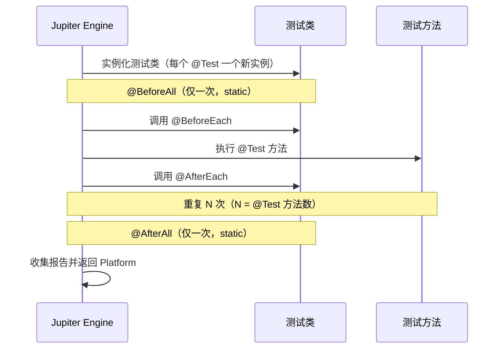

# JUnit 5 Jupiter 实战

JUnit 是 Java 生态事实标准的单元测试框架。本文基于 **JUnit 5.13.4（Jupiter BOM，2025 年发布）** 系统梳理 JUnit 5 的三大模块架构、环境搭建、Jupiter 核心 API、参数化测试、断言与假设、扩展模型、动态测试与 `@Suite` 注解，并给出从 JUnit 4 迁移到 5 的实操指南与工程最佳实践。旧文档未明确任何 JUnit 版本（连 JUnit 4/5 都未区分），且大量篇幅用于 Java 语言基础串讲，本文不再保留，全部聚焦 JUnit 5 Jupiter 本身。

## 一、核心概念

### 1.1 JUnit 5 是什么

JUnit 5 是 JUnit 框架的下一代实现，与 JUnit 4 相比不再是单个 JAR，而是一个由三个独立子模块组成的聚合项目：

- **JUnit Platform**：在 JVM 上启动测试框架的基础平台，定义了 `TestEngine` SPI，负责发现、过滤、执行测试，是 IDE、Gradle、Maven Surefire 与 CI 工具集成的统一入口。
- **JUnit Jupiter**：5.x 时代的全新编程与扩展模型，提供 `@Test`、`@ParameterizedTest`、`@ExtendWith` 等注解 API，是日常编写测试用例的主入口。
- **JUnit Vintage**：用于在 Platform 上运行 JUnit 3/4 测试的兼容引擎，迁移期允许新旧测试并存。

5.13.4 相较早期 5.x 版本在动态测试报告、`@Suite` 选择器、参数化测试参数解析、并行执行稳定性方面均有显著改进，本文示例均基于该版本验证。

### 1.2 三大模块架构

```mermaid
flowchart TB
    subgraph Tools["工具与构建系统"]
        IDE[IntelliJ IDEA<br/>VS Code]
        MJ[Maven Surefire/Failsafe]
        GRL[Gradle Test Task]
        CI[Jenkins/GitHub Actions]
    end
    subgraph Platform["JUnit Platform"]
        LAU[Launcher<br/>启动入口]
        ENG[TestEngine SPI]
        DIS[测试发现与过滤]
        RES[执行结果与报告]
    end
    subgraph Engines["测试引擎"]
        JUP[Jupiter Engine<br/>5.x 原生测试]
        VIN[Vintage Engine<br/>兼容 JUnit 4]
        CRT[自定义 Engine<br/>Kotest/Spec 等]
    end
    subgraph Jupiter["Jupiter API"]
        AN[注解 API<br/>@Test/@Nested/@ParameterizedTest]
        EXT[扩展模型<br/>@ExtendWith/Extension SPI]
        DYN[动态测试<br/>@TestFactory/DynamicTest]
    end
    IDE --> LAU
    MJ --> LAU
    GRL --> LAU
    CI --> LAU
    LAU --> DIS
    DIS --> ENG
    ENG --> JUP
    ENG --> VIN
    ENG --> CRT
    JUP --> AN
    JUP --> EXT
    JUP --> DYN
    AN --> RES
    EXT --> RES
    DYN --> RES
    classDef tools fill:#2563eb,stroke:#1e3a8a,color:#fff;
    classDef plat fill:#7c3aed,stroke:#4c1d95,color:#fff;
    classDef eng fill:#16a34a,stroke:#14532d,color:#fff;
    classDef jup fill:#ea580c,stroke:#7c2d12,color:#fff;
    class IDE,MJ,GRL,CI tools;
    class LAU,ENG,DIS,RES plat;
    class JUP,VIN,CRT eng;
    class AN,EXT,DYN jup;
```

理解三层划分是排查"测试不被发现""注解失效"等问题的基础：构建系统通过 Launcher 调用 Platform，Platform 通过 SPI 选择引擎，引擎负责真正调用 Jupiter API 上的注解与扩展。任何一层缺失（如只引入 `jupiter-api` 而未引入 `jupiter-engine`）都会导致 IDE 显示"no tests found"。

## 二、环境搭建

### 2.1 Maven 依赖

使用 Jupiter BOM 统一管理版本，避免不同 `jupiter-*` 子包错配：

```xml
<dependencyManagement>
    <dependencies>
        <!-- Jupiter BOM 统一管理 5.13.4 全部子组件版本 -->
        <dependency>
            <groupId>org.junit</groupId>
            <artifactId>junit-bom</artifactId>
            <version>5.13.4</version>
            <type>pom</type>
            <scope>import</scope>
        </dependency>
    </dependencies>
</dependencyManagement>

<dependencies>
    <!-- Jupiter API：编写测试所需的注解与断言 -->
    <dependency>
        <groupId>org.junit.jupiter</groupId>
        <artifactId>junit-jupiter</artifactId>
        <scope>test</scope>
    </dependency>
    <!-- 参数化测试支持 -->
    <dependency>
        <groupId>org.junit.jupiter</groupId>
        <artifactId>junit-jupiter-params</artifactId>
        <scope>test</scope>
    </dependency>
    <!-- 迁移期兼容 JUnit 4 测试（可选） -->
    <dependency>
        <groupId>org.junit.vintage</groupId>
        <artifactId>junit-vintage-engine</artifactId>
        <scope>test</scope>
    </dependency>
</dependencies>
```

Surefire 自 2.22.0 起即原生支持 JUnit Platform，可正常运行 `@Suite` 与并行配置；下例使用较新的 3.5.3：

```xml
<plugin>
    <groupId>org.apache.maven.plugins</groupId>
    <artifactId>maven-surefire-plugin</artifactId>
    <version>3.5.3</version>
    <configuration>
        <parallel>methods</parallel>
        <threadCount>4</threadCount>
    </configuration>
</plugin>
```

### 2.2 Gradle 依赖

```gradle
test {
    useJUnitPlatform()  // 启用 JUnit Platform 引擎
    maxParallelForks = 4
}

dependencies {
    testImplementation platform('org.junit:junit-bom:5.13.4')
    testImplementation 'org.junit.jupiter:junit-jupiter'
    testImplementation 'org.junit.jupiter:junit-jupiter-params'
    testRuntimeOnly 'org.junit.vintage:junit-vintage-engine'
}
```

### 2.3 IDE 配置

IntelliJ IDEA 自 2017 年起原生支持 JUnit 5，无需额外插件；VS Code 需安装 "Extension Pack for Java"。注意：若项目通过 BOM 管理版本，IDE 的"运行单个测试"动作仍依赖 classpath 上的实际 JAR，确认 `junit-jupiter-engine` 在 `testRuntimeOnly` 中存在。

## 三、核心 API

### 3.1 基础注解与生命周期

Jupiter 将 JUnit 4 的 `@Before`/`@After` 拆分为更细粒度的生命周期：

| 注解 | 执行时机 | 静态要求 |
|------|---------|---------|
| `@BeforeAll` | 当前类所有测试前执行一次 | 必须为 `static` |
| `@BeforeEach` | 每个测试方法前执行 | 实例方法 |
| `@AfterEach` | 每个测试方法后执行 | 实例方法 |
| `@AfterAll` | 当前类所有测试后执行一次 | 必须为 `static` |

```java
import org.junit.jupiter.api.*;

class LifecycleDemoTest {

    @BeforeAll
    static void initAll() {
        // 整个测试类只执行一次：适合初始化数据库连接、启动嵌入式容器
    }

    @BeforeEach
    void init() {
        // 每个测试方法前执行：重置测试数据、准备 Mock
    }

    @Test
    @DisplayName("应当返回正确加法结果")
    void shouldAddTwoNumbers() {
        // @DisplayName 提供中文可读名，IDE 与报告中原样展示
    }

    @AfterEach
    void tearDown() {
        // 每个测试方法后执行：清理临时文件、回滚事务
    }

    @AfterAll
    static void tearDownAll() {
        // 整个测试类结束后执行：关闭连接、停止容器
    }
}
```

### 3.2 生命周期执行流



> 关键差异：JUnit 4 默认每个测试方法重新创建测试类实例；Jupiter 沿用此行为，但通过 `@TestInstance(Lifecycle.PER_CLASS)` 可改为单实例，使 `@BeforeAll`/`@AfterAll` 不再强制 `static`，常用于与 `@ParameterizedTest` 共享昂贵资源。

### 3.3 嵌套测试与标签

`@Nested` 支持按业务内聚分组测试，外层实例字段可被子层共享；`@Tag` 用于在 CI 中按维度过滤执行集：

```java
import org.junit.jupiter.api.*;

@DisplayName("订单服务")
class OrderServiceTest {

    @Nested
    @DisplayName("创建订单")
    class CreateOrder {
        @Test
        @Tag("smoke")  // CI 中通过 -Dgroups=smoke 仅运行冒烟用例
        void shouldCreateOrderWithValidInput() {}

        @Test
        @Tag("regression")
        void shouldRejectOrderWhenStockInsufficient() {}
    }

    @Nested
    @DisplayName("取消订单")
    class CancelOrder {
        @Test
        void shouldRefundWhenCancelBeforeShipment() {}
    }
}
```

## 四、参数化测试

参数化测试是 Jupiter 相对 JUnit 4 最显著的工程价值，单次声明即可驱动多组数据执行。所有参数源注解需配合 `@ParameterizedTest` 使用，且必须显式引入 `junit-jupiter-params`。

```java
import org.junit.jupiter.params.ParameterizedTest;
import org.junit.jupiter.params.provider.*;

class ParameterizedTestDemo {

    // @ValueSource：单字面量数组，适合简单入参
    @ParameterizedTest(name = "正整数 {0} 的平方应大于自身")
    @ValueSource(ints = {2, 3, 5, 7, 11})
    void shouldSquareBeGreaterThanSelf(int n) {
        org.junit.jupiter.api.Assertions.assertTrue(n * n > n);
    }

    // @CsvSource：多列 CSV，适合多入参组合
    @ParameterizedTest(name = "[{index}] {0} + {1} = {2}")
    @CsvSource({
        "1, 2, 3",
        "10, -5, 5",
        "0, 0, 0"
    })
    void shouldAddCorrectly(int a, int b, int expected) {
        org.junit.jupiter.api.Assertions.assertEquals(expected, a + b);
    }

    // @MethodSource：引用静态工厂方法，支持复杂对象与 Stream
    @ParameterizedTest
    @MethodSource("userProvider")
    void shouldValidateUser(User user) {
        org.junit.jupiter.api.Assertions.assertNotNull(user.email());
    }

    static java.util.stream.Stream<User> userProvider() {
        return java.util.stream.Stream.of(
            new User("alice", "alice@x.com"),
            new User("bob", "bob@x.com")
        );
    }

    // @EnumSource：枚举遍历，支持 name 匹配与排除
    @ParameterizedTest
    @EnumSource(value = java.time.DayOfWeek.class,
                names = {"SATURDAY", "SUNDAY"},
                mode = EnumSource.Mode.EXCLUDE)
    void shouldBeWeekday(java.time.DayOfWeek day) {
        org.junit.jupiter.api.Assertions.assertTrue(day.getValue() <= 5);
    }

    record User(String name, String email) {}
}
```

`name` 模板中的 `{index}`（当前数据索引）、`{0}`（第一个参数）、`{arguments}`（全部参数）能显著提升失败报告可读性，是工程化必填项。

## 五、断言与假设

### 5.1 Assertions

Jupiter 的 `org.junit.jupiter.api.Assertions` 全部方法支持 Lambda 延迟消息构造，避免不必要的字符串拼接开销：

```java
import static org.junit.jupiter.api.Assertions.*;

@Test
void shouldAssertAllFields() {
    User user = service.findById(1L);
    // assertAll：分组断言，不会因首个失败而跳过后续，便于一次性暴露全部问题
    assertAll("用户字段校验",
        () -> assertEquals("alice", user.name()),
        () -> assertEquals("alice@x.com", user.email()),
        () -> assertNotNull(user.createdAt())
    );
}

@Test
void shouldThrowWhenInputInvalid() {
    // assertThrows：精确断言异常类型与消息
    IllegalArgumentException ex = assertThrows(
        IllegalArgumentException.class,
        () -> service.parse("not-a-number"),
        "非法输入应抛 IllegalArgumentException"
    );
    assertTrue(ex.getMessage().contains("not-a-number"));
}
```

### 5.2 AssertJ 流式断言

AssertJ 是 Jupiter 推荐的第三方断言库，链式 API 表达力远超内置 `Assertions`，5.13.4 工程实践中通常作为默认断言层：

```java
import static org.assertj.core.api.Assertions.assertThat;

@Test
void shouldAssertWithAssertJ() {
    List<User> users = service.findAll();
    assertThat(users)
        .hasSize(3)
        .extracting(User::name)
        .containsExactly("alice", "bob", "carol")
        .doesNotContainNull();
}
```

### 5.3 Assumptions 假设

假设失败时测试会被标记为 `skipped` 而非 `failed`，常用于环境/前置条件守卫，避免在 CI 矩阵中产生噪声失败：

```java
import static org.junit.jupiter.api.Assumptions.*;

@Test
void shouldRunOnlyOnLinux() {
    assumeTrue("Linux".equals(System.getProperty("os.name")),
               () -> "仅在 Linux 上执行，当前环境跳过");
    // Linux 专属断言
}
```

## 六、扩展模型

JUnit 4 的 `@RunWith` 与 `@Rule` 互斥且封闭，Jupiter 用统一的 `Extension` SPI 替代，多个扩展可叠加组合。

### 6.1 内置扩展

- `MockitoExtension`：自动初始化 `@Mock` 字段并校验 stubbing 严格性。
- `SpringExtension`：将 Spring TestContext 与 Jupiter 集成，配合 `@SpringBootTest` 加载 ApplicationContext。
- `TempDirectory`：通过 `@TempDir` 注入临时目录，测试结束自动清理。

```java
import org.junit.jupiter.api.Test;
import org.junit.jupiter.api.extension.ExtendWith;
import org.junit.jupiter.api.io.TempDir;
import org.mockito.Mock;
import org.mockito.junit.jupiter.MockitoExtension;

import java.nio.file.Path;

@ExtendWith(MockitoExtension.class)
class ExtendWithDemoTest {

    @Mock
    private UserRepository repository;  // 自动创建 Mock 实例

    @Test
    void shouldUseTempDir(@TempDir Path tempDir) {
        // 临时目录由 TempDirectory 扩展注入，方法结束自动删除
        Path file = tempDir.resolve("test.txt");
        // ... 写入并断言
    }
}
```

### 6.2 自定义 Extension

实现 `Extension` SPI 中的某个或多个回调接口即可注入自定义行为。以下扩展在每个测试方法前后打印耗时：

```java
import org.junit.jupiter.api.Test;
import org.junit.jupiter.api.extension.*;
import java.util.logging.Logger;

public class TimingExtension implements
        BeforeTestExecutionCallback, AfterTestExecutionCallback {

    private static final Logger LOG = Logger.getLogger(TimingExtension.class.getName());
    private static final ExtensionContext.Namespace NS =
            ExtensionContext.Namespace.create(TimingExtension.class);

    @Override
    public void beforeTestExecution(ExtensionContext context) {
        // 通过 Store 保存起始时间戳，避免字段状态污染
        context.getStore(NS).put("start", System.nanoTime());
    }

    @Override
    public void afterTestExecution(ExtensionContext context) {
        long start = context.getStore(NS).get("start", Long.class);
        long costMs = (System.nanoTime() - start) / 1_000_000;
        LOG.info(() -> context.getDisplayName() + " 耗时 " + costMs + " ms");
    }
}

// 使用方式
@ExtendWith(TimingExtension.class)
class MyTest {
    @Test void case1() {}
    @Test void case2() {}
}
```

`ExtensionContext.Store` 提供命名空间隔离的状态容器，是替代 JUnit 4 字段状态的核心机制，确保并行执行下的线程安全。

## 七、动态测试与 @Suite

### 7.1 动态测试 @TestFactory

`@Test` 是静态声明的，编译期即确定；`@TestFactory` 用于运行时根据数据生成测试，返回 `DynamicTest` 流。典型场景：根据数据库表动态生成校验用例、根据 OpenAPI 文档自动生成接口契约测试。

```java
import org.junit.jupiter.api.DynamicTest;
import org.junit.jupiter.api.TestFactory;
import java.util.List;
import java.util.stream.Stream;
import static org.junit.jupiter.api.Assertions.assertTrue;

class DynamicTestDemo {

    @TestFactory
    Stream<DynamicTest> shouldValidateAllEmails() {
        var inputs = List.of("a@b.com", "c@d.com", "x@y.com");
        return DynamicTest.stream(
            inputs.stream(),
            email -> "校验邮箱: " + email,           // displayName 生成器
            email -> assertTrue(email.contains("@")) // 测试体
        );
    }
}
```

动态测试不支持 `@BeforeEach`/`@AfterEach` 回调（因为执行时机由工厂决定），需要初始化时在测试体内显式调用。

### 7.2 @Suite 注解

5.8 起官方推荐使用 `@Suite` 替代 `@RunWith(JUnitPlatform.class)` 与 `@SelectPackages`，用于跨类聚合执行：

```java
import org.junit.platform.suite.api.*;

@Suite
@SelectPackages("com.example.unit")
@IncludeTags("smoke")
@ExcludeTags("slow")
class SmokeTestSuite {
    // 类体留空，仅作为执行入口声明
}
```

需引入 `junit-platform-suite-api` 与 `junit-platform-suite-engine` 两个依赖，5.13.4 中已合并到主 BOM，无需声明版本。

## 八、JUnit 4 → 5 迁移指南

### 8.1 注解映射

| JUnit 4 | JUnit 5 Jupiter | 说明 |
|---------|-----------------|------|
| `@Test` (`org.junit.Test`) | `@Test` (`org.junit.jupiter.api.Test`) | 包路径变化，需重新 import |
| `@Before` | `@BeforeEach` | 实例方法，每个测试前 |
| `@After` | `@AfterEach` | 实例方法，每个测试后 |
| `@BeforeClass` | `@BeforeAll` | 必须 `static` |
| `@AfterClass` | `@AfterAll` | 必须 `static` |
| `@Ignore` | `@Disabled` | 语义相同，名称更直观 |
| `@RunWith(Supplier.class)` | `@ExtendWith(Supplier.class)` | 单一扩展模型 |
| `@Rule` / `@ClassRule` | `@ExtendWith` 自定义 Extension | 统一 SPI |
| `Assert.assertEquals` | `Assertions.assertEquals` | 包路径变化，断言签名增加 Lambda 消息支持 |

### 8.2 共存与渐进迁移

引入 `junit-vintage-engine` 后，同一模块可同时存在 JUnit 4 与 5 测试，IDE 与 Surefire 均能识别。建议按以下顺序迁移：

1. 升级依赖到 Jupiter BOM 5.13.4，保留 JUnit 4 依赖。
2. 新增测试全部用 Jupiter API 编写。
3. 按包路径逐个迁移旧测试：先用 IDE 重命名 import，再替换 `@RunWith`/`@Rule`。
4. 全部迁移完成后移除 `junit-vintage-engine` 与 JUnit 4 依赖。

### 8.3 行为差异

- JUnit 4 默认非公开方法不可见，Jupiter 允许测试类与方法为 `package-private`（推荐）。
- JUnit 4 断言消息参数在前，Jupiter 在最后并支持 Lambda。
- JUnit 4 的 `ExpectedException` Rule 已废弃，使用 `assertThrows` 替代。

## 九、常见陷阱与最佳实践

### 9.1 陷阱清单

- **BOM 未生效**：只在 `<dependencies>` 写版本号而未通过 BOM 管理，多个 `jupiter-*` 子包易版本错配，触发 `NoSuchMethodError`。
- **`@BeforeAll` 非 static**：默认 `PER_METHOD` 生命周期下 `@BeforeAll` 必须 `static`，否则引擎直接报错；如需非静态，必须显式 `@TestInstance(PER_CLASS)`。
- **参数化测试缺依赖**：`@ParameterizedTest` 报"ParameterResolutionException"，90% 是漏引 `junit-jupiter-params`。
- **`@Nested` 类为 static**：嵌套类必须是非静态内部类，否则无法共享外层实例字段。
- **并行执行状态污染**：开启 `junit.jupiter.execution.parallel.enabled=true` 后，`@BeforeEach` 中修改的共享字段会被并发访问，必须改用 `PER_METHOD` 实例隔离或 `ThreadLocal`。
- **`@Tag` 名称含保留字符**：`(`、`)`、`&`、`|`、`!` 在 Tag 过滤表达式中是运算符，不能作为 Tag 名称。

### 9.2 最佳实践

- **测试类与方法不使用 `public`**：Jupiter 不要求，包级私有即可，减少不必要的访问修饰符噪声。
- **`@DisplayName` 优先于方法名**：用中文或业务语言描述测试意图，报告可读性远高于驼峰命名。
- **断言分组用 `assertAll`**：避免首个断言失败掩盖后续字段问题。
- **失败消息用 Lambda**：`assertEquals(1, x, () -> "耗时计算的消息 " + expensive())`，仅在失败时构造。
- **测试方法保持单一断言**：配合 `assertAll` 分组，定位失败更精准。
- **`@Tag` 维度化执行集**：CI 流水线按 `smoke`/`regression`/`integration` 分层执行，缩短反馈环。
- **扩展优先于基类继承**：避免用抽象测试基类共享 setup 逻辑，扩展可组合且无状态污染。

JUnit 5 Jupiter 在架构上彻底解耦了"测试编程模型"与"测试运行平台"，并通过 `Extension` SPI 提供了与 Spring、Mockito 等生态无缝集成的标准入口。掌握 BOM 版本管理、参数化测试、扩展模型与并行执行配置，是从 JUnit 4 时代平稳过渡到现代 Java 单元测试栈的关键。
