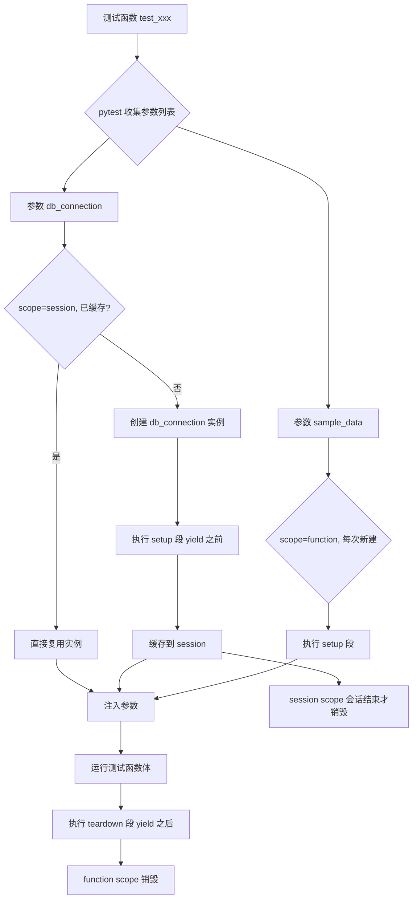
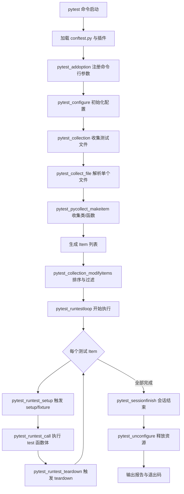

# pytest 9 实战（fixtures 与参数化与插件）

pytest 是 Python 生态中最主流的测试框架，凭借**简单的断言、显式的 fixture 依赖注入、灵活的参数化、可扩展的插件体系**，早已成为绝大多数 Python 项目（含 FastAPI、PyTorch、LangChain 等明星项目）的默认测试底座。本文基于 pytest **9.1.1**（2026 年最新稳定版）撰写，重点讲解 fixtures、参数化、mark、插件体系与 conftest.py 工程化用法，并系统梳理 pytest 9 相对 pytest 6/7/8 的破坏性变更与迁移指南。

## 一、核心概念

### 1.1 pytest 是什么

pytest 是一个**第三方测试框架**，它通过**约定优于配置**的方式发现并执行测试用例：只要文件名以 `test_*.py` 或 `*_test.py` 命名、类以 `Test` 开头（且无 `__init__`）、函数以 `test_` 开头，pytest 即可自动收集并运行。其官方设计的三大支柱为：

- **assert 重写**：通过 AST 改写让原生 `assert` 输出失败中间值，无需 `self.assertEqual` 类断言；
- **fixture 依赖注入**：以函数参数显式声明依赖，pytest 自动按 scope 复用并解析；
- **插件体系**：通过 `pytest_addoption`、`pytest_runtest_*` 等 hook 与 `entry_points` 机制，几乎所有行为都可被插件替换。

### 1.2 pytest vs unittest

| 维度 | unittest | pytest 9 |
|------|----------|----------|
| 断言风格 | `self.assertEqual(a, b)` 类方法 | 原生 `assert a == b`，AST 显示中间值 |
| 测试发现 | `TestLoader.discover` | 内置 `testpaths` + `python_files` 约定 |
| Fixture | `setUp/tearDown` 隐式耦合 | `@pytest.fixture` 显式注入，按 scope 复用 |
| 参数化 | 需 `ddt`/`parameterized` 三方库 | 内置 `@pytest.mark.parametrize` |
| Mark/筛选 | 无原生支持 | `-m "mark and not slow"` 表达式 |
| 并行执行 | 无 | `pytest-xdist -n auto` |
| 插件生态 | 弱 | 1500+ 插件（asyncio、cov、html、mock…） |
| 异步支持 | 无原生 | `pytest-asyncio` |
| 兼容性 | 标准库 | 兼容 unittest 用例 |

### 1.3 设计哲学

pytest 的设计哲学可概括为三条：

1. **断言即代码**：用 Python 原生 `assert` 表达期望，框架负责改写 AST 以输出有意义的失败信息；
2. **显式依赖**：测试函数**通过参数名声明它依赖的 fixture**，pytest 自动解析并按需注入，依赖关系一眼可见；
3. **插件即代码**：所有内置功能（mark、parametrize、fixture）本质上都是 hook 的实现，第三方插件可覆盖任意阶段。

## 二、环境搭建

### 2.1 安装与版本要求

pytest 9 自 9.0 起**最低要求 Python 3.10**（Drop Python 3.9），与 Python 3.13、3.14 完全兼容。建议在虚拟环境中安装：

```bash
# 创建并激活虚拟环境
python3.12 -m venv .venv
source .venv/bin/activate

# 安装最新 pytest 9
pip install "pytest>=9.1.1"

# 校验版本
pytest --version
# pytest 9.1.1
```

常用插件一并安装（按需选择）：

```bash
pip install pytest-asyncio pytest-xdist pytest-html pytest-cov pytest-mock pytest-rerunfailures
```

### 2.2 项目结构约定

推荐的 pytest 工程目录结构如下：

```
project/
├── pyproject.toml          # 项目配置（pytest 9 推荐配置位置）
├── conftest.py             # 顶层 fixture 与 hook
├── src/
│   └── mypkg/
│       └── calc.py
└── tests/
    ├── conftest.py         # 测试级 fixture
    ├── unit/
    │   ├── conftest.py
    │   └── test_calc.py
    └── integration/
        └── test_api.py
```

在 `pyproject.toml` 中通过 `[tool.pytest.ini_options]` 显式声明 pytest 配置（pytest 官方推荐的配置位置）：

```toml
[tool.pytest.ini_options]
minversion = "9.1"
testpaths = ["tests"]
python_files = ["test_*.py"]
python_classes = ["Test*"]
python_functions = ["test_*"]
addopts = "-ra --strict-markers --strict-config"
markers = [
    "slow: 标记慢用例，可用 -m 'not slow' 跳过",
    "smoke: 冒烟用例",
    "integration: 集成测试用例",
]
```

### 2.3 conftest.py 角色

`conftest.py` 是 pytest 的**fixture 与 hook 注册中心**，无需 `import` 即被自动加载，按目录层级生效：

- **顶层 `conftest.py`**：定义全局 fixture、命令行选项、全局 hook；
- **子目录 `conftest.py`**：覆盖或扩展上层 fixture，仅对当前子树生效；
- **同名 fixture 就近原则**：子目录 fixture 覆盖父目录同名 fixture。

## 三、fixtures：依赖注入的核心

### 3.1 基础用法

fixture 是 pytest 的灵魂，用 `@pytest.fixture` 装饰一个工厂函数，测试函数通过**参数名**声明依赖：

```python
import pytest

@pytest.fixture
def sample_data():
    """提供一个简单的列表数据，函数返回值即注入值"""
    return [1, 2, 3]

def test_sum(sample_data):           # 参数名与 fixture 名一致即自动注入
    assert sum(sample_data) == 6
```

fixture 也支持 `yield` 形式以承载 setup/teardown：

```python
@pytest.fixture
def db_connection():
    # setup：建立连接
    conn = connect("sqlite:///:memory:")
    yield conn                       # yield 之前的代码为 setup
    # teardown：yield 之后为清理逻辑，无论测试是否失败都会执行
    conn.close()
```

### 3.2 scope：fixture 作用域

通过 `scope` 参数控制 fixture 实例的生命周期，复用粒度从粗到细：

| scope | 实例数 | 典型场景 |
|-------|--------|----------|
| `function`（默认） | 每个测试函数一个 | 独立状态、临时目录 |
| `class` | 每个 Test 类一个 | 类内共享但跨类隔离 |
| `module` | 每个 .py 文件一个 | 模块级共享资源 |
| `package` | 每个 conftest.py 子树一个 | 多模块共享 |
| `session` | 整个测试会话一个 | 数据库连接、容器启动 |

```python
@pytest.fixture(scope="session")
def app_container():
    """会话级 fixture：仅启动一次容器"""
    container = start_docker("myapp:latest")
    yield container
    container.stop()
```

> **pytest 注意**：fixture 依赖的 scope 必须**等于或宽于**当前 fixture 的 scope（如 `session` fixture 不能依赖 `function` fixture），否则会抛出 `ScopeMismatch`。

### 3.3 params：参数化 fixture

fixture 自身也可参数化，每个参数会生成一个独立的测试用例：

```python
@pytest.fixture(params=[1, 2, 3], ids=["一", "二", "三"])
def number(request):
    """request.param 即当前参数值，ids 控制测试 ID 显示"""
    return request.param

def test_positive(number):
    assert number > 0
# 等价生成 3 个用例：test_positive[一] / [二] / [三]
```

### 3.4 autouse：自动注入

`autouse=True` 让 fixture 在不显式声明参数的情况下被自动调用，常用于环境准备：

```python
@pytest.fixture(autouse=True)
def reset_env(monkeypatch):
    """每个测试函数运行前自动清空环境变量"""
    for key in list(os.environ):
        monkeypatch.delenv(key, raising=False)
```

### 3.5 fixture 依赖注入流程

fixture 之间可相互依赖，pytest 按**拓扑排序**解析依赖图。下图为一次 fixture 解析与执行的完整流程：



## 四、参数化：用例数据驱动

### 4.1 基础参数化

`@pytest.mark.parametrize` 是 pytest 的内置 mark，用于将一组数据展开成多个用例：

```python
@pytest.mark.parametrize("input,expected", [
    (1, 2),
    (2, 4),
    (3, 6),
    (10, 20),
])
def test_double(input, expected):
    assert input * 2 == expected
```

### 4.2 ids：自定义用例 ID

通过 `ids` 让用例 ID 更具语义化，便于筛选失败用例：

```python
@pytest.mark.parametrize(
    "user,role",
    [("alice", "admin"), ("bob", "guest")],
    ids=["管理员alice", "访客bob"],
)
def test_permission(user, role):
    assert has_permission(user, role) is True
```

也支持传入函数，根据参数自动生成 ID：

```python
def idfn(val):
    if isinstance(val, (list, tuple)):
        return "-".join(map(str, val))
    return repr(val)

@pytest.mark.parametrize("data", [(1, 2), (3, 4)], ids=idfn)
def test_data(data):
    assert len(data) == 2
```

### 4.3 indirect：与 fixture 联动

`indirect` 让 parametrize 的值**先传入 fixture 处理**再注入测试，是处理"延迟构造对象"的常用模式：

```python
@pytest.fixture
def db(request):
    """根据 param 中的 dsn 创建不同后端的连接"""
    return connect(request.param)

@pytest.mark.parametrize("db", ["sqlite", "postgres", "mysql"], indirect=True)
def test_query(db):
    assert db.execute("SELECT 1") == 1
```

### 4.4 多组参数叠加

多个 `parametrize` 装饰器叠加会形成**笛卡尔积**，而同一装饰器内是多组并列：

```python
# 笛卡尔积：3 browser × 2 env = 6 个用例
@pytest.mark.parametrize("browser", ["chromium", "firefox", "webkit"])
@pytest.mark.parametrize("env", ["dev", "prod"])
def test_runner(browser, env):
    ...
```

## 五、mark 与跳过

### 5.1 内置 mark

| mark | 语义 |
|------|------|
| `@pytest.mark.skip(reason="...")` | 无条件跳过 |
| `@pytest.mark.skipif(sys.platform == "win32", ...)` | 条件跳过 |
| `@pytest.mark.xfail(reason="...", strict=True)` | 预期失败，符合预期则 XPASS |
| `@pytest.mark.parametrize` | 参数化 |
| `@pytest.mark.usefixtures("fix")` | 仅触发 fixture 不接收返回值 |
| `@pytest.mark.filterwarnings("error")` | 警告过滤 |

### 5.2 自定义 mark 与注册

```python
import pytest

@pytest.mark.smoke
def test_homepage():
    assert True

@pytest.mark.slow
def test_full_e2e():
    ...
```

在 `pyproject.toml` 中注册，配合 `--strict-markers` 拒绝未声明的 mark：

```toml
[tool.pytest.ini_options]
addopts = "--strict-markers"
markers = [
    "smoke: 冒烟测试",
    "slow: 慢用例",
]
```

运行时用 `-m` 表达式筛选：

```bash
pytest -m "smoke and not slow"
pytest -m "integration"
```

### 5.3 xfail 与 strict

```python
@pytest.mark.xfail(reason="bug #1234 待修复", strict=True)
def test_known_bug():
    assert buggy_func() == 42
```

`strict=True` 表示若测试**意外通过**则报失败，避免 xfail 成为"安慰剂"。

## 六、插件体系

### 6.1 常用插件速览

| 插件 | 用途 | 关键参数 |
|------|------|----------|
| `pytest-asyncio` | 异步测试支持 | `asyncio_mode = "auto"` |
| `pytest-xdist` | 并行执行 | `-n auto` / `-n 8` |
| `pytest-html` | HTML 报告 | `--html=report.html --self-contained-html` |
| `pytest-cov` | 覆盖率 | `--cov=mypkg --cov-report=html` |
| `pytest-mock` | `mocker` fixture 包装 `unittest.mock` | `def test_x(mocker):` |
| `pytest-rerunfailures` | 失败重试 | `--reruns 3 --reruns-delay 1` |
| `pytest-timeout` | 用例超时 | `@pytest.mark.timeout(5)` |
| `allure-pytest` | Allure 报告 | `--alluredir=allure_results` |

### 6.2 pytest-asyncio：异步测试

pytest 9 中**同步测试函数直接依赖 async fixture 会报错**，必须配合 `pytest-asyncio`：

```python
# pyproject.toml
[tool.pytest.ini_options]
asyncio_mode = "auto"

# 测试代码
async def fetch_data():
    await asyncio.sleep(0.01)
    return {"status": "ok"}

async def test_fetch():          # auto 模式下无需 @pytest.mark.asyncio
    data = await fetch_data()
    assert data["status"] == "ok"
```

### 6.3 pytest-xdist：并行执行

```bash
# 自动按 CPU 核数并行
pytest -n auto

# 指定 8 个 worker，按测试文件分发
pytest -n 8 --dist loadfile
```

`--dist` 模式：`load`（默认，按用例均摊）、`loadfile`（按文件）、`loadscope`（按类/模块）、`no`（顺序执行仅多进程隔离）。

### 6.4 pytest-mock：mocker fixture

```python
def test_http_call(mocker):
    # 用 mocker.patch 替换 requests.get，避免真实网络调用
    mock_get = mocker.patch("requests.get")
    mock_get.return_value.json.return_value = {"code": 0}

    result = call_api()
    assert result["code"] == 0
    mock_get.assert_called_once_with("https://api.example.com")
```

### 6.5 自定义 conftest 插件

通过实现 hook 编写自检插件，例如自动统计慢用例：

```python
# conftest.py
import time
import pytest

@pytest.hookimpl(wrapper=True)
def pytest_runtest_call(item):
    start = time.perf_counter()
    try:
        return (yield)               # 让测试函数执行
    finally:
        elapsed = time.perf_counter() - start
        if elapsed > 1.0:
            print(f"\n[慢用例] {item.nodeid}: {elapsed:.2f}s")
```

新增命令行选项示例：

```python
def pytest_addoption(parser):
    parser.addoption(
        "--env", default="dev", choices=["dev", "staging", "prod"],
        help="指定被测环境",
    )

@pytest.fixture
def env(request):
    return request.config.getoption("--env")
```

## 七、pytest 9 新特性与迁移指南

pytest 9.0 于 2025 年发布，是继 8.0 后的又一次**破坏性大版本**，旧项目升级前必须重点核对以下变更。

### 7.1 Drop Python 3.9

- pytest 9.0 起最低要求 **Python 3.10**，9.1 同时支持 3.10、3.11、3.12、3.13、3.14；
- 升级前用 `pyupgrade --py310-plus` 与 `ruff check --target-version=py310` 检查代码。

### 7.2 PytestRemovedIn9Warning 默认变 error

pytest 8 中以 `PytestRemovedIn9Warning` 提示的所有废弃特性在 9.0 **彻底移除并直接报错**，常见命中点：

- `pytest.Instance` 收集节点（已移除，改用常规测试类组织用例）；
- nose 风格的 `setup()`/`teardown()` 方法（已移除，改用 `@pytest.fixture`）；
- `yield_fixture`（自 3.0 起等同 `fixture`，9.0 完全移除该别名）；
- `--strict` 选项（拆分为 `--strict-markers` 与 `--strict-config`，9.0 移除旧名）。

### 7.3 sync 测试依赖 async fixture 报错

pytest 9 收紧了异步语义，**同步测试函数不能依赖 async fixture**：

```python
# pytest 8.4 起：发出 PytestRemovedIn9Warning 警告
# pytest 9：直接报错
@pytest_asyncio.fixture
async def async_db():
    return await create_async_db()

def test_query(async_db):      # ❌ pytest 9 抛错
    assert async_db.query("SELECT 1") == 1

# 正确做法：测试也声明为 async
async def test_query(async_db):
    assert await async_db.query("SELECT 1") == 1
```

### 7.4 py.path.local → pathlib.Path

pytest 9 全面使用 `pathlib.Path` 替换 `py.path.local`，影响所有 hook 参数：

```python
# 旧写法（pytest 8 及之前）
def pytest_ignore_collect(path, config):
    if path.basename.startswith("_"):
        return True

# pytest 9 新写法
def pytest_ignore_collect(collection_path, config):
    if collection_path.name.startswith("_"):
        return True
```

涉及的主要 hook：`pytest_ignore_collect`（`collection_path` 参数）、`pytest_collect_file`（`file_path` 参数）等。

### 7.5 重叠参数处理

旧版本 `pytest a a/b` 等价于 `pytest a/b`，9.0 起**等价于 `pytest a`**——会收集 `a` 下所有文件，不再"被更具体的路径覆盖"。CI 中若依赖旧的去重行为需重新校对参数列表。

### 7.6 config.args 只能含字符串

`config.args` 在 9.0 起严格要求**元素为字符串**，传入 `Path` 会抛 `TypeError`。自定义插件若直接操作 `config.args` 需显式 `str()` 转换。

### 7.7 CI 模式检测变更

旧版本只要存在 `$CI` 或 `$BUILD_NUMBER` 环境变量即视为 CI 模式，9.0 起**要求变量值非空**。若你的 CI 注入了空字符串（如 `CI=`），需要在流水线脚本中显式赋值。

### 7.8 迁移清单

| 检查项 | 命令/动作 |
|--------|----------|
| Python 版本 | `python --version` 需 ≥ 3.10 |
| pytest 版本 | `pip install -U "pytest>=9.1.1"` |
| 废弃警告 | 升级前先在 pytest 8 跑 `pytest -W error::pytest.PytestRemovedIn9Warning` |
| 路径 hook | 全局替换 `path.basename` 为 `collection_path.name` |
| yield_fixture | `grep -r yield_fixture` 全部改为 `@pytest.fixture` |
| --strict | 替换为 `--strict-markers --strict-config` |
| async fixture | 同步用例改为 `async def test_xxx` |
| 插件兼容 | 升级 `pytest-asyncio>=0.24`、`pytest-xdist>=3.6` |

## 八、pytest 测试执行生命周期

理解 pytest 的 hook 顺序，对排查 fixture 时机、插件冲突、收集失败至关重要。完整生命周期如下图：



掌握每个阶段的 hook 名后，调试"为什么我的 fixture 没生效""为什么某个用例被跳过""为什么插件没被加载"等问题即可定位。

## 九、常见陷阱与最佳实践

### 9.1 陷阱清单

1. **类内 `__init__`**：以 `Test` 开头但定义了 `__init__`，pytest **不会收集**该类——这是新手最常见的"测试没执行"原因；
2. **fixture 名冲突**：子 conftest 覆盖父 conftest 同名 fixture 时，父级 fixture 的 teardown **不会**再执行，需手动链式调用；
3. **scope 链不匹配**：`session` fixture 依赖 `function` fixture 会触发 `ScopeMismatch`；
4. **autouse 滥用**：autouse fixture 隐式执行，跨模块调试时容易让人困惑，建议仅用于纯环境清理；
5. **parametrize 笛卡尔积爆炸**：两组大参数叠加可能生成上万用例，必要时改用 `indirect` 在 fixture 内合并；
6. **`assert is True` 误用**：`assert func() is True` 在 `func()` 返回真值非 `True` 时会失败，应直接 `assert func()` 或 `assert func() == True`；
7. **fixture teardown 异常吞没**：teardown 抛异常会让后续 teardown 不执行，必要时用 `try/finally` 包裹；
8. **CI 模式误判**：pytest 9 要求 `$CI` 非空，CI 脚本中 `CI=true` 而非 `CI=`。

### 9.2 最佳实践

- **配置下沉到 `pyproject.toml`**：放弃 `pytest.ini` 与 `setup.cfg`，所有配置集中到 `[tool.pytest.ini_options]`；
- **`--strict-markers --strict-config` 默认开启**：拼写错误的 mark 会立即报错，避免"标记没生效"；
- **fixture 命名清晰**：如 `auth_token`、`db_session`、`tmp_repo`，避免 `data`、`fixture1` 这类无意义名；
- **测试目录与源码目录分离**：`src/mypkg` 与 `tests/`，配合 `--cov=mypkg` 计算覆盖率更准确；
- **conftest 分层**：顶层放会话级、子目录放模块级，避免 fixture 全堆在顶层；
- **xfail 加 `strict=True`**：避免"假绿"测试；
- **CI 中失败重试用 `pytest-rerunfailures`**，但限制 `--reruns` 次数，避免掩盖真问题；
- **并行执行首选 `pytest-xdist -n auto --dist loadscope`**：按 scope 分配 worker 减少 fixture 重复创建。

### 9.3 一个完整的 conftest.py 示例

```python
# tests/conftest.py
import pytest
from mypkg.db import Database
from mypkg.client import ApiClient

def pytest_addoption(parser):
    parser.addoption("--env", default="dev", choices=["dev", "staging", "prod"])

@pytest.fixture(scope="session")
def env(request):
    return request.config.getoption("--env")

@pytest.fixture(scope="session")
def db(env):
    """会话级数据库连接，整个测试会话共用一个连接"""
    conn = Database(env)
    yield conn
    conn.close()

@pytest.fixture(scope="function")
def api_client(db, mocker):
    """每个测试函数独立的 API 客户端，自动 mock 外部 HTTP"""
    client = ApiClient(db)
    mocker.patch.object(client, "_http_post")    # 隔离外部副作用
    return client

@pytest.fixture(autouse=True)
def _reset_db(db):
    """每个用例前自动清空数据表，确保用例隔离"""
    db.truncate_all()
    yield
    db.truncate_all()
```

## 十、总结

pytest 9 在保持"约定优于配置"哲学的同时，进一步收紧了类型与异步语义、彻底移除了多年累积的废弃特性。对于新项目，直接基于 **Python 3.12 + pytest 9.1.1 + pytest-asyncio + pytest-xdist + pytest-cov** 起步即可；对于存量项目，按本文第七节的迁移清单逐项核对，先在 pytest 8 上将 `PytestRemovedIn9Warning` 全部修为 0 再升级，可避免 9.0 升级带来的"红海"。

掌握 fixtures 的依赖注入、parametrize 的数据驱动、conftest 的分层组织、插件的 hook 扩展，再加上对 pytest 9 生命周期的清晰理解，已足以应对绝大多数 Python 项目的单元测试、集成测试与端到端测试需求。
