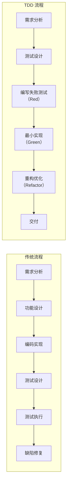
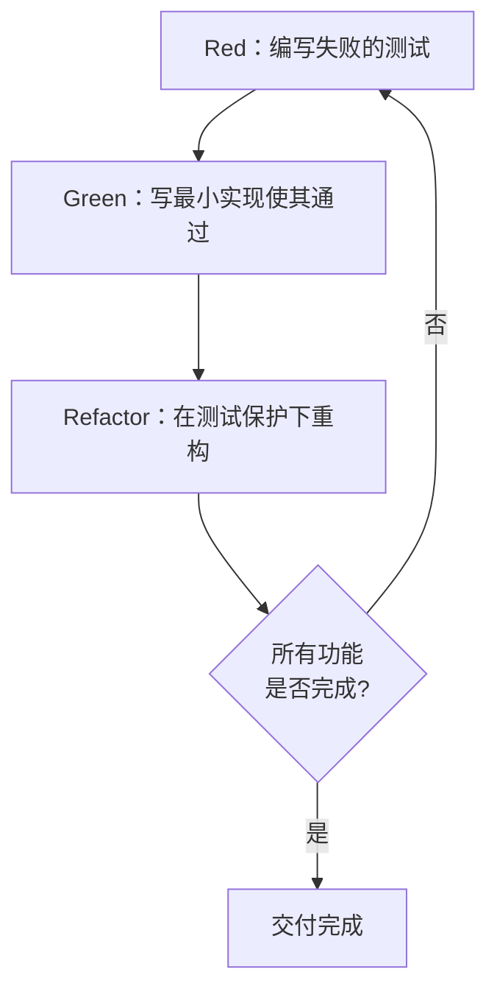
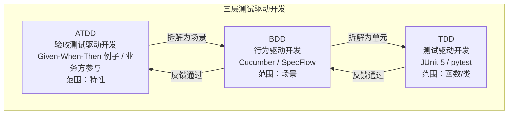

# TDD 红-绿-重构循环

测试驱动开发（Test-Driven Development，TDD）并不是一门测试技术，而是一种以测试为驱动力的开发理念。它的颠覆性在于：**在编写产品代码之前，先编写会失败的测试代码**，再写刚好让测试通过的最小实现，最后在测试保护下重构。本文围绕"红-绿-重构"循环展开，结合 JUnit 5 与 pytest 的逐步演示，并补充 2024-2026 年 AI 辅助 TDD、Property-Based Testing、Mutation Testing、微服务 TDD 等新趋势。

## 一、核心概念

### 1.1 TDD 是什么

> **TDD** 是一种以测试为先的开发实践：每一行产品代码都由一个先于它存在且失败的测试驱动产生，整个开发过程由"红-绿-重构"循环以小步节奏推进。

三个关键约束：

- **测试先行**：测试代码先于产品代码出现，且必须在运行后确认失败（红）；
- **最小实现**：只写让测试通过的最少代码，不多写一个分支（绿）；
- **测试保护下重构**：在所有测试通过的安全网内改进设计，不引入新行为（重构）。

### 1.2 与传统"先开发后测试"的对比

传统流程中，测试是编码之后的环节，缺陷发现滞后；TDD 将测试前置到需求定义层，每一小步都有测试保驾护航。



### 1.3 红-绿-重构循环



- **Red**：为新行为添加一个测试，运行后确认它因功能缺失而失败；
- **Green**：写最少的实现代码让测试转绿，允许丑陋、重复；
- **Refactor**：消除重复、改善命名、提取抽象，所有测试必须保持绿色。

每轮循环的粒度通常以"一个断言"或"一小步行为"为单位，整个开发由成百上千个微小循环累加而成。

## 二、TDD 三定律

Robert C. Martin（Uncle Bob）在《Clean Code》中提出 TDD 三定律，是循环节奏的硬性约束：

1. **First Law**：除非是为了使一个失败的单元测试通过，否则不允许编写任何产品代码；
2. **Second Law**：不允许编写超出足以导致失败的单元测试代码（编译失败也算失败）；
3. **Third Law**：不允许编写超出足以通过测试的产品代码。

三定律共同把开发节奏压到极小：写一行测试 → 看它失败 → 写一行实现 → 看它通过 → 重构。这种"小步快走"带来三个收益：

- **即时反馈**：每 30 秒到 2 分钟就知道自己有没有写错；
- **高覆盖率**：每一行产品代码天然对应一个先于它存在的测试；
- **设计压力**：为了便于先写测试，被测代码必须松耦合、依赖可注入，TDD 因此也是设计工具。

实践要点：

- **测试列表（Task List）**：开始一个功能前，先在便签上列出待实现的测试点，逐条推进，避免一次性写一堆测试；
- **一个测试只验证一件事**：多断言可以，但应围绕同一行为；
- **测试必须失败**：每次 Red 都要真运行一次，确认失败原因正确，避免"假绿"。

## 三、TDD 实战

### 3.1 Java（JUnit 5）：生日倒计时

需求：输入生日（`yyyy-MM-dd`），返回距下次生日的天数。

**第 1 轮 Red —— 输入 null 应抛异常**

```java
import static org.junit.jupiter.api.Assertions.*;
import org.junit.jupiter.api.Test;
import org.junit.jupiter.api.DisplayName;

class BirthdayCalculatorTest {

    @Test
    @DisplayName("输入 null 时应抛出 IllegalArgumentException")
    void shouldThrowWhenBirthdayIsNull() {
        // 断言：调用 calculate(null) 应抛出 IllegalArgumentException
        IllegalArgumentException ex = assertThrows(
            IllegalArgumentException.class,
            () -> BirthdayCalculator.calculate(null)
        );
        assertEquals("birthday must not be null or empty", ex.getMessage());
    }
}
```

此时 `BirthdayCalculator` 类还不存在，编译失败——这正是 Red。

**第 1 轮 Green —— 最小实现**

```java
public final class BirthdayCalculator {
    public static int calculate(String birthday) {
        throw new IllegalArgumentException("birthday must not be null or empty");
    }
}
```

直接抛异常即可让测试通过，**不要**提前写解析逻辑（三定律第三条）。

**第 2 轮 Red —— 输入空字符串**

```java
@Test
@DisplayName("输入空字符串也应抛出异常")
void shouldThrowWhenBirthdayIsEmpty() {
    assertThrows(IllegalArgumentException.class,
        () -> BirthdayCalculator.calculate(""));
}
```

**第 2 轮 Green —— 增加空串判断**

```java
public static int calculate(String birthday) {
    if (birthday == null || birthday.isEmpty()) {
        throw new IllegalArgumentException("birthday must not be null or empty");
    }
    throw new UnsupportedOperationException("not implemented");
}
```

**第 3 轮 Red —— 格式非法**

```java
@Test
@DisplayName("格式非法应抛出异常")
void shouldThrowWhenFormatInvalid() {
    assertThrows(IllegalArgumentException.class,
        () -> BirthdayCalculator.calculate("1996/09/03"));
}
```

**第 3 轮 Green —— 引入 java.time 解析**

```java
private static final DateTimeFormatter FMT =
    DateTimeFormatter.ofPattern("yyyy-MM-dd");

public static int calculate(String birthday) {
    if (birthday == null || birthday.isEmpty()) {
        throw new IllegalArgumentException("birthday must not be null or empty");
    }
    try {
        LocalDate.parse(birthday, FMT);
    } catch (DateTimeParseException e) {
        throw new IllegalArgumentException("birthday format is invalid");
    }
    throw new UnsupportedOperationException("not implemented");
}
```

**第 4 轮 Red —— 今天就是生日应返回 0**

```java
@Test
@DisplayName("今天恰好是生日，应返回 0")
void shouldReturnZeroWhenTodayIsBirthday() {
    String today = LocalDate.now().format(DateTimeFormatter.ISO_LOCAL_DATE);
    assertEquals(0, BirthdayCalculator.calculate(today));
}
```

**第 4 轮 Green —— 计算天数**

```java
public static int calculate(String birthday) {
    if (birthday == null || birthday.isEmpty()) {
        throw new IllegalArgumentException("birthday must not be null or empty");
    }
    LocalDate birthDate;
    try {
        birthDate = LocalDate.parse(birthday, FMT);
    } catch (DateTimeParseException e) {
        throw new IllegalArgumentException("birthday format is invalid");
    }
    LocalDate today = LocalDate.now();
    LocalDate next = birthDate.withYear(today.getYear());
    if (next.isBefore(today)) {
        next = next.plusYears(1);
    }
    return (int) ChronoUnit.DAYS.between(today, next);
}
```

**Refactor —— 提取私有方法、统一异常构建**

将解析与计算拆为 `parseBirthday` 与 `daysToNext` 两个私有方法，所有测试仍保持绿色——这就是测试保护下重构的本质。

### 3.2 Python（pytest）：FizzBuzz

需求：输入整数 n，返回 FizzBuzz 串——能被 3 整除返回 `Fizz`，能被 5 整除返回 `Buzz`，同时整除返回 `FizzBuzz`，否则返回字符串形式的 n。

**Red 1 —— 普通数字**

```python
# test_fizzbuzz.py
from fizzbuzz import fizzbuzz

def test_普通数字返回自身字符串():
    assert fizzbuzz(1) == "1"
```

运行 `pytest` 应报 `ModuleNotFoundError`。

**Green 1**

```python
# fizzbuzz.py
def fizzbuzz(n: int) -> str:
    return "1"
```

**Red 2 —— 参数化覆盖多个分支**

```python
import pytest

@pytest.mark.parametrize("n,expected", [
    (1, "1"),
    (2, "2"),
    (3, "Fizz"),
    (5, "Buzz"),
    (15, "FizzBuzz"),
    (30, "FizzBuzz"),
])
def test_fizzbuzz(n, expected):
    assert fizzbuzz(n) == expected
```

**Green 2**

```python
def fizzbuzz(n: int) -> str:
    if n % 15 == 0:
        return "FizzBuzz"
    if n % 3 == 0:
        return "Fizz"
    if n % 5 == 0:
        return "Buzz"
    return str(n)
```

**Refactor**：用 `@pytest.fixture` 抽出测试数据、或把 `15` 改写为 `3 * 5` 提升可读性，全量测试保持通过即完成。

## 四、TDD 与重构

### 4.1 何时重构

- **规则一（童子军规则）**：每完成一个 Green，回头看看是否能改善命名、提取常量、消除重复；
- **规则二（三次法则）**：第三处重复出现时再抽象，避免过度设计；
- **规则三（坏味道驱动）**：发现长方法、过大类、特性依恋等坏味道立即处理，但每次只动一处。

### 4.2 安全重构的前提

重构必须满足两个不变量：

1. **外部行为不变**：测试就是行为的可执行规约；
2. **每步可回滚**：每做一步都跑一次测试，红就回退。

### 4.3 IDE 支持的安全重构

| 工具 | 关键重构 | 安全性 |
|------|----------|--------|
| IntelliJ IDEA | Rename / Extract Method / Inline / Change Signature | 基于语法树，行为保持 |
| Eclipse | Refactor 菜单 / Move / Pull Up | 基于语法树 |
| VS Code（Java 扩展） | Rename / Extract / Inline | 依赖 Red Hat Java LSP |
| PyCharm | Rename / Extract Method / 移动符号 | 基于语法树 |

原则：**优先使用 IDE 的语义级重构，而非文本查找替换**；每次重构后立刻运行测试，绿了再继续下一步。

## 五、TDD 与 BDD/ATDD：三层测试驱动开发

TDD 关注"是否把事做正确"（代码级），BDD 关注"是否做了正确的行为"（行为级），ATDD 关注"是否做了正确的事"（验收级）。三者共同构成"三层测试驱动开发"。



- **ATDD**：从业务验收视角先写验收测试（如 FitNesse、Selenium），驱动团队对"做什么"达成共识；
- **BDD**：使用 Given-When-Then 自然语言描述场景（Cucumber、SpecFlow），是业务与开发之间的桥梁；
- **TDD**：将场景拆解为函数级单元测试，驱动代码实现。

边界关系：上层测试通过下层测试支撑；下层测试不直接覆盖业务语义，但为上层提供快速反馈。三者并非替代，而是层层细化。

## 六、2024-2026 新趋势

### 6.1 AI 辅助 TDD

GitHub Copilot、Cursor、JetBrains AI Assistant 等工具改变了 TDD 的"成本曲线"：

- **生成测试骨架**：开发者写一个方法签名，AI 自动生成参数化测试列表；
- **红阶段加速**：AI 识别"测试驱动"上下文，给出最小实现建议，开发者只做 review；
- **变异式建议**：AI 主动提出"边界值""异常路径"用例，弥补人类盲点。

典型工作流：

```
开发者：写一个 pytest 测试，验证 fizzbuzz(3) == "Fizz"
Copilot：自动补全测试 + 给出 fizzbuzz 最小实现
开发者：运行测试 → 绿 → 让 AI 提出更刁钻的边界用例 → 再循环
```

注意：AI 生成的测试**必须人工确认是否真正失败过**——AI 容易写出永远为绿的"假测试"。TDD 的"红"不可省略，AI 只是加速器。

### 6.2 Property-Based Testing

传统 TDD 是"例子驱动"（Example-Based），每个用例覆盖一个具体输入输出。Property-Based Testing（PBT）让开发者描述"性质"而非"例子"，由框架自动生成上百个随机输入验证不变量。

- **Hypothesis**（Python）：`@given` 装饰器 + 策略；
- **jqwik**（Java/JVM）：JUnit 5 原生集成的 PBT 引擎；
- **fast-check**（JS/TS）：生态最活跃的 PBT 库。

PBT 与 TDD 的结合：先写一个例子驱动 Red→Green，再补充性质测试覆盖"任意输入"下的不变量，形成"例子定方向 + 性质定边界"的双层保护。

```python
# Python + Hypothesis：FizzBuzz 性质测试
from hypothesis import given, strategies as st
from fizzbuzz import fizzbuzz

@given(st.integers(min_value=1, max_value=10_000))
def test_任意能被15整除的数都返回FizzBuzz(n):
    if n % 15 == 0:
        assert fizzbuzz(n) == "FizzBuzz"

@given(st.integers(min_value=1, max_value=10_000))
def test_结果长度不超过8(n):
    # "FizzBuzz" 长度为 8，是所有结果中最长的
    assert len(fizzbuzz(n)) <= 8
```

### 6.3 Mutation Testing：验证测试本身的有效性

100% 覆盖率 ≠ 测试有效。Mutation Testing 通过对产品代码注入"变异"（如把 `>` 改成 `>=`、`+` 改成 `-`、删除某行）来检测测试是否真能抓住错误：

- **PIT**（Java/JVM）：与 JUnit 5 / Maven / Gradle 集成成熟；
- **mutmut**（Python）：对纯 Python 项目友好；
- **Stryker**（JS/TS/.NET）：生态最活跃。

实践：在 CI 中对核心模块运行 Mutation Testing，**变异杀死率（Mutation Score）** 作为测试有效性的进阶指标，比行覆盖率更可信。与 TDD 结合时，PBT 通常能显著提升 Mutation Score，因为随机输入更容易暴露被变异的边界。

### 6.4 微服务中的 TDD

微服务架构下，TDD 的"隔离"原则面临服务间依赖、分布式数据、异步消息等挑战，2024-2026 的主流方案：

- **单元层**：Mockito / pytest-mock 模拟下游服务客户端，TDD 节奏不变；
- **契约层**：用 **Pact** 做消费者驱动的契约测试（CDC），先写消费者期望的 JSON 契约，再驱动提供方实现；
- **集成层**：用 **Testcontainers** 启动真实 Postgres/Redis/Kafka 容器，避免 Mock 与真实行为漂移；
- **服务虚拟化**：**WireMock / Mountebank** 在 CI 中模拟第三方 HTTP/gRPC 服务，让 TDD 循环不被外部依赖卡住；
- **事件驱动**：对 Kafka/NATS 消息流，使用 `EmbeddedKafka` 或 Testcontainers + `awaitility` 编写"消息级"红绿循环。

测试金字塔在微服务下被重塑为"测试奖杯"——大量契约测试 + 单元测试，少量端到端测试，强调反馈速度。

## 七、常见陷阱与最佳实践

### 7.1 常见陷阱

| 陷阱 | 现象 | 应对 |
|------|------|------|
| **假绿测试** | 测试永远为绿，没真正失败过 | 每次红必须真运行确认失败 |
| **测试实现细节** | 重命名私有字段就破坏测试 | 只断言公共行为，不窥探内部 |
| **一步到位** | 一次写 10 个测试再实现 | 三定律：一次一个失败测试 |
| **过度 Mock** | Mock 自己拥有的类 | 只 Mock 外部依赖，自己的类用真实对象 |
| **跳过重构** | Green 后直接写下一个测试 | 重构是循环的一部分，不可省略 |
| **AI 全自动** | 让 AI 生成测试不审阅 | 红阶段必须人工确认 |

### 7.2 最佳实践

1. **测试命名表达意图**：`shouldReturnZeroWhenTodayIsBirthday` 而非 `test1`；
2. **AAA 结构**：Arrange-Act-Assert，每个测试三段清晰；
3. **测试与生产代码 1:1 目录映射**：Maven Surefire、pytest 默认约定即如此；
4. **快速反馈**：全量单元测试应在分钟级内完成，慢测试下沉到集成层；
5. **覆盖率门禁**：JaCoCo/coverage.py 设定阈值，但**不追求 100%**——重点覆盖核心路径；
6. **Mutation Score 作为进阶门禁**：对核心域模型模块启用，避免"覆盖率虚高"；
7. **AI 辅助但不替代**：用 AI 生成测试骨架与边界用例建议，红阶段与重构仍由开发者主导。

## 总结

- TDD 的本质是"测试先行 + 最小实现 + 测试保护下重构"的三步循环，由 Robert Martin 三定律约束节奏；
- 红阶段必须真失败、绿阶段只写最小实现、重构阶段行为不变——三者缺一不可；
- JUnit 5 与 pytest 都能优雅支撑 TDD，关键在于"小步快走"而非工具本身；
- TDD、BDD、ATDD 构成三层测试驱动开发，分别覆盖代码级、行为级、验收级；
- 2024-2026 的 AI 辅助 TDD、Property-Based Testing、Mutation Testing 正在重塑 TDD 的成本曲线，但"红必须真失败"的内核不变；
- 微服务下 TDD 需结合 Pact 契约测试、Testcontainers、WireMock 等工具，重塑测试金字塔为"测试奖杯"。

> **核心箴言**：TDD 不是关于测试的，而是关于设计的；测试只是它的副产品。
