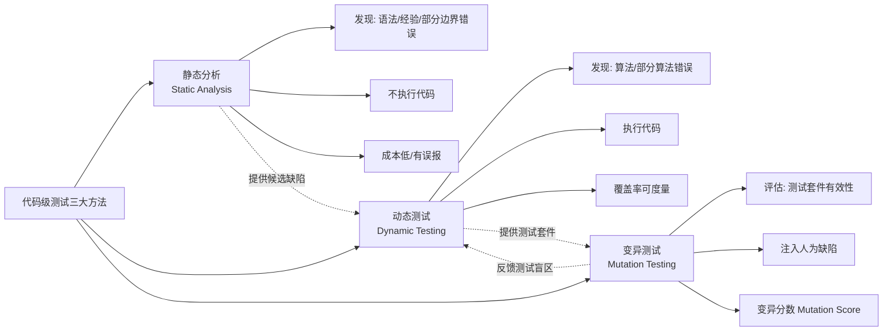
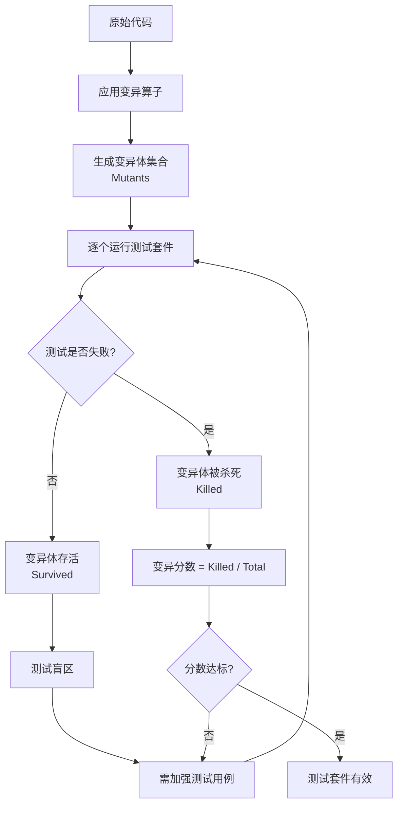

# 代码级测试（静态分析与动态测试与变异测试）

代码级测试是软件质量保障的基石，其方法体系并非单一技术，而是**静态分析、动态测试、变异测试三类方法的协同集合**。静态分析在不执行代码的前提下发现"有特征"缺陷；动态测试通过执行代码验证业务逻辑与边界行为；变异测试则通过注入人为缺陷反向评估测试套件的有效性。三者递进配合，共同构成现代代码级测试的完整闭环。

## 一、核心概念：代码级测试的三大方法

代码级测试的目标是发现并修复代码层面的问题，包括语法错误、边界异常、经验性误用、算法偏差以及安全漏洞。这三类方法在缺陷发现能力上各有侧重，且具有明确的互补关系：

- **静态分析（Static Analysis）**：基于词法、语法、控制流与数据流分析，在不运行代码的情况下发现语法特征、经验特征与部分边界特征错误，是"测试左移"的起点。
- **动态测试（Dynamic Testing）**：通过实际执行代码验证业务逻辑，覆盖算法错误与部分算法错误，并通过覆盖率指标度量测试充分性，是发现功能缺陷的主力。
- **变异测试（Mutation Testing）**：通过系统性地向代码注入变异（如将 `>` 改为 `>=`、`+` 改为 `-`），检验现有测试用例能否捕获这些人为缺陷，是衡量"测试有效性"的金标准。



三者构成"发现缺陷→验证逻辑→评估测试"的递进闭环：静态分析快速拦截低级问题，动态测试深入业务逻辑，变异测试反向验证测试套件是否能真正捕获缺陷。

## 二、静态分析：规则体系与 CI 集成

静态分析的核心价值在于**以极低成本批量发现"有特征"的缺陷**，包括未初始化变量、空指针解引用、数组越界、不可达代码、过高圈复杂度、重复代码块以及 SQL 注入、硬编码密钥等安全漏洞。但其本质局限在于：**无法理解业务逻辑**，对算法错误和部分算法错误无能为力，且必然存在一定误报率。

### 2.1 主流工具与选型

当前静态分析工具生态呈现"平台型 + 专项型 + 安全型"三层结构：

| 工具 | 类型 | 语言支持 | 核心定位 |
|------|------|----------|----------|
| **SonarQube 10.x** | 平台型 | 30+ 语言 | 全生命周期质量管理、Quality Gate、Clean as You Code |
| **SpotBugs 4.x** | 专项型 | Java | 基于 FindBugs 演进，缺陷模式检测 |
| **ESLint 9.x** | 专项型 | JavaScript/TypeScript | Flat Config、生态丰富、IDE 集成好 |
| **Pylint 3.x** | 专项型 | Python | 配置粒度细、与 Ruff 互补 |
| **Semgrep** | 安全型 | 多语言 SAST | 规则即代码（YAML）、自定义规则门槛低 |

> **选型建议**：企业级项目采用"SonarQube 作为统一平台 + 语言专项工具（ESLint/Ruff/SpotBugs）作为补充 + Semgrep 做安全审计"的组合策略，是当前最主流的落地路径。

### 2.2 SonarQube 规则体系与 Clean as You Code

SonarQube 的 **Clean as You Code** 理念：Quality Gate 仅针对**新代码**强制检查，要求每次提交零新增问题，而非试图偿还全部历史技术债。这一理念使静态分析从"全员整改"转向"增量拦截"，极大降低了落地阻力。

SonarQube 的核心抽象包括：**Rules**（规则，按 Severity 分为 Blocker/High/Medium/Low/Info）、**Quality Profile**（规则集合）、**Quality Gate**（质量门禁指标，如新增 Bug 数、覆盖率、重复率）。

```xml
<!-- Maven 项目集成 SonarQube：pom.xml 关键配置 -->
<plugin>
    <groupId>org.sonarsource.scanner.maven</groupId>
    <artifactId>sonar-maven-plugin</artifactId>
    <version>5.0.0.4389</version>
    <!-- 通过 sonar.token 认证（v10 起废弃 sonar.login） -->
</plugin>

<!-- 同时在 settings.xml 中配置 sonar.host.url 与 sonar.token -->
<!-- 扫描命令：mvn clean verify sonar:sonar -->
```

### 2.3 CI 集成与 PR Decoration

静态分析真正发挥价值的关键在于**与 CI/CD 流水线深度集成**，将扫描结果以 PR 行内注释（PR Decoration）形式反馈到代码评审环节，并在 Quality Gate 未通过时阻断合并：

```yaml
# .github/workflows/sonarqube.yml —— GitHub Actions 集成
name: SonarQube Analysis
on:
  pull_request:
    types: [opened, synchronize, reopened]
jobs:
  sonarqube:
    runs-on: ubuntu-latest
    steps:
      - uses: actions/checkout@v4
        with:
          fetch-depth: 0  # SonarQube 需要完整 Git 历史计算新代码
      - uses: SonarSource/sonarqube-scan-action@v5
        env:
          SONAR_TOKEN: ${{ secrets.SONAR_TOKEN }}
          SONAR_HOST_URL: ${{ secrets.SONAR_HOST_URL }}
```

### 2.4 Semgrep 多语言 SAST

Semgrep 的差异化价值在于**规则即代码**：用 YAML 描述匹配模式，无需编译即可扫描，且规则可版本化、可共享。它特别适合企业自定义安全策略（如禁止使用某些危险 API、强制要求参数校验）：

```yaml
# Semgrep 自定义规则示例：禁止硬编码密钥
rules:
  - id: hardcoded-secret-detection
    pattern-regex: '(api[_-]?key|secret)\s*[:=]\s*["''][^"'']{16,}["'']'
    languages: [python, javascript, java]
    message: 检测到硬编码密钥，应改用环境变量或密钥管理服务
    severity: ERROR
```

## 三、动态测试：代码覆盖率与模糊测试

动态测试通过实际执行代码发现缺陷，其核心能力在于**验证业务逻辑正确性**。本节聚焦两个关键维度：覆盖率度量（衡量测试充分性）与模糊测试（自动发现边界异常）。

### 3.1 代码覆盖率：JaCoCo 与 coverage.py

代码覆盖率是动态测试最基础的质量度量指标，常见维度包括行覆盖率（Line）、分支覆盖率（Branch）、方法覆盖率（Method）。需要明确：**高覆盖率不等于高质量**——覆盖率只回答"是否执行过"，不回答"是否验证过"。

**JaCoCo（Java）** 通过字节码插桩收集覆盖率数据，与 Maven/Gradle 深度集成：

```xml
<!-- JaCoCo Maven 配置：pom.xml -->
<plugin>
    <groupId>org.jacoco</groupId>
    <artifactId>jacoco-maven-plugin</artifactId>
    <version>0.8.12</version>
    <executions>
        <execution>
            <id>prepare-agent</id>
            <goals><goal>prepare-agent</goal></goals>
        </execution>
        <execution>
            <id>report</id>
            <phase>test</phase>
            <goals><goal>report</goal></goals>
        </execution>
        <execution>
            <id>check</id>
            <goals><goal>check</goal></goals>
            <configuration>
                <rules>
                    <rule>
                        <element>BUNDLE</element>
                        <limits>
                            <!-- 行覆盖率门槛：80% -->
                            <limit>
                                <counter>LINE</counter>
                                <value>COVEREDRATIO</value>
                                <minimum>0.80</minimum>
                            </limit>
                            <!-- 分支覆盖率门槛：70% -->
                            <limit>
                                <counter>BRANCH</counter>
                                <value>COVEREDRATIO</value>
                                <minimum>0.70</minimum>
                            </limit>
                        </limits>
                    </rule>
                </rules>
            </configuration>
        </execution>
    </executions>
</plugin>
```

**coverage.py（Python）** 是 Python 生态的事实标准，与 pytest 原生集成：

```bash
# 运行测试并收集覆盖率
coverage run -m pytest
coverage report -m          # 终端报告，显示未覆盖行号
coverage html               # 生成 HTML 详细报告
# 配置文件 .coveragerc 可设置 source、omit、fail_under 等门槛
```

### 3.2 模糊测试：libFuzzer 与 Jazzer

模糊测试（Fuzzing）通过向被测程序输入大量半随机变异数据，并监控代码覆盖率反馈，逐步探索深层路径，是自动发现**边界行为特征错误**（崩溃、异常、超时、内存破坏）的高效手段。它弥补了人工测试难以穷举边界输入的不足。

| 工具 | 语言/平台 | 核心特点 |
|------|-----------|----------|
| **libFuzzer** | C/C++（LLVM） | 进程内 Fuzzing，与 Clang 编译器深度集成 |
| **Jazzer** | Java | 基于 JVM 的覆盖率引导 Fuzzing，可发现安全漏洞 |
| **Go native fuzz** | Go 1.18+ | 标准库原生支持 |
| **Atheris** | Python | 基于 libFuzzer 的 Python Fuzzer |

**Jazzer 示例**（Java）：

```java
// Jazzer 模糊测试示例：自动发现解析函数的边界异常
import com.code_intelligence.jazzer.api.FuzzedDataProvider;

public class ParserFuzzTest {
    public static void fuzzerTestOneInput(FuzzedDataProvider data) {
        String input = data.consumeRemainingAsString();
        try {
            // 不验证具体返回值，只关注是否触发未预期异常
            Parser.parse(input);
        } catch (IllegalArgumentException e) {
            // 业务预期的异常，吞掉
        }
        // 其他异常（如 NullPointerException）将被 Jazzer 记录为缺陷
    }
}
```

**libFuzzer 在 OSS-Fuzz 中的实践**：Google OSS-Fuzz 自 2016 年起为开源项目提供持续模糊测试服务，截至 2025 年已发现超过 4 万个缺陷，模糊测试已成为安全关键项目的标准 CI 环节。

## 四、变异测试：验证测试有效性

变异测试回答一个静态分析和覆盖率都无法回答的问题：**现有测试用例是否真的能捕获缺陷？** 高覆盖率只说明代码被执行过，不说明断言足够强——若所有断言都被注释掉，覆盖率可能不变，但测试已完全失效。

### 4.1 变异测试原理

变异测试的核心思路是：**系统性地向代码注入小范围人为修改（变异算子），生成变异体（Mutant），然后运行测试套件**。若测试失败，则该变异体被"杀死"（Killed）；若测试通过，则变异体"存活"（Survived）——存活的变异体意味着测试存在盲区。**变异分数（Mutation Score）= 被杀死的变异体数 / 总变异体数**，是衡量测试套件有效性的金标准。



### 4.2 变异算子

常见的变异算子按修改目标分类：

- **算术运算符变异**：`+` → `-`、`*` → `/`、`%` → `*`
- **关系运算符变异**：`>` → `>=`、`==` → `!=`、`<` → `<=`
- **逻辑运算符变异**：`&&` → `||`、`!` → （删除）
- **常量变异**：`0` → `1`、`true` → `false`
- **语句删除变异**：删除某条语句（如 `return` 语句、赋值语句）

### 4.3 PIT（Java）与 mutmut（Python）

**PIT（pitest）** 是 Java 生态最成熟的变异测试工具，与 Maven/Gradle 集成：

```xml
<!-- PIT pitest Maven 配置：pom.xml -->
<plugin>
    <groupId>org.pitest</groupId>
    <artifactId>pitest-maven</artifactId>
    <version>1.16.1</version>
    <dependencies>
        <!-- 支持 JUnit 5 -->
        <dependency>
            <groupId>org.pitest</groupId>
            <artifactId>pitest-junit5-plugin</artifactId>
            <version>1.2.1</version>
        </dependency>
    </dependencies>
    <configuration>
        <targetClasses>
            <param>com.example.*</param>  <!-- 待变异的目标类 -->
        </targetClasses>
        <targetTests>
            <param>com.example.*Test</param>  <!-- 测试类 -->
        </targetTests>
        <mutators>
            <mutator>STRONGER</mutator>  <!-- 启用更强算子集 -->
        </mutators>
        <outputFormats>
            <param>HTML</param>           <!-- HTML 报告 -->
            <param>XML</param>
        </outputFormats>
        <mutationThreshold>85</mutationThreshold>  <!-- 变异分数门槛 85% -->
    </configuration>
</plugin>
<!-- 执行命令：mvn org.pitest:pitest-maven:mutationCoverage -->
```

**mutmut（Python）** 是 Python 生态的主流选择，基于 AST 修改源码：

```bash
# mutmut 使用流程
mutmut run                    # 运行变异测试
mutmut results                # 查看结果
mutmut show <mutant-id>       # 查看具体变异内容
mutmut html                   # 生成 HTML 报告
# 配置文件 pyproject.toml 的 [tool.mutmut] 段中可指定 paths_to_mutate 与 tests_dir
```

### 4.4 变异测试的成本与适用场景

变异测试的主要成本在于**计算开销**：N 个变异体需要运行 N 次测试套件，对大型项目可能耗时数小时。因此实践中通常**只在核心模块、安全关键代码或回归测试套件上定期执行**，而非每次提交都跑。变异分数门槛建议初始设为 60%-70%，逐步提升至 85% 以上。

## 五、三种方法的协同：静态→动态→变异的递进验证

三种方法并非孤立存在，而是构成一个递进验证链路：

1. **静态分析先行**：在 IDE 与 PR 阶段拦截"有特征"缺陷，避免低级问题进入测试阶段，降低动态测试的噪声。
2. **动态测试验证逻辑**：单元测试 + 覆盖率门禁验证业务逻辑，覆盖算法错误与部分算法错误。覆盖率作为下限指标，确保基本执行充分性。
3. **变异测试评估有效性**：对核心模块定期运行变异测试，发现"高覆盖率但弱断言"的盲区，驱动测试用例强化。

这一链路的关键在于**反馈闭环**：变异测试发现的盲区会反向驱动动态测试用例的补强，而静态分析发现的潜在缺陷模式可转化为新的测试断言。

## 六、2024-2026 新趋势

### 6.1 AI 辅助静态分析

2024 年以来，AI 辅助静态分析快速落地。**GitHub Copilot Security**、**CodeRabbit**、**SonarQube AI Code Fix**（v10.x 引入）等工具结合大语言模型，在传统规则扫描之外提供：自然语言缺陷解释、修复建议生成、误报自动抑制。其价值不在于替代规则引擎，而在于**降低开发者理解与修复缺陷的成本**，特别是对安全漏洞类问题。需要注意的是，AI 建议仍需人工评审，避免引入新缺陷。

### 6.2 SAST/DAST/IAST 融合

传统安全测试三大范式各有局限：SAST（静态应用安全测试）误报高但覆盖早；DAST（动态应用安全测试）从外部攻击视角发现真实漏洞但覆盖晚；IAST（交互式应用安全测试）在运行时通过 Agent 插桩结合代码上下文，误报率低且定位精准。2024-2026 的趋势是**三者融合**——以 SAST 在编码阶段拦截已知模式，以 IAST 在测试阶段验证可利用性，以 DAST 在预发阶段模拟真实攻击，形成"开发-测试-预发"全链路安全测试闭环。

### 6.3 Property-Based Testing（Hypothesis）

属性驱动测试（PBT）不再枚举具体输入输出对，而是定义代码应满足的**通用属性**，由框架自动生成大量随机输入验证属性成立。它与参数化测试互补：参数化测试覆盖已知组合，PBT 自动探索未知边界。

```python
# Python Hypothesis 示例：验证字符串编解码的通用属性
from hypothesis import given, strategies as st

@given(st.text())  # 自动生成任意 Unicode 字符串
def test_encode_decode_roundtrip(s):
    """编解码往返属性：encode 后 decode 应得到原字符串"""
    encoded = s.encode('utf-8')
    decoded = encoded.decode('utf-8')
    assert decoded == s

@given(st.lists(st.integers(min_value=0, max_value=1000)))
def test_sum_non_negative(xs):
    """非负数列表求和结果非负"""
    assert sum(xs) >= 0
```

PBT 的核心价值在于 **Shrinking 机制**：当某个随机输入导致属性失败时，框架会自动将其缩小为最小可复现用例，便于开发者快速定位问题。主流 PBT 框架包括 Hypothesis（Python）、fast-check（JS/TS）、jqwik（Java）。

## 七、常见陷阱与最佳实践

### 7.1 常见陷阱

- **唯覆盖率论**：将覆盖率作为唯一目标，导致测试用例只执行不验证，覆盖率虚高但实际有效性低。应配合变异测试与断言强度审查。
- **静态分析规则全开**：直接启用全部规则导致误报淹没真实问题，团队逐渐忽视扫描结果。应基于项目实际定制 Quality Profile，逐步收紧。
- **模糊测试无种子语料**：仅依赖随机变异难以触及深层协议解析逻辑，应提供高质量种子语料（如真实请求样本）作为起点。
- **变异测试全量运行**：在大型项目全量运行变异测试耗时过长，应限定到核心模块并定期执行（如每周一次），而非每次提交。
- **IAST 与 SAST 结果割裂**：分别查看两类工具结果，未交叉验证。应建立统一的缺陷管理视图，对 SAST 报告的项用 IAST 验证可利用性。

### 7.2 最佳实践

1. **分层落地静态分析**：IDE 端 SonarLint 实时反馈 + PR 阶段 SonarScanner 扫描 + Quality Gate 阻断合并，形成三层防线。
2. **覆盖率作为下限而非目标**：设置 70%-80% 的覆盖率下限用于拦截明显未测试代码，但通过代码评审与变异测试保障断言质量。
3. **模糊测试聚焦解析逻辑**：将模糊测试资源集中投入解析器、协议处理、反序列化等输入边界明确的模块，ROI 最高。
4. **变异测试驱动测试改进**：将变异分数纳入核心模块的 CI 质量门禁，定期审查存活变异体并补强测试用例。
5. **三方法结果统一治理**：将静态分析、动态测试、变异测试的缺陷数据统一汇入 SonarQube 或等效平台，建立跨方法的代码质量视图。

## 总结

代码级测试的三大方法构成完整的质量保障闭环：**静态分析**以低成本批量拦截"有特征"缺陷，是测试左移的起点；**动态测试**通过执行代码验证业务逻辑，覆盖率指标衡量执行充分性，模糊测试自动探索边界异常；**变异测试**反向评估测试套件有效性，是发现"高覆盖但弱断言"盲区的金标准。三者递进协同，结合 2024-2026 的 AI 辅助分析、SAST/DAST/IAST 融合与 Property-Based Testing 等新趋势，正在推动代码级测试从"被动发现缺陷"走向"主动评估测试有效性"的新阶段。
