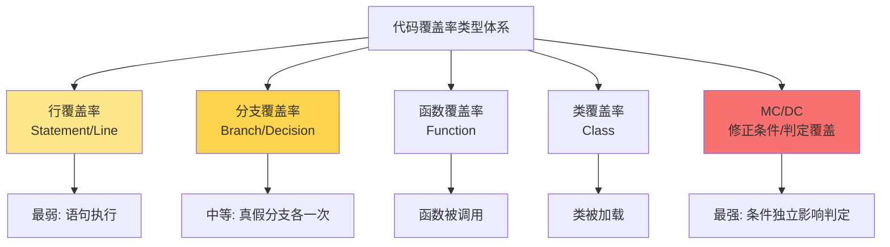
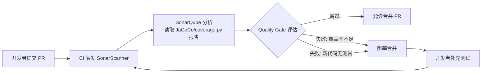

# 测试覆盖率工具（JaCoCo 与 coverage.py 与 SonarQube）

测试覆盖率（Test Coverage）是衡量测试充分性的量化指标，也是现代 CI/CD 质量门禁的核心输入。然而，"100% 覆盖率等于无缺陷"是工程实践中最常见的误区。本文围绕覆盖率的**定义、类型体系、工具落地与质量门禁**展开，覆盖 JaCoCo 0.8.x、coverage.py 7.x、SonarQube 10.x、diff-cover 等主流工具链，并补充 2024-2026 年 AI 辅助盲区识别、MC/DC 在安全关键系统中的落地、Codecov 云端服务等新趋势。

## 一、核心概念：定义、价值与误区

### 1.1 什么是测试覆盖率

> **测试覆盖率**是指，在测试执行过程中，至少被执行了一次的条目数占整个可执行条目数的百分比。

"条目"的粒度决定了覆盖率的类型：以语句为条目即得行覆盖率，以判定分支为条目即得分支覆盖率，以函数为条目即得函数覆盖率。覆盖率本质上回答的是"**已有代码的哪些逻辑被执行过**"这一问题，而非"逻辑是否正确"。

### 1.2 为什么需要覆盖率

覆盖率在工程实践中有三个不可替代的价值：

- **发现遗漏路径**：识别尚未被测试执行的代码段，作为补充测试用例的依据
- **识别废弃代码**：定位因需求变更等原因产生的不可达 Dead Code
- **质量门禁输入**：在 CI/CD 流水线中作为合并代码的量化门槛，防止覆盖率劣化

### 1.3 覆盖率误区：必要非充分

覆盖率是质量的**必要条件，而非充分条件**。三大典型误区必须澄清：

1. **100% 覆盖率 ≠ 无缺陷**：覆盖率只统计"执行过"，不验证"执行对了"。一个仅有一行 `return null` 的函数，行覆盖率 100% 但功能完全缺失。
2. **覆盖率指标不可跨项目直接比较**：JaCoCo 的分支覆盖率与 coverage.py 的分支覆盖率在算法上并不等价，跨语言对比无意义。
3. **覆盖率与成本呈指数关系**：从 60% 提升到 80% 的成本远低于从 90% 提升到 100%。Google 测试博客《Code Coverage Best Practices》曾建议 70%-75% 为合理区间、90%+ 需特殊理由（该文 2023 年修订后已收回具体数字，建议关注覆盖率趋势而非绝对阈值）。

## 二、覆盖率类型体系：从行覆盖到 MC/DC



各类型定义与示例对比如下，以 `if (a > 0 && b > 0)` 为基准表达式：

| 类型 | 定义 | 示例要求 | 强度 |
|------|------|----------|------|
| 行覆盖率 | 已执行语句占比 | `if` 行被执行一次即可 | 最弱 |
| 分支覆盖率 | 判定真假各取一次 | 整体表达式取 TRUE 和 FALSE 各一次 | 中 |
| 条件覆盖率 | 每个原子条件真假各一次 | `a>0` 取真/假各一次，`b>0` 取真/假各一次 | 中强 |
| 函数覆盖率 | 函数被调用占比 | 函数至少被调用一次 | 弱（粒度粗） |
| 类覆盖率 | 类被加载占比 | 类至少被实例化或加载 | 最弱 |
| MC/DC | 条件独立影响判定 | 每个条件都能单独翻转判定结果 | 最强 |

**MC/DC（Modified Condition/Decision Coverage）**是航空电子软件标准 DO-178C 与汽车功能安全标准 ISO 26262 中要求的最高等级覆盖率指标，要求：每个条件的所有可能取值至少出现一次；每个判定的所有可能结果至少出现一次；**每个条件都能独立影响判定的结果**。对于 `n` 个条件的判定，MC/DC 仅需 `n+1` 个测试用例即可达成，是覆盖率与成本平衡的工程最优解。

## 三、JaCoCo 实战：Java 生态事实标准

JaCoCo 0.8.x 系列是 Java 代码覆盖率的事实标准，支持 Java 8-21+、GraalVM，并与 Maven、Gradle、SonarQube 原生集成。其核心机制是基于 ASM 的字节码注入，采用 On-The-Fly 模式通过 Java Agent 在类加载时插入探针。

### 3.1 Maven 集成

```xml
<!-- pom.xml: JaCoCo Maven 插件配置 -->
<plugin>
    <groupId>org.jacoco</groupId>
    <artifactId>jacoco-maven-plugin</artifactId>
    <version>0.8.12</version>
    <executions>
        <!-- 测试前注入探针,生成 exec 数据文件 -->
        <execution>
            <id>prepare-agent</id>
            <goals><goal>prepare-agent</goal></goals>
        </execution>
        <!-- 测试后生成 HTML/XML/CSV 报告 -->
        <execution>
            <id>report</id>
            <phase>test</phase>
            <goals><goal>report</goal></goals>
        </execution>
        <!-- 覆盖率规则检查,不达标则构建失败 -->
        <execution>
            <id>check</id>
            <goals><goal>check</goal></goals>
            <configuration>
                <rules>
                    <rule>
                        <element>BUNDLE</element>
                        <limits>
                            <!-- 行覆盖率阈值 80% -->
                            <limit><counter>LINE</counter><value>COVEREDRATIO</value><minimum>0.80</minimum></limit>
                            <!-- 分支覆盖率阈值 70% -->
                            <limit><counter>BRANCH</counter><value>COVEREDRATIO</value><minimum>0.70</minimum></limit>
                        </limits>
                    </rule>
                </rules>
            </configuration>
        </execution>
    </executions>
</plugin>
```

### 3.2 Gradle 集成

```groovy
// build.gradle: JaCoCo Gradle 配置
plugins {
    id 'jacoco'
}

jacoco {
    toolVersion = "0.8.12"
}

test {
    // 测试完成后生成报告
    finalizedBy jacocoTestReport
    // 覆盖率规则检查
    finalizedBy jacocoTestCoverageVerification
}

jacocoTestReport {
    reports {
        xml.required = true   // SonarQube 读取 XML
        html.required = true  // 开发者阅读 HTML
        csv.required = false
    }
}

jacocoTestCoverageVerification {
    violationRules {
        rule {
            limit { counter = 'LINE'; minimum = 0.80 }
            limit { counter = 'BRANCH'; minimum = 0.70 }
        }
    }
}
```

JaCoCo 报告层级分为：**BUNDLE（整个 JAR）→ PACKAGE → CLASS → METHOD**，每一层均可配置独立的阈值规则。HTML 报告中绿色行表示已覆盖、红色行表示未覆盖、黄色行表示部分覆盖（典型于三元表达式或未走全分支的判定）。

## 四、coverage.py 实战：Python 生态主流

coverage.py 7.x 是 Python 官方推荐的覆盖率工具，与 pytest 通过 `pytest-cov` 插件原生集成，支持分支覆盖率与并发模式。

### 4.1 安装与基础用法

```bash
# 安装 coverage.py 与 pytest 集成插件
pip install coverage pytest-cov

# 方式一: 直接使用 coverage 命令
coverage run -m pytest
coverage report -m     # 终端输出带未覆盖行号
coverage html          # 生成 htmlcov/ 目录

# 方式二: 通过 pytest-cov 集成(推荐)
pytest --cov=src --cov-report=html --cov-report=xml --cov-branch
```

### 4.2 .coveragerc 配置文件

```ini
# .coveragerc: coverage.py 配置
[run]
source = src                # 仅统计 src/ 目录下的代码
branch = True               # 启用分支覆盖率(默认仅行覆盖率)
parallel = True             # 多进程并发场景下分文件写入
concurrency = multiprocessing,thread

[report]
# 排除不影响业务逻辑的代码行
exclude_lines =
    pragma: no cover        # 显式跳过标记
    def __repr__            # 调试用方法
    raise NotImplementedError
    if __name__ == .__main__.:
    if TYPE_CHECKING:       # 类型检查专用分支

# 覆盖率门槛:低于 80% 命令退出码非零
fail_under = 80
show_missing = True         # 显示未覆盖行号
skip_covered = True         # 跳过 100% 覆盖的文件

[html]
directory = htmlcov         # HTML 报告输出目录

[xml]
output = coverage.xml       # XML 报告路径(SonarQube/Codecov 读取)
```

`--cov-branch` 是关键参数：默认 coverage.py 仅统计行覆盖率，启用后才会计算分支覆盖率，这与 JaCoCo 默认统计分支覆盖率的行为不同，跨语言对比时需注意。

## 五、SonarQube 质量门禁

SonarQube 10.x 是多语言代码质量平台，其 **Quality Gate** 机制将覆盖率指标与构建结果绑定，是 CI/CD 质量门禁的主流方案。

### 5.1 覆盖率规则体系

SonarQube 区分**整体代码**（Overall Code）与**新代码**（New Code）两类覆盖率指标，新代码基于 SCM 的 blame 信息识别本次 PR/Commit 新增或修改的代码行。质量门禁通常只对新代码设阈值，避免历史包袱阻塞当前迭代。

### 5.2 Quality Gate 条件配置

Quality Gate 由一组"条件"构成，metric 使用 SonarQube 的真实指标键（如 `new_coverage`、`new_line_coverage`、`new_branch_coverage`）。下述 JSON 为覆盖类条件的结构示意：

```json
{
  "name": "Coverage Quality Gate",
  "conditions": [
    {
      "metric": "new_coverage",
      "operator": "LESS_THAN",
      "threshold": "80",
      "error": true
    },
    {
      "metric": "new_line_coverage",
      "operator": "LESS_THAN",
      "threshold": "80",
      "error": true
    },
    {
      "metric": "new_branch_coverage",
      "operator": "LESS_THAN",
      "threshold": "65",
      "error": true
    }
  ]
}
```

> 实际配置通过 Web 界面或 Web API 完成，如 `POST api/qualitygates/create_condition`（参数 `metric`、`op` 取值 `LT`/`GT`、`error` 为阈值），而非直接提交上述 JSON 文件。

### 5.3 质量门禁流程



CI 集成的典型命令链为：先跑测试生成覆盖率报告，再由 SonarScanner 上传至 SonarQube 服务器评估 Quality Gate，最后通过 `sonar-quality-gate.sh` 等待评估结果并决定流水线成败。

```bash
# Maven 项目集成 SonarScanner 示例
mvn clean verify sonar:sonar \
  -Dsonar.projectKey=my-project \
  -Dsonar.host.url=https://sonarqube.example.com \
  -Dsonar.token=$SONAR_TOKEN \
  -Dsonar.coverage.jacoco.xmlReportPaths=target/site/jacoco/jacoco.xml
```

## 六、增量覆盖率：diff-cover 实战

整体覆盖率阈值的痛点在于：历史代码覆盖率低时，新 PR 即使新增了 100% 覆盖的代码，整体覆盖率仍可能未达阈值而被阻塞。**增量覆盖率（Incremental Coverage）**仅检查本次 PR 变更的代码行，确保"新代码必被测"。

### 6.1 diff-cover 工具

`diff-cover` 是 Python 实现的开源工具，支持对比 JaCoCo XML、coverage.py XML 等多种覆盖率报告与 Git diff，输出仅针对变更行的覆盖率结果。

```bash
# 安装
pip install diff-cover

# 生成全量覆盖率 XML 报告
pytest --cov=src --cov-report=xml --cov-branch

# 对比 main 分支,仅检查 PR 变更行的覆盖率
diff-cover coverage.xml \
  --compare-branch=origin/main \
  --html-report=diff_coverage.html \
  --markdown-report=diff_coverage.md \
  --fail-under=80

# 命令退出码非零表示增量覆盖率不达标,CI 据此阻塞 PR
```

### 6.2 GitHub Actions 集成

```yaml
# .github/workflows/coverage.yml
name: Coverage Check
on:
  pull_request:
    branches: [ main ]
jobs:
  incremental-coverage:
    runs-on: ubuntu-latest
    steps:
      - uses: actions/checkout@v4
        with:
          fetch-depth: 0   # 深克隆以获取完整 git history
      - name: Setup Python
        uses: actions/setup-python@v5
        with: { python-version: '3.12' }
      - name: Install deps
        run: pip install -r requirements.txt diff-cover pytest-cov
      - name: Run tests with coverage
        run: pytest --cov=src --cov-report=xml --cov-branch
      - name: Incremental coverage check
        run: |
          diff-cover coverage.xml \
            --compare-branch=origin/main \
            --fail-under=80 \
            --markdown-report=diff_coverage.md
      - name: Comment PR with diff coverage
        if: always()
        uses: marocchino/sticky-pull-request-comment@v2
        with:
          path: diff_coverage.md
```

## 七、2024-2026 新趋势

### 7.1 AI 辅助识别覆盖率盲区

传统覆盖率工具只回答"哪些代码没被执行"，但不回答"哪些输入组合未被测试"。2024 年以来，基于 LLM 的 AI 工具（如 Diffblue Cover、GitHub Copilot 的测试生成能力）开始反向分析代码语义，自动识别**边界值遗漏、异常路径未测、参数组合不完整**等"语义盲区"，并生成对应的测试用例补全。这是覆盖率从"代码执行维度"向"语义验证维度"演进的关键方向。

### 7.2 MC/DC 在安全关键系统的工程化落地

随着自动驾驶 L2+ 至 L4 的规模化部署，ISO 26262 ASIL-D 等级对 MC/DC 覆盖率的要求从航空领域扩展至车载软件。2024-2025 年，Vector VectorCAST、LDRA TBreq、Axivion 等工具链强化了对 C/C++ 与 Simulink 模型的 MC/DC 自动化验证能力，并通过与需求管理工具（DOORS/Polarion）的双向追溯满足功能安全审计要求。开源侧，基于 LLVM 的 `llvm-cov` 也开始提供 MC/DC 实验性支持。

### 7.3 Codecov 与 Coveralls：云端覆盖率服务

Codecov 与 Coveralls 提供 SaaS 化的覆盖率历史趋势追踪、PR 评论标注与团队协作能力，是开源项目与中小团队的主流选择。

| 服务 | 特点 | 适用场景 |
|------|------|----------|
| Codecov | 支持 30+ 语言，PR 评论直观，免费开源项目 | GitHub 开源项目 |
| Coveralls | 历史悠久，集成简单 | 小型项目 |
| SonarCloud | SonarQube 云端版，含 Quality Gate | 中型团队多语言项目 |

Codecov 在 2024 年引入了 AI 辅助的"未覆盖代码原因分析"功能，可自动解释某段代码为何未被覆盖，并给出补充测试建议。

## 八、常见陷阱与最佳实践

### 8.1 常见陷阱

- **只看行覆盖率，忽略分支覆盖率**：行覆盖率 100% 时，分支覆盖率可能仅 50%（如 `if` 未走 `else` 路径）。JaCoCo 与 coverage.py 都应同时启用两类指标。
- **覆盖率统计包含 DTO/Getter/Setter**：自动生成的样板代码会虚高覆盖率。JaCoCo 可通过 `<excludes>` 排除，coverage.py 通过 `exclude_lines` 或 `omit` 配置过滤。
- **集成测试覆盖率重复统计**：单元测试与集成测试的 `exec` 数据需通过 `merge` 合并，否则后者会覆盖前者。JaCoCo 的 `jacoco:merge` 与 coverage.py 的 `parallel=True` + `combine` 是标准解法。
- **把覆盖率当唯一指标**：覆盖率无法发现"未考虑的输入"与"缺失的功能实现"，必须结合变异测试（PITest/mutmut/Stryker）评估测试有效性。

### 8.2 最佳实践

1. **分层设阈值**：单元测试覆盖率要求 80%+，集成测试关注接口覆盖而非行覆盖，E2E 仅作回归保障
2. **新代码强约束、老代码软约束**：SonarQube Quality Gate 仅对 New Code 设阈值，避免历史包袱阻塞迭代
3. **PR 级增量覆盖率必查**：通过 diff-cover 在 PR 阶段强制变更代码覆盖率达标
4. **覆盖率报告与变异测试并重**：覆盖率回答"执行了多少"，变异测试回答"验证了多少"，两者结合才能全面评估测试质量
5. **定期审计覆盖率盲区**：借助 AI 工具识别边界值遗漏与参数组合盲区，从数值驱动转向语义驱动

## 九、总结

测试覆盖率是质量保障的量化基线，但绝非质量本身。JaCoCo、coverage.py、SonarQube、diff-cover 构成了从"覆盖率采集 → 质量门禁 → 增量检查"的完整工具链，而 MC/DC、AI 盲区识别、Codecov 云端服务则代表了覆盖率工程在安全关键与智能化方向的演进。**记住核心命题：高的覆盖率不一定能保证质量，但低的覆盖率一定不能保证质量；覆盖率是必要非充分条件，是质量门禁的输入而非终点。**
