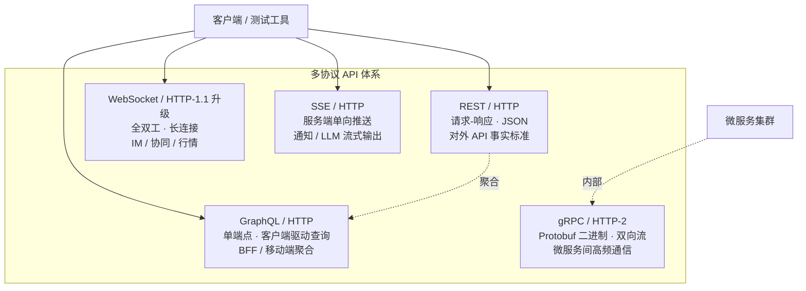
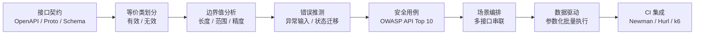

# API 测试基础与协议

API 测试是现代质量保障体系的"腰部力量"——它比单元测试更贴近业务语义，又比 GUI 测试更稳定、更易自动化。随着 2024-2026 年 HTTP/3、GraphQL、gRPC、WebSocket 等协议在企业中规模化落地，API 测试的边界已从"调一个 REST 端点"扩展为"多协议、多范式、多安全维度的系统工程"。本文从协议基础出发，逐层向上构建 API 测试的知识地图。

## 1. 核心概念：API 测试是什么、为什么重要

### 1.1 定义与定位

API 测试（API Testing）是指**直接对应用程序接口（通常是 HTTP/HTTPS 接口）发起请求并校验响应**的测试活动。它跳过了 GUI 层的渲染与交互，直接以协议级报文作为输入输出，因此具备三个显著特征：

- **语言无关**：被测系统用 Java、Go、Node.js 实现均可，测试方只需关心协议；
- **稳定可重复**：不依赖前端 DOM 变化，用例生命周期通常跨越多个前端重构；
- **高性价比**：单条用例覆盖一条业务路径，缺陷定位粒度介于单元测试与 E2E 之间。

### 1.2 与 GUI 测试的对比

| 维度 | API 测试 | GUI 测试 |
|------|---------|---------|
| 反馈速度 | 毫秒级 | 秒级 |
| 维护成本 | 低（协议稳定） | 高（UI 易变） |
| 缺陷定位 | 直接指向接口 | 需穿透多层定位 |
| 业务覆盖密度 | 高（一个接口一条业务流） | 低（一次操作含多次接口） |
| 适用阶段 | CI 主力、契约验证、回归 | 关键路径验收、视觉回归 |

互联网产品普遍采用**菱形测试策略**——重 API、轻 GUI、轻单元，正是因为 API 测试在"稳定性 × 反馈速度 × 业务语义"三者间取得了最优平衡。

### 1.3 API 测试三步骤

无论协议如何演进，API 测试的核心动作始终是三步：**准备测试数据（可选）→ 发起请求 → 校验响应**。差异只在于"请求"与"响应"的载体从 JSON 演进到 Protobuf、从 HTTP/1.1 演进到 HTTP/3。

## 2. HTTP 协议基础

理解 API 测试的前提是理解 HTTP。HTTP 是无状态、请求-响应模型的应用层协议，由 RFC 9110（HTTP 语义）与 RFC 9112（HTTP/1.1 报文）等系列规范定义。

### 2.1 请求与响应结构

```
POST /api/v1/orders HTTP/1.1       ← 请求行：方法 + 路径 + 版本
Host: api.example.com              ← 请求头
Content-Type: application/json
Authorization: Bearer eyJhbGc...

{"sku": "A100", "qty": 2}          ← 请求体
```

```
HTTP/1.1 201 Created               ← 状态行：版本 + 状态码 + 原因短语
Location: /api/v1/orders/99081
Content-Type: application/json

{"orderId": "99081", "status": "paid"}
```

### 2.2 HTTP 方法语义

| 方法 | 语义 | 幂等 | 安全 | 典型用途 |
|------|------|------|------|---------|
| GET | 获取资源 | 是 | 是 | 查询 |
| POST | 创建资源 / 触发动作 | 否 | 否 | 下单、登录 |
| PUT | 全量替换资源 | 是 | 否 | 更新整体 |
| PATCH | 部分更新资源 | 否 | 否 | 字段级更新 |
| DELETE | 删除资源 | 是 | 否 | 删除 |
| HEAD | 仅获取头 | 是 | 是 | 探活、缓存校验 |
| OPTIONS | 查询支持的方法 | 是 | 是 | CORS 预检 |

> **测试要点**：幂等性是 API 测试中常被忽略的校验点。对 PUT/DELETE 重复调用 N 次的结果应与调用 1 次一致，可作为一条独立的回归用例。

### 2.3 状态码分层

- **1xx**：信息性（如 100 Continue，HTTP/2 中少见）；
- **2xx**：成功（200 OK / 201 Created / 204 No Content）；
- **3xx**：重定向（301 永久 / 302 临时 / 304 Not Modified）；
- **4xx**：客户端错误（400 Bad Request / 401 Unauthorized / 403 Forbidden / 404 Not Found / 409 Conflict / 422 Unprocessable Entity / 429 Too Many Requests）；
- **5xx**：服务端错误（500 / 502 / 503 / 504）。

### 2.4 Header、Cookie 与 Session

- **Header**：承载元信息，常见的有 `Content-Type`、`Authorization`、`Accept`、`Cache-Control`、`X-Request-Id`；
- **Cookie**：服务端通过 `Set-Cookie` 下发，浏览器/客户端在后续请求中通过 `Cookie` 头回传，用于维持状态；
- **Session**：服务端侧的状态存储，通常以 Session ID（藏在 Cookie 中）索引；
- **Token（JWT）**：无状态的认证载体，签发后由客户端在 `Authorization: Bearer <token>` 中携带，已成为现代 API 的主流鉴权方式。

## 3. REST API 设计规范

REST（Representational State Transfer）由 Roy Fielding 在 2000 年的博士论文中提出，是当前最主流的 API 风格。其核心约束包括：客户端-服务端分离、无状态、可缓存、统一接口、分层系统。

### 3.1 URI 设计

- 使用名词复数：`/orders`、`/orders/{id}/items`；
- 不在 URI 中暴露动词：`POST /orders` 而非 `POST /createOrder`；
- 层级表达包含关系：`/users/{userId}/orders`；
- 查询参数用于过滤/分页/排序：`/orders?status=paid&page=2&pageSize=20`。

### 3.2 版本管理

主流三种策略：

1. **URI 版本**：`/api/v1/orders`，最直观、最易测试，行业事实标准；
2. **Header 版本**：`Accept: application/vnd.example.v2+json`，URI 干净但调试困难；
3. **Media Type 版本**：在 Content-Type 中携带版本，与 Header 类似。

测试时需针对**每个在产版本**维护独立用例集，并在版本下线前发出废弃告警。

### 3.3 HATEOAS

HATEOAS（Hypermedia As The Engine Of Application State）要求响应中包含指向后续可操作资源的超链接，使客户端无需硬编码 URI。例如：

```json
{
  "orderId": "99081",
  "status": "paid",
  "_links": {
    "self":   { "href": "/orders/99081" },
    "cancel": { "href": "/orders/99081/cancel", "method": "POST" },
    "ship":   { "href": "/orders/99081/ship",   "method": "POST" }
  }
}
```

测试 HATEOAS 接口时，除了校验业务字段，还需校验 `_links` 的存在性、可访问性与语义正确性。

## 4. 多协议 API 测试全景

REST 并非唯一选择。现代系统往往是多协议并存：REST 对外、gRPC 对内、GraphQL 做 BFF、WebSocket 推实时、SSE 做单向推送。



### 4.1 GraphQL 测试

GraphQL 通过单一端点（通常 `/graphql`）接收客户端声明的查询，由客户端决定返回字段。三类操作：

- **query**：读操作，类比 REST 的 GET；
- **mutation**：写操作，类比 POST/PUT/DELETE；
- **subscription**：基于 WebSocket 的订阅，用于实时数据推送。

测试要点：

1. **Schema 验证**：用 `graphql-js` 的 `validate` 或 `@graphql-inspector` 检查查询是否合法；
2. **字段精准性**：测试只查询 `id, name` 时不应返回 `email`，防止过度暴露；
3. **查询复杂度**：通过 `depthLimit` 与 `costAnalysis` 防止恶意嵌套导致的 DoS；
4. **Fragment 复用**：测试用例应复用 Fragment，与前端保持一致；
5. **N+1 检测**：通过 DataLoader 的批量化验证服务端是否解决 N+1 查询。

```graphql
# GraphQL query 示例：精确字段查询
query OrderSummary($id: ID!) {
  order(id: $id) {
    id
    status
    items { sku qty }       # 仅取所需字段
  }
}
```

### 4.2 gRPC 测试

gRPC 基于 HTTP/2，使用 Protocol Buffers（Protobuf）作为接口定义语言（IDL）与序列化格式，支持一元（Unary）、服务端流、客户端流、双向流四种调用模式。

测试要点：

- **Proto 契约**：`.proto` 文件是契约源头，测试前必须先用 `protoc` 校验编译；
- **二进制报文**：无法用 cURL 直接发，需用专用工具；
- **流式调用**：需要测试框架支持异步断言与超时控制；
- **元数据（Metadata）**：相当于 HTTP Header，需校验鉴权与链路追踪头。

```bash
# 使用 grpcurl 调用一元 RPC（类似 cURL 之于 REST）
# -d：JSON 入参，自动转 Protobuf；-H：元数据
grpcurl -plaintext \
  -d '{"order_id": "99081"}' \
  -H "authorization: Bearer eyJ..." \
  api.example.com:443 \
  order.OrderService/GetOrder                      # 包.服务/方法
```

主流工具：`grpcurl`（命令行）、`ghz`（压测）、Postman v11（GUI，原生支持 gRPC 与反射）、`k6`（含 xk6-grpc 扩展）。

### 4.3 WebSocket 测试

WebSocket 通过 HTTP/1.1 的 `Upgrade` 握手升级为全双工长连接，常用于 IM、协同编辑、实时行情。测试要点：

- **握手验证**：校验 `Sec-WebSocket-Accept` 是否正确；
- **帧类型**：文本帧、二进制帧、Ping/Pong、Close；
- **消息序列**：断言收发顺序、心跳间隔、重连退避；
- **背压**：高频消息下客户端是否触发背压或丢弃策略。

Postman v11、wscat、`websockets`（Python）、`ws`（Node.js）均可承担测试任务。

### 4.4 Server-Sent Events（SSE）

SSE 基于 HTTP，由服务端通过 `Content-Type: text/event-stream` 持续推送事件，客户端只读。2024 年以来因 LLM 流式输出而重新流行。测试要点：

- **事件边界**：以 `\n\n` 分隔，每条事件包含 `event:`、`data:`、`id:`；
- **断流重连**：客户端通过 `Last-Event-ID` 头续传；
- **超时与心跳**：服务端应定期发送注释行（`: keep-alive`）防止代理超时断开。

```bash
# 使用 cURL 测试 SSE 端点（流式输出，需保持连接）
curl -N -H "Accept: text/event-stream" \
     https://api.example.com/v1/chat/stream
```

## 5. API 测试用例设计

### 5.1 设计流程



### 5.2 经典方法在 API 测试中的落地

- **等价类划分**：对 `pageSize` 参数，有效等价类（1-100）、无效等价类（0、负数、非数字、超大值）各取代表；
- **边界值分析**：字符串长度边界、数值上下界、数组空与单元素、时间戳 0 与 `Long.MAX_VALUE`；
- **错误推测**：SQL/JSON 注入字符、Unicode 控制符、超长字符串、并发重复提交、跨租户 ID 越权；
- **状态迁移**：订单 `created → paid → shipped → closed`，每条迁移边对应一组用例，未授权迁移必须失败。

### 5.3 OWASP API Security Top 10（2023）

API 安全测试是 API 测试不可分割的维度。OWASP 2023 版 Top 10：

| 编号 | 风险 | 测试要点 |
|------|------|---------|
| API1 | 对象级授权失效（BOLA） | 用 A 用户 token 访问 B 用户的 `/orders/{id}`，应 403 |
| API2 | 身份认证失效 | 弱密码、JWT 签名绕过、Token 不过期 |
| API3 | 对象属性级授权失效 | 通过 PATCH 写入只读字段（如 `role`） |
| API4 | 资源消耗无限制 | 无分页、上传大文件、复杂 GraphQL 查询 |
| API5 | 功能级授权失效 | 普通用户访问管理员端点 |
| API6 | 敏感业务流无限制访问 | 抢购/投票接口无频率限制 |
| API7 | SSRF | 服务端发起的 URL 是否可被外部控制 |
| API8 | 安全配置错误 | CORS 通配、详细错误堆栈、默认凭证 |
| API9 | 资产管理不当 | 影子 API、未下线的旧版本端点 |
| API10 | 不安全的 API 消费 | 集成的第三方 API 是否被信任过头 |

常用工具：**OWASP ZAP**（主动扫描 + 代理拦截）、**Burp Suite**（手动渗透 + 插件生态）、**Nuclei**（模板化扫描）、**Astra**（API 专项）。

## 6. API 测试工具链

### 6.1 工具对比矩阵

| 工具 | 形态 | 协议支持 | 脚本能力 | 版本控制 | 适用场景 |
|------|------|---------|---------|---------|---------|
| **cURL** | 命令行 | HTTP/1-3、WebSocket | 无 | 无 | 快速调试、Shell 脚本集成 |
| **HTTPie** | 命令行 | HTTP | 无 | 无 | cURL 的友好替代，彩色输出 |
| **Postman v11** | GUI + CLI | HTTP、GraphQL、gRPC、WebSocket | JavaScript（pm API） | 工作区同步 / Git | 团队协作、Collection 管理 |
| **Apifox** | GUI | HTTP、GraphQL、WebSocket | JavaScript | Git | 国内团队、API 设计-测试-文档一体化 |
| **Bruno** | GUI + CLI | HTTP、GraphQL | JavaScript | **纯文本集合，Git 原生** | Git-first、离线优先、避免云端锁定 |
| **Hurl** | 命令行 | HTTP | 简单断言 | 纯文本 | CI 流水线、声明式用例 |
| **REST Assured** | Java 库 | HTTP | Java 全功能 | 代码仓库 | Java 生态、与 JUnit/TestNG 深度集成 |
| **k6** | 命令行 | HTTP、gRPC、WebSocket | JavaScript（ES6） | 代码仓库 | 功能测试 + 性能测试一体 |
| **grpcurl** | 命令行 | gRPC | 无 | 无 | gRPC 调试 |
| **wscat** | 命令行 | WebSocket | 无 | 无 | WebSocket 交互式调试 |

### 6.2 cURL 速查

```bash
# 带鉴权的 POST 请求，提交 JSON 并显示响应头
curl -i -X POST "https://api.example.com/v1/orders" \
  -H "Content-Type: application/json" \
  -H "Authorization: Bearer ${TOKEN}" \
  -d '{"sku":"A100","qty":2}'
```

### 6.3 Postman v11 Pre-request Script

```javascript
// 在请求发出前动态生成时间戳并写入环境变量
const ts = Date.now();
pm.environment.set("requestTs", ts);

// 自动生成签名（HMAC-SHA256），避免手工写死
const secret = pm.environment.get("appSecret");
const raw   = `${ts}|${pm.request.url.getPath()}`;
const sign  = CryptoJS.HmacSHA256(raw, secret).toString();
pm.request.headers.upsert({ key: "X-Signature", value: sign });
```

### 6.4 Hurl 声明式用例

Hurl 把"请求 + 断言"写在一个文件里，天然适合 CI：

```hurl
# 创建订单并校验状态码与返回字段
POST https://api.example.com/v1/orders
Authorization: Bearer {{token}}
Content-Type: application/json

{"sku": "A100", "qty": 2}

HTTP 201
[Asserts]
jsonpath "$.orderId" isString
jsonpath "$.status" == "paid"
```

## 7. HTTP/3 与 API 测试

### 7.1 QUIC 协议核心

HTTP/3 放弃 TCP，转而基于 QUIC（Quick UDP Internet Connections，RFC 9000）。QUIC 的关键特性：

- **UDP 传输 + TLS 1.3 内嵌**：握手与加密合并，首次连接 1-RTT，重连 0-RTT；
- **多路复用无队头阻塞**：每个 Stream 独立，单包丢失不阻塞其他 Stream；
- **连接迁移**：基于 Connection ID 而非四元组，网络切换（Wi-Fi → 4G）不断连。

### 7.2 对 API 测试工具的影响

| 影响点 | 说明 |
|--------|------|
| **抓包方式变化** | Wireshark 仍可解析 UDP，但 Charles/Fiddler 等基于 TCP 代理的工具需升级到支持 HTTP/3 的版本 |
| **cURL 适配** | curl 自 7.66 起实验性支持 `--http3`，编译时需启用 HTTP/3（依赖 `ngtcp2` 或 `quiche`） |
| **测试工具跟进** | 截至 2026-09，主流 GUI 工具（Postman v11 等）尚未原生支持 HTTP/3 发送，可用启用 HTTP/3 的 curl 或浏览器 DevTools 验证；k6 通过扩展实验性支持 |
| **Mock 难度上升** | Mock Server 需同时支持 HTTP/1.1、HTTP/2、HTTP/3，否则握手降级会掩盖问题 |
| **性能基线重置** | HTTP/3 的延迟优势在弱网/移动端更明显，性能测试需引入新的网络模拟参数 |

```bash
# 使用 cURL 强制 HTTP/3 测试（需启用 HTTP/3 的 curl 构建，自 7.66 起实验性支持）
curl --http3-only -I "https://api.example.com/v1/health"
```

> **测试策略建议**：HTTP/3 与 HTTP/2 在应用层语义一致，差异集中在传输层。功能测试不必为 HTTP/3 单独维护一套用例，但**握手成功率、0-RTT 重连、连接迁移、弱网吞吐**应作为专项性能与可靠性用例。

## 8. 常见陷阱与最佳实践

### 8.1 常见陷阱

1. **断言只看状态码**：仅断言 `200` 而忽略响应体，会放过"成功但数据错"的严重缺陷；
2. **测试数据与生产耦合**：用例硬编码生产环境的真实手机号/邮箱，一旦数据被清理用例即崩；
3. **忽略超时与重试**：未设置超时，CI 中卡死；未考虑幂等，重试导致脏数据；
4. **Mock 与真实契约漂移**：Mock Server 的响应没有跟着 OpenAPI 更新，集成时才发现偏差；
5. **认证 Token 过期未刷新**：长跑用例集中失败，根因只是 Token TTL 过短；
6. **HTTP/2/3 假设**：默认服务端一定支持多路复用，但部分中间件（如老版 Nginx）会降级；
7. **GraphQL 过度查询**：测试只验单字段，生产却被前端发来的 5 层嵌套打挂；
8. **gRPC 反射未关闭**：生产环境开放 gRPC Server Reflection，等于把全部服务方法清单公开。

### 8.2 最佳实践

- **契约先行**：用 OpenAPI / Protobuf / GraphQL Schema 作为唯一事实来源，文档、Mock、测试、SDK 全部从契约生成；
- **测试数据隔离**：每个用例自建自销（setup/teardown），不依赖其他用例的副作用；
- **断言分层**：状态码 + 关键业务字段 + 响应时间 + 结构契约（JsonSchema / Protobuf 反序列化）；
- **契约测试替代 Mock**：微服务间用 Pact 等契约测试工具，让消费者驱动提供者；
- **CI 分级执行**：P0 冒烟用例 ≤ 2 分钟、P1 回归用例 ≤ 15 分钟、P2 全量 ≤ 1 小时；
- **安全左移**：在 CI 中接入 OWASP ZAP Baseline Scan 与 Nuclei 模板，每次 MR 自动跑安全基线；
- **可观测性**：每条用例注入 `X-Request-Id`，失败时直接关联后端日志与 Trace；
- **协议无关的测试中台**：抽象出"请求-断言"模型，让同一套测试中台支持 REST/gRPC/GraphQL，避免按协议重复造轮子。

## 9. 小结

API 测试的核心动作从未改变——"发请求、验响应"，但协议栈的扩张让"请求"与"响应"的形态变得多样。掌握 HTTP/1.1+2+3 的差异、REST/GraphQL/gRPC/WebSocket/SSE 的取舍、OWASP API Top 10 的攻击面、以及 Git-first 的工具链，是 2026 年测试工程师的必备能力。下一篇《Postman v11 与 Newman 自动化》将在此基础上深入到工具链选型与自动化实践。
