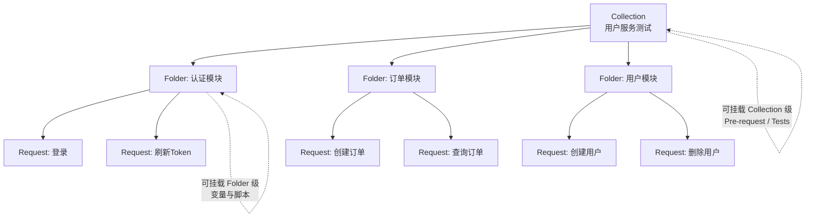
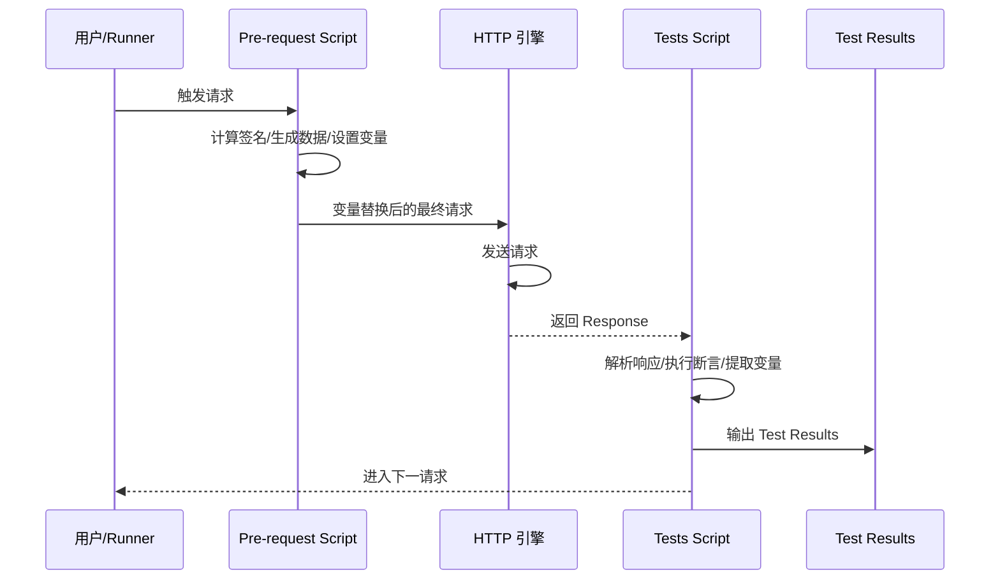
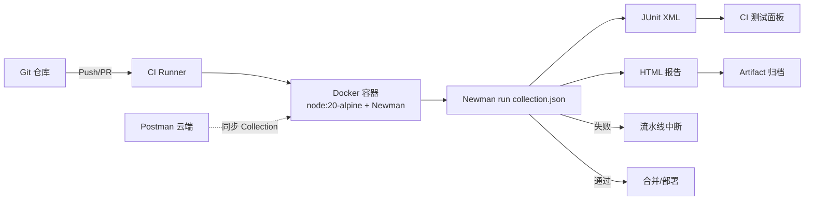

# Postman v11 与 Newman 自动化

Postman 早已不是 2012 年那个 Chrome 浏览器插件。在 v11（2024+）时代，它已演进为一个覆盖 API 设计、调试、测试、Mock、监控、文档、协作的全生命周期平台。对于测试工程师而言，Postman 的真正价值不在于 GUI 调试，而在于其**可脚本化、可数据驱动、可命令行化、可流水线化**的自动化能力——这正是 Newman v6 承担的角色。

本文以 Postman v11 + Newman v6 为坐标，从核心概念一路讲到 CI/CD 集成与 2024-2026 新趋势（Flows、AI Agent），构建一份可落地的 API 自动化测试实践指南。

## 1. 核心概念：Postman 是什么、在 API 测试中的定位

### 1.1 从调试工具到 API 平台

Postman 的产品定位经历了三次跃迁：

- **2012-2018（调试工具）**：Chrome 插件形态，定位为 HTTP 请求调试器；
- **2018-2023（协作平台）**：独立桌面应用 + 云端工作区，引入 Collection、Variable、Mock、Monitor；
- **2024+（API 平台 + AI）**：v11 整合 Flows 可视化编排、Postman AI Agent、Postman CLI 统一入口，成为 API-First 工作流的核心枢纽。

### 1.2 在 API 测试分层中的定位

Postman/Newman 在测试金字塔中处于**服务层（Service Layer）**：

| 层级 | 工具示例 | Postman 的角色 |
|------|---------|---------------|
| 单元测试 | JUnit、PyTest | 不参与 |
| 契约测试 | Pact、Postman Schema 校验 | **辅助**——通过 `tv4` / Ajv 做 Schema 断言 |
| API 集成测试 | REST Assured、HttpRunner | **主力**——Collection + 数据驱动 |
| E2E 测试 | Playwright、Selenium | 不参与（但有 Flows 编排接口流程） |
| 性能/负载 | k6、JMeter | 不参与（但可导出 Collection 给 k6） |

Postman 的最大优势是**测试资产的可移植性**：同一个 Collection 既能被开发人员在 GUI 中调试，又能被测试工程师在 Runner 中批量执行，还能被 Newman/Postman CLI 在 CI 中无头运行，最后还能被 Flows 编排成可视化业务流。

## 2. Collection 与请求管理

### 2.1 三层组织模型

Postman 用 **Collection / Folder / Request** 三层结构组织测试资产：



每一层都可挂载 Pre-request Script 与 Tests Script，**子层继承父层脚本**。这构成了一个强大的"上下文叠加"机制：

- Collection 级脚本：登录、设置全局 Token；
- Folder 级脚本：模块共用的数据准备；
- Request 级脚本：单个请求的断言与变量提取。

### 2.2 变量体系

Postman v11 提供五层变量作用域（另有 Secret 类型用于隐藏变量明文），优先级从高到低：

| 作用域 | 标识符 | 写入时机 | 典型用途 |
|--------|--------|---------|---------|
| Local | `pm.variables` | 运行时临时 | 单次请求内的中间值 |
| Data | `data.xxx` | Collection Runner 注入 | 数据驱动测试 |
| Environment | `pm.environment` | 切换环境 | dev/staging/prod 切换 |
| Collection | `pm.collectionVariables` | 团队共享 | Collection 内常量 |
| Globals | `pm.globals` | 跨 Collection | 全局基础 URL |
| Secret（变量属性，非独立作用域） | 不暴露明文 | 凭证管理 | API Key、密码 |

变量引用统一使用双花括号 `{{baseUrl}}`，运行时由 Postman 解析器替换。

```javascript
// 在 Pre-request Script 中动态修改变量
// 当前环境切换到分页参数
pm.environment.set("pageNum", 1);
pm.environment.set("pageSize", 20);

// 读取变量（推荐使用 pm 对象，而非已废弃的 postman.setEnvironmentVariable 等旧式 API）
const baseUrl = pm.variables.get("baseUrl");
const token = pm.environment.get("authToken");
```

## 3. 脚本编写：Pre-request 与 Tests

### 3.1 双脚本钩子执行时序

Postman 在每个请求执行前后各提供了一个 JavaScript 沙箱钩子：



### 3.2 Pre-request Script 典型场景

**场景一：动态签名计算**

```javascript
// 计算请求签名并写入 Header
// 适用于自研网关要求 HMAC-SHA256 签名的场景
const timestamp = Date.now().toString();
const nonce = pm.variables.replaceIn('{{$guid}}');
const body = pm.request.body.raw || '';
const secret = pm.environment.get("signSecret");

// 使用 CryptoJS（Postman 内置）计算 HMAC
const signature = CryptoJS.HmacSHA256(`${timestamp}${nonce}${body}`, secret)
    .toString(CryptoJS.enc.Hex);

pm.request.headers.upsert({ key: 'X-Timestamp', value: timestamp });
pm.request.headers.upsert({ key: 'X-Nonce', value: nonce });
pm.request.headers.upsert({ key: 'X-Signature', value: signature });
```

**场景二：从前置请求拉取 Token**

```javascript
// 若 Environment 中没有 token，先调用登录接口
if (!pm.environment.get("authToken")) {
    const loginRequest = {
        url: pm.variables.get("baseUrl") + "/auth/login",
        method: "POST",
        header: { "Content-Type": "application/json" },
        body: { mode: "raw", raw: JSON.stringify({ username: "test", password: "test123" }) }
    };
    pm.sendRequest(loginRequest, (err, response) => {
        const json = response.json();
        pm.environment.set("authToken", json.token);
    });
}
```

### 3.3 Tests Script 断言库

Postman v11 的断言基于 `pm.test()` + `pm.expect()`（Chai.js 风格 BDD 断言）：

```javascript
// 1. 状态码断言
pm.test("状态码应为 200", () => {
    pm.response.to.have.status(200);
});

// 2. 响应时间断言（性能基线）
pm.test("响应时间应小于 500ms", () => {
    pm.expect(pm.response.responseTime).to.be.below(500);
});

// 3. JSON 字段断言
pm.test("返回体应包含 userId 且非空", () => {
    const body = pm.response.json();
    pm.expect(body).to.have.property("userId");
    pm.expect(body.userId).to.not.be.empty;
});

// 4. JSON Schema 断言（契约验证）
const schema = {
    type: "object",
    required: ["userId", "name", "email"],
    properties: {
        userId: { type: "string" },
        name: { type: "string" },
        email: { type: "string", format: "email" }
    }
};
pm.test("响应结构应符合 User Schema", () => {
    pm.response.to.have.jsonSchema(schema);
});

// 5. 提取变量供后续请求使用
const userId = pm.response.json().userId;
pm.environment.set("currentUserId", userId);
```

> **API 提示**：旧版 `tests["断言名"] = condition === true` 语法在 v11 中仍能执行但已弃用，新代码必须使用 `pm.test()` / `pm.expect()`。

## 4. 数据驱动：CSV/JSON 数据文件

### 4.1 为什么需要数据驱动

API 测试最大的重复性来自"同一个接口、多组输入"。如果用脚本硬编码每条用例，几条还行，几十条就会面临维护噩梦——改一个字段要改 N 处。数据驱动的核心思想是把**测试逻辑**与**测试数据**解耦：脚本只描述"怎么测"，数据文件描述"测什么"。

Postman 的数据驱动机制以 Collection Runner / Newman 的迭代执行为载体：每次迭代把数据文件中的一行（或一个对象）注入到 `data` 作用域，请求与脚本通过 `{{字段名}}` 或 `data.字段名` 引用。

### 4.2 数据文件格式

Postman 支持通过 CSV 或 JSON 文件为 Collection Runner / Newman 提供迭代数据。每一行（或每一个对象）对应一次迭代，文件中的字段以 `data.字段名` 形式注入变量作用域。

**users.csv**（适合大批量扁平数据，Excel 直接编辑）：

```csv
username,email,expectedStatus
alice,alice@example.com,201
bob,bob@example.com,201
charlie,invalid-email,400
```

**users.json**（适合嵌套结构，如批量请求体）：

```json
[
  { "username": "alice", "email": "alice@example.com", "expectedStatus": 201 },
  { "username": "bob", "email": "bob@example.com", "expectedStatus": 201 },
  { "username": "charlie", "email": "invalid-email", "expectedStatus": 400 }
]
```

> **格式选择建议**：扁平字段用 CSV（运维、产品也能编辑）；嵌套对象、数组用 JSON；超过千行的大数据集建议改为 Newman 通过 `--env-var` 注入或外部脚本生成。

### 4.3 在请求中引用数据

在请求 URL、Body、Header 中以 `{{username}}` 引用；在脚本中以 `data.username` 引用：

```javascript
// Tests 脚本中根据数据文件中的期望值断言
pm.test("状态码应与期望一致", () => {
    pm.expect(pm.response.code).to.eql(Number(data.expectedStatus));
});

pm.test("用户名应回显", () => {
    // 仅在创建成功的场景下校验回显字段
    if (Number(data.expectedStatus) === 201) {
        pm.expect(pm.response.json().username).to.eql(data.username);
    }
});

// 将本次迭代的 userId 写入变量，供下一次迭代或后续请求使用
if (Number(data.expectedStatus) === 201) {
    pm.environment.set("lastUserId", pm.response.json().userId);
}
```

### 4.4 Collection Runner 执行

在 Postman GUI 中通过 Collection Runner 选择数据文件并设置迭代次数，每次迭代自动注入对应数据行。Runner 还支持：

- **延迟请求**（Delay）：避免被测系统被高频请求压垮；
- **保存响应**（Save responses）：失败时保留响应原文便于回溯；
- **停止OnError**（Stop on error）：第一条失败即停止，CI 友好；
- **并行度**：v11 支持有限的多并发，配合 Folder 划分可加速大集合执行。

Newman CLI 的对应参数见下一节。

## 5. Newman CLI 自动化

### 5.1 安装与版本

Newman 是 Postman 官方维护的 Node.js 命令行 Collection 运行器，当前主版本为 v6（Node.js ≥ 16）。它与 Postman 共享底层脚本引擎，因此 Collection 在 GUI 与 CLI 中的行为一致。

```bash
# 全局安装 Newman v6
npm install -g newman

# 验证版本
newman --version

# 安装 HTML 报告扩展（v6 推荐使用 newman-reporter-htmlextra）
npm install -g newman-reporter-htmlextra
```

### 5.2 常用命令行参数

```bash
# 基础执行：指定 Collection 与 Environment
# -e：环境变量文件；-d：数据驱动文件；--iteration-count：迭代次数（与 -d 二选一）
# --folder：只执行指定 Folder；--env-var：命令行覆盖变量
# --delay-request：请求间隔（ms），避免压垮被测系统；--timeout-request：单请求超时
# --bail：失败即退出（CI 推荐）；--reporters：报告输出
newman run collection.json \
  -e environment.json \
  -d testdata.csv \
  --iteration-count 3 \
  --folder "认证模块" \
  --env-var "baseUrl=http://staging.api" \
  --delay-request 200 \
  --timeout-request 10000 \
  --bail \
  --reporters cli,json,htmlextra \
  --reporter-htmlextra-export report.html
```

### 5.3 报告生成

| Reporter | 用途 | 安装 |
|----------|------|------|
| `cli` | 控制台彩色输出（默认） | 内置 |
| `json` | 结构化结果，供下游解析 | 内置 |
| `junit` | JUnit XML，对接 Jenkins/GitLab CI 测试面板 | 内置 |
| `htmlextra` | 美观的 HTML 报告，含失败请求详情与时间分布 | `newman-reporter-htmlextra` |
| `allure` | 对接 Allure 测试报告框架 | `newman-reporter-allure` |

```bash
# 同时生成 JUnit + HTML 报告（CI 标准配置）
newman run collection.json \
  -e staging.json \
  --reporters junit,htmlextra \
  --reporter-junit-export results.xml \
  --reporter-htmlextra-export report.html
```

### 5.4 Newman 与 Postman CLI 的取舍

Postman 官方在 2022 年推出 **Postman CLI**（命令 `postman`），定位为 Newman 的"云端增强版"。两者取舍如下：

| 维度 | Newman v6 | Postman CLI |
|------|-----------|-------------|
| 部署形态 | 纯开源 npm 包，离线可用 | 闭源二进制，需 Postman 账号 |
| 认证 | 无 | API Key / OAuth |
| Collection 源 | 本地 JSON 文件 | 本地 + 云端工作区 |
| Flows 执行 | 不支持 | 支持 |
| 历史结果 | 仅本地报告 | 自动同步到 Postman 云端 |
| CI 适配 | 离线、私有网络友好 | 需联网拉取云端资源 |
| 自定义 Reporter | 支持（npm 包） | 不支持 |

**选型建议**：纯离线 CI、对开源协议敏感、需要自定义 Reporter 的团队选 Newman；已在深度使用 Postman 云端工作区、希望执行结果自动归集到团队 Dashboard 的团队选 Postman CLI。两者底层脚本引擎一致，Collection 可双向复用。

## 6. CI/CD 集成

### 6.1 整体架构



### 6.2 GitHub Actions 集成

```yaml
# .github/workflows/api-tests.yml
name: API 自动化测试

on:
  push:
    branches: [main, develop]
  pull_request:
    branches: [main]

jobs:
  newman-api-tests:
    runs-on: ubuntu-latest
    steps:
      # 1. 拉取代码
      - name: Checkout
        uses: actions/checkout@v4

      # 2. 安装 Node.js
      - name: Setup Node.js
        uses: actions/setup-node@v4
        with:
          node-version: '20'

      # 3. 安装 Newman 与报告扩展
      - name: Install Newman
        run: |
          npm install -g newman newman-reporter-htmlextra

      # 4. 启动被测服务（假设为 Docker Compose）
      - name: Start services
        run: docker compose up -d

      # 5. 执行测试
      - name: Run Postman Collection
        run: |
          newman run collections/api-suite.json \
            -e environments/staging.json \
            -d data/test-data.csv \
            --reporters cli,junit,htmlextra \
            --reporter-junit-export reports/junit.xml \
            --reporter-htmlextra-export reports/report.html \
            --bail

      # 6. 发布测试报告
      - name: Publish Test Report
        uses: dorny/test-reporter@v1
        if: always()
        with:
          name: API Test Results
          path: reports/junit.xml
          reporter: java-junit

      # 7. 归档 HTML 报告
      - name: Upload HTML Report
        uses: actions/upload-artifact@v4
        if: always()
        with:
          name: postman-html-report
          path: reports/report.html
```

### 6.3 GitLab CI 集成

```yaml
# .gitlab-ci.yml
api-tests:
  image: node:20-alpine
  stage: test
  before_script:
    - npm install -g newman newman-reporter-htmlextra
  script:
    - newman run collections/api-suite.json
        -e environments/staging.json
        --reporters cli,junit,htmlextra
        --reporter-junit-export reports/junit.xml
        --reporter-htmlextra-export reports/report.html
  artifacts:
    when: always
    reports:
      junit: reports/junit.xml
    paths:
      - reports/report.html
  rules:
    - if: $CI_PIPELINE_SOURCE == "merge_request_event"
```

### 6.4 Docker 部署

对于不希望依赖特定 CI 的团队，可将 Newman 封装为 Docker 镜像，便于在任意环境复现：

```dockerfile
# Dockerfile.newman
FROM node:20-alpine

# 安装 Newman 与常用报告器
RUN npm install -g newman newman-reporter-htmlextra newman-reporter-allure

# 设置工作目录
WORKDIR /etc/newman

# 默认入口（可被 docker run 参数覆盖）
ENTRYPOINT ["newman", "run"]
```

```bash
# 构建镜像
docker build -f Dockerfile.newman -t company/newman:6 .

# 在容器内运行（挂载 Collection 与报告目录）
docker run --rm \
  -v $(pwd)/collections:/etc/newman \
  -v $(pwd)/reports:/reports \
  company/newman:6 \
  api-suite.json \
  -e environments/staging.json \
  --reporters htmlextra \
  --reporter-htmlextra-export /reports/report.html
```

## 7. Postman 进阶能力

### 7.1 Mock Server

Postman Mock Server 允许在不启动真实服务的情况下，基于 Collection 中的请求示例返回 Mock 响应，特别适合：

- 前端并行开发，后端尚未提供接口；
- 测试环境依赖第三方不稳定 API；
- 异常场景（超时、5xx）模拟。

创建步骤：在 Collection 的某个请求上保存一个示例响应（Example），然后基于该 Collection 一键生成 Mock Server，Postman 会返回一个 `https://<mock-id>.mock.pstmn.io` 形式的 URL，直接调用即可命中 Mock。

Mock Server 还支持 **多条响应匹配**：同一 URL 可根据 Header、Query 参数匹配不同 Example，例如 `Accept: application/xml` 返回 XML，`Accept: application/json` 返回 JSON。这一能力使 Mock Server 也能承担"轻量契约验证"角色——前端按契约调用 Mock，后端实现完成后切换 Base URL 即可，无需改测试代码。

对于私有网络场景，Postman 也支持通过 **Postman Agent** 把云端 Mock Server 转发到本地内网，避免暴露内部接口到公网。

### 7.2 Postman Flows（2024 新增）

Postman Flows 是 v11 引入的可视化 API 编排能力，用拖拽的 Block 图代替脚本串联多 API 业务流，适合：

- 非技术背景的产品/QA 描述业务路径；
- 复杂数据流的可视化文档；
- 接口冒烟测试的"业务剧本"。

一个典型的"用户注册→绑卡→下单"Flows 包含以下 Block：

- **Send Request Block**：调用某个已保存的 Request；
- **Output Block**：提取响应字段；
- **Condition Block**：基于响应做分支；
- **Loop Block**：遍历数据集；
- **Assert Block**：执行断言；
- **Log Block**：输出调试信息。

Flows 也可通过 Postman CLI 在 CI 中执行：

```bash
# 执行 Flows（Postman CLI，需 Postman 账号认证）
postman login --with-api-key $POSTMAN_API_KEY
postman flow run <flow-id> --environment staging
```

### 7.3 Postman API（编程式管理 Collection）

Postman 提供完整的 REST API（`https://api.getpostman.com`），允许以编程方式管理 Collection、Environment、Mock、Monitor：

```bash
# 通过 API Key 拉取最新 Collection JSON（CI 中常用，避免硬编码文件）
curl --location "https://api.getpostman.com/collections/${COLLECTION_UID}" \
  --header "X-Api-Key: ${POSTMAN_API_KEY}"

# 触发 Monitor 执行（定时巡检）
curl --location --request POST \
  "https://api.getpostman.com/monitors/${MONITOR_UID}/run" \
  --header "X-Api-Key: ${POSTMAN_API_KEY}"
```

在 CI 中常见的"动态拉取 Collection"模式：

```bash
# CI 流水线脚本：每次运行时从 Postman 云端拉取最新版本
curl -s --header "X-Api-Key: $POSTMAN_API_KEY" \
  "https://api.getpostman.com/collections/$COLLECTION_UID" \
  | jq -r '.collection' > collection.json

newman run collection.json -e staging.json --bail
```

### 7.4 API 监控（Monitor）

Monitor 是 Postman 云端定时执行 Collection 的能力，常用于：

- 生产环境接口健康巡检（5 分钟一次）；
- 公网可用性监控；
- 性能基线漂移告警。

Monitor 失败可对接 Slack/企业微信/Webhook 通知，构成"无服务端"的轻量监控方案。

### 7.5 Postman AI Agent（2025+）

2025 年 Postman 引入 AI Agent，可在工作区内：

- **基于 OpenAPI/Collection 自动生成测试用例**：覆盖正常路径、边界值、错误码；
- **生成 Pre-request / Tests 脚本**：自然语言描述意图，AI 输出可执行脚本；
- **响应字段反推 Schema**：从历史响应中学习并生成 JSON Schema；
- **异常响应诊断**：失败时自动分析根因并给出修复建议。

AI Agent 不会替代测试工程师，但能显著降低"从 0 到 1 写第一条用例"的门槛，并将测试覆盖率的瓶颈从"会写脚本"转移到"懂业务"。

## 8. 常见陷阱与最佳实践

### 8.1 常见陷阱

1. **硬编码 URL 与 Token**：直接在请求里写死 `https://dev-api.example.com`，导致切环境必须改请求。应统一抽到 Environment 变量。
2. **Test 脚本断言过弱**：只断言 `status 200`，业务字段一概不验，等于"只验活不验对"。
3. **Collection 缺乏分层脚本**：每个 Request 都重复写登录脚本，应抽到 Collection 级 Pre-request。
4. **变量污染**：在 `pm.globals` 中累积大量临时值，跨 Collection 干扰。临时值应使用 `pm.variables`。
5. **数据文件与代码解耦不彻底**：在脚本中写 `if (username === 'alice')`，丧失数据驱动意义，应将期望值也放入数据文件。
6. **Newman 不锁定 Collection 版本**：CI 直接拉云端最新 Collection，导致昨天还绿的流水线今天莫名失败。应在 PR 中锁定 Collection 快照。
7. **超时与重试缺失**：未设置 `--timeout-request`，被测服务卡住时 Newman 长时间挂起，阻塞流水线。
8. **忽视 Schema 断言**：仅校验关键字段，下游字段被悄悄删除无人发现。关键接口必须配 JSON Schema 断言。

### 8.2 最佳实践

| 维度 | 推荐做法 |
|------|---------|
| 资产管理 | Collection 纳入 Git 仓库（导出 JSON），与代码同 PR 评审 |
| 环境隔离 | dev/staging/prod 三套 Environment 文件，密钥用 Secret 变量 |
| 脚本分层 | 登录、签名等通用逻辑放 Collection 级，模块特定逻辑放 Folder 级 |
| 数据驱动 | 测试数据与期望值都进 CSV/JSON，脚本只做"取值→发请求→断言" |
| 断言完整性 | 状态码 + 响应时间 + 关键字段 + JSON Schema 四层断言 |
| CI 集成 | Newman + `--bail` + JUnit + HTML 报告 + Artifact 归档 |
| 失败可观测 | 失败用例必须保留请求/响应原文，便于回溯 |
| 版本治理 | CI 中锁定 Collection 快照，云端 Collection 通过 PR 合并更新 |
| 监控 | 关键生产接口用 Monitor 巡检，对接告警通道 |
| 进阶 | Flows 描述业务路径；AI Agent 辅助用例生成；Mock Server 解耦依赖 |

## 结语

Postman v11 + Newman v6 这套组合的本质，是把"API 测试"从一次性的人工调试，沉淀为**可版本化、可重放、可流水线、可监控**的工程资产。它的能力边界已经从"发一个请求并断言"，扩展到"Flows 编排业务路径、AI 生成测试用例、Monitor 持续巡检、Postman API 编程式管理"。

从演进脉络看，Postman 在做的事情，是把 API 测试从"脚本编程问题"逐步变成"配置 + 编排 + AI 辅助"的工程协作问题。这一趋势对测试工程师提出了新的要求：理解 Collection 数据结构、理解变量作用域与生命周期、理解 CI/CD 集成模式，比单纯写好一段 `pm.test()` 更重要。

但要警惕一个误区：工具能力越强，越容易陷入"为用而用"。Flows、AI Agent、Mock Server 都不是必选项——一个分层清晰、断言完整、CI 稳定运行的 Collection + Newman 流水线，已经能解决 80% 的 API 自动化需求。剩下的 20%，再按需引入进阶能力。

最后给出一份"从 0 到 1 落地"的渐进路径，供实践参考：

1. **第一周**：用 Postman GUI 完成 5-10 个核心接口的请求保存与基础断言，建立第一个 Collection；
2. **第二周**：把变量、Environment 抽离出来，引入 Collection 级 Pre-request 完成登录态自动获取；
3. **第三周**：用 CSV 数据文件做参数化，把单接口的多组输入收敛为数据驱动；
4. **第四周**：引入 Newman + GitHub Actions，把 Collection 接到 PR 触发的 CI 流水线，输出 JUnit + HTML 报告；
5. **后续**：按需引入 Mock Server 解耦第三方依赖、用 Monitor 做生产巡检、用 Flows 描述业务路径、用 AI Agent 辅助补充边界用例。

工具始终是放大器，而非替代品。理解 API 测试的核心方法论——三步骤、四层断言、数据驱动、CI 闭环——比追逐任何一个新功能都更值得投入。
