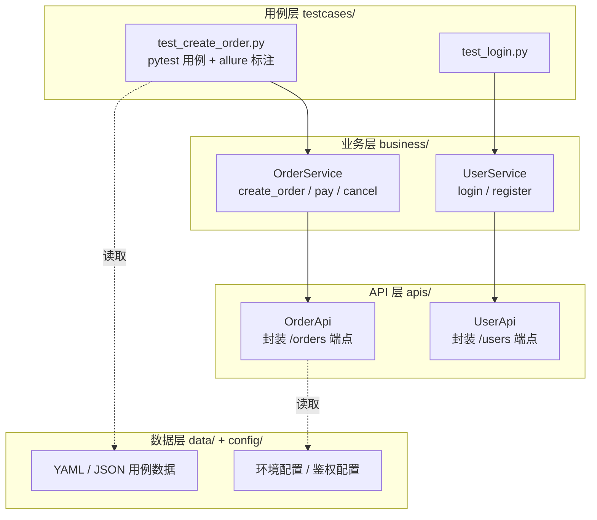
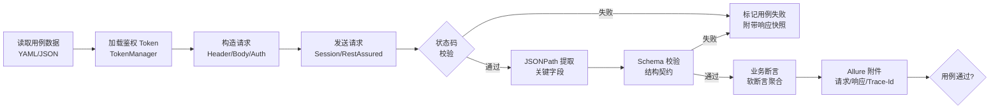

# REST Assured 与 pytest+requests 框架

Postman 解决的是"能不能调通"，代码化框架解决的是"能不能工程化"。当用例规模从几十条扩展到几千条、当多团队协作需要版本化与代码评审、当 CI 流水线要求 5 分钟内完成全量回归时，基于 REST Assured（Java）或 pytest + requests（Python）的代码化框架便从"可选项"变成了"必选项"。本文系统梳理两大主流框架的核心能力，并给出 2024-2026 年通用的分层架构与最佳实践。

## 1. 核心概念：代码化框架 vs Postman

### 1.1 为什么需要代码化框架

Postman / Apifox 这类 GUI 工具在中小项目阶段非常高效——可视化、易上手、协作直观。但当代码库进入持续集成阶段，它们会暴露四个结构性短板：

| 维度 | Postman 集合 | 代码化框架 |
|------|-------------|-----------|
| 版本控制 | JSON 导出，diff 噪声大 | 原生 Git diff，支持 code review |
| 复用与抽象 | Pre-Script 作用域有限 | 函数/类/装饰器，可任意组合 |
| CI 集成 | Newman 二进制调用 | 直接接入 Maven / pytest |
| 复杂逻辑 | JavaScript 沙箱受限 | 完整语言生态（数据库、消息队列、加密） |

代码化框架的核心价值不是"换种写法调接口"，而是把**测试资产沉淀为可演进的代码库**——它能跟着产品代码一起进 CI、一起做 PR Review、一起做依赖升级。

### 1.2 两大主流技术栈

- **REST Assured 5.x**（Java）：BDD 风格 given/when/then 三段式 DSL，与 Maven/Gradle、JUnit 5、Allure Java 无缝集成，是 Java 后端团队的首选；
- **pytest + requests**（Python）：requests 提供极简 HTTP 客户端，pytest 提供强大的 fixture 与参数化能力，配合 allure-pytest 与 Python 数据科学生态，适合快速迭代与数据驱动场景。

两者**没有绝对优劣**，选型取决于被测系统技术栈与团队语言偏好。一个常见的误判是"哪个更先进就选哪个"——框架选型本质是工程投入产出比问题：与被测系统同语言可以复用 Mock 工具、与产品团队共享 CI 镜像、降低跨语言上下文切换成本。下文分别给出核心用法，再统一讨论分层设计。

### 1.3 关键能力清单

无论选哪个栈，一个合格的代码化 API 测试框架都应至少具备以下七项能力：

1. **HTTP 协议全覆盖**：GET/POST/PUT/DELETE/PATCH，支持 query / form / JSON / multipart 全格式；
2. **会话与连接复用**：避免每条用例重建 TCP/TLS 握手，影响执行效率与稳定性；
3. **鉴权统一管理**：Token 自动获取、过期刷新、多用户切换；
4. **数据驱动**：外部数据源（YAML / CSV / Excel）参数化用例；
5. **响应结构验证**：JSON Schema 校验契约，JSONPath 提取嵌套字段；
6. **报告可追溯**：每条用例保留请求、响应、Trace-Id、断言明细；
7. **横切扩展点**：日志、Mock、签名、链路追踪可通过 Filter / 中间件注入。

## 2. REST Assured（Java）

### 2.1 given/when/then 三段式

REST Assured 借鉴 BDD 思想，将请求抽象为"前置条件-动作-断言"三段：

```java
import static io.restassured.RestAssured.*;
import static io.restassured.matcher.RestAssuredMatchers.*;
import static org.hamcrest.Matchers.*;

public class OrderTest {

    @Test
    void shouldCreateOrder() {
        given()                                    // given：前置条件（请求头、请求体、鉴权）
            .baseUri("https://httpbin.org")
            .header("Content-Type", "application/json")
            .body("{\"sku\": \"A100\", \"qty\": 2}")
        .when()                                    // when：发起请求（方法 + 路径）
            .post("/post")
        .then()                                    // then：断言（状态码、响应字段、响应时间）
            .statusCode(200)
            .body("json.sku", equalTo("A100"))
            .body("json.qty", equalTo(2))
            .time(lessThan(2000L));                 // 响应时间断言
    }
}
```

这种写法的优势在于**用例即文档**——读代码即可知道"前置条件是什么、做了什么、校验了什么"，降低团队协作的认知负担。

### 2.2 Specification：消除样板代码

公共的请求头、鉴权、日志配置可抽到 `RequestSpecification`，避免在每个用例里重复：

```java
public class SpecFactory {

    // 公共请求规格：统一 BaseURL、JSON 头、鉴权
    public static RequestSpecification authedSpec(String token) {
        return new RequestSpecBuilder()
            .setBaseUri("https://httpbin.org")
            .setContentType(ContentType.JSON)
            .addHeader("Authorization", "Bearer " + token)
            .setRelaxedHTTPSValidation()
            .build();
    }
}

// 用例中直接复用
given().spec(SpecFactory.authedSpec(token))
    .body(payload)
.when()
    .post("/post")
.then().statusCode(200);
```

### 2.3 Filter：横切关注点

Filter 是 REST Assured 的扩展点，可插入日志、签名、链路追踪、Mock 注入。下面示例在请求发出前后打印链路 ID：

```java
public class TraceFilter implements Filter {
    @Override
    public Response filter(FilterableRequestSpecification requestSpec, FilterableResponseSpecification responseSpec, FilterContext ctx) {
        String traceId = UUID.randomUUID().toString();
        requestSpec.header("X-Trace-Id", traceId);
        return ctx.next(requestSpec);   // 继续执行链路
    }
}

// 全局注册
RestAssured.filters(new TraceFilter(), new RequestLoggingFilter(), new ResponseLoggingFilter());
```

### 2.4 认证与文件上传

```java
// OAuth 2.0 Bearer
given().auth().oauth2(accessToken).when().get("/bearer");

// 表单 + 文件上传
given()
    .multiPart("file", new File("report.pdf"))
    .formParam("description", "月度报告")
.when()
    .post("/post")
.then().statusCode(200);
```

## 3. pytest + requests（Python）

### 3.1 Session 复用与 fixture 鉴权

直接用 `requests.get` 每次都会创建新连接，丢失 Cookie 与连接池。生产用例应统一使用 `requests.Session`，并通过 pytest fixture 管理生命周期：

```python
import pytest
import requests

@pytest.fixture(scope="session")
def base_url():
    return "https://httpbin.org"

@pytest.fixture(scope="session")
def authed_session(base_url):
    """会话级 fixture：登录一次，整个测试会话复用 Cookie 与 Token"""
    session = requests.Session()
    login_resp = session.post(f"{base_url}/post", json={"user": "admin", "pwd": "x"})
    token = login_resp.json().get("token", "")
    session.headers.update({"Authorization": f"Bearer {token}"})
    yield session
    session.close()   # 会话结束清理

def test_get_with_auth(authed_session, base_url):
    resp = authed_session.get(f"{base_url}/get")
    assert resp.status_code == 200
```

### 3.2 数据驱动：parametrize + YAML

```python
import pytest
import yaml

# 从 YAML 加载测试数据
with open("data/login_cases.yaml", encoding="utf-8") as f:
    cases = yaml.safe_load(f)["cases"]

@pytest.mark.parametrize("case", cases, ids=[c["name"] for c in cases])
def test_login(authed_session, base_url, case):
    resp = authed_session.post(f"{base_url}/post", json=case["payload"])
    body = resp.json()
    assert resp.status_code == case["expect_status"]
    assert body.get("json", {}).get("user") == case["payload"]["user"]
```

### 3.3 Allure 集成

```python
import allure
import pytest

@allure.epic("订单服务")
@allure.feature("创建订单")
@allure.story("正向用例")
@allure.severity(allure.severity_level.CRITICAL)
@pytest.mark.parametrize("qty", [1, 5, 99])
def test_create_order(authed_session, base_url, qty):
    with allure.step(f"下单数量={qty}"):
        resp = authed_session.post(f"{base_url}/post", json={"sku": "A100", "qty": qty})
        allure.attach(resp.text, name="响应体", attachment_type=allure.attachment_type.JSON)
        assert resp.status_code == 200
```

allure 的 step 机制让"接口调用"成为可读的报告层级，方便非研发同事（PM、QA Lead）理解测试过程。

## 4. 框架分层设计

不分层的 API 测试库会在 200 条用例时崩盘——同一段登录代码被复制 50 次，Token 一变要改 50 处；同一种支付流程在 20 个用例里各写一遍，产品一改业务规则就要满仓库搜索。**分层是工程化的第一道分水岭**，它把"协议细节""业务流程""断言逻辑"解耦，让每一层都可在不影响其他层的前提下独立演进。

分层架构的本质是**关注点分离**：API 层只对协议负责，业务层只对业务流程负责，用例层只对断言负责，数据层只对环境与数据负责。当后端把 `/orders` 改成 `/v2/orders`，只动 API 层一处；当业务规则调整"下单需校验风控"，只动业务层；当 PM 要求新增"超长 SKU 下单"用例，只在用例层加一行 parametrize。这种隔离带来的可维护性，是代码化框架相对 Postman 集合的根本优势。

### 4.1 四层架构



- **API 层**：每个端点一个方法，只关心 HTTP 协议细节（路径、方法、参数序列化），不含业务语义；
- **业务层**：组合多个 API 调用形成完整业务流程（如"下单 → 支付 → 取消"），是复用粒度最大的层；
- **用例层**：纯粹的业务断言，引用业务层方法，配合数据驱动参数化；
- **数据层**：测试数据与环境配置外置，支持多环境切换。

### 4.2 API 层封装示例（Python）

```python
class OrderApi:
    def __init__(self, session, base_url):
        self.session = session
        self.base_url = base_url

    def create(self, sku, qty):
        """创建订单：封装 POST /post 端点"""
        return self.session.post(
            f"{self.base_url}/post",
            json={"sku": sku, "qty": qty},
        )

    def get(self, order_id):
        return self.session.get(f"{self.base_url}/get", params={"orderId": order_id})
```

业务层组合多个 API 调用：

```python
class OrderService:
    def __init__(self, order_api):
        self.api = order_api

    def place_order_flow(self, sku, qty):
        """业务流程：下单 → 查询确认"""
        create_resp = self.api.create(sku, qty)
        order_id = create_resp.json().get("orderId")
        return self.api.get(order_id)
```

## 5. 响应验证：从字段断言到 Schema 验证

响应验证是 API 测试的"价值锚点"——前面所有的请求构造、鉴权管理都是为了让这一步能产出可信结论。一个常见的反模式是只断言 `status_code == 200`，这等于什么都没断言：服务端可能返回 200 但 body 为空、字段类型错位、缺少必填字段、整数变成字符串。生产级框架应采用**三层验证**：状态码 → Schema → 业务字段，外加可选的响应时间断言。状态码解决"接口是否可达"，Schema 解决"结构是否符合契约"，业务字段解决"业务语义是否正确"。三者互补，缺一不可。

### 5.1 JSONPath 提取

复杂嵌套响应中直接用字典索引容易抛 KeyError。JSONPath 提供容错的查询语法：

```python
from jsonpath_ng import parse

# 提取响应中所有订单 ID（无论嵌套层级）
expr = parse("$..orderId")
order_ids = [m.value for m in expr.find(resp.json())]
assert len(order_ids) > 0
```

REST Assured 原生支持 JSONPath：

```java
List<String> ids = jsonPath.get("data.orders.findAll { it.status == 'paid' }.id");
```

### 5.2 JSON Schema 验证

字段断言只能验证"这一条数据对不对"，**Schema 验证**保证"整个响应结构符合契约"。这是契约测试与防御性回归的核心：

```json
// schemas/order_response.json
{
  "$schema": "http://json-schema.org/draft-07/schema#",
  "type": "object",
  "required": ["orderId", "status", "amount"],
  "properties": {
    "orderId": {"type": "string", "pattern": "^ORD-\\d{6}$"},
    "status": {"type": "string", "enum": ["paid", "unpaid", "cancelled"]},
    "amount": {"type": "number", "minimum": 0},
    "items": {
      "type": "array",
      "items": {
        "type": "object",
        "required": ["sku", "qty"],
        "properties": {
          "sku": {"type": "string"},
          "qty": {"type": "integer", "minimum": 1}
        }
      }
    }
  }
}
```

```python
# Python：jsonschema 库
import jsonschema

with open("schemas/order_response.json") as f:
    schema = json.load(f)

jsonschema.validate(instance=resp.json(), schema=schema)   # 不抛异常即校验通过
```

```java
// Java：REST Assured 原生 Schema 校验
given().get("/get").then()
    .body(matchesJsonSchemaInClasspath("schemas/order_response.json"));
```

### 5.3 软断言：一次校验多个字段

pytest 默认遇到第一个断言失败即停止，无法在一次用例里完整看到所有失败字段。可通过 `pytest-assume` 实现软断言：

```python
import pytest

def test_order_detail(authed_session, base_url):
    resp = authed_session.get(f"{base_url}/get")
    body = resp.json()
    pytest.assume(resp.status_code == 200)
    pytest.assume(body.get("orderId", "").startswith("ORD-"))
    pytest.assume(body.get("status") in {"paid", "unpaid"})
    pytest.assume(body.get("amount", 0) >= 0)
```

REST Assured 默认即多断言聚合，`then().body()` 链式调用中所有匹配器会一起执行并汇总失败信息。

## 6. 鉴权管理

鉴权是 API 测试框架的"重灾区"——Token 过期、多用户切换、Refresh Token 流程处理不当会让整个测试库在凌晨 CI 时集体失败。一个典型的事故场景是：CI 流水线在凌晨两点启动，跑了一个小时后 Token 过期，剩余 800 条用例全部返回 401，第二天排查才发现是 Token 没有自动刷新。鉴权管理的核心目标是**让 Token 的获取、刷新、注入对用例完全透明**——用例只声明"我以哪个角色调用"，框架负责拿到合法 Token 并注入到请求头。

### 6.1 鉴权方案对比

| 方案 | 适用场景 | 框架侧关注点 |
|------|---------|-------------|
| API Key | 内部服务、Partner API | Header 注入，定期轮换 |
| Basic Auth | 内网遗留系统 | Base64 编码，少用 |
| OAuth 2.0 | 第三方接入、SSO | Token 过期、Refresh、Scope |
| JWT | 微服务、SPA | 解析 Claims、过期判断 |
| mTLS | 金融、医疗内网 | 证书加载、双向认证 |

### 6.2 Token 刷新与多用户切换

```python
import time

class TokenManager:
    """统一的 Token 管理：自动刷新 + 多用户池"""

    def __init__(self, base_url):
        self.base_url = base_url
        self._tokens = {}   # {user: {"token": str, "expire_at": float}}

    def get_token(self, user="admin"):
        record = self._tokens.get(user)
        # 距过期不足 60 秒则刷新
        if not record or record["expire_at"] - time.time() < 60:
            record = self._refresh(user)
        return record["token"]

    def _refresh(self, user):
        resp = requests.post(f"{self.base_url}/post",
                             json={"user": user, "client_id": "test"})
        return {
            "token": resp.json()["access_token"],
            "expire_at": time.time() + resp.json()["expires_in"],
        }
```

在 fixture 中注入：

```python
@pytest.fixture
def manager(base_url):
    return TokenManager(base_url)

@pytest.fixture
def admin_token(manager):
    return manager.get_token("admin")

@pytest.fixture
def user_token(manager):
    return manager.get_token("user01")
```

### 6.3 JWT 解析与断言

```python
import time
import jwt

def decode_jwt(token):
    """解码 JWT 的 Payload（不验签，仅用于断言 Claims）"""
    return jwt.decode(token, options={"verify_signature": False})

def test_jwt_claims(admin_token):
    claims = decode_jwt(admin_token)
    assert claims["role"] == "admin"
    assert claims["exp"] > int(time.time())
```

## 7. 请求-响应验证流程



上图描述了一条用例从"读取数据"到"产出报告"的完整生命周期。关键设计点有三处：第一，**Token 在用例开始前加载并预判过期**，避免用例跑到一半因 401 失败；第二，**状态码与业务断言分离**，状态码失败立即终止以节省执行时间，业务断言失败则继续收集所有失败字段；第三，**Allure 附件统一在末尾产出**，无论用例通过与否，都保留请求与响应原文，便于事后复盘。

值得注意的是"软断言聚合"位于流程末尾——它要求框架在同一条用例里收集全部断言结果再决定 pass/fail，而不是第一个断言失败就抛出。这种设计让用例失败时一次性暴露所有问题，避免"改一个跑一次"的反复迭代，对于大型回归用例集尤其重要。

## 8. 常见陷阱与最佳实践

### 8.1 陷阱

- **硬编码 URL**：把环境地址写死在用例里 → 用 `base_url` fixture 或 `application.yml` 配置外置；
- **共享状态污染**：多个用例共用一个数据库状态未清理 → 用 `autouse` fixture 在每个用例前后做数据隔离；
- **忽略响应时间**：只断言正确性不断言性能 → 在关键接口加 `time(lessThan(N))` 断言；
- **过度依赖实际后端**：所有用例都打真实服务，CI 不稳定 → 引入 WireMock / Mockoon 做契约 Mock；
- **Schema 漂移**：接口字段改了但 Schema 没更新 → 把 Schema 文件纳入 PR Review，配合 Schema diff 工具；
- **Token 写死在代码里**：泄露到 Git 历史 → 用环境变量或密钥管理服务（Vault / AWS Secrets Manager）；
- **滥用 sleep**：等待异步任务用 `time.sleep(5)` → 用显式等待（轮询 + 条件判断 + 超时）；
- **断言粒度过粗**：只断言 `status_code == 200` → 至少校验状态码、关键字段、Schema 三层。

### 8.2 最佳实践

1. **接口契约即代码**：Schema 文件与接口代码同仓库，PR 阶段自动校验；
2. **用例可独立运行**：任何用例都能单独跑通，不依赖前序用例产生的状态（除非显式声明依赖）；
3. **数据驱动优先**：同类断言用 parametrize，避免写一堆"看起来不同但本质一样"的用例；
4. **报告即资产**：Allure 报告中保留请求、响应、Trace-Id、截图，方便事后排查；
5. **测试金字塔**：API 测试占 60%，单元测试 30%，GUI 10%——API 层是 ROI 最高的层；
6. **平台化趋势**：当用例超过 5000 条、多团队协作时，可考虑自研 API 测试平台（用例编排、数据看板、并发执行），但**底层仍应是代码化框架**——平台只是壳，框架才是核。

### 8.3 API 测试平台化趋势

2024-2026 年明显的趋势是 API 测试从"代码库"走向"代码库 + 平台"双轨：

- 代码库负责**核心回归用例**与契约测试，进入产品代码 PR；
- 平台负责**探索式测试、线上巡检、性能压测编排**，提供低代码编辑器与执行调度。

但无论平台多花哨，**底层执行引擎依然是 REST Assured / pytest + requests**——平台不替代框架，只放大框架的杠杆。理解了框架的分层与扩展机制，平台化只是上层封装的问题。

## 结语

REST Assured 与 pytest + requests 代表了两种语言生态下 API 测试框架的成熟形态：前者 BDD 严谨、强类型、与 Java 工程深度耦合；后者灵活、生态丰富、适合数据驱动。无论选哪种，**分层架构（API 层 / 业务层 / 用例层 / 数据层）+ 契约校验（JSON Schema）+ 鉴权统一管理**都是不可妥协的三件套。框架的价值不在"今天能跑通"，而在"两年后仍能跟着产品演进"——这是代码化测试资产与一次性脚本的根本区别。
