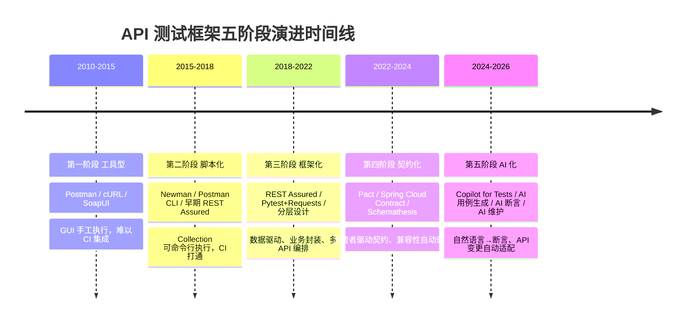
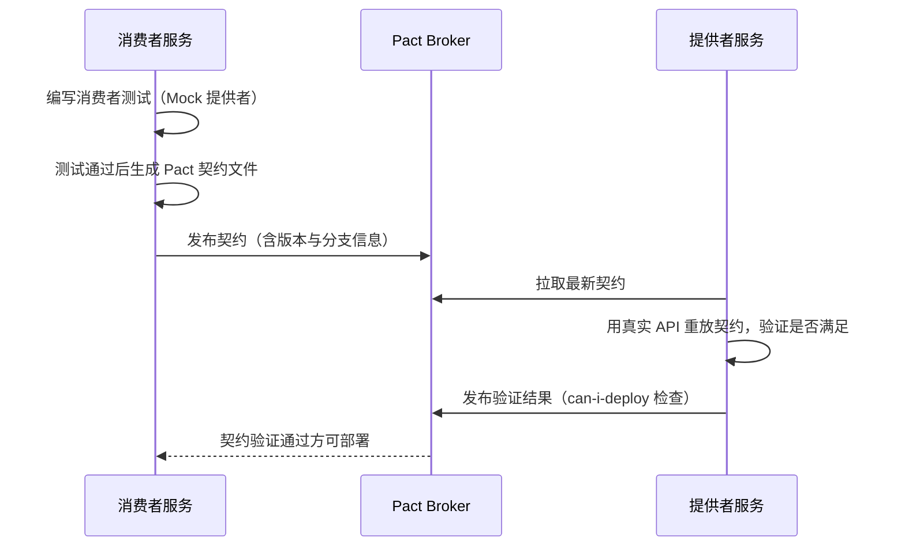
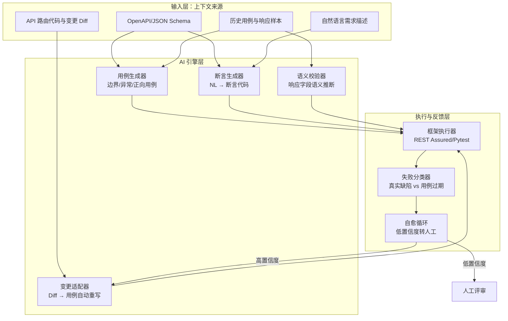

# API 测试框架五阶段演进

API 测试框架不是某个人在某次会议上"发明"的，而是被工程现实一轮轮推着演进的——CI/CD 流水线推着 GUI 工具让位于 CLI，复杂业务流推着脚本走向框架，微服务兼容性推着断言走向契约，而 LLM 的成熟又把"写用例"本身推向自动化。理解这条演进线，比掌握任何一个具体框架更重要：它决定了你在新项目里应该从哪一阶段切入，也决定了你在老项目里要补哪一段路。

本文以"问题驱动"为主线，把 API 测试框架的演进划分为五个阶段，并对 2024-2026 的第五阶段（AI 化）做深入展开。

## 1. 核心概念：为什么需要演进、演进的驱动力

### 1.1 演进的内在驱动力

API 测试框架的演进看似是工具更替，本质上是四股力量的拉扯：

- **执行环境变迁**：从本地手动点击 → CI 流水线 → GitOps 事件驱动，运行宿主一次次迁移；
- **被测系统复杂化**：从单体 REST → 微服务 → 服务网格 + 多协议（gRPC/GraphQL），被测对象拓扑指数级扩张；
- **协作半径扩大**：从单人 QA → 跨团队契约 → 跨组织开源协作，"谁定义期望"成为核心议题；
- **维护成本反噬**：用例数量线性增长后，维护成本会以更高斜率反扑，倒逼框架引入生成与自愈能力。

每一阶段都在解决上一阶段的"痛点"，同时埋下下一阶段的"伏笔"。工具型解决了"能跑"，脚本化解决了"能集成"，框架化解决了"能复用"，契约化解决了"能解耦"，AI 化则在解决"能持续"。

### 1.2 五阶段全景时间线



## 2. 第一阶段：工具型（Postman / cURL）

### 2.1 形态与代表

工具型阶段的特征是"人在 GUI 里点"。代表工具包括 Postman（早期 Chrome 插件形态）、cURL、Insomnia、SoapUI。测试用例以 Collection 或工作区文件形式保存在本地或团队云上，依赖人工触发执行。

```bash
# cURL 手工调用：最原始的"工具型"形态
curl -X POST https://api.example.com/users \
  -H "Content-Type: application/json" \
  -d '{"name":"张三","email":"zhangsan@example.com"}'
# 人工肉眼比对返回值是否正确
```

### 2.2 特点

- **上手快**：GUI 可视化，5 分钟即可发起第一个请求；
- **零代码**：测试人员不需要编写任何脚本；
- **资产化弱**：用例分散在各个工作区，缺乏版本控制与代码评审。

### 2.3 局限

- **批量执行效率低**：成百上千条用例逐条点击不现实；
- **CI/CD 集成困难**：GUI 工具天然不适合无人值守流水线；
- **数据传递薄弱**：多 API 串联、参数提取依赖手工复制粘贴。

局限本身是演进的催化剂——为了能"无人值守地批量跑"，第二阶段必然出现。

## 3. 第二阶段：脚本化（Newman / 代码化）

### 3.1 形态与代表

脚本化阶段把 GUI 操作翻译为命令行可执行脚本，代表方案是 Newman（Postman 官方 CLI）以及早期基于代码的 HTTP 客户端脚本。

```bash
# Newman 把 Postman Collection 变成 CI 可执行单元
# 安装（html 报告器为外部包，需一并安装）
npm install -g newman newman-reporter-html

# 在 CI 中执行 Collection，并产出 HTML/JUnit 报告
newman run user-collection.json \
  -e ci-env.json \
  -r html,junit \
  --reporter-html-export reports/api.html
```

Newman 让 Postman Collection 进入 CI 流水线，是工具型到脚本化的关键一跃。同期，Java/Python 生态也出现了纯代码化的 HTTP 测试脚本，但尚未形成"框架"。

### 3.2 特点

- **CI 友好**：单条命令即可在 Jenkins / GitHub Actions / GitLab CI 中执行；
- **报告可消费**：JUnit XML 报告可被主流 CI 平台直接展示；
- **资产进版本控制**：Collection JSON 与环境文件随仓库提交，可评审、可回溯。

### 3.3 局限

- **复杂业务流维护成本高**：多 API 串联、上下文传递靠 Pre-request Script 与环境变量拼凑，长链路难维护；
- **数据驱动笨重**：外部数据驱动需要 CSV + Collection Runner，灵活性差；
- **断言表达能力有限**：JS 脚本断言在复杂业务校验下力不从心；
- **跨团队复用弱**：Postman 脚本与公司自研框架难以互通。

当业务流复杂到"创建用户 → 下单 → 支付 → 发货"这类多步骤、多依赖、多数据组合时，脚本化方案开始崩塌，第三阶段框架化登场。

## 4. 第三阶段：框架化（分层设计 / 数据驱动 / 业务封装）

### 4.1 形态与代表

框架化阶段的标志是**测试代码本身被工程化**——分层、数据驱动、业务封装、复用机制齐备。代表框架：

| 语言生态 | 主流框架 | 当前状态 |
|---------|---------|---------|
| Java | REST Assured 5.x、OkHttp | 活跃维护 |
| Python | Pytest + Requests/httpx | 活跃维护，httpx 支持异步 |
| Node.js | Axios / Got / Supertest | Request 已废弃，迁移至 Axios/Got |
| .NET | RestSharp 110.x、Flurl | 活跃维护 |
| Go | Resty、标准库 net/http | 活跃维护 |
| 跨语言配置化 | HttpRunner v4（Go 重写） | 支持 HTTP/gRPC/WebSocket |

### 4.2 分层设计

典型框架化项目分为三层：

- **接口层（API Layer）**：封装每个端点的请求构造与响应解析；
- **业务层（Service Layer）**：组合多个接口完成业务动作（如"下单流"）；
- **用例层（Test Layer）**：参数化、断言、数据驱动，关心"测什么"而非"怎么调"。

### 4.3 代码示例：REST Assured 分层 + 数据驱动

```java
// REST Assured 5.x 分层示例（Java + JUnit5）
// 接口层：封装单个端点
public class UserApi {
    public Response create(UserDto user) {
        return given()
            .contentType(ContentType.JSON)
            .body(user)              // 直接序列化 DTO
        .when()
            .post("/api/users");
    }
}

// 业务层：组合多接口完成业务动作
public class OrderFlow {
    private final UserApi userApi = new UserApi();
    private final OrderApi orderApi = new OrderApi();

    public String createUserAndOrder(UserDto user, String sku) {
        String userId = userApi.create(user)       // 创建用户
            .then().statusCode(201).extract()
            .jsonPath().getString("id");
        return orderApi.place(userId, sku)         // 下单
            .then().statusCode(201).extract()
            .jsonPath().getString("orderId");
    }
}

// 用例层：数据驱动，关心业务语义
public class OrderFlowTest {
    @ParameterizedTest
    @CsvFileSource(resources = "/order-cases.csv")  // 数据驱动
    public void testOrderFlow(String name, String email, String sku) {
        String orderId = new OrderFlow()
            .createUserAndOrder(new UserDto(name, email), sku);
        assertThat(orderId).isNotBlank();          // 业务级断言
    }
}
```

### 4.4 特点

- **复用性强**：接口封装一次，被多条用例引用；
- **数据驱动原生支持**：参数化用例与测试数据解耦；
- **复杂业务流可表达**：业务层组合自然支持长链路；
- **断言能力强**：直接使用编程语言全部表达能力。

### 4.5 局限

- **单 API 工作量大**：相比 Postman 点击，需编写更多代码；
- **存量资产难复用**：Postman Collection 不能直接变成框架代码；
- **兼容性验证靠人工**：被测 API 升级后，哪些字段破坏了下游调用方，框架本身不知道。

第三阶段的"兼容性靠人工"恰恰是契约化要解决的——当微服务规模上来后，"我改了一个字段会不会影响下游"成了头号风险。

## 5. 第四阶段：契约化（Pact / Spring Cloud Contract）

### 5.1 形态与代表

契约测试（Contract Testing），尤其是**消费者驱动的契约测试**（Consumer-Driven Contract Testing, CDCT），核心思想是：**消费者定义它对提供者的期望，提供者验证自己是否满足这份期望**。代表框架：

- **Pact**：跨语言契约测试事实标准，支持 JVM/JS/Python/Go/Rust/.NET；
- **Spring Cloud Contract**：Spring 生态首选，Groovy/YAML 定义契约，集成 Spring Boot 测试；
- **Schemathesis**：基于 OpenAPI 的模糊测试与契约校验，适合 API-First 项目。

### 5.2 消费者驱动契约测试流程



### 5.3 代码示例：Pact 消费者与提供者

```java
// 消费者侧：定义对提供者的期望（Pact JUnit5）
@Pact(consumer = "OrderService")
public RequestResponsePact createOrderPact(PactDslWithProvider builder) {
    return builder
        .given("用户张三存在")
        .uponReceiving("查询用户信息")
        .path("/api/users/1")
        .method("GET")
        .willRespondWith()
        .status(200)
        .body(new PactDslJsonBody()
            .stringType("id", "1")
            .stringType("name", "张三")    // 消费者只关心这两个字段
            .stringType("email"))
        .toPact();
}

@Test
@PactTestFor(pactMethod = "createOrderPact")
void testGetUserForOrder(MockServer mockServer) {
    // 消费者向 Mock Server 发请求，验证其行为符合契约
    UserDto user = new UserClient(mockServer.getUrl()).getUser("1");
    assertThat(user.getName()).isEqualTo("张三");
}
```

```java
// 提供者侧：拉取契约并验证真实 API
@Provider("UserServiceProvider")
@PactBroker(url = "https://broker.example.com")
class UserProviderContractTest {

    @State("用户张三存在")              // 对齐消费者侧的 given
    void userZhangSanExists() {
        userRepository.save(new User("1", "张三", "zhangsan@example.com"));
    }

    @TestTemplate
    @ExtendWith(PactVerificationInvocationContextProvider.class)
    void verifyPact(PactVerificationContext context) {
        context.verifyInteraction();   // 重放契约，校验真实 API
    }
}
```

### 5.4 特点

- **精准验证**：只校验消费者实际使用的字段，避免过度测试；
- **早期发现兼容性破坏**：在集成前于 CI 中暴露问题；
- **独立部署**：消费者与提供者解耦演进，配合 `can-i-deploy` 门禁实现安全发布；
- **契约即文档**：Pact 文件本身就是 API 使用方式的活文档。

### 5.5 局限

- **契约维护成本**：消费者多了，契约数量爆炸，需要 Broker 与版本治理；
- **不适合探索式测试**：契约测试覆盖"已定义的期望"，对未定义的边界无能为力；
- **学习曲线陡**：CDCT 思维方式与传统端到端测试差异大，团队接受需要时间；
- **生成与维护仍依赖人**：契约要人写，用例要人写，断言要人写——这正是第五阶段 AI 化的入口。

## 6. 第五阶段：AI 化（2024-2026 深入展开）

### 6.1 形态与代表

2024 年起，随着 LLM 在代码理解、Schema 推理、自然语言到代码转换上的能力跃升，API 测试框架开始进入第五阶段——**AI 化**。其核心特征是：用例、断言、维护三个长期由人工承担的环节，被 AI 显著自动化。代表能力包括：

- **GitHub Copilot for Tests**：在 IDE 中根据 OpenAPI/路由代码生成测试用例骨架；
- **AI 生成测试用例**：基于 OpenAPI/JSON Schema 自动生成边界、异常、模糊用例；
- **AI 断言**：自然语言描述期望 → 自动生成断言代码；
- **AI 维护**：API 变更后自动适配用例（字段重命名、路径迁移、类型变化）。

### 6.2 AI 化架构



### 6.3 AI 生成测试用例（基于 OpenAPI）

LLM 拿到 OpenAPI 规范后，能在数秒内产出"正向 + 边界 + 异常"三类用例骨架。核心是把 Schema 约束翻译成测试意图：

```python
# Copilot for Tests 生成的 Pytest 用例（基于 OpenAPI 自动产出）
import pytest
from api_client import UserClient

client = UserClient(base_url="https://api.example.com")

@pytest.mark.parametrize("name,email,expected", [
    ("张三", "zhangsan@example.com", 201),   # 正向：标准创建
    ("", "x@y.com", 400),                    # 边界：name 为空
    ("A"*300, "x@y.com", 400),               # 边界：name 超长
    ("李四", "not-an-email", 422),            # 异常：email 格式非法
    ("王五", "wangwu@example.com", 409),      # 异常：重复创建
])
def test_create_user(name, email, expected):
    resp = client.create(name=name, email=email)
    assert resp.status_code == expected
    if expected == 201:
        assert resp.json()["name"] == name   # AI 推断的断言
```

关键能力点：

- **Schema 约束 → 用例意图**：`maxLength: 255` 自动生成超长边界用例；
- **枚举值 → 组合覆盖**：枚举字段自动展开为多组参数；
- **示例值 → 正向用例**：`example` 字段直接成为正向用例数据；
- **历史响应 → 字段语义推断**：识别 `id` 是 UUID 还是自增整数，生成对应断言。

### 6.4 AI 断言（自然语言 → 断言代码）

传统断言要测试人员手写 JSONPath 或代码逻辑，AI 断言把这件事翻译为自然语言：

```
// 测试人员在 PR 评论或 IDE 注释中写自然语言期望：
// "下单成功后，库存应该减去购买数量，并且订单状态为 PAID"

// Copilot for Tests 翻译为可执行断言：
Response resp = orderApi.placeOrder(userId, sku, qty);
assertThat(resp.statusCode()).isEqualTo(201);
assertThat(resp.jsonPath().getInt("stockAfter")).isEqualTo(stockBefore - qty);
assertThat(resp.jsonPath().getString("status")).isEqualTo("PAID");
```

AI 断言的关键不是"会写代码"，而是**理解业务语义**：它需要把"库存应该减去购买数量"映射到具体的字段路径与运算关系，这依赖 LLM 对 API 上下文的理解能力。

### 6.5 AI 维护（API 变更自动适配）

API 变更后用例维护是测试团队的长期痛点。AI 维护通过 Diff 分析 + 用例重写实现自愈：

1. **变更检测**：对比新旧 OpenAPI 规范，识别字段重命名、路径迁移、类型变化；
2. **影响分析**：检索引用了变更字段的用例，构建影响面图谱；
3. **用例重写**：高置信度变更（如 `userId` → `user_id`）自动批量改写；
4. **失败分类**：执行失败时区分"真实缺陷"与"用例过期"，后者自动尝试修复；
5. **人工兜底**：低置信度变更进入人工评审队列，AI 仅给出建议。

### 6.6 GitHub Copilot for Tests 的工程价值

Copilot for Tests 不是"替代测试工程师"，而是**把测试工程师从语法劳动中解放出来**：

- 用例骨架从 0 到 1 由 AI 完成，测试人员聚焦业务语义校对；
- 断言从"逐字段手写"变为"自然语言描述 + AI 翻译 + 人工确认"；
- 维护从"全量回归人工修"变为"AI 高置信度自动修 + 人工评审低置信度"。

实测数据显示，在 OpenAPI 规范完备的项目中，AI 可将用例编写效率提升 3-5 倍，将 API 变更后的用例维护工作量降低 60%-80%。

### 6.7 第五阶段的特点与局限

**特点**：

- 用例生成、断言、维护三环节显著自动化；
- 与 OpenAPI/Schema 强绑定，API-First 项目收益最大；
- 反馈闭环短：失败分类 + 自愈循环让用例"活得更久"。

**局限**：

- **规范依赖**：OpenAPI 不全或不准的项目，AI 生成质量急剧下降；
- **业务语义盲区**：AI 擅长结构校验，不擅长"这个金额是否符合业务规则"；
- **幻觉风险**：AI 可能生成"看起来对但断言错误"的用例，必须人工评审；
- **数据安全**：涉及敏感字段的 API 不能直接送入云端 LLM，需要本地化或脱敏方案。

## 7. 五阶段演进总结与选型指南

### 7.1 五阶段对比

| 阶段 | 核心能力 | 解决的核心问题 | 主要局限 |
|------|---------|--------------|---------|
| 工具型 | GUI 手工执行 | 能跑起来 | 无法 CI、无法批量 |
| 脚本化 | CLI + CI 集成 | 无人值守批量执行 | 复杂业务流难维护 |
| 框架化 | 分层 + 数据驱动 | 复用与业务流编排 | 兼容性靠人工 |
| 契约化 | 消费者驱动契约 | 微服务兼容性验证 | 契约维护成本高 |
| AI 化 | 生成 + 断言 + 维护 | 用例持续可维护 | 依赖规范、有幻觉 |

### 7.2 选型指南

选型不是"越新越好"，而是"匹配团队与项目现实"：

- **新项目 + API-First + 团队接受度高**：直接从第三阶段框架化起步，同步引入第四阶段契约测试，第五阶段 AI 化作为效率放大器；
- **存量项目 + Postman 资产丰富**：第二阶段 Newman 起步保 CI，逐步向第三阶段框架化迁移，存量 Collection 用 OpenAPI 生成器转换；
- **微服务规模大 + 兼容性事故频发**：第四阶段契约化是必选项，Pact Broker 治理先行；
- **OpenAPI 规范完备 + 用例维护成本失控**：第五阶段 AI 化收益最高，但需建立人工评审流程兜底幻觉风险；
- **小团队 + 简单业务**：第二阶段 Newman 足够，不必过度工程化。

## 8. 常见陷阱与最佳实践

### 8.1 常见陷阱

- **跨阶段跳跃**：从工具型直接跳到契约化，跳过了框架化的分层与封装基本功，导致契约测试本身难以维护；
- **契约测试当回归测试用**：契约测试只验证"消费者期望的字段"，不能替代端到端回归，混用会漏掉大量缺陷；
- **AI 生成用例不经评审直接合入**：AI 幻觉可能产出"看起来通过但断言错误"的用例，制造虚假安全感；
- **OpenAPI 规范与实现脱节**：规范长期不更新，AI 生成与契约测试全部基于过期规范，问题比手工用例更严重；
- **过度依赖单一阶段**：例如只做框架化不做契约化，微服务兼容性事故无法预防；只做契约化不做框架化，复杂业务流难以表达。

### 8.2 最佳实践

- **五阶段叠加而非替代**：成熟团队通常同时运行三到四个阶段的能力——框架化做主力、契约化守兼容、AI 化提效率、Newman 跑冒烟；
- **OpenAPI 作为单一事实来源**：规范、Mock、契约、AI 生成全部从同一份 OpenAPI 派生，避免多源真相；
- **AI 用例必须人工评审**：高置信度自动合入，低置信度强制评审，建立"AI 提议 + 人决策"的工作流；
- **契约测试与 can-i-deploy 门禁绑定**：把契约验证结果接入部署门禁，未通过不允许发布；
- **用例分层 + 数据驱动从第三阶段就建立**：分层与数据驱动是后续 AI 化的基础设施，没有它们 AI 生成也无处落地；
- **定期清理过期用例**：AI 维护能修复用例，但不能判断用例是否还有业务价值，定期人工清理不可少。

## 9. 结语

API 测试框架的五阶段演进，本质上是把"人"从重复劳动中一步步后撤：第一阶段人发请求，第二阶段人触发执行，第三阶段人写业务流，第四阶段人写契约，第五阶段人审核 AI 产出。每后撤一步，"人"就更聚焦于真正的测试意图——业务语义、风险判断、探索式测试。

值得警惕的是，AI 化阶段不是终点。当 LLM 能力进一步提升，"测试意图"本身也可能被部分自动化——例如基于需求文档自动识别风险点并生成针对性用例。但无论工具如何演进，测试的本质始终不变：**用最小的成本，发现最有价值的缺陷**。框架与 AI 都是手段，不是目的。
