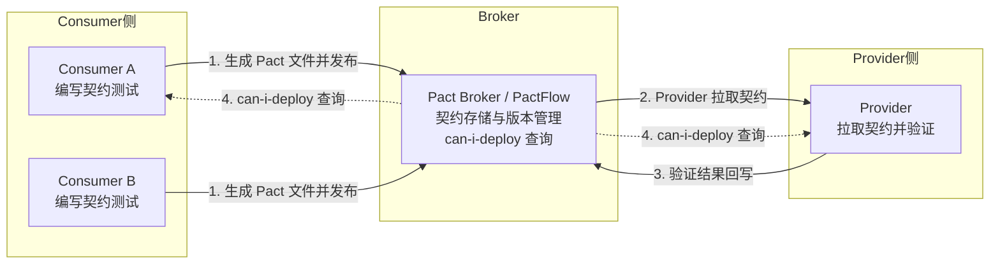
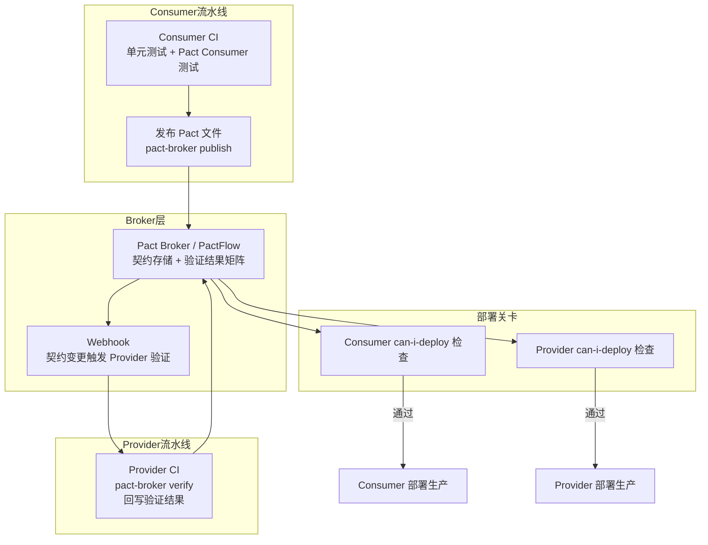

# 微服务契约测试（Pact 与 Spring Cloud Contract）

## 一、为什么微服务需要契约测试

在单体架构中，模块之间通过进程内方法调用完成协作，编译器与类型系统足以约束接口契约。一旦演进到微服务架构，服务之间通过 HTTP、gRPC、消息队列等跨进程方式通信，接口契约被"搬运"到了运行时，编译器再也帮不上忙。于是出现了两类高频问题：

- **Provider 破坏性变更**：Provider 修改了字段类型、删除了字段或调整了路径，所有下游 Consumer 在生产环境才发现调用失败。
- **Consumer 假设漂移**：Consumer 凭文档或口口相传推断 Provider 的行为，本地测试通过后上线却踩坑。

端到端（E2E）测试理论上能发现这些问题，但 E2E 用例数随服务数呈指数增长，环境编排成本极高，反馈周期常以"小时"甚至"天"为单位。契约测试正是填补"单元测试太微观、E2E 太重"之间的中间层：它**只验证服务间接口契约本身**，不验证业务逻辑，也不需要拉起整个依赖拓扑。

## 二、消费者驱动契约测试（CDC）核心思想

消费者驱动契约测试（Consumer-Driven Contract Testing，CDCT）的核心思想可以浓缩为一句话：**Provider 的接口契约由其 Consumer 共同定义，而非由 Provider 单方面决定**。

这与传统"先有 Provider API 文档、Consumer 被动适配"的思路正好相反。CDC 让 Consumer 把"我对 Provider 的真实调用期望"显式写成契约文件，再让 Provider 拿这些契约去自证：只要 Provider 满足所有 Consumer 的契约，就绝对不会出现"接口变了下游挂了"的破坏性变更。

CDC 涉及三个角色：

- **Consumer（消费者）**：调用 Provider 接口的一方，负责编写契约并在自己的单元测试中验证对 Provider 的调用逻辑。
- **Provider（提供者）**：对外提供 API 的一方，从 Broker 拉取契约，重放契约中描述的请求并校验自己的响应是否符合预期。
- **Broker（契约中介）**：存储、版本化契约文件，并提供"是否可以安全发布""是否可以安全部署"等元数据查询能力。



图1 CDC 三方交互流程：Consumer 驱动契约生成，Provider 验证契约，Broker 居中协调部署决策

关键收益在于：Consumer 的测试只跑自己 + Mock，秒级反馈；Provider 的验证只跑自己 + 契约重放，无需启动下游；两端解耦开发、解耦发布，但又被契约"软约束"。

## 三、Pact 实战

Pact 是 CDC 测试的事实标准，截至 2026-09，pact-jvm 最新稳定版为 4.7.x、pact-python 为 3.x，支持 JVM、JavaScript、Python、Go、Ruby、.NET、Rust 等多语言。Pact 4.x 的关键能力包括：原生的 V4 契约规范、通过插件机制对 gRPC 与消息中间件的支持、较完善的 matching rules 引擎、以及与 PactFlow 的深度集成。

### 3.1 Consumer 端编写契约

Consumer 端使用 Pact 提供的 Mock Provider，在自己进程内模拟 Provider 的响应，并断言自己解析响应的逻辑正确。测试执行完毕后，Pact 会把"请求-响应期望"序列化为 JSON 契约文件。

Java（Pact JVM 4.x）示例：

```java
// Consumer 端契约测试：定义对账户服务的调用期望
@PactTestFor(providerName = "account-service", port = "8080")
@ExtendWith(PactConsumerTestExt.class)
class AccountConsumerPactTest {

    // 定义契约：当请求 /accounts/1 时，期望返回账户详情
    @Pact(consumer = "subscription-service")
    RequestResponsePact getAccountByIdPact(PactDslWithProvider builder) {
        return builder
            .given("账户 1 已存在")                          // Provider 端的状态前置条件
            .uponReceiving("查询账户 1 的信息")
                .path("/accounts/1")
                .method("GET")
            .willRespondWith()
                .status(200)
                .headers(Map.of("Content-Type", "application/json"))
                .body(new PactDslJsonBody()
                    .integerType("id", 1)                   // 字段类型匹配，避免硬编码
                    .stringType("name")
                    .numberType("balance"))
            .toPact();
    }

    @Test
    @PactTestFor(pactMethod = "getAccountByIdPact")
    void shouldParseAccount_whenApiReturns200(MockServer mockServer) {
        // 调用真实的 Consumer 业务代码，底层 HTTP 走 Pact Mock
        Account account = new AccountClient(mockServer.getUrl()).findById(1L);
        assertThat(account.getId()).isEqualTo(1L);
        assertThat(account.getName()).isNotBlank();
    }
}
```

Python（pact-python，v2 兼容 API）示例：

```python
# Consumer 端契约测试：定义对账户服务的调用期望
from pact import Consumer, Provider
from pact.matchers import like

pact = Consumer("subscription-service").has_pact_with(
    Provider("account-service"),
    pact_dir="./pacts",                 # 契约文件输出目录
)

@pact.given("账户 1 已存在")
@pact.upon_receiving("查询账户 1 的信息")
@pact.with_request(method="GET", path="/accounts/1")
@pact.will_respond_with(
    status=200,
    headers={"Content-Type": "application/json"},
    body={"id": 1, "name": like("Alice"), "balance": like(1000.0)},
)
def test_find_account_by_id():
    # Mock 启动期间，AccountClient 应正确解析响应
    with pact:
        client = AccountClient(base_url=pact.uri)
        account = client.find_by_id(1)
        assert account.id == 1
```

### 3.2 Provider 端验证

Provider 端不需要写契约，只需要拉取所有 Consumer 发布的契约文件，把契约中的"请求"重放给自己，再校验"响应"是否满足契约中的期望。Provider 端最关键的是实现 `@State` 钩子，将契约中的 `given` 前置条件映射成测试数据准备逻辑。

```java
// Provider 端契约验证：重放契约请求并校验响应
@Provider("account-service")
@PactBroker                              // 从 Pact Broker 拉取契约
@SpringBootTest(webEnvironment = SpringBootTest.WebEnvironment.RANDOM_PORT)
class AccountProviderPactTest {

    @LocalServerPort
    int port;

    @TestTemplate
    @ExtendWith(PactVerificationInvocationContextProvider.class)
    void verifyPact(PactVerificationContext context) {
        context.verifyInteraction();    // 重放每一条契约交互
    }

    @BeforeEach
    void setup(PactVerificationContext context) {
        context.setTarget(new HttpTestTarget("localhost", port));
    }

    @State("账户 1 已存在")               // 对应 Consumer 端的 given 注解
    void prepareAccount1() {
        accountRepository.save(new Account(1L, "Alice", new BigDecimal("1000.00")));
    }
}
```

### 3.3 Pact Broker 与 CI/CD 集成

Pact Broker 是契约的"GitLab + 制品仓库"，存储契约文件、验证结果、分支与标签信息，并通过 `can-i-deploy` 命令回答"当前版本能否安全部署到生产"。官方同时提供商业 SaaS 版本 **PactFlow**，提供 RBAC、SCM 集成、智能通知与托管式基础设施，开源版 Pact Broker 则继续维护。



图2 Pact Broker/PactFlow 在 CI/CD 中的集成架构：契约变更触发 Webhook，部署前强制 can-i-deploy 检查

GitHub Actions 集成示例（Consumer 端发布契约）：

```yaml
# .github/workflows/consumer-pact.yml
name: Consumer Pact Pipeline
on: [push, pull_request]

jobs:
  pact:
    runs-on: ubuntu-latest
    steps:
      - uses: actions/checkout@v4
      - uses: actions/setup-java@v4
        with: { java-version: '21', distribution: 'temurin' }
      - run: ./mvnw test -Ppact-consumer        # 执行 Consumer 契约测试，生成 pacts/*.json
      # 将契约发布到 PactFlow，附带 git 提交号与分支标签
      - name: Publish pacts
        run: |
          docker run --rm \
            -e PACT_BROKER_BASE_URL=${{ secrets.PACTFLOW_URL }} \
            -e PACT_BROKER_TOKEN=${{ secrets.PACTFLOW_TOKEN }} \
            -v ${{ github.workspace }}/pacts:/pacts \
            pactfoundation/pact-cli:latest \
            publish /pacts \
            --consumer-app-version ${{ github.sha }} \
            --branch ${{ github.ref_name }}
      # 部署前询问 Broker：当前 Consumer 版本是否已被所有 Provider 验证
      - name: can-i-deploy
        run: |
          docker run --rm \
            -e PACT_BROKER_BASE_URL=${{ secrets.PACTFLOW_URL }} \
            -e PACT_BROKER_TOKEN=${{ secrets.PACTFLOW_TOKEN }} \
            pactfoundation/pact-cli:latest \
            broker can-i-deploy \
            --pacticipant subscription-service \
            --version ${{ github.sha }} \
            --to-environment production
```

## 四、Spring Cloud Contract 实战

Spring Cloud Contract（SCC）是 Spring 生态的契约测试框架，当前 4.x（对应 Spring Boot 3.x）与 5.0.x（对应 Spring Boot 4.x）两条版本线并行；2026 年 7 月官方仓库已归档，维护移交至 Stubborn.sh，选型时需关注其后续演进。与 Pact 不同，SCC 采用 **Provider 驱动** 模式：契约由 Provider 团队编写并打包为 stubs JAR，Consumer 通过 Maven/Gradle 坐标拉取 stubs 用于本地 Mock，Provider 自身则用 Verifier 插件基于契约生成 JUnit 测试。

### 4.1 Contract DSL

SCC 支持 Groovy DSL 与 YAML 两种格式。Groovy DSL 表达力更强，YAML 更适合非 JVM 团队。

```groovy
// contracts/shouldReturnAccount.groovy
// Provider 端定义契约：描述请求与期望响应
org.springframework.cloud.contract.spec.Contract.make {
    request {
        method 'GET'
        url '/accounts/1'
        headers { header('Accept', 'application/json') }
    }
    response {
        status 200
        body([
            id     : $(anyInteger()),
            name   : $(anyNonBlankString()),
            balance: $(anyNumber())
        ])
        headers { header('Content-Type', 'application/json') }
    }
}
```

### 4.2 Provider 端自动验证

SCC Verifier 插件在编译期读取契约，生成对应 JUnit 测试基类，Provider 只需提供基类实现，将契约请求转发到 Spring MockMvc。

```java
// Provider 基类：契约请求通过 MockMvc 命中真实 Controller
@SpringBootTest(webEnvironment = SpringBootTest.WebEnvironment.MOCK)
@AutoConfigureMockMvc
abstract class AccountContractBase {

    @Autowired
    MockMvc mockMvc;

    @BeforeEach
    void prepareData() {
        // 契约中的数据前置：插入账户 1
        accountRepository.save(new Account(1, "Alice", new BigDecimal("1000.00")));
    }
}
```

### 4.3 Consumer 端 Stub 拉取

```java
// Consumer 端通过 StubRunner 拉取 Provider 的 stubs JAR 并启动 Mock
@AutoConfigureStubRunner(
    ids = "com.example:account-service:+:stubs:8080",
    stubsMode = StubRunnerProperties.StubsMode.REMOTE
)
@SpringBootTest
class SubscriptionServiceTest {

    @Autowired
    SubscriptionService subscriptionService;

    @Test
    void shouldCreateSubscription_whenAccountExists() {
        // 调用真实业务代码，HTTP 由 Stub 自动响应契约内容
        Subscription sub = subscriptionService.createSubscription(1L);
        assertThat(sub.getStatus()).isEqualTo("ACTIVE");
    }
}
```

### 4.4 Pact 与 Spring Cloud Contract 对比

| 维度 | Pact | Spring Cloud Contract |
|------|------|------------------------|
| 驱动方 | Consumer 驱动 | Provider 驱动 |
| 契约格式 | Pact JSON（跨语言标准） | Groovy/YAML（Spring 私有） |
| 跨语言支持 | 支持 JVM/JS/Python/Go/Rust 等 | 仅 JVM 生态 |
| 契约存储 | Pact Broker / PactFlow | Maven 仓库（stubs JAR） |
| 部署决策 | can-i-deploy 内置 | 需自行实现 |
| 适用场景 | 多语言、跨团队、组织级 | Spring 单一技术栈团队 |

实践建议：组织内部存在多语言微服务时优先选 Pact；纯 Spring 团队且团队边界清晰时，SCC 上手成本更低。

## 五、消息队列契约测试

同步 HTTP 契约成熟后，2024-2026 业界重点关注异步消息契约。Pact 提供 **Pact Messaging** 模块，支持 Kafka、RabbitMQ、AWS SNS/SQS、Kinesis 等中间件，核心思路是把消息本身视作"请求/响应"的载体：Consumer 描述"我期望收到什么格式的消息"，Provider 描述"我会发出什么格式的消息"。

```java
// Consumer 端：定义对账户事件消息的期望
@PactTestFor(providerName = "account-event-producer", providerType = ProviderType.ASYNCH)
class AccountEventConsumerPactTest {

    @Pact(consumer = "notification-service")
    MessagePact accountCreatedEventPact(MessagePactBuilder builder) {
        return builder
            .expectsToReceive("账户创建事件")
            .withContent(new PactDslJsonBody()
                .stringValue("eventType", "AccountCreated")
                .integerType("accountId")
                .datetime("createdAt", "yyyy-MM-dd'T'HH:mm:ssZ"))
            .toPact();
    }

    @Test
    @PactTestFor(pactMethod = "accountCreatedEventPact")
    void shouldHandleAccountCreatedEvent(List<Message> messages) {
        // 把契约消息喂给 Consumer 的消息处理逻辑
        notificationService.handle(messages.get(0));
        verify(emailSender).sendWelcomeMail(anyLong());
    }
}
```

Kafka 场景下的关键约束：

- **Schema 注册中心**：与 Confluent Schema Registry 集成，校验 Avro/Protobuf 消息兼容性。
- **Topic 级别契约**：每个 Topic 一组契约，避免不同事件类型混入同一契约文件。
- **幂等性验证**：契约验证时需保证 Provider 重放消息后 Consumer 行为幂等。

## 六、Pact 与 gRPC 契约测试

Pact 通过插件机制支持 gRPC 契约。gRPC 的契约本就由 `.proto` 文件强约束，Pact 在此之上补充"调用场景级"验证：特定方法的特定输入应返回特定输出。其插件 `pact-protobuf-plugin` 会读取 `.proto` 文件，把消息体以 Protobuf 格式编解码，匹配规则也作用于 Protobuf 字段。

典型适用场景是验证流式 RPC 的双向交互：在 Consumer 端用 Mock Server 模拟 Server Stream，断言 Consumer 对每一帧的处理逻辑；在 Provider 端把契约中描述的请求帧重放给真实 Server。

## 七、Pact 与 OpenAPI / Schema 的关系

很多团队纠结"既然有 OpenAPI 还要契约测试吗"，二者实际上是互补关系而非替代：

- **OpenAPI** 描述 Provider 单方面声明的"接口形状"（路径、方法、Schema），是**单端真相**，无法表达 Consumer 的真实调用场景与字段使用范围。
- **Pact 契约** 描述 Consumer 在特定业务场景下对 Provider 的具体期望，是**双端共识**，能精准捕捉"OpenAPI 看起来没问题但下游实际崩溃"的破坏性变更。

工程实践上的协同方式：

1. **Schema 注册中心**（Confluent Schema Registry / Apicurio Registry）作为消息体格式的"单一事实来源"，Pact 通过插件读取 Schema 生成匹配规则，避免重复维护字段定义。
2. **OpenAPI 转 Pact**：通过脚本或社区转换工具把 OpenAPI 操作生成 Pact 契约骨架，再由 Consumer 团队补充具体期望值。
3. **Pact 转 OpenAPI**：把 Consumer 已发布的契约聚合为 Provider 的"实际被使用接口"快照，用于发现 OpenAPI 中长期冗余的端点。

## 八、常见陷阱与最佳实践

1. **契约测试不是功能测试**：契约只验证"接口形状对得上"，业务逻辑验证应留在各自单元测试中。混入业务断言会让契约膨胀且难以维护。
2. **避免硬编码字面值**：Consumer 端契约尽量使用 `like`、`eachLike`、`term` 等匹配器，否则 Provider 任意字段变化都会让契约失败。
3. **Provider State 必须真实**：`@State` 钩子要把数据准备到与生产等价的状态，否则验证通过仅是"自欺欺人"。
4. **can-i-deploy 必须是部署硬卡点**：仅生成验证结果但不在部署流水线中强制 `can-i-deploy` 检查，等于没做契约测试。
5. **契约版本与分支绑定**：发布契约时务必带 `--branch` 与 `--consumer-app-version`，PactFlow 支持 `branch` 与 `environment` 双维度矩阵，能让并行分支互不干扰。
6. **警惕"全量契约"反模式**：不要为 Provider 的每个端点都写契约，只为真实存在的 Consumer 调用场景写契约，否则又退化为传统 API 测试。
7. **gRPC/消息契约需关注向后兼容**：Protobuf 字段编号变更、Kafka Topic 重命名都属破坏性变更，应在契约中显式覆盖。
8. **PactFlow 与自建 Broker 选型**：组织内团队 <5 个、对 SaaS 合规无强约束时优先 PactFlow；强合规、需私有部署场景再自建 Broker。

## 总结

契约测试是微服务测试金字塔中"性价比最高的一层"：投入远小于 E2E，却能在 CI 阶段就拦截绝大多数跨服务破坏性变更。2026 年的契约测试生态已远超"REST + JSON"的早期形态：Pact 把 gRPC、Kafka、RabbitMQ 统一纳入契约范畴，PactFlow 把 can-i-deploy 升级为托管式部署门禁，Spring Cloud Contract 在 Spring 生态提供低门槛的 Provider 驱动方案，OpenAPI 与 Schema Registry 则与契约测试形成"声明 vs. 验证"的互补组合。掌握 CDC 的核心思想——"Provider 由 Consumer 共同定义"——并按团队实际技术栈选择合适工具，是构建可持续微服务测试体系的关键。
