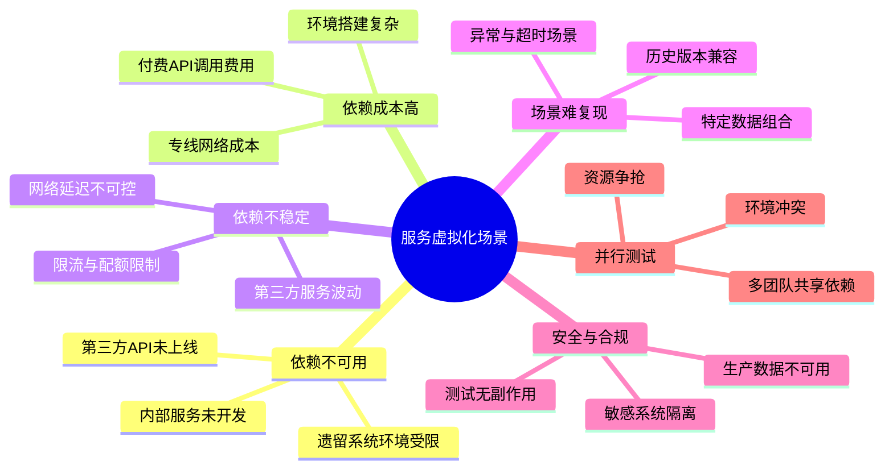
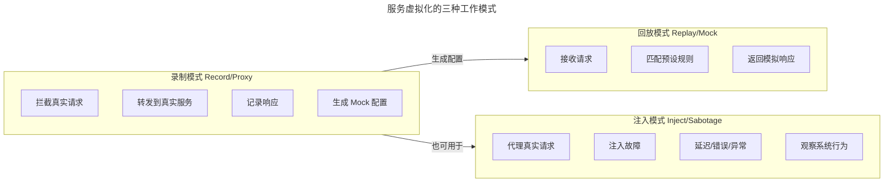
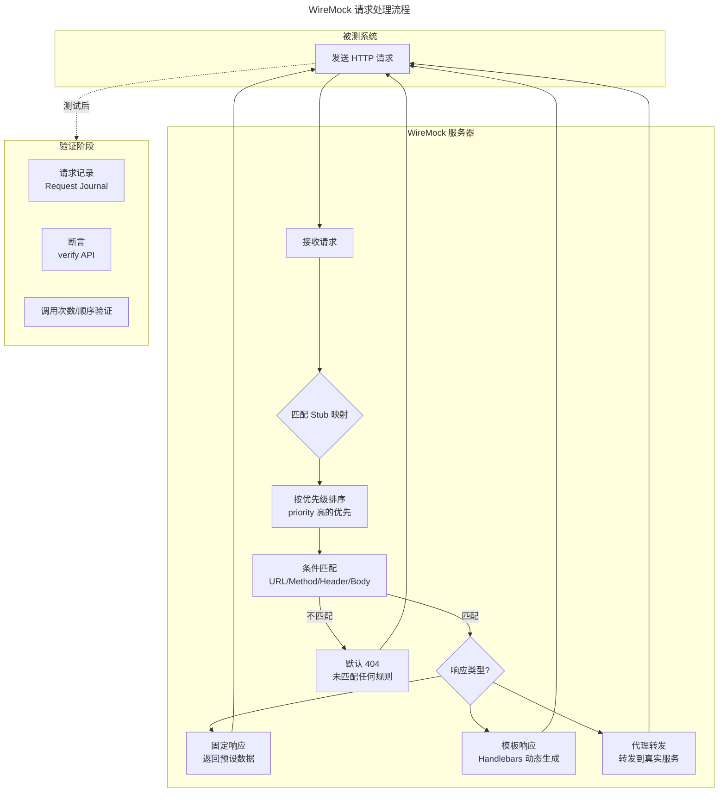
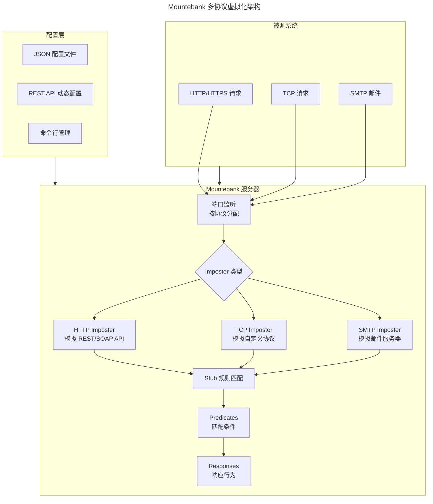

# 服务虚拟化与 Mock Server（Mountebank/WireMock）

## 一、模块介绍

**服务虚拟化**（Service Virtualization）是在测试环境中模拟被测系统所依赖的外部服务行为的技术。当被测系统需要与第三方 API、支付网关、短信平台、遗留系统等不可控或不可用的服务交互时，服务虚拟化通过**模拟这些依赖服务的响应**，让被测系统在"仿佛依赖真实存在"的环境中完成测试。

**Mock Server** 是服务虚拟化的轻量级实现——在测试期间临时运行一个 HTTP/HTTPS 服务器，按预设规则返回模拟响应。Mock Server 适用于单元测试与集成测试级别；服务虚拟化则更强调**模拟复杂业务行为**（状态机、延迟、错误注入、协议多样性），适用于端到端测试与性能测试。

本文系统阐述服务虚拟化的核心原理、WireMock 与 Mountebank 两大主流工具的实践、Mock 策略设计、以及与契约测试的关系。

## 二、核心方法论

### 2.1 服务虚拟化的价值场景



### 2.2 Mock 与 Stub 与虚拟化的层次

| 层次 | 实现方式 | 覆盖范围 | 典型工具 |
| --- | --- | --- | --- |
| **Test Double** | 代码级对象替换 | 单个类/方法 | Mockito、unittest.mock |
| **Stub** | 预设固定返回值 | 单个接口 | Postman Mock、Sinon |
| **Mock Server** | HTTP 服务器模拟 | 多个接口/服务 | WireMock、Mountebank |
| **Service Virtualization** | 完整行为模拟 | 复杂业务流程 | Hoverfly、WireMock 高级模式 |

### 2.3 服务虚拟化的三种模式



## 三、关键流程

### 3.1 WireMock 工作流程



### 3.2 Mountebank 多协议架构



Mountebank 与 WireMock 的核心差异：**Mountebank 原生支持多协议**（HTTP/HTTPS/TCP/SMTP），WireMock 专注 HTTP/HTTPS。多协议场景（如金融系统中的 TCP 协议、邮件通知场景）下 Mountebank 更合适。（注：mountebank 2.0 起 TCP/SMTP 等非 HTTP 协议已从开源核心包拆分，由独立项目 mbjs 等承接，选型时需确认所用版本的协议支持范围。）

### 3.3 Mock 策略设计流程

```mermaid
---
title: Mock 策略设计五步流程
---
flowchart LR
    subgraph Analyze["1. 依赖分析"]
        A1["识别外部依赖\n第三方API/MQ/DB"]
        A2["评估依赖稳定性"]
        A3["标记需 Mock 的依赖"]
    end

    subgraph Design["2. 响应设计"]
        D1["正常响应\n基于真实数据样例"]
        D2["异常响应\n超时/错误码/异常数据"]
        D3["状态响应\n基于状态机返回不同结果"]
    end

    subgraph Manage["3. 数据管理"]
        M1["Mock 数据版本化"]
        M2["与契约文件对齐"]
        M3["Mock 数据脱敏"]
    end

    subgraph Deploy["4. 部署与执行"]
        DP1["嵌入式启动\n测试内启动"]
        DP2["独立部署\nDocker/K8s"]
        DP3["按需创建销毁"]
    end

    subgraph Maintain["5. 维护与演进"]
        MT1["契约变更同步"]
        MT2["Mock 数据校准"]
        MT3["定期清理无效 Mock"]
    end

    Analyze --> Design --> Manage --> Deploy --> Maintain
    Maintain -.->|"循环"| Analyze
```



## 四、工具与实践

### 4.1 WireMock Java 实战

```java
import com.github.tomakehurst.wiremock.WireMockServer;
import com.github.tomakehurst.wiremock.client.WireMock;
import com.github.tomakehurst.wiremock.junit5.WireMockExtension;
import org.junit.jupiter.api.Test;
import org.junit.jupiter.api.extension.RegisterExtension;

import static com.github.tomakehurst.wiremock.client.WireMock.*;
import static com.github.tomakehurst.wiremock.core.WireMockConfiguration.wireMockConfig;
import static io.restassured.RestAssured.given;
import static org.hamcrest.Matchers.*;

class PaymentServiceMockTest {

    // 方式1: 使用 JUnit 5 扩展（推荐）
    @RegisterExtension
    static WireMockExtension wireMock = WireMockExtension.newInstance()
        .options(wireMockConfig().dynamicPort())
        .build();

    @Test
    void shouldReturnSuccessWhenPaymentApproved() {
        // 设置 Mock：模拟支付网关成功响应
        wireMock.stubFor(post(urlPathEqualTo("/api/payments"))
            .withHeader("Content-Type", equalTo("application/json"))
            .withRequestBody(matchingJsonPath("$.amount", equalTo("99.50")))
            .willReturn(aResponse()
                .withStatus(200)
                .withHeader("Content-Type", "application/json")
                .withBody("""
                    {
                        "paymentId": "pay-20260812-001",
                        "status": "SUCCESS",
                        "transactionTime": "2026-08-12T10:30:00Z"
                    }
                    """)
                .withFixedDelay(200)  // 模拟 200ms 处理延迟
            ));

        // 调用被测服务（指向 WireMock 而非真实支付网关）
        given()
            .header("Content-Type", "application/json")
            .body("{\"orderId\":\"ord-001\",\"amount\":\"99.50\"}")
            .when()
            .post(wireMock.baseUrl() + "/api/payments")
            .then()
            .statusCode(200)
            .body("status", equalTo("SUCCESS"))
            .body("paymentId", notNullValue());
    }

    @Test
    void shouldHandlePaymentGatewayTimeout() {
        // 模拟支付网关超时（延迟 10 秒，超过客户端超时）
        wireMock.stubFor(post(urlPathEqualTo("/api/payments"))
            .willReturn(aResponse()
                .withFixedDelay(10000)
                .withStatus(200)
                .withBody("{}")
            ));

        // 验证被测系统的超时处理与降级逻辑
        given()
            .header("Content-Type", "application/json")
            .body("{\"orderId\":\"ord-002\",\"amount\":\"50.00\"}")
            .when()
            .post(wireMock.baseUrl() + "/api/payments")
            .then()
            .statusCode(503)  // 被测服务应返回服务不可用
            .body("error", containsString("timeout"));
    }

    @Test
    void shouldUseTemplatingForDynamicResponse() {
        // 使用 Handlebars 模板动态生成响应
        wireMock.stubFor(get(urlPathMatching("/api/users/(.+)"))
            .willReturn(okJson("""
                {
                    "id": "{{request.path.[2]}}",
                    "name": "User-{{request.path.[2]}}",
                    "createdAt": "{{now format='yyyy-MM-dd'}}"
                }
                """)
                .withTransformers("response-template")
            ));

        // 任意用户 ID 请求都能得到动态响应
        given()
            .when()
            .get(wireMock.baseUrl() + "/api/users/12345")
            .then()
            .statusCode(200)
            .body("id", equalTo("12345"))
            .body("name", equalTo("User-12345"));
    }

    @Test
    void shouldVerifyRequestCount() {
        // 先设置 Mock
        wireMock.stubFor(post(urlPathEqualTo("/api/payments"))
            .willReturn(okJson("{\"status\":\"SUCCESS\"}")));

        // 执行多次调用
        for (int i = 0; i < 3; i++) {
            given().body("{\"amount\":\"10.00\"}")
                .post(wireMock.baseUrl() + "/api/payments");
        }

        // 验证调用次数与顺序
        wireMock.verify(3, postRequestedFor(urlPathEqualTo("/api/payments")));
        wireMock.verify(postRequestedFor(urlPathEqualTo("/api/payments"))
            .withRequestBody(matchingJsonPath("$.amount", equalTo("10.00"))));
    }

    @Test
    void shouldSimulateStatefulBehavior() {
        // 场景：库存查询 Mock 需要有状态
        // 第一次查询返回"有库存"，下单后第二次查询返回"无库存"
        wireMock.stubFor(get(urlPathEqualTo("/api/inventory/sku-001"))
            .inScenario("Inventory Flow")
            .whenScenarioStateIs("Started")
            .willReturn(okJson("{\"sku\":\"sku-001\",\"stock\":10}"))
            .willSetStateTo("In Stock"));

        wireMock.stubFor(post(urlPathEqualTo("/api/orders"))
            .inScenario("Inventory Flow")
            .whenScenarioStateIs("In Stock")
            .willReturn(okJson("{\"orderId\":\"ord-001\",\"status\":\"CREATED\"}"))
            .willSetStateTo("Ordered"));

        wireMock.stubFor(get(urlPathEqualTo("/api/inventory/sku-001"))
            .inScenario("Inventory Flow")
            .whenScenarioStateIs("Ordered")
            .willReturn(okJson("{\"sku\":\"sku-001\",\"stock\":9}")));

        // 执行场景：查询→下单→再查询
        given().get(wireMock.baseUrl() + "/api/inventory/sku-001")
            .then().body("stock", equalTo(10));

        given().body("{\"sku\":\"sku-001\"}")
            .post(wireMock.baseUrl() + "/api/orders")
            .then().body("status", equalTo("CREATED"));

        given().get(wireMock.baseUrl() + "/api/inventory/sku-001")
            .then().body("stock", equalTo(9));
    }
}
```

### 4.2 WireMock 独立部署模式

```yaml
# docker-compose-wiremock.yml
version: '3.9'

services:
  wiremock:
    image: wiremock/wiremock:3.10
    ports:
      - "8080:8080"   # Mock 服务端口
      - "8081:8081"   # 管理API端口
    volumes:
      - ./mappings:/home/wiremock/mappings     # Stub 映射文件
      - ./__files:/home/wiremock/__files       # 响应体文件
    command: --verbose --enable-browser-proxying --container-threads 50
```

```json
// mappings/payment-gateway.json — Stub 映射配置文件
{
  "mappings": [
    {
      "name": "支付成功",
      "priority": 1,
      "request": {
        "method": "POST",
        "urlPath": "/api/payments",
        "headers": {
          "Content-Type": {
            "matches": "application/json"
          }
        },
        "bodyPatterns": [
          {
            "matchesJsonPath": {
              "expression": "$.amount",
              "matches": "^[0-9]+\\.[0-9]{2}$"
            }
          }
        ]
      },
      "response": {
        "status": 200,
        "headers": {
          "Content-Type": "application/json"
        },
        "jsonBody": {
          "paymentId": "pay-mock-{{jsonPath request.body '$.orderId'}}",
          "status": "SUCCESS",
          "transactionTime": "{{now}}"
        },
        "transformers": ["response-template"],
        "fixedDelayMs": 150
      }
    },
    {
      "name": "金额非法 - 返回 400",
      "request": {
        "method": "POST",
        "urlPath": "/api/payments",
        "bodyPatterns": [
          {
            "matchesJsonPath": {
              "expression": "$.amount",
              "doesNotMatch": "^[0-9]+\\.[0-9]{2}$"
            }
          }
        ]
      },
      "response": {
        "status": 400,
        "jsonBody": {
          "error": "INVALID_AMOUNT",
          "message": "金额格式必须为 XX.XX"
        }
      }
    }
  ]
}
```

### 4.3 Mountebank 多协议实践

> 注：以下为示意伪代码（`mb.create` 等调用为教学示意）；Mountebank 实际通过 REST API（如 `POST /imposters`）或 `mb` 命令行创建 Imposter。

```javascript
// Mountebank Imposter 配置（JavaScript）

// 创建 HTTP Imposter：模拟支付 API
mb.create({
  port: 4545,
  protocol: 'http',
  stubs: [
    {
      predicates: [
        {
          equals: {
            method: 'POST',
            path: '/api/payments'
          }
        },
        {
          matches: {
            body: '{"amount":"[0-9]+\\.[0-9]{2}"}'
          }
        }
      ],
      responses: [
        {
          is: {
            statusCode: 200,
            headers: { 'Content-Type': 'application/json' },
            body: JSON.stringify({
              paymentId: 'pay-{{request.body.orderId}}',
              status: 'SUCCESS'
            })
          },
          _behaviors: {
            wait: 200,  // 延迟 200ms
            decorate: '(response, request) => {' +
              'const body = JSON.parse(response.body);' +
              'body.paymentId = "pay-" + JSON.parse(request.body).orderId;' +
              'response.body = JSON.stringify(body);' +
              'return response;}'
          }
        }
      ]
    },
    // 故障注入：随机返回 500
    {
      predicates: [{ equals: { path: '/api/payments/force-error' } }],
      responses: [
        {
          is: { statusCode: 500, body: '{"error":"INTERNAL_ERROR"}' },
          _behaviors: { repeat: 1 }
        }
      ]
    }
  ]
});

// 创建 SMTP Imposter：模拟邮件服务器
mb.create({
  port: 4546,
  protocol: 'smtp',
  stubs: [
    {
      responses: [{ is: { } }]
    }
  ]
});

// 测试后验证：检查发送的邮件
mb.get('/smtp/4546/messages').then(messages => {
  console.log(`收到 ${messages.length} 封邮件`);
  console.log('第一封邮件主题:', messages[0].subject);
});
```

### 4.4 Hoverfly 录制与回放

Hoverfly 是另一款流行的服务虚拟化工具，核心特色是 **录制与回放**模式：

```bash
# 步骤1: 启动 Hoverfly 代理模式
hoverfly -webserver -port 8500

# 步骤2: 设置被测系统通过 Hoverfly 代理
export HTTP_PROXY=http://localhost:8500
export HTTPS_PROXY=http://localhost:8500

# 步骤3: 执行真实请求，Hoverfly 自动录制
curl https://real-api.example.com/users

# 步骤4: 导出录制数据
hoverctl export simulation.json

# 步骤5: 切换到模拟模式，使用录制数据回放
hoverctl mode simulate
curl https://real-api.example.com/users  # 实际返回录制的响应
```

### 4.5 主流工具对比

| 工具 | 语言 | 协议支持 | 核心特色 | 适用场景 |
| --- | --- | --- | --- | --- |
| **WireMock** | Java | HTTP/HTTPS | 模板响应、状态机、JUnit 集成 | Java 生态 API 测试 |
| **Mountebank** | Node.js | HTTP/HTTPS/TCP/SMTP | 多协议、跨语言 | 多协议复杂场景 |
| **Hoverfly** | Go | HTTP/HTTPS | 录制回放、代理模式 | 快速创建 Mock |
| **Postman Mock** | SaaS | HTTP/HTTPS | 与 Postman 集成 | API 开发阶段 |
| **Mockoon** | Electron | HTTP/HTTPS | 桌面 GUI、易用 | 本地开发调试 |
| **Pact** | 多语言 | HTTP/HTTPS | 契约驱动 Mock | 微服务契约测试 |

## 五、常见误区

### 5.1 Mock 与真实行为脱节

**误区**：Mock 响应是凭空编造的，与真实服务的实际行为不一致。

**纠正**：Mock 应基于**真实服务的行为契约**。推荐做法：通过 Hoverfly/WireMock 的代理模式录制真实请求作为 Mock 基础，或从 OpenAPI 规范生成 Mock。Mock 数据应定期与真实服务对账校准。

### 5.2 过度 Mock

**误区**：所有依赖都被 Mock，测试环境完全脱离真实。

**纠正**：遵循 **"Mock 不可控依赖，保留可控依赖"** 原则。第三方支付网关应 Mock（不可控），但数据库应使用 Testcontainers 真实启动（可控）。过度 Mock 会让测试验证的是"Mock 是否正确"而非"系统是否正确"。

### 5.3 Mock 配置散乱

**误区**：每个测试用例都内联编写 Mock 规则，重复且难维护。

**纠正**：Mock 规则应**外置为 JSON/YAML 配置文件**，按场景组织（如 `payment-success.json`、`payment-timeout.json`）。测试代码引用配置文件，实现配置与代码分离。

### 5.4 忽视 Mock 的负向场景

**误区**：Mock 只配置正常响应，不配置超时、错误、异常数据。

**纠正**：Mock 的核心价值之一是**模拟难以在真实环境复现的异常场景**。应系统设计负向场景：超时、连接拒绝、500 错误、慢响应、脏数据、限流响应等。WireMock 的 `withFixedDelay`、Mountebank 的 `_behaviors.wait` 都是故障注入利器。

### 5.5 Mock 数据与契约不同步

**误区**：依赖服务接口变更后，Mock 配置未同步更新。

**纠正**：将 Mock 配置纳入**契约测试**体系——Pact 等工具能在契约变更时自动检测 Mock 配置的不一致。CI 中应加入 Mock 配置的契约校验步骤。

## 六、进阶扩展与参考

### 6.1 与契约测试的关系

服务虚拟化与契约测试是互补关系：
- **服务虚拟化**关注"被测系统视角"——模拟依赖服务的行为，让被测系统在隔离环境测试
- **契约测试**关注"双方一致性"——验证消费者期望与提供者实际是否匹配

成熟实践：**用契约文件驱动 Mock 配置**——Pact 契约文件可直接转换为 WireMock 映射，确保 Mock 行为与契约一致。

### 6.2 AI 辅助 Mock 生成

2025-2026 年趋势：LLM 能从 OpenAPI 规范自动生成 WireMock/Mountebank 配置，能基于历史真实请求学习响应模式生成智能 Mock。AI 生成的 Mock 仍需人工校准，但能将 Mock 配置编写时间从小时级压缩到分钟级。

### 6.3 推荐参考

- 工具：WireMock（wiremock.org）
- 工具：Mountebank（mbtest.org）
- 工具：Hoverfly（hoverfly.io）
- 图书：《Service Virtualization: Reality Is Overrated》（John K. Paul）
- 实践：WireMock 高级模式官方文档（wiremock.org/docs）
