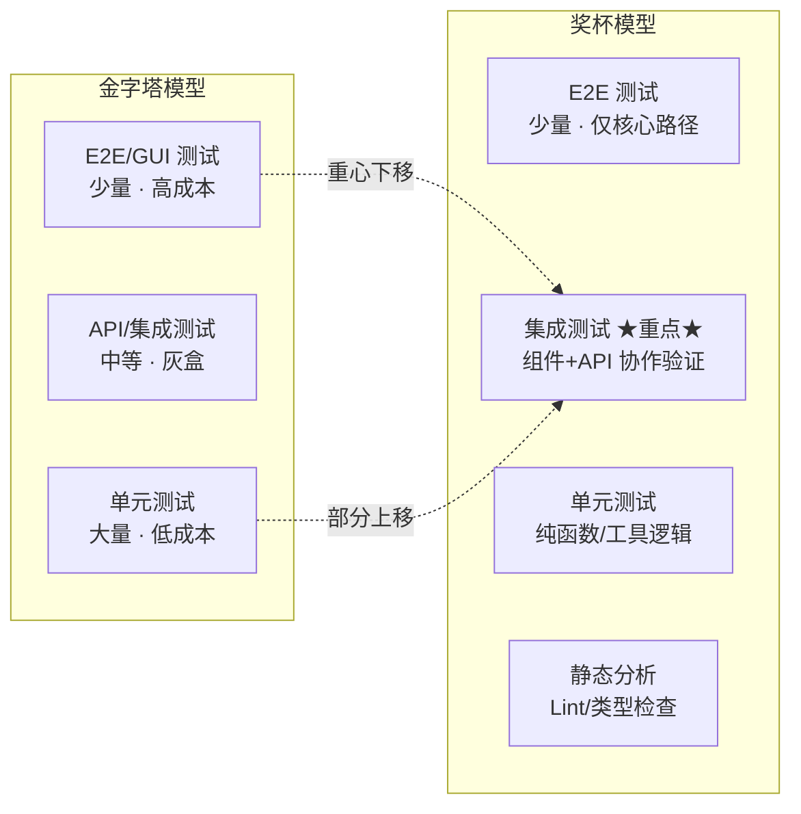
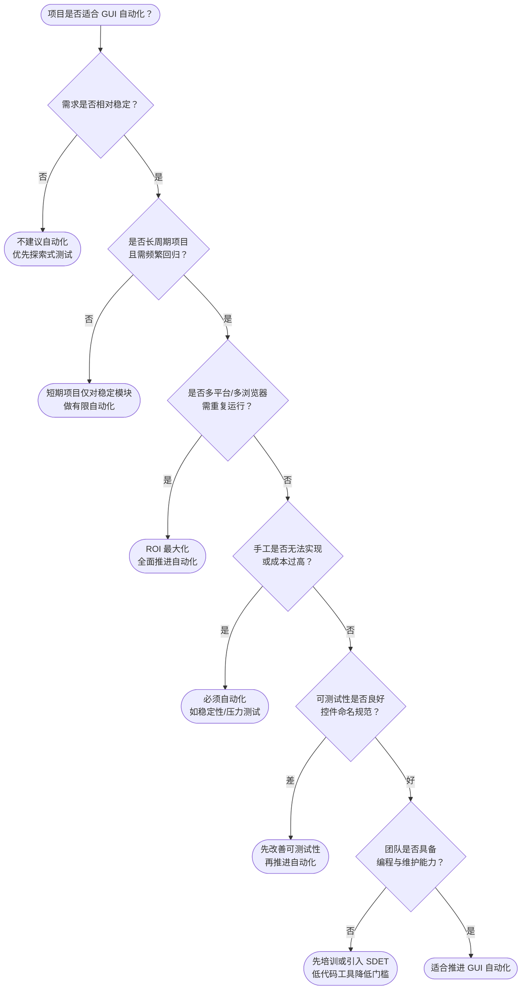

# GUI 自动化测试策略与 ROI

GUI 自动化测试是质量保障体系中最贴近用户、也最容易"投入巨大却收效甚微"的一层。本文不再罗列工具用法，而是聚焦三个被反复验证的核心命题：**分层模型如何选择、ROI 如何量化、大型项目如何让脚本长期可维护**，并补充 2024-2026 年 AI 自愈、视觉测试、组件测试等正在重塑 GUI 测试边界的新趋势。

## 1. 核心概念：GUI 自动化测试的本质与价值

GUI 自动化测试的本质，是**用代码模拟用户在界面上的操作，并自动校验结果**。它属于端到端（E2E）测试的范畴，最接近真实用户行为，因而最能直接验证商业价值；但同时也是维护成本最高、稳定性最差的一层。

理解 GUI 自动化的关键，是认清它的"双面性"：

- **正向价值**：替代机械重复操作、缩短回归反馈周期（从"天"到"分钟"）、保证一致性与可重复性、可在无人值守时段执行。
- **反向代价**：脚本本身是开发产物，需随被测系统变更持续维护；只能验证"已知预期"，难以发现"未预期缺陷"；Flaky 用例（随机失败）会侵蚀团队对测试结果的信任。

一句话总结：**GUI 自动化不是"测不测"的问题，而是"在哪个层测、测多少、谁来维护"的资源分配问题**。后续章节的分层模型与 ROI 模型，都是为这一资源分配提供决策依据。

## 2. 测试金字塔 vs 测试奖杯：两种分层模型对比

### 2.1 测试金字塔（Testing Pyramid）

Mike Cohn 提出的金字塔模型长期被视为测试分层的最佳实践：底层是大量的单元测试（白盒、低成本、高反馈速度），中层是 API/集成测试（灰盒），顶层是少量的 GUI/E2E 测试（黑盒、高成本、低稳定性）。其核心逻辑是**越靠近底层，投入产出比越高**。

金字塔模型适用于生命周期长、发布周期以"月/年"计、对回归稳定性要求极高的传统软件。

### 2.2 测试奖杯（Testing Trophy）

2018 年 Kent C. Dodds 针对前端项目提出奖杯模型，将测试分为四层：静态分析（ESLint/TypeScript）→ 单元测试 → **集成测试**（重点层）→ E2E 测试。奖杯模型的关键论点是：**前端项目中"组件 + API 调用层"的集成测试，比孤立的单元测试更有价值**，因为前端的大部分缺陷发生在组件协作与数据流交接处，而非纯函数内部。

奖杯模型与互联网产品的菱形策略不谋而合：都主张把资源集中投到"集成/API"层，而把昂贵且脆弱的 GUI E2E 控制在最小必要范围。

### 2.3 两种模型对比



**选型建议**：没有放之四海皆准的模型。后端微服务为主的产品，倾向金字塔或 Google 蜂巢模型；前端重度产品，奖杯模型更具指导意义；传统长周期软件，金字塔依然有效。决策的核心始终是**各层投入产出比的相对大小**，而非模型本身的"正确性"。

## 3. ROI 模型：自动化收益评估与项目选择

### 3.1 四维 ROI 评估框架

判断 GUI 自动化是否值得投入，不能只看"能省多少手工工时"，而应从四个维度综合评估：

| 维度 | 量化指标 | 说明 |
|------|---------|------|
| **开发维护成本** | 开发工时 + 维护工时 × 维护周期 | GUI 用例维护成本通常是开发的 1.5-3 倍，是 ROI 的最大变量 |
| **执行效率** | 单次执行耗时、并发分片数、CI 反馈时长 | 互联网产品要求全回归 ≤ 4 小时，靠 Playwright `--shard` 分片实现 |
| **缺陷发现率** | 自动化发现的缺陷数 / 总缺陷数 | GUI 自动化主要发现回归缺陷，通常占比 15%-30%，不宜期望过高 |
| **覆盖率提升** | 业务路径覆盖率、关键流程覆盖率 | 注意是"业务覆盖"而非"代码覆盖"，GUI 层代码覆盖率意义有限 |

### 3.2 盈亏平衡公式

简化的 ROI 公式：

- **投入成本** = 开发成本 + 维护成本 × 维护周期
- **产出收益** = 单次手工执行成本 × 有效执行次数
- **盈亏平衡点**：产出收益 ≥ 投入成本

不同层级的回本次数差异显著：单元/API 测试 2-3 次即可回本；GUI 自动化通常需要 **5-10 次有效执行**才能回本。在 CI/CD 下用例每天触发多次，回本周期会显著缩短。

### 3.3 ROI 决策树



### 3.4 不适合自动化的场景

与"适合"同样重要的是明确边界：探索式测试（依赖直觉）、UX 主观评价、一次性验证、需求极不稳定的原型、复杂视觉微调，这些场景强行自动化只会得不偿失。

## 4. 互联网产品测试策略：菱形模型与 E2E 范围控制

### 4.1 菱形模型

互联网产品的"快"（发布周期以天/小时计）决定了金字塔模型不适用。业界实践形成了**菱形模型**：重量级 API 测试 + 轻量级 GUI 测试 + 轻量级单元测试。

API 测试成为重点的原因：开发调试效率高、执行稳定性远超 GUI、单用例耗时短便于并发、契合微服务架构、接口后向兼容使用例可重用性高。

### 4.2 GUI 测试：手工为主，自动化为辅

互联网产品 GUI 测试采用"手工为主、自动化为辅"策略：

- **手工探索式测试**：针对新开发或新修改的界面，以发现缺陷为第一要务。
- **自动化测试**：仅覆盖**相对稳定且直接关系主营业务流程的核心 E2E 场景**，通常几百个用例规模。

```javascript
// Playwright 核心登录流程回归用例（Playwright 1.60+）
import { test, expect } from '@playwright/test';

test('核心登录流程回归', async ({ page }) => {
  await page.goto('/login');                       // 进入登录页
  await page.fill('[data-testid=username]', 'user1'); // 填写用户名
  await page.fill('[data-testid=password]', 'pass1'); // 填写密码
  await page.click('[data-testid=login-btn]');     // 点击登录
  await expect(page).toHaveURL(/\/dashboard/);     // 断言跳转到仪表盘
});
```

### 4.3 E2E 范围控制

E2E 测试范围必须严格收敛，否则会陷入"用例越多、维护越重、Flaky 越多"的恶性循环。控制手段：

- **只测主流程**：登录、核心下单、支付等关键路径，不测边缘场景。
- **跨层下沉**：能下沉到 API/集成层验证的逻辑，绝不上浮到 E2E。
- **分片并行**：通过 Playwright `--shard` 或 Cypress Cloud 并行执行，保证全回归在可接受时间窗内完成。

## 5. 大型项目 GUI 测试策略：分层复用与 Flaky 治理

### 5.1 三层分层测试策略

大型项目的 GUI 测试应分层开展，避免把所有验证压在系统级 E2E：

1. **组件级测试**：基于 Storybook + Playwright/Cypress Component Testing 对公共组件做隔离测试，配合视觉回归测试保障 UI 一致性。
2. **模块级 GUI 测试**：每个业务模块构建自己的页面对象库与业务流程脚本，自动化率可达 70%-80%，覆盖模块内全部业务逻辑与 Happy Path。
3. **系统级 E2E 测试**：组合各模块资产，从终端用户视角验证核心业务主流程，自动化率精简，手工探索式测试为辅。

需特别区分：**模块级的高自动化率 ≠ 系统级 E2E 的高自动化率**。模块内部相对稳定可控，而跨模块 E2E 涉及更多协作与不确定性，稳定性挑战更大。

### 5.2 脚本分层复用与版本管理

E2E 团队不应从零开发脚本，而应复用各 Scrum 团队维护的页面对象与业务流程脚本。核心做法：

- 各模块的页面对象库、业务流程脚本独立版本管理，版本号与模块版本号保持一致。
- E2E 测试项目通过包依赖（npm `package.json` 或 Maven `pom.xml`）引用特定版本，实现复用与同步。

```json
// E2E 测试项目的 package.json —— 以版本引用各模块测试资产
{
  "name": "e2e-suite",
  "dependencies": {
    "@company/user-pages": "^1.2.0",    // 用户模块页面对象
    "@company/user-flows": "^1.2.0",    // 用户模块业务流程
    "@company/order-pages": "^3.0.1",   // 订单模块页面对象
    "@company/common-pages": "^2.4.0"   // 公共组件页面对象
  },
  "devDependencies": {
    "@playwright/test": "^1.60.0"
  }
}
```

Playwright 的 Fixture 机制提供了比传统 POM 更灵活的依赖注入方式，可在用例间共享页面对象、业务流程与测试数据，是现代 E2E 脚本复用的推荐方案。

### 5.3 CI 集成

E2E 测试在 CI 中通常作为发布前门禁，需关注效率与稳定性：

```yaml
# GitHub Actions —— E2E 分片并行执行示例
jobs:
  e2e:
    runs-on: ubuntu-latest
    strategy:
      matrix:
        shard: [1/4, 2/4, 3/4, 4/4]      # 四路分片并行
    steps:
      - uses: actions/checkout@v4
      - run: npx playwright install --with-deps
      - run: npx playwright test --shard=${{ matrix.shard }}
```

### 5.4 Flaky 治理

Flaky 用例比没有自动化更糟糕，会侵蚀团队信任。治理要点：

- **自动等待优先**：优先使用 Playwright 内置 Auto-waiting，避免硬编码 `sleep`。
- **重试策略收敛**：CI 中限定重试次数（如 `retries: 2`），重试仍失败必须立项排查根因，而非无限重试。
- **隔离与幂等**：每条用例独立准备数据、独立清理，禁止用例间状态依赖。
- **Flaky 监控**：跟踪单用例的 pass/fail 比率，对高频 Flaky 用例标记并优先修复或下线。
- **可观测性**：结合 Playwright Trace Viewer、OpenTelemetry 快速定位失败现场。

## 6. 2024-2026 新趋势：AI 自愈、视觉测试与组件测试

### 6.1 AI 辅助定位与生成

LLM 正在改变 GUI 测试脚本的产出方式。Playwright 1.56 引入 LLM 引导的测试修复能力（Playwright Agents），GitHub Copilot / Cursor 可根据自然语言或页面截图生成测试脚本。AI 辅助的价值在于降低脚本编写门槛，但**生成的脚本仍需人工审查**，尤其要校验断言的合理性与定位器的稳定性。

### 6.2 自愈机制（Self-healing）

自愈机制是缓解"开发手一抖，自动化忙一宿"痛点的关键进展。当 UI 变更导致原定位器失效时，自愈工具会自动尝试备选定位器并修复脚本：

- **Healenium**：基于 Selenium 生态，自动记录定位器变更并生成修复建议。
- **Mabl**：云端 SaaS，结合 ML 学习应用 UI 模式，自动适配变更。
- **Testim**：通过 AI 识别元素属性集合，提升定位鲁棒性。

需注意：自愈目前只能处理**有限的定位器变更场景**，无法应对业务流程层面的重构，"用例脆弱"的根本问题尚未完全解决。

### 6.3 视觉回归测试（Visual Testing）

视觉测试通过像素对比或 AI 识别 UI 视觉变化，补充传统断言无法覆盖的布局/样式问题：

- **Percy**（BrowserStack）：多框架视觉测试平台，支持 Storybook 与 E2E 集成。
- **Applitools Eyes**：基于 AI 的智能视觉测试，可区分"有意义变化"与"无关噪点"，显著降低误报。
- **Playwright 内置**：`toHaveScreenshot()` 断言零成本集成，适合中小项目。
- **Chromatic**：Storybook 官方视觉测试服务，与组件开发深度集成。

```typescript
// Playwright 视觉回归测试示例
test('订单详情页视觉一致', async ({ page }) => {
  await page.goto('/orders/1001');
  await expect(page).toHaveScreenshot('order-detail.png', {
    maxDiffPixelRatio: 0.01,    // 允许 1% 像素差异
    animations: 'disabled',     // 禁用动画以稳定截图
  });
});
```

### 6.4 组件测试与微前端测试

**组件测试**已成为 GUI 测试的基础层。Storybook + Playwright/Cypress Component Testing 的组合，让组件在隔离环境中完成交互与视觉验证，反馈速度远超 E2E。组件测试通过得越好，系统级 E2E 需要覆盖的场景就越少。

**微前端测试**是大型项目的新挑战。微前端将前端拆分为多个独立部署的子应用，测试需关注：

- **子应用隔离测试**：每个子应用独立维护组件测试与模块级 GUI 测试。
- **跨子应用集成测试**：验证子应用间路由跳转、共享状态、样式隔离。
- **契约测试**：通过契约约定子应用间的接口与事件协议，避免全链路 E2E 膨胀。

## 7. 常见陷阱与最佳实践

### 7.1 常见陷阱

- **盲目追求高自动化率**：在系统级 E2E 也追求 70%-80% 自动化率，结果是 Flaky 爆发、维护成本失控。
- **硬编码等待**：大量 `sleep(3000)` 替代自动等待，导致用例既慢又脆。
- **用例间状态依赖**：前一条用例失败导致后续全部失败，定位困难。
- **只测 Happy Path**：忽视异常分支与边界条件，回归保护形同虚设。
- **忽视可测试性**：被测系统未预留 `data-testid`、未提供绕过验证码的测试入口，脚本只能"硬怼" UI。

### 7.2 最佳实践

- **分层分责**：组件层求广、模块层求全、E2E 层求精，各层自动化率目标分开设定。
- **测试资产版本化**：页面对象与业务流程脚本独立版本管理，E2E 项目以依赖引用方式复用。
- **Flaky 零容忍**：建立 Flaky 监控与修复 SLA，高频 Flaky 用例优先治理或下线。
- **可测试性内建**：在开发规范中固化 `data-testid` 命名、测试入口预留、Feature Flag 隔离等要求。
- **AI 与人协作**：用 AI 辅助生成与自愈降低成本，但断言设计与用例评审仍由人把关。

## 总结

GUI 自动化测试的核心不是工具选型，而是**资源分配的工程决策**。测试金字塔与测试奖杯提供了两种分层视角，菱形模型给出了互联网产品的实践答案，而 ROI 四维模型与决策树则是判断"是否投入、投入多少"的量化依据。在大型项目中，分层复用与版本化资产管理是脚本长期可维护的基石；Flaky 治理是 CI 门禁可信的前提。2024-2026 年，AI 自愈、视觉测试、组件测试正在拓宽 GUI 测试的边界，但"分层分责、ROI 优先、人机协作"的核心原则始终不变。
