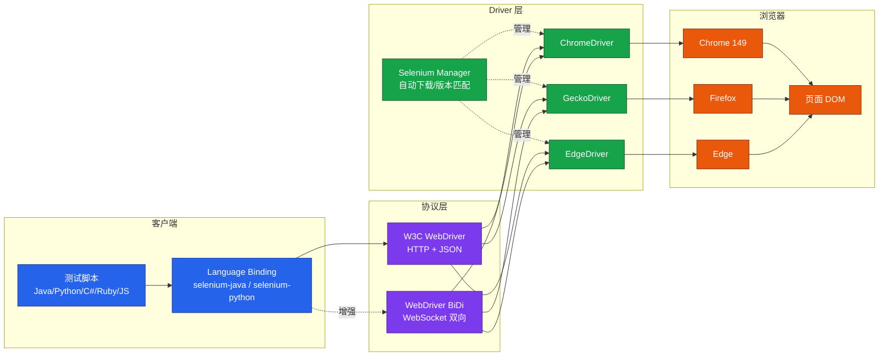
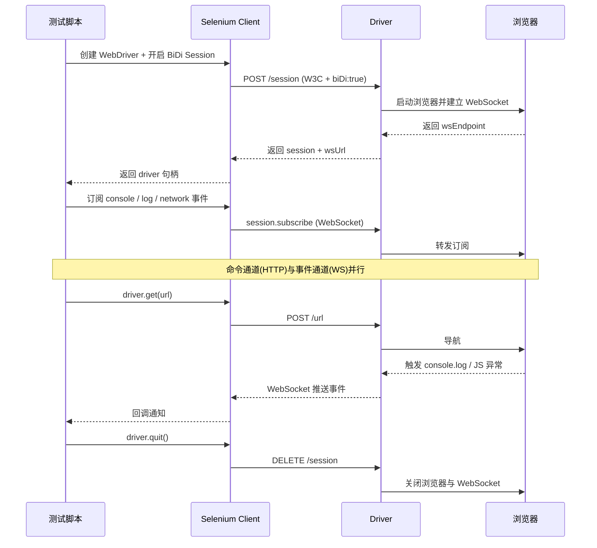

# Selenium 4 WebDriver 实战

Selenium 是 Web 自动化测试领域历史最悠久、生态最完整的开源框架。本文基于 **Selenium 4.42.0（2026-03 发布）** 系统梳理 Selenium 4 的核心架构、环境搭建、WebDriver API 体系、4.x 新特性以及工程化实践，重点覆盖 W3C WebDriver 协议标准化、Selenium Manager 自动驱动管理、Relative Locators 相对定位、WebDriver BiDi 双向通信等关键能力，并指出从旧版本升级时需要规避的常见陷阱。旧文档中通过 `npm.taobao.org/mirrors/chromedriver` 手动下载驱动、Chrome 44 等内容均已被淘汰，本文不再保留。

## 一、核心概念

### 1.1 Selenium 4 是什么

Selenium 是一套面向 Web 应用的自动化测试工具集，整体由 Selenium IDE、Selenium Grid、Selenium WebDriver 三大组件构成，其中 WebDriver 是工程化测试的核心。Selenium 4 在 2021 年发布 4.0 正式版，于 2026-03 发布 4.42.0。相比 3.x，4.x 完成了三件关键演进：彻底移除 Selenium RC、全面切换到 W3C WebDriver 标准协议、内置 Selenium Manager 自动驱动管理。

Selenium 的应用场景并不限于功能回归测试。在工程实践中，它常被用于：跨浏览器兼容性矩阵验证（Chrome/Firefox/Edge/Safari 多版本并行）、CI/CD 流水线中的端到端质量门禁、基于数据驱动的批量表单回归、与持续交付工具链集成的部署后烟雾测试，以及在爬虫与 RPA 场景中替代纯 HTTP 客户端处理动态渲染页面。理解其架构与协议演进，是构建稳定可维护测试体系的前提。

### 1.2 Selenium 4 架构

Selenium 4 的整体架构遵循 Client-Server 模式：测试脚本通过语言客户端将操作序列化为 W3C WebDriver 协议的 HTTP/JSON 请求，由各浏览器厂商提供的 Driver（如 ChromeDriver、EdgeDriver、GeckoDriver）翻译为浏览器原生自动化接口调用，最终作用于浏览器与 DOM。Selenium Manager 在客户端启动阶段自动完成 Driver 的下载、版本匹配与缓存，使得"安装"这一步骤对开发者完全透明。

整个链路涉及四个角色：测试脚本（Client）、Selenium 语言绑定（Language Binding）、Driver（Server）、浏览器进程。脚本与 Driver 之间通过 HTTP 传递 W3C 命令，Driver 与浏览器之间通过各厂商私有机制通信，浏览器再通过自身的自动化接口操作 DOM。Selenium 4 引入的 BiDi 通道在原有 HTTP 命令通道之外新增了 WebSocket 事件通道，使浏览器可主动推送 console、网络、JS 异常等事件给测试脚本。



### 1.3 W3C 标准化的意义

Selenium 3 时代，Driver 之间使用 Selenium 自定义的 JSON Wire Protocol 通信，导致同一份脚本在不同浏览器上行为不一致；Selenium 4 全面采用 W3C WebDriver 规范，统一了命令格式、错误码、能力（Capabilities）描述方式，使脚本在不同浏览器之间具备完全一致的行为契约：

- **Capabilities 标准化**：使用 `browserName`、`platformName` 等标准字段，不再需要为每个浏览器维护独立的 `desiredCapabilities`，传参错误会被 Driver 直接拒绝而非静默忽略；
- **错误码统一**：`element not interactable`、`stale element reference`、`no such element` 等错误语义在所有浏览器一致，便于上层封装统一的异常处理与重试策略；
- **去 JSON Wire Protocol**：旧版本通过 `webdriver.remote` 走 JSON Wire 的代码必须迁移到 W3C 协议，否则在 4.x 上会直接报错；这一迁移是 3.x 升级 4.x 时最常见的破坏性变更；
- **Action API 重写**：鼠标键盘操作改为基于 W3C Actions 接口，支持多输入源组合（例如同时按键 + 移动 + 释放），更贴近真实用户交互。

### 1.4 与旧版本的区别

| 维度 | Selenium 3 | Selenium 4.42 |
|------|-----------|---------------|
| 通信协议 | JSON Wire Protocol | W3C WebDriver |
| Driver 管理 | 手动下载、配置 PATH | Selenium Manager 自动管理 |
| 双向通信 | 不支持 | WebDriver BiDi |
| Grid 架构 | Hub-Node | 完全重写，支持 Distributed Mode |
| 相对定位 | 不支持 | Relative Locators |
| CDP 集成 | 通过第三方库 | 内置 devtools 模块 |
| Actions | 旧版 ActionChains | W3C Actions 多输入源 |

## 二、环境搭建

### 2.1 Selenium Manager 自动驱动管理

Selenium 4.6 起内置 **Selenium Manager**，它会在创建 WebDriver 实例时自动探测本机浏览器版本，从官方 CDN 下载匹配的 Driver，并缓存到用户目录。旧文档中通过 `npm.taobao.org/mirrors/chromedriver` 手动下载驱动的做法已不再需要，且该镜像也已停用。Selenium Manager 的工作流程为：扫描本机浏览器版本 → 查询官方 Driver 版本矩阵 → 下载匹配版本到缓存目录 → 校验签名 → 自动设置启动路径。整个过程对开发者透明，无需任何配置。

```text
默认缓存路径：
- Linux/macOS: ~/.cache/selenium/
- Windows:     %LOCALAPPDATA%\selenium\
```

如需关闭自动管理（例如企业内网强制使用统一 Driver，或需要离线运行），可通过系统属性 `seleniummanager.enabled=false` 禁用，并通过 `webdriver.chrome.driver` 显式指定 Driver 路径。在 CI 容器化场景中，建议提前将 Driver 镜像烤进基础镜像以避免每次构建都触发下载，缩短流水线时长。

### 2.2 Maven 依赖（Java）

```xml
<dependencies>
    <!-- Selenium 4.42.0（2026-03 最新稳定版） -->
    <dependency>
        <groupId>org.seleniumhq.selenium</groupId>
        <artifactId>selenium-java</artifactId>
        <version>4.42.0</version>
    </dependency>
    <!-- JUnit 5 用于测试组织与断言 -->
    <dependency>
        <groupId>org.junit.jupiter</groupId>
        <artifactId>junit-jupiter</artifactId>
        <version>5.13.0</version>
        <scope>test</scope>
    </dependency>
</dependencies>
```

### 2.3 pip 依赖（Python）

```bash
# 安装最新稳定版
pip install selenium==4.42.0

# 同时安装 pytest 用于测试组织
pip install pytest==8.4.0
```

### 2.4 浏览器版本对齐

| 组件 | 推荐版本 |
|------|----------|
| Chrome | 149（2026） |
| Firefox | 142 |
| Edge | 149 |
| JDK | 17+ |
| Python | 3.11+ |

旧文档中提到的 Chrome 44（2015）已严重过期，现代 Selenium 测试应以近一年的浏览器版本为基线，并优先验证 Headless 模式与新版渲染引擎的兼容性。

## 三、WebDriver 核心 API

### 3.1 浏览器启动与导航

Java 示例：

```java
import org.openqa.selenium.WebDriver;
import org.openqa.selenium.chrome.ChromeDriver;
import org.openqa.selenium.chrome.ChromeOptions;

ChromeOptions options = new ChromeOptions();
options.addArguments("--start-maximized");   // 最大化窗口
// Selenium 4 自动管理 Driver，无需 System.setProperty
WebDriver driver = new ChromeDriver(options);

driver.get("https://www.example.com");                    // 导航到 URL
driver.navigate().to("https://www.example.com/login");    // 等价于 get
driver.navigate().back();                                 // 后退
driver.navigate().forward();                              // 前进
driver.navigate().refresh();                              // 刷新
driver.quit();                                            // 关闭会话并释放资源
```

Python 示例：

```python
from selenium import webdriver
from selenium.webdriver.chrome.options import Options

options = Options()
options.add_argument("--start-maximized")
driver = webdriver.Chrome(options=options)   # 自动管理 Driver

driver.get("https://www.example.com")
driver.back()
driver.forward()
driver.refresh()
driver.quit()
```

`get` 与 `navigate().to` 在功能上等价，区别在于 `navigate()` 提供了一组语义化的导航方法（back/forward/refresh），便于在测试代码中表达意图。`driver.close()` 只关闭当前窗口，会话不释放；`driver.quit()` 才会真正终止 WebDriver 会话并清理 Driver 进程，生产代码必须在 `@AfterEach` 中调用 `quit()`。

### 3.2 八种元素定位策略

W3C WebDriver 规范定义了 8 种定位策略，对应 `By` 类的 8 个工厂方法。下表按推荐优先级排列：

| 优先级 | 策略 | Java 写法 | 适用场景 |
|-------|------|-----------|---------|
| 1 | ID | `By.id("user")` | 唯一标识，性能最佳 |
| 2 | CSS 选择器 | `By.cssSelector("form .btn")` | 复杂结构、链式选择 |
| 3 | Name | `By.name("passwd")` | 表单字段 |
| 4 | ClassName | `By.className("active")` | 样式驱动组件 |
| 5 | TagName | `By.tagName("a")` | 批量元素遍历 |
| 6 | LinkText | `By.linkText("登录")` | 完整链接文本 |
| 7 | PartialLinkText | `By.partialLinkText("登")` | 部分链接文本 |
| 8 | XPath | `By.xpath("//button[@type='submit']")` | 最灵活，性能较差 |

Java 示例（八种定位策略）：

```java
import org.openqa.selenium.By;
// 1. ID
driver.findElement(By.id("username"));
// 2. CSS 选择器
driver.findElement(By.cssSelector("#login-form input.submit"));
// 3. Name
driver.findElement(By.name("password"));
// 4. ClassName
driver.findElement(By.className("btn-primary"));
// 5. TagName
driver.findElement(By.tagName("button"));
// 6. LinkText
driver.findElement(By.linkText("忘记密码"));
// 7. PartialLinkText
driver.findElement(By.partialLinkText("注册"));
// 8. XPath
driver.findElement(By.xpath("//input[@placeholder='手机号']"));
```

Python 示例：

```python
from selenium.webdriver.common.by import By
driver.find_element(By.ID, "username")
driver.find_element(By.CSS_SELECTOR, "#login-form input.submit")
driver.find_element(By.NAME, "password")
driver.find_element(By.CLASS_NAME, "btn-primary")
driver.find_element(By.TAG_NAME, "button")
driver.find_element(By.LINK_TEXT, "忘记密码")
driver.find_element(By.PARTIAL_LINK_TEXT, "注册")
driver.find_element(By.XPATH, "//input[@placeholder='手机号']")
```

定位策略的选型原则：优先使用业务语义稳定且全局唯一的标识，例如 `data-testid` 或 ID；其次使用结构化的 CSS 选择器；XPath 仅在前两者无法表达时使用，且应使用相对 XPath（`//input[@data-testid='phone']`）而非绝对路径（`/html/body/div[1]/form/input[2]`）。与研发约定 `data-testid` 属性是治本之策，可避免因样式重构导致的大面积定位失效。

### 3.3 元素操作

```java
WebElement el = driver.findElement(By.id("kw"));
el.clear();                              // 清空输入框
el.sendKeys("Selenium 4");               // 输入文本
el.click();                              // 点击
el.submit();                             // 提交表单
String text = el.getText();              // 获取可见文本
String attr = el.getAttribute("href");   // 获取属性
boolean displayed = el.isDisplayed();    // 是否可见
boolean enabled  = el.isEnabled();       // 是否可用
boolean selected = el.isSelected();      // 是否选中（radio/checkbox）
```

### 3.4 等待机制

Selenium 提供三种等待，**生产代码必须使用显式等待，禁止 `Thread.sleep()`**。

```java
import org.openqa.selenium.support.ui.WebDriverWait;
import org.openqa.selenium.support.ui.ExpectedConditions;
import java.time.Duration;

// 显式等待：条件满足立即返回，最多 10 秒
WebDriverWait wait = new WebDriverWait(driver, Duration.ofSeconds(10));
WebElement btn = wait.until(
    ExpectedConditions.elementToBeClickable(By.id("submit"))
);

// 隐式等待：全局轮询基础，仅对 findElement 生效
driver.manage().timeouts().implicitlyWait(Duration.ofSeconds(5));

// 禁止：固定休眠，环境波动会放大失败率
// Thread.sleep(3000);
```

Python 版本：

```python
from selenium.webdriver.support.ui import WebDriverWait
from selenium.webdriver.support import expected_conditions as EC
from selenium.webdriver.common.by import By

# 显式等待
btn = WebDriverWait(driver, 10).until(
    EC.element_to_be_clickable((By.ID, "submit"))
)

# 隐式等待
driver.implicitly_wait(5)
```

显式等待与隐式等待的核心差异：显式等待针对具体条件（可点击、可见、文本匹配等）轮询，满足后立即返回，超时抛 `TimeoutException`；隐式等待是全局的轮询窗口，仅在 `findElement` 找不到元素时反复重试。两者混用会出现隐性超时不一致的问题，是新手最常见的踩坑点。推荐做法是项目初始化后只使用显式等待，把等待逻辑封装到 Page Object 内部，对上层用例透明。

## 四、Selenium 4 新特性

### 4.1 Relative Locators（相对定位）

相对定位器允许基于另一个元素的上下左右位置定位，对应页面布局变化更健壮。底层通过 WebDriver 的 `getRect` 接口计算元素矩形位置实现，相比纯 XPath/CSS 更贴近人眼阅读方式。当页面没有稳定 ID 或 CSS 类时（例如第三方组件库渲染的复杂表单），相对定位能基于"密码框上方那个输入框"这种语义描述完成定位，UI 重排后只要相对位置不变仍可工作。

```java
import static org.openqa.selenium.support.locators.RelativeLocator.with;

WebElement password = driver.findElement(By.id("password"));
// 定位密码框上方的输入框（用户名）
WebElement username = driver.findElement(
    with(By.tagName("input")).above(password)
);
// 定位密码框下方的按钮
WebElement loginBtn = driver.findElement(
    with(By.tagName("button")).below(password)
);
// 定位密码框右侧的"显示密码"图标
WebElement eye = driver.findElement(
    with(By.className("icon-eye")).toRightOf(password)
);
// 定位密码框左侧的标签
WebElement label = driver.findElement(
    with(By.tagName("label")).toLeftOf(password)
);
// 链式：在某元素下方且在另一元素右侧
driver.findElement(
    with(By.tagName("input")).below(header).toRightOf(sidebar)
);
```

Python 版本：

```python
from selenium.webdriver.common.by import By
from selenium.webdriver.support.relative_locator import with_tag

password = driver.find_element(By.ID, "password")
username = driver.find_element(with_tag("input").above(password))
login_btn = driver.find_element(with_tag("button").below(password))
```

### 4.2 WebDriver BiDi 协议

**WebDriver BiDi** 是 W3C 制定的双向通信协议，使用 WebSocket 替代 HTTP 轮询，使得浏览器可以主动向测试脚本推送事件。Selenium 4.22+ 大幅增强了 BiDi 支持，可在脚本运行时捕获 console 日志、JS 异常、网络请求等。相比仅 Chromium 支持的 CDP（Chrome DevTools Protocol），BiDi 是跨浏览器标准，是长期演进的官方方向；在新项目中应优先选择 BiDi，老项目可逐步从 CDP 迁移。



Java 示例：捕获 console 与 JS 异常：

```java
import org.openqa.selenium.bidi.module.LogInspector;

ChromeOptions options = new ChromeOptions();
options.setCapability("webSocketUrl", true);   // 启用 BiDi
WebDriver driver = new ChromeDriver(options);

try (LogInspector logs = new LogInspector(driver)) {
    logs.onConsoleLog(console ->
        System.out.println("[CONSOLE] " + console.getText()));
    logs.onJavaScriptException(js ->
        System.out.println("[JS-ERR] " + js.getText()));
}

driver.get("https://www.example.com");
```

BiDi 的工程价值在于：以前需要在浏览器里手动查看 console 排查测试失败，现在可以将 JS 错误与用例断言直接关联，一旦出现未捕获异常即可标记用例失败；同时网络事件可用于断言 API 调用次数、响应码，把"前端展示断言"延伸到"前端到后端契约断言"。

### 4.3 Selenium Manager 与 Grid 4

- **Selenium Manager**：除本地 Driver 管理外，4.42 版本能识别 Edge、Firefox、Brave 等多种浏览器，并在浏览器升级后自动重新匹配 Driver，无需重新下载；旧文档中的"下载 Driver 并放入 PATH"流程已彻底废弃。
- **Grid 4 Distributed Mode**：完全重写的 Grid 架构，支持 Router / Distributor / Node / SessionQueue / EventBus 多角色分离部署，可在 K8s 上以分布式模式横向扩展。相比 Grid 3 的 Hub-Node 模式，Grid 4 的优势在于：SessionQueue 支持 FIFO 与优先级队列、Distributor 可独立扩容、EventBus（基于 JeroMQ/ZeroMQ 的自研轻量消息总线）解耦组件通信、原生支持 Docker 与 Helm 部署。在数千并发场景下，Grid 4 是稳定运行的唯一选择。

## 五、浏览器选项与能力

### 5.1 Headless 模式

```java
ChromeOptions options = new ChromeOptions();
options.addArguments("--headless=new");           // Selenium 4 推荐新版 Headless
options.addArguments("--disable-gpu");
options.addArguments("--window-size=1920,1080");
WebDriver driver = new ChromeDriver(options);
```

`--headless=new` 是 Chrome 109+ 引入的新版 Headless 模式，与有头模式共享同一渲染引擎，行为更接近真实浏览器；旧版 `--headless` 已弃用，不建议在新项目中使用。

### 5.2 Mobile Emulation

```java
Map<String, String> mobileEmulation = new HashMap<>();
mobileEmulation.put("deviceName", "iPhone 15");
ChromeOptions options = new ChromeOptions();
options.setExperimentalOption("mobileEmulation", mobileEmulation);
WebDriver driver = new ChromeDriver(options);
```

也可通过 `mobileEmulation.userAgent` 与 `deviceMetrics` 自定义设备参数，用于验证响应式布局在特定视口下的表现。

### 5.3 Cookie 管理

```java
driver.get("https://www.example.com");
// 添加 Cookie
Cookie cookie = new Cookie("session", "abc123", "example.com", "/");
driver.manage().addCookie(cookie);
// 读取所有 Cookie
Set<Cookie> cookies = driver.manage().getCookies();
// 按名删除
driver.manage().deleteCookieNamed("session");
// 清空
driver.manage().deleteAllCookies();
```

### 5.4 窗口与标签页

```java
// 新标签页
driver.switchTo().newWindow(WindowType.TAB);
// 新窗口
driver.switchTo().newWindow(WindowType.WINDOW);
// 句柄切换
String original = driver.getWindowHandle();
for (String handle : driver.getWindowHandles()) {
    if (!handle.equals(original)) {
        driver.switchTo().window(handle);
    }
}
```

## 六、实战示例

### 6.1 登录测试

```java
@Test
public void testLogin() {
    driver.get("https://www.example.com/login");
    WebDriverWait wait = new WebDriverWait(driver, Duration.ofSeconds(10));

    wait.until(ExpectedConditions.visibilityOfElementLocated(By.id("username"))).sendKeys("admin");
    driver.findElement(By.id("password")).sendKeys("pwd123");
    driver.findElement(By.cssSelector("button[type=submit]")).click();

    WebElement greeting = wait.until(
        ExpectedConditions.visibilityOfElementLocated(By.className("user-greeting"))
    );
    assertEquals("你好, admin", greeting.getText());
}
```

### 6.2 文件上传

```java
// 通过 input[type=file] 直接 sendKeys 绝对路径
driver.findElement(By.cssSelector("input[type=file]"))
      .sendKeys("/Users/tester/upload/sample.csv");
driver.findElement(By.id("upload-btn")).click();
```

对于非 `input[type=file]` 的上传组件（如 Flash 或自定义弹窗），需要借助 `Robot` 或第三方工具 AutoIt 处理系统级文件选择对话框。

### 6.3 文件下载

```java
Map<String, Object> prefs = new HashMap<>();
prefs.put("download.default_directory", "/Users/tester/downloads");
prefs.put("download.prompt_for_download", false);
ChromeOptions options = new ChromeOptions();
options.setExperimentalOption("prefs", prefs);
WebDriver driver = new ChromeDriver(options);
driver.get("https://www.example.com/report");
driver.findElement(By.id("export")).click();
```

下载完成后应通过文件系统轮询（如 `Files.exists` + 显式等待）确认文件落盘，再进入断言阶段，避免文件未完成写入就结束用例。

### 6.4 弹窗处理

```java
// 原生 alert / confirm / prompt
Alert alert = wait.until(ExpectedConditions.alertIsPresent());
String text = alert.getText();   // 读取弹窗文本
alert.accept();                  // 确认
// alert.dismiss();             // 取消
// alert.sendKeys("hello");     // 输入

// iframe 切换
driver.switchTo().frame("ad-frame");
driver.findElement(By.id("close")).click();
driver.switchTo().defaultContent();   // 回到主文档
```

## 七、常见陷阱与最佳实践

### 7.1 常见陷阱

1. **混用显式与隐式等待**：隐式等待会作用于全局，与显式等待叠加会导致不可预期的超时；建议初始化后只使用显式等待，并把等待逻辑收敛到 Page Object 内部。
2. **依赖 XPath 绝对路径**：`/html/body/div[2]/form/input[1]` 在 UI 改版后立即失效；应使用语义化定位（id、`data-testid`、CSS）。
3. **`Thread.sleep` 充当等待**：环境波动会放大失败率，CI 与本地速度差异会让固定等待变得不可靠；用 `WebDriverWait` 替代。
4. **未关闭 WebDriver 会话**：测试失败时未调用 `driver.quit()`，CI 环境会累积僵尸浏览器进程，最终耗尽内存导致节点崩溃。
5. **共享 WebDriver 实例**：多线程场景下 Driver 非线程安全，应使用 ThreadLocal 或 DriverFactory 为每个线程独立创建实例。
6. **在 Page Object 中暴露 WebDriver**：上层用例不应直接调用 Driver，应封装为业务方法，否则定位器与业务逻辑耦合，维护成本剧增。
7. **断言依赖动态时间戳**：直接断言包含日期的文本会因为时区或时钟漂移而偶发失败，应在断言前对时间做归一化处理。
8. **忽略浏览器版本差异**：Chrome 与 Firefox 对部分 CSS 选择器、JS API 实现存在差异，跨浏览器矩阵应在 CI 中显式声明。

### 7.2 最佳实践

- **Page Object 模式**：将页面结构与定位器封装在 Page 类，用例层只调用业务方法；定位器变更只修改 Page 类，不影响用例；
- **data-testid 定位**：与研发约定 `data-testid` 属性，避免因样式调整导致定位失效，同时也方便 UI 重构；
- **失败截图与日志**：通过 `Rule`/`Listener` 在用例失败时调用 `getScreenshotAs` 落盘，结合 BiDi 捕获的 console 与 JS 异常一起归档，便于现场回溯；
- **BiDi 替代 CDP**：CDP 仅 Chromium 支持，BiDi 是跨浏览器标准，长期应迁移至 BiDi；新项目应直接使用 BiDi；
- **Grid 化部署**：CI 流水线接入 Grid 4，按浏览器类型/版本矩阵并行执行，结合 K8s 弹性扩缩容应对峰值；
- **Driver 复用**：长链路用例使用 `@BeforeEach`/`@AfterEach` 控制 Driver 生命周期，避免每条用例冷启动；对于纯 API 验证可考虑在同一会话内串联多个步骤；
- **测试数据隔离**：使用数据库事务回滚或独立测试账号体系，避免用例间数据污染；
- **断言分层**：UI 层只做最小必要断言，复杂业务规则断言下沉到接口或单元测试层，遵循测试金字塔。

## 八、总结

Selenium 4 相比 3.x 完成了协议标准化与基础设施现代化：W3C WebDriver 让脚本跨浏览器一致，Selenium Manager 让"装驱动"这一步彻底消失，Relative Locators 让定位更贴近人眼阅读方式，WebDriver BiDi 让测试可以监听浏览器侧的实时事件。旧文档中的手动下载 ChromeDriver、Chrome 44 等内容均应迁移到 Selenium Manager + 现代浏览器方案。在工程实践中，建议以 Page Object + 显式等待 + BiDi 事件 + Grid 4 为基础架构，规避 `Thread.sleep`、绝对 XPath 等典型反模式，从而构建稳定可维护的 Web GUI 自动化测试体系。
