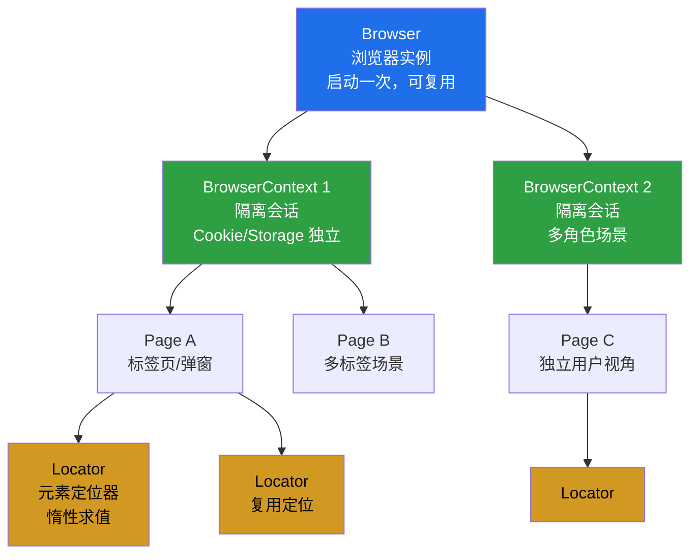
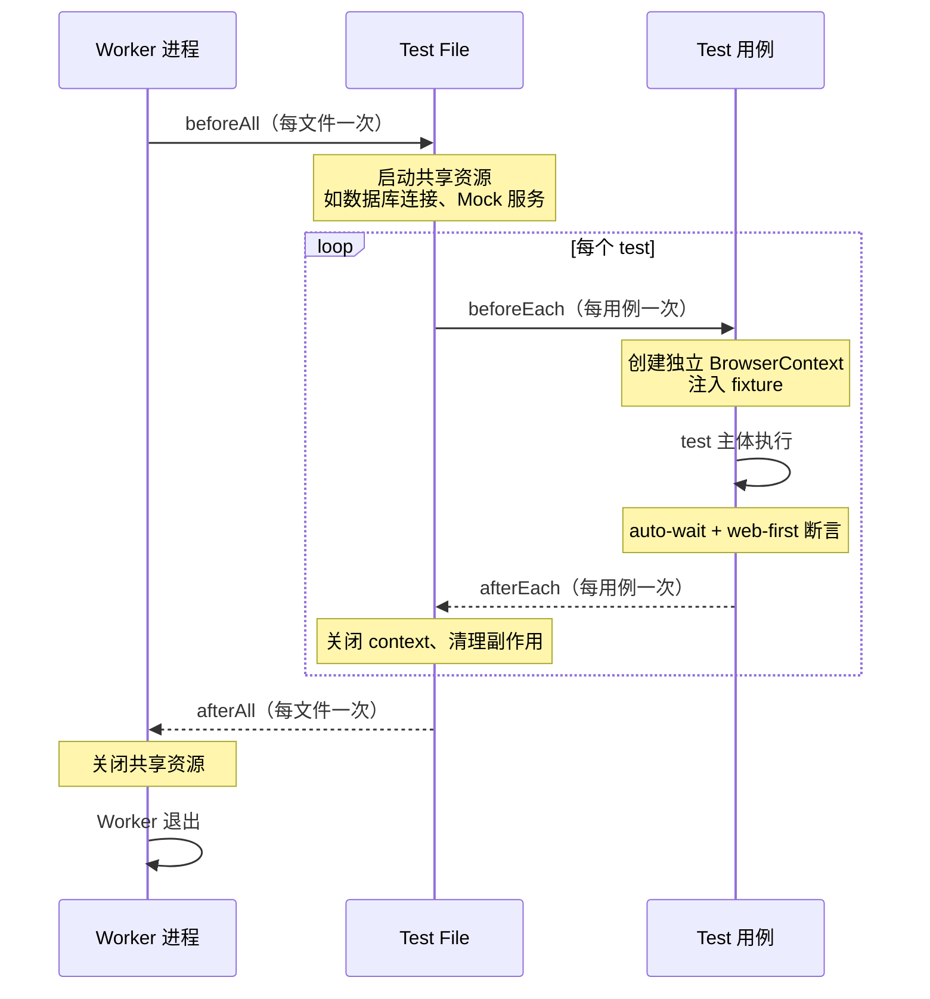

# Playwright 1.61 实战（含组件测试）

Playwright 是 Microsoft 主导开发的现代端到端（E2E）Web 测试框架，以"零配置、自动等待、内置断言、跨浏览器、跨语言"为核心特征，自 2020 年发布以来逐步成为 GUI 自动化测试的事实标准。本文基于 Playwright 1.61.0（2026 年最新稳定版，配套 Chromium 149、Firefox 151、WebKit 26.5），系统讲解核心概念、环境搭建、API 体系、测试编写、组件测试、1.61 新特性、CI/CD 集成与最佳实践，帮助读者在前端工程化体系中建立稳定可维护的 GUI 测试工作流。

## 一、核心概念

### 1.1 Playwright 是什么

Playwright 是一套开源的浏览器自动化框架，通过单一 API 同时驱动 Chromium、Firefox、WebKit 三大浏览器内核，并官方支持 JavaScript/TypeScript、Python、Java 与 .NET 四种语言绑定。其底层基于 CDP（Chrome DevTools Protocol）与各浏览器自带的调试协议，对每个浏览器打补丁后打包发布，从而保证 API 行为在三套内核上完全一致。

Playwright 解决的核心痛点包括：

- **跨浏览器一致性**：同一份脚本可在三套内核上运行，无需为 Selenium 不同 Driver 的差异买单；
- **自动等待（auto-waiting）**：所有交互动作（`click`、`fill`、`press`）在执行前自动等待元素可操作，消除 90% 的显式 `sleep`；
- **Web 优先断言（web-first assertions）**：断言会自动重试直到超时，天然适配异步渲染的前端框架；
- **测试隔离**：每个测试用例拥有独立的 BrowserContext（隔离的 Cookie、LocalStorage、IndexedDB），互不污染；
- **内置可观测**：开箱即用的截图、视频、Trace Viewer，失败排查无需额外工具；
- **零配置**：`npm init playwright@latest` 一条命令完成脚手架、浏览器与配置文件初始化。

### 1.2 Playwright vs Selenium

Selenium 经历十余年演进，企业生态与协议标准化（W3C WebDriver）成熟，但在现代前端工程化场景下，其架构特征逐渐显出短板。两者关键差异如下：

| 维度 | Selenium 4 | Playwright 1.61 |
|------|-----------|-----------------|
| 驱动协议 | W3C WebDriver（HTTP 单连接） | CDP / 浏览器原生调试协议（多路复用） |
| 自动等待 | 需显式 `WebDriverWait` | 内置 auto-waiting |
| 断言机制 | 第三方（TestNG/PyTest） | 内置 web-first assertions，自动重试 |
| 测试隔离 | 共享 Session，需手动清理 | 每 test 独立 BrowserContext |
| 跨浏览器 | 多 Driver 差异 | 三内核 API 一致 |
| 录制 | Selenium IDE（独立插件） | `playwright codegen` 内置 |
| 录屏/Trace | 需第三方 | 内置 video + Trace Viewer |
| 组件测试 | 不支持 | 实验性 ct-react/vue/svelte |
| CI 集成 | 需 Selenium Grid | 内置 sharding + Docker 镜像 |
| 速度 | HTTP 轮询，较慢 | 协议直连，快 2-3 倍 |

选型结论：**新项目、现代前端框架、CI 重度依赖**首选 Playwright；**存量 Java 生态、W3C 协议合规要求、跨多浏览器版本兼容测试**仍可保留 Selenium。两者并非互斥，可在不同业务线并行。

### 1.3 核心架构层级

Playwright 的 API 严格遵循"浏览器实例 → 上下文 → 页面 → 定位器"的层级模型，理解层级是正确编写测试的前提。



层级设计的关键含义：Browser 启动开销大，应尽量复用；BrowserContext 创建极快（毫秒级），是测试隔离的最小单元；Page 对应一个标签页或弹窗；Locator 是惰性求值的元素句柄，DOM 变化后自动重新解析，避免了 Selenium 中 `StaleElementReferenceException` 的痛点。

## 二、环境搭建

### 2.1 初始化项目

Playwright 提供 `create-playwright` 脚手架，一条命令完成依赖安装、浏览器下载与配置文件生成：

```bash
# 1. 初始化（交互式选择 TS/JS、目录、是否安装 GitHub Actions）
npm init playwright@latest

# 2. 显式安装浏览器二进制（CI 中需单独执行）
npx playwright install

# 3. 仅安装指定浏览器，节省 CI 时间
npx playwright install chromium firefox

# 4. 安装系统依赖（Linux 容器中必需）
npx playwright install-deps
```

### 2.2 项目结构

脚手架生成的标准结构如下：

```
my-e2e/
├── playwright.config.ts     # 全局配置
├── tests/
│   ├── example.spec.ts      # 测试用例
│   └── fixtures.ts          # 自定义 fixture
├── tests-examples/          # 示例代码
└── playwright-report/       # 测试报告（gitignore）
```

### 2.3 配置文件详解

`playwright.config.ts` 是 Playwright 的中枢，控制浏览器、并发、重试、报告、Trace 等所有运行时行为：

```typescript
import { defineConfig, devices } from '@playwright/test';

export default defineConfig({
  // 1. 测试目录与匹配模式
  testDir: './tests',
  fullyParallel: true,          // 所有用例并行
  forbidOnly: !!process.env.CI, // CI 中禁止 test.only
  retries: process.env.CI ? 2 : 0, // CI 重试 2 次，本地不重试
  workers: process.env.CI ? 4 : undefined, // CI 限制并发数

  // 2. 报告器
  reporter: [
    ['html', { open: 'never' }],          // 本地 HTML 报告
    ['list'],                              // 控制台列表
    ['junit', { outputFile: 'junit.xml' }], // CI 解析用
  ],

  // 3. 全局行为
  use: {
    baseURL: 'https://demo.example.com',  // 相对路径的基准地址
    trace: 'on-first-retry',              // 首次重试时采集 Trace
    screenshot: 'only-on-failure',        // 失败时截图
    video: 'retain-on-failure',           // 失败时保留视频
    actionTimeout: 10_000,                // 单个动作超时 10s
    navigationTimeout: 30_000,            // 导航超时 30s
  },

  // 4. 多浏览器项目配置
  projects: [
    { name: 'chromium', use: { ...devices['Desktop Chrome'] } },
    { name: 'firefox',  use: { ...devices['Desktop Firefox'] } },
    { name: 'webkit',   use: { ...devices['Desktop Safari'] } },
    { name: 'mobile',   use: { ...devices['Pixel 7'] } },
  ],
});
```

## 三、核心 API

### 3.1 Browser / BrowserContext / Page

三者构成 Playwright 操作的骨架。测试用例通常通过 fixture 注入 `page`，无需手动管理 Browser 生命周期；但理解底层模型有助于排查复杂场景：

```typescript
import { test, expect } from '@playwright/test';

test('登录后跳转主页', async ({ page, context }) => {
  // page 由 fixture 自动创建，每个 test 独立 BrowserContext
  await page.goto('/login');

  // 同时打开新页面验证多角色（同一 context 共享会话）
  const page2 = await context.newPage();

  // 关闭 context 即销毁所有会话状态
  await context.close();
});
```

### 3.2 Locator 定位器

Locator 是 Playwright 推荐的元素定位方式，惰性求值、自动重试，应**完全避免**使用 `page.$`、`page.waitForSelector` 等旧 API：

```typescript
import { test, expect } from '@playwright/test';

test('Locator 最佳实践', async ({ page }) => {
  // 优先级：getByRole > getByLabel > getByText > css > xpath
  await page.goto('/register');

  // 1. 语义化定位（推荐）
  const emailInput = page.getByRole('textbox', { name: '邮箱' });
  const submitBtn  = page.getByRole('button', { name: '注册' });

  // 2. 链式过滤：先定位卡片再定位按钮
  const cardBtn = page.locator('.product-card').filter({ hasText: 'Pro' })
                    .getByRole('button', { name: '购买' });

  // 3. 等价断言：自动重试至超时
  await expect(emailInput).toBeVisible();
  await expect(cardBtn).toHaveCount(1);

  // 4. 交互：内置 auto-wait，无需手动等待
  await emailInput.fill('user@example.com');
  await submitBtn.click();
});
```

### 3.3 auto-waiting 机制

所有交互动作（`click`、`fill`、`check`、`selectOption`、`press`）在执行前会自动等待元素满足以下条件：已附加到 DOM、可见、可交互（非 disabled）、稳定（无动画）。这消除了 Selenium 时代大量显式等待的负担。但需注意：**auto-wait 只对交互动作生效，对 `page.textContent()` 这类读取方法不生效**，读取前应配合 web-first 断言。

### 3.4 Web-first assertions

web-first 断言是 Playwright 区别于其他框架的关键能力。断言会在超时窗口内自动重试，避免因异步渲染导致的偶发失败：

```typescript
import { test, expect } from '@playwright/test';

test('异步列表加载', async ({ page }) => {
  await page.goto('/orders');

  // 错误：直接读取，可能拿不到值
  // const text = await page.textContent('.count');

  // 正确：web-first 断言自动重试
  await expect(page.locator('.count')).toHaveText('128', { timeout: 10_000 });

  // 常用断言：toBeVisible / toBeEnabled / toHaveText / toHaveCount
  // toContainText / toHaveAttribute / toHaveURL / toHaveTitle
  await expect(page).toHaveURL(/orders\?status=/);
  await expect(page.getByTestId('toast')).toContainText('成功');
});
```

## 四、测试编写

### 4.1 测试执行生命周期

Playwright 提供完整的 hooks 体系，理解其触发顺序对编写稳定的前置/后置逻辑至关重要。



```typescript
import { test, expect } from '@playwright/test';

test.describe('订单管理', () => {
  test.beforeAll(async () => {
    // 整个 describe 内仅执行一次，适合启动 Mock 服务
  });

  test.beforeEach(async ({ page }) => {
    // 每个用例执行前自动登录，复用 storageState 更高效
    await page.goto('/login');
    await page.getByLabel('用户名').fill('admin');
    await page.getByLabel('密码').fill('pwd');
    await page.getByRole('button', { name: '登录' }).click();
    await expect(page).toHaveURL('/dashboard');
  });

  test('创建订单', async ({ page }) => {
    await page.getByRole('link', { name: '新建订单' }).click();
    await page.getByLabel('商品').fill('SKU-001');
    await page.getByRole('button', { name: '提交' }).click();
    await expect(page.getByTestId('order-id')).toBeVisible();
  });

  test.afterEach(async ({ page }, testInfo) => {
    // 失败时额外截图，testInfo 携带用例元信息
    if (testInfo.status !== testInfo.expectedStatus) {
      await page.screenshot({ path: `fail-${testInfo.title}.png` });
    }
  });
});
```

### 4.2 Fixture 系统

Fixture 是 Playwright 的依赖注入机制，用于复用自定义资源（如登录态、Mock 服务、测试数据），避免 `beforeEach` 中堆积重复代码。Fixture 按需创建、自动销毁，并支持依赖传递：

```typescript
import { test as base, expect } from '@playwright/test';
import { ApiClient } from '../src/api-client';

// 1. 扩展 fixture 类型
type Fixtures = {
  authedPage: import('@playwright/test').Page;
  apiClient: ApiClient;
};

export const test = base.extend<Fixtures>({
  // 2. 自动登录的 Page
  authedPage: async ({ browser }, use) => {
    const context = await browser.newContext({
      storageState: 'tests/.auth/admin.json', // 复用登录态文件
    });
    const page = await context.newPage();
    await use(page);
    await context.close();
  },

  // 3. 依赖 authedPage 的 API 客户端
  apiClient: async ({ authedPage }, use) => {
    const client = new ApiClient(authedPage);
    await use(client);
  },
});

export { expect };

// 使用：参数即依赖，Playwright 自动注入
test('查询订单列表', async ({ apiClient, authedPage }) => {
  const orders = await apiClient.listOrders();
  expect(orders.length).toBeGreaterThan(0);
});
```

### 4.3 参数化测试

Playwright 通过 `for` 循环配合 `test.describe` 实现参数化，比 `test.each` 更直观，且能保留独立的测试报告条目：

```typescript
const cases = [
  { user: 'admin',    expectRole: '管理员' },
  { user: 'operator', expectRole: '运营' },
  { user: 'viewer',   expectRole: '访客' },
];

for (const { user, expectRole } of cases) {
  test(`用户 ${user} 看到角色 ${expectRole}`, async ({ page }) => {
    await page.goto(`/profile?u=${user}`);
    await expect(page.getByTestId('role')).toHaveText(expectRole);
  });
}
```

### 4.4 Trace Viewer 排障

Trace Viewer 是 Playwright 的杀手级排障工具，记录每次动作的 DOM 快照、网络请求、控制台日志、截图，可在本地以时间轴回放失败用例：

```bash
# 1. 触发 Trace 采集（配置中已设 trace: 'on-first-retry'）
npx playwright test --trace=on

# 2. 打开 Trace（自动加载最近一次失败）
npx playwright show-trace trace.zip

# 3. 直接查看 HTML 报告中的 Trace 链接
npx playwright show-report
```

Trace 界面提供四大视图：**Timeline**（动作时间轴）、**Snapshot**（每步 DOM 快照，可前后切换）、**Network**（请求瀑布图）、**Console**（日志与错误）。对于偶发失败，重试 + Trace 是定位根因的最高效组合。

## 五、组件测试

组件测试（Component Testing）允许直接挂载 React/Vue/Svelte 组件进行隔离测试，无需启动完整应用，介于单元测试与 E2E 之间，适合验证组件交互逻辑与样式。1.61 中通过 `@playwright/experimental-ct-react` 等包提供，仍为实验性但已可用于生产。（注：官方已在 1.62 之后移除这些实验性 CT 包，使用更高版本时需按官方迁移指南改用基于 Story gallery 的内置 `mount` 方案。）

### 5.1 安装与配置

```bash
# React 项目
npm install -D @playwright/experimental-ct-react

# Vue / Svelte 项目
npm install -D @playwright/experimental-ct-vue
npm install -D @playwright/experimental-ct-svelte
```

组件测试使用独立的 `playwright-ct.config.ts`，关键差异在于 `webServer` 指向 Vite Dev Server：

```typescript
import { defineConfig, devices } from '@playwright/experimental-ct-react';

export default defineConfig({
  testDir: './src/components/__tests__',
  use: {
    ctViteConfig: 'vite.config.ts',     // 复用项目 Vite 配置
    trace: 'retain-on-failure',
  },
  projects: [
    { name: 'chromium', use: { ...devices['Desktop Chrome'] } },
  ],
});
```

### 5.2 挂载组件与交互断言

```typescript
import { test, expect } from '@playwright/experimental-ct-react';
import { Counter } from '../Counter';

test('计数器交互', async ({ mount }) => {
  // 1. 挂载组件到隔离页面，返回组件根 Locator
  const component = await mount(<Counter initial={5} />);

  // 2. 断言初始状态
  await expect(component.getByText('当前：5')).toBeVisible();

  // 3. 触发交互：与 E2E 完全一致的 API
  await component.getByRole('button', { name: '加一' }).click();
  await component.getByRole('button', { name: '加一' }).click();

  // 4. web-first 断言验证结果
  await expect(component.getByText('当前：7')).toBeVisible();
});

test('透传 props 与事件', async ({ mount }) => {
  let lastValue = 0;
  const component = await mount(
    <Counter initial={0} onChange={(v) => (lastValue = v)} />
  );
  await component.getByRole('button').click();
  expect(lastValue).toBe(1);
});
```

组件测试相比 E2E 的优势在于**毫秒级启动、定位精确、可断言内部状态**；相比单元测试的优势在于**真实浏览器渲染、真实事件、可断言 DOM 与样式**。建议将组件测试用于：复杂表单交互、受控组件逻辑、UI 状态机验证、视觉回归。

## 六、1.61 新特性

### 6.1 Video 模式增强

1.61 重构了视频录制策略，新增三种粒度模式，可精确控制磁盘占用与排障价值的平衡：

| 模式 | 行为 | 适用场景 |
|------|------|---------|
| `off` / `on` | 关闭 / 全量录制 | 默认关闭；CI 调试期全量 |
| `on-first-retry` | 仅首次重试时录制 | 排查"重试后通过"的用例 |
| `retain-on-failure` | 仅失败用例保留视频 | 推荐：失败可回放、成功不占盘 |
| `retain-on-first-failure` | 仅首次失败保留 | 节省磁盘，避免重试重复录制 |
| `retain-on-failure-and-retries` | 失败及其重试均保留 | 排查重试后偶发成功 |
| `on-all-retries` | 所有重试都录制 | 重试行为分析 |

```typescript
// playwright.config.ts
use: {
  video: 'retain-on-first-failure',
}
```

旧版本仅有 `off / on / retain-on-failure / retain-on-first-failure` 四种；1.61 新增 `on-first-retry / on-all-retries / retain-on-failure-and-retries` 三种粒度，让大型测试套件的 CI 存储成本可控。

### 6.2 UI Mode

UI Mode 是 Playwright 的本地调试利器，提供时间旅行、DOM 检视、Watch 模式：

```bash
# 启动 UI Mode，自动监听文件变化并重跑
npx playwright test --ui

# 配合指定项目
npx playwright test --ui --project=chromium
```

UI Mode 集成 Trace 预览、Source Map、过滤器，是本地开发阶段替代反复 `console.log` 的首选方式。

### 6.3 Codegen 录制

`codegen` 通过监听用户操作自动生成测试代码，是快速搭建脚手架与学习 Locator 的利器：

```bash
# 1. 基础录制
npx playwright codegen https://demo.example.com

# 2. 保存登录态后再录制（避免重复登录）
npx playwright codegen --save-storage=auth.json https://demo.example.com

# 3. 加载已有登录态继续录制
npx playwright codegen --load-storage=auth.json https://demo.example.com

# 4. 模拟设备
npx playwright codegen --device='iPhone 15' https://demo.example.com
```

录制生成的代码应作为**起点而非终点**，需人工重构为 Page Object 或 fixture，避免脆弱的选择器。

## 七、CI/CD 集成

### 7.1 GitHub Actions

Playwright 官方提供 Action 一键集成，包含浏览器缓存与依赖管理：

```yaml
# .github/workflows/e2e.yml
name: E2E Tests
on:
  pull_request:
  push:
    branches: [main]

jobs:
  test:
    timeout-minutes: 30
    runs-on: ubuntu-latest
    strategy:
      fail-fast: false
      matrix:
        shardIndex: [1, 2, 3, 4]   # 4 路分片并行
        shardTotal: [4]
    steps:
      - uses: actions/checkout@v4

      - uses: actions/setup-node@v4
        with:
          node-version: 20
          cache: 'npm'

      - run: npm ci

      # 官方 Action：安装 Playwright 浏览器与系统依赖
      - name: Install Playwright Browsers
        uses: microsoft/playwright-github-action@v1

      - name: Run tests (sharded)
        run: npx playwright test --shard=${{ matrix.shardIndex }}/${{ matrix.shardTotal }}

      - name: Upload HTML report
        if: ${{ !cancelled() }}
        uses: actions/upload-artifact@v4
        with:
          name: playwright-report-${{ matrix.shardIndex }}
          path: playwright-report/
          retention-days: 14
```

### 7.2 Docker 与并行执行

CI 中推荐使用官方镜像避免系统依赖问题；大规模套件通过 `--shard` 拆分到多个 Job 并行执行：

```dockerfile
# Dockerfile.ci
FROM mcr.microsoft.com/playwright:v1.61.0-jammy
WORKDIR /app
COPY package*.json ./
RUN npm ci
COPY . .
CMD ["npx", "playwright", "test"]
```

```bash
# 4 路分片（每个 Job 跑 1/4 用例）
npx playwright test --shard=1/4
npx playwright test --shard=2/4
npx playwright test --shard=3/4
npx playwright test --shard=4/4

# 合并分片报告（跨 shard 合并）
npx playwright merge-reports --reporter html ./blob-report
```

## 八、常见陷阱与最佳实践

### 8.1 常见陷阱

1. **滥用 `page.waitForTimeout`**：硬等待是 flaky 测试的头号来源。应使用 web-first 断言或 `page.waitForResponse`，仅在无法观察 DOM 变化的场景（如第三方动画）下作为兜底，并配合断言而非单独使用。

2. **使用脆弱选择器**：XPath / CSS 类名随构建变化而失效。应优先 `getByRole` / `getByLabel` / `getByTestId`，让测试与实现解耦，同时顺便验证可访问性。

3. **测试间状态泄漏**：跨用例共享登录态会导致一个用例的副作用污染下一个。每个 test 应通过独立 BrowserContext 隔离，共享态写入 `storageState` 文件后由 fixture 注入。

4. **在 CI 用 `headless: false`**：headed 模式在无显示器的 CI 容器中会崩溃。CI 必须保持 headless，并通过 Trace + 截图排障。

5. **忽略网络条件**：Mock 不全的第三方接口会导致 flaky。应使用 `page.route` 拦截关键请求返回确定性数据。

### 8.2 最佳实践

- **测试金字塔**：E2E 仅覆盖核心业务链路（占比 < 10%），细节由单元测试与组件测试覆盖，避免 E2E 套件膨胀拖慢 CI；
- **Page Object + Fixture 组合**：用 Page Object 封装页面结构与操作，用 Fixture 注入 Page Object 实例，兼顾可读性与可维护性；
- **数据自包含**：每个测试通过 API 或工厂函数创建自己的测试数据，用例间不依赖执行顺序，`test.beforeEach` 中清理残留；
- **断言单一职责**：一个测试只验证一个行为，失败原因清晰；多断言分散到多个用例，避免一处失败掩盖后续问题；
- **失败可观测**：默认开启 `trace: 'on-first-retry'`、`screenshot: 'only-on-failure'`、`video: 'retain-on-first-failure'`，在磁盘成本与排障效率间取得平衡；
- **定期清理 Trace**：CI 中 `retention-days` 设为 7-14 天，避免对象存储膨胀。

## 结语

Playwright 1.61 凭借 auto-waiting、web-first assertions、test isolation 与 Trace Viewer 构成了现代 GUI 测试的基线能力，组件测试填补了单元测试与 E2E 之间的断层，新的 video 模式让 CI 可观测性进一步细化。落地时应遵循测试金字塔分层、Fixture 注入共享逻辑、断言单一职责，方能避免 flaky 测试侵蚀团队对自动化套件的信任。掌握 Playwright 不仅是掌握一个工具，更是建立"测试即代码、可观测、可演进"的工程文化。
