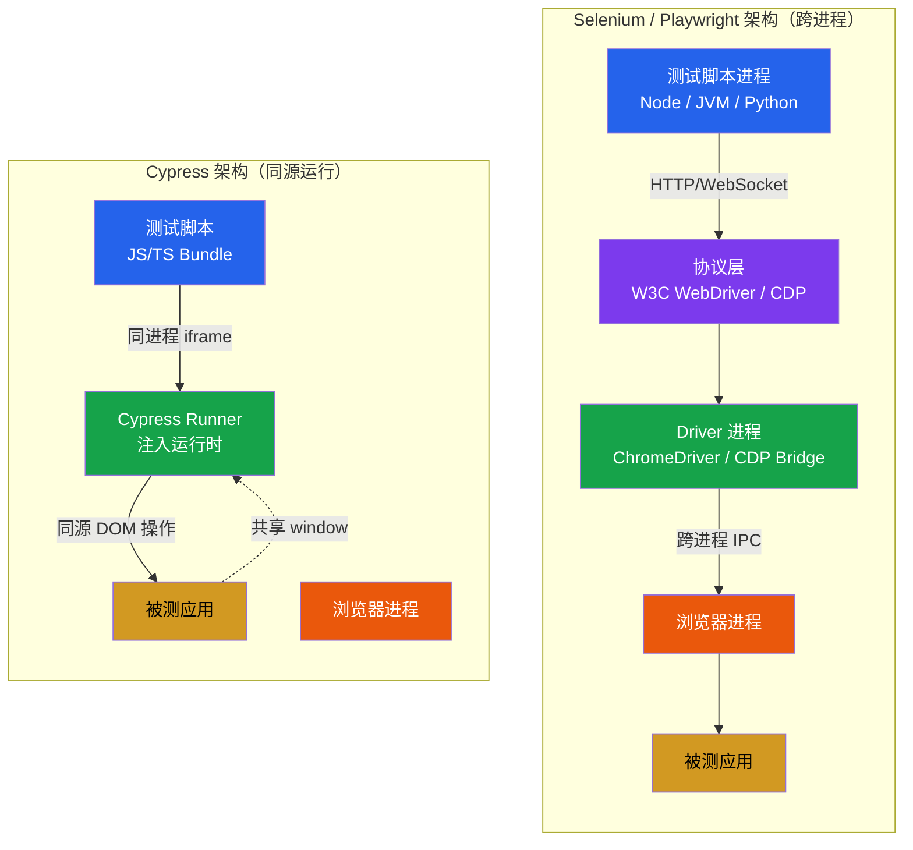
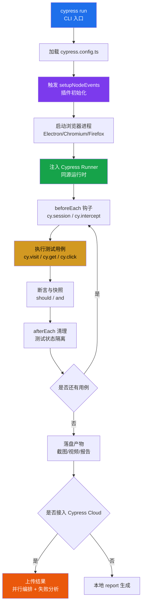

# Cypress 15 实战

Cypress 是面向现代 Web 应用的下一代端到端测试框架，以"开发者友好、同源运行、时间旅行调试、零配置上手"为核心特征。本文基于 **Cypress 15.x（2026 年最新稳定主线）** 系统讲解其核心架构、环境搭建、核心 API、网络拦截、自定义命令、组件测试、CI/CD 与 Cypress Cloud 集成以及常见陷阱，帮助读者在前端工程化体系中建立稳定可维护的 GUI 测试工作流。

## 一、核心概念

### 1.1 Cypress 是什么

Cypress 是一套开源的 Web 自动化测试框架，专为现代前端应用（React、Vue、Angular、Svelte 等）设计。与传统 E2E 工具相比，Cypress 最大的差异化在于其**同源运行（same-origin execution）**架构：测试脚本与被测应用运行在同一个浏览器进程内，由 Cypress 注入的运行时（Cypress Runner）直接驱动 DOM 与 Window 对象，而非通过外部 Driver 进程跨进程通信。

Cypress 解决的核心痛点包括：

- **实时重载（live reload）**：保存测试文件后自动重新执行，开发反馈接近秒级；
- **时间旅行调试（time travel）**：每个命令的执行快照都被记录，可在命令日志中回溯任意时刻的 DOM 状态；
- **自动等待**：内置 retry，元素可操作前自动等待，无需手写 `sleep` 或 `WebDriverWait`；
- **同源访问**：可直接读取 `window`、`document`、应用内状态（如 Redux/Vue Store），无需额外桥接；
- **组件测试**：原生支持 React/Vue/Svelte/Angular 组件挂载测试，与 E2E 共享同一套工具链；
- **Cypress Cloud**：内置的并行执行、失败分析、测试编排与录屏回放平台。

### 1.2 同源运行 vs WebDriver：架构差异

理解 Cypress 的关键在于理解其"同源运行"与 WebDriver"跨进程驱动"的本质差异。Selenium 与 Playwright 均采用外部进程通过协议（W3C WebDriver / CDP）驱动浏览器，而 Cypress 将测试运行时直接注入被测应用的同一浏览器实例，测试代码与应用共享同一个事件循环。



同源架构带来三个直接收益：一是命令执行延迟更低（无 HTTP 往返）；二是可直接访问应用内部状态（`cy.window()`、`cy.state()`），便于断言业务模型而非仅断言 DOM；三是网络拦截天然内置（同源可劫持 `fetch`/`XHR`）。代价是 Cypress 长期只能驱动 Chromium 内核与 Firefox，**不支持 WebKit**，且历史上面向同源策略的限制较多——Cypress 12 起 `cy.origin()` 已转正稳定，多源支持随之可用。

### 1.3 Cypress vs Selenium vs Playwright

| 维度 | Selenium 4 | Playwright 1.61 | Cypress 15 |
|------|-----------|-----------------|-----------|
| 架构 | 跨进程 WebDriver | 跨进程 CDP | 同源运行（注入浏览器） |
| 浏览器支持 | Chrome/Firefox/Edge/Safari | Chromium/Firefox/WebKit | Chromium/Firefox/Edge |
| 自动等待 | 需显式 `WebDriverWait` | 内置 auto-waiting | 内置 retry |
| 断言机制 | 第三方（TestNG/Jest） | web-first assertions | `should` 链式重试 |
| 网络拦截 | BiDi 增强 | `route()` | `cy.intercept()` |
| 组件测试 | 不支持 | 实验性 ct-react/vue | 原生稳定（CT 模块） |
| 录制 | Selenium IDE | `codegen` | Cypress Studio（实验性） |
| 多 Tab/多 Origin | 支持 | 支持 | 12+ 稳定（`cy.origin`） |
| 测试隔离 | 共享 Session | 独立 BrowserContext | 每 test 独立 viewport/cookie |
| CI 并行 | Selenium Grid | sharding | Cypress Cloud orchestration |
| 语言绑定 | Java/C#/Py/Ruby/JS/Kotlin | JS/TS/Py/Java/.NET | 仅 JS/TS |

选型结论：**前端团队主导、React/Vue 项目、重视调试体验与开发反馈**首选 Cypress；**跨内核矩阵测试、Java/Python 生态、CI 重度并行**仍以 Playwright 为优；**Selenium 适合存量 W3C 协议合规场景与 Safari 兼容性验证**。三者并非互斥，可按业务线组合使用。

### 1.4 Cypress 测试执行流程

Cypress 一次完整的测试执行涉及插件初始化、配置加载、浏览器启动、用例执行与产物落盘五个阶段，理解该流程有助于排查"为什么我的 mock 没生效""为什么 beforeEach 失败"等问题。



流程中几个关键点：`setupNodeEvents` 在 Node 侧运行，可访问文件系统、启动数据库容器或注册任务（`cy.task`）；`cy.intercept` 必须在 `cy.visit` 之前注册，否则首次请求会绕过 stub；`cy.session` 在 15.x 已是稳定 API，跨用例复用登录态显著加速套件。

## 二、环境搭建

### 2.1 初始化项目

```bash
# 1. 安装 Cypress（最新 15.x）
npm install --save-dev cypress

# 2. 首次启动，自动生成配置与脚手架
npx cypress open

# 3. 选择 E2E 或 Component Testing 模式
# 4. 选择浏览器（Chromium / Firefox / Edge）
```

脚手架生成的标准结构：

```
my-app/
├── cypress/
│   ├── e2e/                 # E2E 测试用例
│   │   └── login.cy.ts
│   ├── component/           # 组件测试用例
│   │   └── Button.cy.tsx
│   ├── fixtures/            # 测试数据（JSON）
│   │   └── user.json
│   ├── support/             # 自定义命令与全局钩子
│   │   ├── commands.ts
│   │   └── e2e.ts
│   └── downloads/           # 下载产物
├── cypress.config.ts        # 全局配置
└── package.json
```

### 2.2 配置文件详解

`cypress.config.ts` 是 Cypress 的中枢，控制 baseUrl、视口、超时、浏览器、截图视频策略、Cloud 集成等：

```typescript
import { defineConfig } from 'cypress';

export default defineConfig({
  // 文件预处理器：TypeScript / Babel
  e2e: {
    baseUrl: 'http://localhost:5173',     // 被测应用入口
    specPattern: 'cypress/e2e/**/*.cy.ts',
    supportFile: 'cypress/support/e2e.ts',
    viewportWidth: 1280,
    viewportHeight: 720,
    defaultCommandTimeout: 8000,          // 默认命令超时（ms）
    requestTimeout: 10000,
    responseTimeout: 30000,
    video: true,                           // 录制视频
    screenshotOnRunFailure: true,
    setupNodeEvents(on, config) {
      // 插件注册：覆盖率、视觉对比、任务等
      on('task', {
        // 自定义 Node 任务，供 cy.task 调用
        seedDatabase: (fixture) => {
          require('./scripts/seed')(fixture);
          return null;
        },
      });
      return config;
    },
  },
  // 组件测试配置
  component: {
    devServer: {
      framework: 'react',                  // 或 'vue' / 'angular' / 'svelte'
      bundler: 'vite',
    },
    specPattern: 'cypress/component/**/*.cy.{tsx,ts}',
  },
  // Cypress Cloud（可选）
  projectId: 'abc123',
  env: {
    apiUrl: 'https://api.example.com',
    coverage: true,
  },
});
```

### 2.3 TypeScript 支持

Cypress 内置 TypeScript 转译，无需额外构建配置。在 `cypress/support/e2e.ts` 中添加：

```typescript
import './commands';

// 全局类型扩展（自定义命令的类型补全）
declare global {
  namespace Cypress {
    interface Chainable {
      loginByApi(email: string, password: string): Chainable<void>;
      dataCy(selector: string): Chainable<JQuery<HTMLElement>>;
    }
  }
}
```

## 三、核心 API

### 3.1 基础命令链

Cypress 命令采用链式 API，每条命令返回 `Chainable` 对象，命令按队列顺序异步执行：

```typescript
describe('登录流程', () => {
  beforeEach(() => {
    cy.visit('/login');                    // 访问登录页
  });

  it('使用有效凭证登录成功', () => {
    cy.get('[data-cy=email]')
      .type('user@example.com')            // 输入邮箱
      .should('have.value', 'user@example.com');

    cy.get('[data-cy=password]')
      .type('P@ssw0rd!')
      .type('{enter}');                    // 模拟回车提交

    // 断言路由跳转与欢迎信息
    cy.url().should('include', '/dashboard');
    cy.contains('欢迎回来').should('be.visible');
  });
});
```

### 3.2 断言与别名

Cypress 断言基于 Chai、Sinon 与 Chai-jQuery，使用 `should` / `and` 链式调用，且**自带重试**——断言失败会自动重试直到 `defaultCommandTimeout`：

```typescript
// 1. 状态断言
cy.get('.notification').should('be.visible');
cy.get('.count').should('have.text', '42');

// 2. 类断言
cy.get('button').should('have.class', 'is-loading');

// 3. 多重断言链
cy.get('.user-card')
  .should('be.visible')
  .and('contain', '张三')
  .and('have.attr', 'data-role', 'admin');

// 4. 别名（as）：复用 DOM 引用，避免重复查询
cy.get('.user-list li').eq(0).as('firstUser');
cy.get('@firstUser').should('contain', '张三');
cy.get('@firstUser').find('.role').should('have.text', '管理员');
```

### 3.3 命令执行的本质

Cypress 命令**并非立即执行**，而是被推入命令队列，由 Runner 在事件循环空闲时依次消费。这意味着 `cy.get()` 返回的不是元素本身，而是 `Chainable`。理解这一点是规避"变量赋值无效"陷阱的前提：

```typescript
// 反例：变量赋值失效
let userName;
cy.get('.name').invoke('text').then((text) => {
  userName = text;                          // 仅在回调内可用
});
console.log(userName);                      // undefined —— 命令尚未执行

// 正例：闭包传递
cy.get('.name').invoke('text').then((name) => {
  cy.get('.greeting').should('contain', `你好，${name}`);
});
```

## 四、网络拦截与 Mock

### 4.1 cy.intercept 基础

`cy.intercept` 是 Cypress 的核心网络层 API，可拦截 `fetch` 与 `XHR`，支持 stub、动态修改、延迟注入等场景。相比旧版 `cy.route`，它不再依赖 jQuery，且能拦截非同源请求：

```typescript
// 1. 静态 stub：用 fixture 数据替代真实响应
cy.intercept('GET', '/api/users', { fixture: 'users.json' }).as('getUsers');

// 2. 动态 stub：根据请求构造响应
cy.intercept('POST', '/api/login', (req) => {
  const { email, password } = req.body;
  if (email === 'admin@test.com' && password === 'secret') {
    req.reply({ statusCode: 200, body: { token: 'fake-jwt' } });
  } else {
    req.reply({ statusCode: 401, body: { error: 'invalid_credentials' } });
  }
}).as('login');

// 3. 透传并断言请求
cy.intercept('GET', '/api/products', (req) => {
  expect(req.headers['authorization']).to.include('Bearer ');
  req.continue();                            // 放行真实请求
}).as('getProducts');
```

### 4.2 fixture 与延迟模拟

`cypress/fixtures/users.json`：

```json
{
  "data": [
    { "id": 1, "name": "张三", "role": "admin" },
    { "id": 2, "name": "李四", "role": "member" }
  ]
}
```

延迟与错误注入用于验证加载态、超时与降级逻辑：

```typescript
// 模拟慢速网络（3 秒延迟）
cy.intercept('GET', '/api/dashboard', (req) => {
  req.reply({ delay: 3000, fixture: 'dashboard.json' });
}).as('slowDashboard');

// 模拟 502 网关错误
cy.intercept('GET', '/api/orders', { statusCode: 502, body: 'Bad Gateway' });

// 等待拦截请求并断言请求体
cy.visit('/dashboard');
cy.wait('@slowDashboard').its('request.url').should('include', '/dashboard');
```

## 五、自定义命令与插件

### 5.1 Cypress.Commands.add

将常用业务流程封装为自定义命令，可显著提升用例可读性与可维护性：

```typescript
// cypress/support/commands.ts
Cypress.Commands.add('loginByApi', (email: string, password: string) => {
  cy.request('POST', `${Cypress.env('apiUrl')}/auth/login`, { email, password })
    .then((res) => {
      cy.window().then((win) => {
        win.localStorage.setItem('token', res.body.token);
      });
    });
});

Cypress.Commands.add('dataCy', (selector: string) => {
  return cy.get(`[data-cy=${selector}]`);
});

Cypress.Commands.add('resetDb', () => {
  cy.task('seedDatabase', 'test-fixture');
});
```

### 5.2 cy.session 与 cypress-data-session

`cy.session` 在 15.x 是稳定 API，用于跨用例复用浏览器状态（如登录态），大幅降低重复登录开销：

```typescript
beforeEach(() => {
  cy.session('admin-user', () => {
    cy.loginByApi('admin@test.com', 'secret');
  });
});

it('查看仪表盘', () => {
  cy.visit('/dashboard');                   // 自动复用 session，无需重新登录
  cy.dataCy('metric-total').should('be.visible');
});
```

对于更复杂的会话共享（跨 spec、跨浏览器实例），社区生态 `cypress-data-session` 提供了基于 localStorage 与后端缓存的会话管理。典型场景包括：跨用例复用 OAuth 令牌、共享数据库快照、复用第三方 SSO 会话。

### 5.3 插件体系

Cypress 插件分两类：**Node 端插件**（在 `setupNodeEvents` 中注册，可访问文件系统、子进程、网络）与**浏览器端插件**（通过 `import` 在 support 中加载）。常用生态插件包括：

- `@cypress/code-coverage`：合并前端代码覆盖率；
- `cypress-axe`：基于 axe-core 的无障碍扫描；
- `cypress-image-snapshot`：像素级视觉回归；
- `@cypress/grep`：按标签筛选用例（`@smoke`、`@regression`）；
- `cypress-mailhog`：邮件捕获与断言。

### 5.4 视觉回归与无障碍扫描

视觉回归（Visual Regression）与无障碍（Accessibility）扫描是 Cypress 在前端质量门禁中两类高频场景。视觉回归通过对比基线截图与当前截图的像素差异，捕获 UI 意外变更；无障碍扫描则基于 axe-core 规则集，自动检测违反 WCAG 与 ARIA 标准的元素。

```typescript
// 1. 视觉回归（cypress-image-snapshot）
describe('首页视觉回归', () => {
  it('桌面视口截图应与基线一致', () => {
    cy.visit('/');
    cy.matchImageSnapshot('home-desktop', {
      failureThreshold: 0.03,            // 容忍 3% 像素差异
      failureThresholdType: 'percent',
    });
  });
});

// 2. 无障碍扫描（cypress-axe）
describe('无障碍合规检查', () => {
  it('登录页应通过 axe 扫描', () => {
    cy.visit('/login');
    cy.injectAxe();                       // 注入 axe-core
    cy.checkA11y(undefined, {
      runOnly: { type: 'tag', values: ['wcag2a', 'wcag2aa'] },
    });
  });

  it('忽略已知容差节点', () => {
    cy.checkA11y({
      exclude: ['.ad-banner', '[data-cy=legacy-widget]'],
    });
  });
});
```

视觉回归基线应纳入版本控制，并通过 PR 触发"更新基线"工作流；无障碍扫描建议作为 CI 必过门禁（gate），避免在迭代中累积 a11y 债务。

## 六、组件测试

Cypress 15 的组件测试（CT）模块已完全稳定，支持 React、Vue、Angular、Svelte、Preact、Lit、Html 等 7 个框架。CT 模式不启动完整 E2E 浏览器，而是直接挂载单个组件至隔离的容器中，适合验证组件的交互、状态与边界条件。

### 6.1 React 组件测试

```tsx
// cypress/component/Button.cy.tsx
import { mount } from 'cypress/react18';
import { Button } from '@/components/Button';

describe('Button 组件', () => {
  it('点击触发 onClick 回调', () => {
    const onClick = cy.stub().as('onClick');
    mount(<Button onClick={onClick}>提交</Button>);
    cy.get('button').click();
    cy.get('@onClick').should('have.been.calledOnce');
  });

  it('disabled 状态阻止点击', () => {
    const onClick = cy.stub();
    mount(<Button disabled onClick={onClick}>提交</Button>);
    cy.get('button').should('be.disabled').click({ force: true });
    cy.wrap(onClick).should('not.have.been.called');
  });
});
```

### 6.2 Vue 组件测试

```typescript
// cypress/component/Counter.cy.ts
import { mount } from 'cypress/vue';
import Counter from '@/components/Counter.vue';

describe('Counter 组件', () => {
  it('点击自增', () => {
    mount(Counter);
    cy.get('button').click().click();
    cy.get('.count').should('have.text', '2');
  });
});
```

CT 模式与 E2E 共享同一套断言、`cy.intercept`、`cy.fixture` 与运行时调试能力，使组件级回归与端到端回归可在同一仓库中无缝协作。

## 七、CI/CD 与 Cypress Cloud

### 7.1 命令行执行

```bash
# Headless 运行全部 E2E 用例
npx cypress run

# 指定浏览器
npx cypress run --browser chrome

# 仅运行 Component Testing
npx cypress run --component

# 按 tag 筛选用例（依赖 @cypress/grep）
npx cypress run --env grepTags=@smoke

# 生成 JUnit 报告
npx cypress run --reporter junit --reporter-options "mochaFile=results/test-output.xml"
```

### 7.2 GitHub Actions 集成

```yaml
name: E2E
on: [pull_request]
jobs:
  cypress-run:
    runs-on: ubuntu-22.04
    strategy:
      matrix:
        # 4 台并行机器
        containers: [1, 2, 3, 4]
    steps:
      - uses: actions/checkout@v4
      - uses: cypress-io/github-action@v6
        with:
          start: npm run dev
          wait-on: 'http://localhost:5173'
          record: true
          parallel: true
          browser: chrome
        env:
          # Cypress Cloud 凭证（启用并行编排与失败分析）
          CYPRESS_RECORD_KEY: ${{ secrets.CYPRESS_RECORD_KEY }}
          CYPRESS_PROJECT_ID: ${{ secrets.CYPRESS_PROJECT_ID }}
```

### 7.3 Cypress Cloud 能力

Cypress Cloud（商业服务）在 15.x 阶段提供四类核心能力：

- **并行编排**：自动将用例分发到多台 Runner，运行时长近似线性缩短；
- **失败分析**：基于 AI 自动归类相似失败，减少重复排查；
- **测试用例编排**：根据历史失败率自动优先执行高风险用例；
- **产物托管**：截图、视频、Trace 包集中存储，支持 PR 内联回放。

对开源团队，亦可使用 `cypress-split` 插件配合 GitHub Actions 矩阵实现本地并行，无需付费即可获得 80% 的加速效果。

## 八、常见陷阱与最佳实践

### 8.1 陷阱速查

| 陷阱 | 现象 | 规避 |
|------|------|------|
| 异步命令赋值 | 变量为 `undefined` | 使用 `.then()` 闭包或 `cy.wrap()` |
| `cy.intercept` 顺序 | mock 未生效 | 在 `cy.visit` 之前注册拦截 |
| 同源策略限制 | 跨域跳转失败 | 使用 `cy.origin()`（12+ 稳定） |
| `cy.wait(timeout)` 滥用 | 用例不稳定 | 改用 `cy.intercept + cy.wait('@alias')` |
| 共享状态污染 | 用例相互影响 | `beforeEach` 中 `cy.clearCookies()` / `cy.session` |
| 选择器脆弱 | DOM 重构后失效 | 优先 `data-cy` 语义化属性 |
| Webpack 重复编译 | CT 模式启动慢 | 启用 `devServer.bundler: 'vite'` |

### 8.2 最佳实践

1. **`data-cy` 优先于 CSS/XPath**：业务样式可能被重构，但测试钩子属性应稳定；
2. **Page Object 适度使用**：Cypress 推荐 `custom command` + `app-actions`（直接调用应用内部方法登录）而非传统 Page Object；
3. **App Actions 登录**：通过 `cy.window().then((win) => win.app.login(...))` 直接驱动应用状态，比 UI 登录快 10 倍以上；
4. **fixture 优先于硬编码**：测试数据集中管理，便于多环境复用；
5. **`cy.session` 复用登录态**：避免每个用例重复执行 OAuth 流程；
6. **CI 中禁用视频/截图**：仅在失败时保留，节省存储与运行时间；
7. **测试分层**：组件测试覆盖 70% 逻辑、E2E 覆盖 20% 关键路径、手工探索式测试覆盖 10% 边界；
8. **避免 `cy.pause()` 进入仓库**：调试用，提交前必须移除。

### 8.3 何时不要用 Cypress

虽然 Cypress 在前端 E2E 与组件测试领域体验优秀，但以下场景应审慎评估：

- **必须覆盖 Safari/WebKit**：Cypress 不支持 WebKit，需 Playwright 补位；
- **多 Tab、多 Window 重度依赖**：Cypress 通过 `cy.origin()` 与 popup 支持已大幅改善，但复杂多窗口场景仍弱于 Playwright；
- **后端服务协议测试**：Cypress 偏前端，纯接口契约测试更适合 Pact；
- **Java/Python 技术栈主导团队**：Cypress 仅支持 JS/TS，跨语言协作成本较高。

## 结语

Cypress 15 在保持"开发者友好"初心十余年的演进后，已成为现代前端工程化体系中 E2E 与组件测试的首选工具之一。其同源运行架构在调试体验与开发反馈上仍具不可替代性，而 `cy.session`、`cy.origin`、稳定的 Component Testing、Cypress Cloud 编排等能力补齐了其在大型项目规模化场景下的短板。在选型时，应基于团队技术栈、浏览器矩阵与 CI 投入综合判断，与 Playwright、Selenium 协同构建分层、稳定、可维护的 GUI 自动化测试体系。
